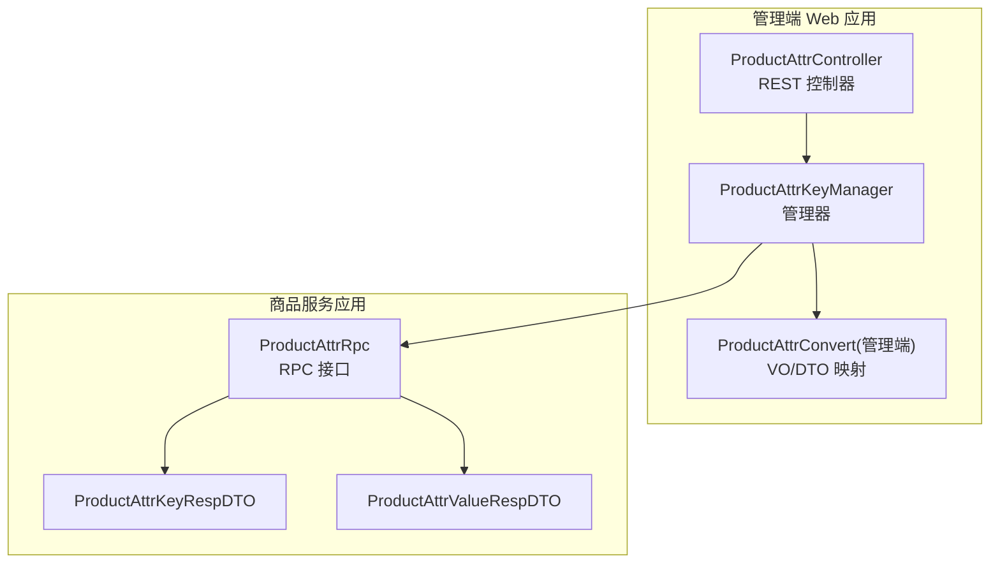
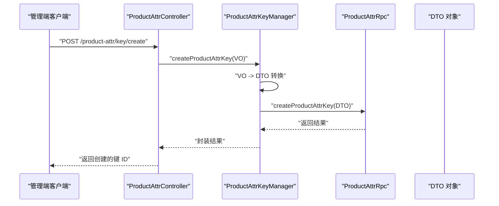
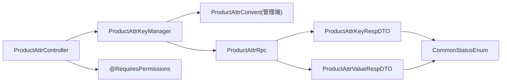

# 属性管理

<cite>
**本文引用的文件**
- [ProductAttrController.java](file://management-web-app/src/main/java/cn/iocoder/mall/managementweb/controller/product/ProductAttrController.java)
- [ProductAttrKeyManager.java](file://management-web-app/src/main/java/cn/iocoder/mall/managementweb/manager/product/ProductAttrKeyManager.java)
- [ProductAttrConvert.java（管理端转换器）](file://management-web-app/src/main/java/cn/iocoder/mall/managementweb/convert/product/ProductAttrConvert.java)
- [ProductAttrConvert.java（业务层转换器）](file://moved/product/product-biz/src/main/java/cn/iocoder/mall/product/biz/convert/attr/ProductAttrConvert.java)
- [ProductAttrKeyCreateReqVO.java](file://management-web-app/src/main/java/cn/iocoder/mall/managementweb/controller/product/vo/attr/ProductAttrKeyCreateReqVO.java)
- [ProductAttrKeyUpdateReqVO.java](file://management-web-app/src/main/java/cn/iocoder/mall/managementweb/controller/product/vo/attr/ProductAttrKeyUpdateReqVO.java)
- [ProductAttrValueCreateReqVO.java](file://management-web-app/src/main/java/cn/iocoder/mall/managementweb/controller/product/vo/attr/ProductAttrValueCreateReqVO.java)
- [ProductAttrValueUpdateReqVO.java](file://management-web-app/src/main/java/cn/iocoder/mall/managementweb/controller/product/vo/attr/ProductAttrValueUpdateReqVO.java)
- [ProductAttrRpc 接口](file://product-service-project/product-service-api/src/main/java/cn/iocoder/mall/productservice/rpc/attr/ProductAttrRpc.java)
- [ProductAttrKeyRespDTO.java](file://product-service-project/product-service-api/src/main/java/cn/iocoder/mall/productservice/rpc/attr/dto/ProductAttrKeyRespDTO.java)
- [ProductAttrValueRespDTO.java](file://product-service-project/product-service-api/src/main/java/cn/iocoder/mall/productservice/rpc/attr/dto/ProductAttrValueRespDTO.java)
- [CommonStatusEnum.java](file://common/common-framework/src/main/java/cn/iocoder/common/framework/enums/CommonStatusEnum.java)
</cite>

## 目录
1. [简介](#简介)
2. [项目结构](#项目结构)
3. [核心组件](#核心组件)
4. [架构总览](#架构总览)
5. [详细组件分析](#详细组件分析)
6. [依赖分析](#依赖分析)
7. [性能考虑](#性能考虑)
8. [故障排查指南](#故障排查指南)
9. [结论](#结论)
10. [附录：API 接口文档](#附录api-接口文档)

## 简介
本技术文档围绕“属性管理”功能展开，系统化梳理商品属性体系的管理能力，涵盖属性键（AttrKey）与属性值（AttrValue）的创建、更新、查询与分页等操作；明确数据模型字段与业务规则；解释属性在 SPU/SKU 中的应用及属性组合对 SKU 生成的影响；并提供管理端界面设计建议与完整 API 接口文档。

## 项目结构
属性管理功能由“管理端 Web 应用”作为入口，通过 Dubbo RPC 调用“商品服务应用”的属性 RPC 接口，完成属性键与属性值的增删改查。核心文件分布如下：
- 控制层：ProductAttrController 提供 REST 接口
- 管理层：ProductAttrKeyManager 封装 RPC 调用与参数转换
- 转换层：管理端与业务层分别提供 VO/DTO 与 BO/DO 的映射
- RPC 接口：ProductAttrRpc 定义属性键/值的远程方法
- 数据传输对象：ProductAttrKeyRespDTO、ProductAttrValueRespDTO 描述返回结构

图表来源
- [ProductAttrController.java:1-101](file://management-web-app/src/main/java/cn/iocoder/mall/managementweb/controller/product/ProductAttrController.java#L1-L101)
- [ProductAttrKeyManager.java:1-135](file://management-web-app/src/main/java/cn/iocoder/mall/managementweb/manager/product/ProductAttrKeyManager.java#L1-L135)
- [ProductAttrConvert.java（管理端转换器）:1-40](file://management-web-app/src/main/java/cn/iocoder/mall/managementweb/convert/product/ProductAttrConvert.java#L1-L40)
- [ProductAttrRpc 接口](file://product-service-project/product-service-api/src/main/java/cn/iocoder/mall/productservice/rpc/attr/ProductAttrRpc.java)

章节来源
- [ProductAttrController.java:1-101](file://management-web-app/src/main/java/cn/iocoder/mall/managementweb/controller/product/ProductAttrController.java#L1-L101)
- [ProductAttrKeyManager.java:1-135](file://management-web-app/src/main/java/cn/iocoder/mall/managementweb/manager/product/ProductAttrKeyManager.java#L1-L135)

## 核心组件
- 控制器（ProductAttrController）
  - 提供属性键与属性值的创建、更新、单个/批量查询、分页查询等接口
  - 使用权限注解进行访问控制
- 管理器（ProductAttrKeyManager）
  - 通过 Dubbo 引用调用 ProductAttrRpc
  - 负责请求参数的 VO/DTO 转换与响应结果的封装
- 转换器（ProductAttrConvert）
  - 管理端转换器：VO 与 RPC DTO 的双向映射
  - 业务层转换器：BO/DO 与 DTO 的映射（用于业务层内部流转）

章节来源
- [ProductAttrController.java:20-101](file://management-web-app/src/main/java/cn/iocoder/mall/managementweb/controller/product/ProductAttrController.java#L20-L101)
- [ProductAttrKeyManager.java:15-135](file://management-web-app/src/main/java/cn/iocoder/mall/managementweb/manager/product/ProductAttrKeyManager.java#L15-L135)
- [ProductAttrConvert.java（管理端转换器）:11-40](file://management-web-app/src/main/java/cn/iocoder/mall/managementweb/convert/product/ProductAttrConvert.java#L11-L40)
- [ProductAttrConvert.java（业务层转换器）:18-50](file://moved/product/product-biz/src/main/java/cn/iocoder/mall/product/biz/convert/attr/ProductAttrConvert.java#L18-L50)

## 架构总览
属性管理采用“控制层-管理层-RPC 层”的分层架构，控制层负责接口暴露与鉴权，管理层负责参数转换与 RPC 调用，RPC 层对接商品服务应用的属性能力。

图表来源
- [ProductAttrController.java:32-37](file://management-web-app/src/main/java/cn/iocoder/mall/managementweb/controller/product/ProductAttrController.java#L32-L37)
- [ProductAttrKeyManager.java:30-35](file://management-web-app/src/main/java/cn/iocoder/mall/managementweb/manager/product/ProductAttrKeyManager.java#L30-L35)
- [ProductAttrRpc 接口](file://product-service-project/product-service-api/src/main/java/cn/iocoder/mall/productservice/rpc/attr/ProductAttrRpc.java)

## 详细组件分析

### 控制器：ProductAttrController
- 属性键接口
  - 创建：POST /product-attr/key/create
  - 更新：POST /product-attr/key/update
  - 单个查询：GET /product-attr/key/get
  - 批量查询：GET /product-attr/key/list
  - 分页查询：GET /product-attr/key/page
- 属性值接口
  - 创建：POST /product-attr/value/create
  - 更新：POST /product-attr/value/update
  - 单个查询：GET /product-attr/value/get
  - 列表查询：GET /product-attr/value/list
- 权限控制
  - 使用 @RequiresPermissions 注解保护各接口，避免未授权访问

章节来源
- [ProductAttrController.java:32-100](file://management-web-app/src/main/java/cn/iocoder/mall/managementweb/controller/product/ProductAttrController.java#L32-L100)

### 管理器：ProductAttrKeyManager
- 职责
  - 将 VO 参数转换为 RPC DTO
  - 调用 ProductAttrRpc 执行具体业务
  - 将 RPC 返回的 DTO 转换为 VO 响应
- 关键方法
  - createProductAttrKey / updateProductAttrKey / getProductAttrKey / listProductAttrKeys / pageProductAttrKey
  - createProductAttrValue / updateProductAttrValue / getProductAttrValue / listProductAttrValues

章节来源
- [ProductAttrKeyManager.java:21-132](file://management-web-app/src/main/java/cn/iocoder/mall/managementweb/manager/product/ProductAttrKeyManager.java#L21-L132)

### 转换器：ProductAttrConvert（管理端）
- 职责
  - VO 与 RPC DTO 的双向映射，保证控制层与 RPC 层的数据一致性
- 方法族
  - 属性键：create、update、resp、list、page
  - 属性值：create、update、resp、list、query

章节来源
- [ProductAttrConvert.java（管理端转换器）:16-38](file://management-web-app/src/main/java/cn/iocoder/mall/managementweb/convert/product/ProductAttrConvert.java#L16-L38)

### VO 类型与字段定义
- 属性键（AttrKey）创建/更新 VO
  - 字段：name（名称）、status（状态）
  - 校验：名称非空、状态枚举校验
- 属性值（AttrValue）创建/更新 VO
  - 字段：attrKeyId（所属属性键编号）、name（名称）、status（状态）
  - 校验：编号与名称非空、状态枚举校验

章节来源
- [ProductAttrKeyCreateReqVO.java:16-22](file://management-web-app/src/main/java/cn/iocoder/mall/managementweb/controller/product/vo/attr/ProductAttrKeyCreateReqVO.java#L16-L22)
- [ProductAttrKeyUpdateReqVO.java:16-25](file://management-web-app/src/main/java/cn/iocoder/mall/managementweb/controller/product/vo/attr/ProductAttrKeyUpdateReqVO.java#L16-L25)
- [ProductAttrValueCreateReqVO.java:16-25](file://management-web-app/src/main/java/cn/iocoder/mall/managementweb/controller/product/vo/attr/ProductAttrValueCreateReqVO.java#L16-L25)
- [ProductAttrValueUpdateReqVO.java:16-25](file://management-web-app/src/main/java/cn/iocoder/mall/managementweb/controller/product/vo/attr/ProductAttrValueUpdateReqVO.java#L16-L25)
- [CommonStatusEnum.java](file://common/common-framework/src/main/java/cn/iocoder/common/framework/enums/CommonStatusEnum.java)

### 数据模型与业务规则
- 模型字段
  - 属性键（AttrKey）
    - 名称（name）
    - 状态（status）
  - 属性值（AttrValue）
    - 所属属性键编号（attrKeyId）
    - 名称（name）
    - 状态（status）
- 业务规则
  - 属性键与属性值之间为“一对多”关联关系
  - 属性值在同一属性键下需保持唯一性（名称唯一）
  - 属性值状态变更会影响其可见性与可用性
  - 属性键支持分页查询与批量查询，便于后台管理

章节来源
- [ProductAttrKeyCreateReqVO.java:16-22](file://management-web-app/src/main/java/cn/iocoder/mall/managementweb/controller/product/vo/attr/ProductAttrKeyCreateReqVO.java#L16-L22)
- [ProductAttrValueCreateReqVO.java:16-25](file://management-web-app/src/main/java/cn/iocoder/mall/managementweb/controller/product/vo/attr/ProductAttrValueCreateReqVO.java#L16-L25)

### 在 SPU/SKU 中的应用与属性组合
- SPU（标准产品单元）：以属性键-属性值为维度组织，用于描述商品的抽象属性集合
- SKU（库存量单位）：基于属性键-属性值的组合生成具体规格，如颜色+尺码
- 影响
  - 属性键与属性值的维护直接影响 SPU 的可配置项与 SKU 的组合数量
  - 属性值的启用/停用会直接导致 SKU 的上下架联动

（本节为概念性说明，不直接分析具体源码文件）

## 依赖分析
- 控制层依赖管理层与权限注解
- 管理层依赖转换器与 Dubbo RPC
- RPC 层依赖 DTO 定义
- VO/DTO 依赖通用状态枚举

图表来源
- [ProductAttrController.java:3-18](file://management-web-app/src/main/java/cn/iocoder/mall/managementweb/controller/product/ProductAttrController.java#L3-L18)
- [ProductAttrKeyManager.java:7-22](file://management-web-app/src/main/java/cn/iocoder/mall/managementweb/manager/product/ProductAttrKeyManager.java#L7-L22)
- [ProductAttrConvert.java（管理端转换器）:5-6](file://management-web-app/src/main/java/cn/iocoder/mall/managementweb/convert/product/ProductAttrConvert.java#L5-L6)
- [ProductAttrRpc 接口](file://product-service-project/product-service-api/src/main/java/cn/iocoder/mall/productservice/rpc/attr/ProductAttrRpc.java)
- [ProductAttrKeyRespDTO.java](file://product-service-project/product-service-api/src/main/java/cn/iocoder/mall/productservice/rpc/attr/dto/ProductAttrKeyRespDTO.java)
- [ProductAttrValueRespDTO.java](file://product-service-project/product-service-api/src/main/java/cn/iocoder/mall/productservice/rpc/attr/dto/ProductAttrValueRespDTO.java)
- [CommonStatusEnum.java](file://common/common-framework/src/main/java/cn/iocoder/common/framework/enums/CommonStatusEnum.java)

## 性能考虑
- 分页查询：使用分页接口降低一次性加载数据量
- 批量查询：通过批量接口减少多次往返
- 缓存策略：对属性键/值的静态数据可引入缓存，提升查询效率
- 并发控制：属性值更新时注意唯一性约束的并发一致性

（本节提供通用指导，不直接分析具体源码文件）

## 故障排查指南
- 接口鉴权失败
  - 检查权限注解与用户权限配置
- 参数校验失败
  - 核对 VO 字段是否为空或枚举值不在允许范围内
- RPC 调用异常
  - 检查 Dubbo 引用版本与服务端是否正常
- 响应为空或数据不一致
  - 核对转换器映射是否正确

章节来源
- [ProductAttrController.java:34-44](file://management-web-app/src/main/java/cn/iocoder/mall/managementweb/controller/product/ProductAttrController.java#L34-L44)
- [ProductAttrKeyManager.java:31-45](file://management-web-app/src/main/java/cn/iocoder/mall/managementweb/manager/product/ProductAttrKeyManager.java#L31-L45)

## 结论
属性管理模块通过清晰的分层设计与完善的参数校验，实现了属性键与属性值的全生命周期管理。结合 SPU/SKU 的属性体系，能够灵活支撑商品的多维规格组合与 SKU 的自动生成，满足电商业务对商品属性管理的复杂需求。

## 附录：API 接口文档

- 属性键
  - 创建属性键
    - 方法：POST
    - 路径：/product-attr/key/create
    - 权限：product:attr-key:create
    - 请求体：包含名称与状态
    - 返回：新建属性键编号
  - 更新属性键
    - 方法：POST
    - 路径：/product-attr/key/update
    - 权限：product:attr-key:update
    - 请求体：包含编号、名称与状态
    - 返回：布尔成功标记
  - 查询属性键详情
    - 方法：GET
    - 路径：/product-attr/key/get
    - 权限：product:attr-key:page
    - 查询参数：属性键编号
    - 返回：属性键详情
  - 批量查询属性键
    - 方法：GET
    - 路径：/product-attr/key/list
    - 权限：product:attr-key:page
    - 查询参数：属性键编号列表
    - 返回：属性键列表
  - 分页查询属性键
    - 方法：GET
    - 路径：/product-attr/key/page
    - 权限：product:attr-key:page
    - 查询参数：分页与筛选条件
    - 返回：分页结果

- 属性值
  - 创建属性值
    - 方法：POST
    - 路径：/product-attr/value/create
    - 权限：product:attr-value:create
    - 请求体：包含所属属性键编号、名称与状态
    - 返回：新建属性值编号
  - 更新属性值
    - 方法：POST
    - 路径：/product-attr/value/update
    - 权限：product:attr-value:update
    - 请求体：包含编号、名称与状态
    - 返回：布尔成功标记
  - 查询属性值详情
    - 方法：GET
    - 路径：/product-attr/value/get
    - 权限：product:attr-value:list
    - 查询参数：属性值编号
    - 返回：属性值详情
  - 列表查询属性值
    - 方法：GET
    - 路径：/product-attr/value/list
    - 权限：product:attr-value:list
    - 查询参数：查询条件（如按属性键编号等）
    - 返回：属性值列表

章节来源
- [ProductAttrController.java:32-100](file://management-web-app/src/main/java/cn/iocoder/mall/managementweb/controller/product/ProductAttrController.java#L32-L100)
- [ProductAttrKeyCreateReqVO.java:16-22](file://management-web-app/src/main/java/cn/iocoder/mall/managementweb/controller/product/vo/attr/ProductAttrKeyCreateReqVO.java#L16-L22)
- [ProductAttrKeyUpdateReqVO.java:16-25](file://management-web-app/src/main/java/cn/iocoder/mall/managementweb/controller/product/vo/attr/ProductAttrKeyUpdateReqVO.java#L16-L25)
- [ProductAttrValueCreateReqVO.java:16-25](file://management-web-app/src/main/java/cn/iocoder/mall/managementweb/controller/product/vo/attr/ProductAttrValueCreateReqVO.java#L16-L25)
- [ProductAttrValueUpdateReqVO.java:16-25](file://management-web-app/src/main/java/cn/iocoder/mall/managementweb/controller/product/vo/attr/ProductAttrValueUpdateReqVO.java#L16-L25)