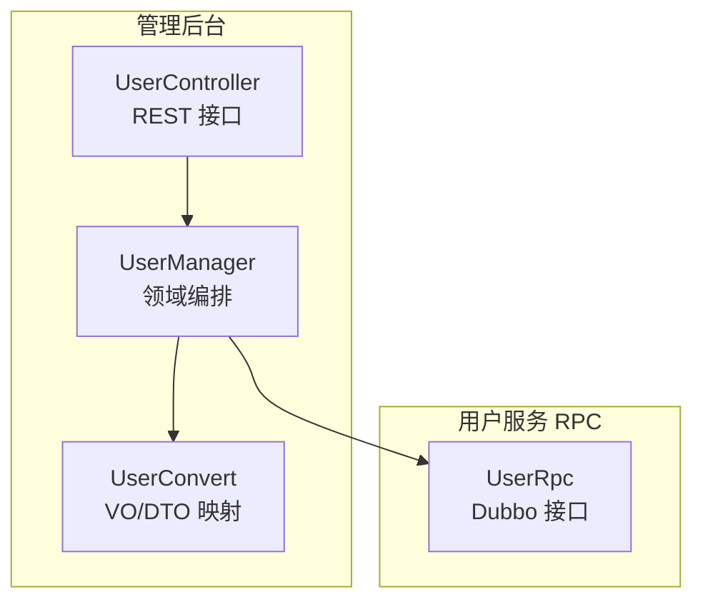
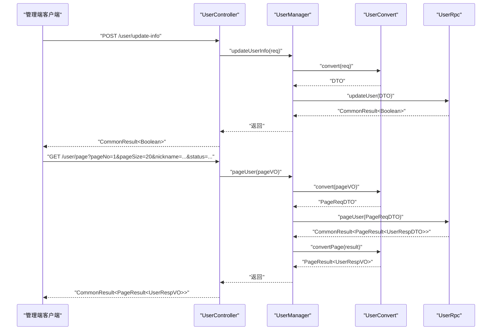
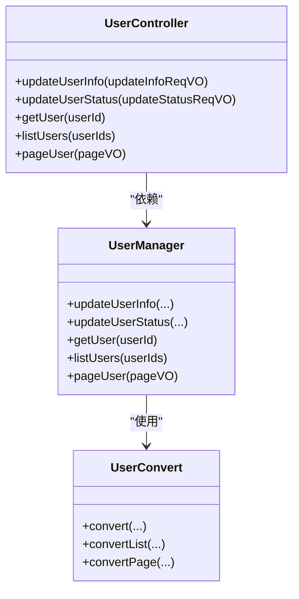
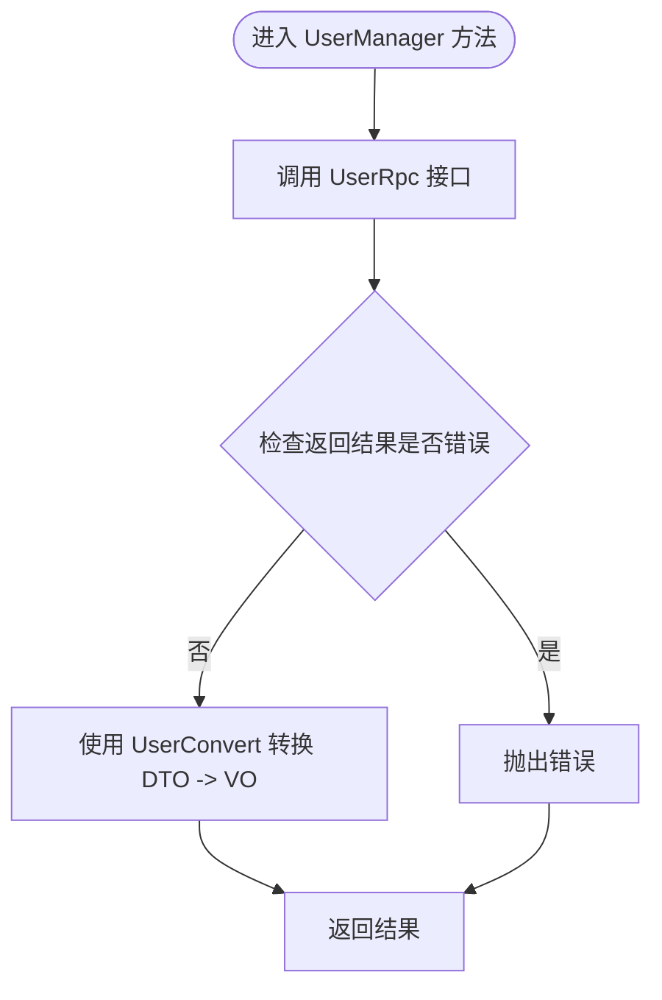
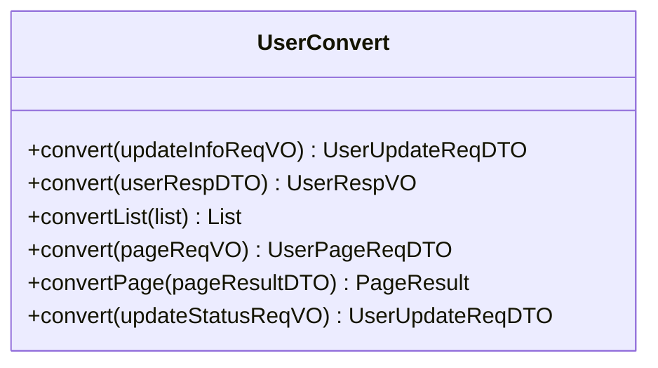
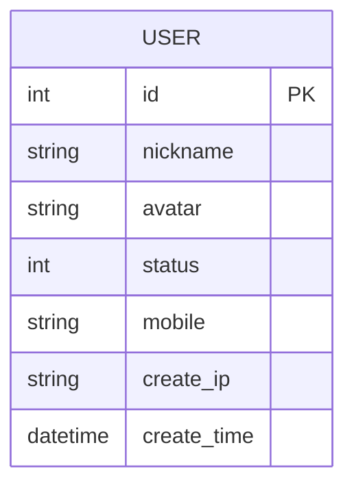
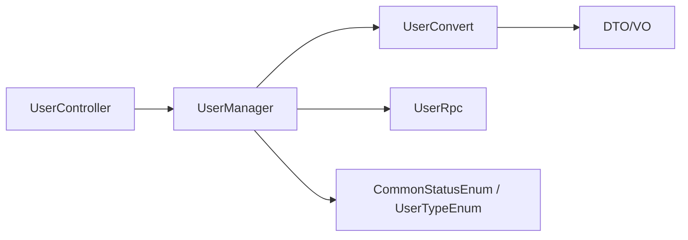

# 用户管理

<cite>
**本文引用的文件**
- [UserController.java](file://management-web-app/src/main/java/cn/iocoder/mall/managementweb/controller/user/UserController.java)
- [UserManager.java](file://management-web-app/src/main/java/cn/iocoder/mall/managementweb/manager/user/UserManager.java)
- [UserConvert.java](file://management-web-app/src/main/java/cn/iocoder/mall/managementweb/convert/user/UserConvert.java)
- [UserPageReqVO.java](file://management-web-app/src/main/java/cn/iocoder/mall/managementweb/controller/user/vo/UserPageReqVO.java)
- [UserRespVO.java](file://management-web-app/src/main/java/cn/iocoder/mall/managementweb/controller/user/vo/UserRespVO.java)
- [UserUpdateInfoReqVO.java](file://management-web-app/src/main/java/cn/iocoder/mall/managementweb/controller/user/vo/UserUpdateInfoReqVO.java)
- [UserUpdateStatusReqVO.java](file://management-web-app/src/main/java/cn/iocoder/mall/managementweb/controller/user/vo/UserUpdateStatusReqVO.java)
- [CommonStatusEnum.java](file://common/common-framework/src/main/java/cn/iocoder/common/framework/enums/CommonStatusEnum.java)
- [UserTypeEnum.java](file://common/common-framework/src/main/java/cn/iocoder/common/framework/enums/UserTypeEnum.java)
</cite>

## 目录
1. [简介](#简介)
2. [项目结构](#项目结构)
3. [核心组件](#核心组件)
4. [架构总览](#架构总览)
5. [详细组件分析](#详细组件分析)
6. [依赖分析](#依赖分析)
7. [性能考虑](#性能考虑)
8. [故障排查指南](#故障排查指南)
9. [结论](#结论)
10. [附录](#附录)

## 简介
本技术文档聚焦于管理后台的用户管理体系，围绕用户信息管理、用户状态控制、用户行为监控等核心能力进行系统化说明。重点解析管理端控制器 UserController 的实现与职责边界，涵盖用户列表查询、用户详情查看、用户信息修改、状态变更等接口；阐述用户数据在管理端的展示与筛选机制（如按昵称模糊匹配、按状态过滤）；梳理用户与订单、支付、收藏等业务的关联关系；并总结用户安全机制（敏感信息保护、操作审计、风险控制）以及运营工具与数据分析能力。

## 项目结构
管理后台用户模块位于 management-web-app 工程中，采用“控制器-管理器-转换器”三层协作模式：
- 控制器层：对外暴露 REST 接口，负责参数接收、校验与响应封装
- 管理器层：编排 RPC 调用，完成领域逻辑编排与错误处理
- 转换器层：负责 VO/DTO 之间的映射与字段适配
- VO 定义：统一请求与响应的数据结构
- 枚举定义：公共状态枚举与用户类型枚举

图表来源
- [UserController.java:25-68](file://management-web-app/src/main/java/cn/iocoder/mall/managementweb/controller/user/UserController.java#L25-L68)
- [UserManager.java:21-83](file://management-web-app/src/main/java/cn/iocoder/mall/managementweb/manager/user/UserManager.java#L21-L83)
- [UserConvert.java:17-35](file://management-web-app/src/main/java/cn/iocoder/mall/managementweb/convert/user/UserConvert.java#L17-L35)

章节来源
- [UserController.java:1-69](file://management-web-app/src/main/java/cn/iocoder/mall/managementweb/controller/user/UserController.java#L1-L69)
- [UserManager.java:1-84](file://management-web-app/src/main/java/cn/iocoder/mall/managementweb/manager/user/UserManager.java#L1-L84)
- [UserConvert.java:1-36](file://management-web-app/src/main/java/cn/iocoder/mall/managementweb/convert/user/UserConvert.java#L1-L36)

## 核心组件
- 用户控制器 UserController：提供用户信息更新、状态更新、单个用户查询、批量用户查询、用户分页查询等接口
- 用户管理器 UserManager：通过 Dubbo 调用用户服务 RPC，完成用户数据的增删改查与分页查询，并进行统一错误处理
- 用户转换器 UserConvert：基于 MapStruct 实现 VO/DTO 的双向映射，确保前后端数据结构一致
- 请求/响应 VO：定义用户分页查询、用户详情、用户信息更新、用户状态更新的输入输出结构
- 枚举：公共状态枚举用于状态校验，用户类型枚举用于区分用户与管理员身份

章节来源
- [UserController.java:25-68](file://management-web-app/src/main/java/cn/iocoder/mall/managementweb/controller/user/UserController.java#L25-L68)
- [UserManager.java:21-83](file://management-web-app/src/main/java/cn/iocoder/mall/managementweb/manager/user/UserManager.java#L21-L83)
- [UserConvert.java:17-35](file://management-web-app/src/main/java/cn/iocoder/mall/managementweb/convert/user/UserConvert.java#L17-L35)
- [UserPageReqVO.java:12-19](file://management-web-app/src/main/java/cn/iocoder/mall/managementweb/controller/user/vo/UserPageReqVO.java#L12-L19)
- [UserRespVO.java:9-26](file://management-web-app/src/main/java/cn/iocoder/mall/managementweb/controller/user/vo/UserRespVO.java#L9-L26)
- [UserUpdateInfoReqVO.java:11-25](file://management-web-app/src/main/java/cn/iocoder/mall/managementweb/controller/user/vo/UserUpdateInfoReqVO.java#L11-L25)
- [UserUpdateStatusReqVO.java:13-24](file://management-web-app/src/main/java/cn/iocoder/mall/managementweb/controller/user/vo/UserUpdateStatusReqVO.java#L13-L24)
- [CommonStatusEnum.java:10-44](file://common/common-framework/src/main/java/cn/iocoder/common/framework/enums/CommonStatusEnum.java#L10-L44)
- [UserTypeEnum.java:10-44](file://common/common-framework/src/main/java/cn/iocoder/common/framework/enums/UserTypeEnum.java#L10-L44)

## 架构总览
管理后台用户模块采用“前端调用 -> 控制器 -> 管理器 -> RPC -> 用户服务”的链路，结合 VO/DTO 转换与统一异常处理，形成清晰的职责边界与可扩展性。

图表来源
- [UserController.java:34-66](file://management-web-app/src/main/java/cn/iocoder/mall/managementweb/controller/user/UserController.java#L34-L66)
- [UserManager.java:32-81](file://management-web-app/src/main/java/cn/iocoder/mall/managementweb/manager/user/UserManager.java#L32-L81)
- [UserConvert.java:22-30](file://management-web-app/src/main/java/cn/iocoder/mall/managementweb/convert/user/UserConvert.java#L22-L30)

## 详细组件分析

### 控制器层：UserController
- 职责边界
  - 提供用户信息更新接口，接收并校验用户信息更新请求 VO
  - 提供用户状态更新接口，接收并校验用户状态更新请求 VO
  - 提供用户详情查询接口，支持按用户编号获取单个用户
  - 提供用户列表查询接口，支持按用户编号列表批量获取用户
  - 提供用户分页查询接口，支持按昵称模糊匹配与状态过滤
- 参数与响应
  - 使用 VO 对外暴露请求与响应结构，保证接口契约稳定
  - 统一封装返回结果，便于前端统一处理
- 安全与校验
  - 基于注解对请求参数进行非空与枚举校验
  - 结合权限注解与拦截器实现访问控制（由安全启动器提供）

图表来源
- [UserController.java:25-68](file://management-web-app/src/main/java/cn/iocoder/mall/managementweb/controller/user/UserController.java#L25-L68)
- [UserManager.java:21-83](file://management-web-app/src/main/java/cn/iocoder/mall/managementweb/manager/user/UserManager.java#L21-L83)
- [UserConvert.java:17-35](file://management-web-app/src/main/java/cn/iocoder/mall/managementweb/convert/user/UserConvert.java#L17-L35)

章节来源
- [UserController.java:25-68](file://management-web-app/src/main/java/cn/iocoder/mall/managementweb/controller/user/UserController.java#L25-L68)

### 管理器层：UserManager
- 职责边界
  - 作为领域编排层，负责调用用户服务 RPC 接口
  - 对 RPC 返回的通用结果进行错误检查与抛错
  - 将 DTO 转换为 VO，供控制器层返回
- 关键方法
  - updateUserInfo：更新用户信息
  - updateUserStatus：更新用户状态
  - getUser：根据用户编号获取用户
  - listUsers：根据用户编号列表批量获取用户
  - pageUser：分页查询用户（含昵称模糊匹配与状态过滤）
- 错误处理
  - 统一调用 checkError 进行错误检查，避免异常泄露到控制器层

图表来源
- [UserManager.java:32-81](file://management-web-app/src/main/java/cn/iocoder/mall/managementweb/manager/user/UserManager.java#L32-L81)
- [UserConvert.java:22-30](file://management-web-app/src/main/java/cn/iocoder/mall/managementweb/convert/user/UserConvert.java#L22-L30)

章节来源
- [UserManager.java:18-83](file://management-web-app/src/main/java/cn/iocoder/mall/managementweb/manager/user/UserManager.java#L18-L83)

### 转换器层：UserConvert
- 职责边界
  - 基于 MapStruct 实现 VO 与 DTO 的双向映射
  - 处理字段差异与命名不一致问题（例如 userId 与 id 的映射）
- 关键映射
  - 用户信息更新请求 VO -> 用户更新请求 DTO
  - 用户响应 DTO -> 用户响应 VO
  - 用户分页请求 VO -> 用户分页请求 DTO
  - 分页结果 DTO -> 分页结果 VO
  - 用户状态更新 VO -> 用户更新请求 DTO（字段别名映射）

图表来源
- [UserConvert.java:17-35](file://management-web-app/src/main/java/cn/iocoder/mall/managementweb/convert/user/UserConvert.java#L17-L35)

章节来源
- [UserConvert.java:17-35](file://management-web-app/src/main/java/cn/iocoder/mall/managementweb/convert/user/UserConvert.java#L17-L35)

### 数据模型与筛选机制
- 用户分页查询
  - 支持按昵称进行模糊匹配
  - 支持按状态进行精确过滤
- 用户详情展示
  - 展示用户编号、昵称、头像、状态、手机号、注册 IP、创建时间等字段
- 用户信息更新
  - 支持更新昵称、头像、手机号、密码等字段
- 用户状态更新
  - 通过枚举校验状态值，确保状态合法

图表来源
- [UserRespVO.java:9-26](file://management-web-app/src/main/java/cn/iocoder/mall/managementweb/controller/user/vo/UserRespVO.java#L9-L26)
- [UserPageReqVO.java:12-19](file://management-web-app/src/main/java/cn/iocoder/mall/managementweb/controller/user/vo/UserPageReqVO.java#L12-L19)
- [UserUpdateInfoReqVO.java:11-25](file://management-web-app/src/main/java/cn/iocoder/mall/managementweb/controller/user/vo/UserUpdateInfoReqVO.java#L11-L25)
- [UserUpdateStatusReqVO.java:13-24](file://management-web-app/src/main/java/cn/iocoder/mall/managementweb/controller/user/vo/UserUpdateStatusReqVO.java#L13-L24)

章节来源
- [UserPageReqVO.java:12-19](file://management-web-app/src/main/java/cn/iocoder/mall/managementweb/controller/user/vo/UserPageReqVO.java#L12-L19)
- [UserRespVO.java:9-26](file://management-web-app/src/main/java/cn/iocoder/mall/managementweb/controller/user/vo/UserRespVO.java#L9-L26)
- [UserUpdateInfoReqVO.java:11-25](file://management-web-app/src/main/java/cn/iocoder/mall/managementweb/controller/user/vo/UserUpdateInfoReqVO.java#L11-L25)
- [UserUpdateStatusReqVO.java:13-24](file://management-web-app/src/main/java/cn/iocoder/mall/managementweb/controller/user/vo/UserUpdateStatusReqVO.java#L13-L24)

### 与订单、支付、收藏的关联关系
- 订单关联：用户与订单存在一对多关系，可通过用户 ID 查询其历史订单与订单统计
- 支付关联：用户与支付交易存在关联，可通过用户 ID 查询支付流水与资金变动
- 收藏关联：用户与商品收藏存在关联，可通过用户 ID 查询其收藏列表与收藏统计
- 关联查询建议：在管理端提供“用户详情 -> 订单/支付/收藏”跳转或内嵌卡片，以提升运营效率

[本节为概念性说明，无需列出具体文件来源]

### 用户安全机制
- 敏感信息保护
  - 密码字段仅在必要时更新，避免明文传输与存储
  - 手机号等敏感字段在展示层进行脱敏处理（如仅显示后四位）
- 操作审计
  - 对用户状态变更、信息修改等高风险操作记录操作人、时间、变更前/后值
- 风险控制
  - 基于状态枚举进行强校验，防止非法状态写入
  - 结合权限注解与拦截器限制访问范围

章节来源
- [CommonStatusEnum.java:10-44](file://common/common-framework/src/main/java/cn/iocoder/common/framework/enums/CommonStatusEnum.java#L10-L44)
- [UserUpdateStatusReqVO.java:19-22](file://management-web-app/src/main/java/cn/iocoder/mall/managementweb/controller/user/vo/UserUpdateStatusReqVO.java#L19-L22)

### 运营工具与数据分析
- 运营工具
  - 用户分页查询：支持按昵称模糊搜索与状态过滤，便于批量处理
  - 用户详情查看：快速定位用户基础信息与状态
  - 用户状态控制：一键启用/禁用用户，阻断异常风险
- 数据分析
  - 可基于用户注册时间、消费金额、活跃度等维度构建报表
  - 建议在管理端提供“用户画像”“活跃度排行”“异常用户识别”等可视化看板

[本节为概念性说明，无需列出具体文件来源]

## 依赖分析
- 控制器依赖管理器，管理器依赖转换器与用户服务 RPC
- 管理器通过 Dubbo 注解引用远程接口，版本号由配置注入
- 转换器使用 MapStruct 生成映射代码，减少手写样板
- 枚举提供统一的状态与类型定义，增强一致性与可维护性

图表来源
- [UserController.java:25-68](file://management-web-app/src/main/java/cn/iocoder/mall/managementweb/controller/user/UserController.java#L25-L68)
- [UserManager.java:21-83](file://management-web-app/src/main/java/cn/iocoder/mall/managementweb/manager/user/UserManager.java#L21-L83)
- [UserConvert.java:17-35](file://management-web-app/src/main/java/cn/iocoder/mall/managementweb/convert/user/UserConvert.java#L17-L35)
- [CommonStatusEnum.java:10-44](file://common/common-framework/src/main/java/cn/iocoder/common/framework/enums/CommonStatusEnum.java#L10-L44)
- [UserTypeEnum.java:10-44](file://common/common-framework/src/main/java/cn/iocoder/common/framework/enums/UserTypeEnum.java#L10-L44)

章节来源
- [UserManager.java:13-25](file://management-web-app/src/main/java/cn/iocoder/mall/managementweb/manager/user/UserManager.java#L13-L25)
- [UserConvert.java:17-35](file://management-web-app/src/main/java/cn/iocoder/mall/managementweb/convert/user/UserConvert.java#L17-L35)
- [CommonStatusEnum.java:10-44](file://common/common-framework/src/main/java/cn/iocoder/common/framework/enums/CommonStatusEnum.java#L10-L44)
- [UserTypeEnum.java:10-44](file://common/common-framework/src/main/java/cn/iocoder/common/framework/enums/UserTypeEnum.java#L10-L44)

## 性能考虑
- 分页查询
  - 合理设置分页大小，避免一次性加载过多数据
  - 在数据库侧建立索引（如按状态、昵称、创建时间），提升查询性能
- 缓存策略
  - 对高频查询的用户详情与列表结果进行缓存，降低 RPC 调用压力
- 并发控制
  - 对状态变更等高风险操作增加幂等与重试机制，避免重复提交
- 日志与监控
  - 对慢查询与异常进行埋点与告警，持续优化查询路径

[本节为通用指导，无需列出具体文件来源]

## 故障排查指南
- 常见问题
  - 参数校验失败：确认请求 VO 字段是否符合注解约束（如非空、枚举值）
  - RPC 调用失败：检查用户服务是否正常、版本号配置是否正确
  - 返回结果错误：关注统一错误检查流程，定位具体错误码与提示
- 排查步骤
  - 控制器层：确认请求参数与注解校验是否通过
  - 管理器层：确认 RPC 返回是否包含错误，是否执行了错误检查
  - 转换器层：确认 DTO/VO 映射字段是否一致
- 建议
  - 在开发环境开启详细日志，定位问题根因
  - 对高风险接口增加重试与熔断策略

章节来源
- [UserController.java:34-66](file://management-web-app/src/main/java/cn/iocoder/mall/managementweb/controller/user/UserController.java#L34-L66)
- [UserManager.java:32-81](file://management-web-app/src/main/java/cn/iocoder/mall/managementweb/manager/user/UserManager.java#L32-L81)

## 结论
管理后台用户模块通过清晰的分层设计与标准化的数据契约，实现了用户信息管理、状态控制与分页查询等核心能力。结合枚举校验、统一错误处理与 VO/DTO 转换，提升了系统的稳定性与可维护性。建议在后续迭代中完善用户画像与运营看板，进一步强化用户行为监控与风险控制能力。

[本节为总结性内容，无需列出具体文件来源]

## 附录
- 接口清单
  - 更新用户信息：POST /user/update-info
  - 更新用户状态：POST /user/update-status
  - 获取用户详情：GET /user/get?userId=...
  - 获取用户列表：GET /user/list?userIds=...
  - 获取用户分页：GET /user/page
- 关键枚举
  - 状态枚举：ENABLE/DISABLE
  - 用户类型：USER/ADMIN

章节来源
- [UserController.java:34-66](file://management-web-app/src/main/java/cn/iocoder/mall/managementweb/controller/user/UserController.java#L34-L66)
- [CommonStatusEnum.java:10-44](file://common/common-framework/src/main/java/cn/iocoder/common/framework/enums/CommonStatusEnum.java#L10-L44)
- [UserTypeEnum.java:10-44](file://common/common-framework/src/main/java/cn/iocoder/common/framework/enums/UserTypeEnum.java#L10-L44)