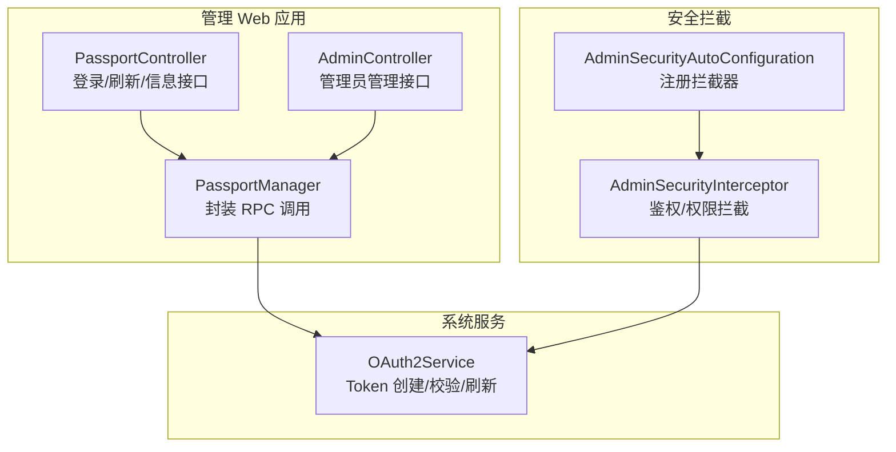
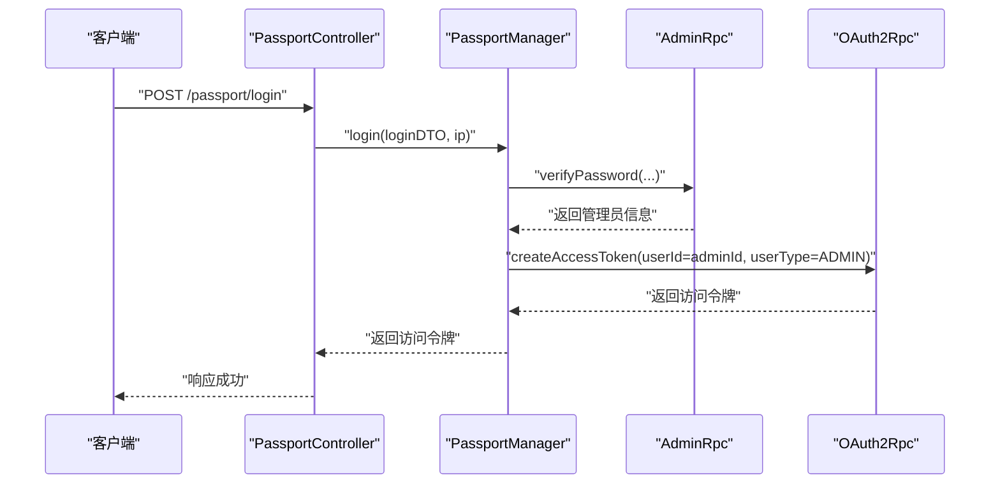
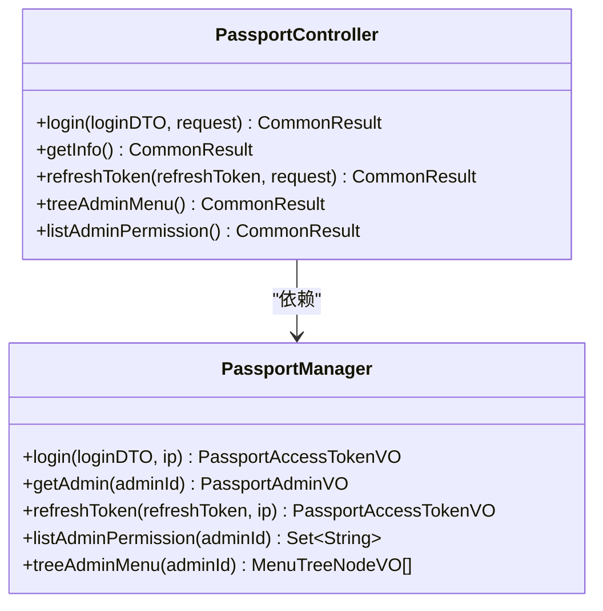
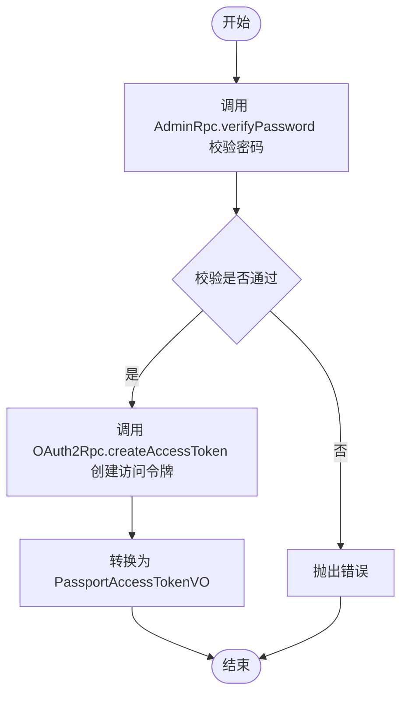
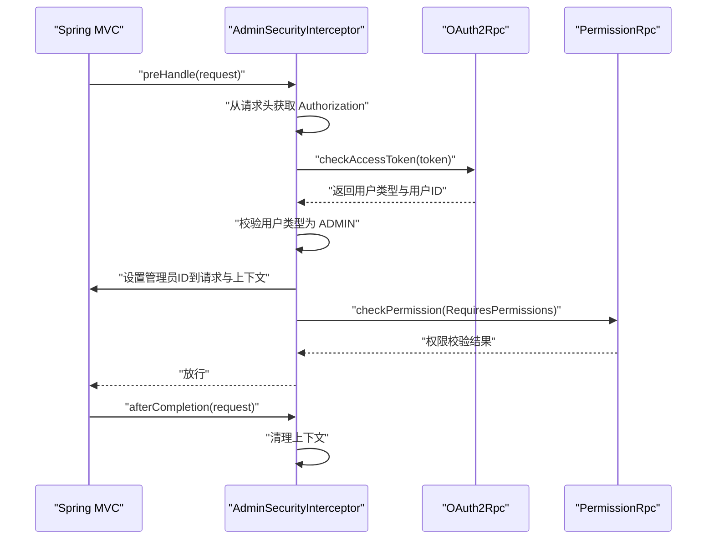
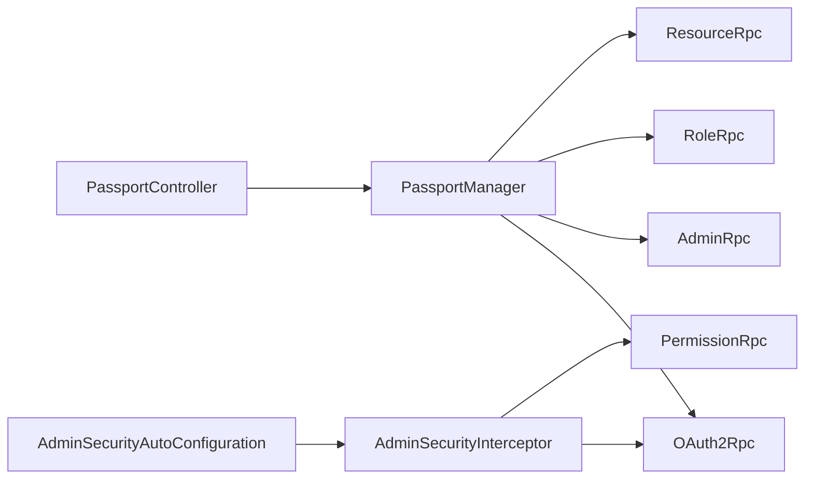

# 登录认证

<cite>
**本文引用的文件**
- [PassportController.java](file://management-web-app/src/main/java/cn/iocoder/mall/managementweb/controller/passport/PassportController.java)
- [PassportManager.java](file://management-web-app/src/main/java/cn/iocoder/mall/managementweb/manager/passport/PassportManager.java)
- [AdminController.java](file://management-web-app/src/main/java/cn/iocoder/mall/managementweb/controller/admin/AdminController.java)
- [AdminSecurityAutoConfiguration.java](file://common/mall-spring-boot-starter-security-admin/src/main/java/cn/iocoder/mall/security/admin/config/AdminSecurityAutoConfiguration.java)
- [AdminSecurityInterceptor.java](file://common/mall-spring-boot-starter-security-admin/src/main/java/cn/iocoder/mall/security/admin/core/interceptor/AdminSecurityInterceptor.java)
- [OAuth2Service.java](file://system-service-project/system-service-app/src/main/java/cn/iocoder/mall/systemservice/service/oauth/OAuth2Service.java)
</cite>

## 目录
1. [简介](#简介)
2. [项目结构](#项目结构)
3. [核心组件](#核心组件)
4. [架构总览](#架构总览)
5. [详细组件分析](#详细组件分析)
6. [依赖关系分析](#依赖关系分析)
7. [性能考量](#性能考量)
8. [故障排查指南](#故障排查指南)
9. [结论](#结论)
10. [附录](#附录)

## 简介
本技术文档围绕管理后台的登录认证能力进行系统化梳理，重点覆盖以下方面：
- 管理员登录流程、Token生成与校验、会话管理策略
- PassportController 的登录、登出、Token刷新等核心接口实现
- 认证过程中的安全机制：密码校验、防暴力破解、登录失败处理
- 认证状态维护：Token存储、过期处理、并发登录控制
- 与系统服务的交互：RPC 调用、用户信息获取、权限验证
- 提供完整的认证流程图与接口调用示例，便于开发者理解与扩展

## 项目结构
管理后台的认证相关代码主要分布在如下模块：
- 控制层：管理 Web 应用的 PassportController、AdminController
- 管理层：管理 Web 应用的 PassportManager（封装 RPC 调用）
- 安全拦截：AdminSecurityAutoConfiguration、AdminSecurityInterceptor
- 系统服务：system-service-app 提供 OAuth2Service 等能力

图表来源
- [PassportController.java:23-67](file://management-web-app/src/main/java/cn/iocoder/mall/managementweb/controller/passport/PassportController.java#L23-L67)
- [PassportManager.java:31-123](file://management-web-app/src/main/java/cn/iocoder/mall/managementweb/manager/passport/PassportManager.java#L31-L123)
- [AdminSecurityAutoConfiguration.java:17-60](file://common/mall-spring-boot-starter-security-admin/src/main/java/cn/iocoder/mall/security/admin/config/AdminSecurityAutoConfiguration.java#L17-L60)
- [AdminSecurityInterceptor.java:29-96](file://common/mall-spring-boot-starter-security-admin/src/main/java/cn/iocoder/mall/security/admin/core/interceptor/AdminSecurityInterceptor.java#L29-L96)
- [OAuth2Service.java:11-21](file://system-service-project/system-service-app/src/main/java/cn/iocoder/mall/systemservice/service/oauth/OAuth2Service.java#L11-L21)

章节来源
- [PassportController.java:23-67](file://management-web-app/src/main/java/cn/iocoder/mall/managementweb/controller/passport/PassportController.java#L23-L67)
- [PassportManager.java:31-123](file://management-web-app/src/main/java/cn/iocoder/mall/managementweb/manager/passport/PassportManager.java#L31-L123)
- [AdminSecurityAutoConfiguration.java:17-60](file://common/mall-spring-boot-starter-security-admin/src/main/java/cn/iocoder/mall/security/admin/config/AdminSecurityAutoConfiguration.java#L17-L60)
- [AdminSecurityInterceptor.java:29-96](file://common/mall-spring-boot-starter-security-admin/src/main/java/cn/iocoder/mall/security/admin/core/interceptor/AdminSecurityInterceptor.java#L29-L96)
- [OAuth2Service.java:11-21](file://system-service-project/system-service-app/src/main/java/cn/iocoder/mall/systemservice/service/oauth/OAuth2Service.java#L11-L21)

## 核心组件
- PassportController：提供登录、获取管理员信息、刷新 Token、菜单树与权限列表等接口，均通过 PassportManager 封装调用系统服务。
- PassportManager：负责调用 AdminRpc、OAuth2Rpc、RoleRpc、ResourceRpc，完成密码校验、Token 创建/刷新、权限与菜单树构建。
- AdminSecurityAutoConfiguration：自动装配拦截器，注册 AdminSecurityInterceptor，并支持忽略路径配置。
- AdminSecurityInterceptor：在请求到达控制器前进行认证与权限校验，校验通过后将管理员上下文写入线程上下文。

章节来源
- [PassportController.java:23-67](file://management-web-app/src/main/java/cn/iocoder/mall/managementweb/controller/passport/PassportController.java#L23-L67)
- [PassportManager.java:31-123](file://management-web-app/src/main/java/cn/iocoder/mall/managementweb/manager/passport/PassportManager.java#L31-L123)
- [AdminSecurityAutoConfiguration.java:17-60](file://common/mall-spring-boot-starter-security-admin/src/main/java/cn/iocoder/mall/security/admin/config/AdminSecurityAutoConfiguration.java#L17-L60)
- [AdminSecurityInterceptor.java:29-96](file://common/mall-spring-boot-starter-security-admin/src/main/java/cn/iocoder/mall/security/admin/core/interceptor/AdminSecurityInterceptor.java#L29-L96)

## 架构总览
管理后台采用“前端请求 → Web 控制器 → 管理层 → RPC 调用 → 系统服务”的分层架构。认证拦截器在进入业务逻辑之前完成 Token 校验与权限检查，确保后续接口的安全性。

图表来源
- [PassportController.java:31-37](file://management-web-app/src/main/java/cn/iocoder/mall/managementweb/controller/passport/PassportController.java#L31-L37)
- [PassportManager.java:43-55](file://management-web-app/src/main/java/cn/iocoder/mall/managementweb/manager/passport/PassportManager.java#L43-L55)
- [OAuth2Service.java:13-13](file://system-service-project/system-service-app/src/main/java/cn/iocoder/mall/systemservice/service/oauth/OAuth2Service.java#L13-L13)

## 详细组件分析

### PassportController 分析
- 登录接口：接收账号密码，调用 PassportManager.login 并返回访问令牌。
- 获取管理员信息：基于当前已认证的管理员 ID，调用 PassportManager.getAdmin。
- 刷新 Token：接收 refreshToken，调用 PassportManager.refreshToken。
- 菜单树与权限列表：用于前端渲染，基于管理员角色与资源构建。

图表来源
- [PassportController.java:23-67](file://management-web-app/src/main/java/cn/iocoder/mall/managementweb/controller/passport/PassportController.java#L23-L67)
- [PassportManager.java:31-123](file://management-web-app/src/main/java/cn/iocoder/mall/managementweb/manager/passport/PassportManager.java#L31-L123)

章节来源
- [PassportController.java:23-67](file://management-web-app/src/main/java/cn/iocoder/mall/managementweb/controller/passport/PassportController.java#L23-L67)

### PassportManager 分析
- 登录流程：先通过 AdminRpc.verifyPassword 校验管理员密码；成功后调用 OAuth2Rpc.createAccessToken 创建访问令牌并返回。
- 刷新流程：调用 OAuth2Rpc.refreshAccessToken 使用 refreshToken 获取新令牌。
- 权限与菜单：通过 RoleRpc 与 ResourceRpc 获取管理员的角色与资源，进而生成权限集合与菜单树。

图表来源
- [PassportManager.java:43-55](file://management-web-app/src/main/java/cn/iocoder/mall/managementweb/manager/passport/PassportManager.java#L43-L55)

章节来源
- [PassportManager.java:31-123](file://management-web-app/src/main/java/cn/iocoder/mall/managementweb/manager/passport/PassportManager.java#L31-L123)

### 安全拦截器分析
- 自动配置：AdminSecurityAutoConfiguration 注册 AdminSecurityInterceptor，并支持忽略路径配置。
- 预处理：AdminSecurityInterceptor 从请求头中提取 Authorization，调用 OAuth2Rpc.checkAccessToken 校验 Token；校验用户类型必须为 ADMIN；将管理员 ID 写入请求与线程上下文。
- 权限校验：若方法标注 RequiresPermissions，则调用 PermissionRpc 进行权限检查。
- 清理：afterCompletion 中清理线程上下文，避免内存泄漏。

图表来源
- [AdminSecurityAutoConfiguration.java:43-58](file://common/mall-spring-boot-starter-security-admin/src/main/java/cn/iocoder/mall/security/admin/config/AdminSecurityAutoConfiguration.java#L43-L58)
- [AdminSecurityInterceptor.java:36-94](file://common/mall-spring-boot-starter-security-admin/src/main/java/cn/iocoder/mall/security/admin/core/interceptor/AdminSecurityInterceptor.java#L36-L94)
- [OAuth2Service.java:15-15](file://system-service-project/system-service-app/src/main/java/cn/iocoder/mall/systemservice/service/oauth/OAuth2Service.java#L15-L15)

章节来源
- [AdminSecurityAutoConfiguration.java:17-60](file://common/mall-spring-boot-starter-security-admin/src/main/java/cn/iocoder/mall/security/admin/config/AdminSecurityAutoConfiguration.java#L17-L60)
- [AdminSecurityInterceptor.java:29-96](file://common/mall-spring-boot-starter-security-admin/src/main/java/cn/iocoder/mall/security/admin/core/interceptor/AdminSecurityInterceptor.java#L29-L96)

### 与系统服务的交互
- OAuth2Service：定义了创建访问令牌、校验访问令牌、刷新访问令牌等接口，由系统服务实现。
- 管理 Web 应用通过 Dubbo 引用调用 OAuth2Rpc、AdminRpc、RoleRpc、ResourceRpc，完成认证与授权相关操作。

```mermaid
classDiagram
class OAuth2Service {
+createAccessToken(req) Resp
+checkAccessToken(token) Resp
+refreshAccessToken(req) Resp
+removeToken(req) void
}
class PassportManager
PassportManager --> OAuth2Service : "通过 Dubbo 调用"
```

图表来源
- [OAuth2Service.java:11-21](file://system-service-project/system-service-app/src/main/java/cn/iocoder/mall/systemservice/service/oauth/OAuth2Service.java#L11-L21)
- [PassportManager.java:34-41](file://management-web-app/src/main/java/cn/iocoder/mall/managementweb/manager/passport/PassportManager.java#L34-L41)

章节来源
- [OAuth2Service.java:11-21](file://system-service-project/system-service-app/src/main/java/cn/iocoder/mall/systemservice/service/oauth/OAuth2Service.java#L11-L21)
- [PassportManager.java:31-123](file://management-web-app/src/main/java/cn/iocoder/mall/managementweb/manager/passport/PassportManager.java#L31-L123)

## 依赖关系分析
- 控制层依赖管理层：PassportController 仅暴露接口，具体业务逻辑由 PassportManager 实现。
- 管理层依赖系统服务：通过 Dubbo 引用调用 AdminRpc、OAuth2Rpc、RoleRpc、ResourceRpc。
- 安全拦截器依赖系统服务：在预处理阶段调用 OAuth2Rpc 校验 Token，必要时调用 PermissionRpc 做权限校验。
- 自动配置依赖拦截器：AdminSecurityAutoConfiguration 注册拦截器并支持忽略路径配置。

图表来源
- [PassportController.java:23-67](file://management-web-app/src/main/java/cn/iocoder/mall/managementweb/controller/passport/PassportController.java#L23-L67)
- [PassportManager.java:31-123](file://management-web-app/src/main/java/cn/iocoder/mall/managementweb/manager/passport/PassportManager.java#L31-L123)
- [AdminSecurityAutoConfiguration.java:17-60](file://common/mall-spring-boot-starter-security-admin/src/main/java/cn/iocoder/mall/security/admin/config/AdminSecurityAutoConfiguration.java#L17-L60)
- [AdminSecurityInterceptor.java:29-96](file://common/mall-spring-boot-starter-security-admin/src/main/java/cn/iocoder/mall/security/admin/core/interceptor/AdminSecurityInterceptor.java#L29-L96)

章节来源
- [PassportController.java:23-67](file://management-web-app/src/main/java/cn/iocoder/mall/managementweb/controller/passport/PassportController.java#L23-L67)
- [PassportManager.java:31-123](file://management-web-app/src/main/java/cn/iocoder/mall/managementweb/manager/passport/PassportManager.java#L31-L123)
- [AdminSecurityAutoConfiguration.java:17-60](file://common/mall-spring-boot-starter-security-admin/src/main/java/cn/iocoder/mall/security/admin/config/AdminSecurityAutoConfiguration.java#L17-L60)
- [AdminSecurityInterceptor.java:29-96](file://common/mall-spring-boot-starter-security-admin/src/main/java/cn/iocoder/mall/security/admin/core/interceptor/AdminSecurityInterceptor.java#L29-L96)

## 性能考量
- RPC 调用开销：登录与刷新 Token 均涉及远程调用，建议在网关或拦截器层引入必要的缓存与限流策略，降低重复校验成本。
- Token 校验前置：拦截器提前校验 Token，避免无效请求进入业务层，减少不必要的计算。
- 并发控制：建议结合系统服务侧的并发登录控制与 Token 失效策略，避免同一账户多端互顶导致的会话冲突。

## 故障排查指南
- 未登录或 Token 失效：拦截器在 preHandle 中对未携带有效 Token 的请求抛出未授权异常，需确认请求头 Authorization 是否正确传递。
- 用户类型不匹配：拦截器会校验用户类型必须为 ADMIN，若出现类型错误，需检查 Token 创建时的用户类型参数。
- 权限不足：若控制器方法标注 RequiresPermissions，但权限校验失败，需核对管理员角色与资源映射关系。
- 登录失败：登录接口返回错误时，需检查 AdminRpc.verifyPassword 与 OAuth2Rpc.createAccessToken 的返回值与异常信息。

章节来源
- [AdminSecurityInterceptor.java:69-88](file://common/mall-spring-boot-starter-security-admin/src/main/java/cn/iocoder/mall/security/admin/core/interceptor/AdminSecurityInterceptor.java#L69-L88)
- [PassportController.java:31-37](file://management-web-app/src/main/java/cn/iocoder/mall/managementweb/controller/passport/PassportController.java#L31-L37)

## 结论
本方案通过“控制器 + 管理层 + 安全拦截器 + RPC 调用”的分层设计，实现了管理后台的统一认证与授权。登录流程清晰、安全拦截前置、权限校验细粒度，具备良好的可维护性与扩展性。建议在生产环境中配合缓存、限流与并发登录控制策略，进一步提升安全性与稳定性。

## 附录
- 接口调用示例（路径与说明）
  - 登录：POST /passport/login
  - 获取管理员信息：GET /passport/info
  - 刷新 Token：POST /passport/refresh-token?refreshToken={token}
  - 获取菜单树：GET /passport/tree-admin-menu
  - 获取权限列表：GET /passport/list-admin-permission
- 关键 DTO/VO
  - PassportLoginDTO：登录请求参数
  - PassportAccessTokenVO：访问令牌响应
  - PassportAdminVO：管理员信息响应
  - PassportAdminMenuTreeNodeVO：菜单树节点响应