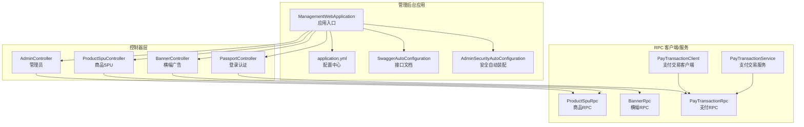
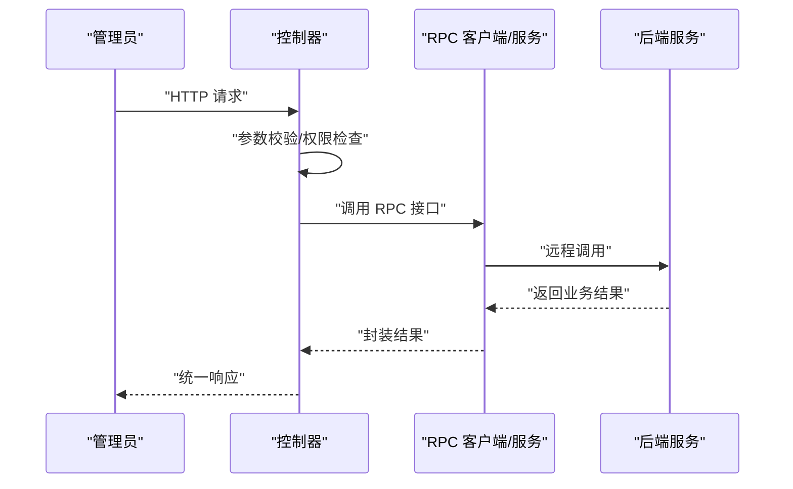
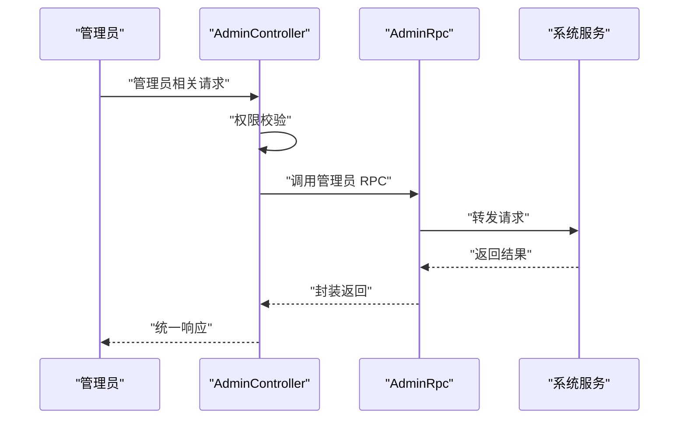
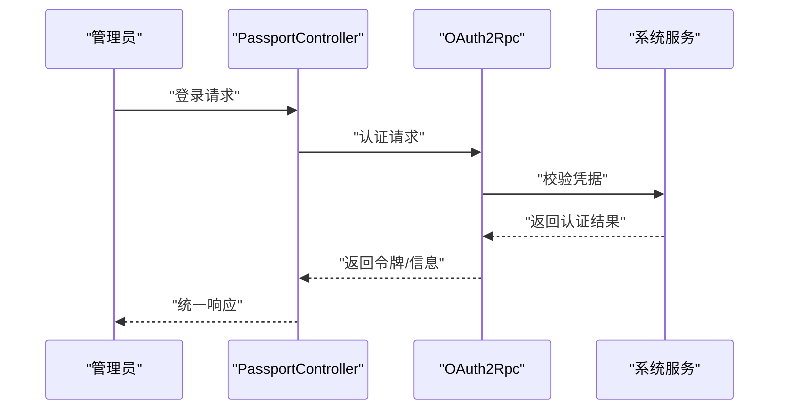
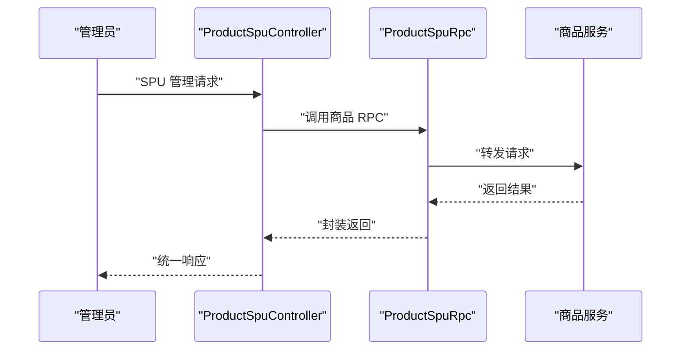
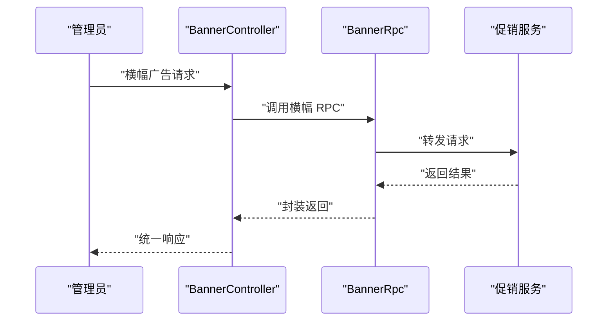
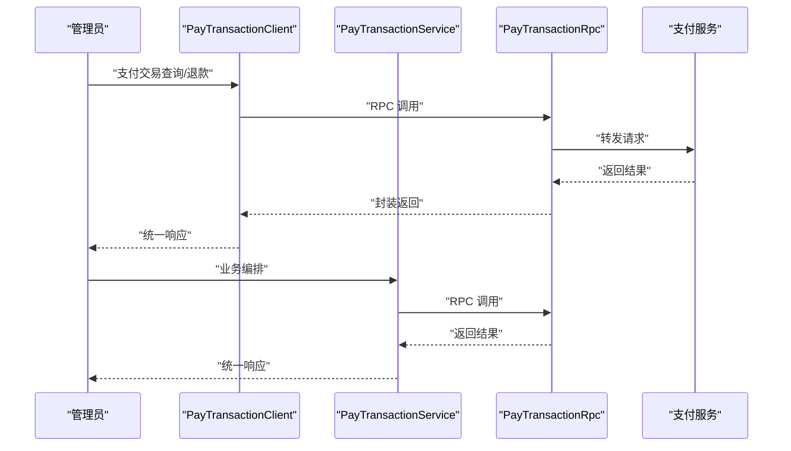
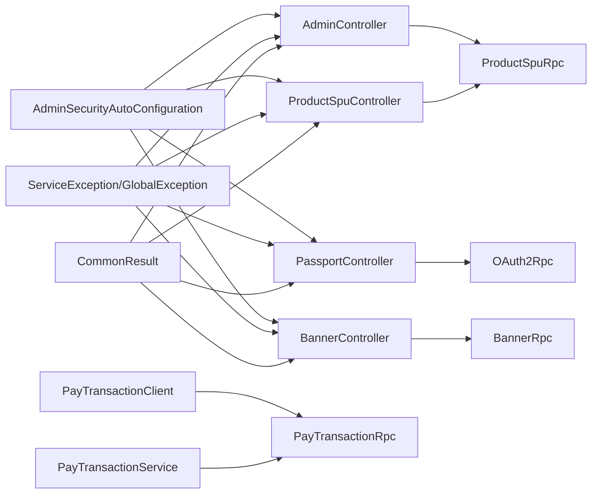

# 管理后台应用

<cite>
**本文引用的文件**
- [ManagementWebApplication.java](file://management-web-app/src/main/java/cn/iocoder/mall/managementweb/ManagementWebApplication.java)
- [application.yml](file://management-web-app/src/main/resources/application.yml)
- [AdminController.java](file://management-web-app/src/main/java/cn/iocoder/mall/managementweb/controller/admin/AdminController.java)
- [PassportController.java](file://management-web-app/src/main/java/cn/iocoder/mall/managementweb/controller/passport/PassportController.java)
- [ProductSpuController.java](file://management-web-app/src/main/java/cn/iocoder/mall/managementweb/controller/product/ProductSpuController.java)
- [BannerController.java](file://management-web-app/src/main/java/cn/iocoder/mall/managementweb/controller/promotion/brand/BannerController.java)
- [PayTransactionClient.java](file://management-web-app/src/main/java/cn/iocoder/mall/managementweb/client/pay/transaction/PayTransactionClient.java)
- [PayTransactionService.java](file://management-web-app/src/main/java/cn/iocoder/mall/managementweb/service/pay/transaction/PayTransactionService.java)
- [AdminSecurityAutoConfiguration.java](file://common/mall-spring-boot-starter-security-admin/src/main/java/cn/iocoder/mall/security/admin/config/AdminSecurityAutoConfiguration.java)
- [RequiresPermissions.java](file://common/mall-security-annotations/src/main/java/cn/iocoder/security/annotations/RequiresPermissions.java)
- [CommonResult.java](file://common/common-framework/src/main/java/cn/iocoder/common/framework/vo/CommonResult.java)
- [ErrorCode.java](file://common/common-framework/src/main/java/cn/iocoder/common/framework/exception/ErrorCode.java)
- [GlobalException.java](file://common/common-framework/src/main/java/cn/iocoder/common/framework/exception/GlobalException.java)
- [ServiceException.java](file://common/common-framework/src/main/java/cn/iocoder/common/framework/exception/ServiceException.java)
- [SwaggerAutoConfiguration.java](file://common/mall-spring-boot-starter-swagger/src/main/java/cn/iocoder/mall/swagger/config/SwaggerAutoConfiguration.java)
- [SystemAccessLogRpc.java](file://system-service-project/system-service-api/src/main/java/cn/ihocoder/mall/systemservice/rpc/systemlog/SystemAccessLogRpc.java)
- [SystemExceptionLogRpc.java](file://system-service-project/system-service-api/src/main/java/cn/ihocoder/mall/systemservice/rpc/systemlog/SystemExceptionLogRpc.java)
- [ProductSpuRpc.java](file://product-service-project/product-service-api/src/main/java/cn/ihocoder/mall/productservice/rpc/spu/ProductSpuRpc.java)
- [BannerRpc.java](file://promotion-service-project/promotion-service-api/src/main/java/cn/ihocoder/mall/promotionservice/rpc/banner/BannerRpc.java)
- [PayTransactionRpc.java](file://pay-service-project/pay-service-api/src/main/java/cn/ihocoder/mall/payservice/rpc/transaction/PayTransactionRpc.java)
</cite>

## 目录
1. [简介](#简介)
2. [项目结构](#项目结构)
3. [核心组件](#核心组件)
4. [架构总览](#架构总览)
5. [详细组件分析](#详细组件分析)
6. [依赖关系分析](#依赖关系分析)
7. [性能考虑](#性能考虑)
8. [故障排查指南](#故障排查指南)
9. [结论](#结论)
10. [附录](#附录)

## 简介
本技术文档面向管理后台应用，系统性阐述其整体架构、功能模块与控制器职责，覆盖管理员登录认证、权限控制、商品管理、订单处理、用户管理、营销活动管理等核心能力。文档同时说明前端交互与后端服务的集成方式（RPC 调用）、数据传输格式、安全机制（权限验证、操作日志、数据安全）以及开发调试方法，帮助开发者快速理解与高效迭代。

## 项目结构
管理后台基于 Spring Boot 应用，通过 Dubbo 进行 RPC 调用，结合 Swagger 提供接口文档，Actuator 暴露监控端点。应用通过统一的异常与返回封装，配合安全注解与自动配置完成权限控制与访问拦截。

图示来源
- [ManagementWebApplication.java:1-14](file://management-web-app/src/main/java/cn/ihocoder/mall/managementweb/ManagementWebApplication.java#L1-L14)
- [application.yml:1-83](file://management-web-app/src/main/resources/application.yml#L1-L83)
- [AdminController.java](file://management-web-app/src/main/java/cn/ihocoder/mall/managementweb/controller/admin/AdminController.java)
- [PassportController.java](file://management-web-app/src/main/java/cn/ihocoder/mall/managementweb/controller/passport/PassportController.java)
- [ProductSpuController.java](file://management-web-app/src/main/java/cn/ihocoder/mall/managementweb/controller/product/ProductSpuController.java)
- [BannerController.java](file://management-web-app/src/main/java/cn/ihocoder/mall/managementweb/controller/promotion/brand/BannerController.java)
- [PayTransactionClient.java](file://management-web-app/src/main/java/cn/ihocoder/mall/managementweb/client/pay/transaction/PayTransactionClient.java)
- [PayTransactionService.java](file://management-web-app/src/main/java/cn/ihocoder/mall/managementweb/service/pay/transaction/PayTransactionService.java)
- [AdminSecurityAutoConfiguration.java](file://common/mall-spring-boot-starter-security-admin/src/main/java/cn/ihocoder/mall/security/admin/config/AdminSecurityAutoConfiguration.java)
- [SwaggerAutoConfiguration.java](file://common/mall-spring-boot-starter-swagger/src/main/java/cn/ihocoder/mall/swagger/config/SwaggerAutoConfiguration.java)

章节来源
- [ManagementWebApplication.java:1-14](file://management-web-app/src/main/java/cn/ihocoder/mall/managementweb/ManagementWebApplication.java#L1-L14)
- [application.yml:1-83](file://management-web-app/src/main/resources/application.yml#L1-L83)

## 核心组件
- 应用入口与配置
  - 应用入口类负责启动 Spring Boot 应用。
  - application.yml 定义了服务端口、上下文路径、Dubbo 消费者超时与版本、Swagger 文档基础包、Actuator 监控端点等。
- 统一返回与异常
  - CommonResult 提供统一响应结构；ErrorCode、ServiceException、GlobalException 提供错误码与异常体系。
- 安全与权限
  - AdminSecurityAutoConfiguration 自动装配管理后台安全策略；RequiresPermissions 注解用于方法级权限校验。
- 接口文档
  - SwaggerAutoConfiguration 基于配置生成接口文档，扫描管理后台控制器包。

章节来源
- [ManagementWebApplication.java:1-14](file://management-web-app/src/main/java/cn/ihocoder/mall/managementweb/ManagementWebApplication.java#L1-L14)
- [application.yml:1-83](file://management-web-app/src/main/resources/application.yml#L1-L83)
- [CommonResult.java](file://common/common-framework/src/main/java/cn/ihocoder/common/framework/vo/CommonResult.java)
- [ErrorCode.java](file://common/common-framework/src/main/java/cn/ihocoder/common/framework/exception/ErrorCode.java)
- [ServiceException.java](file://common/common-framework/src/main/java/cn/ihocoder/common/framework/exception/ServiceException.java)
- [GlobalException.java](file://common/common-framework/src/main/java/cn/ihocoder/common/framework/exception/GlobalException.java)
- [AdminSecurityAutoConfiguration.java](file://common/mall-spring-boot-starter-security-admin/src/main/java/cn/ihocoder/mall/security/admin/config/AdminSecurityAutoConfiguration.java)
- [RequiresPermissions.java](file://common/mall-security-annotations/src/main/java/cn/ihocoder/security/annotations/RequiresPermissions.java)
- [SwaggerAutoConfiguration.java](file://common/mall-spring-boot-starter-swagger/src/main/java/cn/ihocoder/mall/swagger/config/SwaggerAutoConfiguration.java)

## 架构总览
管理后台采用“控制器 + RPC 客户端/服务 + 后端服务”的分层架构。控制器负责请求接入与参数校验，RPC 客户端/服务负责与各领域服务通信，后端服务通过 Dubbo 暴露接口。安全层通过注解与自动配置实现权限拦截，统一异常与返回封装保证接口一致性。

图示来源
- [application.yml:19-71](file://management-web-app/src/main/resources/application.yml#L19-L71)
- [PayTransactionClient.java](file://management-web-app/src/main/java/cn/ihocoder/mall/managementweb/client/pay/transaction/PayTransactionClient.java)
- [PayTransactionService.java](file://management-web-app/src/main/java/cn/ihocoder/mall/managementweb/service/pay/transaction/PayTransactionService.java)

## 详细组件分析

### 控制器：AdminController（管理员）
- 职责
  - 管理员信息维护、角色/部门关联、权限分配等管理功能。
  - 结合 RequiresPermissions 实现方法级权限控制。
- 典型接口
  - 管理员新增/修改/删除/分页查询/详情获取等。
- 数据流
  - 控制器接收请求 → 参数校验 → 权限检查 → 调用对应 RPC 服务 → 返回统一响应。

图示来源
- [AdminController.java](file://management-web-app/src/main/java/cn/ihocoder/mall/managementweb/controller/admin/AdminController.java)
- [RequiresPermissions.java](file://common/mall-security-annotations/src/main/java/cn/ihocoder/security/annotations/RequiresPermissions.java)

章节来源
- [AdminController.java](file://management-web-app/src/main/java/cn/ihocoder/mall/managementweb/controller/admin/AdminController.java)
- [RequiresPermissions.java](file://common/mall-security-annotations/src/main/java/cn/ihocoder/security/annotations/RequiresPermissions.java)

### 控制器：PassportController（登录认证）
- 职责
  - 管理员登录、登出、令牌刷新等认证流程。
  - 与 OAuth2Rpc 交互完成身份验证与令牌签发。
- 典型接口
  - 登录、登出、获取当前管理员信息等。
- 数据流
  - 控制器接收登录请求 → 调用 OAuth2Rpc 完成认证 → 返回令牌与管理员信息。

图示来源
- [PassportController.java](file://management-web-app/src/main/java/cn/ihocoder/mall/managementweb/controller/passport/PassportController.java)
- [application.yml:33-34](file://management-web-app/src/main/resources/application.yml#L33-L34)

章节来源
- [PassportController.java](file://management-web-app/src/main/java/cn/ihocoder/mall/managementweb/controller/passport/PassportController.java)
- [application.yml:19-71](file://management-web-app/src/main/resources/application.yml#L19-L71)

### 控制器：ProductSpuController（商品SPU）
- 职责
  - 商品 SPU 的增删改查、上下架、库存同步等管理。
  - 与 ProductSpuRpc 交互完成商品数据读写。
- 典型接口
  - SPU 列表/详情、创建/更新、删除、状态变更等。
- 数据流
  - 控制器接收请求 → 参数校验 → 调用 ProductSpuRpc → 返回统一响应。

图示来源
- [ProductSpuController.java](file://management-web-app/src/main/java/cn/ihocoder/mall/managementweb/controller/product/ProductSpuController.java)
- [application.yml:57-58](file://management-web-app/src/main/resources/application.yml#L57-L58)

章节来源
- [ProductSpuController.java](file://management-web-app/src/main/java/cn/ihocoder/mall/managementweb/controller/product/ProductSpuController.java)
- [application.yml:19-71](file://management-web-app/src/main/resources/application.yml#L19-L71)

### 控制器：BannerController（横幅广告）
- 职责
  - 营销横幅广告的创建、编辑、上下线、排序等管理。
  - 与 BannerRpc 交互完成广告位数据管理。
- 典型接口
  - 广告列表/详情、创建/更新、删除、状态变更等。
- 数据流
  - 控制器接收请求 → 参数校验 → 调用 BannerRpc → 返回统一响应。

图示来源
- [BannerController.java](file://management-web-app/src/main/java/cn/ihocoder/mall/managementweb/controller/promotion/brand/BannerController.java)
- [application.yml:65-66](file://management-web-app/src/main/resources/application.yml#L65-L66)

章节来源
- [BannerController.java](file://management-web-app/src/main/java/cn/ihocoder/mall/managementweb/controller/promotion/brand/BannerController.java)
- [application.yml:19-71](file://management-web-app/src/main/resources/application.yml#L19-L71)

### 支付交易客户端与服务
- PayTransactionClient
  - 封装对 PayTransactionRpc 的调用，提供支付交易查询、退款处理等能力。
- PayTransactionService
  - 在应用内作为服务层，协调 RPC 调用与业务编排。
- 典型场景
  - 订单支付状态查询、退款申请与状态跟踪。

图示来源
- [PayTransactionClient.java](file://management-web-app/src/main/java/cn/ihocoder/mall/managementweb/client/pay/transaction/PayTransactionClient.java)
- [PayTransactionService.java](file://management-web-app/src/main/java/cn/ihocoder/mall/managementweb/service/pay/transaction/PayTransactionService.java)
- [application.yml:69-70](file://management-web-app/src/main/resources/application.yml#L69-L70)

章节来源
- [PayTransactionClient.java](file://management-web-app/src/main/java/cn/ihocoder/mall/managementweb/client/pay/transaction/PayTransactionClient.java)
- [PayTransactionService.java](file://management-web-app/src/main/java/cn/ihocoder/mall/managementweb/service/pay/transaction/PayTransactionService.java)
- [application.yml:19-71](file://management-web-app/src/main/resources/application.yml#L19-L71)

## 依赖关系分析
- 控制器与 RPC
  - 各控制器通过 application.yml 中定义的 Dubbo 消费者配置，调用对应 RPC 接口。
- 安全与权限
  - AdminSecurityAutoConfiguration 与 RequiresPermissions 注解共同实现方法级权限控制。
- 统一异常与返回
  - ServiceException/GlobalException 与 ErrorCode 提供统一错误码与异常处理；CommonResult 规范响应结构。
- 文档与监控
  - SwaggerAutoConfiguration 基于配置生成接口文档；Actuator 暴露独立监控端口。

图示来源
- [application.yml:19-71](file://management-web-app/src/main/resources/application.yml#L19-L71)
- [AdminSecurityAutoConfiguration.java](file://common/mall-spring-boot-starter-security-admin/src/main/java/cn/ihocoder/mall/security/admin/config/AdminSecurityAutoConfiguration.java)
- [RequiresPermissions.java](file://common/mall-security-annotations/src/main/java/cn/ihocoder/security/annotations/RequiresPermissions.java)
- [CommonResult.java](file://common/common-framework/src/main/java/cn/ihocoder/common/framework/vo/CommonResult.java)
- [ServiceException.java](file://common/common-framework/src/main/java/cn/ihocoder/common/framework/exception/ServiceException.java)
- [GlobalException.java](file://common/common-framework/src/main/java/cn/ihocoder/common/framework/exception/GlobalException.java)

章节来源
- [application.yml:19-71](file://management-web-app/src/main/resources/application.yml#L19-L71)
- [AdminSecurityAutoConfiguration.java](file://common/mall-spring-boot-starter-security-admin/src/main/java/cn/ihocoder/mall/security/admin/config/AdminSecurityAutoConfiguration.java)
- [RequiresPermissions.java](file://common/mall-security-annotations/src/main/java/cn/ihocoder/security/annotations/RequiresPermissions.java)
- [CommonResult.java](file://common/common-framework/src/main/java/cn/ihocoder/common/framework/vo/CommonResult.java)
- [ServiceException.java](file://common/common-framework/src/main/java/cn/ihocoder/common/framework/exception/ServiceException.java)
- [GlobalException.java](file://common/common-framework/src/main/java/cn/ihocoder/common/framework/exception/GlobalException.java)

## 性能考虑
- RPC 调用
  - 合理设置 Dubbo 消费者超时时间，避免阻塞；按需开启参数校验以平衡安全与性能。
- 缓存与降级
  - 对高频查询接口引入缓存（如 Redis），必要时实现降级策略。
- 分页与排序
  - 使用分页参数与排序字段，避免一次性返回大量数据。
- 监控与追踪
  - 通过 Actuator 暴露的端点监控应用健康与指标，结合日志与链路追踪定位性能瓶颈。

## 故障排查指南
- 常见问题
  - 无处理器异常：当未匹配到控制器路径时会抛出异常，可在配置中启用抛出以快速定位路由问题。
  - RPC 调用失败：检查 Dubbo 消费者配置、服务端是否启动、版本号是否一致。
  - 权限不足：确认 RequiresPermissions 注解与角色/权限配置是否正确。
- 日志与异常
  - 使用 SystemAccessLogRpc 与 SystemExceptionLogRpc 记录访问与异常日志，便于审计与排错。
- 统一异常处理
  - 通过 ServiceException/GlobalException 与 ErrorCode 提供清晰的错误码与提示，便于前端展示与定位。

章节来源
- [application.yml:15-17](file://management-web-app/src/main/resources/application.yml#L15-L17)
- [ServiceException.java](file://common/common-framework/src/main/java/cn/ihocoder/common/framework/exception/ServiceException.java)
- [GlobalException.java](file://common/common-framework/src/main/java/cn/ihocoder/common/framework/exception/GlobalException.java)
- [SystemAccessLogRpc.java](file://system-service-project/system-service-api/src/main/java/cn/ihocoder/mall/systemservice/rpc/systemlog/SystemAccessLogRpc.java)
- [SystemExceptionLogRpc.java](file://system-service-project/system-service-api/src/main/java/cn/ihocoder/mall/systemservice/rpc/systemlog/SystemExceptionLogRpc.java)

## 结论
管理后台应用通过清晰的分层架构、统一的异常与返回封装、完善的权限控制与 RPC 调用机制，实现了管理员登录认证、权限控制、商品管理、订单处理、用户管理与营销活动管理等核心功能。结合 Swagger 文档与 Actuator 监控，能够有效支撑日常运维与开发调试。

## 附录
- 快速启动
  - 启动顺序建议：系统服务 → 商品服务 → 促销服务 → 支付服务 → 管理后台应用。
- 开发调试
  - 使用 application-local.yml 或 application-dev.yml 进行本地开发配置；通过 /doc.html 查看接口文档；通过独立监控端口查看应用指标。