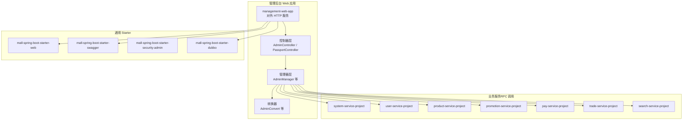
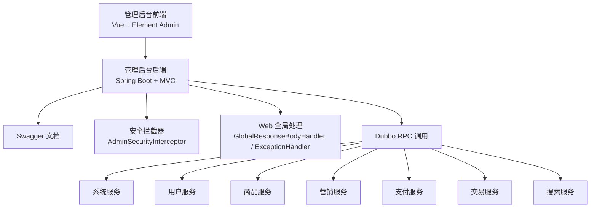
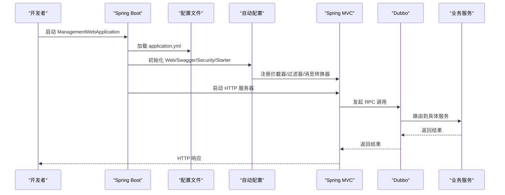
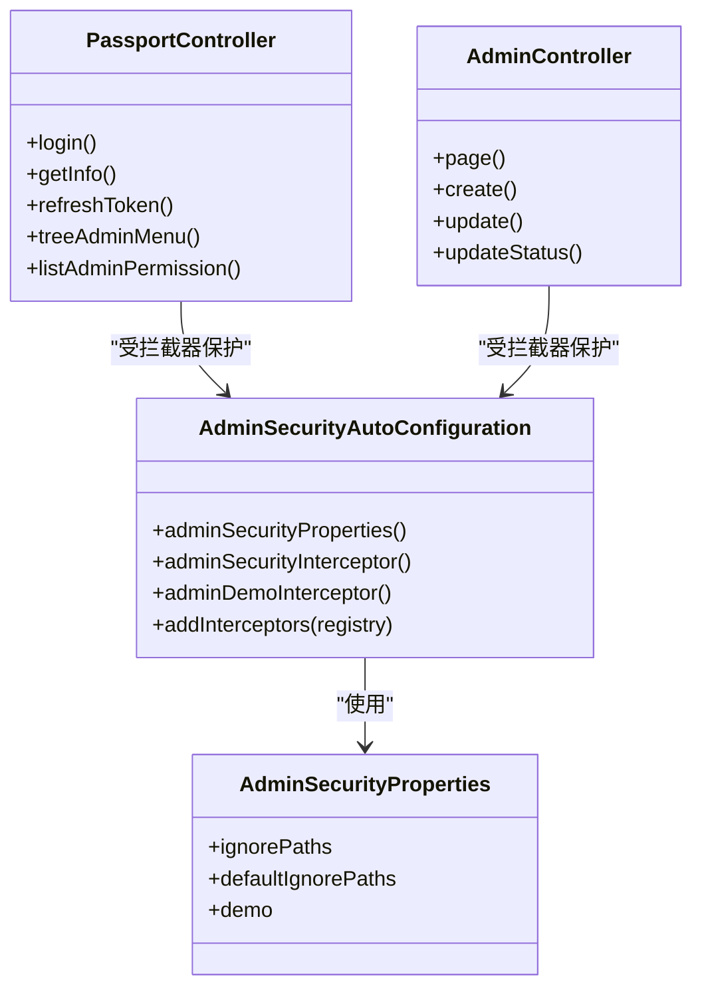
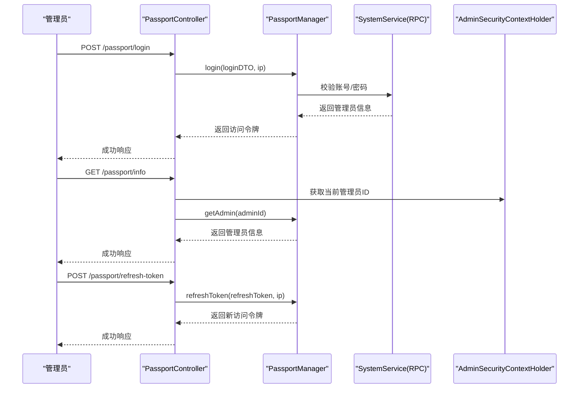
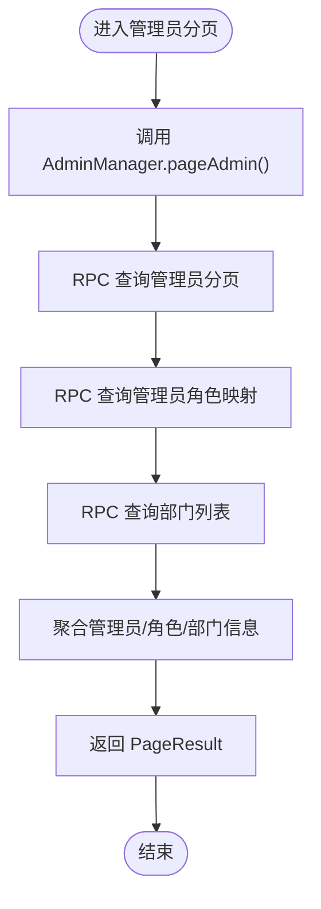
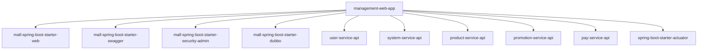

# 管理后台概览

<cite>
**本文引用的文件**
- [ManagementWebApplication.java](file://management-web-app/src/main/java/cn/iocoder/mall/managementweb/ManagementWebApplication.java)
- [application.yml](file://management-web-app/src/main/resources/application.yml)
- [pom.xml](file://management-web-app/pom.xml)
- [AdminController.java](file://management-web-app/src/main/java/cn/iocoder/mall/managementweb/controller/admin/AdminController.java)
- [PassportController.java](file://management-web-app/src/main/java/cn/iocoder/mall/managementweb/controller/passport/PassportController.java)
- [AdminManager.java](file://management-web-app/src/main/java/cn/iocoder/mall/managementweb/manager/admin/AdminManager.java)
- [AdminConvert.java](file://management-web-app/src/main/java/cn/iocoder/mall/managementweb/convert/admin/AdminConvert.java)
- [AdminSecurityAutoConfiguration.java](file://common/mall-spring-boot-starter-security-admin/src/main/java/cn/iocoder/mall/security/admin/config/AdminSecurityAutoConfiguration.java)
- [AdminSecurityProperties.java](file://common/mall-spring-boot-starter-security-admin/src/main/java/cn/iocoder/mall/security/admin/config/AdminSecurityProperties.java)
- [CommonWebAutoConfiguration.java](file://common/mall-spring-boot-starter-web/src/main/java/cn/iocoder/mall/web/config/CommonWebAutoConfiguration.java)
- [SwaggerAutoConfiguration.java](file://common/mall-spring-boot-starter-swagger/src/main/java/cn/iocoder/mall/swagger/config/SwaggerAutoConfiguration.java)
- [功能列表-管理后台.md](file://docs/guides/功能列表/功能列表-管理后台.md)
- [快速开始.md](file://docs/setup/quick-start.md)
- [README.md](file://README.md)
</cite>

## 目录
1. [简介](#简介)
2. [项目结构](#项目结构)
3. [核心组件](#核心组件)
4. [架构总览](#架构总览)
5. [详细组件分析](#详细组件分析)
6. [依赖分析](#依赖分析)
7. [性能考量](#性能考量)
8. [故障排查指南](#故障排查指南)
9. [结论](#结论)
10. [附录](#附录)

## 简介
管理后台是基于微服务架构的电商系统中的“管理员运营平台”，负责提供对系统内各类业务（如商品、订单、营销、支付、会员、系统管理等）的集中化管理能力。其核心定位是：
- 面向对象：面向平台运营人员与管理员，提供统一的后台管理入口。
- 功能范围：覆盖商品管理、订单处理、营销活动、支付对账、会员与权限、系统配置等。
- 技术角色：作为 HTTP API 网关侧的 Web 应用，通过 RPC 调用各领域服务（系统、用户、商品、营销、支付、交易、搜索等），并提供接口文档与安全控制。

管理后台在整体电商系统中的作用：
- 作为管理员的“中枢”，承载大量后台管理操作。
- 通过 Dubbo RPC 与各业务服务解耦，实现清晰的职责边界与可扩展性。
- 通过 Swagger 提供在线接口文档，提升联调效率。
- 通过安全拦截器与权限注解，保障后台接口的安全访问。

## 项目结构
管理后台采用“Web 应用 + 通用 Starter”的分层组织方式：
- management-web-app：对外提供 HTTP 接口的 Web 应用，包含控制器、管理器、转换器等。
- common：通用能力封装，如 Web、Swagger、安全（管理员）、系统错误码、缓存、Dubbo、MyBatis、Redis、RocketMQ、XXL-Job 等 Starter。
- 各业务服务：system-service-project、user-service-project、product-service-project、promotion-service-project、pay-service-project、trade-service-project、search-service-project（通过 RPC 被管理后台调用）。

图表来源
- [pom.xml:28-109](file://management-web-app/pom.xml#L28-L109)
- [CommonWebAutoConfiguration.java:28-97](file://common/mall-spring-boot-starter-web/src/main/java/cn/iocoder/mall/web/config/CommonWebAutoConfiguration.java#L28-L97)
- [SwaggerAutoConfiguration.java:23-58](file://common/mall-spring-boot-starter-swagger/src/main/java/cn/iocoder/mall/swagger/config/SwaggerAutoConfiguration.java#L23-L58)
- [AdminSecurityAutoConfiguration.java:17-61](file://common/mall-spring-boot-starter-security-admin/src/main/java/cn/iocoder/mall/security/admin/config/AdminSecurityAutoConfiguration.java#L17-L61)

章节来源
- [pom.xml:1-124](file://management-web-app/pom.xml#L1-L124)
- [README.md:107-139](file://README.md#L107-L139)

## 核心组件
- 启动类：管理后台的 Spring Boot 启动类，负责应用初始化与启动。
- 配置文件：application.yml 定义了服务器端口、上下文路径、Dubbo 消费者版本、Swagger 文档信息、Actuator 监控端口等。
- 控制器：提供管理员与登录认证相关的 HTTP 接口，如管理员分页、创建、更新、状态变更；登录、刷新令牌、获取当前管理员信息、菜单树与权限列表。
- 管理器：封装 RPC 调用逻辑，聚合系统服务返回的数据，组装为管理后台所需的视图对象。
- 转换器：使用 MapStruct 将 DTO/VO 与 RPC 返回的 VO 之间进行映射转换。
- 安全与 Web：通过 AdminSecurityAutoConfiguration 注册安全拦截器与演示拦截器；通过 CommonWebAutoConfiguration 注册全局响应处理器、异常处理器、跨域过滤器与消息转换器；通过 SwaggerAutoConfiguration 提供接口文档。

章节来源
- [ManagementWebApplication.java:1-14](file://management-web-app/src/main/java/cn/iocoder/mall/managementweb/ManagementWebApplication.java#L1-L14)
- [application.yml:1-83](file://management-web-app/src/main/resources/application.yml#L1-L83)
- [AdminController.java:1-68](file://management-web-app/src/main/java/cn/iocoder/mall/managementweb/controller/admin/AdminController.java#L1-L68)
- [PassportController.java:1-68](file://management-web-app/src/main/java/cn/iocoder/mall/managementweb/controller/passport/PassportController.java#L1-L68)
- [AdminManager.java:1-122](file://management-web-app/src/main/java/cn/iocoder/mall/managementweb/manager/admin/AdminManager.java#L1-L122)
- [AdminConvert.java:1-42](file://management-web-app/src/main/java/cn/iocoder/mall/managementweb/convert/admin/AdminConvert.java#L1-L42)
- [AdminSecurityAutoConfiguration.java:17-61](file://common/mall-spring-boot-starter-security-admin/src/main/java/cn/iocoder/mall/security/admin/config/AdminSecurityAutoConfiguration.java#L17-L61)
- [CommonWebAutoConfiguration.java:28-97](file://common/mall-spring-boot-starter-web/src/main/java/cn/iocoder/mall/web/config/CommonWebAutoConfiguration.java#L28-L97)
- [SwaggerAutoConfiguration.java:23-58](file://common/mall-spring-boot-starter-swagger/src/main/java/cn/iocoder/mall/swagger/config/SwaggerAutoConfiguration.java#L23-L58)

## 架构总览
管理后台采用“前后端分离 + 微服务 RPC”的架构：
- 前端：Vue + Element Admin（管理后台前端工程）。
- 后端：Spring Boot + Spring MVC + Swagger + Dubbo + Nacos/Zookeeper。
- 安全：基于注解的权限控制与拦截器链路。
- 监控：Actuator 暴露端点，便于运维与健康检查。

图表来源
- [README.md:169-184](file://README.md#L169-L184)
- [application.yml:72-83](file://management-web-app/src/main/resources/application.yml#L72-L83)
- [pom.xml:28-109](file://management-web-app/pom.xml#L28-L109)

## 详细组件分析

### 启动流程与运行机制
- 启动类：通过 Spring Boot 启动管理后台应用。
- 配置加载：读取 application.yml，初始化服务器端口、上下文路径、Dubbo 消费者版本、Swagger 文档信息、Actuator 监控端口等。
- 自动装配：Web、Swagger、安全等 Starter 自动装配，注册拦截器、过滤器、消息转换器与文档生成器。
- RPC 发现：通过 Nacos 或 Zookeeper 进行服务发现与路由。

图表来源
- [ManagementWebApplication.java:6-11](file://management-web-app/src/main/java/cn/iocoder/mall/managementweb/ManagementWebApplication.java#L6-L11)
- [application.yml:1-83](file://management-web-app/src/main/resources/application.yml#L1-L83)
- [CommonWebAutoConfiguration.java:34-97](file://common/mall-spring-boot-starter-web/src/main/java/cn/iocoder/mall/web/config/CommonWebAutoConfiguration.java#L34-L97)
- [SwaggerAutoConfiguration.java:37-56](file://common/mall-spring-boot-starter-swagger/src/main/java/cn/iocoder/mall/swagger/config/SwaggerAutoConfiguration.java#L37-L56)

章节来源
- [ManagementWebApplication.java:1-14](file://management-web-app/src/main/java/cn/iocoder/mall/managementweb/ManagementWebApplication.java#L1-L14)
- [application.yml:1-83](file://management-web-app/src/main/resources/application.yml#L1-L83)

### 安全与权限控制
- 安全自动配置：注册管理员安全拦截器与演示拦截器，支持忽略路径配置与演示模式开关。
- 权限注解：控制器方法上使用权限注解，确保只有具备相应权限的管理员才能访问。
- 上下文持有：通过 AdminSecurityContextHolder 获取当前管理员上下文信息。

图表来源
- [AdminSecurityAutoConfiguration.java:17-61](file://common/mall-spring-boot-starter-security-admin/src/main/java/cn/iocoder/mall/security/admin/config/AdminSecurityAutoConfiguration.java#L17-L61)
- [AdminSecurityProperties.java:1-60](file://common/mall-spring-boot-starter-security-admin/src/main/java/cn/iocoder/mall/security/admin/config/AdminSecurityProperties.java#L1-L60)
- [PassportController.java:23-68](file://management-web-app/src/main/java/cn/iocoder/mall/managementweb/controller/passport/PassportController.java#L23-L68)
- [AdminController.java:28-68](file://management-web-app/src/main/java/cn/iocoder/mall/managementweb/controller/admin/AdminController.java#L28-L68)

章节来源
- [AdminSecurityAutoConfiguration.java:17-61](file://common/mall-spring-boot-starter-security-admin/src/main/java/cn/iocoder/mall/security/admin/config/AdminSecurityAutoConfiguration.java#L17-L61)
- [AdminSecurityProperties.java:1-60](file://common/mall-spring-boot-starter-security-admin/src/main/java/cn/iocoder/mall/security/admin/config/AdminSecurityProperties.java#L1-L60)
- [PassportController.java:1-68](file://management-web-app/src/main/java/cn/iocoder/mall/managementweb/controller/passport/PassportController.java#L1-L68)
- [AdminController.java:1-68](file://management-web-app/src/main/java/cn/iocoder/mall/managementweb/controller/admin/AdminController.java#L1-L68)

### 管理员与登录认证流程
- 登录：管理员输入账号密码，系统校验后返回访问令牌与刷新令牌。
- 刷新：使用刷新令牌换取新的访问令牌。
- 当前信息：根据当前管理员上下文返回管理员信息、菜单树与权限集合。

图表来源
- [PassportController.java:31-51](file://management-web-app/src/main/java/cn/iocoder/mall/managementweb/controller/passport/PassportController.java#L31-L51)
- [AdminManager.java:98-122](file://management-web-app/src/main/java/cn/iocoder/mall/managementweb/manager/admin/AdminManager.java#L98-L122)

章节来源
- [PassportController.java:1-68](file://management-web-app/src/main/java/cn/iocoder/mall/managementweb/controller/passport/PassportController.java#L1-L68)
- [AdminManager.java:1-122](file://management-web-app/src/main/java/cn/iocoder/mall/managementweb/manager/admin/AdminManager.java#L1-L122)

### 管理员分页与管理流程
- 分页查询：传入分页参数，RPC 调用系统服务获取管理员列表，并聚合角色与部门信息。
- 创建/更新/状态变更：通过管理器封装 DTO，调用系统服务完成管理员信息维护。

图表来源
- [AdminManager.java:39-71](file://management-web-app/src/main/java/cn/iocoder/mall/managementweb/manager/admin/AdminManager.java#L39-L71)
- [AdminConvert.java:19-42](file://management-web-app/src/main/java/cn/iocoder/mall/managementweb/convert/admin/AdminConvert.java#L19-L42)

章节来源
- [AdminManager.java:1-122](file://management-web-app/src/main/java/cn/iocoder/mall/managementweb/manager/admin/AdminManager.java#L1-L122)
- [AdminConvert.java:1-42](file://management-web-app/src/main/java/cn/iocoder/mall/managementweb/convert/admin/AdminConvert.java#L1-L42)

### 接口文档与全局处理
- Swagger：通过 SwaggerAutoConfiguration 自动装配 Knife4j 增强文档，按配置扫描控制器包生成接口文档。
- Web 全局处理：通过 CommonWebAutoConfiguration 注册全局响应包装、异常处理、跨域过滤与 JSON 消息转换器。

章节来源
- [SwaggerAutoConfiguration.java:23-58](file://common/mall-spring-boot-starter-swagger/src/main/java/cn/iocoder/mall/swagger/config/SwaggerAutoConfiguration.java#L23-L58)
- [CommonWebAutoConfiguration.java:28-97](file://common/mall-spring-boot-starter-web/src/main/java/cn/iocoder/mall/web/config/CommonWebAutoConfiguration.java#L28-L97)

## 依赖分析
管理后台的关键依赖关系如下：
- Web：mall-spring-boot-starter-web 提供全局处理、拦截器、过滤器与消息转换器。
- Swagger：mall-spring-boot-starter-swagger 提供接口文档生成。
- 安全（管理员）：mall-spring-boot-starter-security-admin 提供管理员安全拦截器与属性配置。
- RPC：mall-spring-boot-starter-dubbo 提供 Dubbo 自动配置与过滤器。
- 业务服务：通过 user-service-api、system-service-api、product-service-api、promotion-service-api、pay-service-api 等 RPC 接口调用各领域服务。
- 监控：spring-boot-starter-actuator 提供健康检查与指标暴露。

图表来源
- [pom.xml:28-109](file://management-web-app/pom.xml#L28-L109)

章节来源
- [pom.xml:1-124](file://management-web-app/pom.xml#L1-L124)

## 性能考量
- RPC 调用：合理设置 Dubbo 超时与校验，避免阻塞；对批量查询（如管理员分页）尽量减少多次 RPC 调用，聚合结果后再返回。
- 缓存策略：对于高频读取的配置、字典、菜单等，可引入缓存（Redis/Redisson）降低 RPC 压力。
- 序列化：使用 FastJSON 作为默认消息转换器，注意避免循环引用与键类型问题。
- 监控与可观测性：启用 Actuator 暴露端点，结合 Prometheus/Grafana/SkyWalking 进行性能监控与追踪。

## 故障排查指南
- 启动失败
  - 检查 application.yml 中的服务器端口、上下文路径、Dubbo 注册中心与消费者版本配置。
  - 确认 Actuator 独立端口未冲突。
- 接口 403/401
  - 检查控制器上的权限注解与安全拦截器配置，确认管理员已登录且具备相应权限。
- RPC 调用超时或失败
  - 检查 Dubbo 消费者超时设置与注册中心连通性；确认对应业务服务已启动。
- 接口文档不可见
  - 检查 Swagger 配置与扫描包路径，确认 Knife4j 已正确启用。

章节来源
- [application.yml:1-83](file://management-web-app/src/main/resources/application.yml#L1-L83)
- [AdminSecurityAutoConfiguration.java:43-58](file://common/mall-spring-boot-starter-security-admin/src/main/java/cn/iocoder/mall/security/admin/config/AdminSecurityAutoConfiguration.java#L43-L58)
- [SwaggerAutoConfiguration.java:37-56](file://common/mall-spring-boot-starter-swagger/src/main/java/cn/iocoder/mall/swagger/config/SwaggerAutoConfiguration.java#L37-L56)

## 结论
管理后台作为电商系统的“运营中枢”，通过清晰的分层与微服务 RPC 架构，实现了高内聚、低耦合的后台管理能力。借助统一的安全拦截、全局异常处理与接口文档，提升了开发与运维效率。配合完善的部署与监控体系，可支撑从开发到生产的全流程需求。

## 附录

### 环境要求与部署方式
- 环境要求
  - JDK 8+
  - Maven
  - IntelliJ IDEA
  - MySQL（按需）
  - Zookeeper（Dubbo 注册中心）
  - RocketMQ（消息中间件，按需）
  - Nacos（可选，作为注册与配置中心）
- 部署方式
  - 后端：使用 Maven 打包为 Spring Boot 可执行 Jar，独立运行。
  - 前端：管理后台前端工程通过 npm 启动，访问指定端口。
- 基本配置
  - 修改 application.yml 中的服务器端口、上下文路径、Dubbo 消费者版本、Swagger 文档信息、Actuator 独立端口等。
  - 如需启用 Nacos 或 Zookeeper，按 quick-start 指引修改对应配置。

章节来源
- [快速开始.md:9-191](file://docs/setup/quick-start.md#L9-L191)
- [application.yml:1-83](file://management-web-app/src/main/resources/application.yml#L1-L83)

### 功能定位与目标用户
- 目标用户：平台运营人员、管理员。
- 主要功能：商品管理、订单管理、营销管理、支付管理、会员管理、系统管理（员工、角色、权限、部门、数据字典、短信、日志等）。
- 功能列表参考：详见功能列表文档。

章节来源
- [功能列表-管理后台.md:1-61](file://docs/guides/功能列表/功能列表-管理后台.md#L1-L61)