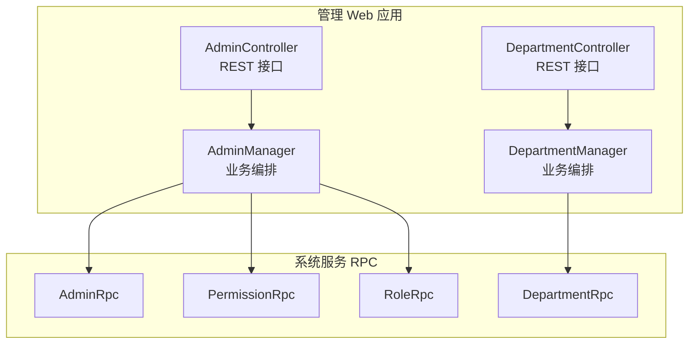
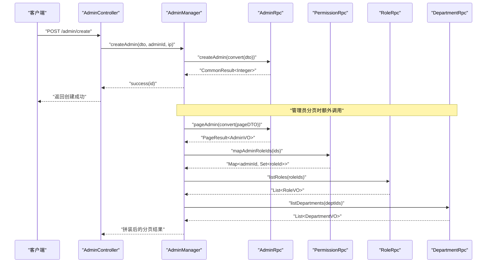
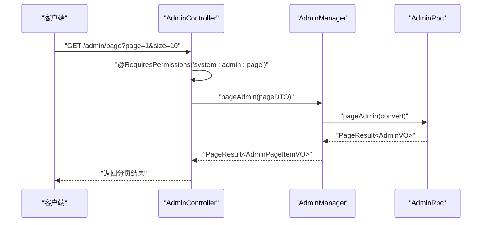
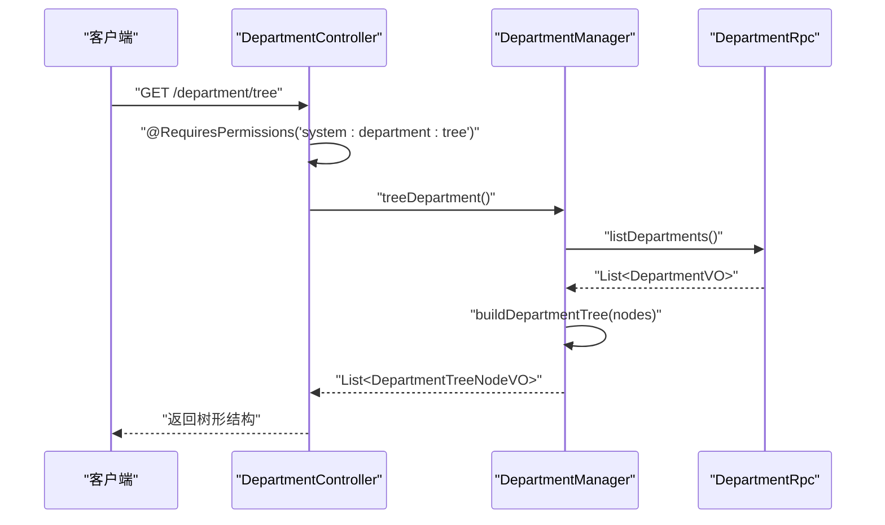
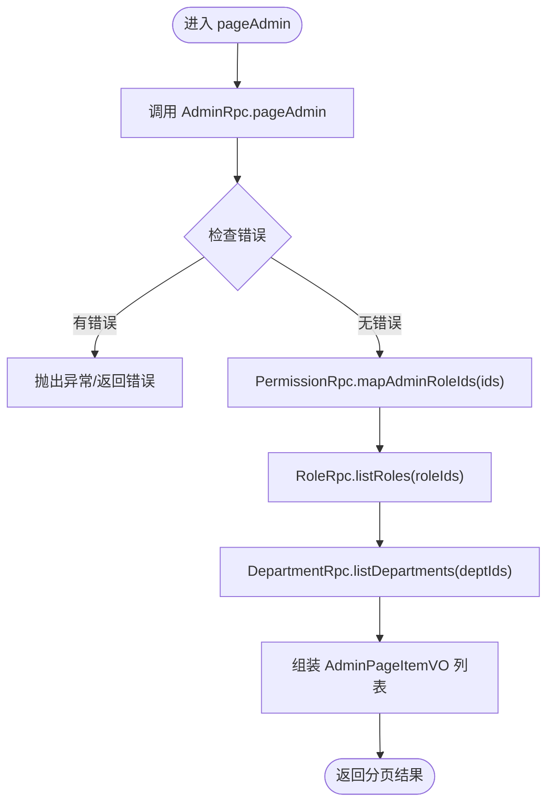
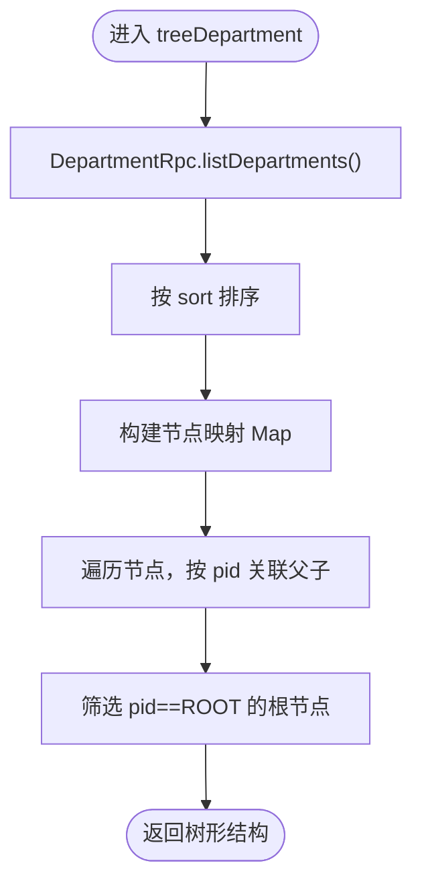
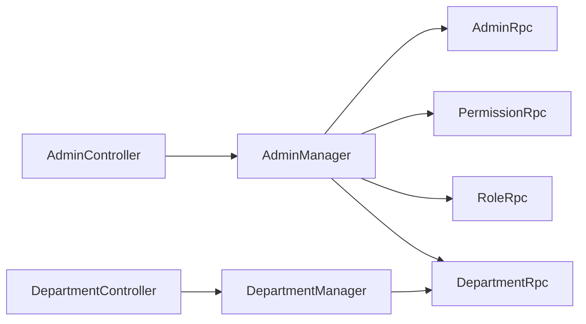

# 管理员管理

<cite>
**本文引用的文件**
- [AdminController.java](file://management-web-app/src/main/java/cn/iocoder/mall/managementweb/controller/admin/AdminController.java)
- [DepartmentController.java](file://management-web-app/src/main/java/cn/iocoder/mall/managementweb/controller/admin/DepartmentController.java)
- [AdminManager.java](file://management-web-app/src/main/java/cn/iocoder/mall/managementweb/manager/admin/AdminManager.java)
- [DepartmentManager.java](file://management-web-app/src/main/java/cn/iocoder/mall/managementweb/manager/admin/DepartmentManager.java)
- [AdminCreateDTO.java](file://management-web-app/src/main/java/cn/iocoder/mall/managementweb/controller/admin/dto/AdminCreateDTO.java)
- [DepartmentCreateDTO.java](file://management-web-app/src/main/java/cn/iocoder/mall/managementweb/controller/admin/dto/DepartmentCreateDTO.java)
- [AdminRpc.java](file://system-service-project/system-service-api/src/main/java/cn/iocoder/mall/systemservice/rpc/admin/AdminRpc.java)
- [DepartmentRpc.java](file://system-service-project/system-service-api/src/main/java/cn/iocoder/mall/systemservice/rpc/admin/DepartmentRpc.java)
- [PermissionRpc.java](file://system-service-project/system-service-api/src/main/java/cn/iocoder/mall/systemservice/rpc/permission/PermissionRpc.java)
- [RoleRpc.java](file://system-service-project/system-service-api/src/main/java/cn/iocoder/mall/systemservice/rpc/permission/RoleRpc.java)
- [DepartmentVO.java](file://system-service-project/system-service-api/src/main/java/cn/iocoder/mall/systemservice/rpc/admin/vo/DepartmentVO.java)
- [DepartmentIdEnum.java](file://system-service-project/system-service-api/src/main/java/cn/iocoder/mall/systemservice/enums/admin/DepartmentIdEnum.java)
</cite>

## 目录
1. [简介](#简介)
2. [项目结构](#项目结构)
3. [核心组件](#核心组件)
4. [架构总览](#架构总览)
5. [详细组件分析](#详细组件分析)
6. [依赖分析](#依赖分析)
7. [性能考虑](#性能考虑)
8. [故障排查指南](#故障排查指南)
9. [结论](#结论)
10. [附录：接口调用示例与错误处理](#附录接口调用示例与错误处理)

## 简介
本技术文档围绕“管理员管理”能力展开，系统性阐述管理后台对管理员的增删改查、状态管理、部门组织架构管理，以及管理员与部门的关联关系、树形结构的部门管理与层级权限控制。同时，文档详细说明控制器（AdminController、DepartmentController）的接口设计与业务逻辑，涵盖管理员登录、权限验证、个人信息修改等流程；并对权限分配机制（角色管理、资源授权、操作审计）进行说明；最后给出数据转换层与业务管理层的实现细节、接口调用示例与错误处理方案。

## 项目结构
管理后台采用前后端分离与微服务架构，管理 Web 应用通过 Dubbo 远程调用系统服务模块提供的 RPC 接口，完成管理员与部门的管理操作。核心文件分布如下：
- 控制器层：管理 Web 应用中的 AdminController、DepartmentController 提供 REST 接口
- 管理器层：AdminManager、DepartmentManager 负责业务编排与 RPC 调用
- RPC 接口层：系统服务模块暴露 AdminRpc、DepartmentRpc、PermissionRpc、RoleRpc
- 数据传输对象与值对象：DTO/VO 定义请求参数与返回结构
- 枚举与工具：DepartmentIdEnum 表示根节点标识

图表来源
- [AdminController.java:32-67](file://management-web-app/src/main/java/cn/iocoder/mall/managementweb/controller/admin/AdminController.java#L32-L67)
- [DepartmentController.java:29-81](file://management-web-app/src/main/java/cn/iocoder/mall/managementweb/controller/admin/DepartmentController.java#L29-L81)
- [AdminManager.java:28-121](file://management-web-app/src/main/java/cn/iocoder/mall/managementweb/manager/admin/AdminManager.java#L28-L121)
- [DepartmentManager.java:23-128](file://management-web-app/src/main/java/cn/iocoder/mall/managementweb/manager/admin/DepartmentManager.java#L23-L128)
- [AdminRpc.java:14-26](file://system-service-project/system-service-api/src/main/java/cn/iocoder/mall/systemservice/rpc/admin/AdminRpc.java#L14-L26)
- [DepartmentRpc.java:14-61](file://system-service-project/system-service-api/src/main/java/cn/iocoder/mall/systemservice/rpc/admin/DepartmentRpc.java#L14-L61)
- [PermissionRpc.java:15-68](file://system-service-project/system-service-api/src/main/java/cn/iocoder/mall/systemservice/rpc/permission/PermissionRpc.java#L15-L68)
- [RoleRpc.java:17-80](file://system-service-project/system-service-api/src/main/java/cn/iocoder/mall/systemservice/rpc/permission/RoleRpc.java#L17-L80)

章节来源
- [AdminController.java:32-67](file://management-web-app/src/main/java/cn/iocoder/mall/managementweb/controller/admin/AdminController.java#L32-L67)
- [DepartmentController.java:29-81](file://management-web-app/src/main/java/cn/iocoder/mall/managementweb/controller/admin/DepartmentController.java#L29-L81)
- [AdminManager.java:28-121](file://management-web-app/src/main/java/cn/iocoder/mall/managementweb/manager/admin/AdminManager.java#L28-L121)
- [DepartmentManager.java:23-128](file://management-web-app/src/main/java/cn/iocoder/mall/managementweb/manager/admin/DepartmentManager.java#L23-L128)

## 核心组件
- 控制器层
  - AdminController：提供管理员分页、创建、更新、状态更新接口，使用注解进行权限校验
  - DepartmentController：提供部门创建、更新、删除、查询、树形结构查询接口，使用注解进行权限校验
- 管理器层
  - AdminManager：封装管理员相关 RPC 调用，负责分页组装管理员所属部门与角色信息
  - DepartmentManager：封装部门相关 RPC 调用，负责构建部门树形结构
- RPC 接口层
  - AdminRpc：管理员认证、创建、更新、分页、详情查询
  - DepartmentRpc：部门创建、更新、删除、单个/批量/全量查询、全量查询
  - PermissionRpc：角色与管理员、角色与资源的映射与授权
  - RoleRpc：角色创建、更新、删除、查询、分页、批量查询
- 数据模型
  - AdminCreateDTO、DepartmentCreateDTO：请求参数校验与结构定义
  - DepartmentVO：部门值对象，包含 id、name、sort、pid、createTime
  - DepartmentIdEnum：根节点标识

章节来源
- [AdminController.java:32-67](file://management-web-app/src/main/java/cn/iocoder/mall/managementweb/controller/admin/AdminController.java#L32-L67)
- [DepartmentController.java:29-81](file://management-web-app/src/main/java/cn/iocoder/mall/managementweb/controller/admin/DepartmentController.java#L29-L81)
- [AdminManager.java:28-121](file://management-web-app/src/main/java/cn/iocoder/mall/managementweb/manager/admin/AdminManager.java#L28-L121)
- [DepartmentManager.java:23-128](file://management-web-app/src/main/java/cn/iocoder/mall/managementweb/manager/admin/DepartmentManager.java#L23-L128)
- [AdminRpc.java:14-26](file://system-service-project/system-service-api/src/main/java/cn/iocoder/mall/systemservice/rpc/admin/AdminRpc.java#L14-L26)
- [DepartmentRpc.java:14-61](file://system-service-project/system-service-api/src/main/java/cn/iocoder/mall/systemservice/rpc/admin/DepartmentRpc.java#L14-L61)
- [PermissionRpc.java:15-68](file://system-service-project/system-service-api/src/main/java/cn/iocoder/mall/systemservice/rpc/permission/PermissionRpc.java#L15-L68)
- [RoleRpc.java:17-80](file://system-service-project/system-service-api/src/main/java/cn/iocoder/mall/systemservice/rpc/permission/RoleRpc.java#L17-L80)
- [AdminCreateDTO.java:16-38](file://management-web-app/src/main/java/cn/iocoder/mall/managementweb/controller/admin/dto/AdminCreateDTO.java#L16-L38)
- [DepartmentCreateDTO.java:12-24](file://management-web-app/src/main/java/cn/iocoder/mall/managementweb/controller/admin/dto/DepartmentCreateDTO.java#L12-L24)
- [DepartmentVO.java:14-37](file://system-service-project/system-service-api/src/main/java/cn/iocoder/mall/systemservice/rpc/admin/vo/DepartmentVO.java#L14-L37)
- [DepartmentIdEnum.java:6-23](file://system-service-project/system-service-api/src/main/java/cn/iocoder/mall/systemservice/enums/admin/DepartmentIdEnum.java#L6-L23)

## 架构总览
管理员管理采用“控制器-管理器-RPC”的分层架构，管理器负责聚合多个 RPC 调用以完成复杂业务，如管理员分页时需要同时查询管理员列表、其所属部门、其拥有的角色集合，并进行数据拼装。

图表来源
- [AdminController.java:44-49](file://management-web-app/src/main/java/cn/iocoder/mall/managementweb/controller/admin/AdminController.java#L44-L49)
- [AdminManager.java:98-113](file://management-web-app/src/main/java/cn/iocoder/mall/managementweb/manager/admin/AdminManager.java#L98-L113)
- [AdminRpc.java:18-24](file://system-service-project/system-service-api/src/main/java/cn/iocoder/mall/systemservice/rpc/admin/AdminRpc.java#L18-L24)
- [PermissionRpc.java:48-48](file://system-service-project/system-service-api/src/main/java/cn/iocoder/mall/systemservice/rpc/permission/PermissionRpc.java#L48-L48)
- [RoleRpc.java:62-62](file://system-service-project/system-service-api/src/main/java/cn/iocoder/mall/systemservice/rpc/permission/RoleRpc.java#L62-L62)
- [DepartmentRpc.java:52-52](file://system-service-project/system-service-api/src/main/java/cn/iocoder/mall/systemservice/rpc/admin/DepartmentRpc.java#L52-L52)

## 详细组件分析

### AdminController 分析
- 职责
  - 提供管理员分页查询、创建、更新、状态更新接口
  - 基于注解进行权限校验，确保操作安全
- 关键接口
  - GET /admin/page：分页查询管理员
  - POST /admin/create：创建管理员（记录创建人与 IP）
  - POST /admin/update：更新管理员信息
  - POST /admin/update-status：更新管理员状态
- 权限点
  - system:admin:page、system:admin:create、system:admin:update、system:admin:update-status

图表来源
- [AdminController.java:37-42](file://management-web-app/src/main/java/cn/iocoder/mall/managementweb/controller/admin/AdminController.java#L37-L42)
- [AdminManager.java:39-71](file://management-web-app/src/main/java/cn/iocoder/mall/managementweb/manager/admin/AdminManager.java#L39-L71)
- [AdminRpc.java:22-22](file://system-service-project/system-service-api/src/main/java/cn/iocoder/mall/systemservice/rpc/admin/AdminRpc.java#L22-L22)

章节来源
- [AdminController.java:32-67](file://management-web-app/src/main/java/cn/iocoder/mall/managementweb/controller/admin/AdminController.java#L32-L67)

### DepartmentController 分析
- 职责
  - 提供部门创建、更新、删除、查询、树形结构查询接口
  - 基于注解进行权限校验
- 关键接口
  - POST /department/create：创建部门
  - POST /department/update：更新部门
  - POST /department/delete：删除部门
  - GET /department/get：按 ID 获取部门
  - GET /department/list：按 ID 列表获取部门
  - GET /department/tree：获取部门树
- 权限点
  - system:department:create、system:department:update、system:department:delete、system:department:tree

图表来源
- [DepartmentController.java:74-79](file://management-web-app/src/main/java/cn/iocoder/mall/managementweb/controller/admin/DepartmentController.java#L74-L79)
- [DepartmentManager.java:89-95](file://management-web-app/src/main/java/cn/iocoder/mall/managementweb/manager/admin/DepartmentManager.java#L89-L95)
- [DepartmentRpc.java:59-59](file://system-service-project/system-service-api/src/main/java/cn/iocoder/mall/systemservice/rpc/admin/DepartmentRpc.java#L59-L59)

章节来源
- [DepartmentController.java:29-81](file://management-web-app/src/main/java/cn/iocoder/mall/managementweb/controller/admin/DepartmentController.java#L29-L81)

### AdminManager 分析
- 职责
  - 管理员分页：聚合管理员列表、部门列表、角色映射，拼装为前端可展示的分页项
  - 创建/更新/状态更新：委托 AdminRpc 执行
  - 获取管理员：委托 AdminRpc 执行
- 关键流程
  - 分页时先调用 AdminRpc.pageAdmin 获取管理员列表
  - 再通过 PermissionRpc.mapAdminRoleIds 获取管理员-角色映射
  - 通过 RoleRpc.listRoles 获取角色详情
  - 通过 DepartmentRpc.listDepartments 获取部门详情
  - 最终拼装为 AdminPageItemVO 列表返回

图表来源
- [AdminManager.java:39-96](file://management-web-app/src/main/java/cn/iocoder/mall/managementweb/manager/admin/AdminManager.java#L39-L96)
- [PermissionRpc.java:48-48](file://system-service-project/system-service-api/src/main/java/cn/iocoder/mall/systemservice/rpc/permission/PermissionRpc.java#L48-L48)
- [RoleRpc.java:62-62](file://system-service-project/system-service-api/src/main/java/cn/iocoder/mall/systemservice/rpc/permission/RoleRpc.java#L62-L62)
- [DepartmentRpc.java:52-52](file://system-service-project/system-service-api/src/main/java/cn/iocoder/mall/systemservice/rpc/admin/DepartmentRpc.java#L52-L52)

章节来源
- [AdminManager.java:28-121](file://management-web-app/src/main/java/cn/iocoder/mall/managementweb/manager/admin/AdminManager.java#L28-L121)

### DepartmentManager 分析
- 职责
  - 部门 CRUD：委托 DepartmentRpc 执行
  - 部门树构建：从全量部门列表出发，按 sort 排序，使用 LinkedHashMap 保持顺序，再根据 pid 组织父子关系，最终筛选根节点
- 关键流程
  - treeDepartment：调用 DepartmentRpc.listDepartments 获取全量部门，调用 buildDepartmentTree
  - buildDepartmentTree：排序 → 节点映射 → 处理父子关系 → 过滤根节点

图表来源
- [DepartmentManager.java:89-126](file://management-web-app/src/main/java/cn/iocoder/mall/managementweb/manager/admin/DepartmentManager.java#L89-L126)
- [DepartmentIdEnum.java:6-23](file://system-service-project/system-service-api/src/main/java/cn/iocoder/mall/systemservice/enums/admin/DepartmentIdEnum.java#L6-L23)

章节来源
- [DepartmentManager.java:23-128](file://management-web-app/src/main/java/cn/iocoder/mall/managementweb/manager/admin/DepartmentManager.java#L23-L128)

### 权限与角色管理
- 角色管理
  - RoleRpc：提供角色的创建、更新、删除、查询、分页、批量查询、管理员角色映射查询
- 权限分配
  - PermissionRpc：提供角色-资源映射查询、角色-资源授权、管理员-角色授权、权限校验
- 管理员与角色/部门的关联
  - AdminManager 在分页时通过 PermissionRpc.mapAdminRoleIds 获取管理员的角色集合，并通过 RoleRpc.listRoles 获取角色详情
  - 通过 DepartmentRpc.listDepartments 获取管理员所属部门详情

章节来源
- [RoleRpc.java:17-80](file://system-service-project/system-service-api/src/main/java/cn/iocoder/mall/systemservice/rpc/permission/RoleRpc.java#L17-L80)
- [PermissionRpc.java:15-68](file://system-service-project/system-service-api/src/main/java/cn/iocoder/mall/systemservice/rpc/permission/PermissionRpc.java#L15-L68)
- [AdminManager.java:73-96](file://management-web-app/src/main/java/cn/iocoder/mall/managementweb/manager/admin/AdminManager.java#L73-L96)

### 登录与权限验证
- 登录流程
  - 管理员登录由系统服务模块的 AdminRpc.verifyPassword 提供支持，用于校验账号与密码
- 权限验证
  - 控制器层通过注解 @RequiresPermissions 对接口进行权限拦截
  - 权限校验可通过 PermissionRpc.checkPermission 实现（在系统服务侧执行）

章节来源
- [AdminRpc.java:16-16](file://system-service-project/system-service-api/src/main/java/cn/iocoder/mall/systemservice/rpc/admin/AdminRpc.java#L16-L16)
- [PermissionRpc.java:58-66](file://system-service-project/system-service-api/src/main/java/cn/iocoder/mall/systemservice/rpc/permission/PermissionRpc.java#L58-L66)
- [AdminController.java:38-46](file://management-web-app/src/main/java/cn/iocoder/mall/managementweb/controller/admin/AdminController.java#L38-L46)

### 个人信息修改
- 修改内容
  - 支持更新管理员基本信息（如姓名、手机号等），具体字段以 AdminUpdateInfoDTO 为准
- 流程
  - 控制器接收请求后，调用 AdminManager.updateAdmin，最终委托 AdminRpc.updateAdmin 执行

章节来源
- [AdminController.java:51-56](file://management-web-app/src/main/java/cn/iocoder/mall/managementweb/controller/admin/AdminController.java#L51-L56)
- [AdminManager.java:105-108](file://management-web-app/src/main/java/cn/iocoder/mall/managementweb/manager/admin/AdminManager.java#L105-L108)
- [AdminRpc.java:20-20](file://system-service-project/system-service-api/src/main/java/cn/iocoder/mall/systemservice/rpc/admin/AdminRpc.java#L20-L20)

### 状态管理
- 管理员状态更新通过 AdminController.update-status 接口实现，调用 AdminManager.updateAdminStatus，最终委托 AdminRpc.updateAdmin 执行

章节来源
- [AdminController.java:59-65](file://management-web-app/src/main/java/cn/iocoder/mall/managementweb/controller/admin/AdminController.java#L59-L65)
- [AdminManager.java:110-113](file://management-web-app/src/main/java/cn/iocoder/mall/managementweb/manager/admin/AdminManager.java#L110-L113)
- [AdminRpc.java:20-20](file://system-service-project/system-service-api/src/main/java/cn/iocoder/mall/systemservice/rpc/admin/AdminRpc.java#L20-L20)

### 部门组织架构与树形结构
- 部门树构建
  - DepartmentManager.treeDepartment 先获取全量部门，再调用 buildDepartmentTree
  - buildDepartmentTree 使用 LinkedHashMap 保持顺序，按 pid 建立父子关系，最后筛选根节点
- 根节点标识
  - DepartmentIdEnum.ROOT 表示根节点 pid

章节来源
- [DepartmentManager.java:89-126](file://management-web-app/src/main/java/cn/iocoder/mall/managementweb/manager/admin/DepartmentManager.java#L89-L126)
- [DepartmentIdEnum.java:6-23](file://system-service-project/system-service-api/src/main/java/cn/iocoder/mall/systemservice/enums/admin/DepartmentIdEnum.java#L6-L23)

## 依赖分析
- 控制器依赖管理器，管理器依赖 RPC 接口
- AdminManager 同时依赖 AdminRpc、PermissionRpc、RoleRpc、DepartmentRpc
- DepartmentManager 依赖 DepartmentRpc
- DTO/VO 作为数据契约，贯穿控制器、管理器与 RPC 层

图表来源
- [AdminController.java:34-35](file://management-web-app/src/main/java/cn/iocoder/mall/managementweb/controller/admin/AdminController.java#L34-L35)
- [DepartmentController.java:32-32](file://management-web-app/src/main/java/cn/iocoder/mall/managementweb/controller/admin/DepartmentController.java#L32-L32)
- [AdminManager.java:30-37](file://management-web-app/src/main/java/cn/iocoder/mall/managementweb/manager/admin/AdminManager.java#L30-L37)
- [DepartmentManager.java:25-26](file://management-web-app/src/main/java/cn/iocoder/mall/managementweb/manager/admin/DepartmentManager.java#L25-L26)

章节来源
- [AdminManager.java:28-121](file://management-web-app/src/main/java/cn/iocoder/mall/managementweb/manager/admin/AdminManager.java#L28-L121)
- [DepartmentManager.java:23-128](file://management-web-app/src/main/java/cn/iocoder/mall/managementweb/manager/admin/DepartmentManager.java#L23-L128)

## 性能考虑
- 分页查询优化
  - AdminManager 在分页时一次性拉取管理员列表、角色映射与部门集合，减少多次往返
  - 建议在系统服务侧对分页查询进行索引优化与缓存策略
- 树形结构构建
  - DepartmentManager.buildDepartmentTree 使用 LinkedHashMap 与一次遍历完成父子关系建立，时间复杂度 O(n)，适合大规模部门数据
- RPC 调用合并
  - 管理器层尽量合并 RPC 调用，避免 N+1 查询问题

## 故障排查指南
- 常见错误类型
  - 参数校验失败：AdminCreateDTO、DepartmentCreateDTO 的字段校验不通过
  - 权限不足：控制器注解 @RequiresPermissions 导致访问被拒绝
  - RPC 调用异常：AdminRpc、DepartmentRpc、PermissionRpc、RoleRpc 返回错误码或异常
- 排查步骤
  - 检查请求参数是否满足 DTO 校验规则
  - 确认当前管理员是否具备对应权限点
  - 查看管理器层对 CommonResult 的 checkError 调用是否抛出异常
  - 关注 DepartmentManager.buildDepartmentTree 中日志输出，确认是否存在找不到父节点的情况

章节来源
- [AdminCreateDTO.java:16-38](file://management-web-app/src/main/java/cn/iocoder/mall/managementweb/controller/admin/dto/AdminCreateDTO.java#L16-L38)
- [DepartmentCreateDTO.java:12-24](file://management-web-app/src/main/java/cn/iocoder/mall/managementweb/controller/admin/dto/DepartmentCreateDTO.java#L12-L24)
- [AdminManager.java:40-42](file://management-web-app/src/main/java/cn/iocoder/mall/managementweb/manager/admin/AdminManager.java#L40-L42)
- [DepartmentManager.java:111-117](file://management-web-app/src/main/java/cn/iocoder/mall/managementweb/manager/admin/DepartmentManager.java#L111-L117)

## 结论
管理员管理系统通过清晰的分层架构实现了管理员与部门的全生命周期管理，结合权限体系与角色授权，满足多层级组织与细粒度权限控制的需求。控制器层提供明确的接口边界，管理器层承担业务编排与 RPC 聚合，RPC 接口层承载核心领域能力。整体设计具备良好的扩展性与可维护性。

## 附录：接口调用示例与错误处理

### 接口调用示例
- 管理员分页
  - 方法：GET
  - 路径：/admin/page
  - 权限：system:admin:page
  - 请求参数：分页参数（如 page、size）
  - 返回：分页结果，包含管理员列表、所属部门、角色列表
- 创建管理员
  - 方法：POST
  - 路径：/admin/create
  - 权限：system:admin:create
  - 请求体：AdminCreateDTO（name、departmentId、username、password）
  - 返回：新管理员编号
- 更新管理员
  - 方法：POST
  - 路径：/admin/update
  - 权限：system:admin:update
  - 请求体：管理员更新信息 DTO
  - 返回：true/false
- 更新管理员状态
  - 方法：POST
  - 路径：/admin/update-status
  - 权限：system:admin:update-status
  - 请求体：状态更新 DTO
  - 返回：true/false
- 创建部门
  - 方法：POST
  - 路径：/department/create
  - 权限：system:department:create
  - 请求体：DepartmentCreateDTO（name、sort、pid）
  - 返回：部门编号
- 更新部门
  - 方法：POST
  - 路径：/department/update
  - 权限：system:department:update
  - 请求体：部门更新 DTO
  - 返回：true/false
- 删除部门
  - 方法：POST
  - 路径：/department/delete
  - 权限：system:department:delete
  - 参数：departmentId
  - 返回：true/false
- 获取部门
  - 方法：GET
  - 路径：/department/get
  - 权限：system:department:tree
  - 参数：departmentId
  - 返回：部门详情
- 获取部门列表
  - 方法：GET
  - 路径：/department/list
  - 权限：system:department:tree
  - 参数：departmentIds（列表）
  - 返回：部门详情列表
- 获取部门树
  - 方法：GET
  - 路径：/department/tree
  - 权限：system:department:tree
  - 返回：树形结构列表

章节来源
- [AdminController.java:37-65](file://management-web-app/src/main/java/cn/iocoder/mall/managementweb/controller/admin/AdminController.java#L37-L65)
- [DepartmentController.java:34-79](file://management-web-app/src/main/java/cn/iocoder/mall/managementweb/controller/admin/DepartmentController.java#L34-L79)
- [AdminCreateDTO.java:16-38](file://management-web-app/src/main/java/cn/iocoder/mall/managementweb/controller/admin/dto/AdminCreateDTO.java#L16-L38)
- [DepartmentCreateDTO.java:12-24](file://management-web-app/src/main/java/cn/iocoder/mall/managementweb/controller/admin/dto/DepartmentCreateDTO.java#L12-L24)

### 错误处理方案
- 参数校验
  - DTO 层使用注解进行必填、长度、格式校验，若不通过，控制器直接返回校验错误
- 权限校验
  - 控制器使用 @RequiresPermissions 注解进行权限拦截；若无权限，返回未授权错误
- RPC 调用
  - 管理器层统一使用 CommonResult.checkError() 检查 RPC 返回，出现错误则抛出异常或返回错误响应
- 树形构建
  - DepartmentManager.buildDepartmentTree 在找不到父节点时记录错误日志，避免树结构异常

章节来源
- [AdminCreateDTO.java:16-38](file://management-web-app/src/main/java/cn/iocoder/mall/managementweb/controller/admin/dto/AdminCreateDTO.java#L16-L38)
- [DepartmentCreateDTO.java:12-24](file://management-web-app/src/main/java/cn/iocoder/mall/managementweb/controller/admin/dto/DepartmentCreateDTO.java#L12-L24)
- [AdminManager.java:40-42](file://management-web-app/src/main/java/cn/iocoder/mall/managementweb/manager/admin/AdminManager.java#L40-L42)
- [DepartmentManager.java:111-117](file://management-web-app/src/main/java/cn/iocoder/mall/managementweb/manager/admin/DepartmentManager.java#L111-L117)