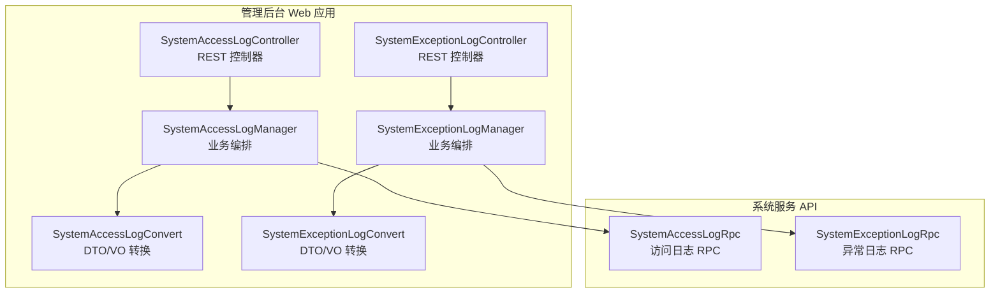
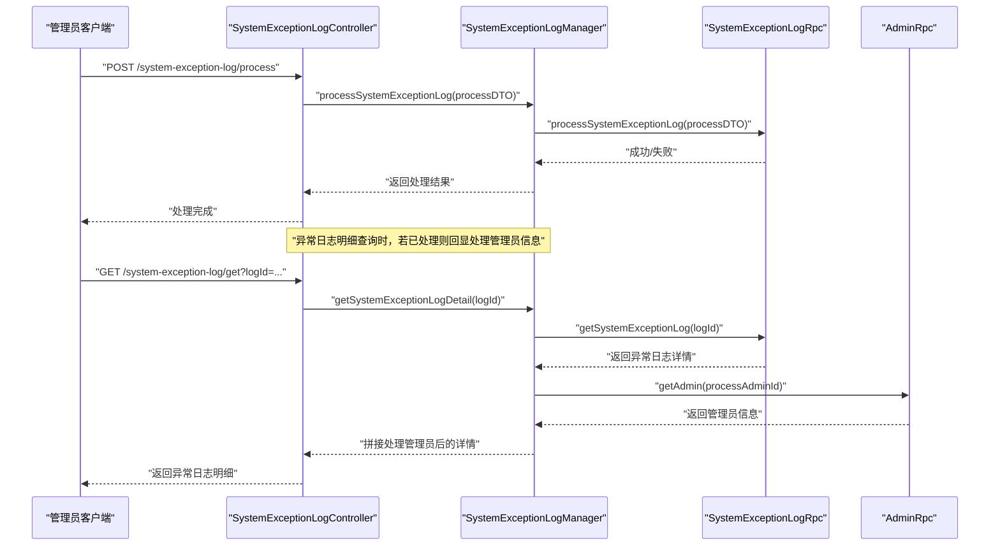
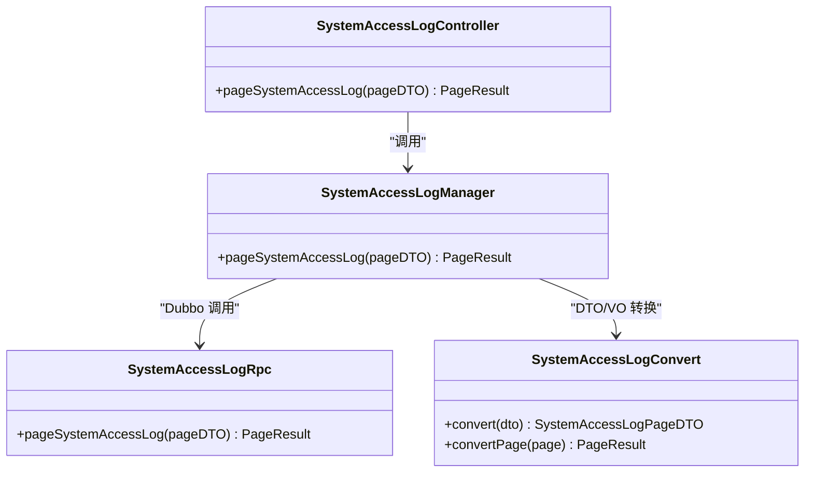
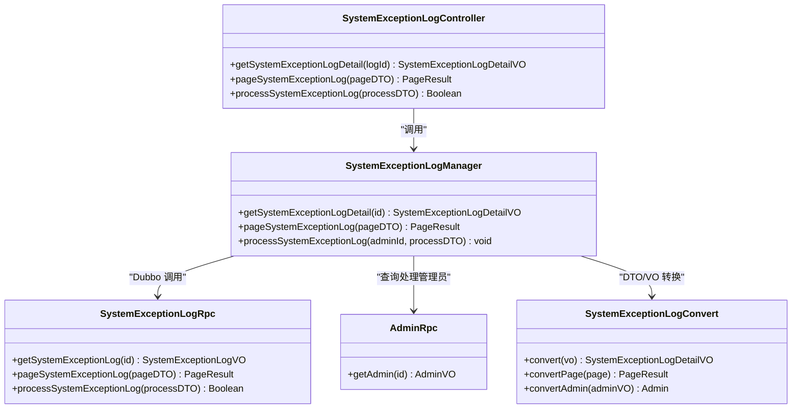
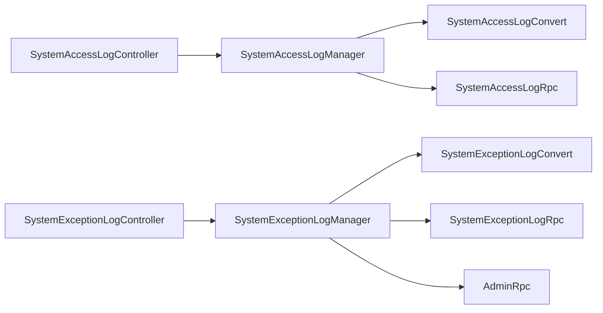

# 系统日志管理

<cite>
**本文引用的文件**
- [SystemAccessLogController.java](file://management-web-app/src/main/java/cn/iocoder/mall/managementweb/controller/systemlog/SystemAccessLogController.java)
- [SystemExceptionLogController.java](file://management-web-app/src/main/java/cn/iocoder/mall/managementweb/controller/systemlog/SystemExceptionLogController.java)
- [SystemAccessLogManager.java](file://management-web-app/src/main/java/cn/iocoder/mall/managementweb/manager/systemlog/SystemAccessLogManager.java)
- [SystemExceptionLogManager.java](file://management-web-app/src/main/java/cn/iocoder/mall/managementweb/manager/systemlog/SystemExceptionLogManager.java)
- [SystemAccessLogConvert.java](file://management-web-app/src/main/java/cn/iocoder/mall/managementweb/convert/systemlog/SystemAccessLogConvert.java)
- [SystemExceptionLogConvert.java](file://management-web-app/src/main/java/cn/iocoder/mall/managementweb/convert/systemlog/SystemExceptionLogConvert.java)
- [SystemAccessLogPageDTO.java](file://management-web-app/src/main/java/cn/iocoder/mall/managementweb/controller/systemlog/dto/SystemAccessLogPageDTO.java)
- [SystemExceptionLogPageDTO.java](file://management-web-app/src/main/java/cn/iocoder/mall/managementweb/controller/systemlog/dto/SystemExceptionLogPageDTO.java)
- [SystemAccessLogVO.java](file://management-web-app/src/main/java/cn/iocoder/mall/managementweb/controller/systemlog/vo/SystemAccessLogVO.java)
- [SystemExceptionLogDetailVO.java](file://management-web-app/src/main/java/cn/iocoder/mall/managementweb/controller/systemlog/vo/SystemExceptionLogDetailVO.java)
- [SystemAccessLogRpc.java](file://system-service-project/system-service-api/src/main/java/cn/iocoder/mall/systemservice/rpc/systemlog/SystemAccessLogRpc.java)
- [SystemExceptionLogRpc.java](file://system-service-project/system-service-api/src/main/java/cn/iocoder/mall/systemservice/rpc/systemlog/SystemExceptionLogRpc.java)
</cite>

## 目录
1. [简介](#简介)
2. [项目结构](#项目结构)
3. [核心组件](#核心组件)
4. [架构总览](#架构总览)
5. [详细组件分析](#详细组件分析)
6. [依赖分析](#依赖分析)
7. [性能考虑](#性能考虑)
8. [故障排查指南](#故障排查指南)
9. [结论](#结论)
10. [附录](#附录)

## 简介
本技术文档围绕系统日志管理功能展开，重点覆盖管理后台的访问日志、异常日志与操作日志（在当前代码中以“访问日志”“异常日志”为主）两大模块。文档从系统架构、组件职责、数据流、权限控制、扩展点到最佳实践进行系统化梳理，并给出与安全审计、性能监控、趋势分析相关的建议。

## 项目结构
日志管理相关代码位于管理后台 Web 应用中，采用典型的分层架构：Controller -> Manager -> RPC 接口调用系统服务端。前端通过 HTTP 接口访问，后端通过 Dubbo 调用系统服务 API。

图表来源
- [SystemAccessLogController.java:1-39](file://management-web-app/src/main/java/cn/iocoder/mall/managementweb/controller/systemlog/SystemAccessLogController.java#L1-L39)
- [SystemExceptionLogController.java:1-57](file://management-web-app/src/main/java/cn/iocoder/mall/managementweb/controller/systemlog/SystemExceptionLogController.java#L1-L57)
- [SystemAccessLogManager.java:1-35](file://management-web-app/src/main/java/cn/iocoder/mall/managementweb/manager/systemlog/SystemAccessLogManager.java#L1-L35)
- [SystemExceptionLogManager.java:1-77](file://management-web-app/src/main/java/cn/iocoder/mall/managementweb/manager/systemlog/SystemExceptionLogManager.java#L1-L77)
- [SystemAccessLogRpc.java:1-31](file://system-service-project/system-service-api/src/main/java/cn/iocoder/mall/systemservice/rpc/systemlog/SystemAccessLogRpc.java#L1-L31)
- [SystemExceptionLogRpc.java:1-48](file://system-service-project/system-service-api/src/main/java/cn/iocoder/mall/systemservice/rpc/systemlog/SystemExceptionLogRpc.java#L1-L48)

章节来源
- [SystemAccessLogController.java:1-39](file://management-web-app/src/main/java/cn/iocoder/mall/managementweb/controller/systemlog/SystemAccessLogController.java#L1-L39)
- [SystemExceptionLogController.java:1-57](file://management-web-app/src/main/java/cn/iocoder/mall/managementweb/controller/systemlog/SystemExceptionLogController.java#L1-L57)
- [SystemAccessLogManager.java:1-35](file://management-web-app/src/main/java/cn/iocoder/mall/managementweb/manager/systemlog/SystemAccessLogManager.java#L1-L35)
- [SystemExceptionLogManager.java:1-77](file://management-web-app/src/main/java/cn/iocoder/mall/managementweb/manager/systemlog/SystemExceptionLogManager.java#L1-L77)
- [SystemAccessLogRpc.java:1-31](file://system-service-project/system-service-api/src/main/java/cn/iocoder/mall/systemservice/rpc/systemlog/SystemAccessLogRpc.java#L1-L31)
- [SystemExceptionLogRpc.java:1-48](file://system-service-project/system-service-api/src/main/java/cn/iocoder/mall/systemservice/rpc/systemlog/SystemExceptionLogRpc.java#L1-L48)

## 核心组件
- 访问日志控制器：提供访问日志分页查询能力，受权限控制保护。
- 异常日志控制器：提供异常日志明细查询、分页查询、处理（完成/忽略）能力，受权限控制保护。
- 访问日志管理器：封装访问日志分页查询的 RPC 调用与结果转换。
- 异常日志管理器：封装异常日志明细、分页、处理流程；并关联管理员信息用于展示处理人。
- DTO/VO 与转换器：统一前后端数据结构，屏蔽系统服务侧 VO 差异。
- RPC 接口：定义访问日志与异常日志的远程服务能力边界。

章节来源
- [SystemAccessLogController.java:19-38](file://management-web-app/src/main/java/cn/iocoder/mall/managementweb/controller/systemlog/SystemAccessLogController.java#L19-L38)
- [SystemExceptionLogController.java:21-56](file://management-web-app/src/main/java/cn/iocoder/mall/managementweb/controller/systemlog/SystemExceptionLogController.java#L21-L56)
- [SystemAccessLogManager.java:12-34](file://management-web-app/src/main/java/cn/iocoder/mall/managementweb/manager/systemlog/SystemAccessLogManager.java#L12-L34)
- [SystemExceptionLogManager.java:16-76](file://management-web-app/src/main/java/cn/iocoder/mall/managementweb/manager/systemlog/SystemExceptionLogManager.java#L16-L76)
- [SystemAccessLogConvert.java:9-18](file://management-web-app/src/main/java/cn/iocoder/mall/managementweb/convert/systemlog/SystemAccessLogConvert.java#L9-L18)
- [SystemExceptionLogConvert.java:12-27](file://management-web-app/src/main/java/cn/iocoder/mall/managementweb/convert/systemlog/SystemExceptionLogConvert.java#L12-L27)
- [SystemAccessLogRpc.java:9-30](file://system-service-project/system-service-api/src/main/java/cn/iocoder/mall/systemservice/rpc/systemlog/SystemAccessLogRpc.java#L9-L30)
- [SystemExceptionLogRpc.java:10-47](file://system-service-project/system-service-api/src/main/java/cn/iocoder/mall/systemservice/rpc/systemlog/SystemExceptionLogRpc.java#L10-L47)

## 架构总览
系统日志管理采用“管理后台 Web 应用 + 系统服务 API”的分层设计。管理后台通过 REST 接口暴露查询与处理能力，内部通过 Dubbo 调用系统服务 API 获取或更新日志数据；转换器负责 DTO/VO 的映射与分页对象转换；权限注解确保仅具备相应权限的管理员可执行操作。

图表来源
- [SystemExceptionLogController.java:48-54](file://management-web-app/src/main/java/cn/iocoder/mall/managementweb/controller/systemlog/SystemExceptionLogController.java#L48-L54)
- [SystemExceptionLogManager.java:33-74](file://management-web-app/src/main/java/cn/iocoder/mall/managementweb/manager/systemlog/SystemExceptionLogManager.java#L33-L74)
- [SystemExceptionLogRpc.java:39-45](file://system-service-project/system-service-api/src/main/java/cn/iocoder/mall/systemservice/rpc/systemlog/SystemExceptionLogRpc.java#L39-L45)

## 详细组件分析

### 访问日志模块
- 控制器职责：提供访问日志分页查询接口，使用分页参数 DTO，返回分页 VO。
- 权限控制：基于注解限制访问权限。
- 数据模型：包含用户标识、应用名、URI、方法、IP、请求时间、响应时长、错误码与错误信息等字段。

图表来源
- [SystemAccessLogController.java:31-36](file://management-web-app/src/main/java/cn/iocoder/mall/managementweb/controller/systemlog/SystemAccessLogController.java#L31-L36)
- [SystemAccessLogManager.java:27-32](file://management-web-app/src/main/java/cn/iocoder/mall/managementweb/manager/systemlog/SystemAccessLogManager.java#L27-L32)
- [SystemAccessLogRpc.java:22-28](file://system-service-project/system-service-api/src/main/java/cn/iocoder/mall/systemservice/rpc/systemlog/SystemAccessLogRpc.java#L22-L28)
- [SystemAccessLogConvert.java:14-16](file://management-web-app/src/main/java/cn/iocoder/mall/managementweb/convert/systemlog/SystemAccessLogConvert.java#L14-L16)

章节来源
- [SystemAccessLogController.java:19-38](file://management-web-app/src/main/java/cn/iocoder/mall/managementweb/controller/systemlog/SystemAccessLogController.java#L19-L38)
- [SystemAccessLogManager.java:12-34](file://management-web-app/src/main/java/cn/iocoder/mall/managementweb/manager/systemlog/SystemAccessLogManager.java#L12-L34)
- [SystemAccessLogPageDTO.java:8-19](file://management-web-app/src/main/java/cn/iocoder/mall/managementweb/controller/systemlog/dto/SystemAccessLogPageDTO.java#L8-L19)
- [SystemAccessLogVO.java:7-40](file://management-web-app/src/main/java/cn/iocoder/mall/managementweb/controller/systemlog/vo/SystemAccessLogVO.java#L7-L40)
- [SystemAccessLogRpc.java:9-30](file://system-service-project/system-service-api/src/main/java/cn/iocoder/mall/systemservice/rpc/systemlog/SystemAccessLogRpc.java#L9-L30)
- [SystemAccessLogConvert.java:9-18](file://management-web-app/src/main/java/cn/iocoder/mall/managementweb/convert/systemlog/SystemAccessLogConvert.java#L9-L18)

### 异常日志模块
- 控制器职责：提供异常日志明细查询、分页查询、处理（完成/忽略）接口。
- 权限控制：分别对“分页查询”“处理”进行权限校验。
- 管理员关联：明细查询时，若存在处理管理员 ID，则回显处理管理员信息。
- 数据模型：包含异常发生时间、异常类名/方法/行号、异常栈、处理状态与时间等字段。

图表来源
- [SystemExceptionLogController.java:33-54](file://management-web-app/src/main/java/cn/iocoder/mall/managementweb/controller/systemlog/SystemExceptionLogController.java#L33-L54)
- [SystemExceptionLogManager.java:33-74](file://management-web-app/src/main/java/cn/iocoder/mall/managementweb/manager/systemlog/SystemExceptionLogManager.java#L33-L74)
- [SystemExceptionLogRpc.java:23-45](file://system-service-project/system-service-api/src/main/java/cn/iocoder/mall/systemservice/rpc/systemlog/SystemExceptionLogRpc.java#L23-L45)
- [SystemExceptionLogConvert.java:21-25](file://management-web-app/src/main/java/cn/iocoder/mall/managementweb/convert/systemlog/SystemExceptionLogConvert.java#L21-L25)

章节来源
- [SystemExceptionLogController.java:21-56](file://management-web-app/src/main/java/cn/iocoder/mall/managementweb/controller/systemlog/SystemExceptionLogController.java#L21-L56)
- [SystemExceptionLogManager.java:16-76](file://management-web-app/src/main/java/cn/iocoder/mall/managementweb/manager/systemlog/SystemExceptionLogManager.java#L16-L76)
- [SystemExceptionLogPageDTO.java:8-21](file://management-web-app/src/main/java/cn/iocoder/mall/managementweb/controller/systemlog/dto/SystemExceptionLogPageDTO.java#L8-L21)
- [SystemExceptionLogDetailVO.java:10-76](file://management-web-app/src/main/java/cn/iocoder/mall/managementweb/controller/systemlog/vo/SystemExceptionLogDetailVO.java#L10-L76)
- [SystemExceptionLogRpc.java:10-47](file://system-service-project/system-service-api/src/main/java/cn/iocoder/mall/systemservice/rpc/systemlog/SystemExceptionLogRpc.java#L10-L47)

### 日志数据收集与存储机制
- 收集入口：系统服务 API 定义了创建访问日志与异常日志的 RPC 接口，表明日志由各业务服务在运行时采集并通过 RPC 写入系统服务侧。
- 存储策略：当前仓库未提供具体存储实现细节；建议采用分表分库、按时间分区、索引优化（如用户、应用名、时间、处理状态）等策略提升查询性能。
- 清理策略：建议结合合规要求设定生命周期（如保留90/180天），到期自动归档或删除，避免热数据膨胀影响查询性能。

章节来源
- [SystemAccessLogRpc.java:14-20](file://system-service-project/system-service-api/src/main/java/cn/iocoder/mall/systemservice/rpc/systemlog/SystemAccessLogRpc.java#L14-L20)
- [SystemExceptionLogRpc.java:15-21](file://system-service-project/system-service-api/src/main/java/cn/iocoder/mall/systemservice/rpc/systemlog/SystemExceptionLogRpc.java#L15-L21)

### 日志分析与监控
- 访问统计：可基于访问日志的 URI、方法、应用名、用户类型、响应时长等维度进行聚合统计，识别热点接口与慢调用。
- 异常趋势分析：按异常类名、异常消息、应用名、时间窗口进行聚合，发现异常突增或重复异常，辅助定位问题。
- 性能监控：结合响应时长分布、错误率、吞吐量等指标建立告警阈值，联动运维处置。

（本节为概念性说明，不直接分析具体源码）

### 日志与安全审计
- 违规操作检测：通过访问日志中的 URI、方法、参数、IP、用户标识等字段，构建规则引擎识别高危操作（如批量删除、敏感配置变更）。
- 风险预警：对异常日志中的异常类型、根因消息、处理状态进行规则匹配，触发风险预警与人工复核。
- 审计留痕：所有处理动作（如异常日志处理）均记录处理人、处理时间，满足审计可追溯要求。

（本节为概念性说明，不直接分析具体源码）

## 依赖分析
- 控制器依赖管理器：控制器仅负责参数接收与权限校验，业务逻辑委托给管理器。
- 管理器依赖 RPC 接口：管理器负责调用系统服务 API 并进行结果转换。
- 转换器依赖 MapStruct：统一 DTO/VO 映射，降低耦合度。
- 权限注解：基于注解的权限控制，确保接口访问安全。

图表来源
- [SystemAccessLogController.java:28-36](file://management-web-app/src/main/java/cn/iocoder/mall/managementweb/controller/systemlog/SystemAccessLogController.java#L28-L36)
- [SystemExceptionLogController.java:30-54](file://management-web-app/src/main/java/cn/iocoder/mall/managementweb/controller/systemlog/SystemExceptionLogController.java#L30-L54)
- [SystemAccessLogManager.java:18-32](file://management-web-app/src/main/java/cn/iocoder/mall/managementweb/manager/systemlog/SystemAccessLogManager.java#L18-L32)
- [SystemExceptionLogManager.java:22-74](file://management-web-app/src/main/java/cn/iocoder/mall/managementweb/manager/systemlog/SystemExceptionLogManager.java#L22-L74)

章节来源
- [SystemAccessLogController.java:1-39](file://management-web-app/src/main/java/cn/iocoder/mall/managementweb/controller/systemlog/SystemAccessLogController.java#L1-L39)
- [SystemExceptionLogController.java:1-57](file://management-web-app/src/main/java/cn/iocoder/mall/managementweb/controller/systemlog/SystemExceptionLogController.java#L1-L57)
- [SystemAccessLogManager.java:1-35](file://management-web-app/src/main/java/cn/iocoder/mall/managementweb/manager/systemlog/SystemAccessLogManager.java#L1-L35)
- [SystemExceptionLogManager.java:1-77](file://management-web-app/src/main/java/cn/iocoder/mall/managementweb/manager/systemlog/SystemExceptionLogManager.java#L1-L77)

## 性能考虑
- 分页查询：优先使用分页参数，避免一次性拉取大量数据；合理设置每页大小与排序字段。
- 索引优化：针对高频过滤字段（用户、应用名、时间、处理状态）建立复合索引。
- 缓存策略：对热点查询（如最近异常趋势）引入缓存，降低 RPC 压力。
- 导出能力：建议异步导出并支持分片下载，避免阻塞主线程。
- 超时与重试：RPC 调用设置合理超时与指数退避重试，防止雪崩效应。

（本节为通用性能建议，不直接分析具体源码）

## 故障排查指南
- 权限不足：若出现 403，请确认管理员是否具备对应权限（分页查询、处理）。
- RPC 调用失败：检查系统服务是否正常、版本配置是否正确、网络连通性。
- 结果为空：确认查询条件是否过于严格（如用户、应用名、处理状态），适当放宽筛选范围。
- 处理失败：异常日志处理接口返回失败时，查看系统服务侧日志与异常栈，定位具体原因。

章节来源
- [SystemExceptionLogController.java:33-54](file://management-web-app/src/main/java/cn/iocoder/mall/managementweb/controller/systemlog/SystemExceptionLogController.java#L33-L54)
- [SystemExceptionLogManager.java:33-74](file://management-web-app/src/main/java/cn/iocoder/mall/managementweb/manager/systemlog/SystemExceptionLogManager.java#L33-L74)

## 结论
本日志管理模块以清晰的分层设计实现了访问日志与异常日志的查询与处理能力，配合权限控制与管理员关联信息，满足管理后台的审计与运维需求。建议后续完善系统服务侧的存储与清理策略、增强分析与监控能力，并补充操作日志模块以形成完整的日志体系。

## 附录
- 最佳实践
  - 统一日志格式与字段命名，便于跨系统检索与分析。
  - 对敏感字段脱敏（如参数、异常栈），遵循最小可见原则。
  - 建立日志生命周期管理，定期归档与清理。
  - 将日志与告警平台对接，实现异常趋势与性能异常的自动化预警。
  - 对关键操作增加操作日志，与访问日志、异常日志协同审计。

- 运维建议
  - 监控 RPC 调用延迟与错误率，及时发现系统服务异常。
  - 对导出与大查询任务进行资源限制，避免影响线上服务。
  - 定期演练日志恢复与回放，验证数据完整性与可用性。

（本节为通用建议，不直接分析具体源码）