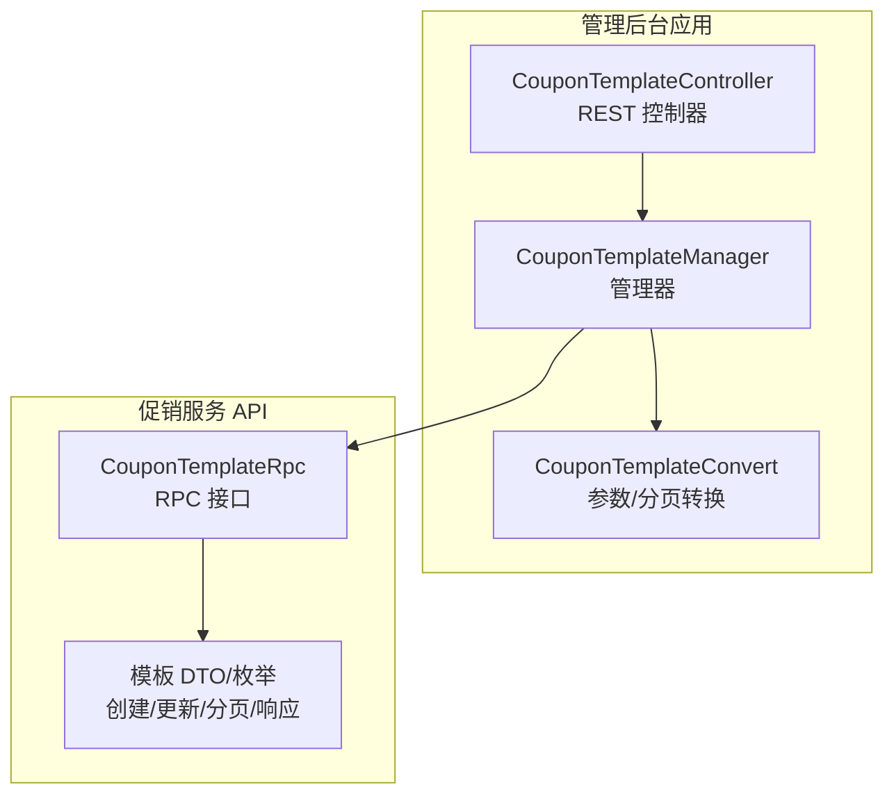
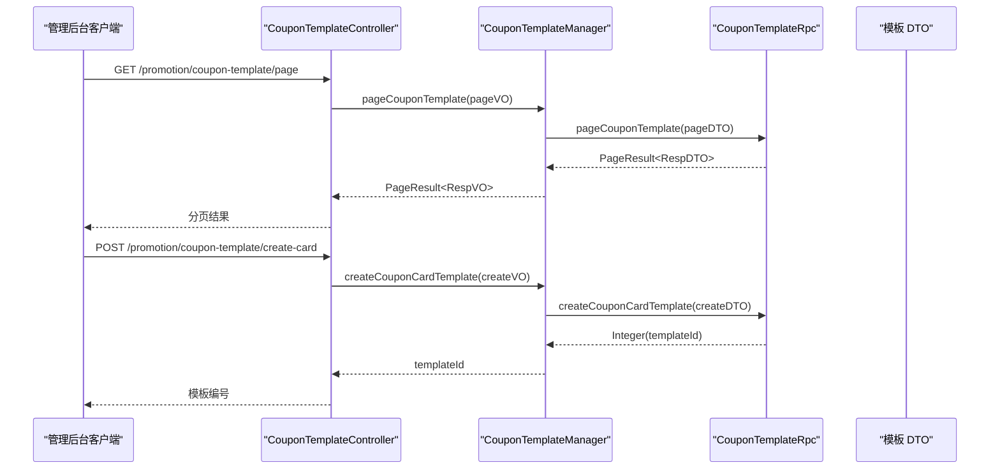
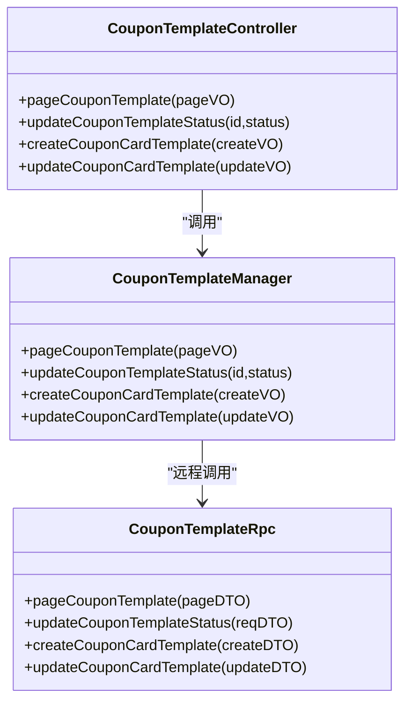
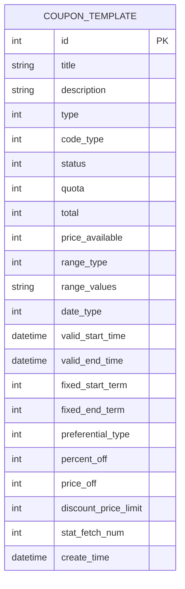
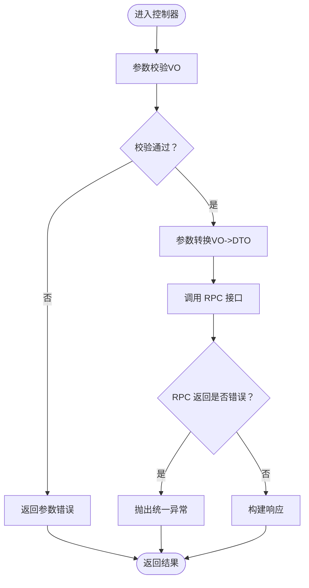
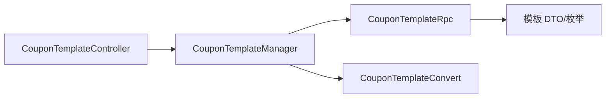

# 优惠券管理

<cite>
**本文引用的文件**
- [CouponTemplateController.java](file://management-web-app/src/main/java/cn/iocoder/mall/managementweb/controller/promotion/coupon/CouponTemplateController.java)
- [CouponTemplateManager.java](file://management-web-app/src/main/java/cn/iocoder/mall/managementweb/manager/promotion/coupon/CouponTemplateManager.java)
- [CouponTemplateRpc.java](file://promotion-service-project/promotion-service-api/src/main/java/cn/iocoder/mall/promotion/api/rpc/coupon/CouponTemplateRpc.java)
- [CouponCardTemplateCreateReqDTO.java](file://promotion-service-project/promotion-service-api/src/main/java/cn/iocoder/mall/promotion/api/rpc/coupon/dto/template/CouponCardTemplateCreateReqDTO.java)
- [CouponCardTemplateUpdateReqDTO.java](file://promotion-service-project/promotion-service-api/src/main/java/cn/iocoder/mall/promotion/api/rpc/coupon/dto/template/CouponCardTemplateUpdateReqDTO.java)
- [CouponTemplatePageReqDTO.java](file://promotion-service-project/promotion-service-api/src/main/java/cn/iocoder/mall/promotion/api/rpc/coupon/dto/template/CouponTemplatePageReqDTO.java)
- [CouponTemplateRespDTO.java](file://promotion-service-project/promotion-service-api/src/main/java/cn/iocoder/mall/promotion/api/rpc/coupon/dto/template/CouponTemplateRespDTO.java)
- [CouponTemplateCardCreateReqVO.java](file://management-web-app/src/main/java/cn/iocoder/mall/managementweb/controller/promotion/coupon/vo/template/CouponTemplateCardCreateReqVO.java)
- [CouponTemplateCardUpdateReqVO.java](file://management-web-app/src/main/java/cn/iocoder/mall/managementweb/controller/promotion/coupon/vo/template/CouponTemplateCardUpdateReqVO.java)
- [CouponTemplateConvert.java](file://management-web-app/src/main/java/cn/iocoder/mall/managementweb/convert/promotion/CouponTemplateConvert.java)
- [CouponTemplateTypeEnum.java](file://promotion-service-project/promotion-service-api/src/main/java/cn/iocoder/mall/promotion/api/enums/coupon/template/CouponTemplateTypeEnum.java)
- [CouponTemplateStatusEnum.java](file://promotion-service-project/promotion-service-api/src/main/java/cn/iocoder/mall/promotion/api/enums/coupon/template/CouponTemplateStatusEnum.java)
- [CouponTemplateDateTypeEnum.java](file://promotion-service-project/promotion-service-api/src/main/java/cn/iocoder/mall/promotion/api/enums/coupon/template/CouponTemplateDateTypeEnum.java)
- [RangeTypeEnum.java](file://promotion-service-project/promotion-service-api/src/main/java/cn/iocoder/mall/promotion/api/enums/RangeTypeEnum.java)
- [PreferentialTypeEnum.java](file://promotion-service-project/promotion-service-api/src/main/java/cn/iocoder/mall/promotion/api/enums/PreferentialTypeEnum.java)
</cite>

## 目录
1. [简介](#简介)
2. [项目结构](#项目结构)
3. [核心组件](#核心组件)
4. [架构总览](#架构总览)
5. [详细组件分析](#详细组件分析)
6. [依赖分析](#依赖分析)
7. [性能考量](#性能考量)
8. [故障排查指南](#故障排查指南)
9. [结论](#结论)
10. [附录](#附录)

## 简介
本技术文档围绕管理后台的优惠券管理系统展开，重点覆盖优惠券模板的创建、编辑、删除、查询等能力，并深入解析 CouponTemplateController 的接口设计与参数校验策略。同时，文档系统性阐述优惠券的数据模型与字段定义（面额、使用门槛、有效期、适用商品范围等），并说明业务规则与配置项（发放方式、使用限制、叠加规则等）。最后，结合与商品、订单、用户等模块的联动机制，给出最佳实践与运营建议。

## 项目结构
优惠券管理功能由“管理前端应用 + 服务端 RPC 接口 + 业务服务实现”三层构成：
- 控制层：管理后台控制器负责接收请求、鉴权与参数校验，调用管理器执行业务。
- 管理器层：封装对 RPC 接口的调用，完成数据转换与错误处理。
- RPC 接口层：定义优惠券模板的增删改查、状态变更等能力，供上层调用。

图表来源
- [CouponTemplateController.java:23-71](file://management-web-app/src/main/java/cn/iocoder/mall/managementweb/controller/promotion/coupon/CouponTemplateController.java#L23-L71)
- [CouponTemplateManager.java:17-54](file://management-web-app/src/main/java/cn/iocoder/mall/managementweb/manager/promotion/coupon/CouponTemplateManager.java#L17-L54)
- [CouponTemplateRpc.java:10-57](file://promotion-service-project/promotion-service-api/src/main/java/cn/iocoder/mall/promotion/api/rpc/coupon/CouponTemplateRpc.java#L10-L57)
- [CouponTemplateConvert.java:15-28](file://management-web-app/src/main/java/cn/iocoder/mall/managementweb/convert/promotion/CouponTemplateConvert.java#L15-L28)

章节来源
- [CouponTemplateController.java:23-71](file://management-web-app/src/main/java/cn/iocoder/mall/managementweb/controller/promotion/coupon/CouponTemplateController.java#L23-L71)
- [CouponTemplateManager.java:17-54](file://management-web-app/src/main/java/cn/iocoder/mall/managementweb/manager/promotion/coupon/CouponTemplateManager.java#L17-L54)
- [CouponTemplateRpc.java:10-57](file://promotion-service-project/promotion-service-api/src/main/java/cn/iocoder/mall/promotion/api/rpc/coupon/CouponTemplateRpc.java#L10-L57)
- [CouponTemplateConvert.java:15-28](file://management-web-app/src/main/java/cn/iocoder/mall/managementweb/convert/promotion/CouponTemplateConvert.java#L15-L28)

## 核心组件
- 控制器：提供分页查询、状态更新、优惠券模板创建与更新接口，统一返回分页结果与布尔结果。
- 管理器：封装 RPC 调用，进行参数转换与错误检查，向上抛出统一异常。
- RPC 接口：定义模板查询、分页、状态变更、创建与更新等能力。
- 数据传输对象：包含创建/更新请求 DTO、分页请求 DTO、响应 DTO 以及各类枚举。

章节来源
- [CouponTemplateController.java:34-71](file://management-web-app/src/main/java/cn/iocoder/mall/managementweb/controller/promotion/coupon/CouponTemplateController.java#L34-L71)
- [CouponTemplateManager.java:26-52](file://management-web-app/src/main/java/cn/iocoder/mall/managementweb/manager/promotion/coupon/CouponTemplateManager.java#L26-L52)
- [CouponTemplateRpc.java:14-52](file://promotion-service-project/promotion-service-api/src/main/java/cn/iocoder/mall/promotion/api/rpc/coupon/CouponTemplateRpc.java#L14-L52)
- [CouponCardTemplateCreateReqDTO.java:23-143](file://promotion-service-project/promotion-service-api/src/main/java/cn/iocoder/mall/promotion/api/rpc/coupon/dto/template/CouponCardTemplateCreateReqDTO.java#L23-L143)
- [CouponCardTemplateUpdateReqDTO.java:19-142](file://promotion-service-project/promotion-service-api/src/main/java/cn/iocoder/mall/promotion/api/rpc/coupon/dto/template/CouponCardTemplateUpdateReqDTO.java#L19-L142)
- [CouponTemplatePageReqDTO.java:14-33](file://promotion-service-project/promotion-service-api/src/main/java/cn/iocoder/mall/promotion/api/rpc/coupon/dto/template/CouponTemplatePageReqDTO.java#L14-L33)
- [CouponTemplateRespDTO.java:15-156](file://promotion-service-project/promotion-service-api/src/main/java/cn/iocoder/mall/promotion/api/rpc/coupon/dto/template/CouponTemplateRespDTO.java#L15-L156)

## 架构总览
下图展示了从管理后台控制器到 RPC 接口的整体调用链路，以及参数转换与错误处理的关键节点。

图表来源
- [CouponTemplateController.java:34-61](file://management-web-app/src/main/java/cn/iocoder/mall/managementweb/controller/promotion/coupon/CouponTemplateController.java#L34-L61)
- [CouponTemplateManager.java:26-46](file://management-web-app/src/main/java/cn/iocoder/mall/managementweb/manager/promotion/coupon/CouponTemplateManager.java#L26-L46)
- [CouponTemplateRpc.java:23-45](file://promotion-service-project/promotion-service-api/src/main/java/cn/iocoder/mall/promotion/api/rpc/coupon/CouponTemplateRpc.java#L23-L45)
- [CouponTemplateConvert.java:20-26](file://management-web-app/src/main/java/cn/iocoder/mall/managementweb/convert/promotion/CouponTemplateConvert.java#L20-L26)

## 详细组件分析

### 控制器：CouponTemplateController
- 能力清单
  - 分页查询：支持按类型、标题、状态、优惠类型筛选。
  - 状态更新：根据模板编号与目标状态更新模板状态。
  - 创建模板：创建优惠券模板（当前为“优惠券”类型）。
  - 更新模板：更新优惠券模板基本信息与领取规则。
- 参数校验
  - 使用 VO 对输入参数进行非空、长度、数值范围等校验。
  - 使用枚举校验器确保范围类型、日期类型、优惠类型等合法。
- 权限控制
  - 基于注解的权限点控制，避免越权访问。

图表来源
- [CouponTemplateController.java:27-71](file://management-web-app/src/main/java/cn/iocoder/mall/managementweb/controller/promotion/coupon/CouponTemplateController.java#L27-L71)
- [CouponTemplateManager.java:19-54](file://management-web-app/src/main/java/cn/iocoder/mall/managementweb/manager/promotion/coupon/CouponTemplateManager.java#L19-L54)
- [CouponTemplateRpc.java:10-57](file://promotion-service-project/promotion-service-api/src/main/java/cn/iocoder/mall/promotion/api/rpc/coupon/CouponTemplateRpc.java#L10-L57)

章节来源
- [CouponTemplateController.java:34-71](file://management-web-app/src/main/java/cn/iocoder/mall/managementweb/controller/promotion/coupon/CouponTemplateController.java#L34-L71)
- [CouponTemplateCardCreateReqVO.java:23-84](file://management-web-app/src/main/java/cn/iocoder/mall/managementweb/controller/promotion/coupon/vo/template/CouponTemplateCardCreateReqVO.java#L23-L84)
- [CouponTemplateCardUpdateReqVO.java:18-47](file://management-web-app/src/main/java/cn/iocoder/mall/managementweb/controller/promotion/coupon/vo/template/CouponTemplateCardUpdateReqVO.java#L18-L47)

### 管理器：CouponTemplateManager
- 职责
  - 将 VO 转换为 DTO，调用 RPC 接口执行业务。
  - 对 RPC 返回结果进行错误检查，保证上层统一异常处理。
  - 提供分页、状态更新、创建与更新等方法。
- 错误处理
  - 通过统一结果包装进行错误检查，避免异常泄露。

章节来源
- [CouponTemplateManager.java:26-52](file://management-web-app/src/main/java/cn/iocoder/mall/managementweb/manager/promotion/coupon/CouponTemplateManager.java#L26-L52)
- [CouponTemplateConvert.java:20-26](file://management-web-app/src/main/java/cn/iocoder/mall/managementweb/convert/promotion/CouponTemplateConvert.java#L20-L26)

### RPC 接口：CouponTemplateRpc
- 能力
  - 获取单个模板详情、分页查询模板。
  - 更新模板状态。
  - 创建与更新优惠券模板。
- 设计要点
  - 请求/响应以 DTO 形式传递，便于跨进程通信。
  - 返回统一结果包装，便于上层处理。

章节来源
- [CouponTemplateRpc.java:14-52](file://promotion-service-project/promotion-service-api/src/main/java/cn/iocoder/mall/promotion/api/rpc/coupon/CouponTemplateRpc.java#L14-L52)

### 数据模型与字段定义
- 模板基础信息
  - 编号、标题、描述、类型、状态、每人限领数量、发放总量。
- 领取规则
  - 每人限领数量、发放总量。
- 使用规则
  - 使用门槛金额（分）、可用范围类型与值、生效日期类型与有效期区间。
- 使用效果
  - 优惠类型（减价/打折）、优惠金额（分）、折扣百分比、折扣上限。
- 统计信息
  - 领取次数统计。
- 创建/更新请求 DTO
  - 创建：包含完整字段集，用于初始化模板。
  - 更新：包含可更新字段，如标题、描述、配额、总量、可用范围等。

图表来源
- [CouponTemplateRespDTO.java:15-156](file://promotion-service-project/promotion-service-api/src/main/java/cn/iocoder/mall/promotion/api/rpc/coupon/dto/template/CouponTemplateRespDTO.java#L15-L156)

章节来源
- [CouponTemplateRespDTO.java:17-149](file://promotion-service-project/promotion-service-api/src/main/java/cn/iocoder/mall/promotion/api/rpc/coupon/dto/template/CouponTemplateRespDTO.java#L17-L149)
- [CouponCardTemplateCreateReqDTO.java:25-143](file://promotion-service-project/promotion-service-api/src/main/java/cn/iocoder/mall/promotion/api/rpc/coupon/dto/template/CouponCardTemplateCreateReqDTO.java#L25-L143)
- [CouponCardTemplateUpdateReqDTO.java:24-140](file://promotion-service-project/promotion-service-api/src/main/java/cn/iocoder/mall/promotion/api/rpc/coupon/dto/template/CouponCardTemplateUpdateReqDTO.java#L24-L140)

### 业务规则与配置项
- 模板类型
  - 优惠券（CARD）、优惠码（CODE）。
- 模板状态
  - 生效中、已失效。
- 日期类型
  - 固定日期、领取日期（N 天有效）。
- 可用范围
  - 全部可用、部分商品包含/排除、部分分类包含/排除。
- 优惠类型
  - 减价（代金券）、打折（折扣券）。
- 金额与比例
  - 金额单位为分；折扣百分比上限 100；折扣上限仅在打折场景生效。

章节来源
- [CouponTemplateTypeEnum.java:8-38](file://promotion-service-project/promotion-service-api/src/main/java/cn/iocoder/mall/promotion/api/enums/coupon/template/CouponTemplateTypeEnum.java#L8-L38)
- [CouponTemplateStatusEnum.java:10-44](file://promotion-service-project/promotion-service-api/src/main/java/cn/iocoder/mall/promotion/api/enums/coupon/template/CouponTemplateStatusEnum.java#L10-L44)
- [CouponTemplateDateTypeEnum.java:10-44](file://promotion-service-project/promotion-service-api/src/main/java/cn/iocoder/mall/promotion/api/enums/coupon/template/CouponTemplateDateTypeEnum.java#L10-L44)
- [RangeTypeEnum.java:10-47](file://promotion-service-project/promotion-service-api/src/main/java/cn/iocoder/mall/promotion/api/enums/RangeTypeEnum.java#L10-L47)
- [PreferentialTypeEnum.java:10-43](file://promotion-service-project/promotion-service-api/src/main/java/cn/iocoder/mall/promotion/api/enums/PreferentialTypeEnum.java#L10-L43)

### 与商品、订单、用户的联动机制
- 商品维度
  - 通过“可用范围类型 + 指定商品/分类列表”限定券的适用范围。
- 订单维度
  - 结算时根据订单金额与券门槛计算可抵扣金额；打折券受折扣上限约束。
- 用户维度
  - 通过“每人限领数量”与“发放总量”控制用户领取行为，避免超发。

章节来源
- [CouponTemplateRespDTO.java:68-114](file://promotion-service-project/promotion-service-api/src/main/java/cn/iocoder/mall/promotion/api/rpc/coupon/dto/template/CouponTemplateRespDTO.java#L68-L114)
- [CouponCardTemplateCreateReqDTO.java:54-109](file://promotion-service-project/promotion-service-api/src/main/java/cn/iocoder/mall/promotion/api/rpc/coupon/dto/template/CouponCardTemplateCreateReqDTO.java#L54-L109)
- [CouponCardTemplateUpdateReqDTO.java:53-78](file://promotion-service-project/promotion-service-api/src/main/java/cn/iocoder/mall/promotion/api/rpc/coupon/dto/template/CouponCardTemplateUpdateReqDTO.java#L53-L78)

### 接口流程与参数校验流程
- 分页查询流程
  - 控制器接收分页参数 → 管理器转换为 DTO → RPC 执行分页查询 → 返回分页结果。
- 创建模板流程
  - 控制器接收创建 VO → 管理器转换为创建 DTO → RPC 创建模板 → 返回模板编号。
- 参数校验流程
  - VO 层进行必填、长度、范围、枚举校验；RPC 层进一步进行业务一致性校验。

图表来源
- [CouponTemplateController.java:34-61](file://management-web-app/src/main/java/cn/iocoder/mall/managementweb/controller/promotion/coupon/CouponTemplateController.java#L34-L61)
- [CouponTemplateManager.java:26-46](file://management-web-app/src/main/java/cn/iocoder/mall/managementweb/manager/promotion/coupon/CouponTemplateManager.java#L26-L46)
- [CouponTemplateConvert.java:20-26](file://management-web-app/src/main/java/cn/iocoder/mall/managementweb/convert/promotion/CouponTemplateConvert.java#L20-L26)

## 依赖分析
- 控制器依赖管理器；管理器依赖 RPC 接口；管理器与控制器均依赖转换器。
- DTO 与枚举位于 API 工程，作为跨进程通信契约，降低耦合度。
- 无循环依赖迹象，职责清晰。

图表来源
- [CouponTemplateController.java:27-30](file://management-web-app/src/main/java/cn/iocoder/mall/managementweb/controller/promotion/coupon/CouponTemplateController.java#L27-L30)
- [CouponTemplateManager.java:21-22](file://management-web-app/src/main/java/cn/iocoder/mall/managementweb/manager/promotion/coupon/CouponTemplateManager.java#L21-L22)
- [CouponTemplateRpc.java:10-10](file://promotion-service-project/promotion-service-api/src/main/java/cn/iocoder/mall/promotion/api/rpc/coupon/CouponTemplateRpc.java#L10-L10)
- [CouponTemplateConvert.java:15-18](file://management-web-app/src/main/java/cn/iocoder/mall/managementweb/convert/promotion/CouponTemplateConvert.java#L15-L18)

章节来源
- [CouponTemplateController.java:27-30](file://management-web-app/src/main/java/cn/iocoder/mall/managementweb/controller/promotion/coupon/CouponTemplateController.java#L27-L30)
- [CouponTemplateManager.java:21-22](file://management-web-app/src/main/java/cn/iocoder/mall/managementweb/manager/promotion/coupon/CouponTemplateManager.java#L21-L22)
- [CouponTemplateRpc.java:10-10](file://promotion-service-project/promotion-service-api/src/main/java/cn/iocoder/mall/promotion/api/rpc/coupon/CouponTemplateRpc.java#L10-L10)
- [CouponTemplateConvert.java:15-18](file://management-web-app/src/main/java/cn/iocoder/mall/managementweb/convert/promotion/CouponTemplateConvert.java#L15-L18)

## 性能考量
- 分页查询
  - 合理设置分页大小与排序字段，避免一次性加载过多数据。
- RPC 调用
  - 控制器与管理器之间采用轻量 DTO，减少序列化开销；统一错误检查避免重复判断。
- 参数转换
  - 使用映射工具进行 VO/DTO 转换，提升可维护性与一致性。

## 故障排查指南
- 常见问题
  - 参数校验失败：检查 VO 中的非空、长度、范围与枚举值。
  - RPC 调用异常：查看管理器中的错误检查与日志输出。
  - 权限不足：确认权限点是否正确配置。
- 定位步骤
  - 在控制器层打印入参与路径信息。
  - 在管理器层捕获并记录 RPC 返回的错误码与消息。
  - 在 RPC 层核对 DTO 字段与业务规则一致性。

章节来源
- [CouponTemplateController.java:34-71](file://management-web-app/src/main/java/cn/iocoder/mall/managementweb/controller/promotion/coupon/CouponTemplateController.java#L34-L71)
- [CouponTemplateManager.java:26-52](file://management-web-app/src/main/java/cn/iocoder/mall/managementweb/manager/promotion/coupon/CouponTemplateManager.java#L26-L52)

## 结论
该优惠券管理功能通过清晰的分层设计与统一的 DTO/枚举契约，实现了模板的全生命周期管理。控制器负责接口与权限，管理器负责转换与错误处理，RPC 接口承载核心业务。数据模型覆盖了面额、门槛、有效期、适用范围等关键字段，并通过枚举严格约束业务规则。结合商品、订单、用户的联动，可满足多样化的营销场景需求。

## 附录
- 最佳实践
  - 明确模板类型与状态，避免混淆。
  - 合理设置每人限领与总量，防止超发。
  - 有效期内的券应避免频繁修改，以免影响用户体验。
  - 折扣券需设置合理折扣上限，控制成本。
- 运营建议
  - 新品推广优先使用“部分商品包含”的范围策略。
  - 会员活动可采用“固定日期”模式，提升计划性。
  - 关注领取次数统计，动态调整配额与门槛。