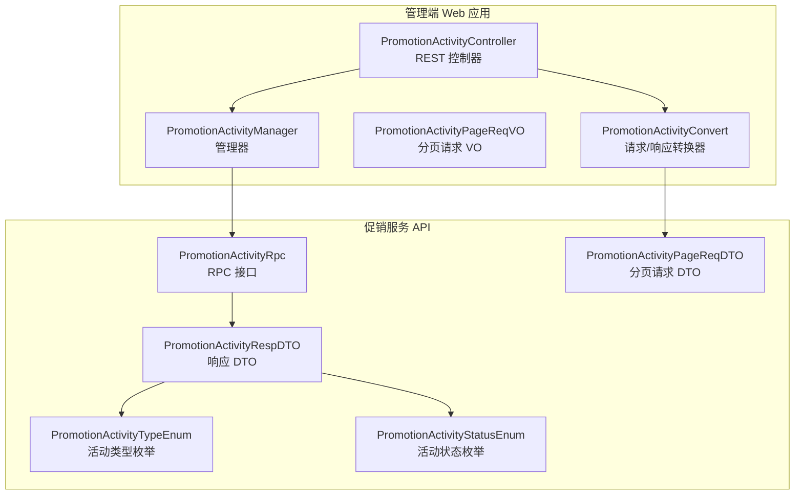
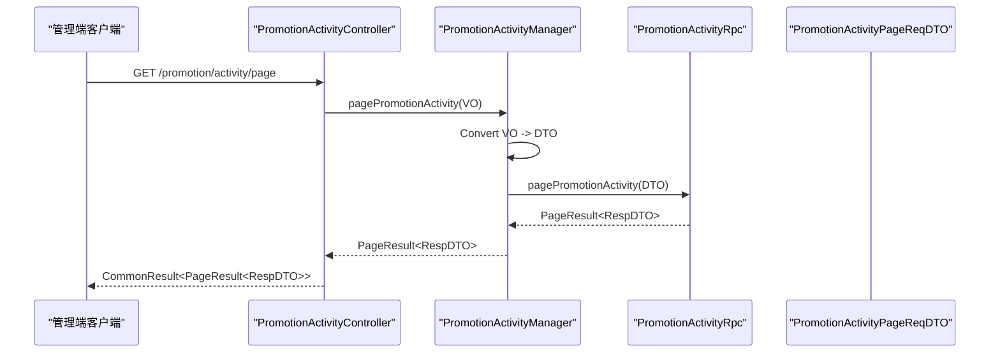
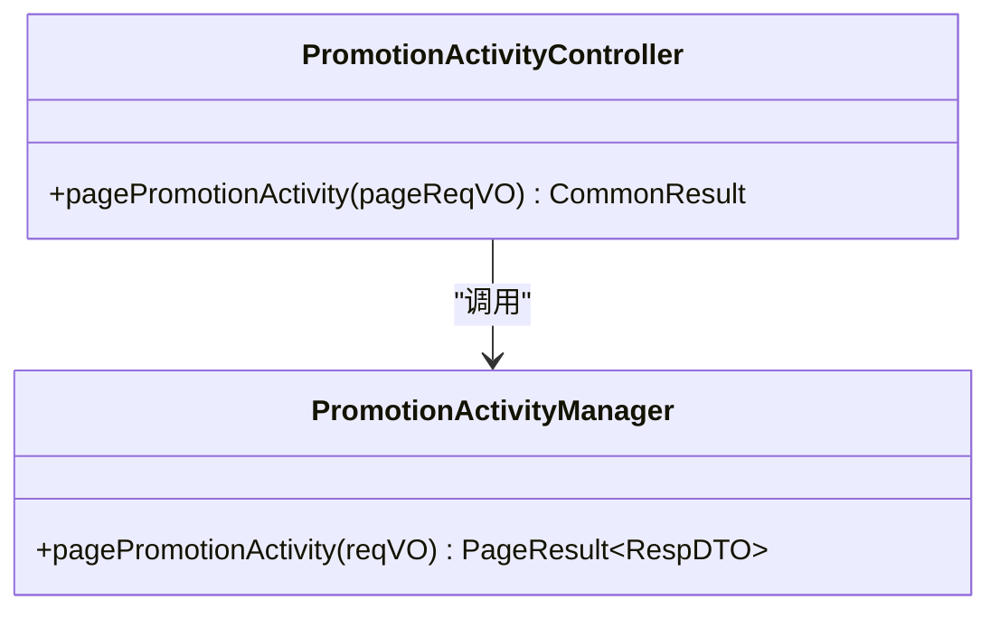
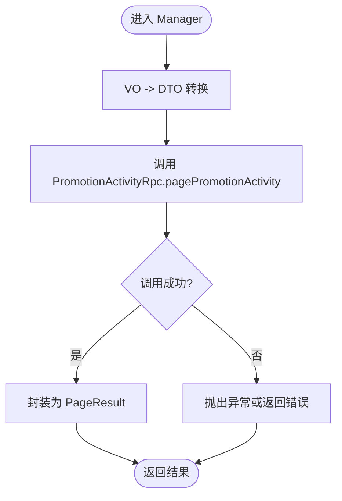
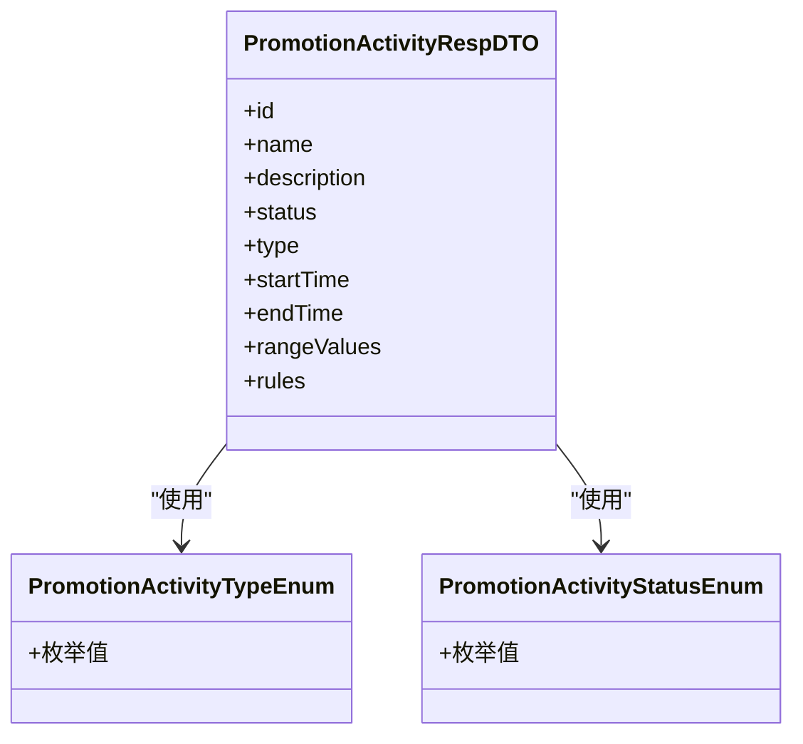
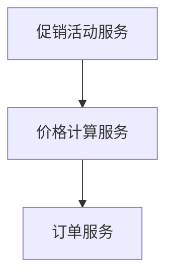
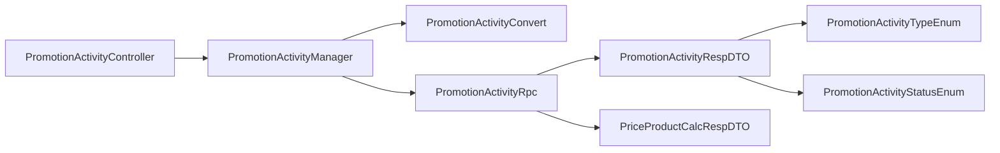

# 促销活动管理

<cite>
**本文引用的文件**
- [PromotionActivityController.java](file://management-web-app/src/main/java/cn/iocoder/mall/managementweb/controller/promotion/activity/PromotionActivityController.java)
- [PromotionActivityPageReqVO.java](file://management-web-app/src/main/java/cn/iocoder/mall/managementweb/controller/promotion/activity/vo/PromotionActivityPageReqVO.java)
- [PromotionActivityManager.java](file://management-web-app/src/main/java/cn/iocoder/mall/managementweb/manager/promotion/activity/PromotionActivityManager.java)
- [PromotionActivityConvert.java](file://management-web-app/src/main/java/cn/iocoder/mall/managementweb/convert/promotion/PromotionActivityConvert.java)
- [PromotionActivityRpc.java](file://promotion-service-project/promotion-service-api/src/main/java/cn/iocoder/mall/promotion/api/rpc/activity/PromotionActivityRpc.java)
- [PromotionActivityPageReqDTO.java](file://promotion-service-project/promotion-service-api/src/main/java/cn/iocoder/mall/promotion/api/rpc/activity/dto/PromotionActivityPageReqDTO.java)
- [PromotionActivityRespDTO.java](file://promotion-service-project/promotion-service-api/src/main/java/cn/iocoder/mall/promotion/api/rpc/activity/dto/PromotionActivityRespDTO.java)
- [PromotionActivityStatusEnum.java](file://promotion-service-project/promotion-service-api/src/main/java/cn/iocoder/mall/promotion/api/enums/activity/PromotionActivityStatusEnum.java)
- [PromotionActivityTypeEnum.java](file://promotion-service-project/promotion-service-api/src/main/java/cn/iocoder/mall/promotion/api/enums/activity/PromotionActivityTypeEnum.java)
- [PriceProductCalcRespDTO.java](file://promotion-service-project/promotion-service-api/src/main/java/cn/iocoder/mall/promotion/api/rpc/price/dto/PriceProductCalcRespDTO.java)
</cite>

## 目录
1. [简介](#简介)
2. [项目结构](#项目结构)
3. [核心组件](#核心组件)
4. [架构总览](#架构总览)
5. [详细组件分析](#详细组件分析)
6. [依赖分析](#依赖分析)
7. [性能考虑](#性能考虑)
8. [故障排查指南](#故障排查指南)
9. [结论](#结论)
10. [附录](#附录)

## 简介
本技术文档围绕管理后台的促销活动管理系统展开，重点覆盖促销活动的创建、编辑、删除、查询等能力。当前仓库中已实现“促销活动分页查询”接口，后续可在此基础上扩展新增、修改、删除等接口。本文将从系统架构、组件职责、数据模型、业务规则、与商品/价格/订单模块的联动机制等方面进行深入说明，并提供最佳实践与运营建议。

## 项目结构
促销活动相关代码主要分布在两个模块：
- 管理端 Web 应用（management-web-app）：负责对外提供 REST 接口、参数校验、请求转换与权限控制。
- 促销服务 API（promotion-service-api）：定义促销活动的 RPC 接口、DTO、枚举等。

图表来源
- [PromotionActivityController.java:19-36](file://management-web-app/src/main/java/cn/iocoder/mall/managementweb/controller/promotion/activity/PromotionActivityController.java#L19-L36)
- [PromotionActivityManager.java:1-200](file://management-web-app/src/main/java/cn/iocoder/mall/managementweb/manager/promotion/activity/PromotionActivityManager.java)
- [PromotionActivityConvert.java:1-200](file://management-web-app/src/main/java/cn/iocoder/mall/managementweb/convert/promotion/PromotionActivityConvert.java)
- [PromotionActivityRpc.java:1-200](file://promotion-service-project/promotion-service-api/src/main/java/cn/iocoder/mall/promotion/api/rpc/activity/PromotionActivityRpc.java)
- [PromotionActivityPageReqDTO.java:1-200](file://promotion-service-project/promotion-service-api/src/main/java/cn/iocoder/mall/promotion/api/rpc/activity/dto/PromotionActivityPageReqDTO.java)
- [PromotionActivityRespDTO.java:1-200](file://promotion-service-project/promotion-service-api/src/main/java/cn/iocoder/mall/promotion/api/rpc/activity/dto/PromotionActivityRespDTO.java)
- [PromotionActivityTypeEnum.java:1-200](file://promotion-service-project/promotion-service-api/src/main/java/cn/iocoder/mall/promotion/api/enums/activity/PromotionActivityTypeEnum.java)
- [PromotionActivityStatusEnum.java:1-200](file://promotion-service-project/promotion-service-api/src/main/java/cn/iocoder/mall/promotion/api/enums/activity/PromotionActivityStatusEnum.java)

章节来源
- [PromotionActivityController.java:19-36](file://management-web-app/src/main/java/cn/iocoder/mall/managementweb/controller/promotion/activity/PromotionActivityController.java#L19-L36)
- [PromotionActivityManager.java:1-200](file://management-web-app/src/main/java/cn/iocoder/mall/managementweb/manager/promotion/activity/PromotionActivityManager.java)
- [PromotionActivityConvert.java:1-200](file://management-web-app/src/main/java/cn/iocoder/mall/managementweb/convert/promotion/PromotionActivityConvert.java)
- [PromotionActivityRpc.java:1-200](file://promotion-service-project/promotion-service-api/src/main/java/cn/iocoder/mall/promotion/api/rpc/activity/PromotionActivityRpc.java)
- [PromotionActivityPageReqDTO.java:1-200](file://promotion-service-project/promotion-service-api/src/main/java/cn/iocoder/mall/promotion/api/rpc/activity/dto/PromotionActivityPageReqDTO.java)
- [PromotionActivityRespDTO.java:1-200](file://promotion-service-project/promotion-service-api/src/main/java/cn/iocoder/mall/promotion/api/rpc/activity/dto/PromotionActivityRespDTO.java)
- [PromotionActivityTypeEnum.java:1-200](file://promotion-service-project/promotion-service-api/src/main/java/cn/iocoder/mall/promotion/api/enums/activity/PromotionActivityTypeEnum.java)
- [PromotionActivityStatusEnum.java:1-200](file://promotion-service-project/promotion-service-api/src/main/java/cn/iocoder/mall/promotion/api/enums/activity/PromotionActivityStatusEnum.java)

## 核心组件
- PromotionActivityController：REST 控制器，提供促销活动分页查询接口，具备权限注解与请求参数校验。
- PromotionActivityManager：管理器，封装对促销服务 RPC 的调用，负责业务编排与结果转换。
- PromotionActivityConvert：转换器，负责 VO 与 DTO 之间的映射与转换。
- PromotionActivityRpc：促销活动 RPC 接口，定义分页、列表等查询能力。
- PromotionActivityPageReqVO：管理端分页请求 VO，用于接收前端参数并进行校验。
- PromotionActivityPageReqDTO：促销服务分页请求 DTO，传输到服务层的具体参数对象。
- PromotionActivityRespDTO：促销活动响应 DTO，包含活动基本信息与状态/类型枚举。
- 枚举类：PromotionActivityTypeEnum（活动类型）、PromotionActivityStatusEnum（活动状态）。

章节来源
- [PromotionActivityController.java:19-36](file://management-web-app/src/main/java/cn/iocoder/mall/managementweb/controller/promotion/activity/PromotionActivityController.java#L19-L36)
- [PromotionActivityManager.java:1-200](file://management-web-app/src/main/java/cn/iocoder/mall/managementweb/manager/promotion/activity/PromotionActivityManager.java)
- [PromotionActivityConvert.java:1-200](file://management-web-app/src/main/java/cn/iocoder/mall/managementweb/convert/promotion/PromotionActivityConvert.java)
- [PromotionActivityRpc.java:1-200](file://promotion-service-project/promotion-service-api/src/main/java/cn/iocoder/mall/promotion/api/rpc/activity/PromotionActivityRpc.java)
- [PromotionActivityPageReqVO.java:1-200](file://management-web-app/src/main/java/cn/iocoder/mall/managementweb/controller/promotion/activity/vo/PromotionActivityPageReqVO.java)
- [PromotionActivityPageReqDTO.java:1-200](file://promotion-service-project/promotion-service-api/src/main/java/cn/iocoder/mall/promotion/api/rpc/activity/dto/PromotionActivityPageReqDTO.java)
- [PromotionActivityRespDTO.java:1-200](file://promotion-service-project/promotion-service-api/src/main/java/cn/iocoder/mall/promotion/api/rpc/activity/dto/PromotionActivityRespDTO.java)
- [PromotionActivityTypeEnum.java:1-200](file://promotion-service-project/promotion-service-api/src/main/java/cn/iocoder/mall/promotion/api/enums/activity/PromotionActivityTypeEnum.java)
- [PromotionActivityStatusEnum.java:1-200](file://promotion-service-project/promotion-service-api/src/main/java/cn/iocoder/mall/promotion/api/enums/activity/PromotionActivityStatusEnum.java)

## 架构总览
促销活动管理采用“管理端 Web 应用 + 服务 API”的分层架构。管理端控制器接收请求，通过管理器调用促销服务 RPC，完成数据查询与转换后返回给前端。

图表来源
- [PromotionActivityController.java:29-34](file://management-web-app/src/main/java/cn/iocoder/mall/managementweb/controller/promotion/activity/PromotionActivityController.java#L29-L34)
- [PromotionActivityManager.java:1-200](file://management-web-app/src/main/java/cn/iocoder/mall/managementweb/manager/promotion/activity/PromotionActivityManager.java)
- [PromotionActivityRpc.java:1-200](file://promotion-service-project/promotion-service-api/src/main/java/cn/iocoder/mall/promotion/api/rpc/activity/PromotionActivityRpc.java)
- [PromotionActivityPageReqDTO.java:1-200](file://promotion-service-project/promotion-service-api/src/main/java/cn/iocoder/mall/promotion/api/rpc/activity/dto/PromotionActivityPageReqDTO.java)

## 详细组件分析

### PromotionActivityController 分析
- 职责：提供促销活动分页查询接口，绑定路径 "/promotion/activity/page"，使用权限注解限制访问。
- 参数：接收 PromotionActivityPageReqVO，内部通过校验注解确保参数有效。
- 返回：统一包装为 CommonResult<PageResult<PromotionActivityRespDTO>>。

图表来源
- [PromotionActivityController.java:29-34](file://management-web-app/src/main/java/cn/iocoder/mall/managementweb/controller/promotion/activity/PromotionActivityController.java#L29-L34)
- [PromotionActivityManager.java:1-200](file://management-web-app/src/main/java/cn/iocoder/mall/managementweb/manager/promotion/activity/PromotionActivityManager.java)

章节来源
- [PromotionActivityController.java:19-36](file://management-web-app/src/main/java/cn/iocoder/mall/managementweb/controller/promotion/activity/PromotionActivityController.java#L19-L36)

### PromotionActivityManager 分析
- 职责：编排促销活动查询流程，负责 VO 到 DTO 的转换，调用 PromotionActivityRpc 执行分页查询。
- 转换：使用 PromotionActivityConvert 完成对象映射。
- 结果：将服务层返回的 PageResult 封装为管理端可用的结果集。

图表来源
- [PromotionActivityManager.java:1-200](file://management-web-app/src/main/java/cn/iocoder/mall/managementweb/manager/promotion/activity/PromotionActivityManager.java)
- [PromotionActivityConvert.java:1-200](file://management-web-app/src/main/java/cn/iocoder/mall/managementweb/convert/promotion/PromotionActivityConvert.java)
- [PromotionActivityRpc.java:1-200](file://promotion-service-project/promotion-service-api/src/main/java/cn/iocoder/mall/promotion/api/rpc/activity/PromotionActivityRpc.java)

章节来源
- [PromotionActivityManager.java:1-200](file://management-web-app/src/main/java/cn/iocoder/mall/managementweb/manager/promotion/activity/PromotionActivityManager.java)
- [PromotionActivityConvert.java:1-200](file://management-web-app/src/main/java/cn/iocoder/mall/managementweb/convert/promotion/PromotionActivityConvert.java)

### 数据模型与字段定义
促销活动的核心数据模型由响应 DTO 提供，关键字段包括但不限于：
- 活动标识与基础信息：活动 ID、名称、描述、备注等。
- 活动类型：通过 PromotionActivityTypeEnum 枚举定义，如满减、折扣、直降等。
- 活动状态：通过 PromotionActivityStatusEnum 枚举定义，如未开始、进行中、已结束、已暂停等。
- 时间范围：开始时间、结束时间。
- 参与范围：适用商品、品类、品牌等范围定义。
- 规则配置：门槛金额、减免金额、折扣比例、限购数量等。

图表来源
- [PromotionActivityRespDTO.java:1-200](file://promotion-service-project/promotion-service-api/src/main/java/cn/iocoder/mall/promotion/api/rpc/activity/dto/PromotionActivityRespDTO.java)
- [PromotionActivityTypeEnum.java:1-200](file://promotion-service-project/promotion-service-api/src/main/java/cn/iocoder/mall/promotion/api/enums/activity/PromotionActivityTypeEnum.java)
- [PromotionActivityStatusEnum.java:1-200](file://promotion-service-project/promotion-service-api/src/main/java/cn/iocoder/mall/promotion/api/enums/activity/PromotionActivityStatusEnum.java)

章节来源
- [PromotionActivityRespDTO.java:1-200](file://promotion-service-project/promotion-service-api/src/main/java/cn/iocoder/mall/promotion/api/rpc/activity/dto/PromotionActivityRespDTO.java)
- [PromotionActivityTypeEnum.java:1-200](file://promotion-service-project/promotion-service-api/src/main/java/cn/iocoder/mall/promotion/api/enums/activity/PromotionActivityTypeEnum.java)
- [PromotionActivityStatusEnum.java:1-200](file://promotion-service-project/promotion-service-api/src/main/java/cn/iocoder/mall/promotion/api/enums/activity/PromotionActivityStatusEnum.java)

### 业务规则与配置选项
- 活动类型与规则：
  - 满减：设置满足金额门槛后减免固定金额。
  - 折扣：设置折扣比例，按订单总额计算优惠。
  - 直降：直接降低单价或总价。
- 时间范围：活动仅在 startTime 至 endTime 之间生效。
- 参与范围：支持全店、指定商品、指定分类等范围。
- 限购数量：单个用户在活动期间的购买上限。
- 状态流转：未开始、进行中、已结束、已暂停等状态变更逻辑需在服务端严格控制。

章节来源
- [PromotionActivityTypeEnum.java:1-200](file://promotion-service-project/promotion-service-api/src/main/java/cn/iocoder/mall/promotion/api/enums/activity/PromotionActivityTypeEnum.java)
- [PromotionActivityStatusEnum.java:1-200](file://promotion-service-project/promotion-service-api/src/main/java/cn/iocoder/mall/promotion/api/enums/activity/PromotionActivityStatusEnum.java)

### 与商品、价格计算、订单的联动机制
- 商品维度：促销活动与商品 SKU/SPU 绑定，价格计算时根据活动范围匹配商品。
- 价格计算：促销服务提供价格计算 RPC，结合活动规则与商品价格生成最终应付金额。
- 订单维度：下单时应用活动优惠，生成订单明细与优惠明细；退款时按活动规则回滚优惠。

图表来源
- [PromotionActivityRpc.java:1-200](file://promotion-service-project/promotion-service-api/src/main/java/cn/iocoder/mall/promotion/api/rpc/activity/PromotionActivityRpc.java)
- [PriceProductCalcRespDTO.java:1-200](file://promotion-service-project/promotion-service-api/src/main/java/cn/iocoder/mall/promotion/api/rpc/price/dto/PriceProductCalcRespDTO.java)

章节来源
- [PromotionActivityRpc.java:1-200](file://promotion-service-project/promotion-service-api/src/main/java/cn/iocoder/mall/promotion/api/rpc/activity/PromotionActivityRpc.java)
- [PriceProductCalcRespDTO.java:1-200](file://promotion-service-project/promotion-service-api/src/main/java/cn/iocoder/mall/promotion/api/rpc/price/dto/PriceProductCalcRespDTO.java)

## 依赖分析
- 控制器依赖管理器，管理器依赖转换器与 RPC 接口。
- 响应 DTO 引用活动类型与状态枚举，确保前后端一致性。
- 价格计算 DTO 与促销活动类型存在关联，用于价格计算时的规则匹配。

图表来源
- [PromotionActivityController.java:19-36](file://management-web-app/src/main/java/cn/iocoder/mall/managementweb/controller/promotion/activity/PromotionActivityController.java#L19-L36)
- [PromotionActivityManager.java:1-200](file://management-web-app/src/main/java/cn/iocoder/mall/managementweb/manager/promotion/activity/PromotionActivityManager.java)
- [PromotionActivityConvert.java:1-200](file://management-web-app/src/main/java/cn/iocoder/mall/managementweb/convert/promotion/PromotionActivityConvert.java)
- [PromotionActivityRpc.java:1-200](file://promotion-service-project/promotion-service-api/src/main/java/cn/iocoder/mall/promotion/api/rpc/activity/PromotionActivityRpc.java)
- [PromotionActivityRespDTO.java:1-200](file://promotion-service-project/promotion-service-api/src/main/java/cn/iocoder/mall/promotion/api/rpc/activity/dto/PromotionActivityRespDTO.java)
- [PromotionActivityTypeEnum.java:1-200](file://promotion-service-project/promotion-service-api/src/main/java/cn/iocoder/mall/promotion/api/enums/activity/PromotionActivityTypeEnum.java)
- [PromotionActivityStatusEnum.java:1-200](file://promotion-service-project/promotion-service-api/src/main/java/cn/iocoder/mall/promotion/api/enums/activity/PromotionActivityStatusEnum.java)
- [PriceProductCalcRespDTO.java:1-200](file://promotion-service-project/promotion-service-api/src/main/java/cn/iocoder/mall/promotion/api/rpc/price/dto/PriceProductCalcRespDTO.java)

章节来源
- [PromotionActivityController.java:19-36](file://management-web-app/src/main/java/cn/iocoder/mall/managementweb/controller/promotion/activity/PromotionActivityController.java#L19-L36)
- [PromotionActivityManager.java:1-200](file://management-web-app/src/main/java/cn/iocoder/mall/managementweb/manager/promotion/activity/PromotionActivityManager.java)
- [PromotionActivityConvert.java:1-200](file://management-web-app/src/main/java/cn/iocoder/mall/managementweb/convert/promotion/PromotionActivityConvert.java)
- [PromotionActivityRpc.java:1-200](file://promotion-service-project/promotion-service-api/src/main/java/cn/iocoder/mall/promotion/api/rpc/activity/PromotionActivityRpc.java)
- [PromotionActivityRespDTO.java:1-200](file://promotion-service-project/promotion-service-api/src/main/java/cn/iocoder/mall/promotion/api/rpc/activity/dto/PromotionActivityRespDTO.java)
- [PromotionActivityTypeEnum.java:1-200](file://promotion-service-project/promotion-service-api/src/main/java/cn/iocoder/mall/promotion/api/enums/activity/PromotionActivityTypeEnum.java)
- [PromotionActivityStatusEnum.java:1-200](file://promotion-service-project/promotion-service-api/src/main/java/cn/iocoder/mall/promotion/api/enums/activity/PromotionActivityStatusEnum.java)
- [PriceProductCalcRespDTO.java:1-200](file://promotion-service-project/promotion-service-api/src/main/java/cn/iocoder/mall/promotion/api/rpc/price/dto/PriceProductCalcRespDTO.java)

## 性能考虑
- 分页查询：使用 PageParam 限制每页大小，避免一次性加载过多数据。
- 缓存策略：对热门活动与商品组合结果进行缓存，降低重复计算成本。
- 并发控制：活动状态切换与库存扣减需保证原子性，必要时引入分布式锁。
- 接口幂等：对写操作增加幂等键，防止重复提交导致的业务异常。

## 故障排查指南
- 权限不足：检查 @RequiresPermissions 注解是否正确配置，确认管理员角色是否具备相应权限。
- 参数校验失败：核对 PromotionActivityPageReqVO 的校验规则，确保传入参数符合要求。
- RPC 调用异常：查看 PromotionActivityRpc 的实现与网络连通性，定位服务端异常。
- 结果不一致：比对 PromotionActivityConvert 的映射逻辑，确保 VO 与 DTO 字段一一对应。

章节来源
- [PromotionActivityController.java:29-34](file://management-web-app/src/main/java/cn/iocoder/mall/managementweb/controller/promotion/activity/PromotionActivityController.java#L29-L34)
- [PromotionActivityManager.java:1-200](file://management-web-app/src/main/java/cn/iocoder/mall/managementweb/manager/promotion/activity/PromotionActivityManager.java)
- [PromotionActivityConvert.java:1-200](file://management-web-app/src/main/java/cn/iocoder/mall/managementweb/convert/promotion/PromotionActivityConvert.java)

## 结论
当前促销活动管理已实现分页查询能力，后续可在此基础上快速扩展新增、编辑、删除等完整 CRUD 接口。通过清晰的分层设计与严格的参数校验，系统具备良好的可维护性与扩展性。建议在完善接口的同时，同步优化缓存与并发控制策略，以提升整体性能与稳定性。

## 附录
- 最佳实践：
  - 使用枚举统一活动类型与状态，避免魔法值。
  - 对活动规则进行单元测试，确保边界条件正确。
  - 在高并发场景下，对活动状态与库存操作加锁保护。
- 运营建议：
  - 合理设置活动时间窗口，避免与大促冲突。
  - 明确活动门槛与优惠幅度，提升转化率。
  - 定期清理过期活动，保持活动库整洁。