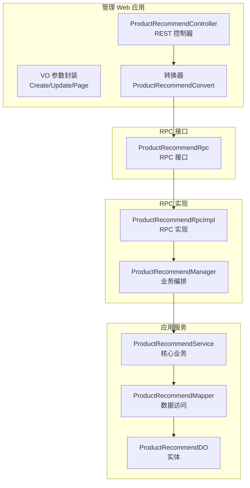
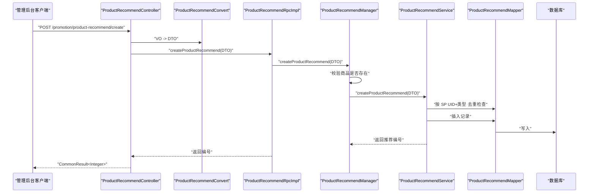
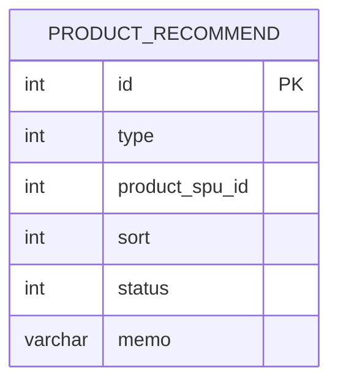

# 商品推荐管理

<cite>
**本文引用的文件**
- [ProductRecommendController.java](file://management-web-app/src/main/java/cn/iocoder/mall/managementweb/controller/promotion/recommend/ProductRecommendController.java)
- [ProductRecommendCreateReqVO.java](file://management-web-app/src/main/java/cn/iocoder/mall/managementweb/controller/promotion/recommend/vo/ProductRecommendCreateReqVO.java)
- [ProductRecommendUpdateReqVO.java](file://management-web-app/src/main/java/cn/iocoder/mall/managementweb/controller/promotion/recommend/vo/ProductRecommendUpdateReqVO.java)
- [ProductRecommendPageReqVO.java](file://management-web-app/src/main/java/cn/iocoder/mall/managementweb/controller/promotion/recommend/vo/ProductRecommendPageReqVO.java)
- [ProductRecommendConvert.java](file://management-web-app/src/main/java/cn/iocoder/mall/managementweb/convert/promotion/ProductRecommendConvert.java)
- [ProductRecommendRpc.java](file://promotion-service-project/promotion-service-api/src/main/java/cn/iocoder/mall/promotion/api/rpc/recommend/ProductRecommendRpc.java)
- [ProductRecommendRpcImpl.java](file://promotion-service-project/promotion-service-app/src/main/java/cn/iocoder/mall/promotionservice/rpc/recommend/ProductRecommendRpcImpl.java)
- [ProductRecommendManager.java](file://promotion-service-project/promotion-service-app/src/main/java/cn/iocoder/mall/promotionservice/manager/recommend/ProductRecommendManager.java)
- [ProductRecommendService.java](file://promotion-service-project/promotion-service-app/src/main/java/cn/iocoder/mall/promotionservice/service/recommend/ProductRecommendService.java)
- [ProductRecommendMapper.java](file://promotion-service-project/promotion-service-app/src/main/java/cn/iocoder/mall/promotionservice/dal/mysql/mapper/recommend/ProductRecommendMapper.java)
- [ProductRecommendDO.java](file://promotion-service-project/promotion-service-app/src/main/java/cn/iocoder/mall/promotionservice/dal/mysql/dataobject/recommend/ProductRecommendDO.java)
- [ProductRecommendTypeEnum.java](file://promotion-service-project/promotion-service-api/src/main/java/cn/iocoder/mall/promotion/api/enums/recommend/ProductRecommendTypeEnum.java)
</cite>

## 目录
1. [简介](#简介)
2. [项目结构](#项目结构)
3. [核心组件](#核心组件)
4. [架构总览](#架构总览)
5. [详细组件分析](#详细组件分析)
6. [依赖分析](#依赖分析)
7. [性能考虑](#性能考虑)
8. [故障排查指南](#故障排查指南)
9. [结论](#结论)
10. [附录](#附录)

## 简介
本技术文档围绕“商品推荐管理”功能展开，面向管理后台，覆盖推荐位的创建、编辑、删除、查询等全链路能力。文档重点解析 ProductRecommendController 的接口设计与参数校验策略，阐述数据模型与字段语义（推荐类型、商品 SPU 关联、排序权重、状态等），并说明与商品服务、RPC 层、持久层的协作关系。同时给出业务规则、配置项、与搜索、首页等模块的联动机制建议，以及最佳实践与运营建议。

## 项目结构
该功能采用前后端分离与 RPC 分层架构：
- 管理 Web 应用层：暴露 REST 接口，负责请求参数封装与返回值包装
- RPC 接口层：定义商品推荐对外 RPC 接口契约
- RPC 实现层：在应用侧实现 RPC 接口，编排 Manager 与 Service
- Manager 层：进行跨服务校验（如商品是否存在）与业务编排
- Service 层：核心业务逻辑与数据访问编排
- Mapper/DO：MyBatis Plus 数据访问对象与实体映射

图表来源
- [ProductRecommendController.java:1-61](file://management-web-app/src/main/java/cn/iocoder/mall/managementweb/controller/promotion/recommend/ProductRecommendController.java#L1-L61)
- [ProductRecommendConvert.java:1-32](file://management-web-app/src/main/java/cn/iocoder/mall/managementweb/convert/promotion/ProductRecommendConvert.java#L1-L32)
- [ProductRecommendRpc.java:1-53](file://promotion-service-project/promotion-service-api/src/main/java/cn/iocoder/mall/promotion/api/rpc/recommend/ProductRecommendRpc.java#L1-L53)
- [ProductRecommendRpcImpl.java:1-49](file://promotion-service-project/promotion-service-app/src/main/java/cn/iocoder/mall/promotionservice/rpc/recommend/ProductRecommendRpcImpl.java#L1-L49)
- [ProductRecommendManager.java:1-67](file://promotion-service-project/promotion-service-app/src/main/java/cn/iocoder/mall/promotionservice/manager/recommend/ProductRecommendManager.java#L1-L67)
- [ProductRecommendService.java:1-94](file://promotion-service-project/promotion-service-app/src/main/java/cn/iocoder/mall/promotionservice/service/recommend/ProductRecommendService.java#L1-L94)
- [ProductRecommendMapper.java:1-34](file://promotion-service-project/promotion-service-app/src/main/java/cn/iocoder/mall/promotionservice/dal/mysql/mapper/recommend/ProductRecommendMapper.java#L1-L34)
- [ProductRecommendDO.java:1-49](file://promotion-service-project/promotion-service-app/src/main/java/cn/iocoder/mall/promotionservice/dal/mysql/dataobject/recommend/ProductRecommendDO.java#L1-L49)

章节来源
- [ProductRecommendController.java:1-61](file://management-web-app/src/main/java/cn/iocoder/mall/managementweb/controller/promotion/recommend/ProductRecommendController.java#L1-L61)
- [ProductRecommendRpc.java:1-53](file://promotion-service-project/promotion-service-api/src/main/java/cn/iocoder/mall/promotion/api/rpc/recommend/ProductRecommendRpc.java#L1-L53)

## 核心组件
- 控制器层：提供 REST 接口，分别处理创建、更新、删除、分页查询
- VO/DTO 层：对入参进行约束与枚举校验
- 转换器：完成 VO 与 DTO 的双向转换
- RPC 接口与实现：定义并实现对外 RPC 能力
- Manager：跨服务校验（如商品是否存在）
- Service：核心业务逻辑（去重、分页、CRUD）
- Mapper/DO：数据持久化与查询条件构造

章节来源
- [ProductRecommendController.java:24-60](file://management-web-app/src/main/java/cn/iocoder/mall/managementweb/controller/promotion/recommend/ProductRecommendController.java#L24-L60)
- [ProductRecommendCreateReqVO.java:1-34](file://management-web-app/src/main/java/cn/iocoder/mall/managementweb/controller/promotion/recommend/vo/ProductRecommendCreateReqVO.java#L1-L34)
- [ProductRecommendUpdateReqVO.java:1-37](file://management-web-app/src/main/java/cn/iocoder/mall/managementweb/controller/promotion/recommend/vo/ProductRecommendUpdateReqVO.java#L1-L37)
- [ProductRecommendPageReqVO.java:1-21](file://management-web-app/src/main/java/cn/iocoder/mall/managementweb/controller/promotion/recommend/vo/ProductRecommendPageReqVO.java#L1-L21)
- [ProductRecommendConvert.java:1-32](file://management-web-app/src/main/java/cn/iocoder/mall/managementweb/convert/promotion/ProductRecommendConvert.java#L1-L32)
- [ProductRecommendRpcImpl.java:1-49](file://promotion-service-project/promotion-service-app/src/main/java/cn/iocoder/mall/promotionservice/rpc/recommend/ProductRecommendRpcImpl.java#L1-L49)
- [ProductRecommendManager.java:1-67](file://promotion-service-project/promotion-service-app/src/main/java/cn/iocoder/mall/promotionservice/manager/recommend/ProductRecommendManager.java#L1-L67)
- [ProductRecommendService.java:1-94](file://promotion-service-project/promotion-service-app/src/main/java/cn/iocoder/mall/promotionservice/service/recommend/ProductRecommendService.java#L1-L94)
- [ProductRecommendMapper.java:1-34](file://promotion-service-project/promotion-service-app/src/main/java/cn/iocoder/mall/promotionservice/dal/mysql/mapper/recommend/ProductRecommendMapper.java#L1-L34)
- [ProductRecommendDO.java:1-49](file://promotion-service-project/promotion-service-app/src/main/java/cn/iocoder/mall/promotionservice/dal/mysql/dataobject/recommend/ProductRecommendDO.java#L1-L49)

## 架构总览
下图展示了从管理后台到商品服务的调用链路与职责划分：

图表来源
- [ProductRecommendController.java:33-37](file://management-web-app/src/main/java/cn/iocoder/mall/managementweb/controller/promotion/recommend/ProductRecommendController.java#L33-L37)
- [ProductRecommendConvert.java:21-21](file://management-web-app/src/main/java/cn/iocoder/mall/managementweb/convert/promotion/ProductRecommendConvert.java#L21-L21)
- [ProductRecommendRpcImpl.java:22-24](file://promotion-service-project/promotion-service-app/src/main/java/cn/iocoder/mall/promotionservice/rpc/recommend/ProductRecommendRpcImpl.java#L22-L24)
- [ProductRecommendManager.java:40-45](file://promotion-service-project/promotion-service-app/src/main/java/cn/iocoder/mall/promotionservice/manager/recommend/ProductRecommendManager.java#L40-L45)
- [ProductRecommendService.java:57-67](file://promotion-service-project/promotion-service-app/src/main/java/cn/iocoder/mall/promotionservice/service/recommend/ProductRecommendService.java#L57-L67)
- [ProductRecommendMapper.java:18-21](file://promotion-service-project/promotion-service-app/src/main/java/cn/iocoder/mall/promotionservice/dal/mysql/mapper/recommend/ProductRecommendMapper.java#L18-L21)

## 详细组件分析

### 控制器层：ProductRecommendController
- 提供四个核心接口：
  - 创建：接收 VO，转换为 DTO 后调用 Manager
  - 更新：接收 VO，转换后调用 Manager
  - 删除：接收推荐编号，调用 Manager
  - 分页：接收分页 VO，返回分页结果
- 使用 Swagger 注解标注接口用途与参数
- 参数校验通过 @Validated 与 VO 上的注解完成

章节来源
- [ProductRecommendController.java:33-58](file://management-web-app/src/main/java/cn/iocoder/mall/managementweb/controller/promotion/recommend/ProductRecommendController.java#L33-L58)

### VO/DTO 层与参数校验
- 创建 VO（ProductRecommendCreateReqVO）
  - 字段：类型、SPU 编号、排序、状态、备注
  - 校验：类型与状态使用枚举校验注解；所有字段非空
- 更新 VO（ProductRecommendUpdateReqVO）
  - 字段：编号、类型、SPU 编号、排序、状态、备注
  - 校验：同上，且编号必填
- 分页 VO（ProductRecommendPageReqVO）
  - 继承分页参数，新增类型过滤

章节来源
- [ProductRecommendCreateReqVO.java:16-31](file://management-web-app/src/main/java/cn/iocoder/mall/managementweb/controller/promotion/recommend/vo/ProductRecommendCreateReqVO.java#L16-L31)
- [ProductRecommendUpdateReqVO.java:16-34](file://management-web-app/src/main/java/cn/iocoder/mall/managementweb/controller/promotion/recommend/vo/ProductRecommendUpdateReqVO.java#L16-L34)
- [ProductRecommendPageReqVO.java:16-18](file://management-web-app/src/main/java/cn/iocoder/mall/managementweb/controller/promotion/recommend/vo/ProductRecommendPageReqVO.java#L16-L18)

### 转换器：ProductRecommendConvert
- 将 VO 转换为 DTO（创建、更新、分页）
- 将分页结果与 SPU 明细进行转换（用于详情展示）

章节来源
- [ProductRecommendConvert.java:21-29](file://management-web-app/src/main/java/cn/iocoder/mall/managementweb/convert/promotion/ProductRecommendConvert.java#L21-L29)

### RPC 接口与实现
- RPC 接口（ProductRecommendRpc）定义了创建、更新、删除、列表、分页等方法
- RPC 实现（ProductRecommendRpcImpl）直接委托给 Manager，保持接口一致性

章节来源
- [ProductRecommendRpc.java:14-50](file://promotion-service-project/promotion-service-api/src/main/java/cn/iocoder/mall/promotion/api/rpc/recommend/ProductRecommendRpc.java#L14-L50)
- [ProductRecommendRpcImpl.java:21-46](file://promotion-service-project/promotion-service-app/src/main/java/cn/iocoder/mall/promotionservice/rpc/recommend/ProductRecommendRpcImpl.java#L21-L46)

### Manager 层：ProductRecommendManager
- 职责：
  - 调用商品 RPC 校验 SPU 存在性
  - 委派 Service 执行 CRUD
- 关键点：在创建/更新前校验商品存在，避免脏数据

章节来源
- [ProductRecommendManager.java:40-64](file://promotion-service-project/promotion-service-app/src/main/java/cn/iocoder/mall/promotionservice/manager/recommend/ProductRecommendManager.java#L40-L64)

### Service 层：ProductRecommendService
- 核心业务：
  - 列表与分页查询
  - 创建：按 SPU+类型 去重校验，防止重复推荐
  - 更新：先校验记录存在，再做去重校验，最后更新
  - 删除：先校验记录存在，再删除
- 错误码：针对“已存在”“不存在”场景抛出对应异常

章节来源
- [ProductRecommendService.java:35-91](file://promotion-service-project/promotion-service-app/src/main/java/cn/iocoder/mall/promotionservice/service/recommend/ProductRecommendService.java#L35-L91)

### Mapper/DO 层：ProductRecommendMapper 与 ProductRecommendDO
- DO 字段：
  - 编号、类型、SPU 编号、排序、状态、备注
- Mapper 方法：
  - 按 SPU+类型 去重查询
  - 列表与分页查询（支持按类型过滤）
- 查询条件：使用 QueryWrapperX 进行可选条件拼接

章节来源
- [ProductRecommendDO.java:21-46](file://promotion-service-project/promotion-service-app/src/main/java/cn/iocoder/mall/promotionservice/dal/mysql/dataobject/recommend/ProductRecommendDO.java#L21-L46)
- [ProductRecommendMapper.java:18-31](file://promotion-service-project/promotion-service-app/src/main/java/cn/iocoder/mall/promotionservice/dal/mysql/mapper/recommend/ProductRecommendMapper.java#L18-L31)

### 数据模型与字段定义
- 推荐类型（ProductRecommendTypeEnum）
  - 热卖推荐、新品推荐
  - 支持数组与有效性校验
- 实体字段（ProductRecommendDO）
  - 类型：关联枚举
  - SPU 编号：与商品服务交互的关键字段
  - 排序：决定展示顺序
  - 状态：启用/禁用
  - 备注：运营备注信息

章节来源
- [ProductRecommendTypeEnum.java:12-14](file://promotion-service-project/promotion-service-api/src/main/java/cn/iocoder/mall/promotion/api/enums/recommend/ProductRecommendTypeEnum.java#L12-L14)
- [ProductRecommendDO.java:26-46](file://promotion-service-project/promotion-service-app/src/main/java/cn/iocoder/mall/promotionservice/dal/mysql/dataobject/recommend/ProductRecommendDO.java#L26-L46)

### 推荐类型与业务规则
- 推荐类型枚举：热卖推荐、新品推荐
- 去重规则：同一 SPU 在同一类型下仅允许一条推荐记录
- 状态规则：通过状态控制是否参与前端展示
- 排序规则：数值越小优先级越高（或展示越靠前，具体以前端排序逻辑为准）

章节来源
- [ProductRecommendTypeEnum.java:40-46](file://promotion-service-project/promotion-service-api/src/main/java/cn/iocoder/mall/promotion/api/enums/recommend/ProductRecommendTypeEnum.java#L40-L46)
- [ProductRecommendService.java:58-61](file://promotion-service-project/promotion-service-app/src/main/java/cn/iocoder/mall/promotionservice/service/recommend/ProductRecommendService.java#L58-L61)

### 与商品、搜索、首页的联动机制
- 与商品服务联动：创建/更新前校验 SPU 存在，保证推荐对象有效
- 与搜索/首页联动：可通过列表/分页接口拉取推荐数据，结合排序权重进行展示
- 配置建议：推荐类型与页面位置解耦，便于灵活组合不同推荐位

章节来源
- [ProductRecommendManager.java:58-64](file://promotion-service-project/promotion-service-app/src/main/java/cn/iocoder/mall/promotionservice/manager/recommend/ProductRecommendManager.java#L58-L64)
- [ProductRecommendService.java:35-49](file://promotion-service-project/promotion-service-app/src/main/java/cn/iocoder/mall/promotionservice/service/recommend/ProductRecommendService.java#L35-L49)

## 依赖分析
- 控制器依赖转换器与 RPC 接口
- RPC 实现依赖 Manager
- Manager 依赖 Service 与商品 RPC
- Service 依赖 Mapper 与 DO
- Mapper 依赖 MyBatis Plus 与 QueryWrapperX

图表来源
- [ProductRecommendController.java:30-31](file://management-web-app/src/main/java/cn/iocoder/mall/managementweb/controller/promotion/recommend/ProductRecommendController.java#L30-L31)
- [ProductRecommendConvert.java:19-27](file://management-web-app/src/main/java/cn/iocoder/mall/managementweb/convert/promotion/ProductRecommendConvert.java#L19-L27)
- [ProductRecommendRpcImpl.java:19-19](file://promotion-service-project/promotion-service-app/src/main/java/cn/iocoder/mall/promotionservice/rpc/recommend/ProductRecommendRpcImpl.java#L19-L19)
- [ProductRecommendManager.java:29-30](file://promotion-service-project/promotion-service-app/src/main/java/cn/iocoder/mall/promotionservice/manager/recommend/ProductRecommendManager.java#L29-L30)
- [ProductRecommendService.java:27-27](file://promotion-service-project/promotion-service-app/src/main/java/cn/iocoder/mall/promotionservice/service/recommend/ProductRecommendService.java#L27-L27)
- [ProductRecommendMapper.java:16-16](file://promotion-service-project/promotion-service-app/src/main/java/cn/iocoder/mall/promotionservice/dal/mysql/mapper/recommend/ProductRecommendMapper.java#L16-L16)
- [ProductRecommendDO.java:14-16](file://promotion-service-project/promotion-service-app/src/main/java/cn/iocoder/mall/promotionservice/dal/mysql/dataobject/recommend/ProductRecommendDO.java#L14-L16)

## 性能考虑
- 去重查询：按 SPU+类型 去重，建议在数据库层面建立复合索引以提升命中率
- 分页查询：使用 IPage 与分页参数，避免一次性加载大量数据
- 跨服务调用：商品 RPC 校验应尽量复用缓存或短时缓存，降低调用成本
- 排序字段：排序权重应配合数据库索引优化，减少排序开销

## 故障排查指南
- “商品不存在”错误：通常发生在创建/更新时，确认 SPU 编号正确且商品存在
- “推荐已存在”错误：同一 SPU+类型 已存在推荐，需先清理或调整类型
- “推荐不存在”错误：更新/删除时目标记录不存在，请核对编号
- 分页/列表为空：检查类型与状态过滤条件是否过于严格

章节来源
- [ProductRecommendManager.java:58-64](file://promotion-service-project/promotion-service-app/src/main/java/cn/iocoder/mall/promotionservice/manager/recommend/ProductRecommendManager.java#L58-L64)
- [ProductRecommendService.java:58-91](file://promotion-service-project/promotion-service-app/src/main/java/cn/iocoder/mall/promotionservice/service/recommend/ProductRecommendService.java#L58-L91)

## 结论
该商品推荐管理功能采用清晰的分层架构，从前端请求到 RPC、Manager、Service、Mapper 形成完整闭环。通过枚举与参数校验确保输入质量，通过去重与状态控制保障业务正确性。建议在生产环境中完善索引、缓存与监控，持续优化推荐位的稳定性与性能。

## 附录

### 接口一览（管理后台）
- 创建：POST /promotion/product-recommend/create
- 更新：POST /promotion/product-recommend/update
- 删除：POST /promotion/product-recommend/delete?productRecommendId=...
- 分页：GET /promotion/product-recommend/page

章节来源
- [ProductRecommendController.java:33-58](file://management-web-app/src/main/java/cn/iocoder/mall/managementweb/controller/promotion/recommend/ProductRecommendController.java#L33-L58)

### 数据模型图

图表来源
- [ProductRecommendDO.java:21-46](file://promotion-service-project/promotion-service-app/src/main/java/cn/iocoder/mall/promotionservice/dal/mysql/dataobject/recommend/ProductRecommendDO.java#L21-L46)