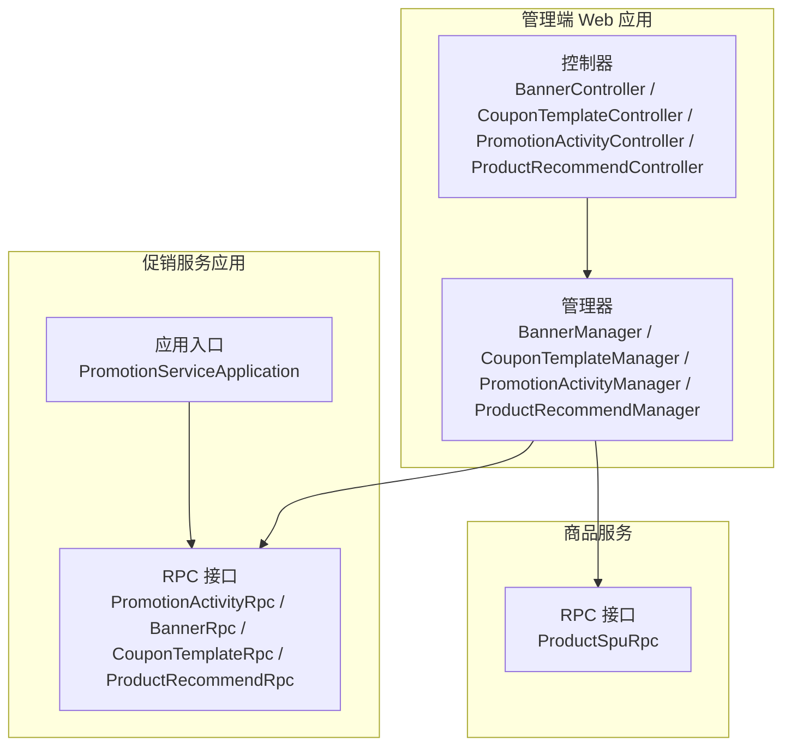
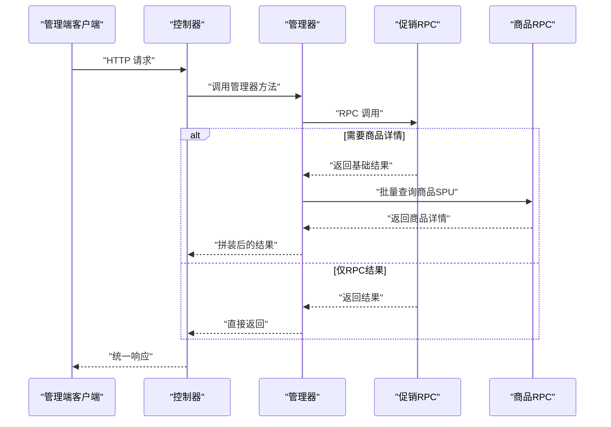
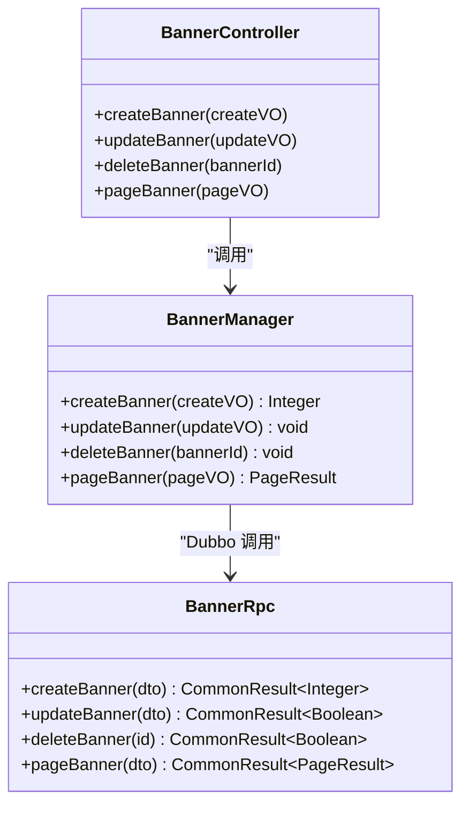
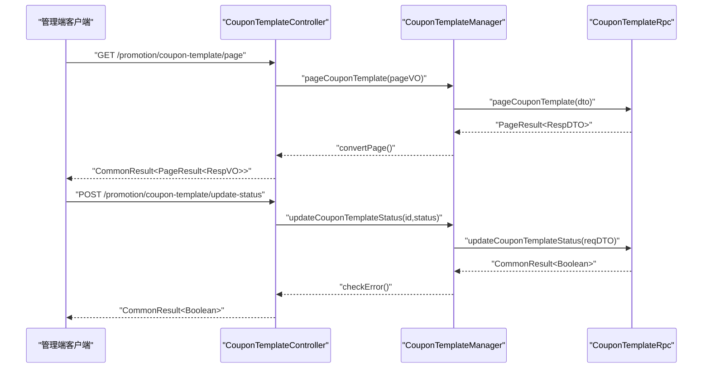
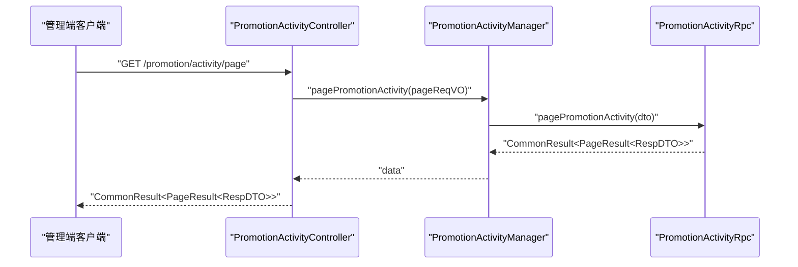
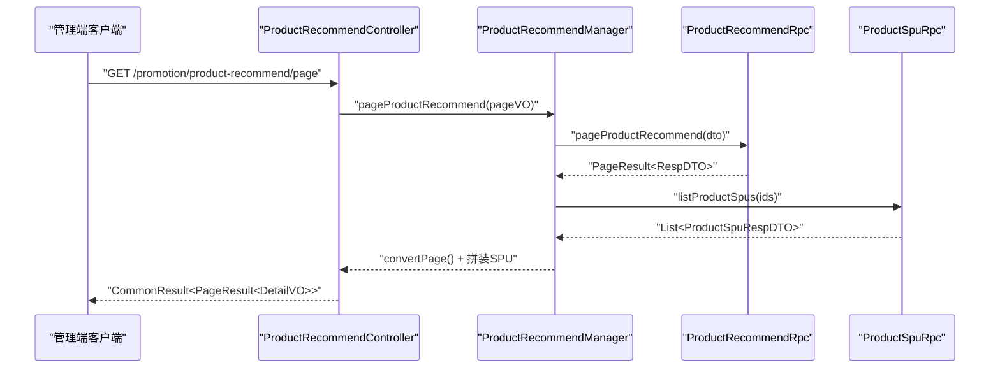
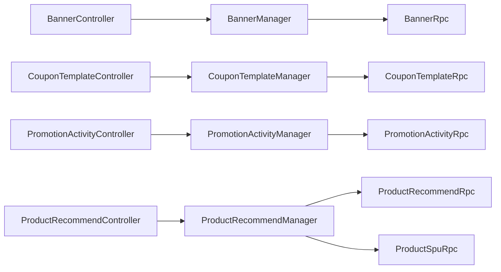

# 营销活动管理

<cite>
**本文引用的文件**
- [BannerController.java](file://management-web-app/src/main/java/cn/iocoder/mall/managementweb/controller/promotion/brand/BannerController.java)
- [CouponTemplateController.java](file://management-web-app/src/main/java/cn/iocoder/mall/managementweb/controller/promotion/coupon/CouponTemplateController.java)
- [PromotionActivityController.java](file://management-web-app/src/main/java/cn/iocoder/mall/managementweb/controller/promotion/activity/PromotionActivityController.java)
- [ProductRecommendController.java](file://management-web-app/src/main/java/cn/iocoder/mall/managementweb/controller/promotion/recommend/ProductRecommendController.java)
- [BannerManager.java](file://management-web-app/src/main/java/cn/iocoder/mall/managementweb/manager/promotion/brand/BannerManager.java)
- [CouponTemplateManager.java](file://management-web-app/src/main/java/cn/iocoder/mall/managementweb/manager/promotion/coupon/CouponTemplateManager.java)
- [PromotionActivityManager.java](file://management-web-app/src/main/java/cn/iocoder/mall/managementweb/manager/promotion/activity/PromotionActivityManager.java)
- [ProductRecommendManager.java](file://management-web-app/src/main/java/cn/iocoder/mall/managementweb/manager/promotion/recommend/ProductRecommendManager.java)
- [PromotionActivityRpc.java](file://promotion-service-project/promotion-service-api/src/main/java/cn/iocoder/mall/promotion/api/rpc/activity/PromotionActivityRpc.java)
- [BannerRpc.java](file://promotion-service-project/promotion-service-api/src/main/java/cn/iocoder/mall/promotion/api/rpc/banner/BannerRpc.java)
- [CouponTemplateRpc.java](file://promotion-service-project/promotion-service-api/src/main/java/cn/iocoder/mall/promotion/api/rpc/coupon/CouponTemplateRpc.java)
- [ProductRecommendRpc.java](file://promotion-service-project/promotion-service-api/src/main/java/cn/iocoder/mall/promotion/api/rpc/recommend/ProductRecommendRpc.java)
- [PromotionActivityTypeEnum.java](file://promotion-service-project/promotion-service-api/src/main/java/cn/iocoder/mall/promotion/api/enums/activity/PromotionActivityTypeEnum.java)
- [PromotionActivityStatusEnum.java](file://promotion-service-project/promotion-service-api/src/main/java/cn/iocoder/mall/promotion/api/enums/activity/PromotionActivityStatusEnum.java)
- [CouponTemplateTypeEnum.java](file://promotion-service-project/promotion-service-api/src/main/java/cn/iocoder/mall/promotion/api/enums/coupon/template/CouponTemplateTypeEnum.java)
- [CouponTemplateStatusEnum.java](file://promotion-service-project/promotion-service-api/src/main/java/cn/iocoder/mall/promotion/api/enums/coupon/template/CouponTemplateStatusEnum.java)
- [CouponCardStatusEnum.java](file://promotion-service-project/promotion-service-api/src/main/java/cn/iocoder/mall/promotion/api/enums/coupon/card/CouponCardStatusEnum.java)
- [PreferentialTypeEnum.java](file://promotion-service-project/promotion-service-api/src/main/java/cn/iocoder/mall/promotion/api/enums/PreferentialTypeEnum.java)
- [MeetTypeEnum.java](file://promotion-service-project/promotion-service-api/src/main/java/cn/iocoder/mall/promotion/api/enums/MeetTypeEnum.java)
- [RangeTypeEnum.java](file://promotion-service-project/promotion-service-api/src/main/java/cn/iocoder/mall/promotion/api/enums/RangeTypeEnum.java)
- [PromotionErrorCodeConstants.java](file://promotion-service-project/promotion-service-api/src/main/java/cn/iocoder/mall/promotion/api/enums/PromotionErrorCodeConstants.java)
- [PromotionServiceApplication.java](file://promotion-service-project/promotion-service-app/src/main/java/cn/iocoder/mall/promotionservice/PromotionServiceApplication.java)
- [ProductSpuRpc.java](file://product-service-project/product-service-api/src/main/java/cn/iocoder/mall/productservice/rpc/spu/ProductSpuRpc.java)
</cite>

## 目录
1. [简介](#简介)
2. [项目结构](#项目结构)
3. [核心组件](#核心组件)
4. [架构总览](#架构总览)
5. [详细组件分析](#详细组件分析)
6. [依赖关系分析](#依赖关系分析)
7. [性能考量](#性能考量)
8. [故障排查指南](#故障排查指南)
9. [结论](#结论)
10. [附录](#附录)

## 简介
本技术文档围绕管理后台的营销活动管理体系展开，覆盖轮播图管理、优惠券管理、促销活动管理、商品推荐管理等核心功能。文档从系统架构、组件职责、数据流、处理逻辑、集成点、错误处理与性能优化等方面进行全面阐述，并结合业务规则（满减、折扣、优惠券发放）与统计分析（活动参与度、转化率）给出最佳实践与运营建议。

## 项目结构
营销活动管理采用前后端分离与微服务架构：
- 管理端 Web 应用通过 REST 接口调用各 RPC 服务，完成营销活动的增删改查与状态变更。
- 促销服务应用提供营销领域能力，包含活动、轮播图、优惠券、商品推荐等 RPC 实现。
- 商品服务提供商品 SPu 详情用于商品推荐结果拼装。

图表来源
- [BannerController.java:1-66](file://management-web-app/src/main/java/cn/iocoder/mall/managementweb/controller/promotion/brand/BannerController.java#L1-L66)
- [CouponTemplateController.java:1-72](file://management-web-app/src/main/java/cn/iocoder/mall/managementweb/controller/promotion/coupon/CouponTemplateController.java#L1-L72)
- [PromotionActivityController.java:1-37](file://management-web-app/src/main/java/cn/iocoder/mall/managementweb/controller/promotion/activity/PromotionActivityController.java#L1-L37)
- [ProductRecommendController.java:1-61](file://management-web-app/src/main/java/cn/iocoder/mall/managementweb/controller/promotion/recommend/ProductRecommendController.java#L1-L61)
- [BannerManager.java:1-69](file://management-web-app/src/main/java/cn/iocoder/mall/managementweb/manager/promotion/brand/BannerManager.java#L1-L69)
- [CouponTemplateManager.java:1-55](file://management-web-app/src/main/java/cn/iocoder/mall/managementweb/manager/promotion/coupon/CouponTemplateManager.java#L1-L55)
- [PromotionActivityManager.java:1-31](file://management-web-app/src/main/java/cn/iocoder/mall/managementweb/manager/promotion/activity/PromotionActivityManager.java#L1-L31)
- [ProductRecommendManager.java:1-92](file://management-web-app/src/main/java/cn/iocoder/mall/managementweb/manager/promotion/recommend/ProductRecommendManager.java#L1-L92)
- [PromotionServiceApplication.java](file://promotion-service-project/promotion-service-app/src/main/java/cn/iocoder/mall/promotionservice/PromotionServiceApplication.java)

章节来源
- [BannerController.java:1-66](file://management-web-app/src/main/java/cn/iocoder/mall/managementweb/controller/promotion/brand/BannerController.java#L1-L66)
- [CouponTemplateController.java:1-72](file://management-web-app/src/main/java/cn/iocoder/mall/managementweb/controller/promotion/coupon/CouponTemplateController.java#L1-L72)
- [PromotionActivityController.java:1-37](file://management-web-app/src/main/java/cn/iocoder/mall/managementweb/controller/promotion/activity/PromotionActivityController.java#L1-L37)
- [ProductRecommendController.java:1-61](file://management-web-app/src/main/java/cn/iocoder/mall/managementweb/controller/promotion/recommend/ProductRecommendController.java#L1-L61)
- [PromotionServiceApplication.java](file://promotion-service-project/promotion-service-app/src/main/java/cn/iocoder/mall/promotionservice/PromotionServiceApplication.java)

## 核心组件
- 控制器层：负责接收请求、参数校验、鉴权与返回统一响应包装。
- 管理器层：封装 RPC 调用、参数转换、异常检查与结果转换。
- RPC 接口层：定义促销域内各能力的远程接口契约。
- 促销服务应用：承载 RPC 实现与业务逻辑。
- 商品服务：提供商品 SPu 详情以拼装商品推荐结果。

章节来源
- [BannerController.java:25-66](file://management-web-app/src/main/java/cn/iocoder/mall/managementweb/controller/promotion/brand/BannerController.java#L25-L66)
- [CouponTemplateController.java:24-72](file://management-web-app/src/main/java/cn/iocoder/mall/managementweb/controller/promotion/coupon/CouponTemplateController.java#L24-L72)
- [PromotionActivityController.java:19-37](file://management-web-app/src/main/java/cn/iocoder/mall/managementweb/controller/promotion/activity/PromotionActivityController.java#L19-L37)
- [ProductRecommendController.java:24-61](file://management-web-app/src/main/java/cn/iocoder/mall/managementweb/controller/promotion/recommend/ProductRecommendController.java#L24-L61)
- [BannerManager.java:18-69](file://management-web-app/src/main/java/cn/iocoder/mall/managementweb/manager/promotion/brand/BannerManager.java#L18-L69)
- [CouponTemplateManager.java:17-55](file://management-web-app/src/main/java/cn/iocoder/mall/managementweb/manager/promotion/coupon/CouponTemplateManager.java#L17-L55)
- [PromotionActivityManager.java:16-31](file://management-web-app/src/main/java/cn/iocoder/mall/managementweb/manager/promotion/activity/PromotionActivityManager.java#L16-L31)
- [ProductRecommendManager.java:25-92](file://management-web-app/src/main/java/cn/iocoder/mall/managementweb/manager/promotion/recommend/ProductRecommendManager.java#L25-L92)

## 架构总览
营销活动管理采用“控制层 → 管理器层 → RPC 服务”的分层架构，管理器通过 Dubbo 引用调用促销服务应用提供的 RPC 接口，实现对活动、轮播图、优惠券、商品推荐的统一管理。

图表来源
- [BannerController.java:34-63](file://management-web-app/src/main/java/cn/iocoder/mall/managementweb/controller/promotion/brand/BannerController.java#L34-L63)
- [CouponTemplateController.java:34-71](file://management-web-app/src/main/java/cn/iocoder/mall/managementweb/controller/promotion/coupon/CouponTemplateController.java#L34-L71)
- [PromotionActivityController.java:29-34](file://management-web-app/src/main/java/cn/iocoder/mall/managementweb/controller/promotion/activity/PromotionActivityController.java#L29-L34)
- [ProductRecommendController.java:33-58](file://management-web-app/src/main/java/cn/iocoder/mall/managementweb/controller/promotion/recommend/ProductRecommendController.java#L33-L58)
- [BannerManager.java:30-66](file://management-web-app/src/main/java/cn/iocoder/mall/managementweb/manager/promotion/brand/BannerManager.java#L30-L66)
- [CouponTemplateManager.java:26-52](file://management-web-app/src/main/java/cn/iocoder/mall/managementweb/manager/promotion/coupon/CouponTemplateManager.java#L26-L52)
- [PromotionActivityManager.java:23-28](file://management-web-app/src/main/java/cn/iocoder/mall/managementweb/manager/promotion/activity/PromotionActivityManager.java#L23-L28)
- [ProductRecommendManager.java:40-89](file://management-web-app/src/main/java/cn/iocoder/mall/managementweb/manager/promotion/recommend/ProductRecommendManager.java#L40-L89)
- [ProductSpuRpc.java](file://product-service-project/product-service-api/src/main/java/cn/iocoder/mall/productservice/rpc/spu/ProductSpuRpc.java)

## 详细组件分析

### 轮播图管理（Banner）
- 控制器职责：提供创建、更新、删除、分页查询等接口，使用权限注解进行访问控制。
- 管理器职责：封装 RPC 调用，执行参数转换与统一异常处理，支持分页结果转换。
- RPC 接口：定义轮播图的创建、更新、删除、分页查询等能力。
- 数据模型：包含图片地址、跳转链接、排序、状态等字段，具体以 DTO 定义为准。

图表来源
- [BannerController.java:29-66](file://management-web-app/src/main/java/cn/iocoder/mall/managementweb/controller/promotion/brand/BannerController.java#L29-L66)
- [BannerManager.java:19-69](file://management-web-app/src/main/java/cn/iocoder/mall/managementweb/manager/promotion/brand/BannerManager.java#L19-L69)
- [BannerRpc.java](file://promotion-service-project/promotion-service-api/src/main/java/cn/iocoder/mall/promotion/api/rpc/banner/BannerRpc.java)

章节来源
- [BannerController.java:29-66](file://management-web-app/src/main/java/cn/iocoder/mall/managementweb/controller/promotion/brand/BannerController.java#L29-L66)
- [BannerManager.java:19-69](file://management-web-app/src/main/java/cn/iocoder/mall/managementweb/manager/promotion/brand/BannerManager.java#L19-L69)

### 优惠券管理（CouponTemplate）
- 控制器职责：提供优惠券模板分页查询、状态更新、卡券模板创建与更新等接口。
- 管理器职责：封装 RPC 调用，执行参数转换与统一异常处理，支持分页结果转换。
- 业务规则：支持模板类型（如满减、折扣）、模板状态（启用/禁用）、核销状态等枚举。
- 发放流程：模板创建后可面向用户发放卡券，卡券具备有效期、使用范围等属性。

图表来源
- [CouponTemplateController.java:27-71](file://management-web-app/src/main/java/cn/iocoder/mall/managementweb/controller/promotion/coupon/CouponTemplateController.java#L27-L71)
- [CouponTemplateManager.java:17-55](file://management-web-app/src/main/java/cn/iocoder/mall/managementweb/manager/promotion/coupon/CouponTemplateManager.java#L17-L55)
- [CouponTemplateRpc.java](file://promotion-service-project/promotion-service-api/src/main/java/cn/iocoder/mall/promotion/api/rpc/coupon/CouponTemplateRpc.java)

章节来源
- [CouponTemplateController.java:27-71](file://management-web-app/src/main/java/cn/iocoder/mall/managementweb/controller/promotion/coupon/CouponTemplateController.java#L27-L71)
- [CouponTemplateManager.java:17-55](file://management-web-app/src/main/java/cn/iocoder/mall/managementweb/manager/promotion/coupon/CouponTemplateManager.java#L17-L55)
- [CouponTemplateTypeEnum.java](file://promotion-service-project/promotion-service-api/src/main/java/cn/iocoder/mall/promotion/api/enums/coupon/template/CouponTemplateTypeEnum.java)
- [CouponTemplateStatusEnum.java](file://promotion-service-project/promotion-service-api/src/main/java/cn/iocoder/mall/promotion/api/enums/coupon/template/CouponTemplateStatusEnum.java)
- [CouponCardStatusEnum.java](file://promotion-service-project/promotion-service-api/src/main/java/cn/iocoder/mall/promotion/api/enums/coupon/card/CouponCardStatusEnum.java)

### 促销活动管理（PromotionActivity）
- 控制器职责：提供促销活动分页查询接口。
- 管理器职责：封装 RPC 调用，执行参数转换与统一异常处理。
- 类型与规则：活动类型（如满减、折扣）、状态（启用/禁用）、门槛条件（满额）、优惠方式（减免金额/折扣比例）、适用范围（商品/品类/全部）等。

图表来源
- [PromotionActivityController.java:23-36](file://management-web-app/src/main/java/cn/iocoder/mall/managementweb/controller/promotion/activity/PromotionActivityController.java#L23-L36)
- [PromotionActivityManager.java:16-31](file://management-web-app/src/main/java/cn/iocoder/mall/managementweb/manager/promotion/activity/PromotionActivityManager.java#L16-L31)
- [PromotionActivityRpc.java](file://promotion-service-project/promotion-service-api/src/main/java/cn/iocoder/mall/promotion/api/rpc/activity/PromotionActivityRpc.java)
- [PromotionActivityTypeEnum.java](file://promotion-service-project/promotion-service-api/src/main/java/cn/iocoder/mall/promotion/api/enums/activity/PromotionActivityTypeEnum.java)
- [PromotionActivityStatusEnum.java](file://promotion-service-project/promotion-service-api/src/main/java/cn/iocoder/mall/promotion/api/enums/activity/PromotionActivityStatusEnum.java)
- [PreferentialTypeEnum.java](file://promotion-service-project/promotion-service-api/src/main/java/cn/iocoder/mall/promotion/api/enums/PreferentialTypeEnum.java)
- [MeetTypeEnum.java](file://promotion-service-project/promotion-service-api/src/main/java/cn/iocoder/mall/promotion/api/enums/MeetTypeEnum.java)
- [RangeTypeEnum.java](file://promotion-service-project/promotion-service-api/src/main/java/cn/iocoder/mall/promotion/api/enums/RangeTypeEnum.java)

章节来源
- [PromotionActivityController.java:23-36](file://management-web-app/src/main/java/cn/iocoder/mall/managementweb/controller/promotion/activity/PromotionActivityController.java#L23-L36)
- [PromotionActivityManager.java:16-31](file://management-web-app/src/main/java/cn/iocoder/mall/managementweb/manager/promotion/activity/PromotionActivityManager.java#L16-L31)

### 商品推荐管理（ProductRecommend）
- 控制器职责：提供创建、更新、删除、分页查询接口。
- 管理器职责：封装 RPC 调用，执行参数转换与统一异常处理；在分页时拉取商品 SPu 详情并拼装到结果中。
- 与商品服务联动：通过 ProductSpuRpc 批量获取商品信息，提升展示体验。

图表来源
- [ProductRecommendController.java:28-61](file://management-web-app/src/main/java/cn/iocoder/mall/managementweb/controller/promotion/recommend/ProductRecommendController.java#L28-L61)
- [ProductRecommendManager.java:25-92](file://management-web-app/src/main/java/cn/iocoder/mall/managementweb/manager/promotion/recommend/ProductRecommendManager.java#L25-L92)
- [ProductRecommendRpc.java](file://promotion-service-project/promotion-service-api/src/main/java/cn/iocoder/mall/promotion/api/rpc/recommend/ProductRecommendRpc.java)
- [ProductSpuRpc.java](file://product-service-project/product-service-api/src/main/java/cn/iocoder/mall/productservice/rpc/spu/ProductSpuRpc.java)

章节来源
- [ProductRecommendController.java:28-61](file://management-web-app/src/main/java/cn/iocoder/mall/managementweb/controller/promotion/recommend/ProductRecommendController.java#L28-L61)
- [ProductRecommendManager.java:25-92](file://management-web-app/src/main/java/cn/iocoder/mall/managementweb/manager/promotion/recommend/ProductRecommendManager.java#L25-L92)

## 依赖关系分析
- 控制器依赖管理器；管理器依赖 RPC 接口；RPC 接口由促销服务应用实现。
- 商品推荐管理器额外依赖商品服务 RPC，用于结果拼装。
- 错误码常量集中定义于促销服务 API 模块，便于统一错误语义。

图表来源
- [BannerController.java:29-66](file://management-web-app/src/main/java/cn/iocoder/mall/managementweb/controller/promotion/brand/BannerController.java#L29-L66)
- [CouponTemplateController.java:27-71](file://management-web-app/src/main/java/cn/iocoder/mall/managementweb/controller/promotion/coupon/CouponTemplateController.java#L27-L71)
- [PromotionActivityController.java:23-36](file://management-web-app/src/main/java/cn/iocoder/mall/managementweb/controller/promotion/activity/PromotionActivityController.java#L23-L36)
- [ProductRecommendController.java:28-61](file://management-web-app/src/main/java/cn/iocoder/mall/managementweb/controller/promotion/recommend/ProductRecommendController.java#L28-L61)
- [BannerManager.java:19-69](file://management-web-app/src/main/java/cn/iocoder/mall/managementweb/manager/promotion/brand/BannerManager.java#L19-L69)
- [CouponTemplateManager.java:17-55](file://management-web-app/src/main/java/cn/iocoder/mall/managementweb/manager/promotion/coupon/CouponTemplateManager.java#L17-L55)
- [PromotionActivityManager.java:16-31](file://management-web-app/src/main/java/cn/iocoder/mall/managementweb/manager/promotion/activity/PromotionActivityManager.java#L16-L31)
- [ProductRecommendManager.java:25-92](file://management-web-app/src/main/java/cn/iocoder/mall/managementweb/manager/promotion/recommend/ProductRecommendManager.java#L25-L92)

章节来源
- [PromotionErrorCodeConstants.java](file://promotion-service-project/promotion-service-api/src/main/java/cn/iocoder/mall/promotion/api/enums/PromotionErrorCodeConstants.java)

## 性能考量
- RPC 调用链路：管理器层统一进行 Dubbo 调用与异常检查，减少重复代码，提高稳定性。
- 结果拼装：商品推荐分页时按需批量查询商品 SPu 详情，避免 N+1 查询问题。
- 分页查询：优先使用分页接口，限制单页数据量，降低内存占用与网络传输压力。
- 缓存策略：可在商品详情或热门推荐上引入缓存，降低 RPC 调用量与延迟。
- 并发控制：在高并发场景下，合理设置线程池与限流策略，保障系统稳定。

## 故障排查指南
- 统一异常处理：管理器层通过检查 RPC 返回结果的错误码，快速定位问题。
- 错误码常量：促销服务 API 模块提供统一错误码常量，便于快速定位业务错误。
- 常见问题：
  - RPC 调用失败：检查服务注册与发现、网络连通性、版本配置。
  - 参数校验失败：确认请求参数是否符合 VO/DTO 的约束。
  - 权限不足：确认管理端用户角色与权限点配置。

章节来源
- [PromotionErrorCodeConstants.java](file://promotion-service-project/promotion-service-api/src/main/java/cn/iocoder/mall/promotion/api/enums/PromotionErrorCodeConstants.java)

## 结论
营销活动管理通过清晰的分层架构与 RPC 能力抽象，实现了轮播图、优惠券、促销活动、商品推荐的统一管理。结合业务规则与商品服务联动，能够高效支撑运营需求。建议在高并发场景下完善缓存与限流策略，并持续优化分页与批量查询以提升性能。

## 附录
- 最佳实践与运营建议：
  - 活动规划：提前设定活动时间、门槛与优惠规则，确保库存与商品信息准确。
  - 优惠券策略：根据用户画像与复购周期设计发放节奏，避免过度补贴影响利润。
  - 数据监控：关注活动参与度、转化率、客单价等指标，及时调整策略。
  - 安全与合规：严格控制权限与日志审计，确保营销活动的合规性与安全性。