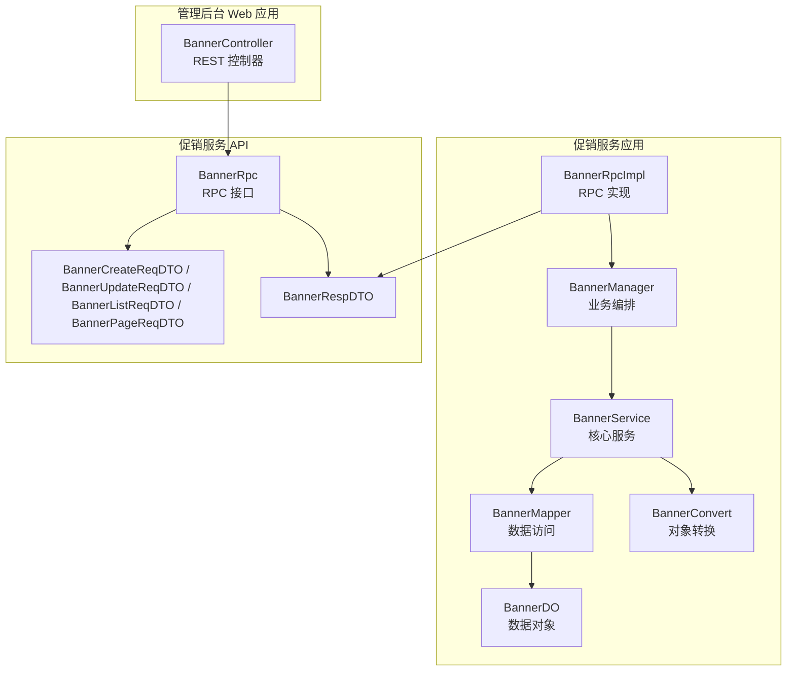
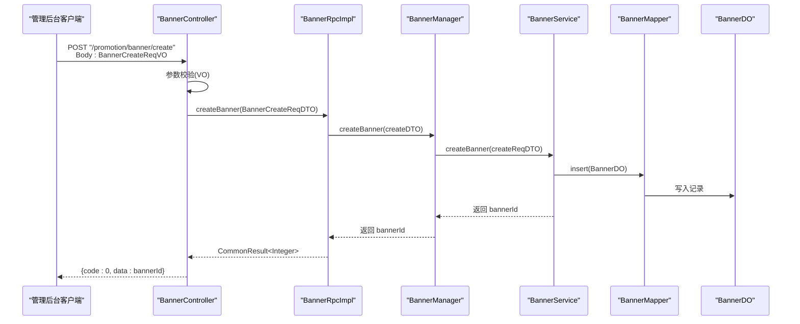
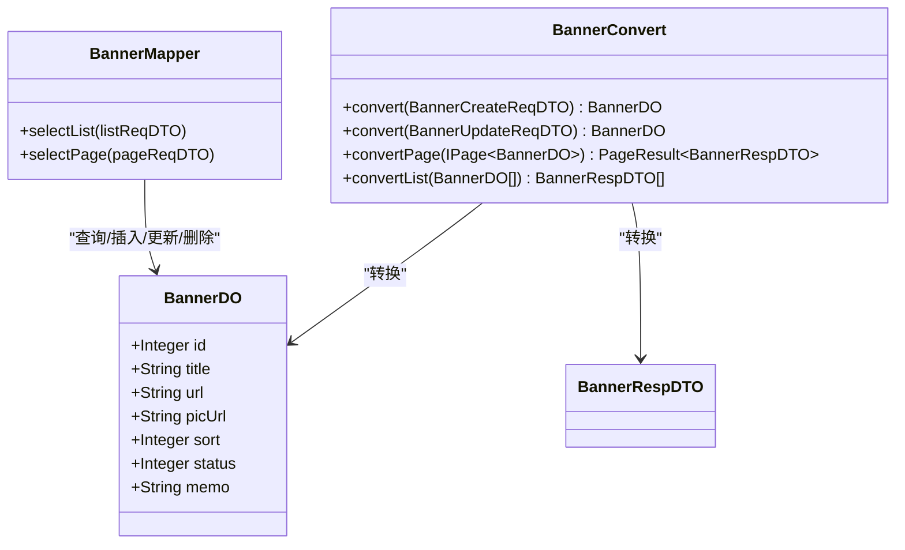
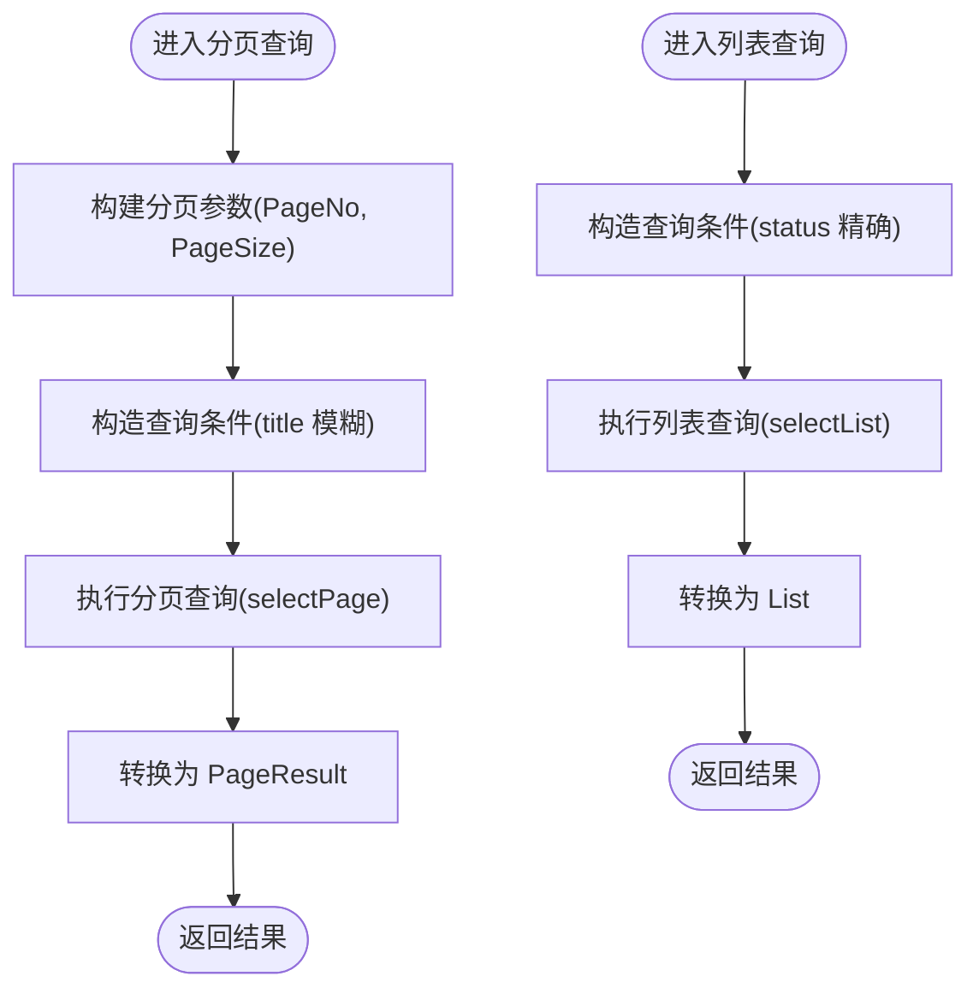
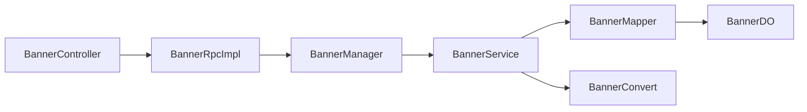

# 轮播图管理

<cite>
**本文引用的文件**
- [BannerController.java](file://management-web-app/src/main/java/cn/iocoder/mall/managementweb/controller/promotion/brand/BannerController.java)
- [BannerRpc.java](file://promotion-service-project/promotion-service-api/src/main/java/cn/iocoder/mall/promotion/api/rpc/banner/BannerRpc.java)
- [BannerCreateReqDTO.java](file://promotion-service-project/promotion-service-api/src/main/java/cn/iocoder/mall/promotion/api/rpc/banner/dto/BannerCreateReqDTO.java)
- [BannerUpdateReqDTO.java](file://promotion-service-project/promotion-service-api/src/main/java/cn/iocoder/mall/promotion/api/rpc/banner/dto/BannerUpdateReqDTO.java)
- [BannerListReqDTO.java](file://promotion-service-project/promotion-service-api/src/main/java/cn/iocoder/mall/promotion/api/rpc/banner/dto/BannerListReqDTO.java)
- [BannerPageReqDTO.java](file://promotion-service-project/promotion-service-api/src/main/java/cn/iocoder/mall/promotion/api/rpc/banner/dto/BannerPageReqDTO.java)
- [BannerRespDTO.java](file://promotion-service-project/promotion-service-api/src/main/java/cn/iocoder/mall/promotion/api/rpc/banner/dto/BannerRespDTO.java)
- [BannerDO.java](file://promotion-service-project/promotion-service-app/src/main/java/cn/iocoder/mall/promotionservice/dal/mysql/dataobject/banner/BannerDO.java)
- [BannerService.java](file://promotion-service-project/promotion-service-app/src/main/java/cn/iocoder/mall/promotionservice/service/banner/BannerService.java)
- [BannerManager.java](file://promotion-service-project/promotion-service-app/src/main/java/cn/iocoder/mall/promotionservice/manager/banner/BannerManager.java)
- [BannerConvert.java](file://promotion-service-project/promotion-service-app/src/main/java/cn/iocoder/mall/promotionservice/convert/banner/BannerConvert.java)
- [BannerMapper.java](file://promotion-service-project/promotion-service-app/src/main/java/cn/iocoder/mall/promotionservice/dal/mysql/mapper/banner/BannerMapper.java)
- [BannerRpcImpl.java](file://promotion-service-project/promotion-service-app/src/main/java/cn/iocoder/mall/promotionservice/rpc/banner/BannerRpcImpl.java)
- [BannerCreateReqVO.java](file://management-web-app/src/main/java/cn/iocoder/mall/managementweb/controller/promotion/brand/vo/BannerCreateReqVO.java)
- [BannerUpdateReqVO.java](file://management-web-app/src/main/java/cn/iocoder/mall/managementweb/controller/promotion/brand/vo/BannerUpdateReqVO.java)
</cite>

## 目录
1. [简介](#简介)
2. [项目结构](#项目结构)
3. [核心组件](#核心组件)
4. [架构总览](#架构总览)
5. [详细组件分析](#详细组件分析)
6. [依赖分析](#依赖分析)
7. [性能考虑](#性能考虑)
8. [故障排查指南](#故障排查指南)
9. [结论](#结论)
10. [附录](#附录)

## 简介
本技术文档围绕“轮播图管理”功能展开，系统性介绍管理后台对轮播图的创建、编辑、删除、分页查询等能力。文档覆盖管理端控制器、RPC 接口、服务层、数据访问层、数据对象与转换器的职责划分，并给出接口设计、参数校验、业务规则、与前端集成及缓存策略建议，以及最佳实践与运营建议。

## 项目结构
轮播图功能由“管理后台 Web 应用 + 促销服务应用 + 促销服务 API”三层构成：
- 管理后台 Web 应用：对外暴露 REST 接口，负责权限控制与请求参数封装（VO）。
- 促销服务应用：包含业务逻辑、数据访问、RPC 实现与转换器。
- 促销服务 API：定义 RPC 接口与 DTO，作为服务间契约。

图表来源
- [BannerController.java:25-66](file://management-web-app/src/main/java/cn/iocoder/mall/managementweb/controller/promotion/brand/BannerController.java#L25-L66)
- [BannerRpcImpl.java:15-49](file://promotion-service-project/promotion-service-app/src/main/java/cn/iocoder/mall/promotionservice/rpc/banner/BannerRpcImpl.java#L15-L49)
- [BannerManager.java:15-43](file://promotion-service-project/promotion-service-app/src/main/java/cn/iocoder/mall/promotionservice/manager/banner/BannerManager.java#L15-L43)
- [BannerService.java:20-93](file://promotion-service-project/promotion-service-app/src/main/java/cn/iocoder/mall/promotionservice/service/banner/BannerService.java#L20-L93)
- [BannerMapper.java:14-27](file://promotion-service-project/promotion-service-app/src/main/java/cn/iocoder/mall/promotionservice/dal/mysql/mapper/banner/BannerMapper.java#L14-L27)
- [BannerDO.java:16-52](file://promotion-service-project/promotion-service-app/src/main/java/cn/iocoder/mall/promotionservice/dal/mysql/dataobject/banner/BannerDO.java#L16-L52)
- [BannerConvert.java:15-30](file://promotion-service-project/promotion-service-app/src/main/java/cn/iocoder/mall/promotionservice/convert/banner/BannerConvert.java#L15-L30)
- [BannerRpc.java:12-53](file://promotion-service-project/promotion-service-api/src/main/java/cn/iocoder/mall/promotion/api/rpc/banner/BannerRpc.java#L12-L53)
- [BannerCreateReqDTO.java:19-59](file://promotion-service-project/promotion-service-api/src/main/java/cn/iocoder/mall/promotion/api/rpc/banner/dto/BannerCreateReqDTO.java#L19-L59)
- [BannerUpdateReqDTO.java:19-64](file://promotion-service-project/promotion-service-api/src/main/java/cn/iocoder/mall/promotion/api/rpc/banner/dto/BannerUpdateReqDTO.java#L19-L64)
- [BannerListReqDTO.java:15-24](file://promotion-service-project/promotion-service-api/src/main/java/cn/iocoder/mall/promotion/api/rpc/banner/dto/BannerListReqDTO.java#L15-L24)
- [BannerPageReqDTO.java:14-22](file://promotion-service-project/promotion-service-api/src/main/java/cn/iocoder/mall/promotion/api/rpc/banner/dto/BannerPageReqDTO.java#L14-L22)
- [BannerRespDTO.java:14-50](file://promotion-service-project/promotion-service-api/src/main/java/cn/iocoder/mall/promotion/api/rpc/banner/dto/BannerRespDTO.java#L14-L50)

章节来源
- [BannerController.java:25-66](file://management-web-app/src/main/java/cn/iocoder/mall/managementweb/controller/promotion/brand/BannerController.java#L25-L66)
- [BannerRpc.java:12-53](file://promotion-service-project/promotion-service-api/src/main/java/cn/iocoder/mall/promotion/api/rpc/banner/BannerRpc.java#L12-L53)

## 核心组件
- 管理后台控制器：提供 REST 接口，完成权限校验与参数封装（VO → DTO），调用 BannerManager。
- RPC 接口与实现：定义跨模块调用契约，BannerRpcImpl 将管理端请求转发至 BannerManager。
- 业务编排层：BannerManager 组织 BannerService 的具体操作。
- 服务层：BannerService 完成数据校验、DAO 访问与异常处理。
- 数据访问层：BannerMapper 基于 MyBatis-Plus 提供分页与列表查询。
- 数据对象与转换器：BannerDO 映射数据库表；BannerConvert 负责 DTO/DO/Page 转换。
- 请求/响应 DTO：统一定义入参与出参结构，含参数校验注解。

章节来源
- [BannerController.java:25-66](file://management-web-app/src/main/java/cn/iocoder/mall/managementweb/controller/promotion/brand/BannerController.java#L25-L66)
- [BannerRpcImpl.java:15-49](file://promotion-service-project/promotion-service-app/src/main/java/cn/iocoder/mall/promotionservice/rpc/banner/BannerRpcImpl.java#L15-L49)
- [BannerManager.java:15-43](file://promotion-service-project/promotion-service-app/src/main/java/cn/iocoder/mall/promotionservice/manager/banner/BannerManager.java#L15-L43)
- [BannerService.java:20-93](file://promotion-service-project/promotion-service-app/src/main/java/cn/iocoder/mall/promotionservice/service/banner/BannerService.java#L20-L93)
- [BannerMapper.java:14-27](file://promotion-service-project/promotion-service-app/src/main/java/cn/iocoder/mall/promotionservice/dal/mysql/mapper/banner/BannerMapper.java#L14-L27)
- [BannerDO.java:16-52](file://promotion-service-project/promotion-service-app/src/main/java/cn/iocoder/mall/promotionservice/dal/mysql/dataobject/banner/BannerDO.java#L16-L52)
- [BannerConvert.java:15-30](file://promotion-service-project/promotion-service-app/src/main/java/cn/iocoder/mall/promotionservice/convert/banner/BannerConvert.java#L15-L30)
- [BannerCreateReqDTO.java:19-59](file://promotion-service-project/promotion-service-api/src/main/java/cn/iocoder/mall/promotion/api/rpc/banner/dto/BannerCreateReqDTO.java#L19-L59)
- [BannerUpdateReqDTO.java:19-64](file://promotion-service-project/promotion-service-api/src/main/java/cn/iocoder/mall/promotion/api/rpc/banner/dto/BannerUpdateReqDTO.java#L19-L64)
- [BannerListReqDTO.java:15-24](file://promotion-service-project/promotion-service-api/src/main/java/cn/iocoder/mall/promotion/api/rpc/banner/dto/BannerListReqDTO.java#L15-L24)
- [BannerPageReqDTO.java:14-22](file://promotion-service-project/promotion-service-api/src/main/java/cn/iocoder/mall/promotion/api/rpc/banner/dto/BannerPageReqDTO.java#L14-L22)
- [BannerRespDTO.java:14-50](file://promotion-service-project/promotion-service-api/src/main/java/cn/iocoder/mall/promotion/api/rpc/banner/dto/BannerRespDTO.java#L14-L50)

## 架构总览
轮播图管理采用典型的分层架构：Web 层负责接口与鉴权，RPC 层负责服务契约，业务层负责领域逻辑，DAO 层负责持久化。参数校验贯穿 VO/DTO 层，保证输入质量。

图表来源
- [BannerController.java:34-39](file://management-web-app/src/main/java/cn/iocoder/mall/managementweb/controller/promotion/brand/BannerController.java#L34-L39)
- [BannerRpcImpl.java:21-24](file://promotion-service-project/promotion-service-app/src/main/java/cn/iocoder/mall/promotionservice/rpc/banner/BannerRpcImpl.java#L21-L24)
- [BannerManager.java:22-24](file://promotion-service-project/promotion-service-app/src/main/java/cn/iocoder/mall/promotionservice/manager/banner/BannerManager.java#L22-L24)
- [BannerService.java:55-61](file://promotion-service-project/promotion-service-app/src/main/java/cn/iocoder/mall/promotionservice/service/banner/BannerService.java#L55-L61)
- [BannerMapper.java:14-27](file://promotion-service-project/promotion-service-app/src/main/java/cn/iocoder/mall/promotionservice/dal/mysql/mapper/banner/BannerMapper.java#L14-L27)
- [BannerDO.java:16-52](file://promotion-service-project/promotion-service-app/src/main/java/cn/iocoder/mall/promotionservice/dal/mysql/dataobject/banner/BannerDO.java#L16-L52)

## 详细组件分析

### 管理后台控制器（BannerController）
- 职责：提供 REST 接口，完成权限注解、参数校验（VO）、返回值包装。
- 接口清单：
  - POST /promotion/banner/create：创建轮播图
  - POST /promotion/banner/update：更新轮播图
  - POST /promotion/banner/delete：删除轮播图
  - GET /promotion/banner/page：分页查询轮播图
- 权限：基于注解进行资源级权限控制。
- 参数封装：将 VO 转换为对应的 DTO 后调用 RPC 或 Manager。

章节来源
- [BannerController.java:25-66](file://management-web-app/src/main/java/cn/iocoder/mall/managementweb/controller/promotion/brand/BannerController.java#L25-L66)
- [BannerCreateReqVO.java:16-44](file://management-web-app/src/main/java/cn/iocoder/mall/managementweb/controller/promotion/brand/vo/BannerCreateReqVO.java#L16-L44)
- [BannerUpdateReqVO.java:14-44](file://management-web-app/src/main/java/cn/iocoder/mall/managementweb/controller/promotion/brand/vo/BannerUpdateReqVO.java#L14-L44)

### RPC 接口与实现（BannerRpc / BannerRpcImpl）
- BannerRpc：定义创建、更新、删除、列表、分页等 RPC 方法。
- BannerRpcImpl：实现 RPC 接口，将请求委派给 BannerManager，返回通用结果包装。

章节来源
- [BannerRpc.java:12-53](file://promotion-service-project/promotion-service-api/src/main/java/cn/iocoder/mall/promotion/api/rpc/banner/BannerRpc.java#L12-L53)
- [BannerRpcImpl.java:15-49](file://promotion-service-project/promotion-service-app/src/main/java/cn/iocoder/mall/promotionservice/rpc/banner/BannerRpcImpl.java#L15-L49)

### 业务编排与服务（BannerManager / BannerService）
- BannerManager：面向 RPC/Controller 的门面，编排 BannerService 的具体操作。
- BannerService：
  - 列表/分页：委托 BannerMapper 查询，使用 BannerConvert 进行分页与列表转换。
  - 创建：将 DTO 转换为 DO，插入数据库后返回主键。
  - 更新：先校验记录存在性，再转换并更新。
  - 删除：先校验记录存在性，再删除。
  - 异常：不存在时抛出业务异常。

章节来源
- [BannerManager.java:15-43](file://promotion-service-project/promotion-service-app/src/main/java/cn/iocoder/mall/promotionservice/manager/banner/BannerManager.java#L15-L43)
- [BannerService.java:20-93](file://promotion-service-project/promotion-service-app/src/main/java/cn/iocoder/mall/promotionservice/service/banner/BannerService.java#L20-L93)

### 数据访问与模型（BannerMapper / BannerDO / BannerConvert）
- BannerDO：映射数据库表字段，包含标题、跳转链接、图片链接、排序、状态、备注等。
- BannerMapper：提供默认方法 selectList/selectPage，支持按状态过滤与标题模糊查询。
- BannerConvert：MapStruct 转换器，负责 DTO/DO/PageResult 的相互转换。

图表来源
- [BannerDO.java:16-52](file://promotion-service-project/promotion-service-app/src/main/java/cn/iocoder/mall/promotionservice/dal/mysql/dataobject/banner/BannerDO.java#L16-L52)
- [BannerMapper.java:14-27](file://promotion-service-project/promotion-service-app/src/main/java/cn/iocoder/mall/promotionservice/dal/mysql/mapper/banner/BannerMapper.java#L14-L27)
- [BannerConvert.java:15-30](file://promotion-service-project/promotion-service-app/src/main/java/cn/iocoder/mall/promotionservice/convert/banner/BannerConvert.java#L15-L30)
- [BannerRespDTO.java:14-50](file://promotion-service-project/promotion-service-api/src/main/java/cn/iocoder/mall/promotion/api/rpc/banner/dto/BannerRespDTO.java#L14-L50)

章节来源
- [BannerDO.java:16-52](file://promotion-service-project/promotion-service-app/src/main/java/cn/iocoder/mall/promotionservice/dal/mysql/dataobject/banner/BannerDO.java#L16-L52)
- [BannerMapper.java:14-27](file://promotion-service-project/promotion-service-app/src/main/java/cn/iocoder/mall/promotionservice/dal/mysql/mapper/banner/BannerMapper.java#L14-L27)
- [BannerConvert.java:15-30](file://promotion-service-project/promotion-service-app/src/main/java/cn/iocoder/mall/promotionservice/convert/banner/BannerConvert.java#L15-L30)

### 数据模型与字段定义
- 字段说明（BannerDO/BannerRespDTO）：
  - id：主键
  - title：标题，长度限制
  - url：跳转链接，URL 格式与长度限制
  - picUrl：图片链接，URL 格式与长度限制
  - sort：排序值
  - status：状态，枚举校验
  - memo：备注，长度限制
  - createTime：创建时间
- 业务建议：新增点击统计字段（如点击次数）可后续扩展 BannerDO 与转换器。

章节来源
- [BannerDO.java:16-52](file://promotion-service-project/promotion-service-app/src/main/java/cn/iocoder/mall/promotionservice/dal/mysql/dataobject/banner/BannerDO.java#L16-L52)
- [BannerRespDTO.java:14-50](file://promotion-service-project/promotion-service-api/src/main/java/cn/iocoder/mall/promotion/api/rpc/banner/dto/BannerRespDTO.java#L14-L50)

### 参数校验与接口设计
- 创建/更新 DTO（BannerCreateReqDTO / BannerUpdateReqDTO）：
  - 标题：非空、长度 2-32
  - 链接：非空、URL 格式、最大长度 255
  - 排序：非空
  - 状态：非空且在枚举范围内
  - 备注：最大长度 255
- 列表/分页 DTO：
  - 列表：按状态过滤
  - 分页：支持标题模糊查询与分页参数

章节来源
- [BannerCreateReqDTO.java:19-59](file://promotion-service-project/promotion-service-api/src/main/java/cn/iocoder/mall/promotion/api/rpc/banner/dto/BannerCreateReqDTO.java#L19-L59)
- [BannerUpdateReqDTO.java:19-64](file://promotion-service-project/promotion-service-api/src/main/java/cn/iocoder/mall/promotion/api/rpc/banner/dto/BannerUpdateReqDTO.java#L19-L64)
- [BannerListReqDTO.java:15-24](file://promotion-service-project/promotion-service-api/src/main/java/cn/iocoder/mall/promotion/api/rpc/banner/dto/BannerListReqDTO.java#L15-L24)
- [BannerPageReqDTO.java:14-22](file://promotion-service-project/promotion-service-api/src/main/java/cn/iocoder/mall/promotion/api/rpc/banner/dto/BannerPageReqDTO.java#L14-L22)

### 查询流程（分页/列表）

图表来源
- [BannerService.java:44-47](file://promotion-service-project/promotion-service-app/src/main/java/cn/iocoder/mall/promotionservice/service/banner/BannerService.java#L44-L47)
- [BannerMapper.java:21-24](file://promotion-service-project/promotion-service-app/src/main/java/cn/iocoder/mall/promotionservice/dal/mysql/mapper/banner/BannerMapper.java#L21-L24)
- [BannerConvert.java:24-27](file://promotion-service-project/promotion-service-app/src/main/java/cn/iocoder/mall/promotionservice/convert/banner/BannerConvert.java#L24-L27)

## 依赖分析
- 控制器依赖 RPC 接口（或直接依赖 BannerManager），通过注解实现权限控制。
- RPC 实现依赖 BannerManager，实现服务编排。
- 业务服务依赖 Mapper 与转换器，负责数据校验与异常处理。
- Mapper 依赖 MyBatis-Plus 与自定义 QueryWrapperX，提供分页与条件查询。
- DTO/VO 依赖校验注解与枚举校验器，确保输入合法性。

图表来源
- [BannerController.java:25-66](file://management-web-app/src/main/java/cn/iocoder/mall/managementweb/controller/promotion/brand/BannerController.java#L25-L66)
- [BannerRpcImpl.java:15-49](file://promotion-service-project/promotion-service-app/src/main/java/cn/iocoder/mall/promotionservice/rpc/banner/BannerRpcImpl.java#L15-L49)
- [BannerManager.java:15-43](file://promotion-service-project/promotion-service-app/src/main/java/cn/iocoder/mall/promotionservice/manager/banner/BannerManager.java#L15-L43)
- [BannerService.java:20-93](file://promotion-service-project/promotion-service-app/src/main/java/cn/iocoder/mall/promotionservice/service/banner/BannerService.java#L20-L93)
- [BannerMapper.java:14-27](file://promotion-service-project/promotion-service-app/src/main/java/cn/iocoder/mall/promotionservice/dal/mysql/mapper/banner/BannerMapper.java#L14-L27)
- [BannerConvert.java:15-30](file://promotion-service-project/promotion-service-app/src/main/java/cn/iocoder/mall/promotionservice/convert/banner/BannerConvert.java#L15-L30)
- [BannerDO.java:16-52](file://promotion-service-project/promotion-service-app/src/main/java/cn/iocoder/mall/promotionservice/dal/mysql/dataobject/banner/BannerDO.java#L16-L52)

章节来源
- [BannerController.java:25-66](file://management-web-app/src/main/java/cn/iocoder/mall/managementweb/controller/promotion/brand/BannerController.java#L25-L66)
- [BannerRpcImpl.java:15-49](file://promotion-service-project/promotion-service-app/src/main/java/cn/iocoder/mall/promotionservice/rpc/banner/BannerRpcImpl.java#L15-L49)
- [BannerManager.java:15-43](file://promotion-service-project/promotion-service-app/src/main/java/cn/iocoder/mall/promotionservice/manager/banner/BannerManager.java#L15-L43)
- [BannerService.java:20-93](file://promotion-service-project/promotion-service-app/src/main/java/cn/iocoder/mall/promotionservice/service/banner/BannerService.java#L20-L93)
- [BannerMapper.java:14-27](file://promotion-service-project/promotion-service-app/src/main/java/cn/iocoder/mall/promotionservice/dal/mysql/mapper/banner/BannerMapper.java#L14-L27)
- [BannerConvert.java:15-30](file://promotion-service-project/promotion-service-app/src/main/java/cn/iocoder/mall/promotionservice/convert/banner/BannerConvert.java#L15-L30)
- [BannerDO.java:16-52](file://promotion-service-project/promotion-service-app/src/main/java/cn/iocoder/mall/promotionservice/dal/mysql/dataobject/banner/BannerDO.java#L16-L52)

## 性能考虑
- 分页查询：使用 MyBatis-Plus 分页插件，避免一次性加载全量数据。
- 条件查询：按需使用 like/eq 条件，减少不必要的全表扫描。
- 转换成本：MapStruct 自动生成转换代码，降低手动映射开销。
- 缓存策略（建议）：
  - 前端轮播图列表可缓存短期（如 1 分钟），结合版本号或 ETag。
  - 管理端分页结果可按查询条件做本地缓存，提升高频查询性能。
  - 注意缓存失效与一致性，变更后主动清理相关缓存。
- 数据库索引：为 status、title 建立合适索引，优化查询性能。

## 故障排查指南
- 常见错误类型：
  - 参数校验失败：检查 VO/DTO 的注解约束是否满足。
  - 记录不存在：更新/删除前会校验存在性，若失败需确认主键或查询条件。
- 排查步骤：
  - 确认请求路径与权限是否满足。
  - 查看服务日志定位异常堆栈。
  - 核对数据库中是否存在对应记录。
- 建议：
  - 在服务层捕获并记录业务异常，返回明确错误码。
  - 对外统一返回 CommonResult 包装，便于前端处理。

章节来源
- [BannerService.java:68-90](file://promotion-service-project/promotion-service-app/src/main/java/cn/iocoder/mall/promotionservice/service/banner/BannerService.java#L68-L90)

## 结论
轮播图管理功能通过清晰的分层设计与严格的参数校验，实现了从管理后台到服务层的稳定流转。建议在现有基础上扩展点击统计、有效期与展示位置等业务能力，并配套缓存与监控策略，持续优化性能与稳定性。

## 附录

### 接口一览（管理后台）
- 创建轮播图
  - 方法：POST
  - 路径：/promotion/banner/create
  - 权限：promotion:banner:create
  - 入参：BannerCreateReqVO
  - 出参：CommonResult<Integer>
- 更新轮播图
  - 方法：POST
  - 路径：/promotion/banner/update
  - 权限：promotion:banner:update
  - 入参：BannerUpdateReqVO
  - 出参：CommonResult<Boolean>
- 删除轮播图
  - 方法：POST
  - 路径：/promotion/banner/delete
  - 权限：promotion:banner:delete
  - 入参：bannerId（路径参数）
  - 出参：CommonResult<Boolean>
- 分页查询
  - 方法：GET
  - 路径：/promotion/banner/page
  - 权限：promotion:banner:page
  - 入参：BannerPageReqVO
  - 出参：CommonResult<PageResult<BannerRespVO>>

章节来源
- [BannerController.java:34-63](file://management-web-app/src/main/java/cn/iocoder/mall/managementweb/controller/promotion/brand/BannerController.java#L34-L63)
- [BannerCreateReqVO.java:16-44](file://management-web-app/src/main/java/cn/iocoder/mall/managementweb/controller/promotion/brand/vo/BannerCreateReqVO.java#L16-L44)
- [BannerUpdateReqVO.java:14-44](file://management-web-app/src/main/java/cn/iocoder/mall/managementweb/controller/promotion/brand/vo/BannerUpdateReqVO.java#L14-L44)

### 业务规则与配置建议
- 有效期设置：可在 BannerDO 扩展生效/失效时间字段，并在查询时增加时间范围过滤。
- 展示位置：可新增位置标识字段，配合前端路由或页面标识进行定向投放。
- 点击统计：新增点击次数字段，结合埋点与定时任务统计 UV/PV。
- 状态枚举：统一使用 CommonStatusEnum，确保状态值一致与可维护。

章节来源
- [BannerDO.java:42-43](file://promotion-service-project/promotion-service-app/src/main/java/cn/iocoder/mall/promotionservice/dal/mysql/dataobject/banner/BannerDO.java#L42-L43)
- [BannerCreateReqDTO.java:49-51](file://promotion-service-project/promotion-service-api/src/main/java/cn/iocoder/mall/promotion/api/rpc/banner/dto/BannerCreateReqDTO.java#L49-L51)
- [BannerUpdateReqDTO.java:54-56](file://promotion-service-project/promotion-service-api/src/main/java/cn/iocoder/mall/promotion/api/rpc/banner/dto/BannerUpdateReqDTO.java#L54-L56)