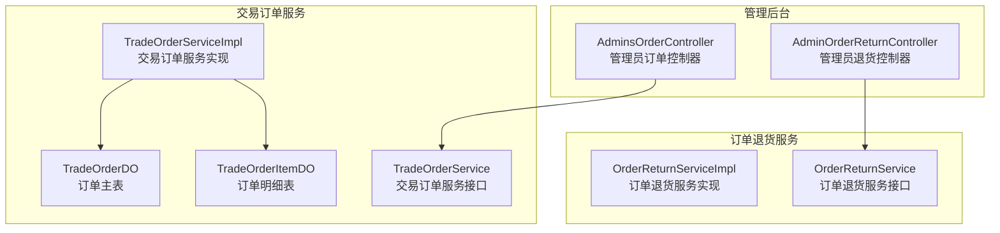
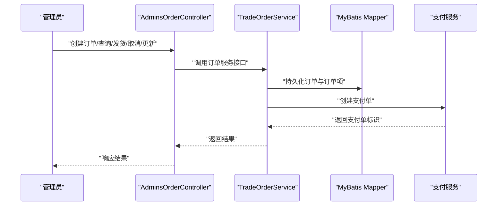
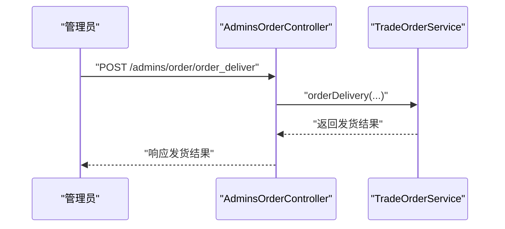
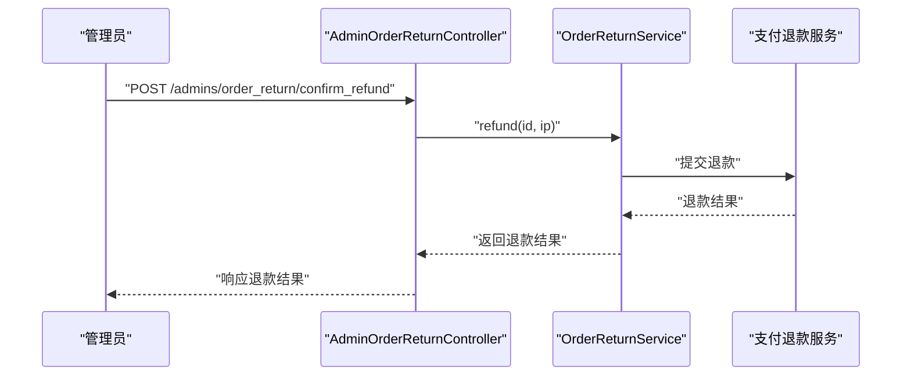
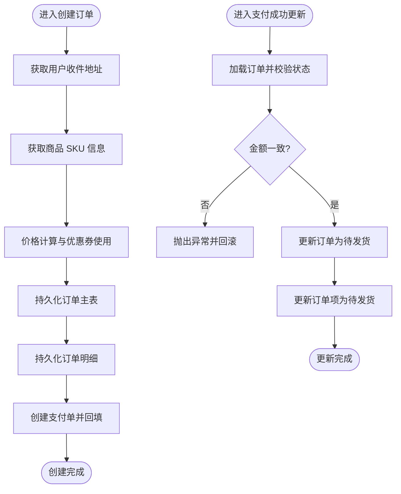
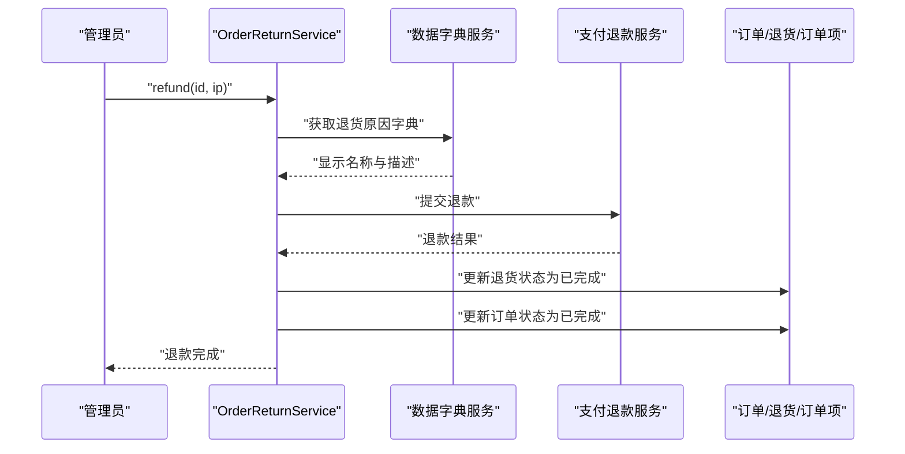
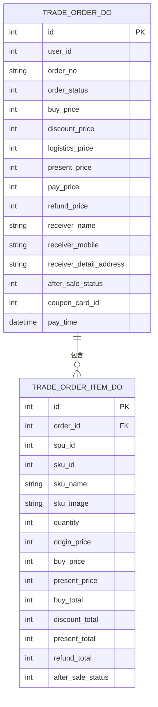
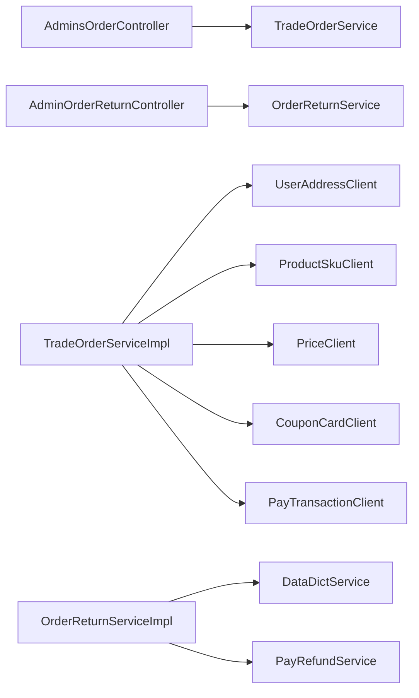
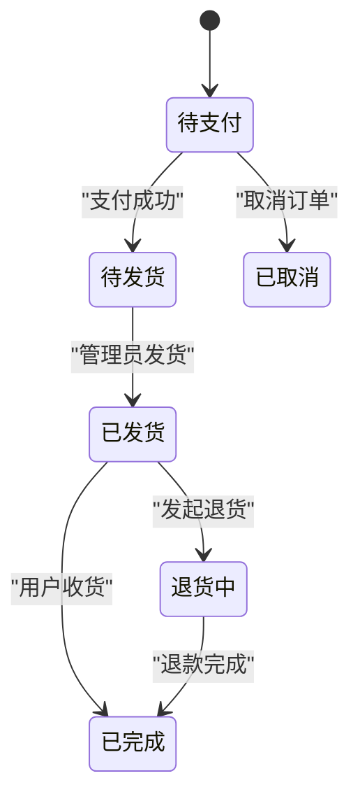

# 订单管理

<cite>
**本文引用的文件**
- [AdminsOrderController.java](file://moved/order/order-rest/src/main/java/cn/iocoder/mall/order/rest/controller/order/AdminsOrderController.java)
- [AdminOrderReturnController.java](file://moved/order/order-rest/src/main/java/cn/iocoder/mall/order/rest/controller/order/AdminOrderReturnController.java)
- [TradeOrderServiceImpl.java](file://trade-service-project/trade-service-app/src/main/java/cn/iocoder/mall/tradeservice/service/order/impl/TradeOrderServiceImpl.java)
- [TradeOrderService.java](file://trade-service-project/trade-service-app/src/main/java/cn/iocoder/mall/tradeservice/service/order/TradeOrderService.java)
- [OrderReturnServiceImpl.java](file://moved/order/order-biz/src/main/java/cn/iocoder/mall/order/biz/service/impl/OrderReturnServiceImpl.java)
- [OrderReturnService.java](file://moved/order/order-biz/src/main/java/cn/iocoder/mall/order/biz/service/OrderReturnService.java)
- [TradeOrderDO.java](file://trade-service-project/trade-service-app/src/main/java/cn/iocoder/mall/tradeservice/dal/mysql/dataobject/order/TradeOrderDO.java)
- [TradeOrderItemDO.java](file://trade-service-project/trade-service-app/src/main/java/cn/iocoder/mall/tradeservice/dal/mysql/dataobject/order/TradeOrderItemDO.java)
</cite>

## 目录
1. [简介](#简介)
2. [项目结构](#项目结构)
3. [核心组件](#核心组件)
4. [架构总览](#架构总览)
5. [详细组件分析](#详细组件分析)
6. [依赖分析](#依赖分析)
7. [性能考虑](#性能考虑)
8. [故障排查指南](#故障排查指南)
9. [结论](#结论)
10. [附录](#附录)

## 简介
本技术文档聚焦于管理后台的订单处理系统，覆盖订单查询、订单状态管理、订单发货、退货处理等核心能力。基于现有代码，管理后台通过 REST 控制器暴露接口，底层由交易订单服务与订单退货服务实现业务逻辑；同时与支付、商品、营销、用户地址等模块存在跨模块协作。

## 项目结构
- 管理后台控制器位于 order-rest 模块，提供管理员端的订单与退货相关接口。
- 交易订单服务位于 trade-service-app 模块，负责订单生命周期的关键操作（创建、支付成功状态更新、分页查询、详情查询）。
- 订单退货服务位于 order-biz 模块，提供退货申请、审核、收货确认、退款等能力。
- 数据模型位于 trade-service-app 的 DAL 层，包含订单主表与订单明细表。

图表来源
- [AdminsOrderController.java:13-16](file://moved/order/order-rest/src/main/java/cn/iocoder/mall/order/rest/controller/order/AdminsOrderController.java#L13-L16)
- [AdminOrderReturnController.java:13-16](file://moved/order/order-rest/src/main/java/cn/iocoder/mall/order/rest/controller/order/AdminOrderReturnController.java#L13-L16)
- [TradeOrderServiceImpl.java:48-49](file://trade-service-project/trade-service-app/src/main/java/cn/iocoder/mall/tradeservice/service/order/impl/TradeOrderServiceImpl.java#L48-L49)
- [TradeOrderService.java:13-48](file://trade-service-project/trade-service-app/src/main/java/cn/iocoder/mall/tradeservice/service/order/TradeOrderService.java#L13-L48)
- [OrderReturnServiceImpl.java:12-14](file://moved/order/order-biz/src/main/java/cn/iocoder/mall/order/biz/service/impl/OrderReturnServiceImpl.java#L12-L14)
- [OrderReturnService.java:9-79](file://moved/order/order-biz/src/main/java/cn/iocoder/mall/order/biz/service/OrderReturnService.java#L9-L79)
- [TradeOrderDO.java](file://trade-service-project/trade-service-app/src/main/java/cn/iocoder/mall/tradeservice/dal/mysql/dataobject/order/TradeOrderDO.java)
- [TradeOrderItemDO.java](file://trade-service-project/trade-service-app/src/main/java/cn/iocoder/mall/tradeservice/dal/mysql/dataobject/order/TradeOrderItemDO.java)

章节来源
- [AdminsOrderController.java:13-83](file://moved/order/order-rest/src/main/java/cn/iocoder/mall/order/rest/controller/order/AdminsOrderController.java#L13-L83)
- [AdminOrderReturnController.java:13-47](file://moved/order/order-rest/src/main/java/cn/iocoder/mall/order/rest/controller/order/AdminOrderReturnController.java#L13-L47)
- [TradeOrderServiceImpl.java:48-279](file://trade-service-project/trade-service-app/src/main/java/cn/iocoder/mall/tradeservice/service/order/impl/TradeOrderServiceImpl.java#L48-L279)
- [TradeOrderService.java:13-48](file://trade-service-project/trade-service-app/src/main/java/cn/iocoder/mall/tradeservice/service/order/TradeOrderService.java#L13-L48)
- [OrderReturnServiceImpl.java:12-235](file://moved/order/order-biz/src/main/java/cn/iocoder/mall/order/biz/service/impl/OrderReturnServiceImpl.java#L12-L235)
- [OrderReturnService.java:9-79](file://moved/order/order-biz/src/main/java/cn/iocoder/mall/order/biz/service/OrderReturnService.java#L9-L79)

## 核心组件
- 管理后台控制器
  - AdminsOrderController：提供订单列表、订单详情、订单发货、备注更新、取消订单、订单项金额与信息更新、物流信息更新等接口占位。
  - AdminOrderReturnController：提供退货列表、同意退货、拒绝退货、确认收货、确认退款等接口占位。
- 交易订单服务
  - TradeOrderService：定义创建交易订单、获取订单详情、分页查询、支付成功状态更新等接口。
  - TradeOrderServiceImpl：实现订单创建（含价格计算、优惠券使用标记、收件信息填充）、支付成功状态更新（校验状态与金额并原子更新）、订单与订单项状态同步。
- 订单退货服务
  - OrderReturnService：定义退货申请、退货信息查询、退货列表、同意/拒绝、确认收货、退款等接口占位。
  - OrderReturnServiceImpl：实现退货申请、审核、收货确认、退款（调用支付退款服务并更新退货与订单状态）等流程占位。

章节来源
- [AdminsOrderController.java:13-83](file://moved/order/order-rest/src/main/java/cn/iocoder/mall/order/rest/controller/order/AdminsOrderController.java#L13-L83)
- [AdminOrderReturnController.java:13-47](file://moved/order/order-rest/src/main/java/cn/iocoder/mall/order/rest/controller/order/AdminOrderReturnController.java#L13-L47)
- [TradeOrderService.java:13-48](file://trade-service-project/trade-service-app/src/main/java/cn/iocoder/mall/tradeservice/service/order/TradeOrderService.java#L13-L48)
- [TradeOrderServiceImpl.java:48-279](file://trade-service-project/trade-service-app/src/main/java/cn/iocoder/mall/tradeservice/service/order/impl/TradeOrderServiceImpl.java#L48-L279)
- [OrderReturnService.java:9-79](file://moved/order/order-biz/src/main/java/cn/iocoder/mall/order/biz/service/OrderReturnService.java#L9-L79)
- [OrderReturnServiceImpl.java:12-235](file://moved/order/order-biz/src/main/java/cn/iocoder/mall/order/biz/service/impl/OrderReturnServiceImpl.java#L12-L235)

## 架构总览
管理后台通过 REST 控制器接收管理员请求，控制器内部通过 RPC/远程引用调用交易订单服务与订单退货服务。交易订单服务在本地事务中完成订单与订单项的持久化，并创建支付单对接支付服务；订单退货服务在退货审核完成后触发支付退款并更新订单状态。

图表来源
- [AdminsOrderController.java:13-83](file://moved/order/order-rest/src/main/java/cn/iocoder/mall/order/rest/controller/order/AdminsOrderController.java#L13-L83)
- [TradeOrderServiceImpl.java:75-108](file://trade-service-project/trade-service-app/src/main/java/cn/iocoder/mall/tradeservice/service/order/impl/TradeOrderServiceImpl.java#L75-L108)
- [TradeOrderService.java:13-48](file://trade-service-project/trade-service-app/src/main/java/cn/iocoder/mall/tradeservice/service/order/TradeOrderService.java#L13-L48)

## 详细组件分析

### 管理后台控制器：AdminsOrderController
- 职责
  - 提供管理员端订单相关接口占位，包括订单分页查询、订单项列表、收件人信息、订单发货、备注更新、取消订单、订单项金额与信息更新、物流信息更新等。
- 设计要点
  - 使用 Spring MVC 注解定义 REST 接口路径与注释。
  - 通过远程引用（Dubbo）调用订单服务，当前代码以注释形式保留，实际运行需启用并配置版本与验证参数。
- 关键流程示意（以“订单发货”为例）

图表来源
- [AdminsOrderController.java:40-44](file://moved/order/order-rest/src/main/java/cn/iocoder/mall/order/rest/controller/order/AdminsOrderController.java#L40-L44)
- [TradeOrderService.java:13-48](file://trade-service-project/trade-service-app/src/main/java/cn/iocoder/mall/tradeservice/service/order/TradeOrderService.java#L13-L48)

章节来源
- [AdminsOrderController.java:13-83](file://moved/order/order-rest/src/main/java/cn/iocoder/mall/order/rest/controller/order/AdminsOrderController.java#L13-L83)

### 管理后台控制器：AdminOrderReturnController
- 职责
  - 提供管理员端退货相关接口占位，包括退货列表、同意退货、拒绝退货、确认收货、确认退款等。
- 设计要点
  - 使用 Spring MVC 注解定义 REST 接口路径与注释。
  - 通过远程引用（Dubbo）调用订单退货服务，当前代码以注释形式保留。
- 关键流程示意（以“确认退款”为例）

图表来源
- [AdminOrderReturnController.java:42-46](file://moved/order/order-rest/src/main/java/cn/iocoder/mall/order/rest/controller/order/AdminOrderReturnController.java#L42-L46)
- [OrderReturnService.java:78-78](file://moved/order/order-biz/src/main/java/cn/iocoder/mall/order/biz/service/OrderReturnService.java#L78-L78)

章节来源
- [AdminOrderReturnController.java:13-47](file://moved/order/order-rest/src/main/java/cn/iocoder/mall/order/rest/controller/order/AdminOrderReturnController.java#L13-L47)

### 交易订单服务：TradeOrderService 与 TradeOrderServiceImpl
- 接口职责
  - 创建交易订单：接收订单创建请求，完成价格计算、优惠券使用标记、收件信息填充、订单与订单项持久化、创建支付单。
  - 获取订单详情：支持按字段集合选择性加载订单项。
  - 分页查询：支持按条件分页返回订单列表及可选的订单项。
  - 支付成功状态更新：校验订单状态与支付金额，原子更新订单与订单项状态。
- 实现要点
  - 订单创建：组装 TradeOrderDO 与 TradeOrderItemDO，写入数据库；随后创建支付单并回填支付单 ID。
  - 支付成功更新：严格的状态校验与金额校验，确保幂等与一致性；更新订单与订单项状态为“待发货”。

图表来源
- [TradeOrderServiceImpl.java:75-108](file://trade-service-project/trade-service-app/src/main/java/cn/iocoder/mall/tradeservice/service/order/impl/TradeOrderServiceImpl.java#L75-L108)
- [TradeOrderServiceImpl.java:244-277](file://trade-service-project/trade-service-app/src/main/java/cn/iocoder/mall/tradeservice/service/order/impl/TradeOrderServiceImpl.java#L244-L277)

章节来源
- [TradeOrderService.java:13-48](file://trade-service-project/trade-service-app/src/main/java/cn/iocoder/mall/tradeservice/service/order/TradeOrderService.java#L13-L48)
- [TradeOrderServiceImpl.java:48-279](file://trade-service-project/trade-service-app/src/main/java/cn/iocoder/mall/tradeservice/service/order/impl/TradeOrderServiceImpl.java#L48-L279)

### 订单退货服务：OrderReturnService 与 OrderReturnServiceImpl
- 接口职责
  - 退货申请：接收退货申请并落库。
  - 退货信息查询：根据订单号查询退货信息与物流信息。
  - 退货列表：按条件分页查询退货记录。
  - 审核：同意/拒绝退货申请。
  - 确认收货：确认退货商品已入库。
  - 退款：调用支付退款服务完成退款并更新退货与订单状态。
- 实现要点
  - 审核与收货确认：更新退货状态与时间戳。
  - 退款流程：根据退货原因字典生成退款描述，调用支付退款服务，成功后更新退货与订单状态为“已完成”。

图表来源
- [OrderReturnServiceImpl.java:172-234](file://moved/order/order-biz/src/main/java/cn/iocoder/mall/order/biz/service/impl/OrderReturnServiceImpl.java#L172-L234)

章节来源
- [OrderReturnService.java:9-79](file://moved/order/order-biz/src/main/java/cn/iocoder/mall/order/biz/service/OrderReturnService.java#L9-L79)
- [OrderReturnServiceImpl.java:12-235](file://moved/order/order-biz/src/main/java/cn/iocoder/mall/order/biz/service/impl/OrderReturnServiceImpl.java#L12-L235)

### 订单与订单项数据模型
- TradeOrderDO：订单主表，包含用户信息、订单号、订单状态、价格与支付信息、收件人信息、售后状态、优惠券信息等。
- TradeOrderItemDO：订单明细表，包含 SPU/SKU 信息、购买数量、原价/现价、优惠金额、应付金额、售后状态等。

图表来源
- [TradeOrderDO.java](file://trade-service-project/trade-service-app/src/main/java/cn/iocoder/mall/tradeservice/dal/mysql/dataobject/order/TradeOrderDO.java)
- [TradeOrderItemDO.java](file://trade-service-project/trade-service-app/src/main/java/cn/iocoder/mall/tradeservice/dal/mysql/dataobject/order/TradeOrderItemDO.java)

章节来源
- [TradeOrderDO.java](file://trade-service-project/trade-service-app/src/main/java/cn/iocoder/mall/tradeservice/dal/mysql/dataobject/order/TradeOrderDO.java)
- [TradeOrderItemDO.java](file://trade-service-project/trade-service-app/src/main/java/cn/iocoder/mall/tradeservice/dal/mysql/dataobject/order/TradeOrderItemDO.java)

## 依赖分析
- 控制器依赖
  - AdminsOrderController 与 AdminOrderReturnController 通过远程引用依赖订单服务与退货服务接口，当前代码以注释形式保留，实际运行需启用并配置版本与验证参数。
- 服务实现依赖
  - TradeOrderServiceImpl 依赖用户地址、商品 SKU、价格计算、优惠券、支付客户端等外部模块，通过 RPC 调用完成跨模块协作。
  - OrderReturnServiceImpl 依赖数据字典与支付退款服务，完成退货审核与退款流程。
- 数据访问依赖
  - 交易订单服务依赖 MyBatis Mapper 进行订单与订单项的持久化。

图表来源
- [AdminsOrderController.java:18-19](file://moved/order/order-rest/src/main/java/cn/iocoder/mall/order/rest/controller/order/AdminsOrderController.java#L18-L19)
- [AdminOrderReturnController.java:18-28](file://moved/order/order-rest/src/main/java/cn/iocoder/mall/order/rest/controller/order/AdminOrderReturnController.java#L18-L28)
- [TradeOrderServiceImpl.java:59-68](file://trade-service-project/trade-service-app/src/main/java/cn/iocoder/mall/tradeservice/service/order/impl/TradeOrderServiceImpl.java#L59-L68)
- [OrderReturnServiceImpl.java:25-28](file://moved/order/order-biz/src/main/java/cn/iocoder/mall/order/biz/service/impl/OrderReturnServiceImpl.java#L25-L28)

章节来源
- [TradeOrderServiceImpl.java:59-68](file://trade-service-project/trade-service-app/src/main/java/cn/iocoder/mall/tradeservice/service/order/impl/TradeOrderServiceImpl.java#L59-L68)
- [OrderReturnServiceImpl.java:25-28](file://moved/order/order-biz/src/main/java/cn/iocoder/mall/order/biz/service/impl/OrderReturnServiceImpl.java#L25-L28)

## 性能考虑
- 分页查询优化
  - 订单分页查询应结合索引与过滤条件，避免全表扫描；仅在需要时加载订单项，减少不必要的 JOIN 或二次查询。
- 价格计算与优惠券
  - 价格计算与优惠券使用建议在批量场景下合并调用，降低 RPC 次数与网络开销。
- 支付单创建
  - 支付单创建与订单状态更新应保持本地事务一致性，避免跨服务的长事务。
- 退货退款
  - 退款流程建议引入幂等设计与重试机制，确保退款状态最终一致。

## 故障排查指南
- 订单创建失败
  - 用户收件地址不存在：检查用户地址 RPC 调用返回值与权限。
  - 商品 SKU 信息不匹配：核对 SKU 数量与价格计算返回数量一致性。
  - 优惠券使用失败：确认优惠券状态与可用性。
- 支付成功状态更新失败
  - 订单不存在或状态非“待支付”：检查订单状态校验逻辑与并发更新。
  - 支付金额不一致：核对前端传入金额与订单应付金额。
- 退货退款失败
  - 退货记录不存在：确认退货 ID 与关联订单 ID。
  - 支付退款接口异常：检查退款描述拼接与支付侧错误码。

章节来源
- [TradeOrderServiceImpl.java:76-100](file://trade-service-project/trade-service-app/src/main/java/cn/iocoder/mall/tradeservice/service/order/impl/TradeOrderServiceImpl.java#L76-L100)
- [TradeOrderServiceImpl.java:244-277](file://trade-service-project/trade-service-app/src/main/java/cn/iocoder/mall/tradeservice/service/order/impl/TradeOrderServiceImpl.java#L244-L277)
- [OrderReturnServiceImpl.java:172-234](file://moved/order/order-biz/src/main/java/cn/iocoder/mall/order/biz/service/impl/OrderReturnServiceImpl.java#L172-L234)

## 结论
管理后台的订单管理功能通过控制器与服务层清晰分离，交易订单服务与订单退货服务分别承担订单生命周期与售后流程的核心逻辑。当前仓库中的控制器接口以注释形式预留，实际业务可通过启用远程引用与完善服务实现来落地。建议在生产环境中强化幂等、重试与监控，确保订单与退款流程的稳定性与一致性。

## 附录
- 订单生命周期（概念）
  - 下单：创建订单并生成支付单。
  - 支付：支付成功后更新订单与订单项状态为“待发货”。
  - 发货：管理员执行发货操作（接口占位）。
  - 收货：用户签收（业务流程）。
  - 退货：用户发起退货，管理员审核、确认收货、退款（接口占位）。
  - 完成：订单状态更新为“已完成”。

