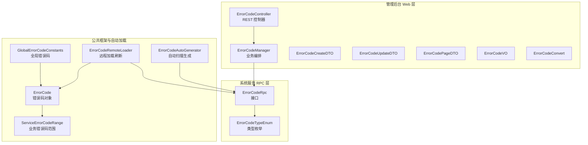
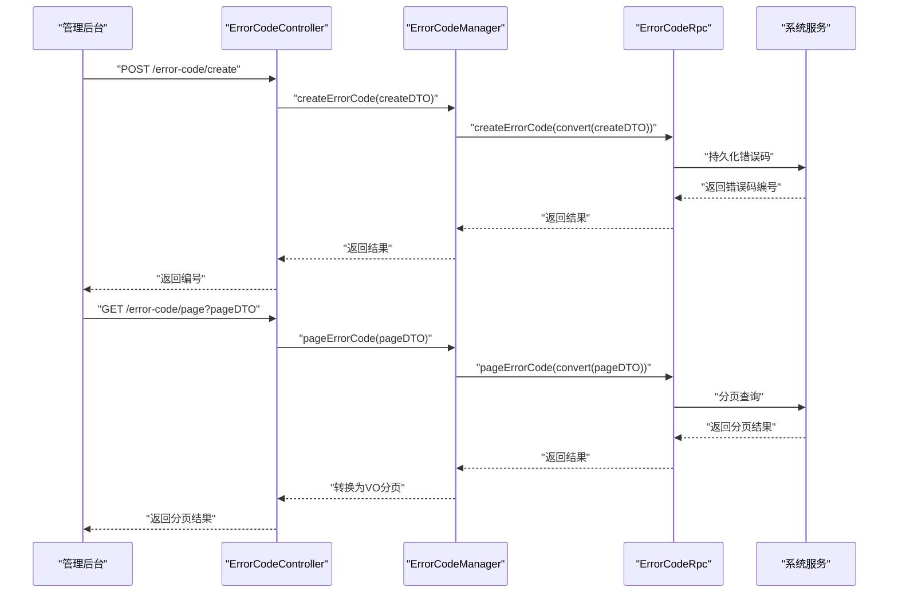
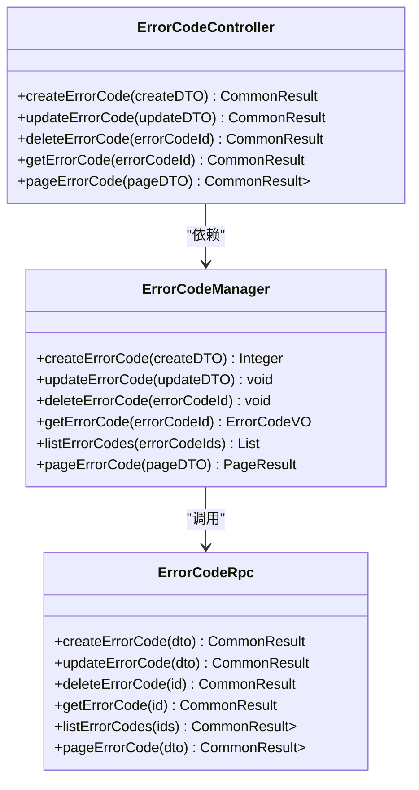
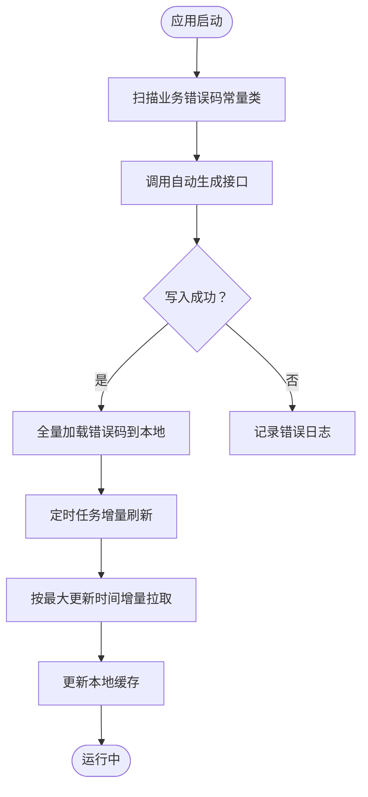
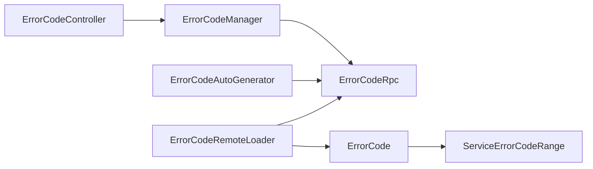

# 错误码管理

<cite>
**本文引用的文件**
- [ErrorCodeController.java](file://management-web-app/src/main/java/cn/iocoder/mall/managementweb/controller/errorcode/ErrorCodeController.java)
- [ErrorCodeManager.java](file://management-web-app/src/main/java/cn/iocoder/mall/managementweb/manager/errorcode/ErrorCodeManager.java)
- [ErrorCodeCreateDTO.java](file://management-web-app/src/main/java/cn/iocoder/mall/managementweb/controller/errorcode/dto/ErrorCodeCreateDTO.java)
- [ErrorCodeUpdateDTO.java](file://management-web-app/src/main/java/cn/iocoder/mall/managementweb/controller/errorcode/dto/ErrorCodeUpdateDTO.java)
- [ErrorCodePageDTO.java](file://management-web-app/src/main/java/cn/iocoder/mall/managementweb/controller/errorcode/dto/ErrorCodePageDTO.java)
- [ErrorCodeVO.java](file://management-web-app/src/main/java/cn/iocoder/mall/managementweb/controller/errorcode/vo/ErrorCodeVO.java)
- [ErrorCodeConvert.java](file://management-web-app/src/main/java/cn/iocoder/mall/managementweb/convert/errorcode/ErrorCodeConvert.java)
- [ErrorCodeRpc.java](file://system-service-project/system-service-api/src/main/java/cn/iocoder/mall/systemservice/rpc/errorcode/ErrorCodeRpc.java)
- [ErrorCodeTypeEnum.java](file://system-service-project/system-service-api/src/main/java/cn/iocoder/mall/systemservice/enums/errorcode/ErrorCodeTypeEnum.java)
- [ErrorCodeAutoGenerator.java](file://common/mall-spring-boot-starter-system-error-code/src/main/java/cn/iocoder/mall/system/errorcode/core/ErrorCodeAutoGenerator.java)
- [ErrorCodeRemoteLoader.java](file://common/mall-spring-boot-starter-system-error-code/src/main/java/cn/iocoder/mall/system/errorcode/core/ErrorCodeRemoteLoader.java)
- [ErrorCode.java](file://common/common-framework/src/main/java/cn/iocoder/common/framework/exception/ErrorCode.java)
- [ServiceErrorCodeRange.java](file://common/common-framework/src/main/java/cn/iocoder/common/framework/exception/enums/ServiceErrorCodeRange.java)
- [GlobalErrorCodeConstants.java](file://common/common-framework/src/main/java/cn/iocoder/common/framework/exception/enums/GlobalErrorCodeConstants.java)
- [SystemErrorCodeConstants.java](file://system-service-project/system-service-api/src/main/java/cn/iocoder/mall/systemservice/enums/SystemErrorCodeConstants.java)
- [UserErrorCodeConstants.java](file://user-service-project/user-service-api/src/main/java/cn/iocoder/mall/userservice/enums/UserErrorCodeConstants.java)
- [ProductErrorCodeConstants.java](file://product-service-project/product-service-api/src/main/java/cn/iocoder/mall/productservice/enums/ProductErrorCodeConstants.java)
- [PromotionErrorCodeConstants.java](file://promotion-service-project/promotion-service-api/src/main/java/cn/iocoder/mall/promotion/api/enums/PromotionErrorCodeConstants.java)
- [PayErrorCodeConstants.java](file://pay-service-project/pay-service-api/src/main/java/cn/iocoder/mall/payservice/enums/PayErrorCodeConstants.java)
- [OrderErrorCodeConstants.java](file://trade-service-project/trade-service-api/src/main/java/cn/iocoder/mall/tradeservice/enums/OrderErrorCodeConstants.java)
- [ShopWebErrorCodeConstants.java](file://shop-web-app/src/main/java/cn/iocoder/mall/shopweb/enums/ShopWebErrorCodeConstants.java)
</cite>

## 目录
1. [简介](#简介)
2. [项目结构](#项目结构)
3. [核心组件](#核心组件)
4. [架构总览](#架构总览)
5. [详细组件分析](#详细组件分析)
6. [依赖分析](#依赖分析)
7. [性能考虑](#性能考虑)
8. [故障排查指南](#故障排查指南)
9. [结论](#结论)
10. [附录](#附录)

## 简介
本技术文档围绕管理后台的错误码管理系统展开，系统覆盖错误码的定义、维护、查询、版本管理、自动同步与远程加载、国际化支持与使用方式等。重点解析 ErrorCodeController 的实现，包括错误码列表查询、详情查看、新增与修改、删除、分页查询等能力；并阐述错误码的命名规范与分类体系（业务错误码、系统错误码、第三方错误码），以及与国际化的关系、在系统中的使用方式（异常处理、错误提示、日志记录）与标准流程与最佳实践。

## 项目结构
错误码管理涉及三层：
- 管理后台 Web 层：提供错误码的增删改查与分页查询接口
- 系统服务 RPC 层：提供错误码的持久化与查询能力
- 公共框架与自动加载模块：负责错误码常量扫描、自动写入与运行时远程加载

图表来源
- [ErrorCodeController.java:25-73](file://management-web-app/src/main/java/cn/iocoder/mall/managementweb/controller/errorcode/ErrorCodeController.java#L25-L73)
- [ErrorCodeManager.java:20-97](file://management-web-app/src/main/java/cn/iocoder/mall/managementweb/manager/errorcode/ErrorCodeManager.java#L20-L97)
- [ErrorCodeRpc.java:15-80](file://system-service-project/system-service-api/src/main/java/cn/iocoder/mall/systemservice/rpc/errorcode/ErrorCodeRpc.java#L15-L80)
- [ErrorCodeAutoGenerator.java:19-84](file://common/mall-spring-boot-starter-system-error-code/src/main/java/cn/iocoder/mall/system/errorcode/core/ErrorCodeAutoGenerator.java#L19-L84)
- [ErrorCodeRemoteLoader.java:19-71](file://common/mall-spring-boot-starter-system-error-code/src/main/java/cn/iocoder/mall/system/errorcode/core/ErrorCodeRemoteLoader.java#L19-L71)
- [ErrorCode.java:13-37](file://common/common-framework/src/main/java/cn/iocoder/common/framework/exception/ErrorCode.java#L13-L37)

章节来源
- [ErrorCodeController.java:25-73](file://management-web-app/src/main/java/cn/iocoder/mall/managementweb/controller/errorcode/ErrorCodeController.java#L25-L73)
- [ErrorCodeManager.java:20-97](file://management-web-app/src/main/java/cn/iocoder/mall/managementweb/manager/errorcode/ErrorCodeManager.java#L20-L97)
- [ErrorCodeRpc.java:15-80](file://system-service-project/system-service-api/src/main/java/cn/iocoder/mall/systemservice/rpc/errorcode/ErrorCodeRpc.java#L15-L80)
- [ErrorCodeAutoGenerator.java:19-84](file://common/mall-spring-boot-starter-system-error-code/src/main/java/cn/iocoder/mall/system/errorcode/core/ErrorCodeAutoGenerator.java#L19-L84)
- [ErrorCodeRemoteLoader.java:19-71](file://common/mall-spring-boot-starter-system-error-code/src/main/java/cn/iocoder/mall/system/errorcode/core/ErrorCodeRemoteLoader.java#L19-L71)
- [ErrorCode.java:13-37](file://common/common-framework/src/main/java/cn/iocoder/common/framework/exception/ErrorCode.java#L13-L37)

## 核心组件
- 管理后台控制器：提供错误码的创建、更新、删除、详情查询、分页查询等接口，权限控制基于注解
- 管理后台 Manager：封装对系统服务 RPC 的调用，统一错误检查与转换
- DTO/VO/Convert：数据传输与视图模型映射，确保前后端交互一致
- 系统服务 RPC 接口：提供错误码的增删改查、分页、自动同步、按分组与增量拉取
- 自动扫描与远程加载：自动扫描各业务模块的错误码常量类，写入系统服务；应用启动后全量加载，定时增量刷新

章节来源
- [ErrorCodeController.java:34-71](file://management-web-app/src/main/java/cn/iocoder/mall/managementweb/controller/errorcode/ErrorCodeController.java#L34-L71)
- [ErrorCodeManager.java:32-95](file://management-web-app/src/main/java/cn/iocoder/mall/managementweb/manager/errorcode/ErrorCodeManager.java#L32-L95)
- [ErrorCodeRpc.java:40-78](file://system-service-project/system-service-api/src/main/java/cn/iocoder/mall/systemservice/rpc/errorcode/ErrorCodeRpc.java#L40-L78)
- [ErrorCodeAutoGenerator.java:44-82](file://common/mall-spring-boot-starter-system-error-code/src/main/java/cn/iocoder/mall/system/errorcode/core/ErrorCodeAutoGenerator.java#L44-L82)
- [ErrorCodeRemoteLoader.java:39-69](file://common/mall-spring-boot-starter-system-error-code/src/main/java/cn/iocoder/mall/system/errorcode/core/ErrorCodeRemoteLoader.java#L39-L69)

## 架构总览
管理后台通过 ErrorCodeController 接收请求，交由 ErrorCodeManager 编排，最终调用系统服务的 ErrorCodeRpc 完成持久化与查询。系统服务侧负责错误码的存储、类型管理与分组策略；公共模块负责自动扫描与远程加载，确保运行时错误码可用。

图表来源
- [ErrorCodeController.java:34-71](file://management-web-app/src/main/java/cn/iocoder/mall/managementweb/controller/errorcode/ErrorCodeController.java#L34-L71)
- [ErrorCodeManager.java:32-95](file://management-web-app/src/main/java/cn/iocoder/mall/managementweb/manager/errorcode/ErrorCodeManager.java#L32-L95)
- [ErrorCodeRpc.java:40-78](file://system-service-project/system-service-api/src/main/java/cn/iocoder/mall/systemservice/rpc/errorcode/ErrorCodeRpc.java#L40-L78)

## 详细组件分析

### ErrorCodeController 实现
- 接口职责
  - 创建错误码：接收 ErrorCodeCreateDTO，调用 Manager 完成创建
  - 更新错误码：接收 ErrorCodeUpdateDTO，调用 Manager 完成更新
  - 删除错误码：接收错误码编号，调用 Manager 完成删除
  - 获取错误码详情：根据编号查询并返回 ErrorCodeVO
  - 分页查询：接收 ErrorCodePageDTO，返回分页结果
- 权限控制：所有接口均标注所需权限，防止越权访问
- 数据校验：使用 JSR-303 注解对输入参数进行基础校验

图表来源
- [ErrorCodeController.java:25-73](file://management-web-app/src/main/java/cn/iocoder/mall/managementweb/controller/errorcode/ErrorCodeController.java#L25-L73)
- [ErrorCodeManager.java:20-97](file://management-web-app/src/main/java/cn/iocoder/mall/managementweb/manager/errorcode/ErrorCodeManager.java#L20-L97)
- [ErrorCodeRpc.java:15-80](file://system-service-project/system-service-api/src/main/java/cn/iocoder/mall/systemservice/rpc/errorcode/ErrorCodeRpc.java#L15-L80)

章节来源
- [ErrorCodeController.java:34-71](file://management-web-app/src/main/java/cn/iocoder/mall/managementweb/controller/errorcode/ErrorCodeController.java#L34-L71)
- [ErrorCodeCreateDTO.java:12-26](file://management-web-app/src/main/java/cn/iocoder/mall/managementweb/controller/errorcode/dto/ErrorCodeCreateDTO.java#L12-L26)
- [ErrorCodeUpdateDTO.java:12-29](file://management-web-app/src/main/java/cn/iocoder/mall/managementweb/controller/errorcode/dto/ErrorCodeUpdateDTO.java#L12-L29)
- [ErrorCodePageDTO.java:12-21](file://management-web-app/src/main/java/cn/iocoder/mall/managementweb/controller/errorcode/dto/ErrorCodePageDTO.java#L12-L21)
- [ErrorCodeVO.java:11-28](file://management-web-app/src/main/java/cn/iocoder/mall/managementweb/controller/errorcode/vo/ErrorCodeVO.java#L11-L28)

### ErrorCodeManager 编排逻辑
- 统一调用系统服务的 ErrorCodeRpc，完成错误码的创建、更新、删除、查询与分页
- 在调用前后进行错误检查，确保异常可捕获与传播
- 使用 Convert 将前端 DTO 与系统服务 VO 进行双向转换
- 对类型字段进行设置，区分“自动生成”与“手动操作”

章节来源
- [ErrorCodeManager.java:32-95](file://management-web-app/src/main/java/cn/iocoder/mall/managementweb/manager/errorcode/ErrorCodeManager.java#L32-L95)
- [ErrorCodeConvert.java:13-30](file://management-web-app/src/main/java/cn/iocoder/mall/managementweb/convert/errorcode/ErrorCodeConvert.java#L13-L30)
- [ErrorCodeTypeEnum.java:15-43](file://system-service-project/system-service-api/src/main/java/cn/iocoder/mall/systemservice/enums/errorcode/ErrorCodeTypeEnum.java#L15-L43)

### 系统服务 RPC 接口
- 提供错误码的增删改查、分页、按分组与最小更新时间增量拉取
- 支持批量自动生成错误码，便于从各业务常量类自动注入系统

章节来源
- [ErrorCodeRpc.java:15-80](file://system-service-project/system-service-api/src/main/java/cn/iocoder/mall/systemservice/rpc/errorcode/ErrorCodeRpc.java#L15-L80)

### 自动扫描与远程加载
- 自动扫描：启动时扫描业务模块的错误码常量类，将错误码写入系统服务，标记为“自动生成”
- 远程加载：应用启动后全量加载错误码到本地缓存，定时任务增量刷新，保证运行时一致性

图表来源
- [ErrorCodeAutoGenerator.java:44-82](file://common/mall-spring-boot-starter-system-error-code/src/main/java/cn/iocoder/mall/system/errorcode/core/ErrorCodeAutoGenerator.java#L44-L82)
- [ErrorCodeRemoteLoader.java:39-69](file://common/mall-spring-boot-starter-system-error-code/src/main/java/cn/iocoder/mall/system/errorcode/core/ErrorCodeRemoteLoader.java#L39-L69)

章节来源
- [ErrorCodeAutoGenerator.java:44-82](file://common/mall-spring-boot-starter-system-error-code/src/main/java/cn/iocoder/mall/system/errorcode/core/ErrorCodeAutoGenerator.java#L44-L82)
- [ErrorCodeRemoteLoader.java:39-69](file://common/mall-spring-boot-starter-system-error-code/src/main/java/cn/iocoder/mall/system/errorcode/core/ErrorCodeRemoteLoader.java#L39-L69)

### 错误码对象与范围
- 错误码对象包含 code 与 message，为国际化预留扩展空间
- 业务错误码范围与全局错误码范围划分清晰，便于统一管理与分配

章节来源
- [ErrorCode.java:13-37](file://common/common-framework/src/main/java/cn/iocoder/common/framework/exception/ErrorCode.java#L13-L37)
- [ServiceErrorCodeRange.java](file://common/common-framework/src/main/java/cn/iocoder/common/framework/exception/enums/ServiceErrorCodeRange.java)
- [GlobalErrorCodeConstants.java](file://common/common-framework/src/main/java/cn/iocoder/common/framework/exception/enums/GlobalErrorCodeConstants.java)

### 业务模块错误码常量
- 各业务模块提供错误码常量类，用于自动扫描与生成
- 常见模块：系统服务、用户服务、商品服务、促销服务、支付服务、交易服务、商城 Web 等

章节来源
- [SystemErrorCodeConstants.java](file://system-service-project/system-service-api/src/main/java/cn/iocoder/mall/systemservice/enums/SystemErrorCodeConstants.java)
- [UserErrorCodeConstants.java](file://user-service-project/user-service-api/src/main/java/cn/iocoder/mall/userservice/enums/UserErrorCodeConstants.java)
- [ProductErrorCodeConstants.java](file://product-service-project/product-service-api/src/main/java/cn/iocoder/mall/productservice/enums/ProductErrorCodeConstants.java)
- [PromotionErrorCodeConstants.java](file://promotion-service-project/promotion-service-api/src/main/java/cn/iocoder/mall/promotion/api/enums/PromotionErrorCodeConstants.java)
- [PayErrorCodeConstants.java](file://pay-service-project/pay-service-api/src/main/java/cn/iocoder/mall/payservice/enums/PayErrorCodeConstants.java)
- [OrderErrorCodeConstants.java](file://trade-service-project/trade-service-api/src/main/java/cn/iocoder/mall/tradeservice/enums/OrderErrorCodeConstants.java)
- [ShopWebErrorCodeConstants.java](file://shop-web-app/src/main/java/cn/iocoder/mall/shopweb/enums/ShopWebErrorCodeConstants.java)

## 依赖分析
- 控制器依赖 Manager，Manager 依赖系统服务 RPC，形成清晰的分层
- 自动扫描与远程加载模块依赖系统服务 RPC，实现错误码的自动注入与运行时加载
- 错误码对象与范围定义位于公共框架，被各模块共享

图表来源
- [ErrorCodeController.java:25-73](file://management-web-app/src/main/java/cn/iocoder/mall/managementweb/controller/errorcode/ErrorCodeController.java#L25-L73)
- [ErrorCodeManager.java:20-97](file://management-web-app/src/main/java/cn/iocoder/mall/managementweb/manager/errorcode/ErrorCodeManager.java#L20-L97)
- [ErrorCodeRpc.java:15-80](file://system-service-project/system-service-api/src/main/java/cn/iocoder/mall/systemservice/rpc/errorcode/ErrorCodeRpc.java#L15-L80)
- [ErrorCodeAutoGenerator.java:19-84](file://common/mall-spring-boot-starter-system-error-code/src/main/java/cn/iocoder/mall/system/errorcode/core/ErrorCodeAutoGenerator.java#L19-L84)
- [ErrorCodeRemoteLoader.java:19-71](file://common/mall-spring-boot-starter-system-error-code/src/main/java/cn/iocoder/mall/system/errorcode/core/ErrorCodeRemoteLoader.java#L19-L71)
- [ErrorCode.java:13-37](file://common/common-framework/src/main/java/cn/iocoder/common/framework/exception/ErrorCode.java#L13-L37)
- [ServiceErrorCodeRange.java](file://common/common-framework/src/main/java/cn/iocoder/common/framework/exception/enums/ServiceErrorCodeRange.java)

章节来源
- [ErrorCodeController.java:25-73](file://management-web-app/src/main/java/cn/iocoder/mall/managementweb/controller/errorcode/ErrorCodeController.java#L25-L73)
- [ErrorCodeManager.java:20-97](file://management-web-app/src/main/java/cn/iocoder/mall/managementweb/manager/errorcode/ErrorCodeManager.java#L20-L97)
- [ErrorCodeRpc.java:15-80](file://system-service-project/system-service-api/src/main/java/cn/iocoder/mall/systemservice/rpc/errorcode/ErrorCodeRpc.java#L15-L80)
- [ErrorCodeAutoGenerator.java:19-84](file://common/mall-spring-boot-starter-system-error-code/src/main/java/cn/iocoder/mall/system/errorcode/core/ErrorCodeAutoGenerator.java#L19-L84)
- [ErrorCodeRemoteLoader.java:19-71](file://common/mall-spring-boot-starter-system-error-code/src/main/java/cn/iocoder/mall/system/errorcode/core/ErrorCodeRemoteLoader.java#L19-L71)
- [ErrorCode.java:13-37](file://common/common-framework/src/main/java/cn/iocoder/common/framework/exception/ErrorCode.java#L13-L37)
- [ServiceErrorCodeRange.java](file://common/common-framework/src/main/java/cn/iocoder/common/framework/exception/enums/ServiceErrorCodeRange.java)

## 性能考虑
- 自动扫描采用异步执行，避免阻塞应用启动主流程
- 远程加载采用定时任务增量刷新，减少网络与数据库压力
- 分页查询与按分组拉取支持大体量数据的高效检索
- 建议：在高并发场景下，结合缓存与限流策略，确保接口稳定性

## 故障排查指南
- 权限不足：接口标注了权限注解，若返回无权限，请确认账号权限配置
- 参数校验失败：检查 DTO 字段是否符合要求（如空值、格式）
- RPC 调用失败：关注 Manager 中的错误检查与日志输出，定位系统服务异常
- 自动扫描未生效：确认配置项与常量类路径正确，检查扫描线程日志
- 运行时错误码缺失：确认远程加载已执行且定时刷新正常

章节来源
- [ErrorCodeController.java:34-71](file://management-web-app/src/main/java/cn/iocoder/mall/managementweb/controller/errorcode/ErrorCodeController.java#L34-L71)
- [ErrorCodeManager.java:32-95](file://management-web-app/src/main/java/cn/iocoder/mall/managementweb/manager/errorcode/ErrorCodeManager.java#L32-L95)
- [ErrorCodeAutoGenerator.java:44-82](file://common/mall-spring-boot-starter-system-error-code/src/main/java/cn/iocoder/mall/system/errorcode/core/ErrorCodeAutoGenerator.java#L44-L82)
- [ErrorCodeRemoteLoader.java:39-69](file://common/mall-spring-boot-starter-system-error-code/src/main/java/cn/iocoder/mall/system/errorcode/core/ErrorCodeRemoteLoader.java#L39-L69)

## 结论
本错误码管理体系通过清晰的分层设计与自动化的扫描、加载机制，实现了错误码的集中管理与高效使用。管理后台提供完善的 CRUD 与分页能力，系统服务负责持久化与分发，公共模块保障运行时一致性。配合明确的命名规范与分类体系，能够有效支撑多语言与多业务场景下的错误提示与异常处理。

## 附录

### 错误码命名规范与分类体系
- 命名规范
  - 采用“模块前缀 + 语义化标识 + 数字序号”的组合，确保唯一性与可读性
  - 数字序号建议按功能域分段，便于维护与扩展
- 分类体系
  - 业务错误码：模块内业务规则导致的错误，通常以模块前缀区分
  - 系统错误码：通用系统级错误，如参数校验、资源不存在等
  - 第三方错误码：对接外部系统产生的错误，需单独分组与标识
- 类型标记
  - 自动生成：来源于业务常量类的自动扫描
  - 手动操作：经管理员手动编辑，禁止自动同步

章节来源
- [ErrorCodeTypeEnum.java:15-43](file://system-service-project/system-service-api/src/main/java/cn/iocoder/mall/systemservice/enums/errorcode/ErrorCodeTypeEnum.java#L15-L43)
- [ErrorCodeAutoGenerator.java:44-82](file://common/mall-spring-boot-starter-system-error-code/src/main/java/cn/iocoder/mall/system/errorcode/core/ErrorCodeAutoGenerator.java#L44-L82)

### 国际化与错误提示
- 错误码对象预留国际化字段，未来可扩展多语言错误信息
- 远程加载模块将错误码写入本地缓存，便于后续国际化框架集成

章节来源
- [ErrorCode.java:11-12](file://common/common-framework/src/main/java/cn/iocoder/common/framework/exception/ErrorCode.java#L11-L12)
- [ErrorCodeRemoteLoader.java:42-69](file://common/mall-spring-boot-starter-system-error-code/src/main/java/cn/iocoder/mall/system/errorcode/core/ErrorCodeRemoteLoader.java#L42-L69)

### 使用方式与最佳实践
- 异常处理：在业务层抛出带错误码的异常，统一由异常处理器转换为对外响应
- 错误提示：优先使用系统服务中的错误码消息，必要时支持动态替换
- 日志记录：记录错误码与上下文信息，便于问题追踪与审计
- 标准流程
  - 新增：在业务模块常量类中定义，等待自动扫描或手动创建
  - 维护：管理员在后台调整错误提示与分组，锁定类型避免被自动同步覆盖
  - 查询：通过分页与条件过滤快速定位错误码
  - 导入导出：建议通过系统服务提供的分组与增量接口实现批量迁移

章节来源
- [ErrorCodeController.java:34-71](file://management-web-app/src/main/java/cn/iocoder/mall/managementweb/controller/errorcode/ErrorCodeController.java#L34-L71)
- [ErrorCodeManager.java:32-95](file://management-web-app/src/main/java/cn/iocoder/mall/managementweb/manager/errorcode/ErrorCodeManager.java#L32-L95)
- [ErrorCodeRpc.java:18-25](file://system-service-project/system-service-api/src/main/java/cn/iocoder/mall/systemservice/rpc/errorcode/ErrorCodeRpc.java#L18-L25)