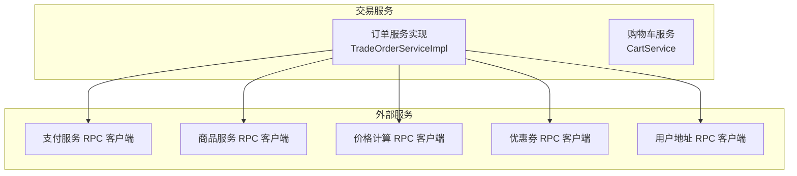
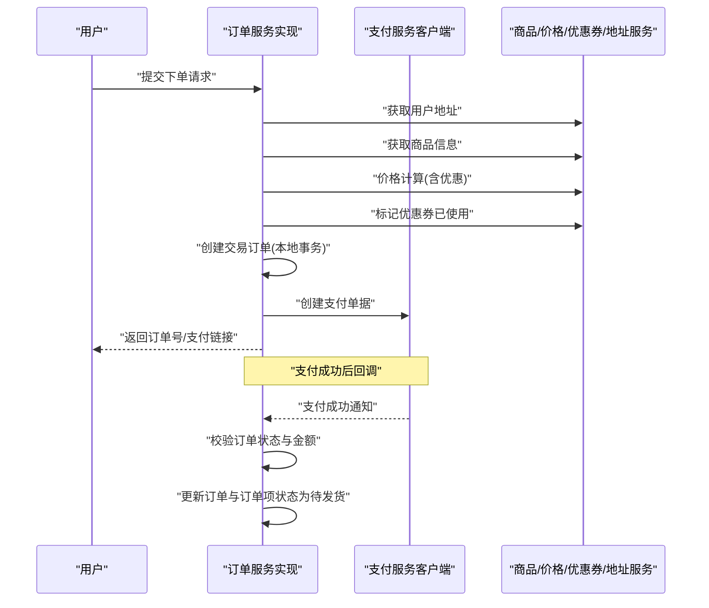
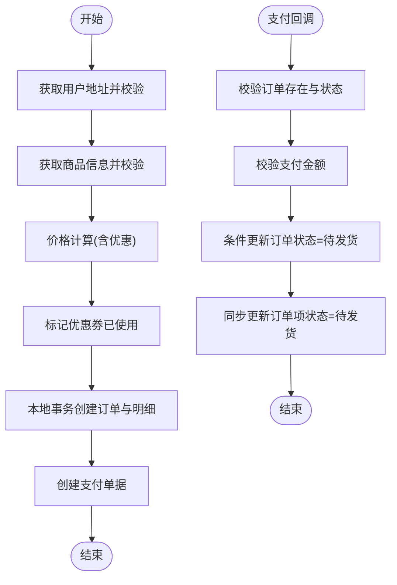
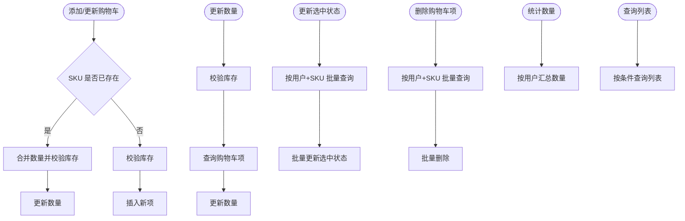
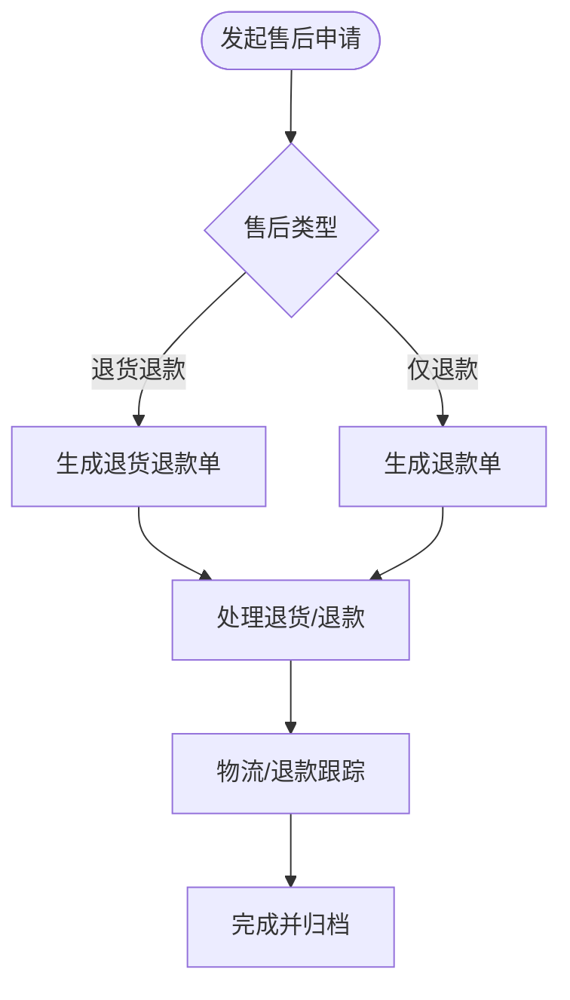
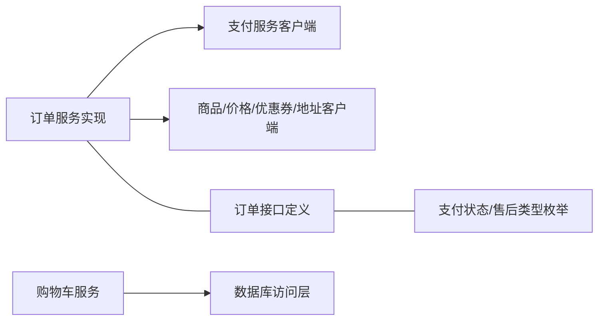

# 交易服务模块

<cite>
**本文引用的文件**
- [TradeOrderServiceImpl.java](file://trade-service-project/trade-service-app/src/main/java/cn/iocoder/mall/tradeservice/service/order/impl/TradeOrderServiceImpl.java)
- [CartService.java](file://trade-service-project/trade-service-app/src/main/java/cn/iocoder/mall/tradeservice/service/cart/CartService.java)
- [OrderService.java](file://moved/order/order-service-api02/src/main/java/cn/iocoder/mall/order/api/OrderService.java)
- [OrderPayStatus.java](file://moved/order/order-service-api02/src/main/java/cn/iocoder/mall/order/api/constant/OrderPayStatus.java)
- [OrderReturnServiceTypeEnum.java](file://moved/order/order-service-api02/src/main/java/cn/iocoder/mall/order/api/constant/OrderReturnServiceTypeEnum.java)
- [OrderItemUpdateDTO.java](file://moved/order/order-service-api02/src/main/java/cn/iocoder/mall/order/api/dto/OrderItemUpdateDTO.java)
- [OrderDeliveryDTO.java](file://moved/order/order-service-api02/src/main/java/cn/iocoder/mall/order/api/dto/OrderDeliveryDTO.java)
</cite>

## 目录
1. [简介](#简介)
2. [项目结构](#项目结构)
3. [核心组件](#核心组件)
4. [架构总览](#架构总览)
5. [详细组件分析](#详细组件分析)
6. [依赖分析](#依赖分析)
7. [性能考虑](#性能考虑)
8. [故障排查指南](#故障排查指南)
9. [结论](#结论)
10. [附录](#附录)

## 简介
本技术文档围绕交易服务模块，系统性梳理订单管理全生命周期、购物车功能、售后管理机制、订单状态机设计与并发控制、以及与支付、物流、短信等外部系统的集成方式。文档同时提供业务流程图与状态图，帮助读者快速理解各环节的触发条件与处理逻辑，并给出性能优化与高并发处理建议。

## 项目结构
交易服务模块主要由以下子模块构成：
- 订单服务：负责订单创建、支付回调、发货、收货确认、分页查询等核心能力
- 购物车服务：负责购物车项的增删改查、数量变更、价格计算、优惠应用
- 订单接口定义：提供统一的订单服务 RPC 接口与常量枚举
- 外部系统集成：通过 RPC 客户端对接支付、商品、价格、优惠券、用户地址等服务

图表来源
- [TradeOrderServiceImpl.java:75-108](file://trade-service-project/trade-service-app/src/main/java/cn/iocoder/mall/tradeservice/service/order/impl/TradeOrderServiceImpl.java#L75-L108)
- [CartService.java:38-57](file://trade-service-project/trade-service-app/src/main/java/cn/iocoder/mall/tradeservice/service/cart/CartService.java#L38-L57)

章节来源
- [TradeOrderServiceImpl.java:75-108](file://trade-service-project/trade-service-app/src/main/java/cn/iocoder/mall/tradeservice/service/order/impl/TradeOrderServiceImpl.java#L75-L108)
- [CartService.java:38-57](file://trade-service-project/trade-service-app/src/main/java/cn/iocoder/mall/tradeservice/service/cart/CartService.java#L38-L57)

## 核心组件
- 订单服务实现：负责订单创建、支付成功状态更新、分页查询、详情加载等
- 购物车服务：负责购物车项的新增、数量更新、选中状态切换、批量删除、统计与查询
- 订单接口与常量：提供统一的订单服务 RPC 接口与支付状态、售后类型等枚举
- DTO 定义：订单项更新、发货等请求参数的数据传输对象

章节来源
- [TradeOrderServiceImpl.java:75-280](file://trade-service-project/trade-service-app/src/main/java/cn/iocoder/mall/tradeservice/service/order/impl/TradeOrderServiceImpl.java#L75-L280)
- [CartService.java:38-137](file://trade-service-project/trade-service-app/src/main/java/cn/iocoder/mall/tradeservice/service/cart/CartService.java#L38-L137)
- [OrderService.java:15-131](file://moved/order/order-service-api02/src/main/java/cn/iocoder/mall/order/api/OrderService.java#L15-L131)
- [OrderPayStatus.java:9-35](file://moved/order/order-service-api02/src/main/java/cn/iocoder/mall/order/api/constant/OrderPayStatus.java#L9-L35)
- [OrderReturnServiceTypeEnum.java:9-37](file://moved/order/order-service-api02/src/main/java/cn/iocoder/mall/order/api/constant/OrderReturnServiceTypeEnum.java#L9-L37)
- [OrderItemUpdateDTO.java:15-41](file://moved/order/order-service-api02/src/main/java/cn/iocoder/mall/order/api/dto/OrderItemUpdateDTO.java#L15-L41)
- [OrderDeliveryDTO.java:15-42](file://moved/order/order-service-api02/src/main/java/cn/iocoder/mall/order/api/dto/OrderDeliveryDTO.java#L15-L42)

## 架构总览
交易服务采用“服务化 + RPC”的架构，订单服务通过 RPC 客户端调用支付、商品、价格、优惠券、用户地址等服务，形成清晰的边界与职责分离。订单创建流程中，先获取用户地址与商品信息，再进行价格计算与优惠券使用标记，随后创建交易订单并生成支付单据；支付成功回调后，订单状态从“待支付”迁移到“待发货”。

图表来源
- [TradeOrderServiceImpl.java:75-108](file://trade-service-project/trade-service-app/src/main/java/cn/iocoder/mall/tradeservice/service/order/impl/TradeOrderServiceImpl.java#L75-L108)
- [TradeOrderServiceImpl.java:168-184](file://trade-service-project/trade-service-app/src/main/java/cn/iocoder/mall/tradeservice/service/order/impl/TradeOrderServiceImpl.java#L168-L184)
- [TradeOrderServiceImpl.java:244-277](file://trade-service-project/trade-service-app/src/main/java/cn/iocoder/mall/tradeservice/service/order/impl/TradeOrderServiceImpl.java#L244-L277)

## 详细组件分析

### 订单服务实现（TradeOrderServiceImpl）
- 订单创建流程
  - 获取用户地址并校验
  - 拉取商品信息并校验数量
  - 调用价格计算服务，支持优惠券
  - 标记优惠券已使用
  - 本地事务内创建交易订单与订单明细
  - 创建支付单据并回写支付单 ID
- 支付成功处理
  - 校验订单存在性、状态必须为“待支付”
  - 校验支付金额与应付金额一致
  - 使用“状态字段 + 条件更新”确保幂等与一致性
  - 同步更新订单项状态为“待发货”

图表来源
- [TradeOrderServiceImpl.java:75-108](file://trade-service-project/trade-service-app/src/main/java/cn/iocoder/mall/tradeservice/service/order/impl/TradeOrderServiceImpl.java#L75-L108)
- [TradeOrderServiceImpl.java:168-184](file://trade-service-project/trade-service-app/src/main/java/cn/iocoder/mall/tradeservice/service/order/impl/TradeOrderServiceImpl.java#L168-L184)
- [TradeOrderServiceImpl.java:244-277](file://trade-service-project/trade-service-app/src/main/java/cn/iocoder/mall/tradeservice/service/order/impl/TradeOrderServiceImpl.java#L244-L277)

章节来源
- [TradeOrderServiceImpl.java:75-280](file://trade-service-project/trade-service-app/src/main/java/cn/iocoder/mall/tradeservice/service/order/impl/TradeOrderServiceImpl.java#L75-L280)

### 购物车服务（CartService）
- 新增购物车项
  - 若 SKU 已存在则合并数量并校验库存
  - 若不存在则插入新项并校验库存
- 更新数量
  - 校验库存上限，查询并更新数量
- 更新选中状态
  - 批量更新指定 SKU 的选中状态
- 删除购物车项
  - 批量删除指定 SKU 的购物车项
- 统计与查询
  - 统计用户购物车商品总数
  - 按条件查询购物车列表

图表来源
- [CartService.java:38-57](file://trade-service-project/trade-service-app/src/main/java/cn/iocoder/mall/tradeservice/service/cart/CartService.java#L38-L57)
- [CartService.java:67-79](file://trade-service-project/trade-service-app/src/main/java/cn/iocoder/mall/tradeservice/service/cart/CartService.java#L67-L79)
- [CartService.java:88-97](file://trade-service-project/trade-service-app/src/main/java/cn/iocoder/mall/tradeservice/service/cart/CartService.java#L88-L97)
- [CartService.java:105-113](file://trade-service-project/trade-service-app/src/main/java/cn/iocoder/mall/tradeservice/service/cart/CartService.java#L105-L113)
- [CartService.java:121-134](file://trade-service-project/trade-service-app/src/main/java/cn/iocoder/mall/tradeservice/service/cart/CartService.java#L121-L134)

章节来源
- [CartService.java:38-137](file://trade-service-project/trade-service-app/src/main/java/cn/iocoder/mall/tradeservice/service/cart/CartService.java#L38-L137)

### 订单接口与常量
- 订单服务接口：提供订单详情、更新、取消、发货、备注更新、删除、支付成功更新、MQ 监听等能力
- 支付状态枚举：等待支付、支付成功、退款成功
- 售后类型枚举：退货退款、退款
- 订单项更新 DTO：包含订单项 ID、SKU、数量、金额
- 发货 DTO：包含订单 ID、物流公司、物流单号、订单项 ID 列表

章节来源
- [OrderService.java:15-131](file://moved/order/order-service-api02/src/main/java/cn/iocoder/mall/order/api/OrderService.java#L15-L131)
- [OrderPayStatus.java:9-35](file://moved/order/order-service-api02/src/main/java/cn/iocoder/mall/order/api/constant/OrderPayStatus.java#L9-L35)
- [OrderReturnServiceTypeEnum.java:9-37](file://moved/order/order-service-api02/src/main/java/cn/iocoder/mall/order/api/constant/OrderReturnServiceTypeEnum.java#L9-L37)
- [OrderItemUpdateDTO.java:15-41](file://moved/order/order-service-api02/src/main/java/cn/iocoder/mall/order/api/dto/OrderItemUpdateDTO.java#L15-L41)
- [OrderDeliveryDTO.java:15-42](file://moved/order/order-service-api02/src/main/java/cn/iocoder/mall/order/api/dto/OrderDeliveryDTO.java#L15-L42)

### 售后管理机制（概念性说明）
售后管理涉及退货申请、换货处理、退款流程与状态跟踪。结合订单接口与常量，可抽象如下流程：
- 退货申请：根据售后类型（退货退款/退款）发起申请，记录申请信息与状态
- 换货处理：在订单状态满足条件下，生成换货单并跟踪物流
- 退款流程：基于支付回调或手动操作，执行退款并更新订单/订单项状态
- 状态跟踪：通过订单与订单项的售后状态字段，实现全流程可视化

（本图为概念性流程示意，不直接对应具体源码文件）

## 依赖分析
- 订单服务实现对外部服务的依赖集中在 RPC 客户端注入与调用，包括支付、商品、价格、优惠券、用户地址等
- 购物车服务依赖数据库 Mapper 进行 CRUD 操作
- 订单接口与常量为跨模块共享的契约层

图表来源
- [TradeOrderServiceImpl.java:56-68](file://trade-service-project/trade-service-app/src/main/java/cn/iocoder/mall/tradeservice/service/order/impl/TradeOrderServiceImpl.java#L56-L68)
- [CartService.java:29-31](file://trade-service-project/trade-service-app/src/main/java/cn/iocoder/mall/tradeservice/service/cart/CartService.java#L29-L31)
- [OrderService.java:15-131](file://moved/order/order-service-api02/src/main/java/cn/iocoder/mall/order/api/OrderService.java#L15-L131)
- [OrderPayStatus.java:9-35](file://moved/order/order-service-api02/src/main/java/cn/iocoder/mall/order/api/constant/OrderPayStatus.java#L9-L35)
- [OrderReturnServiceTypeEnum.java:9-37](file://moved/order/order-service-api02/src/main/java/cn/iocoder/mall/order/api/constant/OrderReturnServiceTypeEnum.java#L9-L37)

章节来源
- [TradeOrderServiceImpl.java:56-68](file://trade-service-project/trade-service-app/src/main/java/cn/iocoder/mall/tradeservice/service/order/impl/TradeOrderServiceImpl.java#L56-L68)
- [CartService.java:29-31](file://trade-service-project/trade-service-app/src/main/java/cn/iocoder/mall/tradeservice/service/cart/CartService.java#L29-L31)

## 性能考虑
- 价格计算与库存扣减
  - 优先在下单阶段完成价格计算与库存校验，减少后续异常分支
  - 对批量操作使用批处理与批量更新，降低数据库往返次数
- 幂等与一致性
  - 支付成功更新采用“状态字段 + 条件更新”，避免重复入账
  - 使用本地事务创建订单与明细，确保强一致性
- 分页与查询
  - 分页查询时按需加载订单项，避免不必要的 JOIN 或大字段传输
- 缓存与异步
  - 对热点数据（如商品 SKU 明细）引入缓存，缩短链路
  - 对非关键路径（如日志、通知）采用消息队列异步处理
- 并发控制
  - 在高并发场景下，对库存与支付金额进行原子性校验
  - 对订单状态更新使用乐观锁或条件更新，避免脏写

（本节为通用性能建议，不直接分析具体源码文件）

## 故障排查指南
- 订单创建失败
  - 检查用户地址是否存在与归属校验
  - 核对商品信息拉取数量与下单 SKU 数量是否一致
  - 确认价格计算与优惠券使用是否成功
- 支付成功状态更新失败
  - 核对订单状态是否仍为“待支付”
  - 校验支付金额与应付金额是否一致
  - 查看条件更新返回值，定位并发冲突或状态变更失败
- 购物车异常
  - 新增/更新数量时检查库存上限
  - 批量更新/删除时核对 SKU 数量与实际查询结果是否一致
- 售后流程异常
  - 根据售后类型与状态字段，核对申请与处理流程
  - 关注物流与退款跟踪信息，确保闭环

章节来源
- [TradeOrderServiceImpl.java:244-277](file://trade-service-project/trade-service-app/src/main/java/cn/iocoder/mall/tradeservice/service/order/impl/TradeOrderServiceImpl.java#L244-L277)
- [CartService.java:43-56](file://trade-service-project/trade-service-app/src/main/java/cn/iocoder/mall/tradeservice/service/cart/CartService.java#L43-L56)
- [CartService.java:67-79](file://trade-service-project/trade-service-app/src/main/java/cn/iocoder/mall/tradeservice/service/cart/CartService.java#L67-L79)
- [CartService.java:88-97](file://trade-service-project/trade-service-app/src/main/java/cn/iocoder/mall/tradeservice/service/cart/CartService.java#L88-L97)
- [CartService.java:105-113](file://trade-service-project/trade-service-app/src/main/java/cn/iocoder/mall/tradeservice/service/cart/CartService.java#L105-L113)

## 结论
交易服务模块以清晰的接口契约与稳健的实现，覆盖了从下单、支付、发货、收货到售后的完整业务闭环。通过 RPC 客户端解耦外部系统，配合条件更新与本地事务保障一致性，并提供购物车与订单查询等基础能力。建议在高并发场景下进一步完善缓存、异步与限流策略，持续优化性能与稳定性。

## 附录
- 术语
  - 订单：一次购买行为的载体，包含订单主表与订单明细
  - 支付单：与订单绑定的支付凭证，用于对接支付网关
  - 售后：退货退款、退款等售后服务流程的统称
- 参考接口与常量
  - 订单服务接口：[OrderService.java:15-131](file://moved/order/order-service-api02/src/main/java/cn/iocoder/mall/order/api/OrderService.java#L15-L131)
  - 支付状态枚举：[OrderPayStatus.java:9-35](file://moved/order/order-service-api02/src/main/java/cn/iocoder/mall/order/api/constant/OrderPayStatus.java#L9-L35)
  - 售后类型枚举：[OrderReturnServiceTypeEnum.java:9-37](file://moved/order/order-service-api02/src/main/java/cn/iocoder/mall/order/api/constant/OrderReturnServiceTypeEnum.java#L9-L37)
  - 订单项更新 DTO：[OrderItemUpdateDTO.java:15-41](file://moved/order/order-service-api02/src/main/java/cn/iocoder/mall/order/api/dto/OrderItemUpdateDTO.java#L15-L41)
  - 发货 DTO：[OrderDeliveryDTO.java:15-42](file://moved/order/order-service-api02/src/main/java/cn/iocoder/mall/order/api/dto/OrderDeliveryDTO.java#L15-L42)