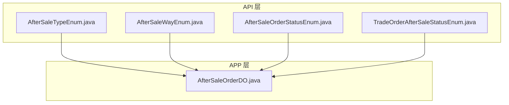
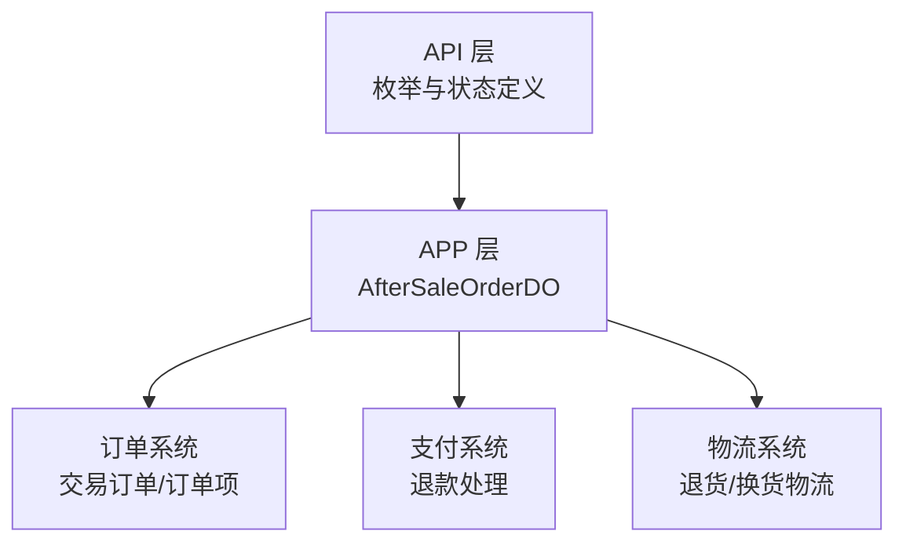
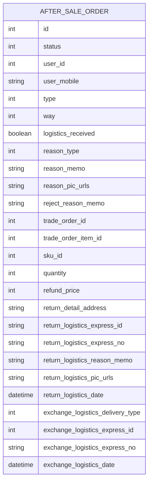
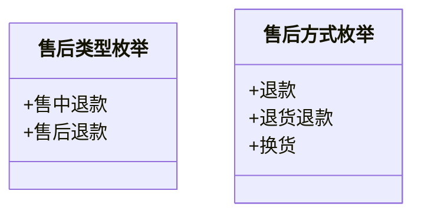
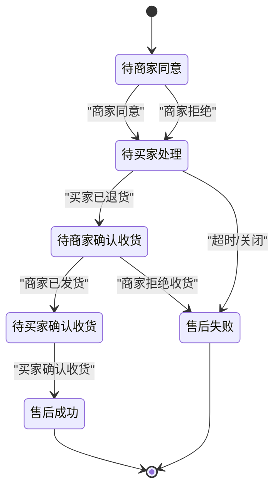
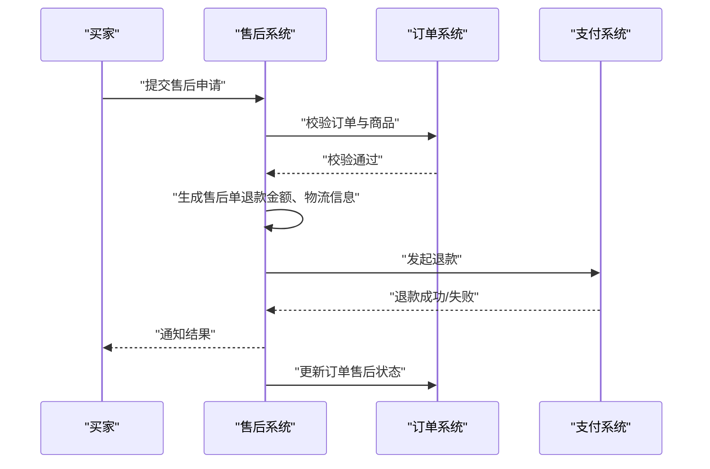
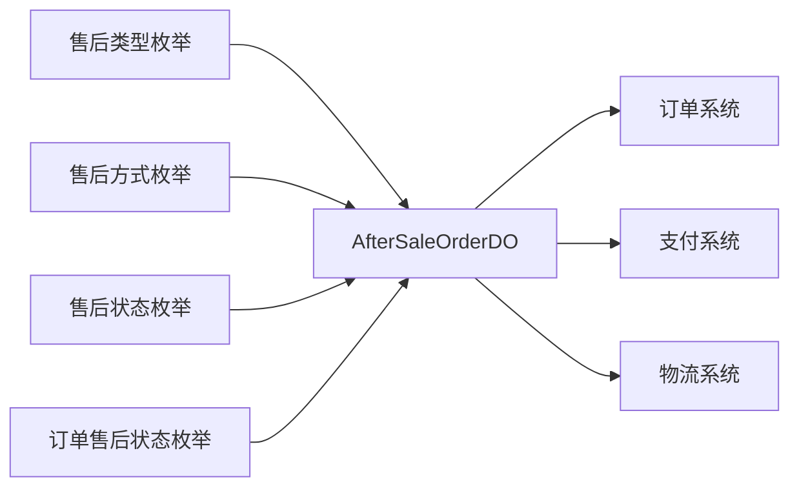

# 售后服务

<cite>
**本文引用的文件**
- [AfterSaleOrderDO.java](file://trade-service-project/trade-service-app/src/main/java/cn/iocoder/mall/tradeservice/dal/mysql/dataobject/aftersale/AfterSaleOrderDO.java)
- [AfterSaleOrderStatusEnum.java](file://trade-service-project/trade-service-api/src/main/java/cn/iocoder/mall/tradeservice/enums/aftersale/AfterSaleOrderStatusEnum.java)
- [AfterSaleTypeEnum.java](file://trade-service-project/trade-service-api/src/main/java/cn/iocoder/mall/tradeservice/enums/aftersale/AfterSaleTypeEnum.java)
- [AfterSaleWayEnum.java](file://trade-service-project/trade-service-api/src/main/java/cn/iocoder/mall/tradeservice/enums/aftersale/AfterSaleWayEnum.java)
- [TradeOrderAfterSaleStatusEnum.java](file://trade-service-project/trade-service-api/src/main/java/cn/iocoder/mall/tradeservice/enums/order/TradeOrderAfterSaleStatusEnum.java)
</cite>

## 目录
1. [引言](#引言)
2. [项目结构](#项目结构)
3. [核心组件](#核心组件)
4. [架构总览](#架构总览)
5. [详细组件分析](#详细组件分析)
6. [依赖关系分析](#依赖关系分析)
7. [性能考虑](#性能考虑)
8. [故障排查指南](#故障排查指南)
9. [结论](#结论)
10. [附录](#附录)

## 引言
本技术文档围绕售后服务功能展开，系统性梳理售后业务的完整流程，包括退货申请、换货处理、退款流程、售后审核等环节；明确售后订单的数据模型（AfterSaleOrderDO）、售后类型与方式枚举、状态枚举及处理流程；阐述售后状态机设计（状态转换规则、审批流程、时间限制、责任划分）；说明与订单系统的集成（订单验证、商品核对、退款金额计算、库存回滚等关联操作）；并针对不同类型售后（仅退款、退货退款、换货）给出处理差异说明与完整示例，最后覆盖异常处理、争议解决与风险控制等运营相关内容。

## 项目结构
售后服务相关代码主要分布在 trade-service-project 模块中：
- API 层：定义售后类型、方式、状态等枚举，以及订单侧售后状态枚举
- APP 层：定义售后订单数据对象（AfterSaleOrderDO），并与订单、订单项、SKU 等建立关联

图表来源
- [AfterSaleTypeEnum.java:1-29](file://trade-service-project/trade-service-api/src/main/java/cn/iocoder/mall/tradeservice/enums/aftersale/AfterSaleTypeEnum.java#L1-L29)
- [AfterSaleWayEnum.java:1-30](file://trade-service-project/trade-service-api/src/main/java/cn/iocoder/mall/tradeservice/enums/aftersale/AfterSaleWayEnum.java#L1-L30)
- [AfterSaleOrderStatusEnum.java:1-42](file://trade-service-project/trade-service-api/src/main/java/cn/iocoder/mall/tradeservice/enums/aftersale/AfterSaleOrderStatusEnum.java#L1-L42)
- [TradeOrderAfterSaleStatusEnum.java](file://trade-service-project/trade-service-api/src/main/java/cn/iocoder/mall/tradeservice/enums/order/TradeOrderAfterSaleStatusEnum.java)
- [AfterSaleOrderDO.java:1-161](file://trade-service-project/trade-service-app/src/main/java/cn/iocoder/mall/tradeservice/dal/mysql/dataobject/aftersale/AfterSaleOrderDO.java#L1-L161)

章节来源
- [AfterSaleTypeEnum.java:1-29](file://trade-service-project/trade-service-api/src/main/java/cn/iocoder/mall/tradeservice/enums/aftersale/AfterSaleTypeEnum.java#L1-L29)
- [AfterSaleWayEnum.java:1-30](file://trade-service-project/trade-service-api/src/main/java/cn/iocoder/mall/tradeservice/enums/aftersale/AfterSaleWayEnum.java#L1-L30)
- [AfterSaleOrderStatusEnum.java:1-42](file://trade-service-project/trade-service-api/src/main/java/cn/iocoder/mall/tradeservice/enums/aftersale/AfterSaleOrderStatusEnum.java#L1-L42)
- [TradeOrderAfterSaleStatusEnum.java](file://trade-service-project/trade-service-api/src/main/java/cn/iocoder/mall/tradeservice/enums/order/TradeOrderAfterSaleStatusEnum.java)
- [AfterSaleOrderDO.java:1-161](file://trade-service-project/trade-service-app/src/main/java/cn/iocoder/mall/tradeservice/dal/mysql/dataobject/aftersale/AfterSaleOrderDO.java#L1-L161)

## 核心组件
- 售后订单数据对象（AfterSaleOrderDO）
  - 字段覆盖：售后单主键、状态、用户信息、售后类型与方式、货物状态、原因与凭证、交易订单与订单项、SKU 与数量、退款金额、退货物流信息、换货物流信息等
  - 关联关系：外键指向交易订单与订单项，便于售后与订单强绑定
- 售后类型枚举（AfterSaleTypeEnum）
  - 售中退款、售后退款两类
- 售后方式枚举（AfterSaleWayEnum）
  - 退款、退货退款、换货三类
- 售后状态枚举（AfterSaleOrderStatusEnum）
  - 待商家处理、待买家处理、待确认收货、待买家确认收货、商家拒绝、售后成功、售后失败等
- 订单侧售后状态枚举（TradeOrderAfterSaleStatusEnum）
  - 用于标记订单整体的售后状态（如是否在售后中）

章节来源
- [AfterSaleOrderDO.java:1-161](file://trade-service-project/trade-service-app/src/main/java/cn/iocoder/mall/tradeservice/dal/mysql/dataobject/aftersale/AfterSaleOrderDO.java#L1-L161)
- [AfterSaleTypeEnum.java:1-29](file://trade-service-project/trade-service-api/src/main/java/cn/iocoder/mall/tradeservice/enums/aftersale/AfterSaleTypeEnum.java#L1-L29)
- [AfterSaleWayEnum.java:1-30](file://trade-service-project/trade-service-api/src/main/java/cn/iocoder/mall/tradeservice/enums/aftersale/AfterSaleWayEnum.java#L1-L30)
- [AfterSaleOrderStatusEnum.java:1-42](file://trade-service-project/trade-service-api/src/main/java/cn/iocoder/mall/tradeservice/enums/aftersale/AfterSaleOrderStatusEnum.java#L1-L42)
- [TradeOrderAfterSaleStatusEnum.java](file://trade-service-project/trade-service-api/src/main/java/cn/iocoder/mall/tradeservice/enums/order/TradeOrderAfterSaleStatusEnum.java)

## 架构总览
售后模块采用“API 定义 + APP 实现”的分层设计：
- API 层提供枚举与状态定义，统一业务语义
- APP 层通过 DO 对象承载售后单据，与订单、订单项、SKU 等进行关联
- 与订单系统协作，实现订单验证、商品核对、退款金额计算、库存回滚等

图表来源
- [AfterSaleOrderDO.java:1-161](file://trade-service-project/trade-service-app/src/main/java/cn/iocoder/mall/tradeservice/dal/mysql/dataobject/aftersale/AfterSaleOrderDO.java#L1-L161)
- [AfterSaleOrderStatusEnum.java:1-42](file://trade-service-project/trade-service-api/src/main/java/cn/iocoder/mall/tradeservice/enums/aftersale/AfterSaleOrderStatusEnum.java#L1-L42)
- [AfterSaleTypeEnum.java:1-29](file://trade-service-project/trade-service-api/src/main/java/cn/iocoder/mall/tradeservice/enums/aftersale/AfterSaleTypeEnum.java#L1-L29)
- [AfterSaleWayEnum.java:1-30](file://trade-service-project/trade-service-api/src/main/java/cn/iocoder/mall/tradeservice/enums/aftersale/AfterSaleWayEnum.java#L1-L30)
- [TradeOrderAfterSaleStatusEnum.java](file://trade-service-project/trade-service-api/src/main/java/cn/iocoder/mall/tradeservice/enums/order/TradeOrderAfterSaleStatusEnum.java)

## 详细组件分析

### 售后订单数据模型（AfterSaleOrderDO）
- 主要职责
  - 承载一次售后单据的所有关键信息
  - 与交易订单、订单项、SKU 强关联，确保售后与订单一一对应
  - 记录退款金额、退货物流、换货物流等关键字段
- 关键字段说明
  - 基础信息：id、status、userId、userMobile、type、way、logisticsReceived、reasonType/reasonMemo/reasonPicUrls、rejectReasonMemo
  - 关联信息：tradeOrderId、tradeOrderItemId、skuId、quantity
  - 退款信息：refundPrice
  - 退货物流：returnDetailAddress、returnLogisticsExpressId、returnLogisticsExpressNo、returnLogisticsReasonMemo、returnLogisticsPicUrls、returnLogisticsDate
  - 换货物流：exchangeLogisticsDeliveryType、exchangeLogisticsExpressId、exchangeLogisticsExpressNo、exchangeLogisticsDate
- 设计要点
  - 字段命名清晰，便于前端与运营理解
  - 退款金额以“分”为单位，避免浮点误差
  - 物流相关字段支持图片凭证与时间戳，便于审计与争议处理

图表来源
- [AfterSaleOrderDO.java:1-161](file://trade-service-project/trade-service-app/src/main/java/cn/iocoder/mall/tradeservice/dal/mysql/dataobject/aftersale/AfterSaleOrderDO.java#L1-L161)

章节来源
- [AfterSaleOrderDO.java:1-161](file://trade-service-project/trade-service-app/src/main/java/cn/iocoder/mall/tradeservice/dal/mysql/dataobject/aftersale/AfterSaleOrderDO.java#L1-L161)

### 售后类型与方式枚举
- 售后类型（AfterSaleTypeEnum）
  - 售中退款：在订单支付后、发货前发起的退款
  - 售后退款：在订单完成后发起的退款
- 售后方式（AfterSaleWayEnum）
  - 退款：无需退货，直接退款
  - 退货退款：需退回商品，确认收货后退款
  - 换货：需退回商品，商家重新发货

图表来源
- [AfterSaleTypeEnum.java:1-29](file://trade-service-project/trade-service-api/src/main/java/cn/iocoder/mall/tradeservice/enums/aftersale/AfterSaleTypeEnum.java#L1-L29)
- [AfterSaleWayEnum.java:1-30](file://trade-service-project/trade-service-api/src/main/java/cn/iocoder/mall/tradeservice/enums/aftersale/AfterSaleWayEnum.java#L1-L30)

章节来源
- [AfterSaleTypeEnum.java:1-29](file://trade-service-project/trade-service-api/src/main/java/cn/iocoder/mall/tradeservice/enums/aftersale/AfterSaleTypeEnum.java#L1-L29)
- [AfterSaleWayEnum.java:1-30](file://trade-service-project/trade-service-api/src/main/java/cn/iocoder/mall/tradeservice/enums/aftersale/AfterSaleWayEnum.java#L1-L30)

### 售后状态机设计
- 状态枚举（AfterSaleOrderStatusEnum）
  - WAIT_SELLER_AGREE：待商家同意
  - WAIT_BUYER_RETURN_GOODS：商家同意，待买家退货
  - SELLER_REFUSE_BUYER：商家拒绝，待买家处理
  - WAIT_SELLER_CONFIRM_GOODS：买家已退货，待商家确认收货
  - WAIT_BUYER_CONFIRM_GOODS：商家已发货，待买家确认收货
  - SELLER_REFUSE_RETURN_GOODS：商家拒绝收货，待买家处理
  - SUCCESS：售后成功
  - CLOSED：售后失败
- 流程说明
  - 退款：1个来回（买家申请 → 商家同意/拒绝 → 退款）
  - 退货退款：2个来回（买家退货 → 商家确认收货 → 退款）
  - 换货：3个来回（买家退货 → 商家确认收货 → 商家发货 → 买家确认收货）

图表来源
- [AfterSaleOrderStatusEnum.java:1-42](file://trade-service-project/trade-service-api/src/main/java/cn/iocoder/mall/tradeservice/enums/aftersale/AfterSaleOrderStatusEnum.java#L1-L42)

章节来源
- [AfterSaleOrderStatusEnum.java:1-42](file://trade-service-project/trade-service-api/src/main/java/cn/iocoder/mall/tradeservice/enums/aftersale/AfterSaleOrderStatusEnum.java#L1-L42)

### 与订单系统的集成
- 订单验证
  - 校验 tradeOrderId 与 tradeOrderItemId 是否存在且有效
  - 校验订单状态与售后状态一致性（例如只有已完成的订单可发起售后）
- 商品核对
  - 校验 skuId 与 quantity 是否与订单项一致
  - 核对 logisticsReceived 表示买家是否已收到货
- 退款金额计算
  - refundPrice 以“分”为单位，建议按订单项单价与数量计算，并考虑优惠分摊
- 库存回滚
  - 退货退款/换货场景下，确认收货后触发库存回滚
- 订单侧售后状态
  - TradeOrderAfterSaleStatusEnum 用于标记订单整体是否处于售后中，便于前端展示与风控策略

章节来源
- [TradeOrderAfterSaleStatusEnum.java](file://trade-service-project/trade-service-api/src/main/java/cn/iocoder/mall/tradeservice/enums/order/TradeOrderAfterSaleStatusEnum.java)
- [AfterSaleOrderDO.java:80-101](file://trade-service-project/trade-service-app/src/main/java/cn/iocoder/mall/tradeservice/dal/mysql/dataobject/aftersale/AfterSaleOrderDO.java#L80-L101)

### 不同类型售后的处理差异
- 仅退款
  - 适用：质量问题、发错货等无需退货
  - 流程：提交申请 → 商家同意/拒绝 → 退款 → 成功/失败
- 退货退款
  - 适用：质量问题、尺寸不合适等需要退货
  - 流程：提交申请 → 商家同意 → 买家退货 → 商家确认收货 → 退款 → 成功/失败
- 换货
  - 适用：质量问题、发错货等需要换货
  - 流程：提交申请 → 商家同意 → 买家退货 → 商家确认收货 → 商家发货 → 买家确认收货 → 成功/失败

章节来源
- [AfterSaleWayEnum.java:1-30](file://trade-service-project/trade-service-api/src/main/java/cn/iocoder/mall/tradeservice/enums/aftersale/AfterSaleWayEnum.java#L1-L30)
- [AfterSaleOrderStatusEnum.java:1-42](file://trade-service-project/trade-service-api/src/main/java/cn/iocoder/mall/tradeservice/enums/aftersale/AfterSaleOrderStatusEnum.java#L1-L42)

### 售后处理完整示例（从申请到完成）
- 场景：买家购买商品后发现质量问题，申请仅退款
- 步骤：
  1) 买家提交售后申请（type=售中退款/售后退款，way=退款，reasonType/reasonMemo/reasonPicUrls）
  2) 商家审核同意或拒绝（sellerAgree/sellerRefuse）
  3) 若同意：系统生成退款单，调用支付系统执行退款
  4) 若拒绝：买家可撤销或再次申请
  5) 退款完成后，更新售后单状态为 SUCCESS，订单侧售后状态同步更新

图表来源
- [AfterSaleOrderDO.java:1-161](file://trade-service-project/trade-service-app/src/main/java/cn/iocoder/mall/tradeservice/dal/mysql/dataobject/aftersale/AfterSaleOrderDO.java#L1-L161)
- [AfterSaleOrderStatusEnum.java:1-42](file://trade-service-project/trade-service-api/src/main/java/cn/iocoder/mall/tradeservice/enums/aftersale/AfterSaleOrderStatusEnum.java#L1-L42)
- [TradeOrderAfterSaleStatusEnum.java](file://trade-service-project/trade-service-api/src/main/java/cn/iocoder/mall/tradeservice/enums/order/TradeOrderAfterSaleStatusEnum.java)

## 依赖关系分析
- 枚举与 DO 的耦合
  - AfterSaleOrderDO 引入 AfterSaleTypeEnum、AfterSaleWayEnum、AfterSaleOrderStatusEnum，形成稳定的业务语义边界
- 与订单系统的耦合
  - 通过 tradeOrderId、tradeOrderItemId、skuId、quantity 与订单系统强关联
- 与支付/物流系统的耦合
  - 退款金额与物流信息分别对接支付与物流系统，确保流程闭环

图表来源
- [AfterSaleOrderDO.java:1-161](file://trade-service-project/trade-service-app/src/main/java/cn/iocoder/mall/tradeservice/dal/mysql/dataobject/aftersale/AfterSaleOrderDO.java#L1-L161)
- [AfterSaleTypeEnum.java:1-29](file://trade-service-project/trade-service-api/src/main/java/cn/iocoder/mall/tradeservice/enums/aftersale/AfterSaleTypeEnum.java#L1-L29)
- [AfterSaleWayEnum.java:1-30](file://trade-service-project/trade-service-api/src/main/java/cn/iocoder/mall/tradeservice/enums/aftersale/AfterSaleWayEnum.java#L1-L30)
- [AfterSaleOrderStatusEnum.java:1-42](file://trade-service-project/trade-service-api/src/main/java/cn/iocoder/mall/tradeservice/enums/aftersale/AfterSaleOrderStatusEnum.java#L1-L42)
- [TradeOrderAfterSaleStatusEnum.java](file://trade-service-project/trade-service-api/src/main/java/cn/iocoder/mall/tradeservice/enums/order/TradeOrderAfterSaleStatusEnum.java)

章节来源
- [AfterSaleOrderDO.java:1-161](file://trade-service-project/trade-service-app/src/main/java/cn/iocoder/mall/tradeservice/dal/mysql/dataobject/aftersale/AfterSaleOrderDO.java#L1-L161)
- [AfterSaleTypeEnum.java:1-29](file://trade-service-project/trade-service-api/src/main/java/cn/iocoder/mall/tradeservice/enums/aftersale/AfterSaleTypeEnum.java#L1-L29)
- [AfterSaleWayEnum.java:1-30](file://trade-service-project/trade-service-api/src/main/java/cn/iocoder/mall/tradeservice/enums/aftersale/AfterSaleWayEnum.java#L1-L30)
- [AfterSaleOrderStatusEnum.java:1-42](file://trade-service-project/trade-service-api/src/main/java/cn/iocoder/mall/tradeservice/enums/aftersale/AfterSaleOrderStatusEnum.java#L1-L42)
- [TradeOrderAfterSaleStatusEnum.java](file://trade-service-project/trade-service-api/src/main/java/cn/iocoder/mall/tradeservice/enums/order/TradeOrderAfterSaleStatusEnum.java)

## 性能考虑
- 售后单据查询
  - 建议按 userId、tradeOrderId、status 等维度建立索引，提升查询效率
- 退款与物流
  - 退款与物流回调应异步化，避免阻塞主流程
- 审计与日志
  - 建议为每个状态变更记录审计日志，便于问题追踪与合规检查

## 故障排查指南
- 常见问题
  - 申请被拒：检查 rejectReasonMemo 与订单状态是否匹配
  - 退货/换货物流异常：核对 returnLogisticsPicUrls、exchangeLogisticsPicUrls 与物流单号
  - 退款失败：核对 refundPrice 与支付渠道返回状态
- 排查步骤
  - 根据售后单号定位 AfterSaleOrderDO，核对状态与各字段
  - 对照状态机图，确认当前状态是否符合预期流转
  - 检查与订单、支付、物流系统的交互记录

章节来源
- [AfterSaleOrderDO.java:1-161](file://trade-service-project/trade-service-app/src/main/java/cn/iocoder/mall/tradeservice/dal/mysql/dataobject/aftersale/AfterSaleOrderDO.java#L1-L161)
- [AfterSaleOrderStatusEnum.java:1-42](file://trade-service-project/trade-service-api/src/main/java/cn/iocoder/mall/tradeservice/enums/aftersale/AfterSaleOrderStatusEnum.java#L1-L42)

## 结论
售后服务模块通过清晰的枚举定义、严谨的数据模型与状态机设计，实现了从申请到完成的闭环流程。结合订单系统、支付系统与物流系统的协同，能够满足多种售后场景的需求。建议在后续迭代中完善超时机制、协商记录表、风控策略与争议仲裁流程，进一步提升用户体验与运营效率。

## 附录
- 术语
  - 售中退款：订单支付后、发货前的退款
  - 售后退款：订单完成后发起的退款
  - 退货退款：需退回商品，确认收货后退款
  - 换货：需退回商品，商家重新发货
- 参考流程图
  - 售后状态机流程图见“售后状态机设计”章节