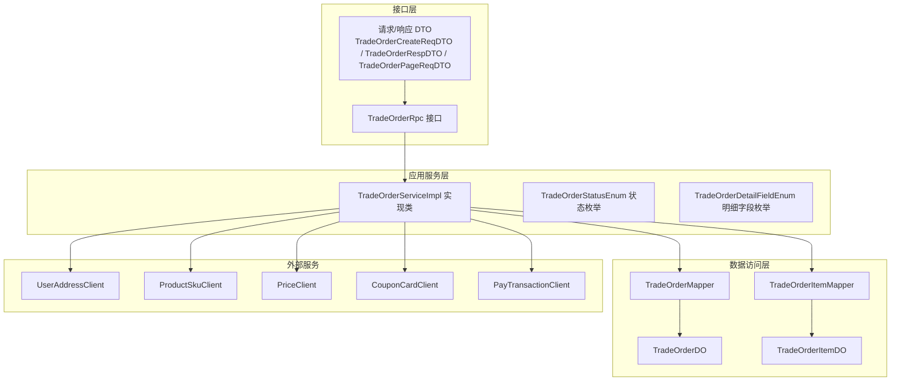
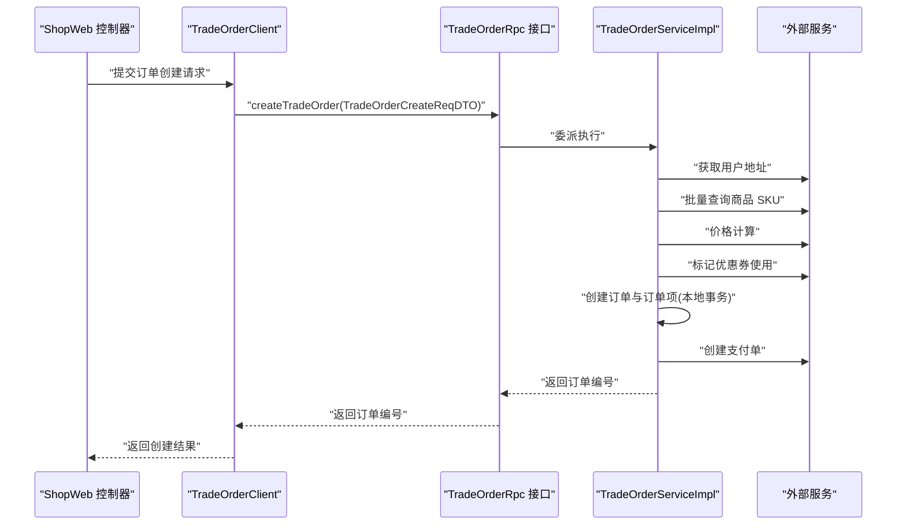
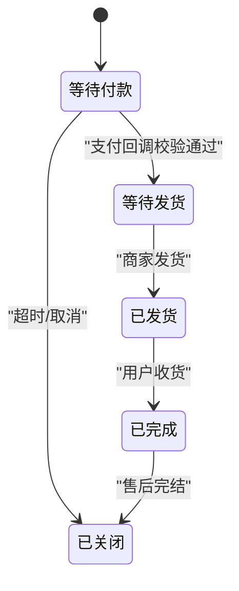
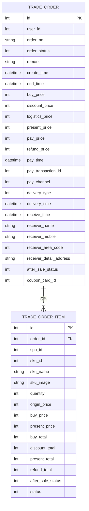
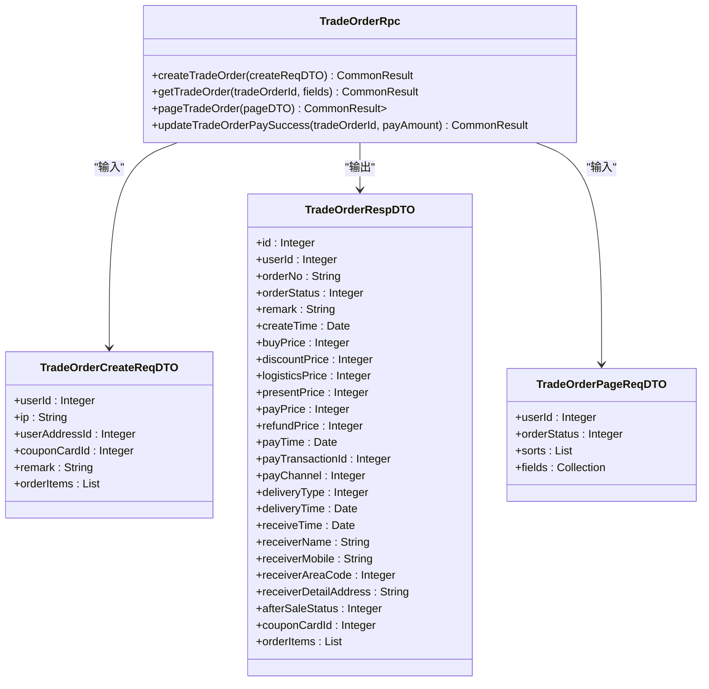
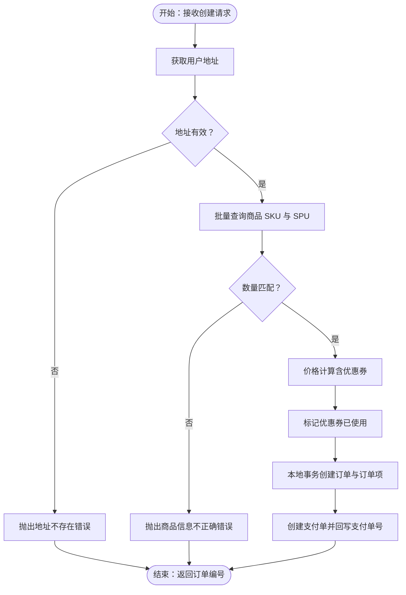
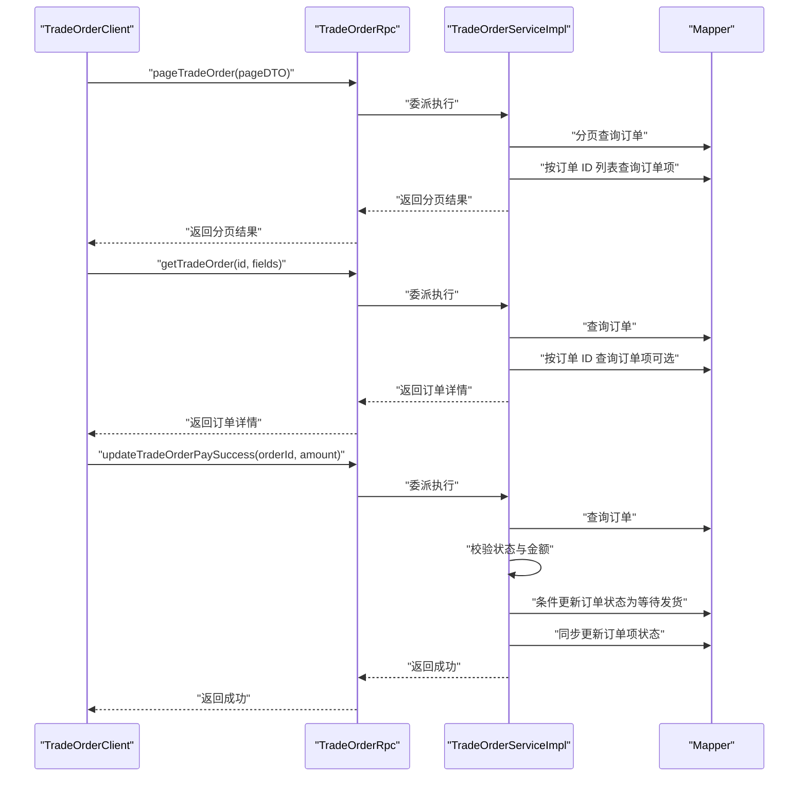
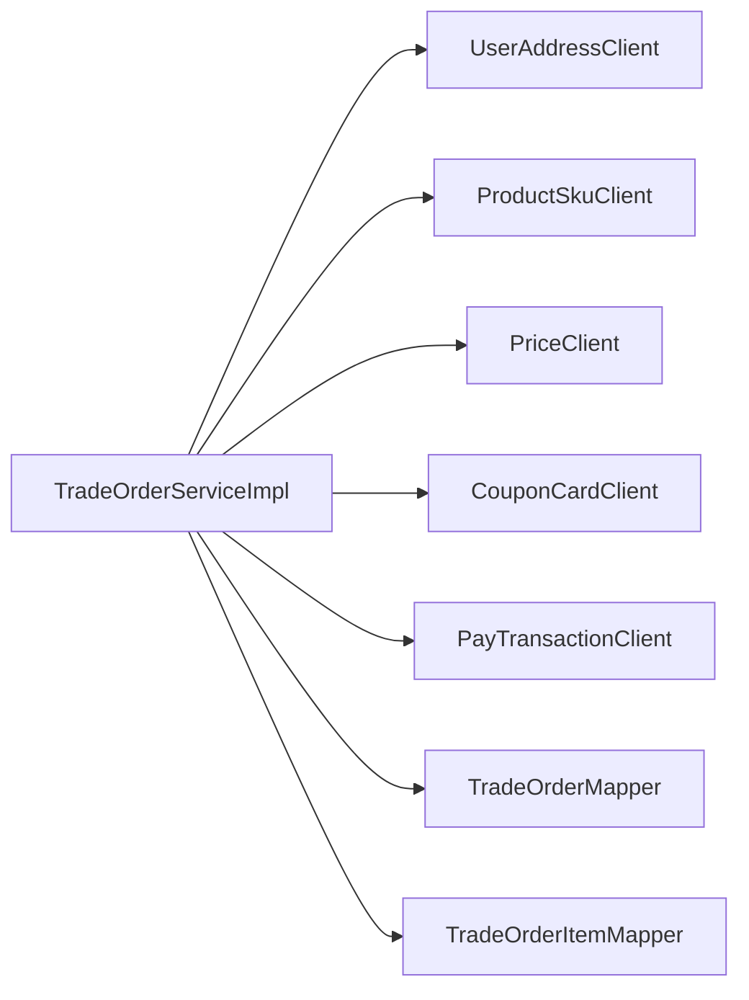

# 订单管理

<cite>
**本文引用的文件**
- [TradeOrderRpc.java](file://trade-service-project/trade-service-api/src/main/java/cn/iocoder/mall/tradeservice/rpc/order/TradeOrderRpc.java)
- [TradeOrderCreateReqDTO.java](file://trade-service-project/trade-service-api/src/main/java/cn/iocoder/mall/tradeservice/rpc/order/dto/TradeOrderCreateReqDTO.java)
- [TradeOrderRespDTO.java](file://trade-service-project/trade-service-api/src/main/java/cn/iocoder/mall/tradeservice/rpc/order/dto/TradeOrderRespDTO.java)
- [TradeOrderPageReqDTO.java](file://trade-service-project/trade-service-api/src/main/java/cn/iocoder/mall/tradeservice/rpc/order/dto/TradeOrderPageReqDTO.java)
- [TradeOrderStatusEnum.java](file://trade-service-project/trade-service-api/src/main/java/cn/iocoder/mall/tradeservice/enums/order/TradeOrderStatusEnum.java)
- [TradeOrderDetailFieldEnum.java](file://trade-service-project/trade-service-api/src/main/java/cn/iocoder/mall/tradeservice/enums/order/TradeOrderDetailFieldEnum.java)
- [TradeOrderServiceImpl.java](file://trade-service-project/trade-service-app/src/main/java/cn/iocoder/mall/tradeservice/service/order/impl/TradeOrderServiceImpl.java)
- [TradeOrderClient.java](file://shop-web-app/src/main/java/cn/iocoder/mall/shopweb/client/trade/TradeOrderClient.java)
- [TradeOrderController.java](file://shop-web-app/src/main/java/cn/iocoder/mall/shopweb/controller/trade/TradeOrderController.java)
- [OrderReturnDO.java](file://moved/order/order-biz/src/main/java/cn/iocoder/mall/order/biz/dataobject/OrderReturnDO.java)
</cite>

## 目录
1. [引言](#引言)
2. [项目结构](#项目结构)
3. [核心组件](#核心组件)
4. [架构总览](#架构总览)
5. [详细组件分析](#详细组件分析)
6. [依赖关系分析](#依赖关系分析)
7. [性能考量](#性能考量)
8. [故障排查指南](#故障排查指南)
9. [结论](#结论)
10. [附录](#附录)

## 引言
本技术文档围绕订单管理功能展开，系统性阐述订单生命周期管理（创建、支付、发货、收货、售后与评价）、状态机设计与并发控制、数据模型与业务约束、RPC 接口定义与调用方式、以及分页查询、详情获取、状态更新等核心能力的实现细节。同时给出订单创建流程的完整示例与异常处理、事务管理、性能优化建议，帮助开发者快速理解并高效扩展订单域。

## 项目结构
订单域由“接口层 + 应用服务层 + 数据访问层 + 外部集成”组成：
- 接口层：对外暴露 RPC 接口，定义订单创建、查询、分页、支付回调等能力
- 应用服务层：实现订单业务逻辑，协调外部服务（价格、商品 SKU、优惠券、支付）
- 数据访问层：持久化订单与订单项，维护状态与价格等核心字段
- 外部集成：与支付、商品、价格、用户地址、促销等服务交互

图表来源
- [TradeOrderRpc.java:14-54](file://trade-service-project/trade-service-api/src/main/java/cn/iocoder/mall/tradeservice/rpc/order/TradeOrderRpc.java#L14-L54)
- [TradeOrderServiceImpl.java:48-279](file://trade-service-project/trade-service-app/src/main/java/cn/iocoder/mall/tradeservice/service/order/impl/TradeOrderServiceImpl.java#L48-L279)

章节来源
- [TradeOrderRpc.java:14-54](file://trade-service-project/trade-service-api/src/main/java/cn/iocoder/mall/tradeservice/rpc/order/TradeOrderRpc.java#L14-L54)
- [TradeOrderServiceImpl.java:48-279](file://trade-service-project/trade-service-app/src/main/java/cn/iocoder/mall/tradeservice/service/order/impl/TradeOrderServiceImpl.java#L48-L279)

## 核心组件
- RPC 接口：提供订单创建、详情查询、分页查询、支付回调更新等能力
- DTO：封装请求与响应的数据结构，明确字段含义与校验规则
- 状态枚举：定义订单状态机，约束状态转换合法性
- 应用服务：编排价格计算、库存扣减、优惠券使用、支付单创建与状态更新
- 控制器与客户端：Web 层通过 TradeOrderClient 调用 RPC 接口

章节来源
- [TradeOrderRpc.java:14-54](file://trade-service-project/trade-service-api/src/main/java/cn/iocoder/mall/tradeservice/rpc/order/TradeOrderRpc.java#L14-L54)
- [TradeOrderCreateReqDTO.java:19-69](file://trade-service-project/trade-service-api/src/main/java/cn/iocoder/mall/tradeservice/rpc/order/dto/TradeOrderCreateReqDTO.java#L19-L69)
- [TradeOrderRespDTO.java:16-139](file://trade-service-project/trade-service-api/src/main/java/cn/iocoder/mall/tradeservice/rpc/order/dto/TradeOrderRespDTO.java#L16-L139)
- [TradeOrderPageReqDTO.java:19-45](file://trade-service-project/trade-service-api/src/main/java/cn/iocoder/mall/tradeservice/rpc/order/dto/TradeOrderPageReqDTO.java#L19-L45)
- [TradeOrderStatusEnum.java:12-34](file://trade-service-project/trade-service-api/src/main/java/cn/iocoder/mall/tradeservice/enums/order/TradeOrderStatusEnum.java#L12-L34)
- [TradeOrderServiceImpl.java:48-279](file://trade-service-project/trade-service-app/src/main/java/cn/iocoder/mall/tradeservice/service/order/impl/TradeOrderServiceImpl.java#L48-L279)

## 架构总览
订单域采用分层架构，接口层通过 RPC 提供能力，应用服务层负责业务编排，数据访问层负责持久化，外部服务通过客户端适配器接入。Web 层通过 TradeOrderClient 调用 RPC，实现从前端到后端的完整链路。

图表来源
- [TradeOrderClient.java](file://shop-web-app/src/main/java/cn/iocoder/mall/shopweb/client/trade/TradeOrderClient.java)
- [TradeOrderController.java](file://shop-web-app/src/main/java/cn/iocoder/mall/shopweb/controller/trade/TradeOrderController.java)
- [TradeOrderRpc.java:22](file://trade-service-project/trade-service-api/src/main/java/cn/iocoder/mall/tradeservice/rpc/order/TradeOrderRpc.java#L22)
- [TradeOrderServiceImpl.java:75-108](file://trade-service-project/trade-service-app/src/main/java/cn/iocoder/mall/tradeservice/service/order/impl/TradeOrderServiceImpl.java#L75-L108)

## 详细组件分析

### 订单状态机设计
- 状态枚举包含：等待付款、等待发货、已发货、已完成、已关闭
- 状态转换规则：
  - 创建订单后初始状态为“等待付款”
  - 支付回调校验金额一致且状态为“等待付款”，则原子性更新为“等待发货”
  - 其他环节（如发货、收货、售后）在应用服务中体现为状态与字段更新，但核心状态机以“等待付款/等待发货/已发货/已完成/已关闭”为主
- 并发控制与一致性：
  - 支付回调更新采用“条件更新”（基于旧状态与金额校验），确保并发场景下的幂等与一致性
  - 订单与订单项的状态同步更新，避免脏读与状态不一致

图表来源
- [TradeOrderStatusEnum.java:14-18](file://trade-service-project/trade-service-api/src/main/java/cn/iocoder/mall/tradeservice/enums/order/TradeOrderStatusEnum.java#L14-L18)
- [TradeOrderServiceImpl.java:244-277](file://trade-service-project/trade-service-app/src/main/java/cn/iocoder/mall/tradeservice/service/order/impl/TradeOrderServiceImpl.java#L244-L277)

章节来源
- [TradeOrderStatusEnum.java:12-34](file://trade-service-project/trade-service-api/src/main/java/cn/iocoder/mall/tradeservice/enums/order/TradeOrderStatusEnum.java#L12-L34)
- [TradeOrderServiceImpl.java:244-277](file://trade-service-project/trade-service-app/src/main/java/cn/iocoder/mall/tradeservice/service/order/impl/TradeOrderServiceImpl.java#L244-L277)

### 订单数据模型
- 订单实体 TradeOrderDO 关键字段与含义（对应 TradeOrderRespDTO 的字段映射）：
  - 基本信息：订单编号、用户编号、订单号、订单状态、备注、创建时间
  - 价格与支付：订单总金额、优惠总金额、物流金额、最终金额、支付金额、退款金额、支付时间、支付订单编号、支付渠道
  - 收件与物流：配送类型、发货时间、收货时间、收件人姓名、手机号、地区编码、详细地址
  - 售后：售后状态
  - 营销：优惠券编号
  - 明细：订单项集合（按需返回）
- 订单项 TradeOrderItemDO 关键字段：
  - 订单编号、SPU/SKU 编号、SKU 名称与图片、数量
  - 价格明细：原价、购买价、最终价、购买小计、优惠小计、_present_total、退款小计
  - 售后状态、订单状态快照
- 业务约束：
  - 订单状态仅允许按规则转换
  - 支付回调必须校验金额与状态，防止重复入账
  - 订单号生成具备唯一性与可读性（时间戳+随机）

图表来源
- [TradeOrderRespDTO.java:18-139](file://trade-service-project/trade-service-api/src/main/java/cn/iocoder/mall/tradeservice/rpc/order/dto/TradeOrderRespDTO.java#L18-L139)
- [TradeOrderServiceImpl.java:114-165](file://trade-service-project/trade-service-app/src/main/java/cn/iocoder/mall/tradeservice/service/order/impl/TradeOrderServiceImpl.java#L114-L165)

章节来源
- [TradeOrderRespDTO.java:16-139](file://trade-service-project/trade-service-api/src/main/java/cn/iocoder/mall/tradeservice/rpc/order/dto/TradeOrderRespDTO.java#L16-L139)
- [TradeOrderServiceImpl.java:114-165](file://trade-service-project/trade-service-app/src/main/java/cn/iocoder/mall/tradeservice/service/order/impl/TradeOrderServiceImpl.java#L114-L165)

### RPC 接口设计
- 接口方法与职责：
  - createTradeOrder：创建订单，返回订单编号
  - getTradeOrder：按订单编号查询，支持额外字段（如订单项）
  - pageTradeOrder：分页查询，支持排序与额外字段
  - updateTradeOrderPaySuccess：支付回调更新订单为“等待发货”，含金额与状态校验
- 参数与返回：
  - 请求 DTO：包含用户信息、收件地址、优惠券、备注、订单项列表
  - 响应 DTO：包含订单基础信息、价格与支付、收件与物流、售后、营销、订单项等
  - 分页请求：支持 userId、orderStatus 过滤，排序字段与额外字段集合

图表来源
- [TradeOrderRpc.java:14-54](file://trade-service-project/trade-service-api/src/main/java/cn/iocoder/mall/tradeservice/rpc/order/TradeOrderRpc.java#L14-L54)
- [TradeOrderCreateReqDTO.java:19-69](file://trade-service-project/trade-service-api/src/main/java/cn/iocoder/mall/tradeservice/rpc/order/dto/TradeOrderCreateReqDTO.java#L19-L69)
- [TradeOrderRespDTO.java:16-139](file://trade-service-project/trade-service-api/src/main/java/cn/iocoder/mall/tradeservice/rpc/order/dto/TradeOrderRespDTO.java#L16-L139)
- [TradeOrderPageReqDTO.java:19-45](file://trade-service-project/trade-service-api/src/main/java/cn/iocoder/mall/tradeservice/rpc/order/dto/TradeOrderPageReqDTO.java#L19-L45)

章节来源
- [TradeOrderRpc.java:14-54](file://trade-service-project/trade-service-api/src/main/java/cn/iocoder/mall/tradeservice/rpc/order/TradeOrderRpc.java#L14-L54)
- [TradeOrderCreateReqDTO.java:19-69](file://trade-service-project/trade-service-api/src/main/java/cn/iocoder/mall/tradeservice/rpc/order/dto/TradeOrderCreateReqDTO.java#L19-L69)
- [TradeOrderRespDTO.java:16-139](file://trade-service-project/trade-service-api/src/main/java/cn/iocoder/mall/tradeservice/rpc/order/dto/TradeOrderRespDTO.java#L16-L139)
- [TradeOrderPageReqDTO.java:19-45](file://trade-service-project/trade-service-api/src/main/java/cn/iocoder/mall/tradeservice/rpc/order/dto/TradeOrderPageReqDTO.java#L19-L45)

### 订单创建流程（从下单到生成）
- 步骤概览：
  1) 校验并获取用户收件地址
  2) 批量查询商品 SKU 与 SPU 信息
  3) 价格计算（含优惠券）
  4) 标记优惠券已使用
  5) 本地事务创建订单与订单项
  6) 创建支付单并回写支付单号
- 关键点：
  - 地址与商品信息校验，确保数量与 SKU 匹配
  - 价格计算结果作为订单金额基准
  - 支付单过期时间由配置决定
  - 订单号生成策略具备唯一性

图表来源
- [TradeOrderServiceImpl.java:75-108](file://trade-service-project/trade-service-app/src/main/java/cn/iocoder/mall/tradeservice/service/order/impl/TradeOrderServiceImpl.java#L75-L108)
- [TradeOrderServiceImpl.java:110-184](file://trade-service-project/trade-service-app/src/main/java/cn/iocoder/mall/tradeservice/service/order/impl/TradeOrderServiceImpl.java#L110-L184)

章节来源
- [TradeOrderServiceImpl.java:75-108](file://trade-service-project/trade-service-app/src/main/java/cn/iocoder/mall/tradeservice/service/order/impl/TradeOrderServiceImpl.java#L75-L108)
- [TradeOrderServiceImpl.java:110-184](file://trade-service-project/trade-service-app/src/main/java/cn/iocoder/mall/tradeservice/service/order/impl/TradeOrderServiceImpl.java#L110-L184)

### 订单分页查询、详情获取与状态更新
- 分页查询：
  - 支持按用户编号、订单状态过滤
  - 支持排序字段（默认按 id 升/降序）
  - 可选返回额外字段（如订单项）
- 详情获取：
  - 支持按需返回订单项明细
- 状态更新（支付回调）：
  - 校验订单存在性、状态必须为“等待付款”、支付金额与订单金额一致
  - 条件更新订单与订单项状态为“等待发货”

图表来源
- [TradeOrderRpc.java:31](file://trade-service-project/trade-service-api/src/main/java/cn/iocoder/mall/tradeservice/rpc/order/TradeOrderRpc.java#L31)
- [TradeOrderRpc.java:39](file://trade-service-project/trade-service-api/src/main/java/cn/iocoder/mall/tradeservice/rpc/order/TradeOrderRpc.java#L39)
- [TradeOrderRpc.java:52](file://trade-service-project/trade-service-api/src/main/java/cn/iocoder/mall/tradeservice/rpc/order/TradeOrderRpc.java#L52)
- [TradeOrderServiceImpl.java:222-241](file://trade-service-project/trade-service-app/src/main/java/cn/iocoder/mall/tradeservice/service/order/impl/TradeOrderServiceImpl.java#L222-L241)
- [TradeOrderServiceImpl.java:204-220](file://trade-service-project/trade-service-app/src/main/java/cn/iocoder/mall/tradeservice/service/order/impl/TradeOrderServiceImpl.java#L204-L220)
- [TradeOrderServiceImpl.java:244-277](file://trade-service-project/trade-service-app/src/main/java/cn/iocoder/mall/tradeservice/service/order/impl/TradeOrderServiceImpl.java#L244-L277)

章节来源
- [TradeOrderServiceImpl.java:222-241](file://trade-service-project/trade-service-app/src/main/java/cn/iocoder/mall/tradeservice/service/order/impl/TradeOrderServiceImpl.java#L222-L241)
- [TradeOrderServiceImpl.java:204-220](file://trade-service-project/trade-service-app/src/main/java/cn/iocoder/mall/tradeservice/service/order/impl/TradeOrderServiceImpl.java#L204-L220)
- [TradeOrderServiceImpl.java:244-277](file://trade-service-project/trade-service-app/src/main/java/cn/iocoder/mall/tradeservice/service/order/impl/TradeOrderServiceImpl.java#L244-L277)

### 售后与评价（扩展说明）
- 售后订单数据模型 OrderReturnDO：
  - 包含服务号、订单编号/号、物流编号、退款金额、原因、描述、各阶段时间、服务类型、状态等
  - 状态覆盖申请、同意/拒绝、退货中、收货、成功等环节
- 评价与回复：
  - 评价模块位于 moved/order 子模块，包含评论与回复的数据对象与转换器，支持按状态、分页查询与超时处理等 BO/DTO

章节来源
- [OrderReturnDO.java:16-102](file://moved/order/order-biz/src/main/java/cn/iocoder/mall/order/biz/dataobject/OrderReturnDO.java#L16-L102)

## 依赖关系分析
- 组件耦合：
  - TradeOrderServiceImpl 依赖多个客户端（地址、SKU、价格、优惠券、支付）与 Mapper
  - DTO 与枚举在接口层与应用层之间传递，保持清晰边界
- 外部依赖：
  - 支付服务：创建支付单并回写支付单号
  - 商品与价格服务：SKU 详情与价格计算
  - 用户地址服务：收件信息校验
  - 促销服务：优惠券使用
- 潜在循环依赖：
  - 应用服务注入自身用于事务方法调用，属于常见自调用模式，避免循环依赖

图表来源
- [TradeOrderServiceImpl.java:59-68](file://trade-service-project/trade-service-app/src/main/java/cn/iocoder/mall/tradeservice/service/order/impl/TradeOrderServiceImpl.java#L59-L68)

章节来源
- [TradeOrderServiceImpl.java:59-68](file://trade-service-project/trade-service-app/src/main/java/cn/iocoder/mall/tradeservice/service/order/impl/TradeOrderServiceImpl.java#L59-L68)

## 性能考量
- 分页查询优化：
  - 使用主键 id 或复合索引优化分页查询
  - 按需返回订单项，避免不必要的 N+1 查询
- 价格计算与库存：
  - 价格计算与 SKU 查询采用批量接口，减少网络往返
  - 库存扣减预留（当前 TODO 标注），建议引入分布式锁或库存预占机制
- 支付单过期：
  - 支付单过期时间由配置决定，建议结合定时任务清理超时订单
- 并发与幂等：
  - 支付回调采用条件更新与状态校验，避免重复入账
  - 建议对关键操作增加幂等键（如订单号、支付单号）

## 故障排查指南
- 常见错误与定位：
  - 地址不存在：检查用户与地址 ID 是否匹配
  - 商品信息不正确：核对 SKU 列表与价格计算返回数量
  - 订单不存在或状态非“等待付款”：确认订单号与状态
  - 支付金额不一致：核对前端传入金额与订单最终金额
- 事务与一致性：
  - 支付回调失败通常由状态校验或条件更新失败导致，需检查订单状态与金额
  - 建议开启数据库与日志审计，便于回溯
- 接口调用：
  - Web 层通过 TradeOrderClient 调用 RPC，若出现异常需检查客户端封装与 RPC 返回码

章节来源
- [TradeOrderServiceImpl.java:79-88](file://trade-service-project/trade-service-app/src/main/java/cn/iocoder/mall/tradeservice/service/order/impl/TradeOrderServiceImpl.java#L79-L88)
- [TradeOrderServiceImpl.java:252-270](file://trade-service-project/trade-service-app/src/main/java/cn/iocoder/mall/tradeservice/service/order/impl/TradeOrderServiceImpl.java#L252-L270)

## 结论
订单管理模块以清晰的 RPC 接口与 DTO 定义为核心，配合应用服务层的编排能力与严格的状态机约束，实现了从下单到支付的关键闭环。通过条件更新与幂等设计保障了并发安全与数据一致性。未来可在库存扣减、分布式事务、支付单清理等方面进一步完善，持续提升系统稳定性与性能。

## 附录
- 关键实现路径参考：
  - 订单创建：[TradeOrderServiceImpl.java:75-108](file://trade-service-project/trade-service-app/src/main/java/cn/iocoder/mall/tradeservice/service/order/impl/TradeOrderServiceImpl.java#L75-L108)
  - 订单详情与分页：[TradeOrderServiceImpl.java:204-241](file://trade-service-project/trade-service-app/src/main/java/cn/iocoder/mall/tradeservice/service/order/impl/TradeOrderServiceImpl.java#L204-L241)
  - 支付回调更新：[TradeOrderServiceImpl.java:244-277](file://trade-service-project/trade-service-app/src/main/java/cn/iocoder/mall/tradeservice/service/order/impl/TradeOrderServiceImpl.java#L244-L277)
  - RPC 接口定义：[TradeOrderRpc.java:14-54](file://trade-service-project/trade-service-api/src/main/java/cn/iocoder/mall/tradeservice/rpc/order/TradeOrderRpc.java#L14-L54)
  - DTO 定义：[TradeOrderCreateReqDTO.java:19-69](file://trade-service-project/trade-service-api/src/main/java/cn/iocoder/mall/tradeservice/rpc/order/dto/TradeOrderCreateReqDTO.java#L19-L69)、[TradeOrderRespDTO.java:16-139](file://trade-service-project/trade-service-api/src/main/java/cn/iocoder/mall/tradeservice/rpc/order/dto/TradeOrderRespDTO.java#L16-L139)、[TradeOrderPageReqDTO.java:19-45](file://trade-service-project/trade-service-api/src/main/java/cn/iocoder/mall/tradeservice/rpc/order/dto/TradeOrderPageReqDTO.java#L19-L45)
  - 状态枚举：[TradeOrderStatusEnum.java:12-34](file://trade-service-project/trade-service-api/src/main/java/cn/iocoder/mall/tradeservice/enums/order/TradeOrderStatusEnum.java#L12-L34)
  - 明细字段枚举：[TradeOrderDetailFieldEnum.java:10-30](file://trade-service-project/trade-service-api/src/main/java/cn/iocoder/mall/tradeservice/enums/order/TradeOrderDetailFieldEnum.java#L10-L30)
  - Web 调用链：[TradeOrderClient.java](file://shop-web-app/src/main/java/cn/iocoder/mall/shopweb/client/trade/TradeOrderClient.java)、[TradeOrderController.java](file://shop-web-app/src/main/java/cn/iocoder/mall/shopweb/controller/trade/TradeOrderController.java)
  - 售后数据模型：[OrderReturnDO.java:16-102](file://moved/order/order-biz/src/main/java/cn/iocoder/mall/order/biz/dataobject/OrderReturnDO.java#L16-L102)