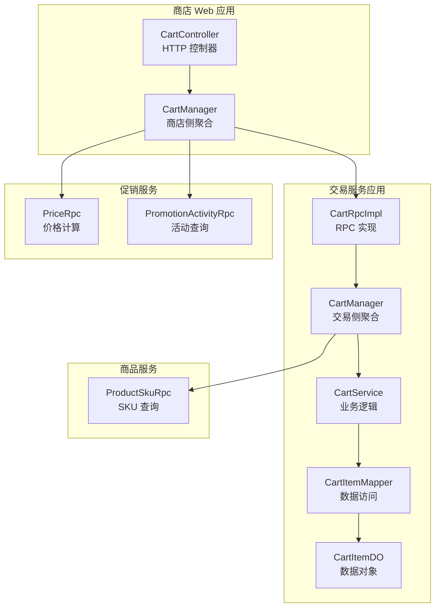
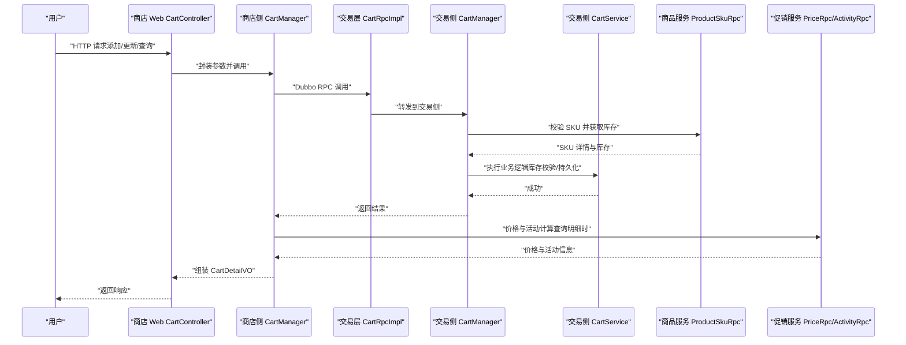
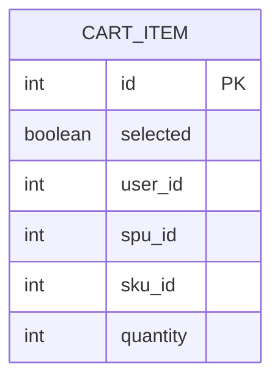
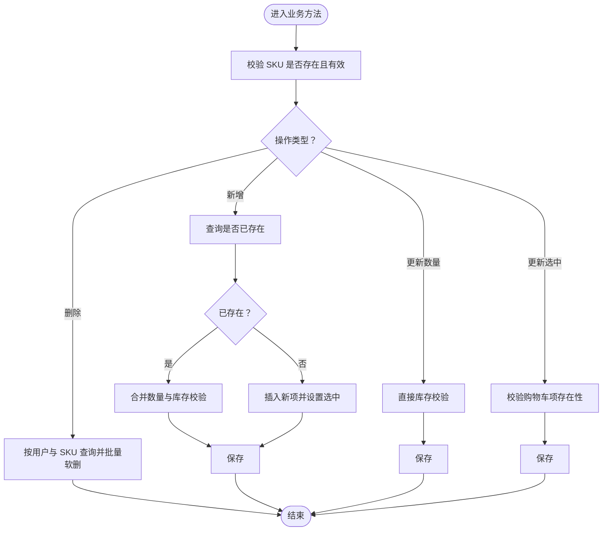
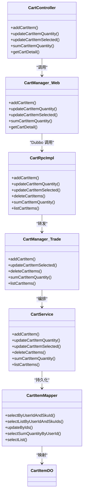
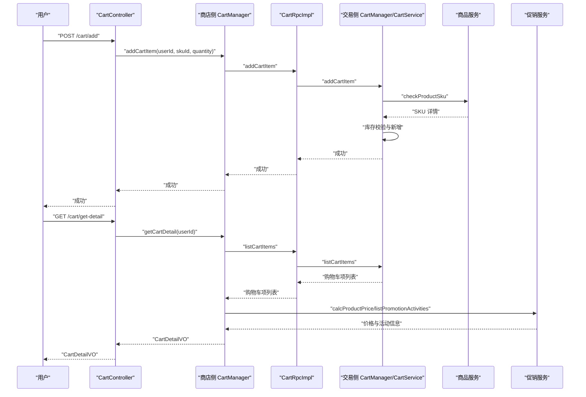

# 购物车管理

<cite>
**本文引用的文件**
- [CartRpc.java](file://trade-service-project/trade-service-api/src/main/java/cn/iocoder/mall/tradeservice/rpc/cart/CartRpc.java)
- [CartRpcImpl.java](file://trade-service-project/trade-service-app/src/main/java/cn/iocoder/mall/tradeservice/rpc/cart/CartRpcImpl.java)
- [CartManager.java（交易服务）](file://trade-service-project/trade-service-app/src/main/java/cn/iocoder/mall/tradeservice/service/cart/CartManager.java)
- [CartService.java](file://trade-service-project/trade-service-app/src/main/java/cn/iocoder/mall/tradeservice/service/cart/CartService.java)
- [CartItemDO.java](file://trade-service-project/trade-service-app/src/main/java/cn/iocoder/mall/tradeservice/dal/mysql/dataobject/cart/CartItemDO.java)
- [CartItemMapper.java](file://trade-service-project/trade-service-app/src/main/java/cn/iocoder/mall/tradeservice/dal/mysql/mapper/cart/CartItemMapper.java)
- [CartItemAddReqDTO.java](file://trade-service-project/trade-service-api/src/main/java/cn/iocoder/mall/tradeservice/rpc/cart/dto/CartItemAddReqDTO.java)
- [CartItemRespDTO.java](file://trade-service-project/trade-service-api/src/main/java/cn/iocoder/mall/tradeservice/rpc/cart/dto/CartItemRespDTO.java)
- [CartController.java](file://shop-web-app/src/main/java/cn/iocoder/mall/shopweb/controller/trade/CartController.java)
- [CartManager.java（商店 Web）](file://shop-web-app/src/main/java/cn/iocoder/mall/shopweb/service/trade/CartManager.java)
- [CartDetailVO.java](file://shop-web-app/src/main/java/cn/iocoder/mall/shopweb/controller/trade/vo/cart/CartDetailVO.java)
- [OrderErrorCodeConstants.java](file://trade-service-project/trade-service-api/src/main/java/cn/iocoder/mall/tradeservice/enums/OrderErrorCodeConstants.java)
- [ProductSkuRpc.java](file://product-service-project/product-service-api/src/main/java/cn/iocoder/mall/productservice/rpc/sku/ProductSkuRpc.java)
- [PriceRpc.java](file://promotion-service-project/promotion-service-api/src/main/java/cn/iocoder/mall/promotion/api/rpc/price/PriceRpc.java)
- [PromotionActivityRpc.java](file://promotion-service-project/promotion-service-api/src/main/java/cn/iocoder/mall/promotion/api/rpc/activity/PromotionActivityRpc.java)
</cite>

## 目录
1. [简介](#简介)
2. [项目结构](#项目结构)
3. [核心组件](#核心组件)
4. [架构总览](#架构总览)
5. [详细组件分析](#详细组件分析)
6. [依赖关系分析](#依赖关系分析)
7. [性能考量](#性能考量)
8. [故障排查指南](#故障排查指南)
9. [结论](#结论)
10. [附录](#附录)

## 简介
本技术文档围绕购物车管理功能进行全面梳理，覆盖以下方面：
- 购物车核心能力：添加、删除、修改数量、选择状态切换、统计数量、查询明细
- 数据模型设计：CartItemDO 字段与冗余设计说明
- RPC 接口定义：CartRpc 方法、参数与返回规范
- 与商品服务集成：SKU 校验、库存校验、价格计算与活动联动
- 业务规则：库存不足、SKU 下架、价格同步机制
- 完整操作示例：从用户添加商品到下单确认的全流程
- 运维内容：清理策略、过期处理、数据迁移建议

## 项目结构
购物车模块横跨“商店 Web 应用”和“交易服务应用”，并依赖“商品服务”和“促销服务”的 RPC 接口：
- 展示层（Shop Web）：对外暴露 HTTP 接口，调用交易服务的 CartRpc
- 交易服务（Trade Service）：提供 CartRpc 的实现，协调 CartManager、CartService、CartItemMapper
- 商品服务（Product Service）：提供 SKU 详情与库存信息
- 促销服务（Promotion Service）：提供价格计算与活动信息

图表来源
- [CartController.java:20-84](file://shop-web-app/src/main/java/cn/iocoder/mall/shopweb/controller/trade/CartController.java#L20-L84)
- [CartManager.java（商店 Web）:28-169](file://shop-web-app/src/main/java/cn/iocoder/mall/shopweb/service/trade/CartManager.java#L28-L169)
- [CartRpcImpl.java:16-57](file://trade-service-project/trade-service-app/src/main/java/cn/iocoder/mall/tradeservice/rpc/cart/CartRpcImpl.java#L16-L57)
- [CartManager.java（交易服务）:24-117](file://trade-service-project/trade-service-app/src/main/java/cn/iocoder/mall/tradeservice/service/cart/CartManager.java#L24-L117)
- [CartService.java:27-137](file://trade-service-project/trade-service-app/src/main/java/cn/iocoder/mall/tradeservice/service/cart/CartService.java#L27-L137)
- [CartItemMapper.java:18-49](file://trade-service-project/trade-service-app/src/main/java/cn/iocoder/mall/tradeservice/dal/mysql/mapper/cart/CartItemMapper.java#L18-L49)
- [CartItemDO.java:16-74](file://trade-service-project/trade-service-app/src/main/java/cn/iocoder/mall/tradeservice/dal/mysql/dataobject/cart/CartItemDO.java#L16-L74)
- [ProductSkuRpc.java](file://product-service-project/product-service-api/src/main/java/cn/iocoder/mall/productservice/rpc/sku/ProductSkuRpc.java)
- [PriceRpc.java](file://promotion-service-project/promotion-service-api/src/main/java/cn/iocoder/mall/promotion/api/rpc/price/PriceRpc.java)
- [PromotionActivityRpc.java](file://promotion-service-project/promotion-service-api/src/main/java/cn/iocoder/mall/promotion/api/rpc/activity/PromotionActivityRpc.java)

章节来源
- [CartController.java:20-84](file://shop-web-app/src/main/java/cn/iocoder/mall/shopweb/controller/trade/CartController.java#L20-L84)
- [CartManager.java（商店 Web）:28-169](file://shop-web-app/src/main/java/cn/iocoder/mall/shopweb/service/trade/CartManager.java#L28-L169)
- [CartRpcImpl.java:16-57](file://trade-service-project/trade-service-app/src/main/java/cn/iocoder/mall/tradeservice/rpc/cart/CartRpcImpl.java#L16-L57)
- [CartManager.java（交易服务）:24-117](file://trade-service-project/trade-service-app/src/main/java/cn/iocoder/mall/tradeservice/service/cart/CartManager.java#L24-L117)
- [CartService.java:27-137](file://trade-service-project/trade-service-app/src/main/java/cn/iocoder/mall/tradeservice/service/cart/CartService.java#L27-L137)
- [CartItemMapper.java:18-49](file://trade-service-project/trade-service-app/src/main/java/cn/iocoder/mall/tradeservice/dal/mysql/mapper/cart/CartItemMapper.java#L18-L49)
- [CartItemDO.java:16-74](file://trade-service-project/trade-service-app/src/main/java/cn/iocoder/mall/tradeservice/dal/mysql/dataobject/cart/CartItemDO.java#L16-L74)

## 核心组件
- RPC 接口层：定义购物车能力的对外契约，包括添加、更新数量、更新选中、批量删除、统计数量、查询列表
- 交易服务层：负责业务编排，校验 SKU 有效性与库存，调用数据库持久化
- 数据访问层：基于 MyBatis Plus 提供的通用 Mapper，封装按用户与 SKU 的查询、批量更新、求和等
- 展示层：面向前端提供 HTTP 接口，并在查询购物车明细时联动价格与活动信息

章节来源
- [CartRpc.java:11-61](file://trade-service-project/trade-service-api/src/main/java/cn/iocoder/mall/tradeservice/rpc/cart/CartRpc.java#L11-L61)
- [CartRpcImpl.java:16-57](file://trade-service-project/trade-service-app/src/main/java/cn/iocoder/mall/tradeservice/rpc/cart/CartRpcImpl.java#L16-L57)
- [CartManager.java（交易服务）:24-117](file://trade-service-project/trade-service-app/src/main/java/cn/iocoder/mall/tradeservice/service/cart/CartManager.java#L24-L117)
- [CartService.java:27-137](file://trade-service-project/trade-service-app/src/main/java/cn/iocoder/mall/tradeservice/service/cart/CartService.java#L27-L137)
- [CartItemMapper.java:18-49](file://trade-service-project/trade-service-app/src/main/java/cn/iocoder/mall/tradeservice/dal/mysql/mapper/cart/CartItemMapper.java#L18-L49)
- [CartController.java:20-84](file://shop-web-app/src/main/java/cn/iocoder/mall/shopweb/controller/trade/CartController.java#L20-L84)
- [CartManager.java（商店 Web）:28-169](file://shop-web-app/src/main/java/cn/iocoder/mall/shopweb/service/trade/CartManager.java#L28-L169)

## 架构总览
购物车请求在展示层与交易层之间通过 Dubbo RPC 传递，交易层再与商品服务、促销服务协同，最终落库到交易服务数据库。

图表来源
- [CartController.java:20-84](file://shop-web-app/src/main/java/cn/iocoder/mall/shopweb/controller/trade/CartController.java#L20-L84)
- [CartManager.java（商店 Web）:47-135](file://shop-web-app/src/main/java/cn/iocoder/mall/shopweb/service/trade/CartManager.java#L47-L135)
- [CartRpcImpl.java:22-54](file://trade-service-project/trade-service-app/src/main/java/cn/iocoder/mall/tradeservice/rpc/cart/CartRpcImpl.java#L22-L54)
- [CartManager.java（交易服务）:37-96](file://trade-service-project/trade-service-app/src/main/java/cn/iocoder/mall/tradeservice/service/cart/CartManager.java#L37-L96)
- [CartService.java:38-79](file://trade-service-project/trade-service-app/src/main/java/cn/iocoder/mall/tradeservice/service/cart/CartService.java#L38-L79)
- [ProductSkuRpc.java](file://product-service-project/product-service-api/src/main/java/cn/iocoder/mall/productservice/rpc/sku/ProductSkuRpc.java)
- [PriceRpc.java](file://promotion-service-project/promotion-service-api/src/main/java/cn/iocoder/mall/promotion/api/rpc/price/PriceRpc.java)
- [PromotionActivityRpc.java](file://promotion-service-project/promotion-service-api/src/main/java/cn/iocoder/mall/promotion/api/rpc/activity/PromotionActivityRpc.java)

## 详细组件分析

### 数据模型设计（CartItemDO）
- 关键字段
  - 主键 id：唯一自增
  - 选中状态 selected：布尔值
  - 用户标识 userId：买家
  - 商品标识 spuId、skuId：商品维度
  - 购买数量 quantity：整型
- 设计要点
  - 使用可删除基类，支持软删除
  - 字段命名清晰，便于按用户与 SKU 快速定位
  - 保留冗余字段注释，便于后续扩展（如营销活动）

图表来源
- [CartItemDO.java:16-74](file://trade-service-project/trade-service-app/src/main/java/cn/iocoder/mall/tradeservice/dal/mysql/dataobject/cart/CartItemDO.java#L16-L74)

章节来源
- [CartItemDO.java:16-74](file://trade-service-project/trade-service-app/src/main/java/cn/iocoder/mall/tradeservice/dal/mysql/dataobject/cart/CartItemDO.java#L16-L74)

### RPC 接口定义（CartRpc）
- 方法清单
  - addCartItem：添加购物车项
  - updateCartItemQuantity：更新数量
  - updateCartItemSelected：更新选中状态
  - deleteCartItems：批量删除
  - sumCartItemQuantity：统计数量
  - listCartItems：查询列表
- 参数与返回
  - 参数均为 DTO，包含用户 ID、SKU ID、数量、选中状态、过滤条件等
  - 返回统一使用 CommonResult 包裹布尔或集合

章节来源
- [CartRpc.java:11-61](file://trade-service-project/trade-service-api/src/main/java/cn/iocoder/mall/tradeservice/rpc/cart/CartRpc.java#L11-L61)
- [CartItemAddReqDTO.java:15-35](file://trade-service-project/trade-service-api/src/main/java/cn/iocoder/mall/tradeservice/rpc/cart/dto/CartItemAddReqDTO.java#L15-L35)
- [CartItemRespDTO.java:13-68](file://trade-service-project/trade-service-api/src/main/java/cn/iocoder/mall/tradeservice/rpc/cart/dto/CartItemRespDTO.java#L13-L68)

### 交易层业务编排（CartManager/CartService）
- CartManager
  - 负责与商品服务交互，校验 SKU 是否存在且未下架
  - 将 RPC 请求转换为业务对象，调用 CartService
- CartService
  - 新增/更新数量时进行库存校验
  - 更新选中状态时校验购物车项是否存在
  - 删除时按用户与 SKU 批量软删除
  - 统计数量与查询列表

图表来源
- [CartManager.java（交易服务）:37-75](file://trade-service-project/trade-service-app/src/main/java/cn/iocoder/mall/tradeservice/service/cart/CartManager.java#L37-L75)
- [CartService.java:38-113](file://trade-service-project/trade-service-app/src/main/java/cn/iocoder/mall/tradeservice/service/cart/CartService.java#L38-L113)

章节来源
- [CartManager.java（交易服务）:24-117](file://trade-service-project/trade-service-app/src/main/java/cn/iocoder/mall/tradeservice/service/cart/CartManager.java#L24-L117)
- [CartService.java:27-137](file://trade-service-project/trade-service-app/src/main/java/cn/iocoder/mall/tradeservice/service/cart/CartService.java#L27-L137)

### 数据访问层（CartItemMapper）
- 提供按用户与 SKU 的精确查询
- 支持按用户与多 SKU 的批量查询
- 支持批量更新（临时实现）
- 提供按用户统计数量的聚合查询

章节来源
- [CartItemMapper.java:18-49](file://trade-service-project/trade-service-app/src/main/java/cn/iocoder/mall/tradeservice/dal/mysql/mapper/cart/CartItemMapper.java#L18-L49)

### 展示层（HTTP 接口与聚合）
- CartController
  - 对外暴露添加、更新数量、更新选中、统计数量、查询明细等接口
  - 基于用户上下文获取用户 ID
- CartManager（商店侧）
  - 调用 CartRpc 执行购物车操作
  - 在查询明细时，调用价格与活动 RPC，拼装 CartDetailVO

章节来源
- [CartController.java:20-84](file://shop-web-app/src/main/java/cn/iocoder/mall/shopweb/controller/trade/CartController.java#L20-L84)
- [CartManager.java（商店 Web）:28-169](file://shop-web-app/src/main/java/cn/iocoder/mall/shopweb/service/trade/CartManager.java#L28-L169)
- [CartDetailVO.java:14-214](file://shop-web-app/src/main/java/cn/iocoder/mall/shopweb/controller/trade/vo/cart/CartDetailVO.java#L14-L214)

### 与商品服务的集成
- SKU 校验：调用 ProductSkuRpc 获取 SKU 详情，若不存在或状态为禁用则抛出异常
- 库存校验：在新增与更新数量时，比较传入数量与 SKU 库存，防止超卖

章节来源
- [CartManager.java（交易服务）:106-114](file://trade-service-project/trade-service-app/src/main/java/cn/iocoder/mall/tradeservice/service/cart/CartManager.java#L106-L114)
- [OrderErrorCodeConstants.java:42-46](file://trade-service-project/trade-service-api/src/main/java/cn/iocoder/mall/tradeservice/enums/OrderErrorCodeConstants.java#L42-L46)

### 与促销服务的集成
- 价格计算：在查询购物车明细时，调用 PriceRpc 计算购买总价、优惠总额、最终价格等
- 活动信息：根据价格计算结果收集活动 ID，批量查询 PromotionActivityRpc 获取活动详情

章节来源
- [CartManager.java（商店 Web）:96-135](file://shop-web-app/src/main/java/cn/iocoder/mall/shopweb/service/trade/CartManager.java#L96-L135)
- [PriceRpc.java](file://promotion-service-project/promotion-service-api/src/main/java/cn/iocoder/mall/promotion/api/rpc/price/PriceRpc.java)
- [PromotionActivityRpc.java](file://promotion-service-project/promotion-service-api/src/main/java/cn/iocoder/mall/promotion/api/rpc/activity/PromotionActivityRpc.java)

## 依赖关系分析
- 展示层依赖交易层的 CartRpc
- 交易层依赖商品服务的 ProductSkuRpc 与本地 CartService
- 交易层依赖本地 Mapper 与 DO
- 展示层在明细查询时依赖促销服务的 PriceRpc 与 PromotionActivityRpc

图表来源
- [CartController.java:20-84](file://shop-web-app/src/main/java/cn/iocoder/mall/shopweb/controller/trade/CartController.java#L20-L84)
- [CartManager.java（商店 Web）:28-169](file://shop-web-app/src/main/java/cn/iocoder/mall/shopweb/service/trade/CartManager.java#L28-L169)
- [CartRpcImpl.java:16-57](file://trade-service-project/trade-service-app/src/main/java/cn/iocoder/mall/tradeservice/rpc/cart/CartRpcImpl.java#L16-L57)
- [CartManager.java（交易服务）:24-117](file://trade-service-project/trade-service-app/src/main/java/cn/iocoder/mall/tradeservice/service/cart/CartManager.java#L24-L117)
- [CartService.java:27-137](file://trade-service-project/trade-service-app/src/main/java/cn/iocoder/mall/tradeservice/service/cart/CartService.java#L27-L137)
- [CartItemMapper.java:18-49](file://trade-service-project/trade-service-app/src/main/java/cn/iocoder/mall/tradeservice/dal/mysql/mapper/cart/CartItemMapper.java#L18-L49)
- [CartItemDO.java:16-74](file://trade-service-project/trade-service-app/src/main/java/cn/iocoder/mall/tradeservice/dal/mysql/dataobject/cart/CartItemDO.java#L16-L74)

## 性能考量
- 批量操作
  - 更新选中状态与删除采用按用户与多 SKU 的批量查询，减少多次往返
  - 批量更新采用循环逐条更新（临时实现），建议在 MyBatis Plus 中扩展批量更新以降低网络与事务开销
- 聚合查询
  - 统计数量使用 SQL 聚合，避免全量加载
- RPC 调用
  - 明细查询时对活动与 SKU 进行去重收集后批量查询，减少 RPC 次数
- 缓存与索引
  - 建议在 CartItem 表上为 user_id、sku_id 建立复合索引，提升查询效率

## 故障排查指南
- 常见错误码
  - 购物车项不存在：用于更新数量或批量更新选中时的缺失校验
  - 商品不存在或已下架：SKU 校验失败
  - 商品库存不足：新增或更新数量超过 SKU 库存
- 排查步骤
  - 确认请求参数中的用户 ID、SKU ID、数量是否正确
  - 检查商品服务返回的 SKU 状态是否为启用
  - 核对当前 SKU 库存与购物车中已有数量之和
  - 查看交易层日志，定位具体异常抛出处

章节来源
- [OrderErrorCodeConstants.java:42-46](file://trade-service-project/trade-service-api/src/main/java/cn/iocoder/mall/tradeservice/enums/OrderErrorCodeConstants.java#L42-L46)
- [CartService.java:43-76](file://trade-service-project/trade-service-app/src/main/java/cn/iocoder/mall/tradeservice/service/cart/CartService.java#L43-L76)
- [CartManager.java（交易服务）:106-114](file://trade-service-project/trade-service-app/src/main/java/cn/iocoder/mall/tradeservice/service/cart/CartManager.java#L106-L114)

## 结论
购物车模块通过清晰的分层设计与 RPC 协作，实现了从用户操作到价格与活动联动的完整闭环。交易层承担了严格的业务校验与持久化职责，展示层专注于聚合与对外接口。未来可在批量更新、索引优化与缓存策略等方面进一步提升性能与稳定性。

## 附录

### 全流程示例：从添加商品到下单确认
- 步骤
  1) 用户在商品详情页点击“加入购物车”，携带 skuId 与 quantity
  2) 展示层 CartController 接收请求，调用商店侧 CartManager.addCartItem
  3) 商店侧 CartManager 通过 CartRpc.addCartItem 调用交易层
  4) 交易层 CartManager 校验 SKU 与库存，交由 CartService 执行新增
  5) 用户进入购物车页面，调用 getCartDetail
  6) 商店侧 CartManager 调用 CartRpc.listCartItems 获取购物车项
  7) 同时调用 PriceRpc 计算价格、PromotionActivityRpc 获取活动信息
  8) 拼装 CartDetailVO 返回给前端
  9) 用户确认订单，前端发起下单请求（此处为下单流程，非购物车操作）

图表来源
- [CartController.java:29-54](file://shop-web-app/src/main/java/cn/iocoder/mall/shopweb/controller/trade/CartController.java#L29-L54)
- [CartManager.java（商店 Web）:47-135](file://shop-web-app/src/main/java/cn/iocoder/mall/shopweb/service/trade/CartManager.java#L47-L135)
- [CartRpcImpl.java:22-54](file://trade-service-project/trade-service-app/src/main/java/cn/iocoder/mall/tradeservice/rpc/cart/CartRpcImpl.java#L22-L54)
- [CartManager.java（交易服务）:37-96](file://trade-service-project/trade-service-app/src/main/java/cn/iocoder/mall/tradeservice/service/cart/CartManager.java#L37-L96)
- [CartService.java:38-134](file://trade-service-project/trade-service-app/src/main/java/cn/iocoder/mall/tradeservice/service/cart/CartService.java#L38-L134)
- [ProductSkuRpc.java](file://product-service-project/product-service-api/src/main/java/cn/iocoder/mall/productservice/rpc/sku/ProductSkuRpc.java)
- [PriceRpc.java](file://promotion-service-project/promotion-service-api/src/main/java/cn/iocoder/mall/promotion/api/rpc/price/PriceRpc.java)
- [PromotionActivityRpc.java](file://promotion-service-project/promotion-service-api/src/main/java/cn/iocoder/mall/promotion/api/rpc/activity/PromotionActivityRpc.java)

### 运维建议
- 清理策略
  - 对长时间未登录或无购买行为的用户，定期清理购物车项，释放库存
- 过期处理
  - 可引入“最后修改时间”字段，结合定时任务清理超期项
- 数据迁移
  - 购物车表结构变更时，制定灰度迁移方案，保证 SKU 与 SPU 关联字段一致性