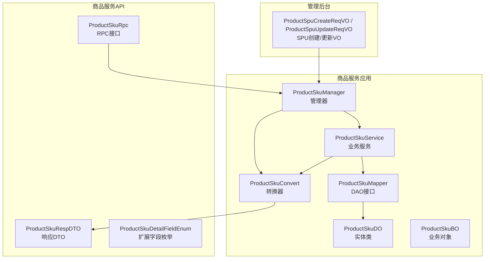
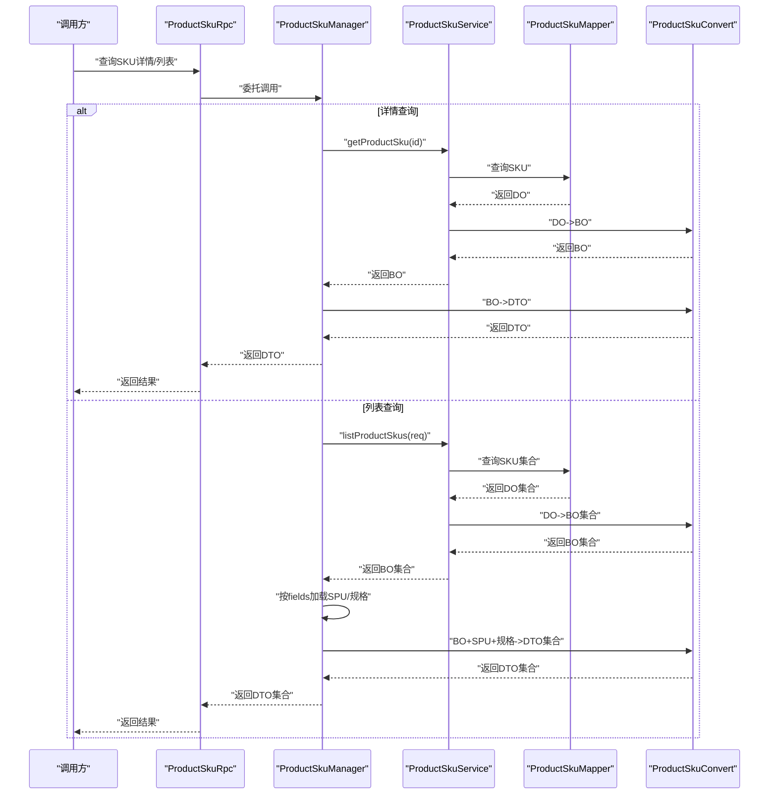
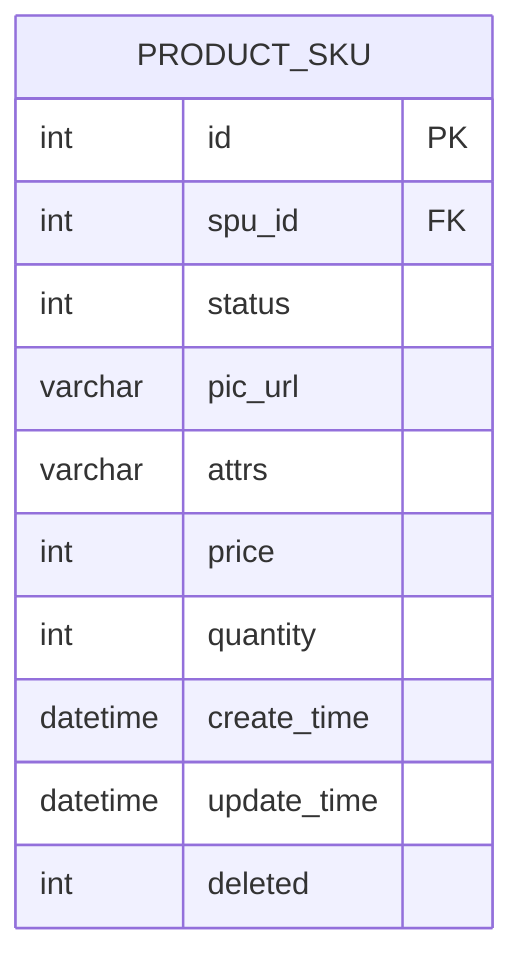
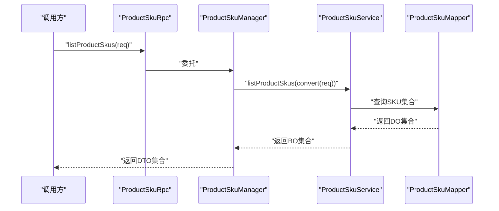
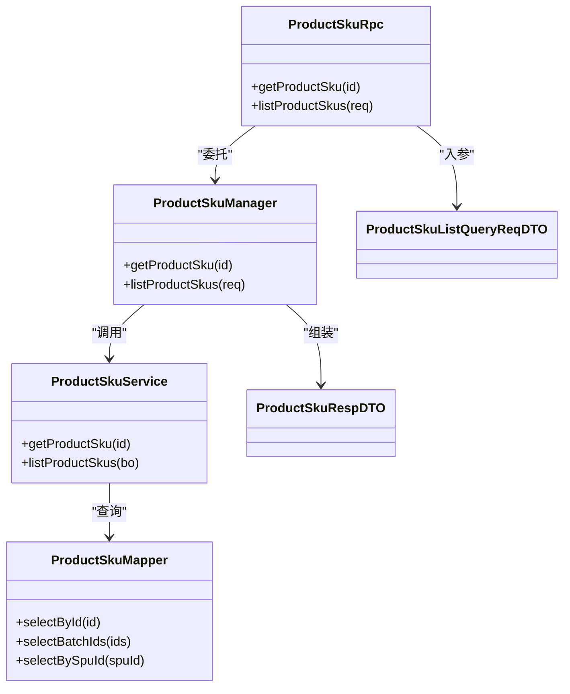

# SKU管理

<cite>
**本文引用的文件**
- [ProductSkuDO.java](file://product-service-project/product-service-app/src/main/java/cn/iocoder/mall/productservice/dal/mysql/dataobject/sku/ProductSkuDO.java)
- [ProductSkuBO.java](file://product-service-project/product-service-app/src/main/java/cn/iocoder/mall/productservice/service/sku/bo/ProductSkuBO.java)
- [ProductSkuCreateOrUpdateBO.java](file://product-service-project/product-service-app/src/main/java/cn/iocoder/mall/productservice/service/sku/bo/ProductSkuCreateOrUpdateBO.java)
- [ProductSkuListQueryBO.java](file://product-service-project/product-service-app/src/main/java/cn/iocoder/mall/productservice/service/sku/bo/ProductSkuListQueryBO.java)
- [ProductSkuRpc.java](file://product-service-project/product-service-api/src/main/java/cn/iocoder/mall/productservice/rpc/sku/ProductSkuRpc.java)
- [ProductSkuListQueryReqDTO.java](file://product-service-project/product-service-api/src/main/java/cn/iocoder/mall/productservice/rpc/sku/dto/ProductSkuListQueryReqDTO.java)
- [ProductSkuRespDTO.java](file://product-service-project/product-service-api/src/main/java/cn/iocoder/mall/productservice/rpc/sku/dto/ProductSkuRespDTO.java)
- [ProductSkuManager.java](file://product-service-project/product-service-app/src/main/java/cn/iocoder/mall/productservice/manager/sku/ProductSkuManager.java)
- [ProductSkuService.java](file://product-service-project/product-service-app/src/main/java/cn/iocoder/mall/productservice/service/sku/ProductSkuService.java)
- [ProductSkuMapper.java](file://product-service-project/product-service-app/src/main/java/cn/iocoder/mall/productservice/dal/mysql/mapper/sku/ProductSkuMapper.java)
- [ProductSkuConvert.java](file://product-service-project/product-service-app/src/main/java/cn/iocoder/mall/productservice/convert/sku/ProductSkuConvert.java)
- [ProductSkuDetailFieldEnum.java](file://product-service-project/product-service-api/src/main/java/cn/iocoder/mall/productservice/enums/sku/ProductSkuDetailFieldEnum.java)
- [ProductSpuCreateReqVO.java](file://management-web-app/src/main/java/cn/iocoder/mall/managementweb/controller/product/vo/spu/ProductSpuCreateReqVO.java)
- [ProductSpuUpdateReqVO.java](file://management-web-app/src/main/java/cn/iocoder/mall/managementweb/controller/product/vo/spu/ProductSpuUpdateReqVO.java)
- [ProductSkuRpcImpl.java](file://product-service-project/product-service-app/src/main/java/cn/iocoder/mall/productservice/rpc/sku/ProductSkuRpcImpl.java)
</cite>

## 目录
1. [引言](#引言)
2. [项目结构](#项目结构)
3. [核心组件](#核心组件)
4. [架构总览](#架构总览)
5. [详细组件分析](#详细组件分析)
6. [依赖分析](#依赖分析)
7. [性能考量](#性能考量)
8. [故障排查指南](#故障排查指南)
9. [结论](#结论)
10. [附录](#附录)

## 引言
本技术文档围绕SKU（最小库存单位）管理功能展开，系统性阐述SKU的概念、与SPU（标准商品单元）的一对多映射关系、规格参数的动态组合与唯一性约束、价格体系设计、库存管理策略、RPC接口能力以及状态管理与业务规则。文档面向开发与产品人员，既提供代码级细节，也给出可操作的最佳实践。

## 项目结构
SKU相关能力主要分布在“商品服务”子项目中，采用典型的分层架构：
- 数据访问层（DAO/DO）：负责数据库表映射与基础查询
- 业务服务层（Service/BO）：封装业务逻辑与数据转换
- 管理器层（Manager）：编排跨服务调用，组装返回结果
- RPC接口层：对外暴露查询能力，支持批量与详情查询
- 控制器层（管理后台）：接收前端提交的SPU创建/更新请求，其中包含SKU数组定义

图表来源
- [ProductSkuMapper.java](file://product-service-project/product-service-app/src/main/java/cn/iocoder/mall/productservice/dal/mysql/mapper/sku/ProductSkuMapper.java)
- [ProductSkuDO.java](file://product-service-project/product-service-app/src/main/java/cn/iocoder/mall/productservice/dal/mysql/dataobject/sku/ProductSkuDO.java)
- [ProductSkuBO.java](file://product-service-project/product-service-app/src/main/java/cn/iocoder/mall/productservice/service/sku/bo/ProductSkuBO.java)
- [ProductSkuService.java](file://product-service-project/product-service-app/src/main/java/cn/iocoder/mall/productservice/service/sku/ProductSkuService.java)
- [ProductSkuManager.java](file://product-service-project/product-service-app/src/main/java/cn/iocoder/mall/productservice/manager/sku/ProductSkuManager.java)
- [ProductSkuConvert.java](file://product-service-project/product-service-app/src/main/java/cn/iocoder/mall/productservice/convert/sku/ProductSkuConvert.java)
- [ProductSkuRpc.java](file://product-service-project/product-service-api/src/main/java/cn/iocoder/mall/productservice/rpc/sku/ProductSkuRpc.java)
- [ProductSkuRespDTO.java](file://product-service-project/product-service-api/src/main/java/cn/iocoder/mall/productservice/rpc/sku/dto/ProductSkuRespDTO.java)
- [ProductSkuDetailFieldEnum.java](file://product-service-project/product-service-api/src/main/java/cn/iocoder/mall/productservice/enums/sku/ProductSkuDetailFieldEnum.java)
- [ProductSpuCreateReqVO.java](file://management-web-app/src/main/java/cn/iocoder/mall/managementweb/controller/product/vo/spu/ProductSpuCreateReqVO.java)
- [ProductSpuUpdateReqVO.java](file://management-web-app/src/main/java/cn/iocoder/mall/managementweb/controller/product/vo/spu/ProductSpuUpdateReqVO.java)

章节来源
- [ProductSkuDO.java:1-65](file://product-service-project/product-service-app/src/main/java/cn/iocoder/mall/productservice/dal/mysql/dataobject/sku/ProductSkuDO.java#L1-L65)
- [ProductSkuBO.java:1-61](file://product-service-project/product-service-app/src/main/java/cn/iocoder/mall/productservice/service/sku/bo/ProductSkuBO.java#L1-L61)
- [ProductSkuCreateOrUpdateBO.java:1-38](file://product-service-project/product-service-app/src/main/java/cn/iocoder/mall/productservice/service/sku/bo/ProductSkuCreateOrUpdateBO.java#L1-L38)
- [ProductSkuListQueryBO.java:1-33](file://product-service-project/product-service-app/src/main/java/cn/iocoder/mall/productservice/service/sku/bo/ProductSkuListQueryBO.java#L1-L33)
- [ProductSkuRpc.java:1-31](file://product-service-project/product-service-api/src/main/java/cn/iocoder/mall/productservice/rpc/sku/ProductSkuRpc.java#L1-L31)
- [ProductSkuListQueryReqDTO.java:1-39](file://product-service-project/product-service-api/src/main/java/cn/iocoder/mall/productservice/rpc/sku/dto/ProductSkuListQueryReqDTO.java#L1-L39)
- [ProductSkuRespDTO.java:1-68](file://product-service-project/product-service-api/src/main/java/cn/iocoder/mall/productservice/rpc/sku/dto/ProductSkuRespDTO.java#L1-L68)
- [ProductSkuManager.java:1-77](file://product-service-project/product-service-app/src/main/java/cn/iocoder/mall/productservice/manager/sku/ProductSkuManager.java#L1-L77)
- [ProductSpuCreateReqVO.java:60-75](file://management-web-app/src/main/java/cn/iocoder/mall/managementweb/controller/product/vo/spu/ProductSpuCreateReqVO.java#L60-L75)
- [ProductSpuUpdateReqVO.java:65-75](file://management-web-app/src/main/java/cn/iocoder/mall/managementweb/controller/product/vo/spu/ProductSpuUpdateReqVO.java#L65-L75)

## 核心组件
- 实体与数据模型
  - ProductSkuDO：持久化层实体，承载SKU主键、SPU编号、状态、图片、规格值字符串、价格（分）、库存数量等字段
  - ProductSkuBO：业务层对象，包含SKU编号、SPU编号、状态、图片、规格值编号列表、价格（分）、库存数量、创建/更新时间、删除标记
- 业务对象
  - ProductSkuCreateOrUpdateBO：创建或更新SKU时的校验与入参载体，包含规格值编号列表、价格（分）、库存数量
  - ProductSkuListQueryBO：列表查询条件载体，支持按单个SKU编号、SKU编号集合、SPU编号、状态过滤
- DTO与RPC
  - ProductSkuListQueryReqDTO：RPC查询请求，支持fields扩展字段集合（如SPU、ATTR）
  - ProductSkuRespDTO：RPC响应，包含SKU基础信息及可选的规格与SPU信息
  - ProductSkuRpc：对外RPC接口，提供单个SKU详情与批量SKU列表查询
- 管理器与服务
  - ProductSkuManager：编排查询，按需加载SPU与规格明细并拼装返回
  - ProductSkuService：业务服务，执行查询与转换
  - ProductSkuMapper：DAO接口，提供基础查询能力
  - ProductSkuConvert：DO/BO/DTO转换器

章节来源
- [ProductSkuDO.java:11-65](file://product-service-project/product-service-app/src/main/java/cn/iocoder/mall/productservice/dal/mysql/dataobject/sku/ProductSkuDO.java#L11-L65)
- [ProductSkuBO.java:9-61](file://product-service-project/product-service-app/src/main/java/cn/iocoder/mall/productservice/service/sku/bo/ProductSkuBO.java#L9-L61)
- [ProductSkuCreateOrUpdateBO.java:10-38](file://product-service-project/product-service-app/src/main/java/cn/iocoder/mall/productservice/service/sku/bo/ProductSkuCreateOrUpdateBO.java#L10-L38)
- [ProductSkuListQueryBO.java:8-33](file://product-service-project/product-service-app/src/main/java/cn/iocoder/mall/productservice/service/sku/bo/ProductSkuListQueryBO.java#L8-L33)
- [ProductSkuListQueryReqDTO.java:11-39](file://product-service-project/product-service-api/src/main/java/cn/iocoder/mall/productservice/rpc/sku/dto/ProductSkuListQueryReqDTO.java#L11-L39)
- [ProductSkuRespDTO.java:13-68](file://product-service-project/product-service-api/src/main/java/cn/iocoder/mall/productservice/rpc/sku/dto/ProductSkuRespDTO.java#L13-L68)
- [ProductSkuRpc.java:9-31](file://product-service-project/product-service-api/src/main/java/cn/iocoder/mall/productservice/rpc/sku/ProductSkuRpc.java#L9-L31)
- [ProductSkuManager.java:22-77](file://product-service-project/product-service-app/src/main/java/cn/iocoder/mall/productservice/manager/sku/ProductSkuManager.java#L22-L77)

## 架构总览
SKU管理遵循“控制层-管理器-服务-DAO-数据层”的分层设计，RPC接口作为对外统一入口，管理器负责跨域聚合（SKU+SPU+规格），服务层完成业务处理与转换。

图表来源
- [ProductSkuRpc.java:9-31](file://product-service-project/product-service-api/src/main/java/cn/iocoder/mall/productservice/rpc/sku/ProductSkuRpc.java#L9-L31)
- [ProductSkuManager.java:36-74](file://product-service-project/product-service-app/src/main/java/cn/iocoder/mall/productservice/manager/sku/ProductSkuManager.java#L36-L74)
- [ProductSkuService.java](file://product-service-project/product-service-app/src/main/java/cn/iocoder/mall/productservice/service/sku/ProductSkuService.java)
- [ProductSkuMapper.java](file://product-service-project/product-service-app/src/main/java/cn/iocoder/mall/productservice/dal/mysql/mapper/sku/ProductSkuMapper.java)
- [ProductSkuConvert.java](file://product-service-project/product-service-app/src/main/java/cn/iocoder/mall/productservice/convert/sku/ProductSkuConvert.java)

## 详细组件分析

### SKU实体与数据模型
- 字段设计
  - 主键与外键：id为主键，spuId关联SPU
  - 状态：使用通用状态枚举
  - 规格：attrs存储规格值编号字符串，用于描述SKU的属性组合
  - 价格：price以“分”为单位，避免浮点误差
  - 库存：quantity为可用库存数量
- 设计要点
  - 规格字符串用于快速检索与展示，实际规格明细通过RPC的fields参数按需加载
  - 价格与库存均以整型存储，便于计算与比较

图表来源
- [ProductSkuDO.java:14-65](file://product-service-project/product-service-app/src/main/java/cn/iocoder/mall/productservice/dal/mysql/dataobject/sku/ProductSkuDO.java#L14-L65)

章节来源
- [ProductSkuDO.java:11-65](file://product-service-project/product-service-app/src/main/java/cn/iocoder/mall/productservice/dal/mysql/dataobject/sku/ProductSkuDO.java#L11-L65)

### 规格参数的动态组合与唯一性约束
- 组合机制
  - 规格值编号列表（attrValueIds）构成SKU的唯一标识之一
  - attrs字段存储规格值编号字符串，便于快速检索
- 唯一性约束
  - 在业务层面，同一SPU下的attrValueIds组合应唯一；当前仓库未见显式唯一索引，建议在数据库层补充唯一索引以保证一致性
- 可扩展字段
  - 通过fields参数可选择返回规格明细（ATTR）与SPU信息（SPU）

章节来源
- [ProductSkuBO.java:36-38](file://product-service-project/product-service-app/src/main/java/cn/iocoder/mall/productservice/service/sku/bo/ProductSkuBO.java#L36-L38)
- [ProductSkuRespDTO.java:53-65](file://product-service-project/product-service-api/src/main/java/cn/iocoder/mall/productservice/rpc/sku/dto/ProductSkuRespDTO.java#L53-L65)
- [ProductSkuDetailFieldEnum.java](file://product-service-project/product-service-api/src/main/java/cn/iocoder/mall/productservice/enums/sku/ProductSkuDetailFieldEnum.java)

### 价格体系设计
- 价格维度
  - 销售价：由price字段表示，单位为“分”
  - 其他价格（如市场价、成本价）在当前仓库未发现直接字段，建议在后续版本扩展
- 价格校验
  - 创建/更新时要求价格大于等于1分，防止无效价格

章节来源
- [ProductSkuDO.java:48-50](file://product-service-project/product-service-app/src/main/java/cn/iocoder/mall/productservice/dal/mysql/dataobject/sku/ProductSkuDO.java#L48-L50)
- [ProductSkuCreateOrUpdateBO.java:25-29](file://product-service-project/product-service-app/src/main/java/cn/iocoder/mall/productservice/service/sku/bo/ProductSkuCreateOrUpdateBO.java#L25-L29)

### 库存管理策略
- 可用库存
  - quantity为可用库存数量，用于下单与销售判断
- 冻结库存
  - 当前仓库未发现冻结库存字段与逻辑，建议在“付款减库存”场景下增加冻结库存字段与扣减/释放流程
- 库存预警
  - 当前仓库未发现库存预警阈值配置与告警流程，建议引入阈值配置与异步告警机制

章节来源
- [ProductSkuDO.java:52-54](file://product-service-project/product-service-app/src/main/java/cn/iocoder/mall/productservice/dal/mysql/dataobject/sku/ProductSkuDO.java#L52-L54)
- [ProductSkuCreateOrUpdateBO.java:31-35](file://product-service-project/product-service-app/src/main/java/cn/iocoder/mall/productservice/service/sku/bo/ProductSkuCreateOrUpdateBO.java#L31-L35)

### RPC接口实现
- 单个SKU详情
  - ProductSkuRpc.getProductSku：根据SKU编号查询详情
- 批量SKU列表
  - ProductSkuRpc.listProductSkus：支持按SKU编号、编号集合、SPU编号、状态过滤，并通过fields选择返回规格与SPU信息
- 请求与响应
  - ProductSkuListQueryReqDTO：查询请求载体
  - ProductSkuRespDTO：响应载体，包含SKU基础信息与可选扩展字段

图表来源
- [ProductSkuRpc.java:22-28](file://product-service-project/product-service-api/src/main/java/cn/iocoder/mall/productservice/rpc/sku/ProductSkuRpc.java#L22-L28)
- [ProductSkuManager.java:52-74](file://product-service-project/product-service-app/src/main/java/cn/iocoder/mall/productservice/manager/sku/ProductSkuManager.java#L52-L74)
- [ProductSkuListQueryReqDTO.java:16-38](file://product-service-project/product-service-api/src/main/java/cn/iocoder/mall/productservice/rpc/sku/dto/ProductSkuListQueryReqDTO.java#L16-L38)
- [ProductSkuRespDTO.java:18-67](file://product-service-project/product-service-api/src/main/java/cn/iocoder/mall/productservice/rpc/sku/dto/ProductSkuRespDTO.java#L18-L67)

章节来源
- [ProductSkuRpc.java:9-31](file://product-service-project/product-service-api/src/main/java/cn/iocoder/mall/productservice/rpc/sku/ProductSkuRpc.java#L9-L31)
- [ProductSkuListQueryReqDTO.java:11-39](file://product-service-project/product-service-api/src/main/java/cn/iocoder/mall/productservice/rpc/sku/dto/ProductSkuListQueryReqDTO.java#L11-L39)
- [ProductSkuRespDTO.java:13-68](file://product-service-project/product-service-api/src/main/java/cn/iocoder/mall/productservice/rpc/sku/dto/ProductSkuRespDTO.java#L13-L68)

### 状态管理与业务规则
- 状态字段
  - SKU状态使用通用状态枚举，支持启用/禁用
- 上下架与禁用
  - 通过状态字段控制SKU的可见与销售能力
- 删除
  - 采用软删除（deleted字段），避免物理删除造成数据不可追溯
- 业务规则
  - SKU与SPU为一对多关系，同一SPU下SKU的attrValueIds组合应唯一（建议数据库层约束）
  - 价格与库存必须为正数

章节来源
- [ProductSkuDO.java:32-36](file://product-service-project/product-service-app/src/main/java/cn/iocoder/mall/productservice/dal/mysql/dataobject/sku/ProductSkuDO.java#L32-L36)
- [ProductSkuBO.java:25-30](file://product-service-project/product-service-app/src/main/java/cn/iocoder/mall/productservice/service/sku/bo/ProductSkuBO.java#L25-L30)

### SPU与SKU的关联关系
- 关系说明
  - 一个SPU可包含多个SKU，SKU通过spuId关联SPU
- 管理后台交互
  - SPU创建/更新请求VO中包含SKU数组，用于批量创建或更新SKU

章节来源
- [ProductSkuDO.java:25-27](file://product-service-project/product-service-app/src/main/java/cn/iocoder/mall/productservice/dal/mysql/dataobject/sku/ProductSkuDO.java#L25-L27)
- [ProductSpuCreateReqVO.java:60-75](file://management-web-app/src/main/java/cn/iocoder/mall/managementweb/controller/product/vo/spu/ProductSpuCreateReqVO.java#L60-L75)
- [ProductSpuUpdateReqVO.java:65-75](file://management-web-app/src/main/java/cn/iocoder/mall/managementweb/controller/product/vo/spu/ProductSpuUpdateReqVO.java#L65-L75)

## 依赖分析
- 组件耦合
  - Manager依赖Service、Convert与跨域服务（SPU、规格），承担编排职责
  - Service依赖Mapper与Convert，负责业务逻辑与数据转换
  - RPC接口仅暴露查询能力，降低外部对内部实现的耦合
- 外部依赖
  - 使用通用状态枚举与公共框架工具类
  - DTO中嵌套SPU信息，便于减少调用方二次查询

图表来源
- [ProductSkuManager.java:25-77](file://product-service-project/product-service-app/src/main/java/cn/iocoder/mall/productservice/manager/sku/ProductSkuManager.java#L25-L77)
- [ProductSkuService.java](file://product-service-project/product-service-app/src/main/java/cn/iocoder/mall/productservice/service/sku/ProductSkuService.java)
- [ProductSkuMapper.java](file://product-service-project/product-service-app/src/main/java/cn/iocoder/mall/productservice/dal/mysql/mapper/sku/ProductSkuMapper.java)
- [ProductSkuRpc.java:12-31](file://product-service-project/product-service-api/src/main/java/cn/iocoder/mall/productservice/rpc/sku/ProductSkuRpc.java#L12-L31)
- [ProductSkuRespDTO.java:18-67](file://product-service-project/product-service-api/src/main/java/cn/iocoder/mall/productservice/rpc/sku/dto/ProductSkuRespDTO.java#L18-L67)
- [ProductSkuListQueryReqDTO.java:16-38](file://product-service-project/product-service-api/src/main/java/cn/iocoder/mall/productservice/rpc/sku/dto/ProductSkuListQueryReqDTO.java#L16-L38)

## 性能考量
- 查询优化
  - 对SKU编号、编号集合、SPU编号建立索引，提升批量查询性能
  - 合理使用fields参数，避免不必要的规格与SPU明细加载
- 缓存策略
  - 对热点SKU详情与列表结果进行缓存，结合失效策略与双写一致性
- 分页与限制
  - 列表查询建议限制单次查询数量，防止内存压力过大

## 故障排查指南
- 常见问题
  - 规格组合重复：检查attrValueIds在同SPU下的唯一性，必要时添加数据库唯一约束
  - 价格异常：确认价格单位为“分”，且大于等于1
  - 库存不足：下单前校验quantity，结合冻结库存与超卖策略
- 排查步骤
  - 核对SKU状态是否为启用
  - 检查fields参数是否正确传入以获取所需扩展字段
  - 审核SPU与SKU关联关系，确保spuId一致

## 结论
SKU管理在本项目中采用清晰的分层架构与RPC接口，具备良好的可扩展性。建议后续完善数据库唯一约束、冻结库存与库存预警机制，并在DTO层进一步解耦SPU信息，以提升性能与可维护性。

## 附录
- 最佳实践
  - 在数据库层为SKU的attrValueIds与spuId组合建立唯一索引
  - 将价格与库存字段纳入统一的校验与日志记录
  - 对SKU详情与列表进行缓存，结合失效策略
  - 通过fields参数按需加载规格与SPU信息，降低网络与计算开销