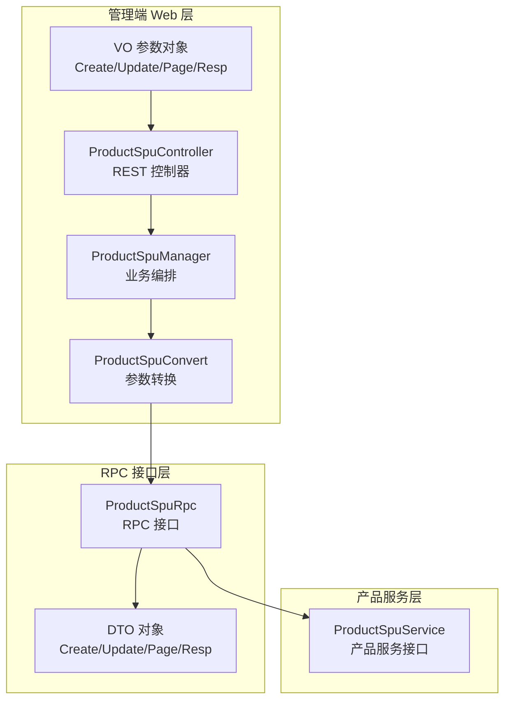
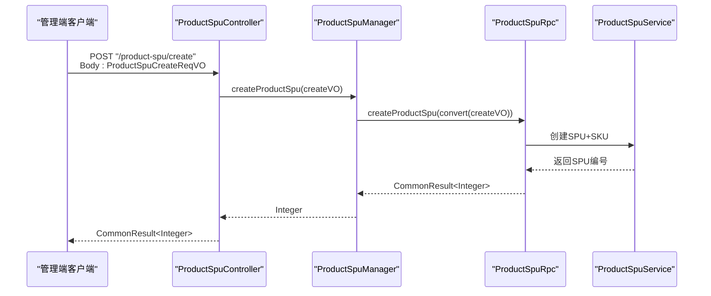
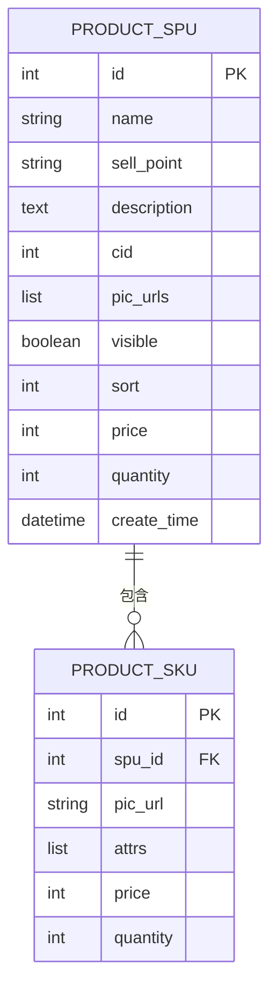
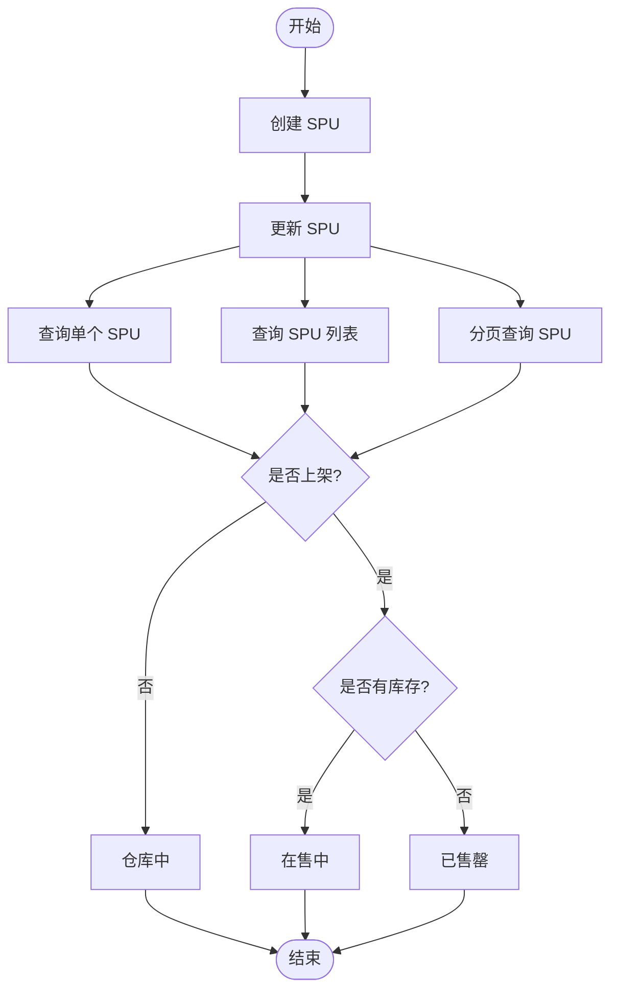

# SPU管理

<cite>
**本文引用的文件**
- [ProductSpuController.java](file://management-web-app/src/main/java/cn/iocoder/mall/managementweb/controller/product/ProductSpuController.java)
- [ProductSpuCreateReqVO.java](file://management-web-app/src/main/java/cn/iocoder/mall/managementweb/controller/product/vo/spu/ProductSpuCreateReqVO.java)
- [ProductSpuUpdateReqVO.java](file://management-web-app/src/main/java/cn/iocoder/mall/managementweb/controller/product/vo/spu/ProductSpuUpdateReqVO.java)
- [ProductSpuPageReqVO.java](file://management-web-app/src/main/java/cn/iocoder/mall/managementweb/controller/product/vo/spu/ProductSpuPageReqVO.java)
- [ProductSpuRespVO.java](file://management-web-app/src/main/java/cn/iocoder/mall/managementweb/controller/product/vo/spu/ProductSpuRespVO.java)
- [ProductSpuManager.java](file://management-web-app/src/main/java/cn/iocoder/mall/managementweb/manager/product/ProductSpuManager.java)
- [ProductSpuConvert.java](file://management-web-app/src/main/java/cn/iocoder/mall/managementweb/convert/product/ProductSpuConvert.java)
- [ProductSpuRpc.java](file://product-service-project/product-service-api/src/main/java/cn/iocoder/mall/productservice/rpc/spu/ProductSpuRpc.java)
- [ProductSpuAndSkuCreateReqDTO.java](file://product-service-project/product-service-api/src/main/java/cn/iocoder/mall/productservice/rpc/spu/dto/ProductSpuAndSkuCreateReqDTO.java)
- [ProductSpuAndSkuUpdateReqDTO.java](file://product-service-project/product-service-api/src/main/java/cn/iocoder/mall/productservice/rpc/spu/dto/ProductSpuAndSkuUpdateReqDTO.java)
- [ProductSpuPageReqDTO.java](file://product-service-project/product-service-api/src/main/java/cn/iocoder/mall/productservice/rpc/spu/dto/ProductSpuPageReqDTO.java)
- [ProductSpuRespDTO.java](file://product-service-project/product-service-api/src/main/java/cn/iocoder/mall/productservice/rpc/spu/dto/ProductSpuRespDTO.java)
- [ProductSpuService.java](file://moved/product/product-service-api/src/main/java/cn/iocoder/mall/product/api/ProductSpuService.java)
- [ProductSpuDetailBO.java](file://moved/product/product-service-api/src/main/java/cn/iocoder/mall/product/api/bo/ProductSpuDetailBO.java)
</cite>

## 目录
1. [引言](#引言)
2. [项目结构](#项目结构)
3. [核心组件](#核心组件)
4. [架构总览](#架构总览)
5. [详细组件分析](#详细组件分析)
6. [依赖分析](#依赖分析)
7. [性能考虑](#性能考虑)
8. [故障排查指南](#故障排查指南)
9. [结论](#结论)
10. [附录](#附录)

## 引言
本技术文档围绕SPU（标准商品单元）管理功能进行系统化梳理，目标是帮助开发者快速理解并实现SPU在电商系统中的概念、数据模型、RPC接口设计以及生命周期管理。SPU代表“标准化的商品单元”，用于抽象同一商品的不同SKU（库存量单位）。通过SPU+SKU的组合，系统可以统一管理商品的基础属性与卖点描述，并由SKU承载价格、库存、规格等可变信息。

## 项目结构
SPU管理涉及三层：Web层控制器、管理器（Manager）与RPC层（产品服务）。Web层负责HTTP请求接收与响应封装；Manager负责参数校验后的调用RPC；RPC层对接产品服务，完成持久化与业务处理。

图表来源
- [ProductSpuController.java:22-75](file://management-web-app/src/main/java/cn/iocoder/mall/managementweb/controller/product/ProductSpuController.java#L22-L75)
- [ProductSpuManager.java:17-85](file://management-web-app/src/main/java/cn/iocoder/mall/managementweb/manager/product/ProductSpuManager.java#L17-L85)
- [ProductSpuConvert.java:17-35](file://management-web-app/src/main/java/cn/iocoder/mall/managementweb/convert/product/ProductSpuConvert.java#L17-L35)
- [ProductSpuRpc.java:10-66](file://product-service-project/product-service-api/src/main/java/cn/iocoder/mall/productservice/rpc/spu/ProductSpuRpc.java#L10-L66)
- [ProductSpuAndSkuCreateReqDTO.java:13-91](file://product-service-project/product-service-api/src/main/java/cn/iocoder/mall/productservice/rpc/spu/dto/ProductSpuAndSkuCreateReqDTO.java#L13-L91)
- [ProductSpuAndSkuUpdateReqDTO.java:13-97](file://product-service-project/product-service-api/src/main/java/cn/iocoder/mall/productservice/rpc/spu/dto/ProductSpuAndSkuUpdateReqDTO.java#L13-L97)
- [ProductSpuPageReqDTO.java:8-34](file://product-service-project/product-service-api/src/main/java/cn/iocoder/mall/productservice/rpc/spu/dto/ProductSpuPageReqDTO.java#L8-L34)
- [ProductSpuRespDTO.java:10-63](file://product-service-project/product-service-api/src/main/java/cn/iocoder/mall/productservice/rpc/spu/dto/ProductSpuRespDTO.java#L10-L63)
- [ProductSpuService.java:12-27](file://moved/product/product-service-api/src/main/java/cn/iocoder/mall/product/api/ProductSpuService.java#L12-L27)

章节来源
- [ProductSpuController.java:22-75](file://management-web-app/src/main/java/cn/iocoder/mall/managementweb/controller/product/ProductSpuController.java#L22-L75)
- [ProductSpuManager.java:17-85](file://management-web-app/src/main/java/cn/iocoder/mall/managementweb/manager/product/ProductSpuManager.java#L17-L85)
- [ProductSpuConvert.java:17-35](file://management-web-app/src/main/java/cn/iocoder/mall/managementweb/convert/product/ProductSpuConvert.java#L17-L35)
- [ProductSpuRpc.java:10-66](file://product-service-project/product-service-api/src/main/java/cn/iocoder/mall/productservice/rpc/spu/ProductSpuRpc.java#L10-L66)

## 核心组件
- 控制器层：提供REST接口，负责入参校验、调用管理器并返回统一结果。
- 管理器层：封装RPC调用，进行异常检查与结果转换。
- 转换层：使用MapStruct将VO转换为DTO，确保参数边界清晰。
- RPC接口层：定义SPU的创建、更新、查询、分页等RPC方法。
- DTO/BO层：承载SPU与SKU的传输与业务对象。

章节来源
- [ProductSpuController.java:22-75](file://management-web-app/src/main/java/cn/iocoder/mall/managementweb/controller/product/ProductSpuController.java#L22-L75)
- [ProductSpuManager.java:17-85](file://management-web-app/src/main/java/cn/iocoder/mall/managementweb/manager/product/ProductSpuManager.java#L17-L85)
- [ProductSpuConvert.java:17-35](file://management-web-app/src/main/java/cn/iocoder/mall/managementweb/convert/product/ProductSpuConvert.java#L17-L35)
- [ProductSpuRpc.java:10-66](file://product-service-project/product-service-api/src/main/java/cn/iocoder/mall/productservice/rpc/spu/ProductSpuRpc.java#L10-L66)

## 架构总览
SPU管理采用“Web层 → 管理器 → RPC → 服务”的分层架构。Web层接收HTTP请求，参数对象VO负责校验；管理器通过Dubbo调用RPC接口，RPC接口与产品服务交互；最终返回统一的结果包装。

图表来源
- [ProductSpuController.java:34-38](file://management-web-app/src/main/java/cn/iocoder/mall/managementweb/controller/product/ProductSpuController.java#L34-L38)
- [ProductSpuManager.java:32-36](file://management-web-app/src/main/java/cn/iocoder/mall/managementweb/manager/product/ProductSpuManager.java#L32-L36)
- [ProductSpuRpc.java:21](file://product-service-project/product-service-api/src/main/java/cn/iocoder/mall/productservice/rpc/spu/ProductSpuRpc.java#L21)
- [ProductSpuAndSkuCreateReqDTO.java:13-91](file://product-service-project/product-service-api/src/main/java/cn/iocoder/mall/productservice/rpc/spu/dto/ProductSpuAndSkuCreateReqDTO.java#L13-L91)

## 详细组件分析

### 数据模型设计
SPU基础信息与SKU集合构成完整的商品模型。基础信息包括名称、卖点、描述、分类、主图、是否上架、排序、价格与库存等；SKU包含规格值、价格、库存等。

图表来源
- [ProductSpuRespDTO.java:10-63](file://product-service-project/product-service-api/src/main/java/cn/iocoder/mall/productservice/rpc/spu/dto/ProductSpuRespDTO.java#L10-L63)
- [ProductSpuDetailBO.java:9-107](file://moved/product/product-service-api/src/main/java/cn/iocoder/mall/product/api/bo/ProductSpuDetailBO.java#L9-L107)

章节来源
- [ProductSpuRespDTO.java:10-63](file://product-service-project/product-service-api/src/main/java/cn/iocoder/mall/productservice/rpc/spu/dto/ProductSpuRespDTO.java#L10-L63)
- [ProductSpuDetailBO.java:9-107](file://moved/product/product-service-api/src/main/java/cn/iocoder/mall/product/api/bo/ProductSpuDetailBO.java#L9-L107)

### SPU与SKU的关系与区别
- SPU：抽象出商品的共性特征，如名称、卖点、主图、分类等，不直接绑定库存与价格。
- SKU：具体可购买的规格组合，如颜色、尺寸等，携带价格与库存。
- 关系：一个SPU可包含多个SKU，SKU属于SPU。

章节来源
- [ProductSpuDetailBO.java:65-104](file://moved/product/product-service-api/src/main/java/cn/iocoder/mall/product/api/bo/ProductSpuDetailBO.java#L65-L104)
- [ProductSpuAndSkuCreateReqDTO.java:20-90](file://product-service-project/product-service-api/src/main/java/cn/iocoder/mall/productservice/rpc/spu/dto/ProductSpuAndSkuCreateReqDTO.java#L20-L90)

### 生命周期管理
- 创建：接收SPU基础信息与SKU数组，校验必填项后提交RPC创建。
- 更新：支持对SPU基础信息与SKU数组的更新，RPC层执行变更。
- 查询：支持按单个ID、批量ID、分页查询。
- 上下架：通过visible字段控制是否上架；结合hasQuantity可区分在售中与已售罄。

图表来源
- [ProductSpuController.java:34-75](file://management-web-app/src/main/java/cn/iocoder/mall/managementweb/controller/product/ProductSpuController.java#L34-L75)
- [ProductSpuPageReqVO.java:12-24](file://management-web-app/src/main/java/cn/iocoder/mall/managementweb/controller/product/vo/spu/ProductSpuPageReqVO.java#L12-L24)

章节来源
- [ProductSpuController.java:34-75](file://management-web-app/src/main/java/cn/iocoder/mall/managementweb/controller/product/ProductSpuController.java#L34-L75)
- [ProductSpuPageReqVO.java:12-24](file://management-web-app/src/main/java/cn/iocoder/mall/managementweb/controller/product/vo/spu/ProductSpuPageReqVO.java#L12-L24)

### RPC接口设计
- 创建SPU：入参为包含SPU基础信息与SKU数组的DTO，返回SPU编号。
- 更新SPU：入参为包含SPU编号与基础信息、SKU数组的DTO，返回布尔成功标记。
- 获取SPU：按ID查询SPU详情。
- 批量查询：按ID集合查询SPU列表。
- 分页查询：支持按名称、分类、是否上架、是否有库存等条件分页。

章节来源
- [ProductSpuRpc.java:10-66](file://product-service-project/product-service-api/src/main/java/cn/iocoder/mall/productservice/rpc/spu/ProductSpuRpc.java#L10-L66)
- [ProductSpuAndSkuCreateReqDTO.java:13-91](file://product-service-project/product-service-api/src/main/java/cn/iocoder/mall/productservice/rpc/spu/dto/ProductSpuAndSkuCreateReqDTO.java#L13-L91)
- [ProductSpuAndSkuUpdateReqDTO.java:13-97](file://product-service-project/product-service-api/src/main/java/cn/iocoder/mall/productservice/rpc/spu/dto/ProductSpuAndSkuUpdateReqDTO.java#L13-L97)
- [ProductSpuPageReqDTO.java:8-34](file://product-service-project/product-service-api/src/main/java/cn/iocoder/mall/productservice/rpc/spu/dto/ProductSpuPageReqDTO.java#L8-L34)
- [ProductSpuRespDTO.java:10-63](file://product-service-project/product-service-api/src/main/java/cn/iocoder/mall/productservice/rpc/spu/dto/ProductSpuRespDTO.java#L10-L63)

### 参数与返回值规范
- 创建请求VO（Web层）：包含SPU基础信息与SKU数组，字段校验严格。
- 更新请求VO（Web层）：包含SPU编号与基础信息、SKU数组。
- 分页请求VO（Web层）：支持名称、分类、是否上架、是否有库存筛选。
- 响应VO（Web层）：包含SPU基础信息、价格、库存、创建时间等。
- DTO（RPC层）：与VO对应，用于跨进程传输。

章节来源
- [ProductSpuCreateReqVO.java:14-74](file://management-web-app/src/main/java/cn/iocoder/mall/managementweb/controller/product/vo/spu/ProductSpuCreateReqVO.java#L14-L74)
- [ProductSpuUpdateReqVO.java:14-78](file://management-web-app/src/main/java/cn/iocoder/mall/managementweb/controller/product/vo/spu/ProductSpuUpdateReqVO.java#L14-L78)
- [ProductSpuPageReqVO.java:9-24](file://management-web-app/src/main/java/cn/iocoder/mall/managementweb/controller/product/vo/spu/ProductSpuPageReqVO.java#L9-L24)
- [ProductSpuRespVO.java:7-35](file://management-web-app/src/main/java/cn/iocoder/mall/managementweb/controller/product/vo/spu/ProductSpuRespVO.java#L7-L35)
- [ProductSpuAndSkuCreateReqDTO.java:13-91](file://product-service-project/product-service-api/src/main/java/cn/iocoder/mall/productservice/rpc/spu/dto/ProductSpuAndSkuCreateReqDTO.java#L13-L91)
- [ProductSpuAndSkuUpdateReqDTO.java:13-97](file://product-service-project/product-service-api/src/main/java/cn/iocoder/mall/productservice/rpc/spu/dto/ProductSpuAndSkuUpdateReqDTO.java#L13-L97)
- [ProductSpuPageReqDTO.java:8-34](file://product-service-project/product-service-api/src/main/java/cn/iocoder/mall/productservice/rpc/spu/dto/ProductSpuPageReqDTO.java#L8-L34)
- [ProductSpuRespDTO.java:10-63](file://product-service-project/product-service-api/src/main/java/cn/iocoder/mall/productservice/rpc/spu/dto/ProductSpuRespDTO.java#L10-L63)

### 状态管理与业务规则
- 审核流程：当前代码未体现显式的审核状态字段或流转逻辑，可见性由visible控制。
- 库存关联：SPU层聚合SKU的最低价格与总库存，用于前端展示与筛选。
- 价格管理：SPU层记录最低价格，SKU层维护各自价格与库存。
- 上下架策略：visible=true且hasQuantity=true表示在售中；visible=true且hasQuantity=false表示已售罄；visible=false表示仓库中。

章节来源
- [ProductSpuController.java:61-69](file://management-web-app/src/main/java/cn/iocoder/mall/managementweb/controller/product/ProductSpuController.java#L61-L69)
- [ProductSpuPageReqVO.java:18-21](file://management-web-app/src/main/java/cn/iocoder/mall/managementweb/controller/product/vo/spu/ProductSpuPageReqVO.java#L18-L21)
- [ProductSpuRespDTO.java:42-60](file://product-service-project/product-service-api/src/main/java/cn/iocoder/mall/productservice/rpc/spu/dto/ProductSpuRespDTO.java#L42-L60)

### 实际使用场景
- 新品上架：填写SPU基础信息与SKU数组，提交创建请求，系统返回SPU编号。
- 商品编辑：修改SPU基础信息与SKU数组，提交更新请求。
- 批量查询：根据SPU ID列表一次性获取多个SPU详情。
- 条件分页：按名称模糊、分类、是否上架、是否有库存进行分页检索。

章节来源
- [ProductSpuController.java:34-75](file://management-web-app/src/main/java/cn/iocoder/mall/managementweb/controller/product/ProductSpuController.java#L34-L75)
- [ProductSpuManager.java:32-82](file://management-web-app/src/main/java/cn/iocoder/mall/managementweb/manager/product/ProductSpuManager.java#L32-L82)

## 依赖分析
- 控制器依赖管理器；管理器通过Dubbo引用RPC接口；转换层负责VO与DTO映射；RPC接口与产品服务交互。
- Web层与RPC层通过DTO解耦，便于扩展与测试。

图表来源
- [ProductSpuController.java:22-75](file://management-web-app/src/main/java/cn/iocoder/mall/managementweb/controller/product/ProductSpuController.java#L22-L75)
- [ProductSpuManager.java:17-85](file://management-web-app/src/main/java/cn/iocoder/mall/managementweb/manager/product/ProductSpuManager.java#L17-L85)
- [ProductSpuConvert.java:17-35](file://management-web-app/src/main/java/cn/iocoder/mall/managementweb/convert/product/ProductSpuConvert.java#L17-L35)
- [ProductSpuRpc.java:10-66](file://product-service-project/product-service-api/src/main/java/cn/iocoder/mall/productservice/rpc/spu/ProductSpuRpc.java#L10-L66)
- [ProductSpuService.java:12-27](file://moved/product/product-service-api/src/main/java/cn/iocoder/mall/product/api/ProductSpuService.java#L12-L27)

章节来源
- [ProductSpuController.java:22-75](file://management-web-app/src/main/java/cn/iocoder/mall/managementweb/controller/product/ProductSpuController.java#L22-L75)
- [ProductSpuManager.java:17-85](file://management-web-app/src/main/java/cn/iocoder/mall/managementweb/manager/product/ProductSpuManager.java#L17-L85)
- [ProductSpuConvert.java:17-35](file://management-web-app/src/main/java/cn/iocoder/mall/managementweb/convert/product/ProductSpuConvert.java#L17-L35)
- [ProductSpuRpc.java:10-66](file://product-service-project/product-service-api/src/main/java/cn/iocoder/mall/productservice/rpc/spu/ProductSpuRpc.java#L10-L66)
- [ProductSpuService.java:12-27](file://moved/product/product-service-api/src/main/java/cn/iocoder/mall/product/api/ProductSpuService.java#L12-L27)

## 性能考虑
- 分页查询：建议在RPC层实现索引与过滤条件优化，避免全表扫描。
- 批量查询：合理限制批量大小，防止内存压力过大。
- DTO转换：使用MapStruct减少反射与手动映射开销。
- 缓存策略：对热点SPU详情可引入缓存，降低RPC调用频次。

## 故障排查指南
- 参数校验失败：检查VO字段注解与必填项，确保请求体符合约束。
- RPC调用异常：确认Dubbo引用版本配置与服务可用性。
- 结果转换异常：检查转换接口映射关系与空值处理。
- 删除操作缺失：当前代码未提供删除接口，若需删除请评估关联影响。

章节来源
- [ProductSpuCreateReqVO.java:14-74](file://management-web-app/src/main/java/cn/iocoder/mall/managementweb/controller/product/vo/spu/ProductSpuCreateReqVO.java#L14-L74)
- [ProductSpuUpdateReqVO.java:14-78](file://management-web-app/src/main/java/cn/iocoder/mall/managementweb/controller/product/vo/spu/ProductSpuUpdateReqVO.java#L14-L78)
- [ProductSpuManager.java:32-82](file://management-web-app/src/main/java/cn/iocoder/mall/managementweb/manager/product/ProductSpuManager.java#L32-L82)

## 结论
本文从概念、数据模型、RPC接口、生命周期与状态规则等方面系统梳理了SPU管理能力，明确了Web层、管理器与RPC层的职责划分与协作方式。基于此设计，开发者可快速实现SPU的创建、更新、查询与分页等核心功能，并在此基础上扩展审核、库存与价格管理等高级特性。

## 附录
- 示例路径参考
  - 创建SPU请求：[ProductSpuCreateReqVO.java:14-74](file://management-web-app/src/main/java/cn/iocoder/mall/managementweb/controller/product/vo/spu/ProductSpuCreateReqVO.java#L14-L74)
  - 更新SPU请求：[ProductSpuUpdateReqVO.java:14-78](file://management-web-app/src/main/java/cn/iocoder/mall/managementweb/controller/product/vo/spu/ProductSpuUpdateReqVO.java#L14-L78)
  - 分页查询请求：[ProductSpuPageReqVO.java:9-24](file://management-web-app/src/main/java/cn/iocoder/mall/managementweb/controller/product/vo/spu/ProductSpuPageReqVO.java#L9-L24)
  - 响应对象：[ProductSpuRespVO.java:7-35](file://management-web-app/src/main/java/cn/iocoder/mall/managementweb/controller/product/vo/spu/ProductSpuRespVO.java#L7-L35)
  - RPC接口定义：[ProductSpuRpc.java:10-66](file://product-service-project/product-service-api/src/main/java/cn/iocoder/mall/productservice/rpc/spu/ProductSpuRpc.java#L10-L66)
  - DTO对象：[ProductSpuAndSkuCreateReqDTO.java:13-91](file://product-service-project/product-service-api/src/main/java/cn/iocoder/mall/productservice/rpc/spu/dto/ProductSpuAndSkuCreateReqDTO.java#L13-L91)，[ProductSpuAndSkuUpdateReqDTO.java:13-97](file://product-service-project/product-service-api/src/main/java/cn/iocoder/mall/productservice/rpc/spu/dto/ProductSpuAndSkuUpdateReqDTO.java#L13-L97)，[ProductSpuPageReqDTO.java:8-34](file://product-service-project/product-service-api/src/main/java/cn/iocoder/mall/productservice/rpc/spu/dto/ProductSpuPageReqDTO.java#L8-L34)，[ProductSpuRespDTO.java:10-63](file://product-service-project/product-service-api/src/main/java/cn/iocoder/mall/productservice/rpc/spu/dto/ProductSpuRespDTO.java#L10-L63)
  - 产品服务接口：[ProductSpuService.java:12-27](file://moved/product/product-service-api/src/main/java/cn/iocoder/mall/product/api/ProductSpuService.java#L12-L27)
  - 产品SPU明细BO：[ProductSpuDetailBO.java:9-107](file://moved/product/product-service-api/src/main/java/cn/iocoder/mall/product/api/bo/ProductSpuDetailBO.java#L9-L107)