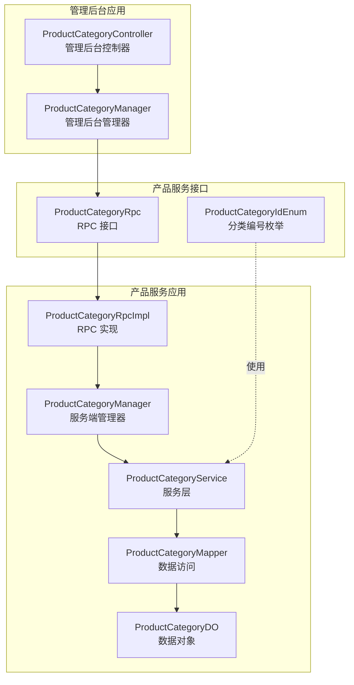
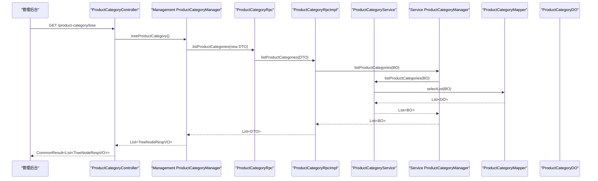
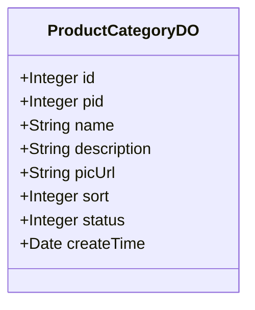
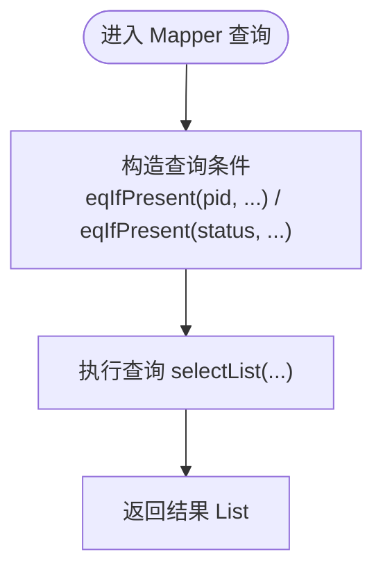
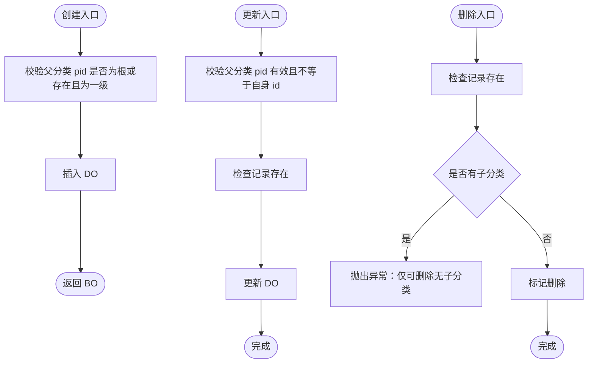
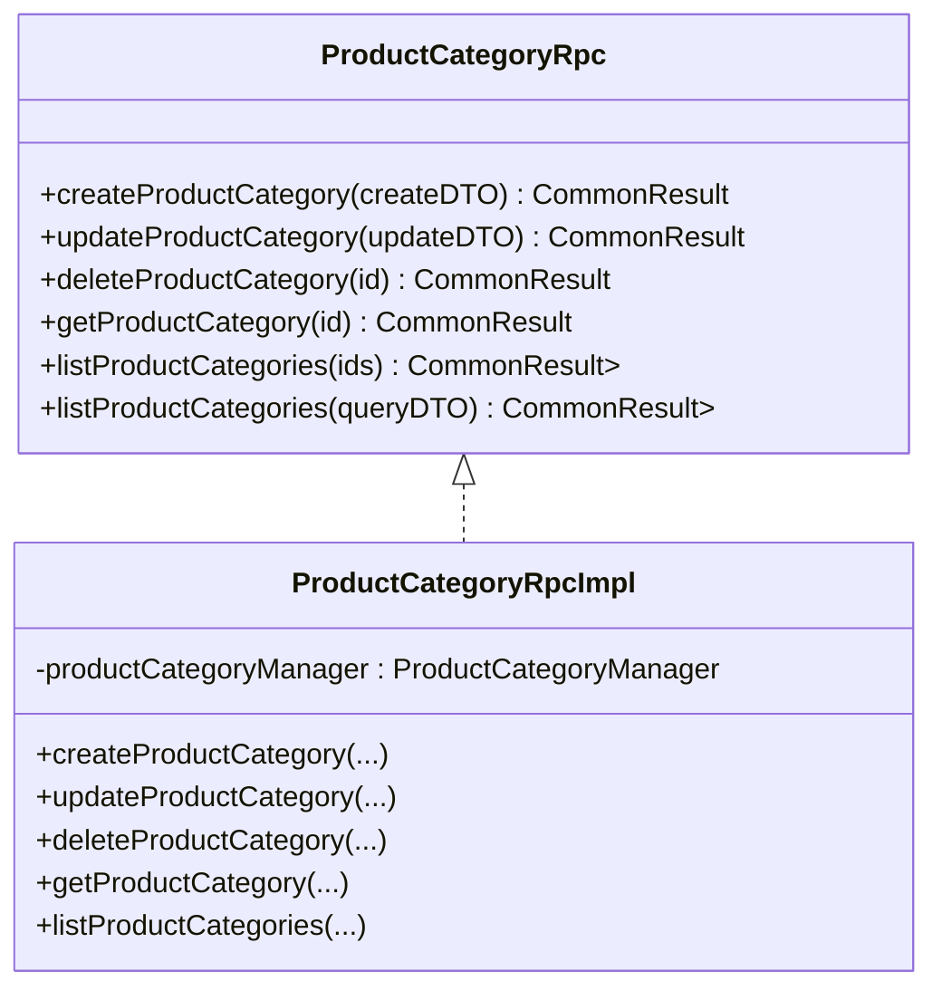
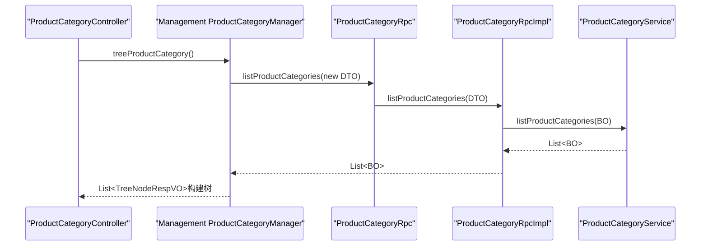
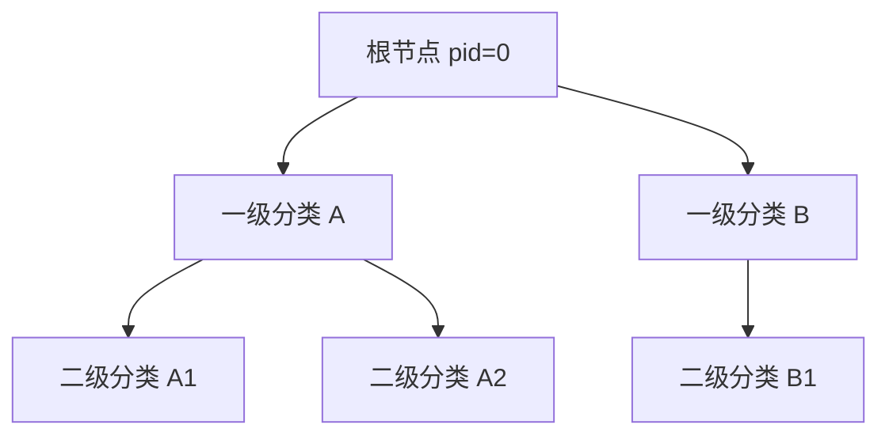
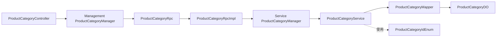

# 分类管理

<cite>
**本文引用的文件**
- [ProductCategoryDO.java](file://product-service-project/product-service-app/src/main/java/cn/iocoder/mall/productservice/dal/mysql/dataobject/category/ProductCategoryDO.java)
- [ProductCategoryMapper.java](file://product-service-project/product-service-app/src/main/java/cn/iocoder/mall/productservice/dal/mysql/mapper/category/ProductCategoryMapper.java)
- [ProductCategoryService.java](file://product-service-project/product-service-app/src/main/java/cn/iocoder/mall/productservice/service/category/ProductCategoryService.java)
- [ProductCategoryManager.java（服务端）](file://product-service-project/product-service-app/src/main/java/cn/iocoder/mall/productservice/manager/category/ProductCategoryManager.java)
- [ProductCategoryRpc.java](file://product-service-project/product-service-api/src/main/java/cn/iocoder/mall/productservice/rpc/category/ProductCategoryRpc.java)
- [ProductCategoryRpcImpl.java](file://product-service-project/product-service-app/src/main/java/cn/iocoder/mall/productservice/rpc/category/ProductCategoryRpcImpl.java)
- [ProductCategoryBO.java](file://product-service-project/product-service-app/src/main/java/cn/iocoder/mall/productservice/service/category/bo/ProductCategoryBO.java)
- [ProductCategoryIdEnum.java](file://product-service-project/product-service-api/src/main/java/cn/iocoder/mall/productservice/enums/category/ProductCategoryIdEnum.java)
- [ProductCategoryController.java](file://management-web-app/src/main/java/cn/iocoder/mall/managementweb/controller/product/ProductCategoryController.java)
- [ProductCategoryManager.java（管理后台）](file://management-web-app/src/main/java/cn/iocoder/mall/managementweb/manager/product/ProductCategoryManager.java)
- [ProductCategoryTreeNodeRespVO.java](file://management-web-app/src/main/java/cn/iocoder/mall/managementweb/controller/product/vo/category/ProductCategoryTreeNodeRespVO.java)
</cite>

## 目录
1. [简介](#简介)
2. [项目结构](#项目结构)
3. [核心组件](#核心组件)
4. [架构总览](#架构总览)
5. [详细组件分析](#详细组件分析)
6. [依赖分析](#依赖分析)
7. [性能考虑](#性能考虑)
8. [故障排查指南](#故障排查指南)
9. [结论](#结论)
10. [附录](#附录)

## 简介
本技术文档围绕“商品分类管理”功能展开，系统性阐述分类体系的设计理念、树形结构实现原理、层级关系管理、增删改查流程、与商品的关联关系、业务规则（状态、排序、显示控制）、RPC 接口设计（列表查询、树形获取、批量操作），以及在搜索、导航菜单、页面展示等场景的应用。文档以代码为依据，辅以可视化图示，帮助开发者快速理解并正确使用该能力。

## 项目结构
商品分类相关代码主要分布在以下模块：
- 后端服务层：product-service-app（数据访问、服务、RPC 实现）
- 接口定义层：product-service-api（RPC 接口、枚举）
- 管理后台应用：management-web-app（控制器、管理器、VO）

图表来源
- [ProductCategoryController.java:1-65](file://management-web-app/src/main/java/cn/iocoder/mall/managementweb/controller/product/ProductCategoryController.java#L1-L65)
- [ProductCategoryManager.java（管理后台）:1-107](file://management-web-app/src/main/java/cn/iocoder/mall/managementweb/manager/product/ProductCategoryManager.java#L1-L107)
- [ProductCategoryRpcImpl.java:1-59](file://product-service-project/product-service-app/src/main/java/cn/iocoder/mall/productservice/rpc/category/ProductCategoryRpcImpl.java#L1-L59)
- [ProductCategoryManager.java（服务端）:1-88](file://product-service-project/product-service-app/src/main/java/cn/iocoder/mall/productservice/manager/category/ProductCategoryManager.java#L1-L88)
- [ProductCategoryService.java:1-136](file://product-service-project/product-service-app/src/main/java/cn/iocoder/mall/productservice/service/category/ProductCategoryService.java#L1-L136)
- [ProductCategoryMapper.java:1-25](file://product-service-project/product-service-app/src/main/java/cn/iocoder/mall/productservice/dal/mysql/mapper/category/ProductCategoryMapper.java#L1-L25)
- [ProductCategoryDO.java:1-53](file://product-service-project/product-service-app/src/main/java/cn/iocoder/mall/productservice/dal/mysql/dataobject/category/ProductCategoryDO.java#L1-L53)
- [ProductCategoryRpc.java:1-63](file://product-service-project/product-service-api/src/main/java/cn/iocoder/mall/productservice/rpc/category/ProductCategoryRpc.java#L1-L63)
- [ProductCategoryIdEnum.java:1-24](file://product-service-project/product-service-api/src/main/java/cn/iocoder/mall/productservice/enums/category/ProductCategoryIdEnum.java#L1-L24)

章节来源
- [ProductCategoryController.java:1-65](file://management-web-app/src/main/java/cn/iocoder/mall/managementweb/controller/product/ProductCategoryController.java#L1-L65)
- [ProductCategoryManager.java（管理后台）:1-107](file://management-web-app/src/main/java/cn/iocoder/mall/managementweb/manager/product/ProductCategoryManager.java#L1-L107)
- [ProductCategoryRpcImpl.java:1-59](file://product-service-project/product-service-app/src/main/java/cn/iocoder/mall/productservice/rpc/category/ProductCategoryRpcImpl.java#L1-L59)
- [ProductCategoryManager.java（服务端）:1-88](file://product-service-project/product-service-app/src/main/java/cn/iocoder/mall/productservice/manager/category/ProductCategoryManager.java#L1-L88)
- [ProductCategoryService.java:1-136](file://product-service-project/product-service-app/src/main/java/cn/iocoder/mall/productservice/service/category/ProductCategoryService.java#L1-L136)
- [ProductCategoryMapper.java:1-25](file://product-service-project/product-service-app/src/main/java/cn/iocoder/mall/productservice/dal/mysql/mapper/category/ProductCategoryMapper.java#L1-L25)
- [ProductCategoryDO.java:1-53](file://product-service-project/product-service-app/src/main/java/cn/iocoder/mall/productservice/dal/mysql/dataobject/category/ProductCategoryDO.java#L1-L53)
- [ProductCategoryRpc.java:1-63](file://product-service-project/product-service-api/src/main/java/cn/iocoder/mall/productservice/rpc/category/ProductCategoryRpc.java#L1-L63)
- [ProductCategoryIdEnum.java:1-24](file://product-service-project/product-service-api/src/main/java/cn/iocoder/mall/productservice/enums/category/ProductCategoryIdEnum.java#L1-L24)

## 核心组件
- 数据模型（DO）：商品分类的数据持久化载体，包含主键、父分类、名称、描述、图片、排序、状态、创建时间等字段。
- Mapper：提供按条件查询、计数、批量查询等基础能力。
- Service：封装业务规则与校验，如父分类有效性、不可自指为父、仅可删除无子分类等。
- Manager（服务端）：面向 RPC 的门面，负责调用 Service 并转换 BO/DTO。
- RPC 接口与实现：定义对外统一接口，并通过 Dubbo 暴露实现。
- 管理后台控制器与管理器：提供 HTTP 接口与树形构建逻辑。
- 枚举：定义根节点编号常量，用于层级判断。

章节来源
- [ProductCategoryDO.java:1-53](file://product-service-project/product-service-app/src/main/java/cn/iocoder/mall/productservice/dal/mysql/dataobject/category/ProductCategoryDO.java#L1-L53)
- [ProductCategoryMapper.java:1-25](file://product-service-project/product-service-app/src/main/java/cn/iocoder/mall/productservice/dal/mysql/mapper/category/ProductCategoryMapper.java#L1-L25)
- [ProductCategoryService.java:1-136](file://product-service-project/product-service-app/src/main/java/cn/iocoder/mall/productservice/service/category/ProductCategoryService.java#L1-L136)
- [ProductCategoryManager.java（服务端）:1-88](file://product-service-project/product-service-app/src/main/java/cn/iocoder/mall/productservice/manager/category/ProductCategoryManager.java#L1-L88)
- [ProductCategoryRpc.java:1-63](file://product-service-project/product-service-api/src/main/java/cn/iocoder/mall/productservice/rpc/category/ProductCategoryRpc.java#L1-L63)
- [ProductCategoryRpcImpl.java:1-59](file://product-service-project/product-service-app/src/main/java/cn/iocoder/mall/productservice/rpc/category/ProductCategoryRpcImpl.java#L1-L59)
- [ProductCategoryBO.java:1-49](file://product-service-project/product-service-app/src/main/java/cn/iocoder/mall/productservice/service/category/bo/ProductCategoryBO.java#L1-L49)
- [ProductCategoryIdEnum.java:1-24](file://product-service-project/product-service-api/src/main/java/cn/iocoder/mall/productservice/enums/category/ProductCategoryIdEnum.java#L1-L24)
- [ProductCategoryController.java:1-65](file://management-web-app/src/main/java/cn/iocoder/mall/managementweb/controller/product/ProductCategoryController.java#L1-L65)
- [ProductCategoryManager.java（管理后台）:1-107](file://management-web-app/src/main/java/cn/iocoder/mall/managementweb/manager/product/ProductCategoryManager.java#L1-L107)
- [ProductCategoryTreeNodeRespVO.java:1-37](file://management-web-app/src/main/java/cn/iocoder/mall/managementweb/controller/product/vo/category/ProductCategoryTreeNodeRespVO.java#L1-L37)

## 架构总览
下图展示了从管理后台发起请求到最终返回树形结构的完整链路，以及服务内部的分层职责。

图表来源
- [ProductCategoryController.java:57-62](file://management-web-app/src/main/java/cn/iocoder/mall/managementweb/controller/product/ProductCategoryController.java#L57-L62)
- [ProductCategoryManager.java（管理后台）:66-72](file://management-web-app/src/main/java/cn/iocoder/mall/managementweb/manager/product/ProductCategoryManager.java#L66-L72)
- [ProductCategoryRpc.java:55-60](file://product-service-project/product-service-api/src/main/java/cn/iocoder/mall/productservice/rpc/category/ProductCategoryRpc.java#L55-L60)
- [ProductCategoryRpcImpl.java:48-56](file://product-service-project/product-service-app/src/main/java/cn/iocoder/mall/productservice/rpc/category/ProductCategoryRpcImpl.java#L48-L56)
- [ProductCategoryService.java:116-119](file://product-service-project/product-service-app/src/main/java/cn/iocoder/mall/productservice/service/category/ProductCategoryService.java#L116-L119)
- [ProductCategoryMapper.java:19-22](file://product-service-project/product-service-app/src/main/java/cn/iocoder/mall/productservice/dal/mysql/mapper/category/ProductCategoryMapper.java#L19-L22)
- [ProductCategoryDO.java:1-53](file://product-service-project/product-service-app/src/main/java/cn/iocoder/mall/productservice/dal/mysql/dataobject/category/ProductCategoryDO.java#L1-L53)

## 详细组件分析

### 数据模型与映射
- 字段设计：id、pid、name、description、picUrl、sort、status、createTime 等，满足树形结构与排序展示需求。
- 继承关系：继承通用可删除基类，便于后续软删除策略。
- 映射：MyBatis-Plus 注解标识表名与主键，简化 CRUD。

图表来源
- [ProductCategoryDO.java:14-50](file://product-service-project/product-service-app/src/main/java/cn/iocoder/mall/productservice/dal/mysql/dataobject/category/ProductCategoryDO.java#L14-L50)

章节来源
- [ProductCategoryDO.java:1-53](file://product-service-project/product-service-app/src/main/java/cn/iocoder/mall/productservice/dal/mysql/dataobject/category/ProductCategoryDO.java#L1-L53)

### Mapper 查询能力
- 计数：按父分类统计子数量，用于删除前校验。
- 列表：支持按父分类与状态过滤，便于前端按需渲染。

图表来源
- [ProductCategoryMapper.java:19-22](file://product-service-project/product-service-app/src/main/java/cn/iocoder/mall/productservice/dal/mysql/mapper/category/ProductCategoryMapper.java#L19-L22)

章节来源
- [ProductCategoryMapper.java:1-25](file://product-service-project/product-service-app/src/main/java/cn/iocoder/mall/productservice/dal/mysql/mapper/category/ProductCategoryMapper.java#L1-L25)

### 服务层业务规则与流程
- 创建：校验父分类存在且为一级分类；插入后返回 BO。
- 更新：校验父分类、禁止自指为父；检查记录存在；更新。
- 删除：检查记录存在；仅当无子分类方可删除；标记删除。
- 查询：单个、批量、全量列表；支持按条件过滤。
- 层级校验：根节点 pid=0；非根节点父必须为一级分类。

图表来源
- [ProductCategoryService.java:38-87](file://product-service-project/product-service-app/src/main/java/cn/iocoder/mall/productservice/service/category/ProductCategoryService.java#L38-L87)
- [ProductCategoryService.java:121-133](file://product-service-project/product-service-app/src/main/java/cn/iocoder/mall/productservice/service/category/ProductCategoryService.java#L121-L133)
- [ProductCategoryIdEnum.java:6-21](file://product-service-project/product-service-api/src/main/java/cn/iocoder/mall/productservice/enums/category/ProductCategoryIdEnum.java#L6-L21)

章节来源
- [ProductCategoryService.java:1-136](file://product-service-project/product-service-app/src/main/java/cn/iocoder/mall/productservice/service/category/ProductCategoryService.java#L1-L136)
- [ProductCategoryIdEnum.java:1-24](file://product-service-project/product-service-api/src/main/java/cn/iocoder/mall/productservice/enums/category/ProductCategoryIdEnum.java#L1-L24)

### RPC 接口与实现
- 接口定义：统一的创建、更新、删除、查询、列表查询方法，返回统一包装结果。
- 实现：基于 Dubbo 暴露，转发至服务端 Manager，再由 Manager 调用 Service 完成业务处理。

图表来源
- [ProductCategoryRpc.java:15-62](file://product-service-project/product-service-api/src/main/java/cn/iocoder/mall/productservice/rpc/category/ProductCategoryRpc.java#L15-L62)
- [ProductCategoryRpcImpl.java:21-58](file://product-service-project/product-service-app/src/main/java/cn/iocoder/mall/productservice/rpc/category/ProductCategoryRpcImpl.java#L21-L58)

章节来源
- [ProductCategoryRpc.java:1-63](file://product-service-project/product-service-api/src/main/java/cn/iocoder/mall/productservice/rpc/category/ProductCategoryRpc.java#L1-L63)
- [ProductCategoryRpcImpl.java:1-59](file://product-service-project/product-service-app/src/main/java/cn/iocoder/mall/productservice/rpc/category/ProductCategoryRpcImpl.java#L1-L59)

### 管理后台控制器与树形构建
- 控制器：提供 HTTP 接口，权限注解保护，返回统一结果。
- 树形构建：先拉取全量分类列表，按 sort 排序，使用 Map 建立父子关系，最后筛选根节点输出。

图表来源
- [ProductCategoryController.java:57-62](file://management-web-app/src/main/java/cn/iocoder/mall/managementweb/controller/product/ProductCategoryController.java#L57-L62)
- [ProductCategoryManager.java（管理后台）:66-104](file://management-web-app/src/main/java/cn/iocoder/mall/managementweb/manager/product/ProductCategoryManager.java#L66-L104)

章节来源
- [ProductCategoryController.java:1-65](file://management-web-app/src/main/java/cn/iocoder/mall/managementweb/controller/product/ProductCategoryController.java#L1-L65)
- [ProductCategoryManager.java（管理后台）:1-107](file://management-web-app/src/main/java/cn/iocoder/mall/managementweb/manager/product/ProductCategoryManager.java#L1-L107)
- [ProductCategoryTreeNodeRespVO.java:1-37](file://management-web-app/src/main/java/cn/iocoder/mall/managementweb/controller/product/vo/category/ProductCategoryTreeNodeRespVO.java#L1-L37)

### 树形结构设计与层级关系
- 根节点：pid=0，作为所有一级分类的父节点。
- 一级分类：pid=0 的分类。
- 二级分类：pid 指向一级分类。
- 关系维护：通过 pid 建立父子关系；排序通过 sort 字段保证稳定顺序；树构建时按 sort 排序，再根据 pid 进行挂载。
- 层级深度：当前实现限定为两级（根节点、一级分类），二级分类不允许再设子分类。

图表来源
- [ProductCategoryIdEnum.java:6-21](file://product-service-project/product-service-api/src/main/java/cn/iocoder/mall/productservice/enums/category/ProductCategoryIdEnum.java#L6-L21)
- [ProductCategoryService.java:121-133](file://product-service-project/product-service-app/src/main/java/cn/iocoder/mall/productservice/service/category/ProductCategoryService.java#L121-L133)
- [ProductCategoryManager.java（管理后台）:80-104](file://management-web-app/src/main/java/cn/iocoder/mall/managementweb/manager/product/ProductCategoryManager.java#L80-L104)

章节来源
- [ProductCategoryIdEnum.java:1-24](file://product-service-project/product-service-api/src/main/java/cn/iocoder/mall/productservice/enums/category/ProductCategoryIdEnum.java#L1-L24)
- [ProductCategoryService.java:121-133](file://product-service-project/product-service-app/src/main/java/cn/iocoder/mall/productservice/service/category/ProductCategoryService.java#L121-L133)
- [ProductCategoryManager.java（管理后台）:80-104](file://management-web-app/src/main/java/cn/iocoder/mall/managementweb/manager/product/ProductCategoryManager.java#L80-L104)

### 与商品的关联关系
- 商品所属分类：商品 SPU/ SKU 与分类存在多对一或一对多的关联关系（具体实体不在本文引用范围内，但分类作为商品检索与展示的关键维度，应与商品表维护外键或中间表）。
- 分类筛选：通过分类 id 或树形路径进行商品筛选与聚合。
- 商品搜索：分类作为搜索过滤条件之一，结合标题、品牌、价格等维度综合检索。
- 导航与页面展示：分类树用于前台导航菜单、面包屑、分类页等场景。

[本节为概念性说明，不直接分析具体文件，故不附加章节来源]

### 业务规则
- 状态管理：使用通用状态枚举，支持启用/禁用。
- 排序规则：通过 sort 字段控制同级排序；树构建时按 sort 排序。
- 显示控制：状态为启用时才参与展示；图片通常仅根分类配置。
- 删除约束：仅允许删除无子分类的节点，防止破坏树形完整性。

章节来源
- [ProductCategoryDO.java:46-50](file://product-service-project/product-service-app/src/main/java/cn/iocoder/mall/productservice/dal/mysql/dataobject/category/ProductCategoryDO.java#L46-L50)
- [ProductCategoryService.java:74-87](file://product-service-project/product-service-app/src/main/java/cn/iocoder/mall/productservice/service/category/ProductCategoryService.java#L74-L87)
- [ProductCategoryManager.java（管理后台）:80-104](file://management-web-app/src/main/java/cn/iocoder/mall/managementweb/manager/product/ProductCategoryManager.java#L80-L104)

### RPC 接口设计与应用场景
- 接口清单
  - 创建：传入创建 DTO，返回分类编号。
  - 更新：传入更新 DTO，返回布尔成功。
  - 删除：传入分类编号，返回布尔成功。
  - 单个查询：传入分类编号，返回 DTO。
  - 批量查询：传入编号集合，返回 DTO 列表。
  - 条件查询：传入查询 DTO（含父分类、状态等），返回 DTO 列表。
- 应用场景
  - 管理后台：分类树展示、新增/编辑/删除。
  - 商品搜索：按分类筛选商品。
  - 导航菜单：渲染两级分类导航。
  - 页面展示：分类详情页、分类聚合页。

章节来源
- [ProductCategoryRpc.java:15-62](file://product-service-project/product-service-api/src/main/java/cn/iocoder/mall/productservice/rpc/category/ProductCategoryRpc.java#L15-L62)
- [ProductCategoryRpcImpl.java:26-56](file://product-service-project/product-service-app/src/main/java/cn/iocoder/mall/productservice/rpc/category/ProductCategoryRpcImpl.java#L26-L56)
- [ProductCategoryController.java:33-62](file://management-web-app/src/main/java/cn/iocoder/mall/managementweb/controller/product/ProductCategoryController.java#L33-L62)

## 依赖分析
- 控制器依赖管理器，管理器依赖 RPC 接口；RPC 实现依赖服务端管理器；服务端管理器依赖服务层；服务层依赖 Mapper；Mapper 依赖 DO。
- 枚举被服务层用于层级校验。
- 管理后台 VO 与 RPC DTO 通过转换器在不同层之间传递。

图表来源
- [ProductCategoryController.java:30-31](file://management-web-app/src/main/java/cn/iocoder/mall/managementweb/controller/product/ProductCategoryController.java#L30-L31)
- [ProductCategoryManager.java（管理后台）:26-27](file://management-web-app/src/main/java/cn/iocoder/mall/managementweb/manager/product/ProductCategoryManager.java#L26-L27)
- [ProductCategoryRpcImpl.java:23-24](file://product-service-project/product-service-app/src/main/java/cn/iocoder/mall/productservice/rpc/category/ProductCategoryRpcImpl.java#L23-L24)
- [ProductCategoryService.java:29-30](file://product-service-project/product-service-app/src/main/java/cn/iocoder/mall/productservice/service/category/ProductCategoryService.java#L29-L30)
- [ProductCategoryMapper.java:12-13](file://product-service-project/product-service-app/src/main/java/cn/iocoder/mall/productservice/dal/mysql/mapper/category/ProductCategoryMapper.java#L12-L13)
- [ProductCategoryDO.java:14-24](file://product-service-project/product-service-app/src/main/java/cn/iocoder/mall/productservice/dal/mysql/dataobject/category/ProductCategoryDO.java#L14-L24)
- [ProductCategoryIdEnum.java:6-21](file://product-service-project/product-service-api/src/main/java/cn/iocoder/mall/productservice/enums/category/ProductCategoryIdEnum.java#L6-L21)

章节来源
- [ProductCategoryController.java:1-65](file://management-web-app/src/main/java/cn/iocoder/mall/managementweb/controller/product/ProductCategoryController.java#L1-L65)
- [ProductCategoryManager.java（管理后台）:1-107](file://management-web-app/src/main/java/cn/iocoder/mall/managementweb/manager/product/ProductCategoryManager.java#L1-L107)
- [ProductCategoryRpcImpl.java:1-59](file://product-service-project/product-service-app/src/main/java/cn/iocoder/mall/productservice/rpc/category/ProductCategoryRpcImpl.java#L1-L59)
- [ProductCategoryService.java:1-136](file://product-service-project/product-service-app/src/main/java/cn/iocoder/mall/productservice/service/category/ProductCategoryService.java#L1-L136)
- [ProductCategoryMapper.java:1-25](file://product-service-project/product-service-app/src/main/java/cn/iocoder/mall/productservice/dal/mysql/mapper/category/ProductCategoryMapper.java#L1-L25)
- [ProductCategoryDO.java:1-53](file://product-service-project/product-service-app/src/main/java/cn/iocoder/mall/productservice/dal/mysql/dataobject/category/ProductCategoryDO.java#L1-L53)
- [ProductCategoryIdEnum.java:1-24](file://product-service-project/product-service-api/src/main/java/cn/iocoder/mall/productservice/enums/category/ProductCategoryIdEnum.java#L1-L24)

## 性能考虑
- 查询优化
  - 列表查询建议按父分类与状态过滤，避免全表扫描。
  - 树构建阶段对全量列表按 sort 排序，时间复杂度 O(n log n)，随后一次遍历建立父子关系 O(n)。
- 写入优化
  - 创建/更新采用批量写入策略（若涉及批量操作），减少网络往返。
- 缓存策略
  - 分类树可缓存于 Redis，定时刷新或变更时失效，降低重复计算成本。
- 分页与导出
  - 若未来扩展全量导出或分页查询，建议引入分页参数与索引优化。

[本节提供通用建议，不直接分析具体文件，故不附加章节来源]

## 故障排查指南
- 父分类无效
  - 现象：创建/更新时报父分类不存在或非一级分类。
  - 排查：确认 pid 是否为根节点或存在且 pid=0。
- 自指为父
  - 现象：更新时提示父分类不可为自己。
  - 排查：检查传入 pid 与 id 是否相同。
- 非空子分类删除
  - 现象：删除时报错“仅可删除无子分类”。
  - 排查：先删除子分类或迁移子分类后再删除。
- 查询结果为空
  - 现象：树形接口返回空列表。
  - 排查：确认分类状态是否启用、是否存在数据；检查查询条件（pid、status）。

章节来源
- [ProductCategoryService.java:54-63](file://product-service-project/product-service-app/src/main/java/cn/iocoder/mall/productservice/service/category/ProductCategoryService.java#L54-L63)
- [ProductCategoryService.java:74-87](file://product-service-project/product-service-app/src/main/java/cn/iocoder/mall/productservice/service/category/ProductCategoryService.java#L74-L87)
- [ProductCategoryService.java:121-133](file://product-service-project/product-service-app/src/main/java/cn/iocoder/mall/productservice/service/category/ProductCategoryService.java#L121-L133)

## 结论
本方案以简洁的两级分类模型支撑商品分类管理，配合完善的 RPC 接口与树形构建逻辑，满足管理后台与前端展示需求。通过严格的父分类校验、删除约束与排序控制，确保数据一致性与用户体验。未来可在商品与分类关联、缓存与分页等方面进一步增强。

## 附录
- 最佳实践
  - 新增分类时优先选择一级分类作为父节点，保持树形清晰。
  - 修改排序时统一走接口，避免直接操作数据库。
  - 删除前先检查子分类与商品绑定情况，必要时迁移或清空。
  - 对分类树进行缓存，降低高频查询压力。
- 关键路径参考
  - 创建：[ProductCategoryController.java:33-38](file://management-web-app/src/main/java/cn/iocoder/mall/managementweb/controller/product/ProductCategoryController.java#L33-L38) → [ProductCategoryRpcImpl.java:26-29](file://product-service-project/product-service-app/src/main/java/cn/iocoder/mall/productservice/rpc/category/ProductCategoryRpcImpl.java#L26-L29) → [ProductCategoryService.java:38-46](file://product-service-project/product-service-app/src/main/java/cn/iocoder/mall/productservice/service/category/ProductCategoryService.java#L38-L46)
  - 树形构建：[ProductCategoryManager.java（管理后台）:66-104](file://management-web-app/src/main/java/cn/iocoder/mall/managementweb/manager/product/ProductCategoryManager.java#L66-L104)
  - 删除约束：[ProductCategoryService.java:74-87](file://product-service-project/product-service-app/src/main/java/cn/iocoder/mall/productservice/service/category/ProductCategoryService.java#L74-L87)