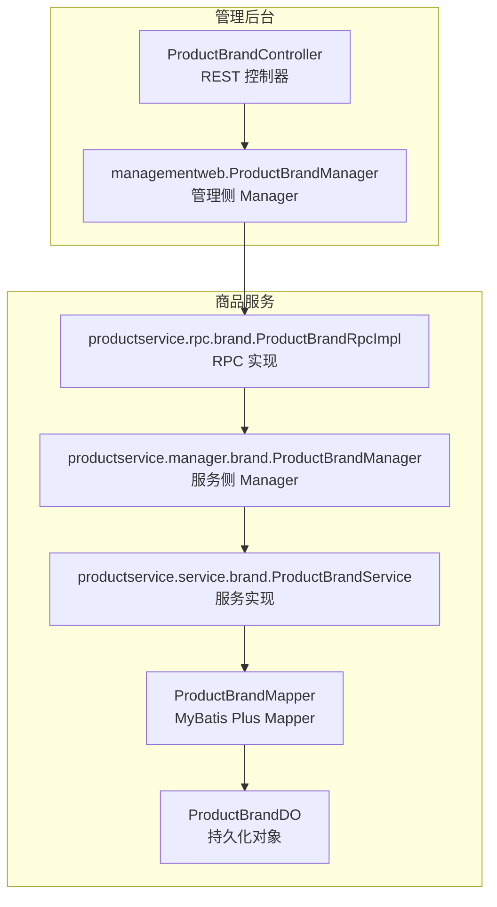
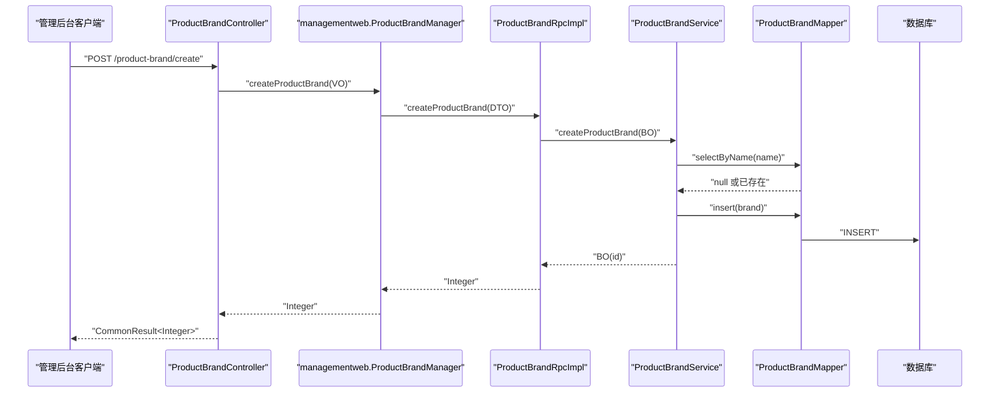
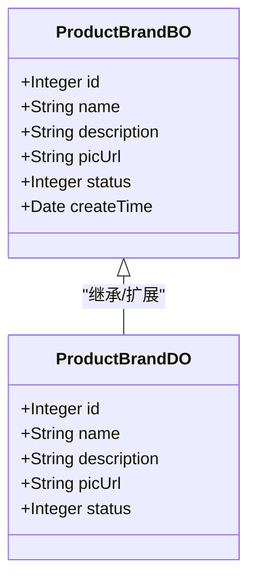
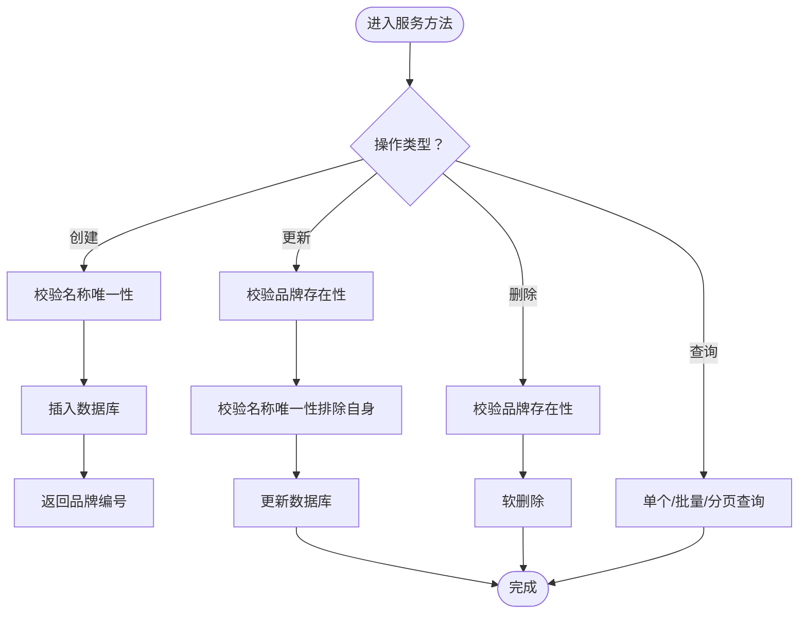
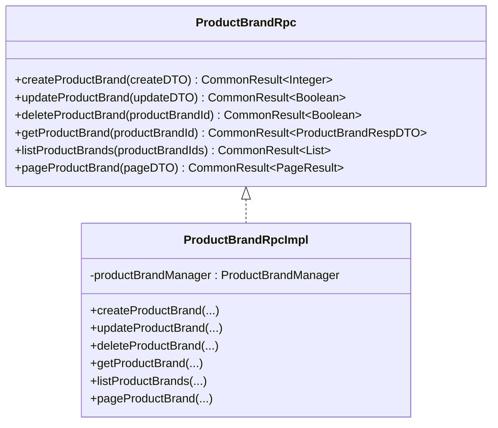
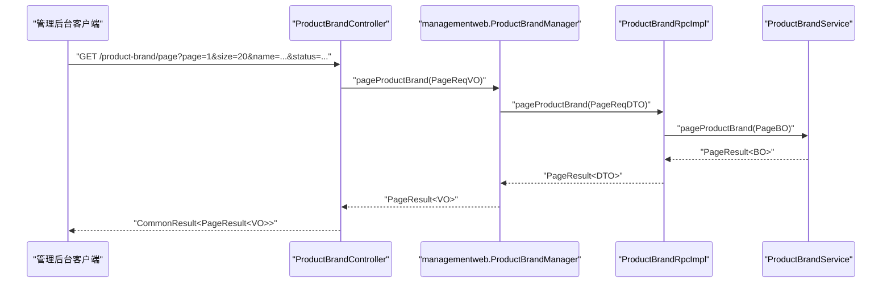

# 品牌管理

<cite>
**本文引用的文件**
- [ProductBrandDO.java](file://product-service-project/product-service-app/src/main/java/cn/iocoder/mall/productservice/dal/mysql/dataobject/brand/ProductBrandDO.java)
- [ProductBrandBO.java](file://product-service-project/product-service-app/src/main/java/cn/iocoder/mall/productservice/service/brand/bo/ProductBrandBO.java)
- [ProductBrandMapper.java](file://product-service-project/product-service-app/src/main/java/cn/iocoder/mall/productservice/dal/mysql/mapper/brand/ProductBrandMapper.java)
- [ProductBrandService.java](file://product-service-project/product-service-app/src/main/java/cn/iocoder/mall/productservice/service/brand/ProductBrandService.java)
- [ProductBrandManager.java](file://product-service-project/product-service-app/src/main/java/cn/iocoder/mall/productservice/manager/brand/ProductBrandManager.java)
- [ProductBrandRpc.java](file://product-service-project/product-service-api/src/main/java/cn/iocoder/mall/productservice/rpc/brand/ProductBrandRpc.java)
- [ProductBrandRpcImpl.java](file://product-service-project/product-service-app/src/main/java/cn/iocoder/mall/productservice/rpc/brand/ProductBrandRpcImpl.java)
- [ProductBrandCreateReqDTO.java](file://product-service-project/product-service-api/src/main/java/cn/iocoder/mall/productservice/rpc/brand/dto/ProductBrandCreateReqDTO.java)
- [ProductBrandUpdateReqDTO.java](file://product-service-project/product-service-api/src/main/java/cn/iocoder/mall/productservice/rpc/brand/dto/ProductBrandUpdateReqDTO.java)
- [ProductBrandPageReqDTO.java](file://product-service-project/product-service-api/src/main/java/cn/iocoder/mall/productservice/rpc/brand/dto/ProductBrandPageReqDTO.java)
- [ProductBrandRespDTO.java](file://product-service-project/product-service-api/src/main/java/cn/iocoder/mall/productservice/rpc/brand/dto/ProductBrandRespDTO.java)
- [ProductBrandConvert.java](file://product-service-project/product-service-app/src/main/java/cn/iocoder/mall/productservice/convert/brand/ProductBrandConvert.java)
- [ProductBrandController.java](file://management-web-app/src/main/java/cn/iocoder/mall/managementweb/controller/product/ProductBrandController.java)
- [ProductBrandManager.java](file://management-web-app/src/main/java/cn/iocoder/mall/managementweb/manager/product/ProductBrandManager.java)
- [ProductBrandCreateReqVO.java](file://management-web-app/src/main/java/cn/iocoder/mall/managementweb/controller/product/vo/brand/ProductBrandCreateReqVO.java)
- [ProductBrandUpdateReqVO.java](file://management-web-app/src/main/java/cn/iocoder/mall/managementweb/controller/product/vo/brand/ProductBrandUpdateReqVO.java)
- [ProductBrandPageReqVO.java](file://management-web-app/src/main/java/cn/iocoder/mall/managementweb/controller/product/vo/brand/ProductBrandPageReqVO.java)
- [ProductBrandRespVO.java](file://management-web-app/src/main/java/cn/iocoder/mall/managementweb/controller/product/vo/brand/ProductBrandRespVO.java)
- [CommonStatusEnum.java](file://common/common-framework/src/main/java/cn/iocoder/common/framework/enums/CommonStatusEnum.java)
- [ProductErrorCodeConstants.java](file://product-service-project/product-service-api/src/main/java/cn/iocoder/mall/productservice/enums/ProductErrorCodeConstants.java)
</cite>

## 目录
1. [引言](#引言)
2. [项目结构](#项目结构)
3. [核心组件](#核心组件)
4. [架构总览](#架构总览)
5. [详细组件分析](#详细组件分析)
6. [依赖分析](#依赖分析)
7. [性能考虑](#性能考虑)
8. [故障排查指南](#故障排查指南)
9. [结论](#结论)
10. [附录](#附录)

## 引言
本技术文档围绕“商品品牌管理”功能展开，系统性阐述品牌在商品体系中的作用、品牌与商品的关联关系、品牌信息的全生命周期管理（创建、更新、删除、查询）、基础信息维护（名称、Logo、描述、状态等）、状态控制机制，以及品牌在商品列表、搜索、筛选等场景的应用。同时，文档给出品牌管理的 RPC 接口设计与调用链路，并提供面向开发者的业务实现指导与排障建议。

## 项目结构
品牌管理功能横跨“管理后台 Web 应用”与“商品服务应用”，采用典型的分层架构：
- 表现层：管理后台控制器负责权限校验、参数封装与返回值包装。
- 管理层：管理侧 Manager 通过 Dubbo 远程调用商品服务 RPC。
- 服务层：商品服务侧提供品牌业务逻辑，含数据校验、持久化与分页查询。
- 数据访问层：MyBatis Plus Mapper 负责 SQL 执行与分页。
- 数据模型：DO（持久化对象）与 BO（业务对象）分离，便于扩展与转换。
- RPC 层：API 定义接口与实现类，统一对外暴露能力。

图表来源
- [ProductBrandController.java:26-82](file://management-web-app/src/main/java/cn/iocoder/mall/managementweb/controller/product/ProductBrandController.java#L26-L82)
- [ProductBrandManager.java:20-94](file://management-web-app/src/main/java/cn/iocoder/mall/managementweb/manager/product/ProductBrandManager.java#L20-L94)
- [ProductBrandRpcImpl.java:17-58](file://product-service-project/product-service-app/src/main/java/cn/iocoder/mall/productservice/rpc/brand/ProductBrandRpcImpl.java#L17-L58)
- [ProductBrandService.java:26-119](file://product-service-project/product-service-app/src/main/java/cn/iocoder/mall/productservice/service/brand/ProductBrandService.java#L26-L119)
- [ProductBrandMapper.java](file://product-service-project/product-service-app/src/main/java/cn/iocoder/mall/productservice/dal/mysql/mapper/brand/ProductBrandMapper.java)
- [ProductBrandDO.java:10-41](file://product-service-project/product-service-app/src/main/java/cn/iocoder/mall/productservice/dal/mysql/dataobject/brand/ProductBrandDO.java#L10-L41)

章节来源
- [ProductBrandController.java:26-82](file://management-web-app/src/main/java/cn/iocoder/mall/managementweb/controller/product/ProductBrandController.java#L26-L82)
- [ProductBrandManager.java:20-94](file://management-web-app/src/main/java/cn/iocoder/mall/managementweb/manager/product/ProductBrandManager.java#L20-L94)
- [ProductBrandRpcImpl.java:17-58](file://product-service-project/product-service-app/src/main/java/cn/iocoder/mall/productservice/rpc/brand/ProductBrandRpcImpl.java#L17-L58)
- [ProductBrandService.java:26-119](file://product-service-project/product-service-app/src/main/java/cn/iocoder/mall/productservice/service/brand/ProductBrandService.java#L26-L119)
- [ProductBrandMapper.java](file://product-service-project/product-service-app/src/main/java/cn/iocoder/mall/productservice/dal/mysql/mapper/brand/ProductBrandMapper.java)
- [ProductBrandDO.java:10-41](file://product-service-project/product-service-app/src/main/java/cn/iocoder/mall/productservice/dal/mysql/dataobject/brand/ProductBrandDO.java#L10-L41)

## 核心组件
- 数据模型
  - ProductBrandDO：持久化对象，包含主键、品牌名称、描述、Logo 图片地址、状态等字段。
  - ProductBrandBO：业务对象，扩展包含创建时间等。
- 服务层
  - ProductBrandService：提供品牌创建、更新、删除、查询、分页等核心业务逻辑；包含名称唯一性校验、存在性校验与异常抛出。
  - ProductBrandManager（服务侧）：承接 RPC 调用，完成 BO 与 DTO 的转换与分页转换。
- RPC 层
  - ProductBrandRpc：定义品牌管理的 RPC 接口集合。
  - ProductBrandRpcImpl：实现 RPC 接口，委托服务侧 Manager。
- 管理侧
  - managementweb.ProductBrandManager：通过 Dubbo Reference 调用 RPC，负责参数转换与错误检查。
  - managementweb.ProductBrandController：REST 控制器，负责权限注解、参数绑定与返回值包装。
- VO/DTO
  - VO：管理端输入输出对象（创建、更新、分页、响应）。
  - DTO：RPC 层输入输出对象（创建、更新、分页、响应）。
- 状态与错误码
  - CommonStatusEnum：通用状态枚举（如启用/禁用）。
  - ProductErrorCodeConstants：品牌相关错误码常量（如品牌已存在、品牌不存在）。

章节来源
- [ProductBrandDO.java:10-41](file://product-service-project/product-service-app/src/main/java/cn/iocoder/mall/productservice/dal/mysql/dataobject/brand/ProductBrandDO.java#L10-L41)
- [ProductBrandBO.java:8-40](file://product-service-project/product-service-app/src/main/java/cn/iocoder/mall/productservice/service/brand/bo/ProductBrandBO.java#L8-L40)
- [ProductBrandService.java:26-119](file://product-service-project/product-service-app/src/main/java/cn/iocoder/mall/productservice/service/brand/ProductBrandService.java#L26-L119)
- [ProductBrandManager.java:16-86](file://product-service-project/product-service-app/src/main/java/cn/iocoder/mall/productservice/manager/brand/ProductBrandManager.java#L16-L86)
- [ProductBrandRpc.java:12-63](file://product-service-project/product-service-api/src/main/java/cn/iocoder/mall/productservice/rpc/brand/ProductBrandRpc.java#L12-L63)
- [ProductBrandRpcImpl.java:17-58](file://product-service-project/product-service-app/src/main/java/cn/iocoder/mall/productservice/rpc/brand/ProductBrandRpcImpl.java#L17-L58)
- [ProductBrandManager.java:17-94](file://management-web-app/src/main/java/cn/iocoder/mall/managementweb/manager/product/ProductBrandManager.java#L17-L94)
- [ProductBrandController.java:23-82](file://management-web-app/src/main/java/cn/iocoder/mall/managementweb/controller/product/ProductBrandController.java#L23-L82)
- [ProductBrandCreateReqVO.java:7-20](file://management-web-app/src/main/java/cn/iocoder/mall/managementweb/controller/product/vo/brand/ProductBrandCreateReqVO.java#L7-L20)
- [ProductBrandUpdateReqVO.java:7-22](file://management-web-app/src/main/java/cn/iocoder/mall/managementweb/controller/product/vo/brand/ProductBrandUpdateReqVO.java#L7-L22)
- [ProductBrandPageReqVO.java:9-19](file://management-web-app/src/main/java/cn/iocoder/mall/managementweb/controller/product/vo/brand/ProductBrandPageReqVO.java#L9-L19)
- [ProductBrandRespVO.java:7-24](file://management-web-app/src/main/java/cn/iocoder/mall/managementweb/controller/product/vo/brand/ProductBrandRespVO.java#L7-L24)
- [CommonStatusEnum.java](file://common/common-framework/src/main/java/cn/iocoder/common/framework/enums/CommonStatusEnum.java)
- [ProductErrorCodeConstants.java](file://product-service-project/product-service-api/src/main/java/cn/iocoder/mall/productservice/enums/ProductErrorCodeConstants.java)

## 架构总览
品牌管理采用“表现层—管理层—RPC 层—服务层—数据访问层”的分层设计，管理后台通过 REST 暴露接口，内部通过 Dubbo 调用商品服务 RPC，最终落地到数据库。

图表来源
- [ProductBrandController.java:35-40](file://management-web-app/src/main/java/cn/iocoder/mall/managementweb/controller/product/ProductBrandController.java#L35-L40)
- [ProductBrandManager.java:32-36](file://management-web-app/src/main/java/cn/iocoder/mall/managementweb/manager/product/ProductBrandManager.java#L32-L36)
- [ProductBrandRpcImpl.java:27-29](file://product-service-project/product-service-app/src/main/java/cn/iocoder/mall/productservice/rpc/brand/ProductBrandRpcImpl.java#L27-L29)
- [ProductBrandService.java:39-49](file://product-service-project/product-service-app/src/main/java/cn/iocoder/mall/productservice/service/brand/ProductBrandService.java#L39-L49)
- [ProductBrandMapper.java](file://product-service-project/product-service-app/src/main/java/cn/iocoder/mall/productservice/dal/mysql/mapper/brand/ProductBrandMapper.java)
- [ProductBrandDO.java:17-41](file://product-service-project/product-service-app/src/main/java/cn/iocoder/mall/productservice/dal/mysql/dataobject/brand/ProductBrandDO.java#L17-L41)

## 详细组件分析

### 数据模型与状态
- 字段说明
  - 主键 id：品牌唯一标识。
  - 名称 name：品牌名称，用于唯一性约束。
  - 描述 description：品牌简介或详情。
  - Logo picUrl：品牌图片地址。
  - 状态 status：启用/禁用等状态，参考通用状态枚举。
  - 创建时间 createTime：业务对象扩展字段。
- 状态管理
  - 启用/禁用由状态字段控制，配合权限注解与前端展示策略实现。
  - 删除采用软删除（基于可删除基类），避免物理删除造成数据不可追溯。

图表来源
- [ProductBrandDO.java:17-41](file://product-service-project/product-service-app/src/main/java/cn/iocoder/mall/productservice/dal/mysql/dataobject/brand/ProductBrandDO.java#L17-L41)
- [ProductBrandBO.java:13-40](file://product-service-project/product-service-app/src/main/java/cn/iocoder/mall/productservice/service/brand/bo/ProductBrandBO.java#L13-L40)

章节来源
- [ProductBrandDO.java:17-41](file://product-service-project/product-service-app/src/main/java/cn/iocoder/mall/productservice/dal/mysql/dataobject/brand/ProductBrandDO.java#L17-L41)
- [ProductBrandBO.java:13-40](file://product-service-project/product-service-app/src/main/java/cn/iocoder/mall/productservice/service/brand/bo/ProductBrandBO.java#L13-L40)
- [CommonStatusEnum.java](file://common/common-framework/src/main/java/cn/iocoder/common/framework/enums/CommonStatusEnum.java)

### 生命周期管理（创建/更新/删除/查询）
- 创建
  - 校验名称唯一性，插入数据库，返回品牌编号。
- 更新
  - 校验品牌存在性与名称唯一性，执行更新。
- 删除
  - 校验存在性，执行软删除（后续可扩展“品牌下无分类”校验）。
- 查询
  - 单个查询、批量查询、分页查询均支持。

图表来源
- [ProductBrandService.java:39-84](file://product-service-project/product-service-app/src/main/java/cn/iocoder/mall/productservice/service/brand/ProductBrandService.java#L39-L84)
- [ProductBrandMapper.java](file://product-service-project/product-service-app/src/main/java/cn/iocoder/mall/productservice/dal/mysql/mapper/brand/ProductBrandMapper.java)

章节来源
- [ProductBrandService.java:39-84](file://product-service-project/product-service-app/src/main/java/cn/iocoder/mall/productservice/service/brand/ProductBrandService.java#L39-L84)

### 品牌与商品的关联关系
- 关联方式
  - 商品（SPU/SKU）与品牌通过外键关联，品牌作为商品维度的重要属性之一。
- 应用场景
  - 商品列表：按品牌筛选、展示品牌 Logo。
  - 商品搜索：品牌作为搜索与过滤条件之一。
  - 商品筛选：品牌维度的多维筛选。
  - 商品详情：品牌信息展示与跳转（如官网链接，若扩展）。
- 当前实现关注点
  - 品牌表结构与状态字段可用于商品维度的启用/禁用联动控制。
  - 品牌名称与 Logo 可直接用于商品列表与详情页展示。

章节来源
- [ProductBrandDO.java:17-41](file://product-service-project/product-service-app/src/main/java/cn/iocoder/mall/productservice/dal/mysql/dataobject/brand/ProductBrandDO.java#L17-L41)

### RPC 接口设计
- 接口集合
  - createProductBrand：创建品牌，返回品牌编号。
  - updateProductBrand：更新品牌。
  - deleteProductBrand：删除品牌。
  - getProductBrand：获取单个品牌。
  - listProductBrands：批量获取品牌。
  - pageProductBrand：分页查询品牌。
- 参数与返回
  - 管理端 VO/DTO 与服务端 BO/DO 之间通过 Convert 进行双向转换。
  - 分页参数通过 PageParam 继承传递，服务端使用 MyBatis Plus 分页。

图表来源
- [ProductBrandRpc.java:12-63](file://product-service-project/product-service-api/src/main/java/cn/iocoder/mall/productservice/rpc/brand/ProductBrandRpc.java#L12-L63)
- [ProductBrandRpcImpl.java:17-58](file://product-service-project/product-service-app/src/main/java/cn/iocoder/mall/productservice/rpc/brand/ProductBrandRpcImpl.java#L17-L58)

章节来源
- [ProductBrandRpc.java:12-63](file://product-service-project/product-service-api/src/main/java/cn/iocoder/mall/productservice/rpc/brand/ProductBrandRpc.java#L12-L63)
- [ProductBrandRpcImpl.java:17-58](file://product-service-project/product-service-app/src/main/java/cn/iocoder/mall/productservice/rpc/brand/ProductBrandRpcImpl.java#L17-L58)

### 管理端控制器与调用链
- 控制器职责
  - 权限注解：基于“product:brand:*”进行细粒度权限控制。
  - 参数绑定：使用 VO 对请求参数进行约束与示例说明。
  - 返回值包装：统一 CommonResult 包装。
- 调用链
  - 控制器 -> 管理侧 Manager -> RPC -> 服务侧 Manager -> Service -> Mapper -> DO。

图表来源
- [ProductBrandController.java:75-80](file://management-web-app/src/main/java/cn/iocoder/mall/managementweb/controller/product/ProductBrandController.java#L75-L80)
- [ProductBrandManager.java:88-92](file://management-web-app/src/main/java/cn/iocoder/mall/managementweb/manager/product/ProductBrandManager.java#L88-L92)
- [ProductBrandRpcImpl.java:54-56](file://product-service-project/product-service-app/src/main/java/cn/iocoder/mall/productservice/rpc/brand/ProductBrandRpcImpl.java#L54-L56)
- [ProductBrandService.java:114-117](file://product-service-project/product-service-app/src/main/java/cn/iocoder/mall/productservice/service/brand/ProductBrandService.java#L114-L117)

章节来源
- [ProductBrandController.java:23-82](file://management-web-app/src/main/java/cn/iocoder/mall/managementweb/controller/product/ProductBrandController.java#L23-L82)
- [ProductBrandManager.java:20-94](file://management-web-app/src/main/java/cn/iocoder/mall/managementweb/manager/product/ProductBrandManager.java#L20-L94)

### 品牌基础信息管理
- 字段清单
  - 品牌名称：必填，唯一性约束。
  - 品牌描述：选填。
  - 品牌 Logo：图片 URL，选填。
  - 状态：必填，启用/禁用。
  - 创建时间：业务对象扩展字段。
- 维护要点
  - 名称唯一性：创建/更新时均需校验。
  - 状态一致性：与商品维度的可用性保持一致。
  - 图片地址：建议使用 CDN 或对象存储地址，确保加载稳定。

章节来源
- [ProductBrandCreateReqVO.java:11-18](file://management-web-app/src/main/java/cn/iocoder/mall/managementweb/controller/product/vo/brand/ProductBrandCreateReqVO.java#L11-L18)
- [ProductBrandUpdateReqVO.java:13-20](file://management-web-app/src/main/java/cn/iocoder/mall/managementweb/controller/product/vo/brand/ProductBrandUpdateReqVO.java#L13-L20)
- [ProductBrandRespVO.java:13-22](file://management-web-app/src/main/java/cn/iocoder/mall/managementweb/controller/product/vo/brand/ProductBrandRespVO.java#L13-L22)
- [ProductBrandBO.java:21-38](file://product-service-project/product-service-app/src/main/java/cn/iocoder/mall/productservice/service/brand/bo/ProductBrandBO.java#L21-L38)

### 品牌状态管理机制
- 状态枚举
  - 使用通用状态枚举，涵盖启用/禁用等常用状态。
- 管理策略
  - 禁用后，品牌不应出现在前台可选列表中。
  - 删除采用软删除，保留审计轨迹；后续可扩展“品牌下无分类”校验后再允许物理删除。

章节来源
- [CommonStatusEnum.java](file://common/common-framework/src/main/java/cn/iocoder/common/framework/enums/CommonStatusEnum.java)
- [ProductBrandService.java:76-84](file://product-service-project/product-service-app/src/main/java/cn/iocoder/mall/productservice/service/brand/ProductBrandService.java#L76-L84)

### 品牌在商品展示与营销中的应用
- 商品展示
  - 列表页：展示品牌名称与 Logo，支持按品牌筛选。
  - 详情页：展示品牌背景与描述，引导至品牌专题页。
- 分类导航
  - 品牌作为导航维度之一，提升用户检索效率。
- 营销活动
  - 品牌专属活动页、品牌券、品牌推荐位等。

章节来源
- [ProductBrandDO.java:25-35](file://product-service-project/product-service-app/src/main/java/cn/iocoder/mall/productservice/dal/mysql/dataobject/brand/ProductBrandDO.java#L25-L35)

## 依赖分析
- 组件耦合
  - 控制器仅依赖管理侧 Manager；管理侧仅依赖 RPC 接口；RPC 仅依赖服务侧 Manager；服务侧依赖 Mapper 与 DO。
- 外部依赖
  - Dubbo 注解与引用配置，保证远程调用透明。
  - MyBatis Plus 提供分页与批量操作能力。
- 循环依赖
  - 当前结构清晰，无循环依赖迹象。

图表来源
- [ProductBrandController.java:26-82](file://management-web-app/src/main/java/cn/iocoder/mall/managementweb/controller/product/ProductBrandController.java#L26-L82)
- [ProductBrandManager.java:20-94](file://management-web-app/src/main/java/cn/iocoder/mall/managementweb/manager/product/ProductBrandManager.java#L20-L94)
- [ProductBrandRpcImpl.java:17-58](file://product-service-project/product-service-app/src/main/java/cn/iocoder/mall/productservice/rpc/brand/ProductBrandRpcImpl.java#L17-L58)
- [ProductBrandService.java:26-119](file://product-service-project/product-service-app/src/main/java/cn/iocoder/mall/productservice/service/brand/ProductBrandService.java#L26-L119)
- [ProductBrandMapper.java](file://product-service-project/product-service-app/src/main/java/cn/iocoder/mall/productservice/dal/mysql/mapper/brand/ProductBrandMapper.java)
- [ProductBrandDO.java:17-41](file://product-service-project/product-service-app/src/main/java/cn/iocoder/mall/productservice/dal/mysql/dataobject/brand/ProductBrandDO.java#L17-L41)

章节来源
- [ProductBrandController.java:26-82](file://management-web-app/src/main/java/cn/iocoder/mall/managementweb/controller/product/ProductBrandController.java#L26-L82)
- [ProductBrandManager.java:20-94](file://management-web-app/src/main/java/cn/iocoder/mall/managementweb/manager/product/ProductBrandManager.java#L20-L94)
- [ProductBrandRpcImpl.java:17-58](file://product-service-project/product-service-app/src/main/java/cn/iocoder/mall/productservice/rpc/brand/ProductBrandRpcImpl.java#L17-L58)
- [ProductBrandService.java:26-119](file://product-service-project/product-service-app/src/main/java/cn/iocoder/mall/productservice/service/brand/ProductBrandService.java#L26-L119)
- [ProductBrandMapper.java](file://product-service-project/product-service-app/src/main/java/cn/iocoder/mall/productservice/dal/mysql/mapper/brand/ProductBrandMapper.java)
- [ProductBrandDO.java:17-41](file://product-service-project/product-service-app/src/main/java/cn/iocoder/mall/productservice/dal/mysql/dataobject/brand/ProductBrandDO.java#L17-L41)

## 性能考虑
- 分页查询
  - 使用 MyBatis Plus 分页，注意合理设置页大小与排序字段索引。
- 批量查询
  - 批量 ID 查询使用“批量 ID”能力，减少多次往返。
- 缓存策略
  - 品牌基础信息可引入缓存（如 Redis），降低频繁读取压力。
- 并发控制
  - 名称唯一性校验在高并发下建议结合数据库唯一索引与分布式锁，避免竞态。

## 故障排查指南
- 常见错误码
  - 品牌已存在：创建/更新时名称冲突。
  - 品牌不存在：删除/更新时目标品牌缺失。
- 排查步骤
  - 确认请求参数：名称、状态、Logo 地址等。
  - 检查 RPC 调用链：控制器 -> 管理侧 Manager -> RPC -> 服务侧 Manager -> Service。
  - 核对数据库：确认唯一索引与软删除标记。
- 建议日志
  - 记录关键业务事件（创建/更新/删除）与异常堆栈，便于定位问题。

章节来源
- [ProductErrorCodeConstants.java](file://product-service-project/product-service-api/src/main/java/cn/iocoder/mall/productservice/enums/ProductErrorCodeConstants.java)
- [ProductBrandService.java:40-43](file://product-service-project/product-service-app/src/main/java/cn/iocoder/mall/productservice/service/brand/ProductBrandService.java#L40-L43)
- [ProductBrandService.java:57-60](file://product-service-project/product-service-app/src/main/java/cn/iocoder/mall/productservice/service/brand/ProductBrandService.java#L57-L60)
- [ProductBrandService.java:76-80](file://product-service-project/product-service-app/src/main/java/cn/iocoder/mall/productservice/service/brand/ProductBrandService.java#L76-L80)

## 结论
品牌管理功能以清晰的分层架构实现，具备完善的生命周期管理与 RPC 接口设计。通过名称唯一性校验、软删除与状态控制，保障了品牌数据的准确性与可追溯性。结合商品维度的展示与筛选，品牌成为商品体系中的重要标签。建议在生产环境中进一步完善“品牌下无分类”校验、引入缓存与索引优化，并加强监控与日志记录以提升稳定性与可观测性。

## 附录
- 关键路径参考
  - 创建流程：[ProductBrandController.java:35-40](file://management-web-app/src/main/java/cn/iocoder/mall/managementweb/controller/product/ProductBrandController.java#L35-L40) → [ProductBrandManager.java:32-36](file://management-web-app/src/main/java/cn/iocoder/mall/managementweb/manager/product/ProductBrandManager.java#L32-L36) → [ProductBrandRpcImpl.java:27-29](file://product-service-project/product-service-app/src/main/java/cn/iocoder/mall/productservice/rpc/brand/ProductBrandRpcImpl.java#L27-L29) → [ProductBrandService.java:39-49](file://product-service-project/product-service-app/src/main/java/cn/iocoder/mall/productservice/service/brand/ProductBrandService.java#L39-L49)
  - 分页查询：[ProductBrandController.java:75-80](file://management-web-app/src/main/java/cn/iocoder/mall/managementweb/controller/product/ProductBrandController.java#L75-L80) → [ProductBrandManager.java:88-92](file://management-web-app/src/main/java/cn/iocoder/mall/managementweb/manager/product/ProductBrandManager.java#L88-L92) → [ProductBrandRpcImpl.java:54-56](file://product-service-project/product-service-app/src/main/java/cn/iocoder/mall/productservice/rpc/brand/ProductBrandRpcImpl.java#L54-L56) → [ProductBrandService.java:114-117](file://product-service-project/product-service-app/src/main/java/cn/iocoder/mall/productservice/service/brand/ProductBrandService.java#L114-L117)
- 字段与状态参考
  - 品牌字段：[ProductBrandDO.java:25-39](file://product-service-project/product-service-app/src/main/java/cn/iocoder/mall/productservice/dal/mysql/dataobject/brand/ProductBrandDO.java#L25-L39)
  - 状态枚举：[CommonStatusEnum.java](file://common/common-framework/src/main/java/cn/iocoder/common/framework/enums/CommonStatusEnum.java)
- 错误码参考
  - 品牌错误码：[ProductErrorCodeConstants.java](file://product-service-project/product-service-api/src/main/java/cn/iocoder/mall/productservice/enums/ProductErrorCodeConstants.java)