# 商品服务模块

<cite>
**本文引用的文件**
- [pom.xml](file://pom.xml)
- [ProductSpuRpc.java](file://product-service-project/product-service-api/src/main/java/cn/iocoder/mall/productservice/rpc/spu/ProductSpuRpc.java)
- [ProductSkuRpc.java](file://product-service-project/product-service-api/src/main/java/cn/iocoder/mall/productservice/rpc/sku/ProductSkuRpc.java)
- [ProductAttrRpc.java](file://product-service-project/product-service-api/src/main/java/cn/iocoder/mall/productservice/rpc/attr/ProductAttrRpc.java)
- [ProductCategoryRpc.java](file://product-service-project/product-service-api/src/main/java/cn/iocoder/mall/productservice/rpc/category/ProductCategoryRpc.java)
- [ProductBrandRpc.java](file://product-service-project/product-service-api/src/main/java/cn/iocoder/mall/productservice/rpc/brand/ProductBrandRpc.java)
- [ProductSpuDO.java](file://product-service-project/product-service-app/src/main/java/cn/ihocoder/mall/productservice/dal/mysql/dataobject/spu/ProductSpuDO.java)
- [ProductSkuDO.java](file://product-service-project/product-service-app/src/main/java/cn/ihocoder/mall/productservice/dal/mysql/dataobject/sku/ProductSkuDO.java)
- [ProductCategoryDO.java](file://product-service-project/product-service-app/src/main/java/cn/ihocoder/mall/productservice/dal/mysql/dataobject/category/ProductCategoryDO.java)
- [ProductBrandDO.java](file://product-service-project/product-service-app/src/main/java/cn/ihocoder/mall/productservice/dal/mysql/dataobject/brand/ProductBrandDO.java)
</cite>

## 目录
1. [引言](#引言)
2. [项目结构](#项目结构)
3. [核心组件](#核心组件)
4. [架构总览](#架构总览)
5. [详细组件分析](#详细组件分析)
6. [依赖分析](#依赖分析)
7. [性能考量](#性能考量)
8. [故障排查指南](#故障排查指南)
9. [结论](#结论)
10. [附录](#附录)

## 引言
本技术文档面向“商品服务模块”，系统性阐述商品管理的核心业务与实现，覆盖以下主题：
- SPU（标准商品单元）与 SKU（最小库存单位）的管理机制与数据模型
- 商品属性系统设计：属性键值对、属性组合规则、规格参数管理
- 商品分类体系：树形结构、层级关系与商品归属规则
- 品牌管理：品牌信息维护与与商品的关联关系
- 商品库存管理策略：库存扣减、库存预警、库存同步机制
- RPC 接口设计与实现：商品查询、详情、列表等接口
- 完整业务流程图与数据模型说明：状态流转与业务约束

## 项目结构
商品服务模块位于 product-service-project 中，采用“API + APP”分层：
- product-service-api：对外暴露的 RPC 接口定义与 DTO
- product-service-app：接口实现、DAO、Service、Manager、MQ 生产者、配置与资源

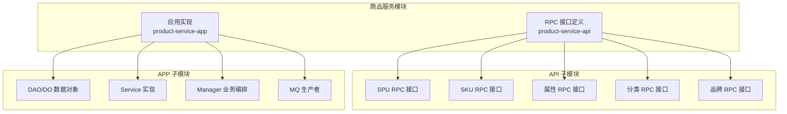

图表来源
- [ProductSpuRpc.java](file://product-service-project/product-service-api/src/main/java/cn/ihocoder/mall/productservice/rpc/spu/ProductSpuRpc.java)
- [ProductSkuRpc.java](file://product-service-project/product-service-api/src/main/java/cn/ihocoder/mall/productservice/rpc/sku/ProductSkuRpc.java)
- [ProductAttrRpc.java](file://product-service-project/product-service-api/src/main/java/cn/ihocoder/mall/productservice/rpc/attr/ProductAttrRpc.java)
- [ProductCategoryRpc.java](file://product-service-project/product-service-api/src/main/java/cn/ihocoder/mall/productservice/rpc/category/ProductCategoryRpc.java)
- [ProductBrandRpc.java](file://product-service-project/product-service-api/src/main/java/cn/ihocoder/mall/productservice/rpc/brand/ProductBrandRpc.java)

章节来源
- [pom.xml:16-28](file://pom.xml#L16-L28)

## 核心组件
本节从“接口 + 数据模型”的角度，梳理商品服务的关键能力。

- SPU 管理 RPC 接口：提供创建、更新、查询单个/批量/分页、顺序查询 SPU 编号、按字段选择查询详情等能力
- SKU 管理 RPC 接口：提供按 ID 查询、按条件批量查询 SKU
- 属性管理 RPC 接口：提供属性键（key）与属性值（value）的增删改查与分页
- 分类管理 RPC 接口：提供分类的增删改查、列表查询
- 品牌管理 RPC 接口：提供品牌的增删改查、分页

章节来源
- [ProductSpuRpc.java:13-65](file://product-service-project/product-service-api/src/main/java/cn/ihocoder/mall/productservice/rpc/spu/ProductSpuRpc.java#L13-L65)
- [ProductSkuRpc.java:12-30](file://product-service-project/product-service-api/src/main/java/cn/ihocoder/mall/productservice/rpc/sku/ProductSkuRpc.java#L12-L30)
- [ProductAttrRpc.java:12-84](file://product-service-project/product-service-api/src/main/java/cn/ihocoder/mall/productservice/rpc/attr/ProductAttrRpc.java#L12-L84)
- [ProductCategoryRpc.java:15-62](file://product-service-project/product-service-api/src/main/java/cn/ihocoder/mall/productservice/rpc/category/ProductCategoryRpc.java#L15-L62)
- [ProductBrandRpc.java:15-63](file://product-service-project/product-service-api/src/main/java/cn/ihocoder/mall/productservice/rpc/brand/ProductBrandRpc.java#L15-L63)

## 架构总览
商品服务采用 RPC 面向接口编程，通过 API 模块定义契约，APP 模块落地实现。数据持久化基于 MyBatis-Plus，使用 DO（数据对象）映射数据库表；业务层通过 Manager/Service 组织领域逻辑；部分场景通过 MQ 进行异步解耦。

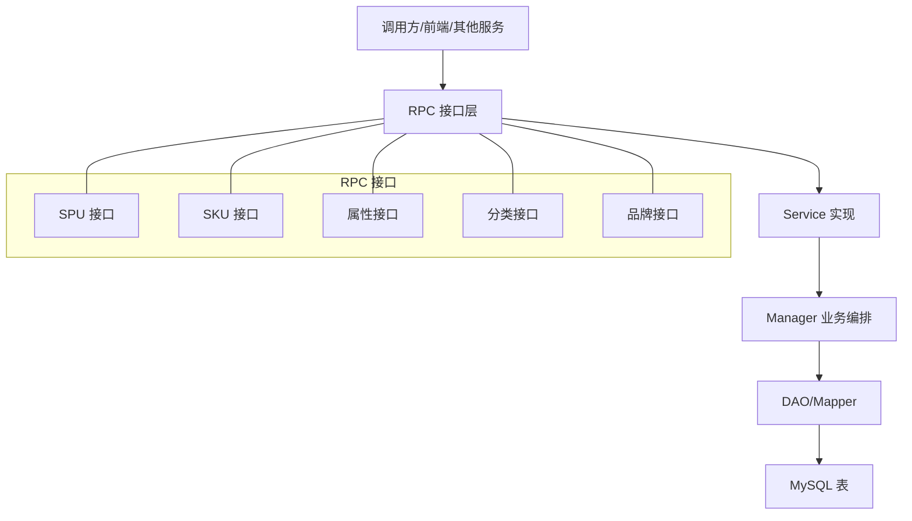

图表来源
- [ProductSpuRpc.java:13-65](file://product-service-project/product-service-api/src/main/java/cn/ihocoder/mall/productservice/rpc/spu/ProductSpuRpc.java#L13-L65)
- [ProductSkuRpc.java:12-30](file://product-service-project/product-service-api/src/main/java/cn/ihocoder/mall/productservice/rpc/sku/ProductSkuRpc.java#L12-L30)
- [ProductAttrRpc.java:12-84](file://product-service-project/product-service-api/src/main/java/cn/ihocoder/mall/productservice/rpc/attr/ProductAttrRpc.java#L12-L84)
- [ProductCategoryRpc.java:15-62](file://product-service-project/product-service-api/src/main/java/cn/ihocoder/mall/productservice/rpc/category/ProductCategoryRpc.java#L15-L62)
- [ProductBrandRpc.java:15-63](file://product-service-project/product-service-api/src/main/java/cn/ihocoder/mall/productservice/rpc/brand/ProductBrandRpc.java#L15-L63)

## 详细组件分析

### SPU（标准商品单元）
- 职责：管理商品的基本信息、分类、可见性、排序、价格与库存聚合
- 关键字段：名称、卖点、描述、分类编号、主图、可见性、排序、价格、库存
- 与 SKU 的关系：SPU 聚合 SKU 的价格与库存，作为对外展示与检索的基础

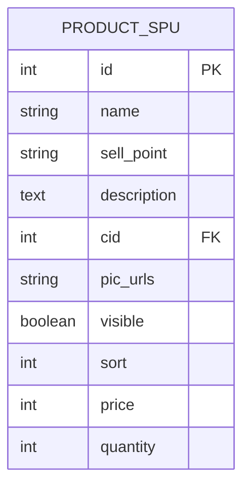

图表来源
- [ProductSpuDO.java:18-82](file://product-service-project/product-service-app/src/main/java/cn/ihocoder/mall/productservice/dal/mysql/dataobject/spu/ProductSpuDO.java#L18-L82)

章节来源
- [ProductSpuDO.java:18-82](file://product-service-project/product-service-app/src/main/java/cn/ihocoder/mall/productservice/dal/mysql/dataobject/spu/ProductSpuDO.java#L18-L82)
- [ProductSpuRpc.java:13-65](file://product-service-project/product-service-api/src/main/java/cn/ihocoder/mall/productservice/rpc/spu/ProductSpuRpc.java#L13-L65)

### SKU（最小库存单位）
- 职责：承载具体规格组合与库存、价格等可售维度
- 关键字段：SPU 编号、状态、图片、规格值集合、价格（分）、库存
- 与属性的关系：attrs 字段存储属性值 ID 数组，用于表达 SKU 的属性组合

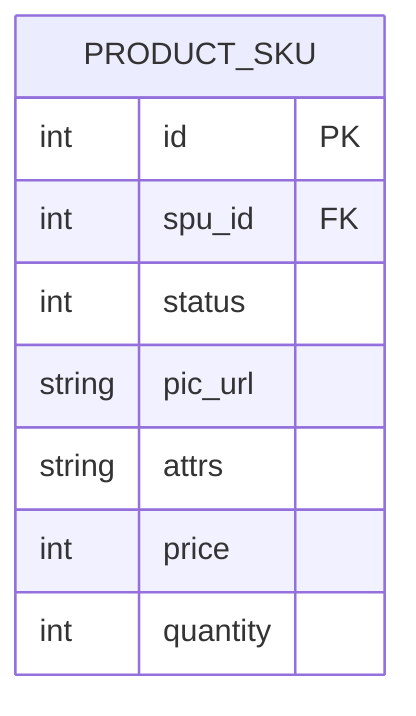

图表来源
- [ProductSkuDO.java:18-64](file://product-service-project/product-service-app/src/main/java/cn/ihocoder/mall/productservice/dal/mysql/dataobject/sku/ProductSkuDO.java#L18-L64)

章节来源
- [ProductSkuDO.java:18-64](file://product-service-project/product-service-app/src/main/java/cn/ihocoder/mall/productservice/dal/mysql/dataobject/sku/ProductSkuDO.java#L18-L64)
- [ProductSkuRpc.java:12-30](file://product-service-project/product-service-api/src/main/java/cn/ihocoder/mall/productservice/rpc/sku/ProductSkuRpc.java#L12-L30)

### 属性系统（键值对与组合规则）
- 属性键（Key）：规格维度名称（如颜色、内存）
- 属性值（Value）：具体取值（如红色、8GB）
- 组合规则：SKU 的 attrs 字段以逗号分隔存储多个属性值 ID，形成唯一的规格组合
- 参数管理：当前 SPU 层暂未引入“普通参数”（如材质、尺寸），后续可扩展

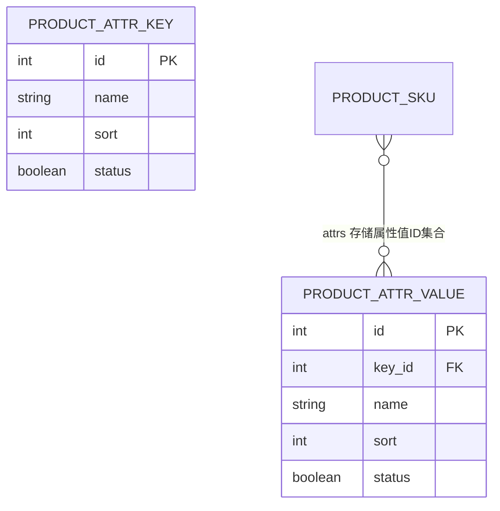

图表来源
- [ProductAttrRpc.java:12-84](file://product-service-project/product-service-api/src/main/java/cn/ihocoder/mall/productservice/rpc/attr/ProductAttrRpc.java#L12-L84)
- [ProductSkuDO.java:42-46](file://product-service-project/product-service-app/src/main/java/cn/ihocoder/mall/productservice/dal/mysql/dataobject/sku/ProductSkuDO.java#L42-L46)

章节来源
- [ProductAttrRpc.java:12-84](file://product-service-project/product-service-api/src/main/java/cn/ihocoder/mall/productservice/rpc/attr/ProductAttrRpc.java#L12-L84)
- [ProductSkuDO.java:42-46](file://product-service-project/product-service-app/src/main/java/cn/ihocoder/mall/productservice/dal/mysql/dataobject/sku/ProductSkuDO.java#L42-L46)

### 分类体系（树形结构与归属规则）
- 结构：pid 指向上级分类，支持多级树形
- 字段：名称、描述、图片、排序、状态
- 归属规则：SPU 通过 cid 关联到分类，实现商品与分类的多对一绑定

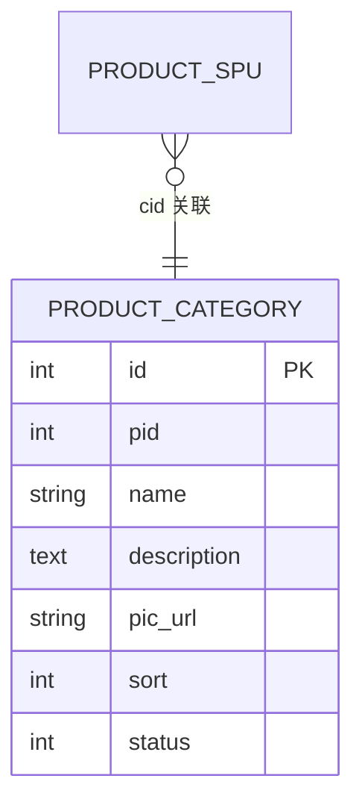

图表来源
- [ProductCategoryDO.java:18-50](file://product-service-project/product-service-app/src/main/java/cn/ihocoder/mall/productservice/dal/mysql/dataobject/category/ProductCategoryDO.java#L18-L50)
- [ProductSpuDO.java:42-43](file://product-service-project/product-service-app/src/main/java/cn/ihocoder/mall/productservice/dal/mysql/dataobject/spu/ProductSpuDO.java#L42-L43)

章节来源
- [ProductCategoryDO.java:18-50](file://product-service-project/product-service-app/src/main/java/cn/ihocoder/mall/productservice/dal/mysql/dataobject/category/ProductCategoryDO.java#L18-L50)
- [ProductSpuDO.java:42-43](file://product-service-project/product-service-app/src/main/java/cn/ihocoder/mall/productservice/dal/mysql/dataobject/spu/ProductSpuDO.java#L42-L43)
- [ProductCategoryRpc.java:15-62](file://product-service-project/product-service-api/src/main/java/cn/ihocoder/mall/productservice/rpc/category/ProductCategoryRpc.java#L15-L62)

### 品牌管理（信息维护与关联）
- 字段：名称、描述、图片、状态
- 关联规则：SPU 未直接持有品牌字段，若需品牌维度可在上层聚合或扩展

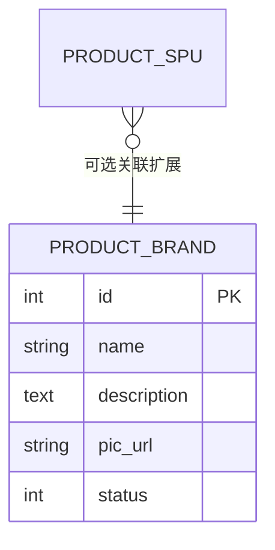

图表来源
- [ProductBrandDO.java:17-39](file://product-service-project/product-service-app/src/main/java/cn/ihocoder/mall/productservice/dal/mysql/dataobject/brand/ProductBrandDO.java#L17-L39)
- [ProductSpuDO.java:25-26](file://product-service-project/product-service-app/src/main/java/cn/ihocoder/mall/productservice/dal/mysql/dataobject/spu/ProductSpuDO.java#L25-L26)

章节来源
- [ProductBrandDO.java:17-39](file://product-service-project/product-service-app/src/main/java/cn/ihocoder/mall/productservice/dal/mysql/dataobject/brand/ProductBrandDO.java#L17-L39)
- [ProductBrandRpc.java:15-63](file://product-service-project/product-service-api/src/main/java/cn/ihocoder/mall/productservice/rpc/brand/ProductBrandRpc.java#L15-L63)

### RPC 接口设计与实现要点
- SPU 接口：创建、更新、单个/批量/分页查询、顺序查询 SPU 编号、按字段选择查询详情
- SKU 接口：按 ID 查询、按条件批量查询
- 属性接口：键与值的增删改查与分页
- 分类接口：增删改查、列表查询
- 品牌接口：增删改查、分页

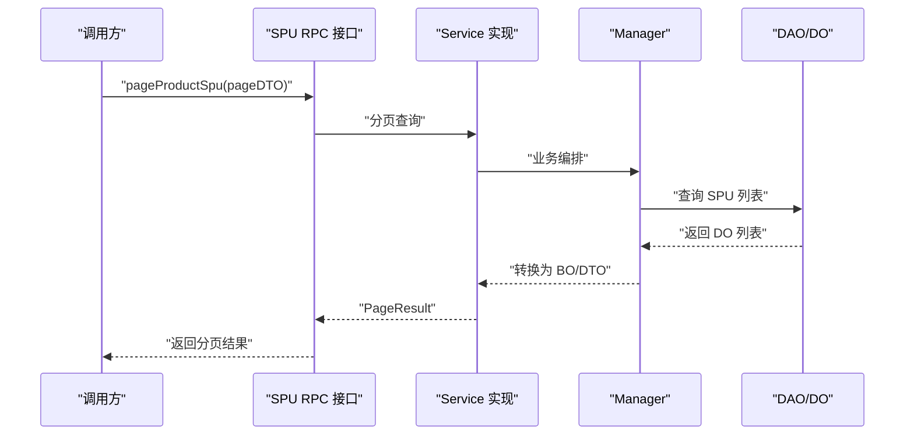

图表来源
- [ProductSpuRpc.java:46-52](file://product-service-project/product-service-api/src/main/java/cn/ihocoder/mall/productservice/rpc/spu/ProductSpuRpc.java#L46-L52)

章节来源
- [ProductSpuRpc.java:13-65](file://product-service-project/product-service-api/src/main/java/cn/ihocoder/mall/productservice/rpc/spu/ProductSpuRpc.java#L13-L65)
- [ProductSkuRpc.java:12-30](file://product-service-project/product-service-api/src/main/java/cn/ihocoder/mall/productservice/rpc/sku/ProductSkuRpc.java#L12-L30)
- [ProductAttrRpc.java:12-84](file://product-service-project/product-service-api/src/main/java/cn/ihocoder/mall/productservice/rpc/attr/ProductAttrRpc.java#L12-L84)
- [ProductCategoryRpc.java:15-62](file://product-service-project/product-service-api/src/main/java/cn/ihocoder/mall/productservice/rpc/category/ProductCategoryRpc.java#L15-L62)
- [ProductBrandRpc.java:15-63](file://product-service-project/product-service-api/src/main/java/cn/ihocoder/mall/productservice/rpc/brand/ProductBrandRpc.java#L15-L63)

### 商品库存管理策略
- 库存字段：SKU 与 SPU 均具备 quantity 字段
- 库存聚合：SPU 的库存通常由其所有 SKU 的库存求和得到
- 扣减与同步：当前代码未体现显式的“扣减/预警/同步”逻辑，建议在 Service 层引入幂等扣减、库存校验与异步同步策略，并结合 MQ 进行最终一致性处理

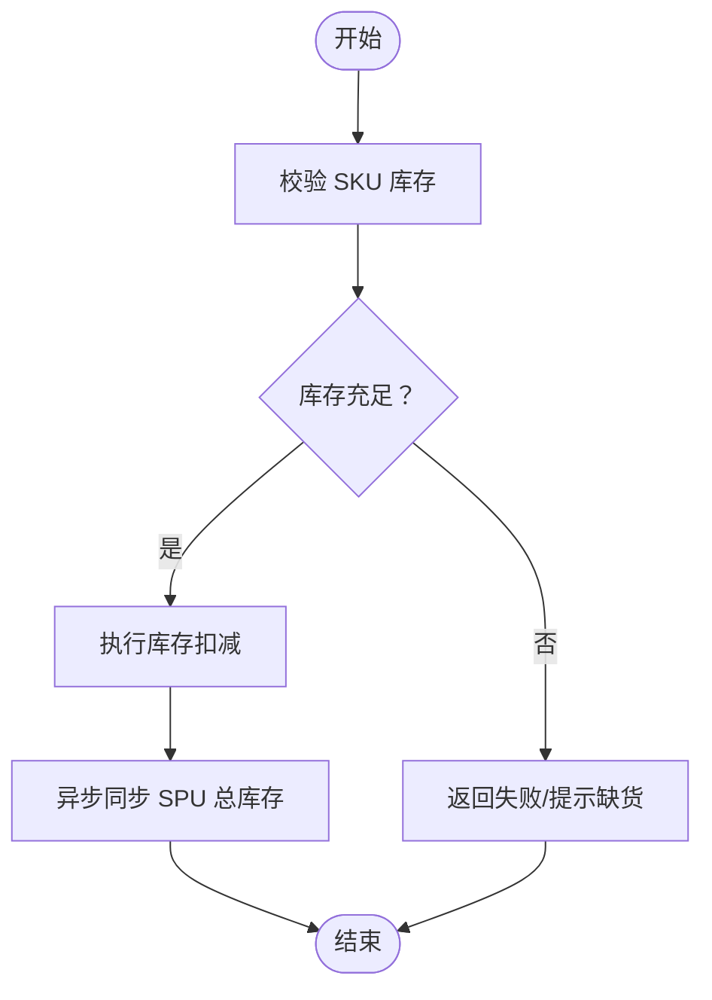

图表来源
- [ProductSkuDO.java:54-54](file://product-service-project/product-service-app/src/main/java/cn/ihocoder/mall/productservice/dal/mysql/dataobject/sku/ProductSkuDO.java#L54-L54)
- [ProductSpuDO.java:80-80](file://product-service-project/product-service-app/src/main/java/cn/ihocoder/mall/productservice/dal/mysql/dataobject/spu/ProductSpuDO.java#L80-L80)

章节来源
- [ProductSkuDO.java:54-54](file://product-service-project/product-service-app/src/main/java/cn/ihocoder/mall/productservice/dal/mysql/dataobject/sku/ProductSkuDO.java#L54-L54)
- [ProductSpuDO.java:80-80](file://product-service-project/product-service-app/src/main/java/cn/ihocoder/mall/productservice/dal/mysql/dataobject/spu/ProductSpuDO.java#L80-L80)

### 商品状态流转与业务约束
- 可见性控制：SPU 的 visible 字段控制商品是否上架
- 状态枚举：SKU 的 status 字段采用通用状态枚举，便于统一治理
- 分类与品牌：通过 cid 与可选的品牌关联，实现商品的分类与品牌维度

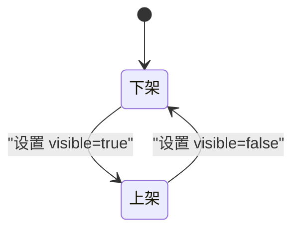

图表来源
- [ProductSpuDO.java:62-62](file://product-service-project/product-service-app/src/main/java/cn/ihocoder/mall/productservice/dal/mysql/dataobject/spu/ProductSpuDO.java#L62-L62)
- [ProductSkuDO.java:36-36](file://product-service-project/product-service-app/src/main/java/cn/ihocoder/mall/productservice/dal/mysql/dataobject/sku/ProductSkuDO.java#L36-L36)

章节来源
- [ProductSpuDO.java:62-62](file://product-service-project/product-service-app/src/main/java/cn/ihocoder/mall/productservice/dal/mysql/dataobject/spu/ProductSpuDO.java#L62-L62)
- [ProductSkuDO.java:36-36](file://product-service-project/product-service-app/src/main/java/cn/ihocoder/mall/productservice/dal/mysql/dataobject/sku/ProductSkuDO.java#L36-L36)

## 依赖分析
- 模块依赖：根 POM 将商品服务模块纳入聚合工程
- 接口与实现：API 模块仅定义接口与 DTO，APP 模块提供实现
- 数据访问：DAO/DO 映射 MySQL 表，遵循 MyBatis-Plus 约定

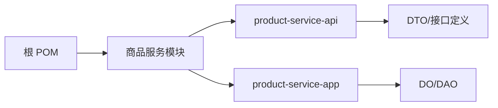

图表来源
- [pom.xml:16-28](file://pom.xml#L16-L28)

章节来源
- [pom.xml:16-28](file://pom.xml#L16-L28)

## 性能考量
- 分页查询：优先使用分页接口，避免一次性加载大量数据
- 字段选择：SPU 详情支持按字段选择，减少不必要的序列化与传输
- 批量查询：使用批量接口替代多次单条查询，降低网络开销
- 缓存策略：对热点商品详情与分类、品牌数据进行缓存，结合 MQ 做失效与更新
- 库存并发：库存扣减应采用原子操作与幂等设计，必要时引入分布式锁或消息队列削峰

## 故障排查指南
- 接口返回异常：检查 CommonResult 的错误码与错误信息，定位具体 RPC 方法与参数
- 数据不一致：核对 SKU 与 SPU 的库存聚合逻辑，确保异步同步链路正常
- 分类/品牌关联问题：确认 cid 与品牌字段的赋值与查询路径
- 属性组合异常：检查 SKU.attrs 的属性值 ID 数组格式与去重规则

## 结论
商品服务模块以清晰的 RPC 接口与 DO 数据模型为基础，实现了 SPU/SKU、属性、分类与品牌的核心能力。建议在库存与状态治理方面进一步完善，以满足高并发与高可靠性的业务需求。

## 附录
- 建议扩展点：普通参数字段、库存预警阈值、库存同步策略、品牌维度扩展
- 最佳实践：接口参数校验、幂等扣减、缓存与 MQ 解耦、分页与字段选择优化