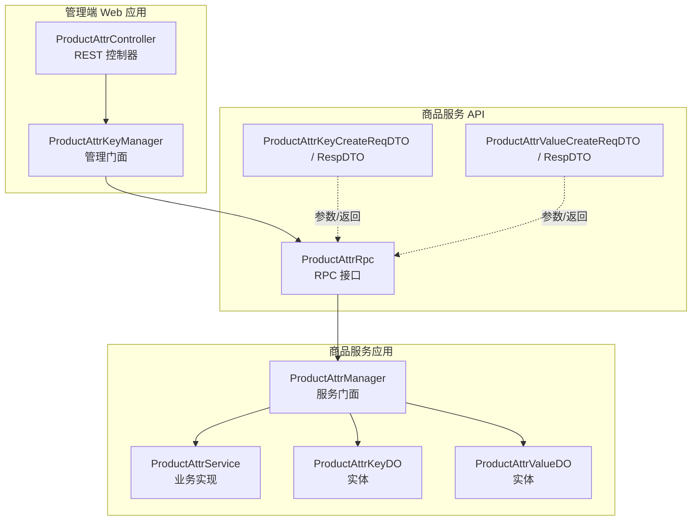
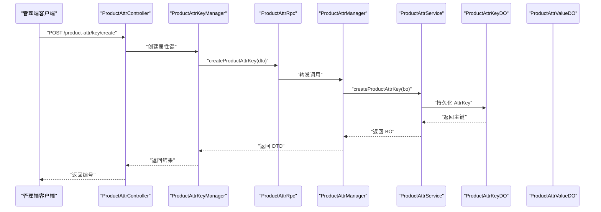
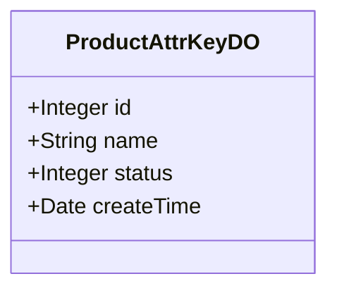
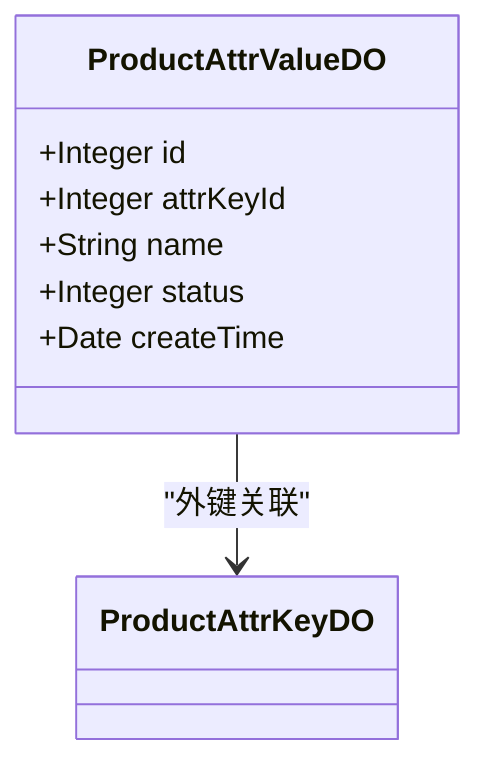
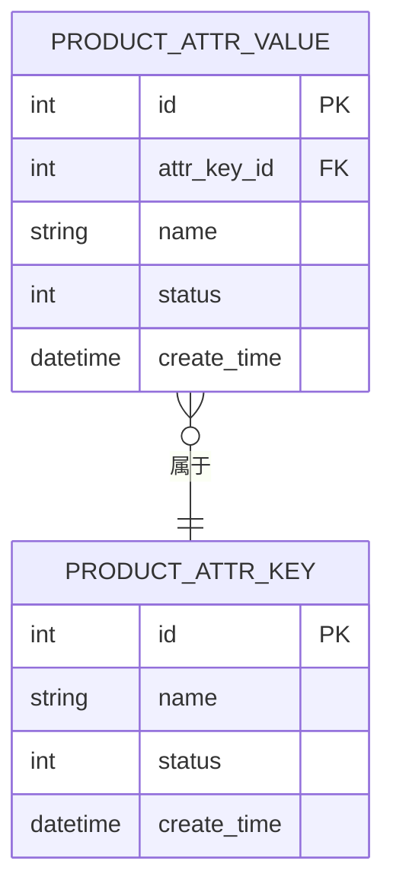
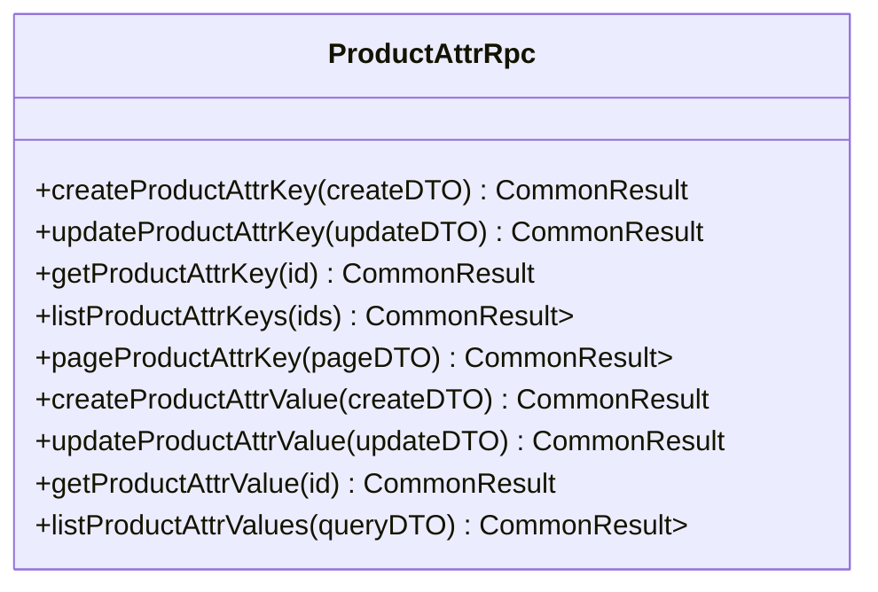
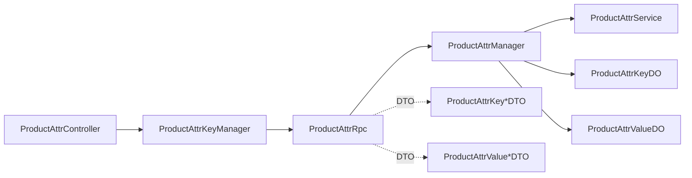

# 属性管理

<cite>
**本文引用的文件**
- [ProductAttrController.java](file://management-web-app/src/main/java/cn/iocoder/mall/managementweb/controller/product/ProductAttrController.java)
- [ProductAttrKeyManager.java](file://management-web-app/src/main/java/cn/iocoder/mall/managementweb/manager/product/ProductAttrKeyManager.java)
- [ProductAttrRpc.java](file://product-service-project/product-service-api/src/main/java/cn/iocoder/mall/productservice/rpc/attr/ProductAttrRpc.java)
- [ProductAttrKeyCreateReqDTO.java](file://product-service-project/product-service-api/src/main/java/cn/iocoder/mall/productservice/rpc/attr/dto/ProductAttrKeyCreateReqDTO.java)
- [ProductAttrKeyRespDTO.java](file://product-service-project/product-service-api/src/main/java/cn/iocoder/mall/productservice/rpc/attr/dto/ProductAttrKeyRespDTO.java)
- [ProductAttrValueCreateReqDTO.java](file://product-service-project/product-service-api/src/main/java/cn/iocoder/mall/productservice/rpc/attr/dto/ProductAttrValueCreateReqDTO.java)
- [ProductAttrValueRespDTO.java](file://product-service-project/product-service-api/src/main/java/cn/iocoder/mall/productservice/rpc/attr/dto/ProductAttrValueRespDTO.java)
- [ProductAttrManager.java](file://product-service-project/product-service-app/src/main/java/cn/iocoder/mall/productservice/manager/attr/ProductAttrManager.java)
- [ProductAttrKeyDO.java](file://product-service-project/product-service-app/src/main/java/cn/iocoder/mall/productservice/dal/mysql/dataobject/attr/ProductAttrKeyDO.java)
- [ProductAttrValueDO.java](file://product-service-project/product-service-app/src/main/java/cn/iocoder/mall/productservice/dal/mysql/dataobject/attr/ProductAttrValueDO.java)
</cite>

## 目录
1. [引言](#引言)
2. [项目结构](#项目结构)
3. [核心组件](#核心组件)
4. [架构总览](#架构总览)
5. [详细组件分析](#详细组件分析)
6. [依赖分析](#依赖分析)
7. [性能考虑](#性能考虑)
8. [故障排查指南](#故障排查指南)
9. [结论](#结论)
10. [附录](#附录)

## 引言
本技术文档围绕“商品属性管理”功能展开，系统性阐述属性键（AttrKey）与属性值（AttrValue）的设计理念、管理能力与业务规则，并结合 RPC 接口与数据模型，给出属性在 SPU 层面的应用方式、与商品筛选/搜索/展示的集成方案以及最佳实践。读者可据此快速理解并落地属性体系的开发与运维。

## 项目结构
属性管理功能横跨“管理端 Web 应用”与“商品服务应用”，采用典型的分层架构：Web 控制器负责权限与参数校验，Manager 作为门面协调 RPC 调用，Service 执行业务逻辑，DAO 持久化到 MySQL；同时通过 DTO 在各层之间传递数据。

图表来源
- [ProductAttrController.java:1-101](file://management-web-app/src/main/java/cn/iocoder/mall/managementweb/controller/product/ProductAttrController.java#L1-L101)
- [ProductAttrKeyManager.java:1-135](file://management-web-app/src/main/java/cn/iocoder/mall/managementweb/manager/product/ProductAttrKeyManager.java#L1-L135)
- [ProductAttrRpc.java:1-85](file://product-service-project/product-service-api/src/main/java/cn/iocoder/mall/productservice/rpc/attr/ProductAttrRpc.java#L1-L85)
- [ProductAttrManager.java:1-119](file://product-service-project/product-service-app/src/main/java/cn/iocoder/mall/productservice/manager/attr/ProductAttrManager.java#L1-L119)
- [ProductAttrKeyDO.java:1-35](file://product-service-project/product-service-app/src/main/java/cn/iocoder/mall/productservice/dal/mysql/dataobject/attr/ProductAttrKeyDO.java#L1-L35)
- [ProductAttrValueDO.java:1-41](file://product-service-project/product-service-app/src/main/java/cn/iocoder/mall/productservice/dal/mysql/dataobject/attr/ProductAttrValueDO.java#L1-L41)

章节来源
- [ProductAttrController.java:1-101](file://management-web-app/src/main/java/cn/iocoder/mall/managementweb/controller/product/ProductAttrController.java#L1-L101)
- [ProductAttrKeyManager.java:1-135](file://management-web-app/src/main/java/cn/iocoder/mall/managementweb/manager/product/ProductAttrKeyManager.java#L1-L135)
- [ProductAttrRpc.java:1-85](file://product-service-project/product-service-api/src/main/java/cn/iocoder/mall/productservice/rpc/attr/ProductAttrRpc.java#L1-L85)
- [ProductAttrManager.java:1-119](file://product-service-project/product-service-app/src/main/java/cn/iocoder/mall/productservice/manager/attr/ProductAttrManager.java#L1-L119)
- [ProductAttrKeyDO.java:1-35](file://product-service-project/product-service-app/src/main/java/cn/iocoder/mall/productservice/dal/mysql/dataobject/attr/ProductAttrKeyDO.java#L1-L35)
- [ProductAttrValueDO.java:1-41](file://product-service-project/product-service-app/src/main/java/cn/iocoder/mall/productservice/dal/mysql/dataobject/attr/ProductAttrValueDO.java#L1-L41)

## 核心组件
- 属性键（AttrKey）
  - 负责定义“属性维度”的名称与状态，如“颜色”、“内存”、“版本”等。
  - 支持创建、更新、按 ID 获取、批量获取、分页查询。
- 属性值（AttrValue）
  - 负责定义“具体取值”，隶属于某个 AttrKey，如“红色”、“8GB”等。
  - 支持创建、更新、按 ID 获取、按条件列表查询。
- 关联关系
  - AttrValue.attrKeyId 外键关联 AttrKey.id。
  - SPU 层级通过 AttrKey/AttrValue 组合形成可选配置，用于 SKU 的差异化与筛选。

章节来源
- [ProductAttrKeyCreateReqDTO.java:1-32](file://product-service-project/product-service-api/src/main/java/cn/iocoder/mall/productservice/rpc/attr/dto/ProductAttrKeyCreateReqDTO.java#L1-L32)
- [ProductAttrValueCreateReqDTO.java:1-37](file://product-service-project/product-service-api/src/main/java/cn/iocoder/mall/productservice/rpc/attr/dto/ProductAttrValueCreateReqDTO.java#L1-L37)
- [ProductAttrKeyDO.java:1-35](file://product-service-project/product-service-app/src/main/java/cn/iocoder/mall/productservice/dal/mysql/dataobject/attr/ProductAttrKeyDO.java#L1-L35)
- [ProductAttrValueDO.java:1-41](file://product-service-project/product-service-app/src/main/java/cn/iocoder/mall/productservice/dal/mysql/dataobject/attr/ProductAttrValueDO.java#L1-L41)

## 架构总览
属性管理采用“控制器 -> 管理门面 -> RPC -> 服务门面 -> 业务实现 -> 数据访问”的链路，确保职责清晰、扩展性强。

图表来源
- [ProductAttrController.java:32-37](file://management-web-app/src/main/java/cn/iocoder/mall/managementweb/controller/product/ProductAttrController.java#L32-L37)
- [ProductAttrKeyManager.java:30-35](file://management-web-app/src/main/java/cn/iocoder/mall/managementweb/manager/product/ProductAttrKeyManager.java#L30-L35)
- [ProductAttrRpc.java:20](file://product-service-project/product-service-api/src/main/java/cn/iocoder/mall/productservice/rpc/attr/ProductAttrRpc.java#L20)
- [ProductAttrManager.java:29-32](file://product-service-project/product-service-app/src/main/java/cn/iocoder/mall/productservice/manager/attr/ProductAttrManager.java#L29-L32)
- [ProductAttrKeyDO.java:13](file://product-service-project/product-service-app/src/main/java/cn/iocoder/mall/productservice/dal/mysql/dataobject/attr/ProductAttrKeyDO.java#L13)

## 详细组件分析

### 属性键（AttrKey）管理
- 设计理念
  - AttrKey 是属性维度的抽象，用于组织与分类属性值。
  - 通过状态字段控制启用/禁用，配合权限注解进行细粒度授权。
- 管理能力
  - 创建：校验名称非空、状态合法后写入数据库。
  - 更新：支持按 ID 更新名称与状态。
  - 查询：单个、批量、分页查询，便于前端渲染与选择。
- 数据模型
  - 表名：product_attr_key
  - 字段：id、name、status、创建时间等

图表来源
- [ProductAttrKeyDO.java:13-35](file://product-service-project/product-service-app/src/main/java/cn/iocoder/mall/productservice/dal/mysql/dataobject/attr/ProductAttrKeyDO.java#L13-L35)

章节来源
- [ProductAttrController.java:32-68](file://management-web-app/src/main/java/cn/iocoder/mall/managementweb/controller/product/ProductAttrController.java#L32-L68)
- [ProductAttrKeyManager.java:30-83](file://management-web-app/src/main/java/cn/iocoder/mall/managementweb/manager/product/ProductAttrKeyManager.java#L30-L83)
- [ProductAttrRpc.java:14-51](file://product-service-project/product-service-api/src/main/java/cn/iocoder/mall/productservice/rpc/attr/ProductAttrRpc.java#L14-L51)
- [ProductAttrManager.java:29-74](file://product-service-project/product-service-app/src/main/java/cn/iocoder/mall/productservice/manager/attr/ProductAttrManager.java#L29-L74)
- [ProductAttrKeyCreateReqDTO.java:17-31](file://product-service-project/product-service-api/src/main/java/cn/iocoder/mall/productservice/rpc/attr/dto/ProductAttrKeyCreateReqDTO.java#L17-L31)
- [ProductAttrKeyRespDTO.java:14-33](file://product-service-project/product-service-api/src/main/java/cn/iocoder/mall/productservice/rpc/attr/dto/ProductAttrKeyRespDTO.java#L14-L33)

### 属性值（AttrValue）管理
- 设计理念
  - AttrValue 是 AttrKey 下的具体取值集合，用于描述商品的可选项。
  - 通过 attrKeyId 与 AttrKey 建立一对多关系，保证取值的维度一致性。
- 管理能力
  - 创建：需指定所属 AttrKey、名称与状态。
  - 更新：支持按 ID 更新名称与状态。
  - 查询：按 ID 获取、按条件列表查询（例如按 AttrKey 过滤）。
- 数据模型
  - 表名：product_attr_value
  - 字段：id、attrKeyId、name、status、创建时间等

图表来源
- [ProductAttrValueDO.java:13-41](file://product-service-project/product-service-app/src/main/java/cn/iocoder/mall/productservice/dal/mysql/dataobject/attr/ProductAttrValueDO.java#L13-L41)
- [ProductAttrKeyDO.java:13-35](file://product-service-project/product-service-app/src/main/java/cn/iocoder/mall/productservice/dal/mysql/dataobject/attr/ProductAttrKeyDO.java#L13-L35)

章节来源
- [ProductAttrController.java:70-100](file://management-web-app/src/main/java/cn/iocoder/mall/managementweb/controller/product/ProductAttrController.java#L70-L100)
- [ProductAttrKeyManager.java:91-132](file://management-web-app/src/main/java/cn/iocoder/mall/managementweb/manager/product/ProductAttrKeyManager.java#L91-L132)
- [ProductAttrRpc.java:53-82](file://product-service-project/product-service-api/src/main/java/cn/iocoder/mall/productservice/rpc/attr/ProductAttrRpc.java#L53-L82)
- [ProductAttrManager.java:82-116](file://product-service-project/product-service-app/src/main/java/cn/iocoder/mall/productservice/manager/attr/ProductAttrManager.java#L82-L116)
- [ProductAttrValueCreateReqDTO.java:17-36](file://product-service-project/product-service-api/src/main/java/cn/iocoder/mall/productservice/rpc/attr/dto/ProductAttrValueCreateReqDTO.java#L17-L36)
- [ProductAttrValueRespDTO.java:14-37](file://product-service-project/product-service-api/src/main/java/cn/iocoder/mall/productservice/rpc/attr/dto/ProductAttrValueRespDTO.java#L14-L37)

### 属性与商品（SPU）的关联关系
- 关系模型
  - AttrKey 定义维度，AttrValue 提供取值，二者共同决定 SPU 的可选属性集。
  - SKU 可以基于不同 AttrKey/AttrValue 的组合生成，形成唯一配置。
- 应用方式
  - 展示层：按 AttrKey 分组展示 AttrValue，用户选择后驱动 SKU 切换。
  - 筛选层：在商品列表页按 AttrKey/AttrValue 过滤，提升检索精度。
  - 搜索层：将 AttrKey/AttrValue 作为搜索词的一部分或索引字段，增强语义匹配。

图表来源
- [ProductAttrKeyDO.java:13-35](file://product-service-project/product-service-app/src/main/java/cn/iocoder/mall/productservice/dal/mysql/dataobject/attr/ProductAttrKeyDO.java#L13-L35)
- [ProductAttrValueDO.java:13-41](file://product-service-project/product-service-app/src/main/java/cn/iocoder/mall/productservice/dal/mysql/dataobject/attr/ProductAttrValueDO.java#L13-L41)

章节来源
- [ProductAttrKeyDO.java:13-35](file://product-service-project/product-service-app/src/main/java/cn/iocoder/mall/productservice/dal/mysql/dataobject/attr/ProductAttrKeyDO.java#L13-L35)
- [ProductAttrValueDO.java:13-41](file://product-service-project/product-service-app/src/main/java/cn/iocoder/mall/productservice/dal/mysql/dataobject/attr/ProductAttrValueDO.java#L13-L41)

### 业务规则
- 分类与排序
  - 通过 AttrKey 的状态与创建时间进行分类与排序，便于后台管理与前台展示。
- 显示控制
  - 仅启用（status 合法）的 AttrKey/AttrValue 对外可见。
- 权限控制
  - 控制器方法使用权限注解，限制对属性键/属性值的创建、更新、查询等操作。

章节来源
- [ProductAttrController.java:32-100](file://management-web-app/src/main/java/cn/iocoder/mall/managementweb/controller/product/ProductAttrController.java#L32-L100)
- [ProductAttrKeyCreateReqDTO.java:22-29](file://product-service-project/product-service-api/src/main/java/cn/iocoder/mall/productservice/rpc/attr/dto/ProductAttrKeyCreateReqDTO.java#L22-L29)
- [ProductAttrValueCreateReqDTO.java:22-34](file://product-service-project/product-service-api/src/main/java/cn/iocoder/mall/productservice/rpc/attr/dto/ProductAttrValueCreateReqDTO.java#L22-L34)

### RPC 接口设计
- 接口清单
  - 属性键：创建、更新、获取、批量获取、分页查询
  - 属性值：创建、更新、获取、列表查询
- 请求/响应对象
  - 属性键：CreateReqDTO、RespDTO
  - 属性值：CreateReqDTO、RespDTO
- 错误处理
  - 返回统一的结果包装类型，调用方需检查错误码与消息。

图表来源
- [ProductAttrRpc.java:12-84](file://product-service-project/product-service-api/src/main/java/cn/iocoder/mall/productservice/rpc/attr/ProductAttrRpc.java#L12-L84)

章节来源
- [ProductAttrRpc.java:12-84](file://product-service-project/product-service-api/src/main/java/cn/iocoder/mall/productservice/rpc/attr/ProductAttrRpc.java#L12-L84)
- [ProductAttrKeyCreateReqDTO.java:17-31](file://product-service-project/product-service-api/src/main/java/cn/iocoder/mall/productservice/rpc/attr/dto/ProductAttrKeyCreateReqDTO.java#L17-L31)
- [ProductAttrValueCreateReqDTO.java:17-36](file://product-service-project/product-service-api/src/main/java/cn/iocoder/mall/productservice/rpc/attr/dto/ProductAttrValueCreateReqDTO.java#L17-L36)
- [ProductAttrKeyRespDTO.java:14-33](file://product-service-project/product-service-api/src/main/java/cn/iocoder/mall/productservice/rpc/attr/dto/ProductAttrKeyRespDTO.java#L14-L33)
- [ProductAttrValueRespDTO.java:14-37](file://product-service-project/product-service-api/src/main/java/cn/iocoder/mall/productservice/rpc/attr/dto/ProductAttrValueRespDTO.java#L14-L37)

### 应用场景与实现方案
- 商品筛选
  - 前端根据 AttrKey/AttrValue 渲染筛选面板，后端按条件过滤 SPU/SKU。
- 商品搜索
  - 将 AttrKey/AttrValue 作为搜索关键词或索引字段，提升召回质量。
- 商品展示
  - SPU 详情页按 AttrKey 分组展示 AttrValue，支持用户选择与 SKU 切换。

章节来源
- [ProductAttrController.java:32-100](file://management-web-app/src/main/java/cn/iocoder/mall/managementweb/controller/product/ProductAttrController.java#L32-L100)
- [ProductAttrManager.java:29-116](file://product-service-project/product-service-app/src/main/java/cn/iocoder/mall/productservice/manager/attr/ProductAttrManager.java#L29-L116)

## 依赖分析
- 控制器依赖管理门面，管理门面依赖 RPC 接口，RPC 接口由服务门面实现，服务门面依赖业务实现与数据访问层。
- DTO 作为跨层契约，约束请求与响应的数据结构。
- 实体类映射数据库表，外键关系确保数据一致性。

图表来源
- [ProductAttrController.java:23-27](file://management-web-app/src/main/java/cn/iocoder/mall/managementweb/controller/product/ProductAttrController.java#L23-L27)
- [ProductAttrKeyManager.java:21-22](file://management-web-app/src/main/java/cn/iocoder/mall/managementweb/manager/product/ProductAttrKeyManager.java#L21-L22)
- [ProductAttrRpc.java:12](file://product-service-project/product-service-api/src/main/java/cn/iocoder/mall/productservice/rpc/attr/ProductAttrRpc.java#L12)
- [ProductAttrManager.java:20-21](file://product-service-project/product-service-app/src/main/java/cn/iocoder/mall/productservice/manager/attr/ProductAttrManager.java#L20-L21)
- [ProductAttrKeyDO.java:13](file://product-service-project/product-service-app/src/main/java/cn/iocoder/mall/productservice/dal/mysql/dataobject/attr/ProductAttrKeyDO.java#L13)
- [ProductAttrValueDO.java:13](file://product-service-project/product-service-app/src/main/java/cn/iocoder/mall/productservice/dal/mysql/dataobject/attr/ProductAttrValueDO.java#L13)

章节来源
- [ProductAttrController.java:23-27](file://management-web-app/src/main/java/cn/iocoder/mall/managementweb/controller/product/ProductAttrController.java#L23-L27)
- [ProductAttrKeyManager.java:21-22](file://management-web-app/src/main/java/cn/iocoder/mall/managementweb/manager/product/ProductAttrKeyManager.java#L21-L22)
- [ProductAttrRpc.java:12](file://product-service-project/product-service-api/src/main/java/cn/iocoder/mall/productservice/rpc/attr/ProductAttrRpc.java#L12)
- [ProductAttrManager.java:20-21](file://product-service-project/product-service-app/src/main/java/cn/iocoder/mall/productservice/manager/attr/ProductAttrManager.java#L20-L21)
- [ProductAttrKeyDO.java:13](file://product-service-project/product-service-app/src/main/java/cn/iocoder/mall/productservice/dal/mysql/dataobject/attr/ProductAttrKeyDO.java#L13)
- [ProductAttrValueDO.java:13](file://product-service-project/product-service-app/src/main/java/cn/iocoder/mall/productservice/dal/mysql/dataobject/attr/ProductAttrValueDO.java#L13)

## 性能考虑
- 分页查询
  - 使用分页 DTO 限制单页数量，避免一次性加载过多 AttrKey/AttrValue。
- 批量查询
  - 批量获取接口按 ID 列表查询，减少多次往返。
- 缓存策略
  - 对常用 AttrKey/AttrValue 的基础信息可引入缓存，降低数据库压力。
- 索引优化
  - 在 product_attr_key.name、product_attr_value.name、product_attr_value.attrKeyId 上建立索引，提升查询效率。

## 故障排查指南
- 常见问题
  - 参数校验失败：确认 DTO 字段是否为空或状态枚举不合法。
  - 权限不足：检查控制器上的权限注解与账号权限配置。
  - RPC 调用异常：关注返回的错误码与错误消息，定位服务端实现。
- 排查步骤
  1) 确认请求路径与方法是否正确。
  2) 校验 DTO 字段与枚举值。
  3) 查看管理门面对 RPC 的调用日志。
  4) 定位服务门面与业务实现的日志。
  5) 检查数据库表记录与外键关系。

章节来源
- [ProductAttrController.java:32-100](file://management-web-app/src/main/java/cn/iocoder/mall/managementweb/controller/product/ProductAttrController.java#L32-L100)
- [ProductAttrKeyManager.java:30-132](file://management-web-app/src/main/java/cn/iocoder/mall/managementweb/manager/product/ProductAttrKeyManager.java#L30-L132)
- [ProductAttrRpc.java:12-84](file://product-service-project/product-service-api/src/main/java/cn/iocoder/mall/productservice/rpc/attr/ProductAttrRpc.java#L12-L84)

## 结论
属性管理通过“属性键 + 属性值”的两级结构，为商品 SPU 的差异化与 SKU 组合提供了灵活支撑。依托清晰的分层架构与 RPC 接口契约，系统实现了从管理端到服务端的完整闭环。建议在实际落地中重点关注参数校验、权限控制、分页与缓存策略，以保障稳定性与性能。

## 附录
- 快速上手
  - 创建属性键：调用属性键创建接口，传入名称与状态。
  - 创建属性值：先获取 AttrKey，再以 attrKeyId 创建属性值。
  - 查询与筛选：使用分页与列表查询接口，结合前端筛选组件。
- 参考路径
  - 控制器：[ProductAttrController.java](file://management-web-app/src/main/java/cn/iocoder/mall/managementweb/controller/product/ProductAttrController.java)
  - 管理门面：[ProductAttrKeyManager.java](file://management-web-app/src/main/java/cn/iocoder/mall/managementweb/manager/product/ProductAttrKeyManager.java)
  - RPC 接口：[ProductAttrRpc.java](file://product-service-project/product-service-api/src/main/java/cn/iocoder/mall/productservice/rpc/attr/ProductAttrRpc.java)
  - 服务门面：[ProductAttrManager.java](file://product-service-project/product-service-app/src/main/java/cn/iocoder/mall/productservice/manager/attr/ProductAttrManager.java)
  - 数据模型：[ProductAttrKeyDO.java](file://product-service-project/product-service-app/src/main/java/cn/iocoder/mall/productservice/dal/mysql/dataobject/attr/ProductAttrKeyDO.java)、[ProductAttrValueDO.java](file://product-service-project/product-service-app/src/main/java/cn/iocoder/mall/productservice/dal/mysql/dataobject/attr/ProductAttrValueDO.java)