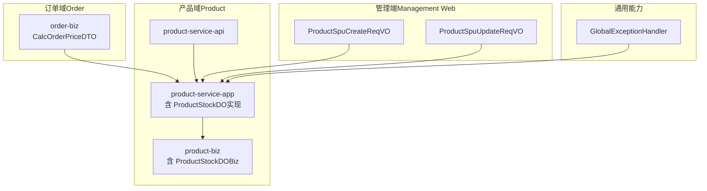
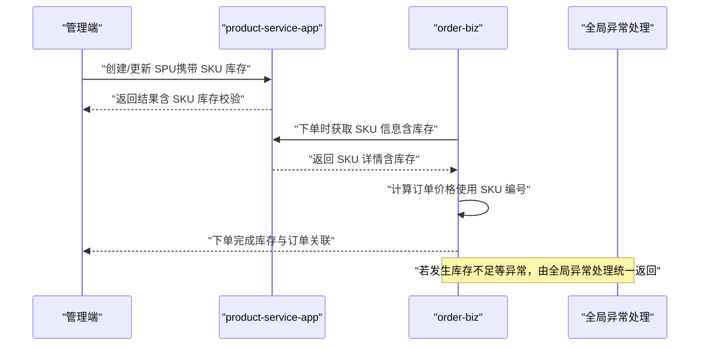
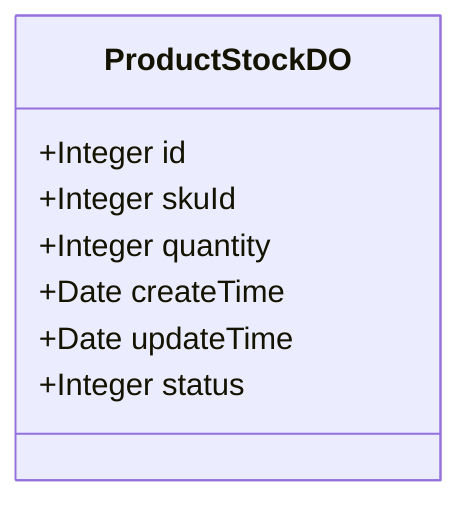
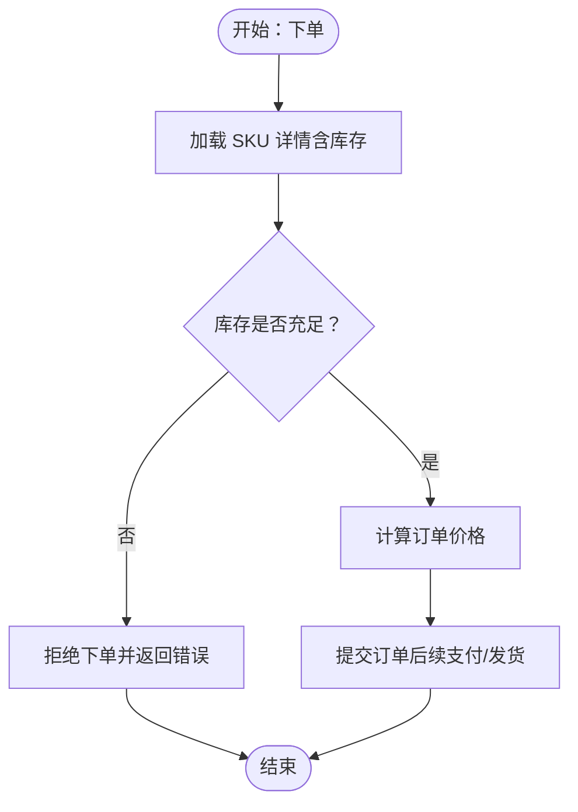
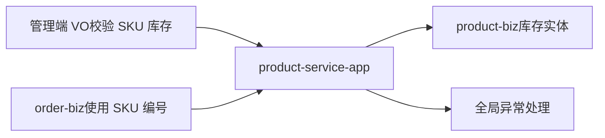

# 库存管理

<cite>
**本文引用的文件**
- [ProductStockDO.java（product-biz）](file://moved/product/product-biz/src/main/java/cn/iocoder/mall/product/biz/dataobject/stock/ProductStockDO.java)
- [ProductStockDO.java（product-service-impl）](file://moved/product/product-service-impl/src/main/java/cn/iocoder/mall/product/dataobject/ProductStockDO.java)
- [GlobalExceptionHandler.java](file://common/mall-spring-boot-starter-web/src/main/java/cn/iocoder/mall/web/core/handler/GlobalExceptionHandler.java)
- [ProductSpuCreateReqVO.java](file://management-web-app/src/main/java/cn/iocoder/mall/managementweb/controller/product/vo/spu/ProductSpuCreateReqVO.java)
- [ProductSpuUpdateReqVO.java](file://management-web-app/src/main/java/cn/iocoder/mall/managementweb/controller/product/vo/spu/ProductSpuUpdateReqVO.java)
- [ProductSpuBO.java](file://moved/product/product-biz/src/main/java/cn/iocoder/mall/product/biz/bo/product/ProductSpuBO.java)
- [ProductSkuDetailBO.java](file://moved/product/product-biz/src/main/java/cn/iocoder/mall/product/biz/bo/product/ProductSkuDetailBO.java)
- [CalcOrderPriceDTO.java](file://moved/order/order-biz/src/main/java/cn/iocoder/mall/order/biz/dto/order/CalcOrderPriceDTO.java)
</cite>

## 目录
1. [引言](#引言)
2. [项目结构](#项目结构)
3. [核心组件](#核心组件)
4. [架构总览](#架构总览)
5. [详细组件分析](#详细组件分析)
6. [依赖分析](#依赖分析)
7. [性能考虑](#性能考虑)
8. [故障排查指南](#故障排查指南)
9. [结论](#结论)
10. [附录](#附录)

## 引言
本技术文档围绕电商系统中的“库存管理”主题展开，系统性阐述库存在电商系统中的核心地位、数据模型设计、业务逻辑（库存扣减/释放/增加）、与订单的关联流程、RPC 接口设计、最佳实践以及监控方案。需要特别说明的是：当前仓库中存在一个标记为“暂不启用”的库存实体类，表明该模块尚未正式上线或仍处于迁移阶段。本文在不虚构现有实现的前提下，基于仓库中可验证的实体、BO、VO、异常处理与订单 DTO 等文件进行分析，并给出面向未来的架构建议与落地路径。

## 项目结构
与库存管理直接相关的关键位置如下：
- 数据模型层：位于 product 模块的 biz 与 service 实现中，包含库存实体类
- 订单侧引用：在订单 Biz 层的计算价格 DTO 中出现 SKU 编号字段，体现库存与订单的耦合点
- 管理端 VO：管理后台在创建/更新 SPU 时对 SKU 的库存字段进行校验
- 全局异常处理：对“商品库存不足”等错误进行统一处理
- BO 层：SPU/SKU 的库存聚合与展示

图示来源
- [ProductStockDO.java（product-biz）:1-45](file://moved/product/product-biz/src/main/java/cn/iocoder/mall/product/biz/dataobject/stock/ProductStockDO.java#L1-L45)
- [ProductStockDO.java（product-service-impl）:1-45](file://moved/product/product-service-impl/src/main/java/cn/iocoder/mall/product/dataobject/ProductStockDO.java#L1-L45)
- [CalcOrderPriceDTO.java:1-60](file://moved/order/order-biz/src/main/java/cn/iocoder/mall/order/biz/dto/order/CalcOrderPriceDTO.java#L1-L60)
- [ProductSpuCreateReqVO.java:1-80](file://management-web-app/src/main/java/cn/iocoder/mall/managementweb/controller/product/vo/spu/ProductSpuCreateReqVO.java#L1-L80)
- [ProductSpuUpdateReqVO.java:1-80](file://management-web-app/src/main/java/cn/iocoder/mall/managementweb/controller/product/vo/spu/ProductSpuUpdateReqVO.java#L1-L80)
- [GlobalExceptionHandler.java:140-160](file://common/mall-spring-boot-starter-web/src/main/java/cn/iocoder/mall/web/core/handler/GlobalExceptionHandler.java#L140-L160)

章节来源
- [ProductStockDO.java（product-biz）:1-45](file://moved/product/product-biz/src/main/java/cn/iocoder/mall/product/biz/dataobject/stock/ProductStockDO.java#L1-L45)
- [ProductStockDO.java（product-service-impl）:1-45](file://moved/product/product-service-impl/src/main/java/cn/iocoder/mall/product/dataobject/ProductStockDO.java#L1-L45)
- [CalcOrderPriceDTO.java:1-60](file://moved/order/order-biz/src/main/java/cn/iocoder/mall/order/biz/dto/order/CalcOrderPriceDTO.java#L1-L60)
- [ProductSpuCreateReqVO.java:1-80](file://management-web-app/src/main/java/cn/iocoder/mall/managementweb/controller/product/vo/spu/ProductSpuCreateReqVO.java#L1-L80)
- [ProductSpuUpdateReqVO.java:1-80](file://management-web-app/src/main/java/cn/iocoder/mall/managementweb/controller/product/vo/spu/ProductSpuUpdateReqVO.java#L1-L80)
- [GlobalExceptionHandler.java:140-160](file://common/mall-spring-boot-starter-web/src/main/java/cn/iocoder/mall/web/core/handler/GlobalExceptionHandler.java#L140-L160)

## 核心组件
- 库存实体（ProductStockDO）
  - 字段：id、skuId、quantity、createTime、updateTime、status
  - 当前状态：被标注为“暂不启用”，用于后续库存服务落地
- 订单侧 SKU 引用
  - CalcOrderPriceDTO 中包含 SKU 编号字段，体现下单时对 SKU 的依赖
- 管理端库存字段校验
  - ProductSpuCreateReqVO 与 ProductSpuUpdateReqVO 对 SKU 的库存数量进行非空与最小值校验
- 全局异常处理
  - GlobalExceptionHandler 对“商品库存不足”等业务异常进行统一处理

章节来源
- [ProductStockDO.java（product-biz）:1-45](file://moved/product/product-biz/src/main/java/cn/iocoder/mall/product/biz/dataobject/stock/ProductStockDO.java#L1-L45)
- [ProductStockDO.java（product-service-impl）:1-45](file://moved/product/product-service-impl/src/main/java/cn/iocoder/mall/product/dataobject/ProductStockDO.java#L1-L45)
- [CalcOrderPriceDTO.java:1-60](file://moved/order/order-biz/src/main/java/cn/iocoder/mall/order/biz/dto/order/CalcOrderPriceDTO.java#L1-L60)
- [ProductSpuCreateReqVO.java:1-80](file://management-web-app/src/main/java/cn/iocoder/mall/managementweb/controller/product/vo/spu/ProductSpuCreateReqVO.java#L1-L80)
- [ProductSpuUpdateReqVO.java:1-80](file://management-web-app/src/main/java/cn/iocoder/mall/managementweb/controller/product/vo/spu/ProductSpuUpdateReqVO.java#L1-L80)
- [GlobalExceptionHandler.java:140-160](file://common/mall-spring-boot-starter-web/src/main/java/cn/iocoder/mall/web/core/handler/GlobalExceptionHandler.java#L140-L160)

## 架构总览
从当前仓库可见的调用链路看，库存与订单、管理端存在以下交互：
- 管理端在创建/更新 SPU 时，对 SKU 的库存数量进行参数校验
- 订单 Biz 在计算价格时使用 SKU 编号（体现库存与订单的耦合点）
- 全局异常处理器对库存不足等业务异常进行统一处理
- product-service-app/service 实现中沉淀了库存实体（ProductStockDO），为后续库存服务落地提供基础

图示来源
- [ProductSpuCreateReqVO.java:1-80](file://management-web-app/src/main/java/cn/iocoder/mall/managementweb/controller/product/vo/spu/ProductSpuCreateReqVO.java#L1-L80)
- [ProductSpuUpdateReqVO.java:1-80](file://management-web-app/src/main/java/cn/iocoder/mall/managementweb/controller/product/vo/spu/ProductSpuUpdateReqVO.java#L1-L80)
- [CalcOrderPriceDTO.java:1-60](file://moved/order/order-biz/src/main/java/cn/iocoder/mall/order/biz/dto/order/CalcOrderPriceDTO.java#L1-L60)
- [GlobalExceptionHandler.java:140-160](file://common/mall-spring-boot-starter-web/src/main/java/cn/iocoder/mall/web/core/handler/GlobalExceptionHandler.java#L140-L160)

## 详细组件分析

### 数据模型：ProductStockDO
- 角色定位：库存实体，承载 SKU 级别的库存数量与生命周期字段
- 关键字段说明
  - id：自增主键
  - skuId：SKU 编号，作为库存记录的业务键
  - quantity：库存数量
  - createTime/updateTime：创建与最后更新时间
  - status：状态（1-正常；2-删除）
- 设计要点
  - 使用 Lombok 注解简化 POJO
  - 字段命名清晰，便于后续扩展（如新增冻结库存、安全库存等）
  - 当前标注为“暂不启用”，建议在库存服务落地时启用并补充索引与约束

图示来源
- [ProductStockDO.java（product-biz）:1-45](file://moved/product/product-biz/src/main/java/cn/iocoder/mall/product/biz/dataobject/stock/ProductStockDO.java#L1-L45)
- [ProductStockDO.java（product-service-impl）:1-45](file://moved/product/product-service-impl/src/main/java/cn/iocoder/mall/product/dataobject/ProductStockDO.java#L1-L45)

章节来源
- [ProductStockDO.java（product-biz）:1-45](file://moved/product/product-biz/src/main/java/cn/iocoder/mall/product/biz/dataobject/stock/ProductStockDO.java#L1-L45)
- [ProductStockDO.java（product-service-impl）:1-45](file://moved/product/product-service-impl/src/main/java/cn/iocoder/mall/product/dataobject/ProductStockDO.java#L1-L45)

### 订单与库存关联：CalcOrderPriceDTO
- 作用：在订单价格计算过程中，通过 SKU 编号获取 SKU 详情（含库存），用于判断是否可售
- 影响：下单流程与库存强相关，需确保库存一致性与并发安全

图示来源
- [CalcOrderPriceDTO.java:1-60](file://moved/order/order-biz/src/main/java/cn/iocoder/mall/order/biz/dto/order/CalcOrderPriceDTO.java#L1-L60)

章节来源
- [CalcOrderPriceDTO.java:1-60](file://moved/order/order-biz/src/main/java/cn/iocoder/mall/order/biz/dto/order/CalcOrderPriceDTO.java#L1-L60)

### 管理端库存参数校验：ProductSpuCreateReqVO / ProductSpuUpdateReqVO
- 作用：在管理端创建/更新 SPU 时，对 SKU 的库存数量进行非空与最小值校验
- 影响：从源头保证 SKU 库存数据的合理性，降低下游异常概率

章节来源
- [ProductSpuCreateReqVO.java:1-80](file://management-web-app/src/main/java/cn/iocoder/mall/managementweb/controller/product/vo/spu/ProductSpuCreateReqVO.java#L1-L80)
- [ProductSpuUpdateReqVO.java:1-80](file://management-web-app/src/main/java/cn/iocoder/mall/managementweb/controller/product/vo/spu/ProductSpuUpdateReqVO.java#L1-L80)

### 全局异常处理：库存不足
- 作用：对“商品库存不足”等业务异常进行统一捕获与返回
- 影响：提升用户体验与系统可观测性，便于前端与运营侧快速定位问题

章节来源
- [GlobalExceptionHandler.java:140-160](file://common/mall-spring-boot-starter-web/src/main/java/cn/iocoder/mall/web/core/handler/GlobalExceptionHandler.java#L140-L160)

### BO 层库存聚合：ProductSpuBO / ProductSkuDetailBO
- 作用：在业务对象中对 SKU 的库存进行聚合与展示，便于上层调用方使用
- 影响：降低调用方对底层数据结构的依赖，提升可维护性

章节来源
- [ProductSpuBO.java:1-120](file://moved/product/product-biz/src/main/java/cn/iocoder/mall/product/biz/bo/product/ProductSpuBO.java#L1-L120)
- [ProductSkuDetailBO.java:1-80](file://moved/product/product-biz/src/main/java/cn/iocoder/mall/product/biz/bo/product/ProductSkuDetailBO.java#L1-L80)

## 依赖分析
- 组件耦合
  - 订单 Biz 依赖 SKU 信息（含库存），体现库存与订单的紧耦合
  - 管理端对 SKU 库存进行参数校验，形成“上游约束”
  - 全局异常处理对库存相关错误进行兜底
- 潜在风险
  - 当前库存实体被标注为“暂不启用”，若直接复用现有实体，需评估并发与一致性保障
  - 订单与库存的耦合度较高，建议通过 RPC 或消息队列解耦

图示来源
- [ProductSpuCreateReqVO.java:1-80](file://management-web-app/src/main/java/cn/iocoder/mall/managementweb/controller/product/vo/spu/ProductSpuCreateReqVO.java#L1-L80)
- [ProductSpuUpdateReqVO.java:1-80](file://management-web-app/src/main/java/cn/iocoder/mall/managementweb/controller/product/vo/spu/ProductSpuUpdateReqVO.java#L1-L80)
- [CalcOrderPriceDTO.java:1-60](file://moved/order/order-biz/src/main/java/cn/iocoder/mall/order/biz/dto/order/CalcOrderPriceDTO.java#L1-L60)
- [ProductStockDO.java（product-biz）:1-45](file://moved/product/product-biz/src/main/java/cn/iocoder/mall/product/biz/dataobject/stock/ProductStockDO.java#L1-L45)
- [GlobalExceptionHandler.java:140-160](file://common/mall-spring-boot-starter-web/src/main/java/cn/iocoder/mall/web/core/handler/GlobalExceptionHandler.java#L140-L160)

## 性能考虑
- 并发与一致性
  - 建议采用数据库行级锁或分布式锁，确保库存扣减的原子性
  - 对高频 SKU 的库存读写进行缓存（如 Redis），并配合异步刷新策略
- 事务边界
  - 下单到支付完成的全流程应保持在同一事务或通过补偿机制保证最终一致
- 监控与告警
  - 对库存扣减失败率、超时请求、热点 SKU 的访问延迟进行监控
  - 设置库存阈值告警，触发补货流程

## 故障排查指南
- 常见问题
  - 库存不足：检查 CalcOrderPriceDTO 是否正确加载 SKU 库存；确认全局异常处理是否拦截并返回
  - 参数校验失败：核对管理端 VO 的校验规则是否生效
  - 并发冲突：排查是否存在未加锁的库存扣减逻辑
- 定位步骤
  - 查看全局异常日志，定位具体异常类型
  - 追踪订单 Biz 到 product-service-app 的调用链路
  - 核查 SKU 库存的初始化与更新路径

章节来源
- [GlobalExceptionHandler.java:140-160](file://common/mall-spring-boot-starter-web/src/main/java/cn/iocoder/mall/web/core/handler/GlobalExceptionHandler.java#L140-L160)
- [CalcOrderPriceDTO.java:1-60](file://moved/order/order-biz/src/main/java/cn/iocoder/mall/order/biz/dto/order/CalcOrderPriceDTO.java#L1-L60)
- [ProductSpuCreateReqVO.java:1-80](file://management-web-app/src/main/java/cn/iocoder/mall/managementweb/controller/product/vo/spu/ProductSpuCreateReqVO.java#L1-L80)
- [ProductSpuUpdateReqVO.java:1-80](file://management-web-app/src/main/java/cn/iocoder/mall/managementweb/controller/product/vo/spu/ProductSpuUpdateReqVO.java#L1-L80)

## 结论
当前仓库中，库存管理以“暂不启用”的实体类形式存在，但已具备与订单、管理端、异常处理的初步耦合关系。建议尽快完善库存服务的 RPC 接口与事务/并发控制机制，明确库存类型与状态字段，并建立完善的监控与告警体系，以支撑高并发场景下的库存准确性、实时性与一致性目标。

## 附录
- 术语
  - SKU：库存量单位，每个 SKU 对应唯一的库存记录
  - 库存类型：按用途划分（如销售可用、冻结、预留等）
  - 库存状态：正常/删除等生命周期状态
- 参考实现路径
  - 启用并完善 ProductStockDO，补充索引与约束
  - 在 product-service-api 中定义库存 RPC 接口（查询、扣减、释放、同步）
  - 在 product-service-app 中实现库存服务，结合缓存与消息队列保证一致性
  - 在 order-biz 中通过 RPC 获取库存并执行扣减，失败时回滚并抛出业务异常
  - 在管理端完善 SKU 库存的参数校验与批量导入能力