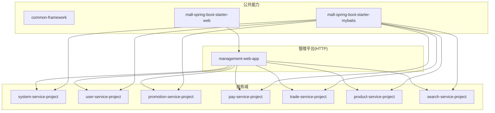
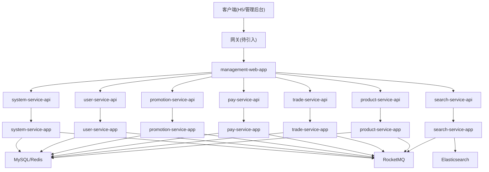
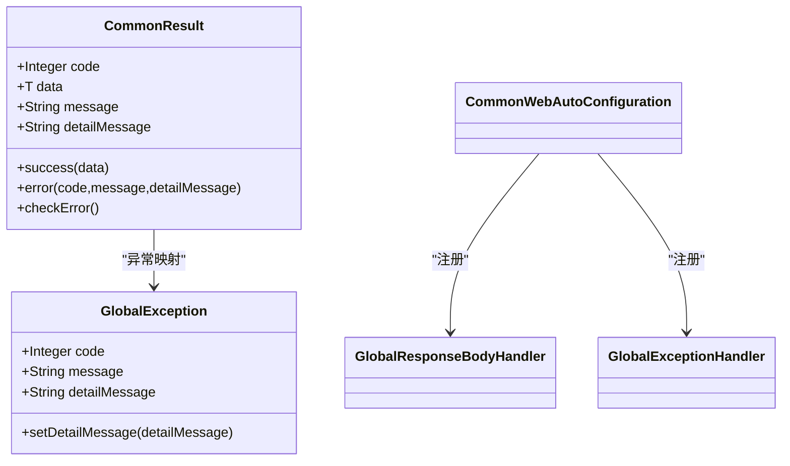
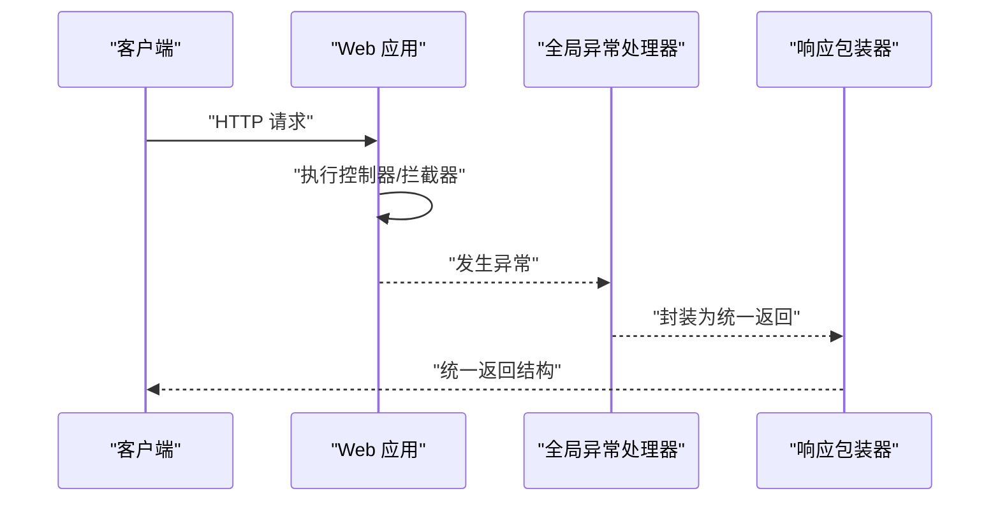
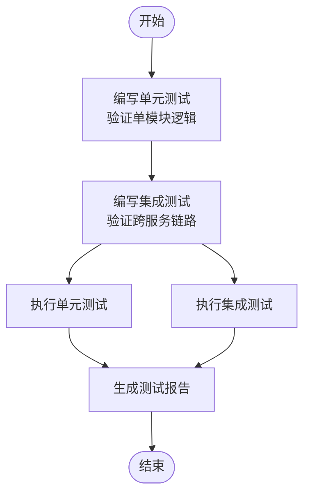
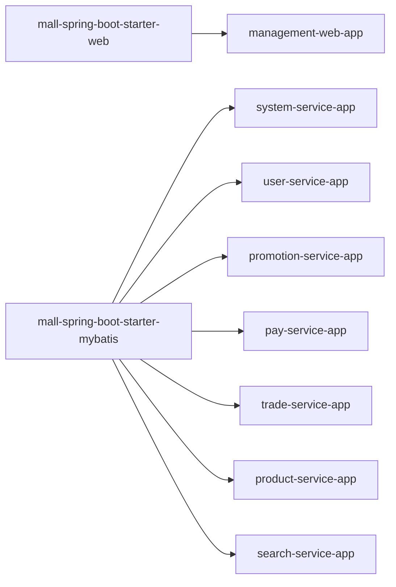

# 开发指南

<cite>
**本文引用的文件**
- [README.md](file://README.md)
- [docs/README.md](file://docs/README.md)
- [.editorconfig](file://.editorconfig)
- [.gitignore](file://.gitignore)
- [docs/setup/quick-start.md](file://docs/setup/quick-start.md)
- [common/common-framework/src/main/java/cn/iocoder/common/framework/vo/CommonResult.java](file://common/common-framework/src/main/java/cn/iocoder/common/framework/vo/CommonResult.java)
- [common/common-framework/src/main/java/cn/iocoder/common/framework/exception/GlobalException.java](file://common/common-framework/src/main/java/cn/iocoder/common/framework/exception/GlobalException.java)
- [common/common-framework/src/main/java/cn/iocoder/common/framework/util/ValidationUtil.java](file://common/common-framework/src/main/java/cn/iocoder/common/framework/util/ValidationUtil.java)
- [common/mall-spring-boot-starter-web/src/main/java/cn/iocoder/mall/web/config/CommonWebAutoConfiguration.java](file://common/mall-spring-boot-starter-web/src/main/java/cn/iocoder/mall/web/config/CommonWebAutoConfiguration.java)
- [common/mall-spring-boot-starter-web/src/main/resources/META-INF/spring.factories](file://common/mall-spring-boot-starter-web/src/main/resources/META-INF/spring.factories)
- [common/mall-spring-boot-starter-mybatis/src/main/resources/META-INF/spring.factories](file://common/mall-spring-boot-starter-mybatis/src/main/resources/META-INF/spring.factories)
- [management-web-app/src/main/resources/application.yml](file://management-web-app/src/main/resources/application.yml)
- [management-web-app/src/main/java/cn/iocoder/mall/managementweb/ManagementWebApplication.java](file://management-web-app/src/main/java/cn/iocoder/mall/managementweb/ManagementWebApplication.java)
- [pay-service-project/pay-service-integration-test/src/test/java/cn/iocoder/mall/payservice/service/transaction/impl/PayTransactionServiceImplTest.java](file://pay-service-project/pay-service-integration-test/src/test/java/cn/iocoder/mall/payservice/service/transaction/impl/PayTransactionServiceImplTest.java)
- [system-service-project/system-service-integration-test/src/test/java/cn/iocoder/mall/systemservice/service/oauth/OAuth2ServiceImplTest.java](file://system-service-project/system-service-integration-test/src/test/java/cn/iocoder/mall/systemservice/service/oauth/OAuth2ServiceImplTest.java)
- [trade-service-project/trade-service-integration-test/src/test/java/cn/iocoder/mall/tradeservice/service/order/impl/TradeOrderServiceImplTest.java](file://trade-service-project/trade-service-integration-test/src/test/java/cn/iocoder/mall/tradeservice/service/order/impl/TradeOrderServiceImplTest.java)
</cite>

## 目录
1. [引言](#引言)
2. [项目结构](#项目结构)
3. [核心组件](#核心组件)
4. [架构总览](#架构总览)
5. [详细组件分析](#详细组件分析)
6. [依赖分析](#依赖分析)
7. [性能考量](#性能考量)
8. [故障排查指南](#故障排查指南)
9. [结论](#结论)
10. [附录](#附录)

## 引言
本指南面向 Onemall 项目开发团队，旨在提供一套统一、可执行的开发规范与最佳实践，覆盖代码规范、开发环境搭建、测试策略、调试技巧、代码评审与质量保证、常见问题与最佳实践案例，以及新功能开发的完整流程。通过遵循本文档，确保团队协作的一致性与开发效率。

## 项目结构
Onemall 采用多模块聚合工程组织，后端按“web 应用 + 服务应用 + 接口 API + 集成测试”的分层结构划分；公共能力沉淀在 common 子模块；各业务域服务独立部署并以 Dubbo RPC 交互；前端分别提供管理后台与 H5 商城。

- 后端模块典型结构
  - web 应用：对外 HTTP API，如 management-web-app、shop-web-app
  - 服务应用：RPC 实现，如 system-service-project、user-service-project 等
  - 接口 API：RPC 接口定义，如 system-service-api、user-service-api 等
  - 集成测试：xxx-service-integration-test

- 公共能力
  - common-framework：通用 VO、异常、工具类
  - mall-spring-boot-starter-*：自动装配与基础能力封装

- 前端模块
  - 管理后台 Vue 工程
  - H5 商城 Vue 工程

- 中间件与运维
  - Zookeeper 注册中心、RocketMQ 消息、Elasticsearch 搜索、XXL-Job 任务、SkyWalking 链路追踪、Prometheus/Grafana 指标监控

图表来源
- [README.md:129-139](file://README.md#L129-L139)
- [docs/setup/quick-start.md:150-167](file://docs/setup/quick-start.md#L150-L167)

章节来源
- [README.md:107-139](file://README.md#L107-L139)
- [docs/README.md:1-12](file://docs/README.md#L1-L12)

## 核心组件
本节聚焦于支撑统一返回、全局异常处理、Web 层自动装配与拦截器、参数校验工具等关键组件。

- 统一返回对象
  - CommonResult：封装 code、message、data、detailMessage，提供 success/error 工厂方法与异常检查逻辑，便于前后端一致的契约。
  - 关键行为：checkError 将错误映射为 GlobalException 或 ServiceException 抛出，便于上层统一处理。

- 全局异常与业务异常
  - GlobalException：承载全局错误码与详情信息，便于跨服务传递与日志定位。
  - ServiceException：承载业务错误码与详情信息，配合统一返回使用。

- Web 自动装配与拦截器
  - CommonWebAutoConfiguration：注册全局响应包装器、全局异常处理器、跨域过滤器、Fastjson 转换器、访问日志拦截器等。
  - spring.factories：声明自动装配入口，实现零配置接入。

- 参数校验工具
  - ValidationUtil：提供手机号、URL 等常用校验方法，便于 DTO 层前置校验。

章节来源
- [common/common-framework/src/main/java/cn/iocoder/common/framework/vo/CommonResult.java:1-155](file://common/common-framework/src/main/java/cn/iocoder/common/framework/vo/CommonResult.java#L1-L155)
- [common/common-framework/src/main/java/cn/iocoder/common/framework/exception/GlobalException.java:1-72](file://common/common-framework/src/main/java/cn/iocoder/common/framework/exception/GlobalException.java#L1-L72)
- [common/mall-spring-boot-starter-web/src/main/java/cn/iocoder/mall/web/config/CommonWebAutoConfiguration.java:1-97](file://common/mall-spring-boot-starter-web/src/main/java/cn/iocoder/mall/web/config/CommonWebAutoConfiguration.java#L1-L97)
- [common/mall-spring-boot-starter-web/src/main/resources/META-INF/spring.factories:1-3](file://common/mall-spring-boot-starter-web/src/main/resources/META-INF/spring.factories#L1-L3)
- [common/common-framework/src/main/java/cn/iocoder/common/framework/util/ValidationUtil.java:1-30](file://common/common-framework/src/main/java/cn/iocoder/common/framework/util/ValidationUtil.java#L1-L30)

## 架构总览
Onemall 采用微服务架构，以 Spring Boot + Spring Cloud Alibaba 为核心，结合 Dubbo RPC、Zookeeper 注册中心、RocketMQ 消息队列、Elasticsearch 搜索、XXL-Job 任务调度、SkyWalking 链路追踪与 Prometheus/Grafana 指标监控，形成完整的电商后端能力体系。

图表来源
- [README.md:141-168](file://README.md#L141-L168)
- [docs/setup/quick-start.md:50-98](file://docs/setup/quick-start.md#L50-L98)

## 详细组件分析

### 统一返回与异常处理
- 设计要点
  - 统一返回结构，前后端约定一致，减少对接成本
  - 异常体系区分全局异常与业务异常，便于前端友好提示与后端精准定位
  - 在 Web 层自动装配异常处理器与响应包装器，降低重复代码

图表来源
- [common/common-framework/src/main/java/cn/iocoder/common/framework/vo/CommonResult.java:1-155](file://common/common-framework/src/main/java/cn/iocoder/common/framework/vo/CommonResult.java#L1-L155)
- [common/common-framework/src/main/java/cn/iocoder/common/framework/exception/GlobalException.java:1-72](file://common/common-framework/src/main/java/cn/iocoder/common/framework/exception/GlobalException.java#L1-L72)
- [common/mall-spring-boot-starter-web/src/main/java/cn/iocoder/mall/web/config/CommonWebAutoConfiguration.java:36-46](file://common/mall-spring-boot-starter-web/src/main/java/cn/iocoder/mall/web/config/CommonWebAutoConfiguration.java#L36-L46)

章节来源
- [common/common-framework/src/main/java/cn/iocoder/common/framework/vo/CommonResult.java:127-154](file://common/common-framework/src/main/java/cn/iocoder/common/framework/vo/CommonResult.java#L127-L154)
- [common/common-framework/src/main/java/cn/iocoder/common/framework/exception/GlobalException.java:9-71](file://common/common-framework/src/main/java/cn/iocoder/common/framework/exception/GlobalException.java#L9-L71)
- [common/mall-spring-boot-starter-web/src/main/java/cn/iocoder/mall/web/config/CommonWebAutoConfiguration.java:34-46](file://common/mall-spring-boot-starter-web/src/main/java/cn/iocoder/mall/web/config/CommonWebAutoConfiguration.java#L34-L46)

### Web 层自动装配与拦截器
- 自动装配内容
  - 全局响应包装器：统一输出结构
  - 全局异常处理器：捕获异常并转为统一返回
  - 访问日志拦截器：可选启用，记录请求日志
  - CORS 过滤器：跨域支持
  - Fastjson 转换器：高性能 JSON 序列化

图表来源
- [common/mall-spring-boot-starter-web/src/main/java/cn/iocoder/mall/web/config/CommonWebAutoConfiguration.java:36-46](file://common/mall-spring-boot-starter-web/src/main/java/cn/iocoder/mall/web/config/CommonWebAutoConfiguration.java#L36-L46)
- [common/mall-spring-boot-starter-web/src/main/resources/META-INF/spring.factories:1-3](file://common/mall-spring-boot-starter-web/src/main/resources/META-INF/spring.factories#L1-L3)

章节来源
- [common/mall-spring-boot-starter-web/src/main/java/cn/iocoder/mall/web/config/CommonWebAutoConfiguration.java:57-94](file://common/mall-spring-boot-starter-web/src/main/java/cn/iocoder/mall/web/config/CommonWebAutoConfiguration.java#L57-L94)
- [common/mall-spring-boot-starter-web/src/main/resources/META-INF/spring.factories:1-3](file://common/mall-spring-boot-starter-web/src/main/resources/META-INF/spring.factories#L1-L3)

### 参数校验与 DTO 规范
- 建议
  - 使用 ValidationUtil 进行基础字段校验（手机号、URL）
  - 控制器层使用 JSR-303 注解进行参数约束
  - 服务层对关键业务参数进行二次校验，确保边界安全

章节来源
- [common/common-framework/src/main/java/cn/iocoder/common/framework/util/ValidationUtil.java:10-23](file://common/common-framework/src/main/java/cn/iocoder/common/framework/util/ValidationUtil.java#L10-L23)

### 测试策略与实现
- 单元测试
  - 使用 JUnit + Spring Boot Test，在单模块内验证核心逻辑
  - 示例：系统服务 OAuth2 校验、交易订单创建、支付事务提交

- 集成测试
  - 在 xxx-service-integration-test 模块中，验证跨服务调用链路与外部依赖一致性
  - 示例：支付事务集成测试、交易订单集成测试

章节来源
- [pay-service-project/pay-service-integration-test/src/test/java/cn/iocoder/mall/payservice/service/transaction/impl/PayTransactionServiceImplTest.java:1-28](file://pay-service-project/pay-service-integration-test/src/test/java/cn/iocoder/mall/payservice/service/transaction/impl/PayTransactionServiceImplTest.java#L1-L28)
- [system-service-project/system-service-integration-test/src/test/java/cn/iocoder/mall/systemservice/service/oauth/OAuth2ServiceImplTest.java:1-22](file://system-service-project/system-service-integration-test/src/test/java/cn/iocoder/mall/systemservice/service/oauth/OAuth2ServiceImplTest.java#L1-L22)
- [trade-service-project/trade-service-integration-test/src/test/java/cn/iocoder/mall/tradeservice/service/order/impl/TradeOrderServiceImplTest.java:1-35](file://trade-service-project/trade-service-integration-test/src/test/java/cn/iocoder/mall/tradeservice/service/order/impl/TradeOrderServiceImplTest.java#L1-L35)

## 依赖分析
- 自动装配依赖
  - mall-spring-boot-starter-web 通过 spring.factories 自动注册 Web 层组件
  - mall-spring-boot-starter-mybatis 通过 spring.factories 自动注册 MyBatis Plus 配置

- Web 应用依赖
  - management-web-app 通过 application.yml 配置 Dubbo 消费者版本、Swagger、Actuator 等

图表来源
- [common/mall-spring-boot-starter-web/src/main/resources/META-INF/spring.factories:1-3](file://common/mall-spring-boot-starter-web/src/main/resources/META-INF/spring.factories#L1-L3)
- [common/mall-spring-boot-starter-mybatis/src/main/resources/META-INF/spring.factories:1-2](file://common/mall-spring-boot-starter-mybatis/src/main/resources/META-INF/spring.factories#L1-L2)
- [management-web-app/src/main/resources/application.yml:19-78](file://management-web-app/src/main/resources/application.yml#L19-L78)

章节来源
- [common/mall-spring-boot-starter-web/src/main/resources/META-INF/spring.factories:1-3](file://common/mall-spring-boot-starter-web/src/main/resources/META-INF/spring.factories#L1-L3)
- [common/mall-spring-boot-starter-mybatis/src/main/resources/META-INF/spring.factories:1-2](file://common/mall-spring-boot-starter-mybatis/src/main/resources/META-INF/spring.factories#L1-L2)
- [management-web-app/src/main/resources/application.yml:19-78](file://management-web-app/src/main/resources/application.yml#L19-L78)

## 性能考量
- JSON 序列化
  - 使用 Fastjson 并禁用循环引用检测与非字符串 Key 序列化特性，提升兼容性与性能
- 数据访问
  - MyBatis Plus 自动配置已注入，建议结合分页查询与索引设计优化
- 监控与追踪
  - SkyWalking 链路追踪、Prometheus 指标采集、Grafana 可视化，建议建立关键指标阈值告警
- 缓存与异步
  - Redis/Redisson 作为未来引入方向，建议优先对热点读取与幂等写入场景进行缓存优化
- 消息队列
  - RocketMQ 用于削峰填谷与最终一致性，建议对高并发场景进行分区与重试策略设计

## 故障排查指南
- 启动顺序
  - 建议先启动 system-service，再依次启动 user、product、pay、promotion、order、search，避免消费者侧找不到提供者导致的启动失败

- 配置校验
  - MySQL、Zookeeper、RocketMQ、Elasticsearch 等中间件配置需与各服务 application.yaml 保持一致
  - Actuator 独立端口暴露，便于健康检查与指标导出

- 日志与异常
  - 统一异常处理器将异常转为 CommonResult，前端可根据 code/message 判断错误类型
  - 访问日志拦截器可选启用，便于定位请求链路

章节来源
- [docs/setup/quick-start.md:150-167](file://docs/setup/quick-start.md#L150-L167)
- [management-web-app/src/main/resources/application.yml:80-83](file://management-web-app/src/main/resources/application.yml#L80-L83)
- [common/mall-spring-boot-starter-web/src/main/java/cn/iocoder/mall/web/config/CommonWebAutoConfiguration.java:57-65](file://common/mall-spring-boot-starter-web/src/main/java/cn/iocoder/mall/web/config/CommonWebAutoConfiguration.java#L57-L65)

## 结论
通过统一的返回与异常处理、完善的 Web 自动装配、严格的测试策略与可观测性体系，Onemall 项目能够有效提升开发效率与系统稳定性。建议团队在日常开发中持续遵循本文档的规范与流程，逐步引入缓存与异步化策略，持续优化性能与可靠性。

## 附录

### 代码规范与最佳实践
- 命名规范
  - 包名：全部小写，采用域名反写风格
  - 类名：大驼峰，语义明确
  - 方法名：小驼峰，动词开头
  - 常量：全大写，单词以下划线分隔
- 代码格式
  - 使用 EditorConfig 统一缩进与编码
- 注释规范
  - 类与方法使用中文注释，说明职责、参数、返回与异常
- 异常处理
  - 明确区分全局异常与业务异常，统一返回结构，避免泄露敏感信息

章节来源
- [.editorconfig:1-11](file://.editorconfig#L1-L11)

### 开发环境搭建
- IDE 与工具
  - IntelliJ IDEA、JDK 8+、Maven、NPM
- 中间件
  - MySQL、Zookeeper、RocketMQ、Elasticsearch、XXL-Job（可选）、SkyWalking、Prometheus/Grafana
- 启动顺序
  - System → User → Product → Pay → Promotion → Order → Search

章节来源
- [docs/setup/quick-start.md:9-18](file://docs/setup/quick-start.md#L9-L18)
- [docs/setup/quick-start.md:25-167](file://docs/setup/quick-start.md#L25-L167)

### Git 工作流与分支管理
- 分支策略
  - develop：主开发分支
  - feature/*：功能开发分支
  - release/*：预发布分支
  - hotfix/*：线上紧急修复分支
- 提交规范
  - 使用清晰的提交信息，关联 Issue 编号
- 合并与审查
  - Pull Request 需至少一名 Reviewer 通过，合并前确保无冲突与测试通过

章节来源
- [.gitignore:1-74](file://.gitignore#L1-L74)

### 测试执行与覆盖率
- 单元测试
  - 在模块内执行，验证核心逻辑正确性
- 集成测试
  - 在 integration-test 模块执行，验证跨服务链路
- 覆盖率
  - 建议在 CI 中引入覆盖率工具，设定最低阈值并持续改进

章节来源
- [pay-service-project/pay-service-integration-test/src/test/java/cn/iocoder/mall/payservice/service/transaction/impl/PayTransactionServiceImplTest.java:1-28](file://pay-service-project/pay-service-integration-test/src/test/java/cn/iocoder/mall/payservice/service/transaction/impl/PayTransactionServiceImplTest.java#L1-L28)
- [system-service-project/system-service-integration-test/src/test/java/cn/iocoder/mall/systemservice/service/oauth/OAuth2ServiceImplTest.java:1-22](file://system-service-project/system-service-integration-test/src/test/java/cn/iocoder/mall/systemservice/service/oauth/OAuth2ServiceImplTest.java#L1-L22)
- [trade-service-project/trade-service-integration-test/src/test/java/cn/iocoder/mall/tradeservice/service/order/impl/TradeOrderServiceImplTest.java:1-35](file://trade-service-project/trade-service-integration-test/src/test/java/cn/iocoder/mall/tradeservice/service/order/impl/TradeOrderServiceImplTest.java#L1-L35)

### 调试技巧与工具使用
- 断点调试
  - 在 Web 应用入口与关键服务方法设置断点，观察统一返回与异常处理
- 日志分析
  - 启用访问日志拦截器，结合 SkyWalking 链路追踪定位问题
- 性能分析
  - 使用 Prometheus + Grafana 监控关键指标，识别瓶颈
- 内存泄漏检测
  - 结合 JVM 监控与 GC 日志，定位异常增长

章节来源
- [management-web-app/src/main/java/cn/iocoder/mall/managementweb/ManagementWebApplication.java:1-14](file://management-web-app/src/main/java/cn/iocoder/mall/managementweb/ManagementWebApplication.java#L1-L14)
- [management-web-app/src/main/resources/application.yml:80-83](file://management-web-app/src/main/resources/application.yml#L80-L83)

### 代码审查流程与质量保证
- Pull Request 规范
  - 提交前自测，附带测试用例与变更说明
  - 至少一名 Reviewer 通过，确保代码风格、安全性与可维护性
- 代码检查工具
  - 使用 EditorConfig 与 IDE 插件统一风格
- 覆盖率要求
  - 建议设定最低覆盖率阈值并在 CI 中强制执行

章节来源
- [.editorconfig:1-11](file://.editorconfig#L1-L11)

### 常见问题与最佳实践案例
- 并发处理
  - 使用 RocketMQ 异步解耦，结合幂等设计与重试策略
- 事务管理
  - 优先使用本地事务，必要时引入 Seata 分布式事务中间件
- 缓存策略
  - 对热点读取使用缓存，写入采用延迟双删或异步更新
- 消息队列使用
  - 严格区分 Topic 与 Tag，合理设置分区与消费组，避免重复消费与丢失

章节来源
- [README.md:157-159](file://README.md#L157-L159)

### 新功能开发流程
- 需求评审 → 设计接口与 DTO → 编写单元测试 → 实现业务逻辑 → 编写集成测试 → 提交 PR → 代码评审 → 合并与回归测试

章节来源
- [README.md:107-139](file://README.md#L107-L139)