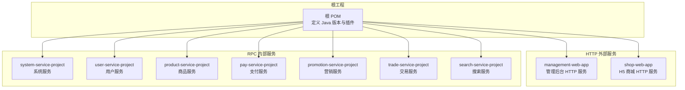
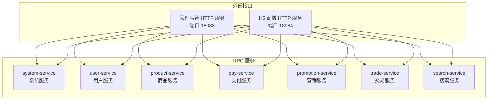
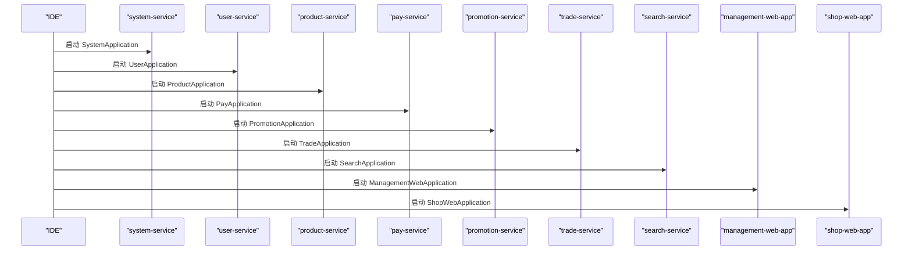
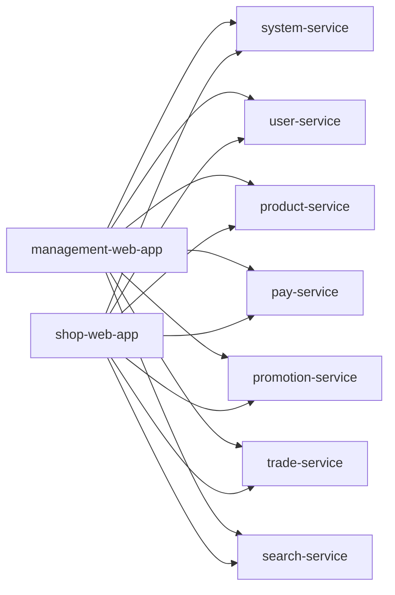

# 快速开始

<cite>
**本文引用的文件**
- [README.md](file://README.md)
- [docs/setup/quick-start.md](file://docs/setup/quick-start.md)
- [pom.xml](file://pom.xml)
- [management-web-app/src/main/resources/application.yml](file://management-web-app/src/main/resources/application.yml)
- [shop-web-app/src/main/resources/application.yml](file://shop-web-app/src/main/resources/application.yml)
- [user-service-project/user-service-app/src/main/resources/application.yaml](file://user-service-project/user-service-app/src/main/resources/application.yaml)
- [system-service-project/system-service-app/src/main/resources/application.yaml](file://system-service-project/system-service-app/src/main/resources/application.yaml)
- [product-service-project/product-service-app/src/main/resources/application.yaml](file://product-service-project/product-service-app/src/main/resources/application.yaml)
- [management-web-app/src/main/java/cn/iocoder/mall/managementweb/ManagementWebApplication.java](file://management-web-app/src/main/java/cn/iocoder/mall/managementweb/ManagementWebApplication.java)
- [shop-web-app/src/main/java/cn/iocoder/mall/shopweb/ShopWebApplication.java](file://shop-web-app/src/main/java/cn/iocoder/mall/shopweb/ShopWebApplication.java)
- [docs/sql/old/mall_order.sql](file://docs/sql/old/mall_order.sql)
</cite>

## 目录
1. [简介](#简介)
2. [项目结构](#项目结构)
3. [核心组件](#核心组件)
4. [架构总览](#架构总览)
5. [详细组件解析](#详细组件解析)
6. [依赖关系分析](#依赖关系分析)
7. [性能注意事项](#性能注意事项)
8. [故障排查指南](#故障排查指南)
9. [结论](#结论)
10. [附录](#附录)

## 简介
本指南面向首次接触 Onemall 的开发者，目标是在最短时间内完成本地开发环境搭建并成功运行系统。内容覆盖环境要求、依赖安装、数据库初始化、微服务启动顺序与关键配置、IDE 与 Maven 构建命令、Docker 部署思路、默认端口与配置文件位置、常见问题排查、服务可用性验证与测试接口指引。

## 项目结构
Onemall 采用多模块 Maven 工程组织，后端由多个“xxx-web-app”对外 HTTP 服务与“xxx-service-project”内部 RPC 服务组成。根 POM 定义了统一的 Java 版本与插件配置，便于跨模块一致化构建。

图表来源
- [pom.xml:16-28](file://pom.xml#L16-L28)
- [README.md:129-139](file://README.md#L129-L139)

章节来源
- [pom.xml:1-78](file://pom.xml#L1-L78)
- [README.md:107-139](file://README.md#L107-L139)

## 核心组件
- 管理后台 HTTP 服务：提供管理端 API，端口与上下文路径在配置文件中定义。
- H5 商城 HTTP 服务：提供用户购物流程 API，端口与上下文路径在配置文件中定义。
- RPC 服务：系统、用户、商品、支付、营销、交易、搜索等服务，通过 Dubbo 暴露 RPC 接口。
- 中间件：Zookeeper 注册中心、RocketMQ 消息队列、Elasticsearch 搜索引擎、XXL-Job 任务调度（可选）。

章节来源
- [README.md:109-126](file://README.md#L109-L126)
- [docs/setup/quick-start.md:9-191](file://docs/setup/quick-start.md#L9-L191)

## 架构总览
下图展示了 HTTP 服务与 RPC 服务之间的调用关系，以及消费者侧订阅的服务范围。

图表来源
- [management-web-app/src/main/resources/application.yml:19-71](file://management-web-app/src/main/resources/application.yml#L19-L71)
- [shop-web-app/src/main/resources/application.yml:19-64](file://shop-web-app/src/main/resources/application.yml#L19-L64)

章节来源
- [management-web-app/src/main/resources/application.yml:1-83](file://management-web-app/src/main/resources/application.yml#L1-L83)
- [shop-web-app/src/main/resources/application.yml:1-76](file://shop-web-app/src/main/resources/application.yml#L1-L76)

## 详细组件解析

### 环境要求与依赖安装
- 后端
  - JDK：Java 8（根 POM 显式声明）
  - Maven：用于构建与打包
  - IDE：IntelliJ IDEA（推荐）
- 前端
  - Node.js + NPM：用于启动 H5 与管理后台前端
- 中间件（按需安装）
  - Zookeeper：注册中心
  - RocketMQ：消息队列
  - Elasticsearch：搜索（如需全文检索）
  - XXL-Job：分布式任务调度（可选）

章节来源
- [pom.xml:32-37](file://pom.xml#L32-L37)
- [docs/setup/quick-start.md:9-19](file://docs/setup/quick-start.md#L9-L19)

### 数据库初始化脚本执行
- 在 MySQL 中依次导入以下 SQL：
  - 系统模块：system-service-app 的 schema 与 data
  - 用户模块：user-service-app 的 schema 与 data
  - 商品模块：product-service-app 的 schema 与 data
  - 订单模块：docs/sql/old 下的 mall_order.sql
- 导入顺序建议：先系统、用户、商品，再订单；或根据业务依赖顺序导入。

章节来源
- [docs/setup/quick-start.md:32-38](file://docs/setup/quick-start.md#L32-L38)
- [docs/sql/old/mall_order.sql:1-140](file://docs/sql/old/mall_order.sql#L1-L140)

### 各微服务默认端口与配置文件位置
- HTTP 服务
  - 管理后台 HTTP 服务：端口 18083，上下文路径 /management-api/
  - H5 商城 HTTP 服务：端口 18084，上下文路径 /shop-api/
- RPC 服务（Actuator 独立端口，实际 RPC 端口由注册中心分配）
  - system-service：Actuator 端口 38080
  - user-service：Actuator 端口 38081
  - product-service：Actuator 端口 38082
  - 其他服务类似，Actuator 端口在各自 application.yaml 中定义
- 配置文件位置
  - management-web-app：application.yml
  - shop-web-app：application.yml
  - 各 service-app：application.yaml（含 mybatis-plus、dubbo、rocketmq、actuator 等配置）

章节来源
- [management-web-app/src/main/resources/application.yml:2-3](file://management-web-app/src/main/resources/application.yml#L2-L3)
- [management-web-app/src/main/resources/application.yml:4-5](file://management-web-app/src/main/resources/application.yml#L4-L5)
- [shop-web-app/src/main/resources/application.yml:2-3](file://shop-web-app/src/main/resources/application.yml#L2-L3)
- [shop-web-app/src/main/resources/application.yml:4-5](file://shop-web-app/src/main/resources/application.yml#L4-L5)
- [system-service-project/system-service-app/src/main/resources/application.yaml:48-53](file://system-service-project/system-service-app/src/main/resources/application.yaml#L48-L53)
- [user-service-project/user-service-app/src/main/resources/application.yaml:48-53](file://user-service-project/user-service-app/src/main/resources/application.yaml#L48-L53)
- [product-service-project/product-service-app/src/main/resources/application.yaml:49-54](file://product-service-project/product-service-app/src/main/resources/application.yaml#L49-L54)

### 关键参数设置与中间件配置
- 数据源与 MyBatis-Plus
  - 在各 service-app 的 application.yaml 中配置数据源 URL、用户名、密码与 MyBatis-Plus Mapper 路径
- Zookeeper 注册中心
  - 在各 service-app 的 application.yaml 中设置 dubbo.registry.address
- RocketMQ
  - 在各 service-app 的 application.yaml 中设置 rocketmq.name-server 与 producer.group
- Elasticsearch（如启用）
  - 在 search-service-app 的 application.yaml 中设置集群名与节点
- XXL-Job（如启用）
  - 在各 service-app 的 application-dev.yaml 中设置 XXL-Job 管理地址、执行器 appname、日志路径等

章节来源
- [docs/setup/quick-start.md:36-48](file://docs/setup/quick-start.md#L36-L48)
- [docs/setup/quick-start.md:57-73](file://docs/setup/quick-start.md#L57-L73)
- [docs/setup/quick-start.md:82-91](file://docs/setup/quick-start.md#L82-L91)
- [docs/setup/quick-start.md:103-120](file://docs/setup/quick-start.md#L103-L120)

### 启动顺序与控制流
- 建议启动顺序（按依赖关系）：
  1) system-service（系统服务）
  2) user-service（用户服务）
  3) product-service（商品服务）
  4) pay-service（支付服务）
  5) promotion-service（营销服务）
  6) trade-service（交易服务）
  7) search-service（搜索服务）
- HTTP 服务最后启动：
  - management-web-app（管理后台）
  - shop-web-app（H5 商城）

图表来源
- [docs/setup/quick-start.md:156-167](file://docs/setup/quick-start.md#L156-L167)
- [management-web-app/src/main/java/cn/iocoder/mall/managementweb/ManagementWebApplication.java:1-14](file://management-web-app/src/main/java/cn/iocoder/mall/managementweb/ManagementWebApplication.java#L1-L14)
- [shop-web-app/src/main/java/cn/iocoder/mall/shopweb/ShopWebApplication.java:1-14](file://shop-web-app/src/main/java/cn/iocoder/mall/shopweb/ShopWebApplication.java#L1-L14)

章节来源
- [docs/setup/quick-start.md:150-167](file://docs/setup/quick-start.md#L150-L167)

### IDE 配置与 Maven 构建命令
- IDE：使用 IntelliJ IDEA 打开根工程，Maven 会自动加载子模块依赖
- Maven 构建命令（在根目录执行）
  - 清理并编译：mvn clean compile
  - 打包：mvn package
  - 如需跳过测试：mvn package -DskipTests
- 启动方式：在 IDE 中直接运行各 Application 类（见上节“启动顺序”）

章节来源
- [docs/setup/quick-start.md:21](file://docs/setup/quick-start.md#L21)
- [pom.xml:39-75](file://pom.xml#L39-L75)

### Docker 部署选项
- 当前仓库未提供 Dockerfile 或 docker-compose 编排文件
- 建议思路
  - 为每个 service-app 与 web-app 分别构建镜像
  - 使用 Docker Compose 编排：MySQL、Zookeeper、RocketMQ、Elasticsearch、各服务容器
  - 注意：中间件端口映射与服务间网络隔离
- 说明：如需 Docker 部署，请结合各模块实际运行参数补充镜像与编排文件

章节来源
- [README.md:204-206](file://README.md#L204-L206)

## 依赖关系分析
- 模块耦合
  - management-web-app 与 shop-web-app 作为消费者，订阅 system-service、user-service、product-service 等 RPC 服务
  - 各 service-app 之间通过 RPC 接口交互，减少直接耦合
- 外部依赖
  - 注册中心：Zookeeper
  - 消息队列：RocketMQ
  - 搜索：Elasticsearch
  - 任务调度：XXL-Job（可选）

图表来源
- [management-web-app/src/main/resources/application.yml:23](file://management-web-app/src/main/resources/application.yml#L23)
- [shop-web-app/src/main/resources/application.yml:23](file://shop-web-app/src/main/resources/application.yml#L23)

章节来源
- [management-web-app/src/main/resources/application.yml:19-71](file://management-web-app/src/main/resources/application.yml#L19-L71)
- [shop-web-app/src/main/resources/application.yml:19-64](file://shop-web-app/src/main/resources/application.yml#L19-L64)

## 性能注意事项
- Actuator 独立端口：各服务 Actuator 端口独立，避免与业务端口冲突
- RPC 端口：dubbo.protocol.port=-1 表示随机端口，由注册中心分配，避免端口冲突
- 日志与监控：建议开启 Prometheus/Grafana/SkyWalking 等监控链路，结合 Actuator 暴露的指标

章节来源
- [system-service-project/system-service-app/src/main/resources/application.yaml:63-66](file://system-service-project/system-service-app/src/main/resources/application.yaml#L63-L66)
- [user-service-project/user-service-app/src/main/resources/application.yaml:48-53](file://user-service-project/user-service-app/src/main/resources/application.yaml#L48-L53)
- [product-service-project/product-service-app/src/main/resources/application.yaml:49-54](file://product-service-project/product-service-app/src/main/resources/application.yaml#L49-L54)
- [README.md:185-199](file://README.md#L185-L199)

## 故障排查指南
- 数据库连接失败
  - 检查 service-app 的 application.yaml 中数据源 URL、用户名、密码
  - 确认数据库已导入 schema 与 data
- 注册中心不可用
  - 检查 service-app 的 dubbo.registry.address 是否指向正确 Zookeeper 地址
- RocketMQ 发送/消费异常
  - 检查 rocketmq.name-server 与 producer.group 配置
- Actuator 端口冲突
  - 各服务 Actuator 端口在 application.yaml 中定义，避免重复
- 启动顺序错误
  - 确保 system-service、user-service 先于其他服务启动
- 前端联调
  - 确认后端 HTTP 服务端口与上下文路径正确，前端请求代理指向对应端口

章节来源
- [docs/setup/quick-start.md:36-48](file://docs/setup/quick-start.md#L36-L48)
- [docs/setup/quick-start.md:57-73](file://docs/setup/quick-start.md#L57-L73)
- [docs/setup/quick-start.md:82-91](file://docs/setup/quick-start.md#L82-L91)
- [docs/setup/quick-start.md:156-167](file://docs/setup/quick-start.md#L156-L167)

## 结论
按照本指南完成环境准备、数据库初始化、中间件配置与服务启动顺序，即可在本地快速运行 Onemall。建议优先验证管理后台与 H5 商城的 HTTP 服务，再逐步接入各 RPC 服务，最终完成端到端联调。

## 附录

### 默认端口与上下文路径一览
- 管理后台 HTTP 服务：端口 18083，上下文 /management-api/
- H5 商城 HTTP 服务：端口 18084，上下文 /shop-api/
- 各 RPC 服务 Actuator 端口（独立）：
  - system-service：38080
  - user-service：38081
  - product-service：38082

章节来源
- [management-web-app/src/main/resources/application.yml:2-5](file://management-web-app/src/main/resources/application.yml#L2-L5)
- [shop-web-app/src/main/resources/application.yml:2-5](file://shop-web-app/src/main/resources/application.yml#L2-L5)
- [system-service-project/system-service-app/src/main/resources/application.yaml:63-66](file://system-service-project/system-service-app/src/main/resources/application.yaml#L63-L66)
- [user-service-project/user-service-app/src/main/resources/application.yaml:48-53](file://user-service-project/user-service-app/src/main/resources/application.yaml#L48-L53)
- [product-service-project/product-service-app/src/main/resources/application.yaml:49-54](file://product-service-project/product-service-app/src/main/resources/application.yaml#L49-L54)

### 验证服务是否正常运行的方法
- 管理后台 HTTP 服务
  - 访问：http://127.0.0.1:18083/management-api/doc.html
  - 查看 Swagger 文档是否加载
- H5 商城 HTTP 服务
  - 访问：http://127.0.0.1:18084/shop-api/doc.html
  - 查看 Swagger 文档是否加载
- Actuator 指标
  - 访问：http://127.0.0.1:38080/actuator
  - 确认健康检查与指标端点可用

章节来源
- [management-web-app/src/main/resources/application.yml:72-83](file://management-web-app/src/main/resources/application.yml#L72-L83)
- [shop-web-app/src/main/resources/application.yml:65-76](file://shop-web-app/src/main/resources/application.yml#L65-L76)
- [system-service-project/system-service-app/src/main/resources/application.yaml:62-66](file://system-service-project/system-service-app/src/main/resources/application.yaml#L62-L66)