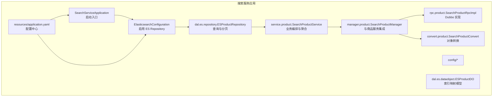
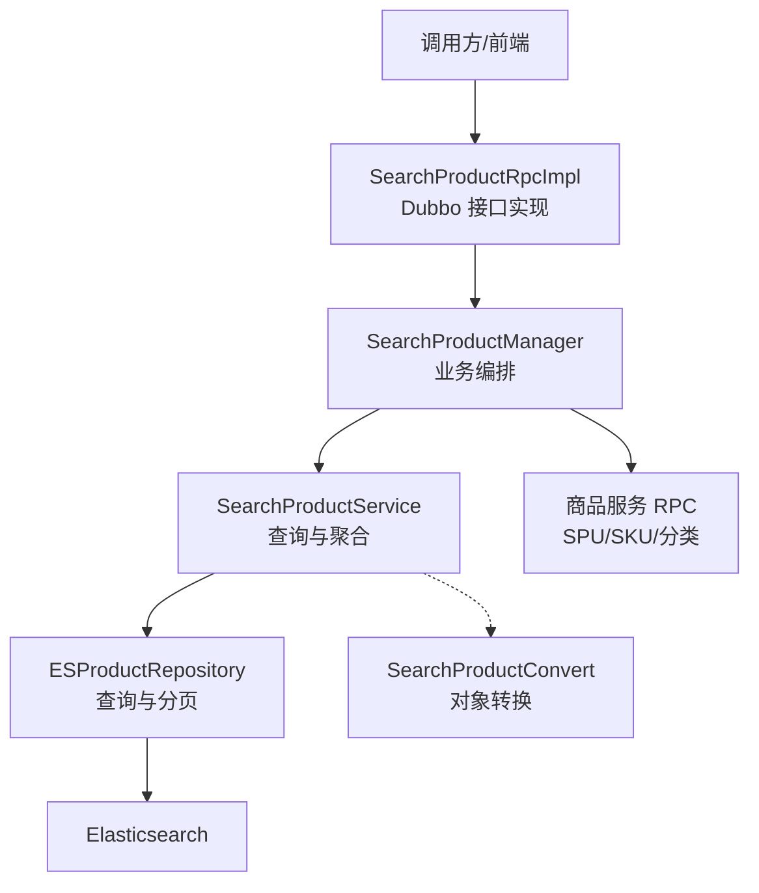
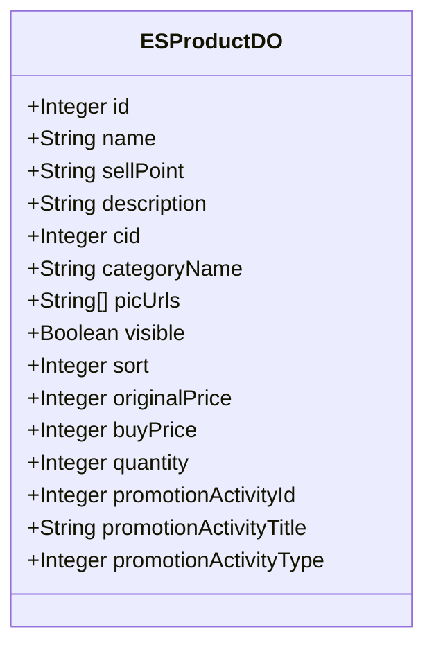
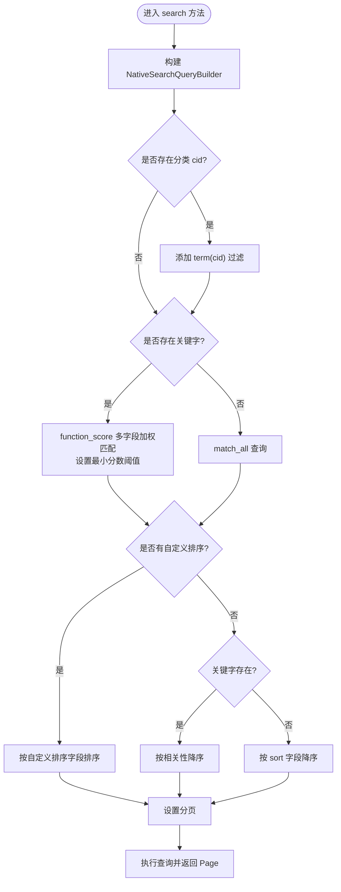
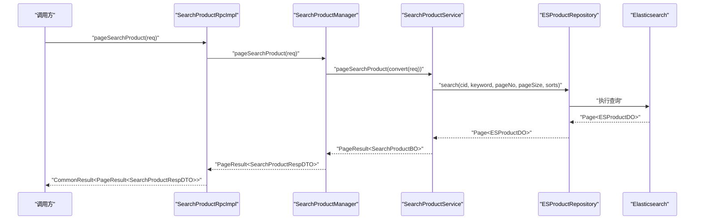
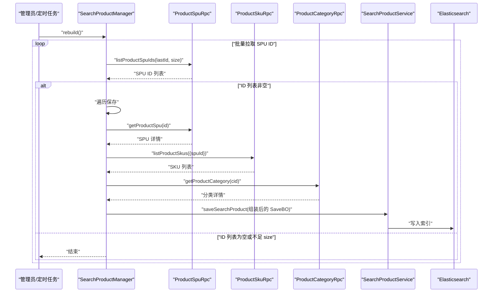
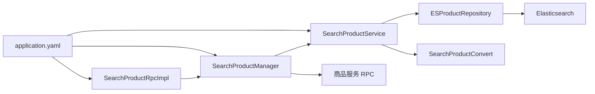

# 搜索服务模块

<cite>
**本文引用的文件**
- [SearchServiceApplication.java](file://search-service-project/search-service-app/src/main/java/cn/iocoder/mall/searchservice/SearchServiceApplication.java)
- [ElasticsearchConfiguration.java](file://search-service-project/search-service-app/src/main/java/cn/iocoder/mall/searchservice/config/ElasticsearchConfiguration.java)
- [FieldAnalyzer.java](file://search-service-project/search-service-app/src/main/java/cn/iocoder/mall/searchservice/dal/es/FieldAnalyzer.java)
- [ESProductDO.java](file://search-service-project/search-service-app/src/main/java/cn/iocoder/mall/searchservice/dal/es/dataobject/ESProductDO.java)
- [ESProductRepository.java](file://search-service-project/search-service-app/src/main/java/cn/iocoder/mall/searchservice/dal/es/repository/ESProductRepository.java)
- [SearchProductService.java](file://search-service-project/search-service-app/src/main/java/cn/iocoder/mall/searchservice/service/product/SearchProductService.java)
- [SearchProductManager.java](file://search-service-project/search-service-app/src/main/java/cn/iocoder/mall/searchservice/manager/product/SearchProductManager.java)
- [SearchProductRpcImpl.java](file://search-service-project/search-service-app/src/main/java/cn/iocoder/mall/searchservice/rpc/product/SearchProductRpcImpl.java)
- [SearchProductConvert.java](file://search-service-project/search-service-app/src/main/java/cn/iocoder/mall/searchservice/convert/product/SearchProductConvert.java)
- [application.yaml](file://search-service-project/search-service-app/src/main/resources/application.yaml)
- [SearchProductPageReqDTO.java](file://search-service-project/search-service-api/src/main/java/cn/iocoder/mall/searchservice/rpc/product/dto/SearchProductPageReqDTO.java)
- [SearchProductRpc.java](file://search-service-project/search-service-api/src/main/java/cn/iocoder/mall/searchservice/rpc/product/SearchProductRpc.java)
- [SearchProductConditionFieldEnum.java](file://search-service-project/search-service-api/src/main/java/cn/iocoder/mall/searchservice/enums/product/SearchProductConditionFieldEnum.java)
- [SearchProductPageQuerySortFieldEnum.java](file://search-service-project/search-service-api/src/main/java/cn/iocoder/mall/searchservice/enums/product/SearchProductPageQuerySortFieldEnum.java)
</cite>

## 目录
1. [简介](#简介)
2. [项目结构](#项目结构)
3. [核心组件](#核心组件)
4. [架构总览](#架构总览)
5. [组件详解](#组件详解)
6. [依赖关系分析](#依赖关系分析)
7. [性能优化](#性能优化)
8. [故障排查指南](#故障排查指南)
9. [结论](#结论)
10. [附录](#附录)

## 简介
本技术文档面向“搜索服务模块”，系统性阐述基于 Elasticsearch 的商品搜索能力，包括索引模型设计、全文检索与分词、查询优化、排序与分页、过滤与聚合、性能优化策略、与商品服务的数据同步机制、搜索 API 文档与示例，以及搜索埋点与分析建议。该模块通过 Dubbo 对外提供 RPC 接口，内部以 Spring Data Elasticsearch 访问 ES，结合商品服务的 RPC 数据源完成索引构建与更新。

## 项目结构
搜索服务采用“接口层-管理器-服务-仓储-数据对象-配置”的分层组织方式，配合 Dubbo RPC 暴露对外接口，配置文件集中管理 ES 连接与 Dubbo 注册中心等外部依赖。

图表来源
- [SearchServiceApplication.java:1-16](file://search-service-project/search-service-app/src/main/java/cn/iocoder/mall/searchservice/SearchServiceApplication.java#L1-L16)
- [ElasticsearchConfiguration.java:1-10](file://search-service-project/search-service-app/src/main/java/cn/iocoder/mall/searchservice/config/ElasticsearchConfiguration.java#L1-L10)
- [ESProductDO.java:1-97](file://search-service-project/search-service-app/src/main/java/cn/iocoder/mall/searchservice/dal/es/dataobject/ESProductDO.java#L1-L97)
- [ESProductRepository.java:1-70](file://search-service-project/search-service-app/src/main/java/cn/iocoder/mall/searchservice/dal/es/repository/ESProductRepository.java#L1-L70)
- [SearchProductService.java:1-113](file://search-service-project/search-service-app/src/main/java/cn/iocoder/mall/searchservice/service/product/SearchProductService.java#L1-L113)
- [SearchProductManager.java:1-134](file://search-service-project/search-service-app/src/main/java/cn/iocoder/mall/searchservice/manager/product/SearchProductManager.java#L1-L134)
- [SearchProductRpcImpl.java:1-32](file://search-service-project/search-service-app/src/main/java/cn/iocoder/mall/searchservice/rpc/product/SearchProductRpcImpl.java#L1-L32)
- [SearchProductConvert.java:1-54](file://search-service-project/search-service-app/src/main/java/cn/iocoder/mall/searchservice/convert/product/SearchProductConvert.java#L1-L54)
- [application.yaml:1-63](file://search-service-project/search-service-app/src/main/resources/application.yaml#L1-L63)

章节来源
- [SearchServiceApplication.java:1-16](file://search-service-project/search-service-app/src/main/java/cn/iocoder/mall/searchservice/SearchServiceApplication.java#L1-L16)
- [application.yaml:1-63](file://search-service-project/search-service-app/src/main/resources/application.yaml#L1-L63)

## 核心组件
- 索引模型与分词
  - ESProductDO 定义了商品索引映射，使用 IK 分词器（ik_max_word/ik_smart）对名称、卖点、描述、分类名进行中文分词。
  - FieldAnalyzer 统一枚举分词器常量，便于统一替换与扩展。
- 查询与分页
  - ESProductRepository 提供基于 NativeSearchQueryBuilder 的组合查询，支持分类筛选、关键字函数评分匹配、多字段加权、排序与分页。
- 业务编排与聚合
  - SearchProductService 将查询结果转换为业务 BO，并提供聚合查询能力（如按分类聚合 cid）。
- 与商品服务集成
  - SearchProductManager 通过 Dubbo 调用商品服务 RPC 获取 SPU、SKU、分类信息，组装后写入 ES；并提供全量重建索引能力。
- RPC 接口
  - SearchProductRpcImpl 实现对外 RPC 接口，桥接管理器与服务层。

章节来源
- [ESProductDO.java:1-97](file://search-service-project/search-service-app/src/main/java/cn/iocoder/mall/searchservice/dal/es/dataobject/ESProductDO.java#L1-L97)
- [FieldAnalyzer.java:1-27](file://search-service-project/search-service-app/src/main/java/cn/iocoder/mall/searchservice/dal/es/FieldAnalyzer.java#L1-L27)
- [ESProductRepository.java:1-70](file://search-service-project/search-service-app/src/main/java/cn/iocoder/mall/searchservice/dal/es/repository/ESProductRepository.java#L1-L70)
- [SearchProductService.java:1-113](file://search-service-project/search-service-app/src/main/java/cn/iocoder/mall/searchservice/service/product/SearchProductService.java#L1-L113)
- [SearchProductManager.java:1-134](file://search-service-project/search-service-app/src/main/java/cn/iocoder/mall/searchservice/manager/product/SearchProductManager.java#L1-L134)
- [SearchProductRpcImpl.java:1-32](file://search-service-project/search-service-app/src/main/java/cn/iocoder/mall/searchservice/rpc/product/SearchProductRpcImpl.java#L1-L32)

## 架构总览
搜索服务整体架构围绕“RPC 接口层 → 管理器层 → 服务层 → 仓储层 → ES”展开，同时通过 Dubbo 与商品服务交互，完成索引数据的准备与更新。

图表来源
- [SearchProductRpcImpl.java:1-32](file://search-service-project/search-service-app/src/main/java/cn/iocoder/mall/searchservice/rpc/product/SearchProductRpcImpl.java#L1-L32)
- [SearchProductManager.java:1-134](file://search-service-project/search-service-app/src/main/java/cn/iocoder/mall/searchservice/manager/product/SearchProductManager.java#L1-L134)
- [SearchProductService.java:1-113](file://search-service-project/search-service-app/src/main/java/cn/iocoder/mall/searchservice/service/product/SearchProductService.java#L1-L113)
- [ESProductRepository.java:1-70](file://search-service-project/search-service-app/src/main/java/cn/iocoder/mall/searchservice/dal/es/repository/ESProductRepository.java#L1-L70)
- [SearchProductConvert.java:1-54](file://search-service-project/search-service-app/src/main/java/cn/iocoder/mall/searchservice/convert/product/SearchProductConvert.java#L1-L54)

## 组件详解

### 索引模型与分词（ESProductDO）
- 索引元信息：indexName、type、分片与副本数在模型注解中定义。
- 字段设计：
  - 基本信息：名称、卖点、描述、分类编号与名称、主图数组。
  - 其他信息：可见性、排序字段。
  - SKU 相关：原价、购买价、库存。
  - 促销活动相关：活动编号、标题、类型。
- 分词策略：IK 最大分词（ik_max_word）用于全文检索字段，兼顾召回与精度；智能分词（ik_smart）可用于可选场景。

图表来源
- [ESProductDO.java:1-97](file://search-service-project/search-service-app/src/main/java/cn/iocoder/mall/searchservice/dal/es/dataobject/ESProductDO.java#L1-L97)
- [FieldAnalyzer.java:1-27](file://search-service-project/search-service-app/src/main/java/cn/iocoder/mall/searchservice/dal/es/FieldAnalyzer.java#L1-L27)

章节来源
- [ESProductDO.java:1-97](file://search-service-project/search-service-app/src/main/java/cn/iocoder/mall/searchservice/dal/es/dataobject/ESProductDO.java#L1-L97)
- [FieldAnalyzer.java:1-27](file://search-service-project/search-service-app/src/main/java/cn/iocoder/mall/searchservice/dal/es/FieldAnalyzer.java#L1-L27)

### 查询与分页（ESProductRepository）
- 查询条件
  - 分类筛选：term(cid)。
  - 关键字匹配：使用 function_score 对多个字段（名称、卖点、分类名）进行加权匹配，设置最小分数阈值，提升相关性。
  - 无关键字：match_all。
- 排序规则
  - 有关键字：按相关性分数降序。
  - 无关键字：按 sort 字段降序。
  - 支持自定义排序字段校验。
- 分页
  - 使用 PageRequest(pageNo-1, pageSize) 实现分页。

图表来源
- [ESProductRepository.java:1-70](file://search-service-project/search-service-app/src/main/java/cn/iocoder/mall/searchservice/dal/es/repository/ESProductRepository.java#L1-L70)

章节来源
- [ESProductRepository.java:1-70](file://search-service-project/search-service-app/src/main/java/cn/iocoder/mall/searchservice/dal/es/repository/ESProductRepository.java#L1-L70)

### 业务编排与聚合（SearchProductService）
- 分页搜索：将请求参数转换为查询 BO，调用仓库执行查询，再转换为业务 BO 并封装分页结果。
- 条件聚合：根据关键字构建查询，按需聚合 cid，返回可选分类集合。
- 聚合实现：使用 ElasticsearchTemplate 执行聚合查询，提取 terms 聚合桶中的分类编号。

图表来源
- [SearchProductRpcImpl.java:1-32](file://search-service-project/search-service-app/src/main/java/cn/iocoder/mall/searchservice/rpc/product/SearchProductRpcImpl.java#L1-L32)
- [SearchProductManager.java:1-134](file://search-service-project/search-service-app/src/main/java/cn/iocoder/mall/searchservice/manager/product/SearchProductManager.java#L1-L134)
- [SearchProductService.java:1-113](file://search-service-project/search-service-app/src/main/java/cn/iocoder/mall/searchservice/service/product/SearchProductService.java#L1-L113)
- [ESProductRepository.java:1-70](file://search-service-project/search-service-app/src/main/java/cn/iocoder/mall/searchservice/dal/es/repository/ESProductRepository.java#L1-L70)

章节来源
- [SearchProductService.java:1-113](file://search-service-project/search-service-app/src/main/java/cn/iocoder/mall/searchservice/service/product/SearchProductService.java#L1-L113)

### 与商品服务的数据同步（SearchProductManager）
- 全量重建
  - 通过增量拉取 SPU ID 列表，逐个构建商品索引并写入 ES。
  - 每批固定大小（REBUILD_FETCH_PER_SIZE），直至取完。
- 单条重建
  - 调用商品服务 RPC 获取 SPU、SKU、分类，组装最低价格、库存等字段，写入 ES。
- 一致性保障
  - 对 RPC 调用结果进行错误检查与空值判断，失败时记录日志并返回失败状态。

图表来源
- [SearchProductManager.java:1-134](file://search-service-project/search-service-app/src/main/java/cn/iocoder/mall/searchservice/manager/product/SearchProductManager.java#L1-L134)
- [SearchProductService.java:1-113](file://search-service-project/search-service-app/src/main/java/cn/iocoder/mall/searchservice/service/product/SearchProductService.java#L1-L113)

章节来源
- [SearchProductManager.java:1-134](file://search-service-project/search-service-app/src/main/java/cn/iocoder/mall/searchservice/manager/product/SearchProductManager.java#L1-L134)

### RPC 接口与 API 文档
- 接口定义
  - SearchProductRpc：提供分页搜索与条件聚合两个 RPC 接口。
- 请求参数
  - SearchProductPageReqDTO：包含分页参数、分类编号、关键字、排序字段数组。
- 响应结果
  - 分页搜索返回 PageResult<SearchProductRespDTO>。
  - 条件聚合返回 SearchProductConditionRespDTO（当前包含可选分类 cid 列表）。
- 示例流程
  - 调用方构造 SearchProductPageReqDTO，调用 pageSearchProduct，解析 PageResult 中的列表与总数。
  - 调用方构造 SearchProductConditionReqDTO，调用 getSearchProductCondition，解析可选分类列表以进一步筛选。

章节来源
- [SearchProductRpc.java](file://search-service-project/search-service-api/src/main/java/cn/iocoder/mall/searchservice/rpc/product/SearchProductRpc.java)
- [SearchProductPageReqDTO.java:1-36](file://search-service-project/search-service-api/src/main/java/cn/iocoder/mall/searchservice/rpc/product/dto/SearchProductPageReqDTO.java#L1-L36)

## 依赖关系分析
- 外部依赖
  - Elasticsearch：通过 Spring Data Elasticsearch 访问，REST URI 与集群节点在配置文件中声明。
  - Dubbo：服务提供者协议、扫描包、版本号等在配置文件中集中管理。
  - RocketMQ：作为消息中间件配置项存在。
- 内部依赖
  - 管理器依赖服务层；服务层依赖仓储与转换器；仓储依赖 ES；RPC 实现依赖管理器。

图表来源
- [SearchProductRpcImpl.java:1-32](file://search-service-project/search-service-app/src/main/java/cn/iocoder/mall/searchservice/rpc/product/SearchProductRpcImpl.java#L1-L32)
- [SearchProductManager.java:1-134](file://search-service-project/search-service-app/src/main/java/cn/iocoder/mall/searchservice/manager/product/SearchProductManager.java#L1-L134)
- [SearchProductService.java:1-113](file://search-service-project/search-service-app/src/main/java/cn/iocoder/mall/searchservice/service/product/SearchProductService.java#L1-L113)
- [application.yaml:1-63](file://search-service-project/search-service-app/src/main/resources/application.yaml#L1-L63)

章节来源
- [application.yaml:1-63](file://search-service-project/search-service-app/src/main/resources/application.yaml#L1-L63)

## 性能优化
- 索引优化
  - 合理设置分片与副本：根据数据规模与查询并发调整 shards/replicas。
  - 字段映射优化：仅对需要检索的字段开启分词；对不需要分词的字段使用 keyword 类型。
  - 控制字段数量与嵌套深度，减少存储与查询开销。
- 查询优化
  - function_score 加权：对不同字段设置不同权重，提升相关性；设置合理最小分数阈值，避免低质量结果。
  - 过滤优先：先 term 过滤，再全文匹配，缩小候选集。
  - 排序优化：尽量使用 doc_values 或数值字段排序，避免脚本排序。
- 缓存策略
  - 结果缓存：对热门搜索词与热门分类组合的结果进行短期缓存。
  - 模板缓存：将常用查询封装为模板，减少解析成本。
- 分页优化
  - 深分页风险：ES 默认最大支持 10000 的 from+size，建议使用 search_after 或 scroll（谨慎使用）。
  - 合理 pageSize：控制每页大小，避免过深翻页。
- 聚合优化
  - terms 聚合：设置 size 与 min_doc_count，避免返回过多桶。
  - 按需聚合：仅在需要时执行聚合，减少不必要的计算。

## 故障排查指南
- ES 连接问题
  - 检查 cluster-nodes 与 REST URIs 是否可达；确认集群名称一致。
- 查询异常
  - 关键字为空时使用 match_all；确保 function_score 的字段存在且已分词。
  - 自定义排序字段需在允许范围内，否则会触发断言。
- 数据同步问题
  - RPC 调用失败或返回空数据时，记录日志并返回失败；确认商品服务 RPC 版本与配置一致。
- 性能问题
  - 观察慢查询日志与聚合耗时；必要时调整分片数、查询语句与缓存策略。

章节来源
- [application.yaml:1-63](file://search-service-project/search-service-app/src/main/resources/application.yaml#L1-L63)
- [SearchProductService.java:54-60](file://search-service-project/search-service-app/src/main/java/cn/iocoder/mall/searchservice/service/product/SearchProductService.java#L54-L60)
- [SearchProductManager.java:94-131](file://search-service-project/search-service-app/src/main/java/cn/iocoder/mall/searchservice/manager/product/SearchProductManager.java#L94-L131)

## 结论
搜索服务模块以清晰的分层设计实现了基于 Elasticsearch 的商品检索能力，覆盖全文检索、加权匹配、排序分页、条件聚合与与商品服务的数据同步。通过合理的索引映射、查询策略与性能优化手段，能够满足中等规模的商品搜索需求。后续可在分页深翻页、聚合维度扩展、缓存策略细化等方面持续演进。

## 附录

### 搜索 API 一览（RPC）
- 接口：pageSearchProduct
  - 请求：SearchProductPageReqDTO
    - 字段：cid、keyword、sorts（继承自 PageParam）、pageSize、pageNo
  - 响应：CommonResult<PageResult<SearchProductRespDTO>>
- 接口：getSearchProductCondition
  - 请求：SearchProductConditionReqDTO
    - 字段：keyword、fields（如 category）
  - 响应：CommonResult<SearchProductConditionRespDTO>
    - 字段：cids（可选分类编号列表）

章节来源
- [SearchProductRpc.java](file://search-service-project/search-service-api/src/main/java/cn/iocoder/mall/searchservice/rpc/product/SearchProductRpc.java)
- [SearchProductPageReqDTO.java:1-36](file://search-service-project/search-service-api/src/main/java/cn/iocoder/mall/searchservice/rpc/product/dto/SearchProductPageReqDTO.java#L1-L36)
- [SearchProductConditionFieldEnum.java](file://search-service-project/search-service-api/src/main/java/cn/iocoder/mall/searchservice/enums/product/SearchProductConditionFieldEnum.java)
- [SearchProductPageQuerySortFieldEnum.java](file://search-service-project/search-service-api/src/main/java/cn/iocoder/mall/searchservice/enums/product/SearchProductPageQuerySortFieldEnum.java)

### 查询示例（步骤说明）
- 分页搜索
  - 步骤：构造 SearchProductPageReqDTO，设置 cid/keyword/sorts/pageNo/pageSize，调用 pageSearchProduct，解析 PageResult 的 list 与 total。
- 条件聚合
  - 步骤：构造 SearchProductConditionReqDTO，设置 keyword 与 fields（如 ["category"]），调用 getSearchProductCondition，解析 cids 列表用于二次筛选。

章节来源
- [SearchProductRpcImpl.java:21-29](file://search-service-project/search-service-app/src/main/java/cn/iocoder/mall/searchservice/rpc/product/SearchProductRpcImpl.java#L21-L29)
- [SearchProductService.java:82-110](file://search-service-project/search-service-app/src/main/java/cn/iocoder/mall/searchservice/service/product/SearchProductService.java#L82-L110)