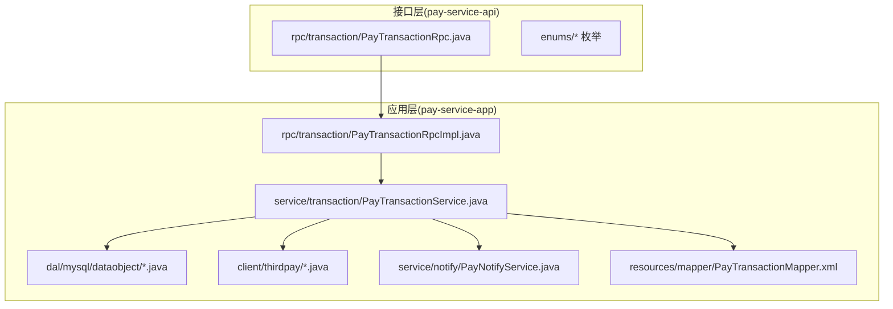
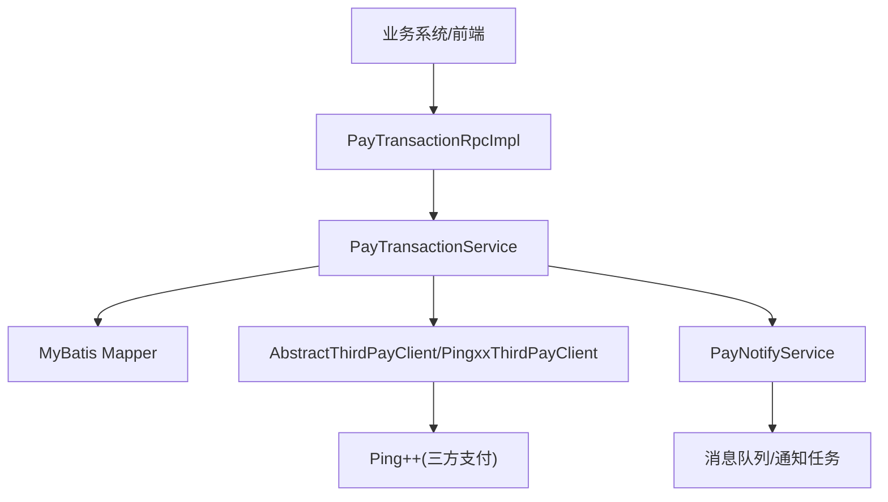
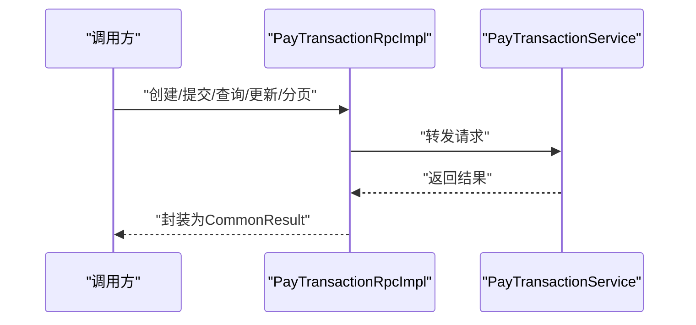
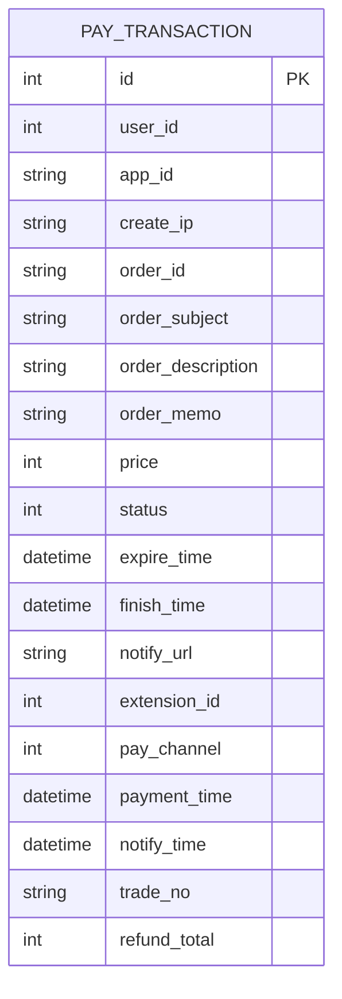
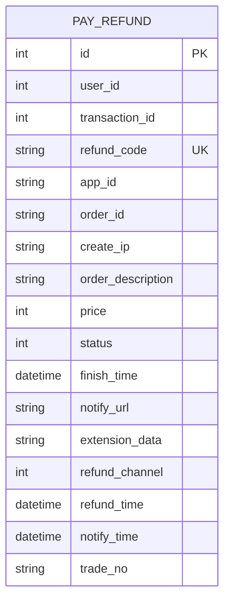
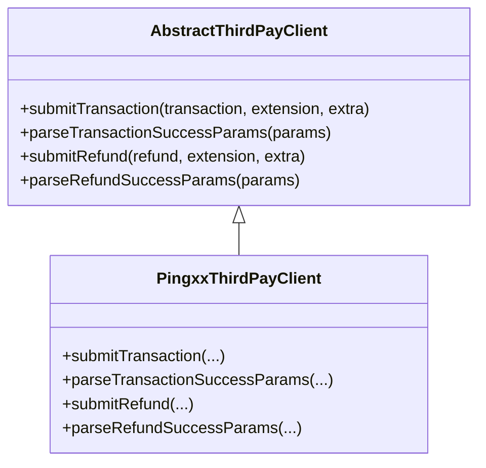
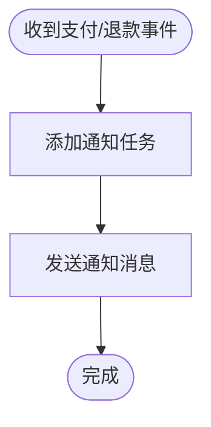
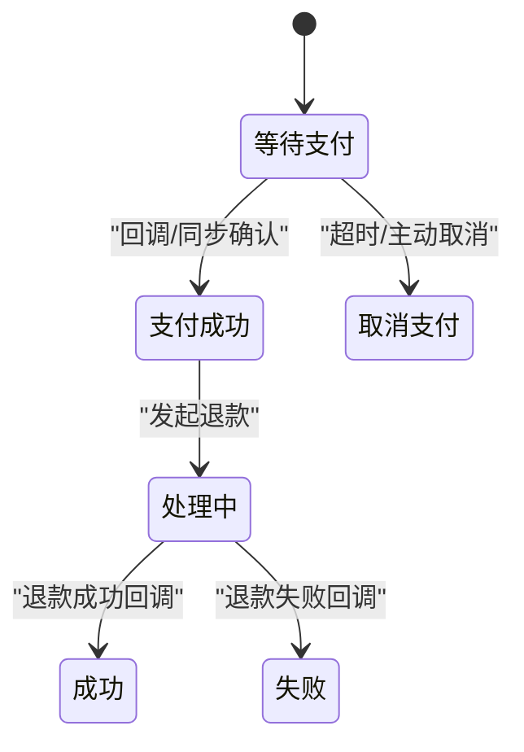
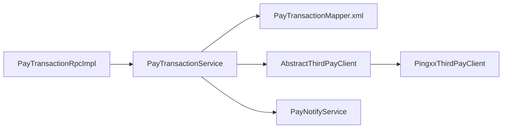
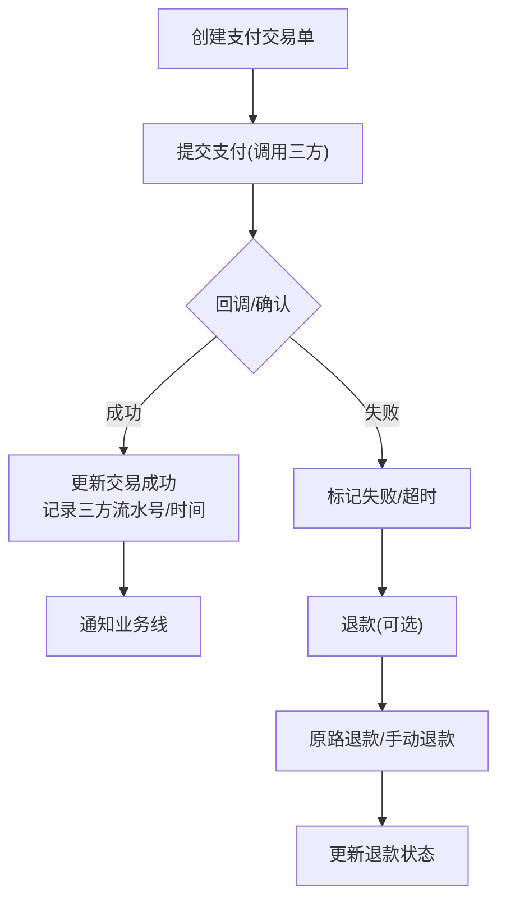

# 支付服务模块

<cite>
**本文引用的文件**
- [PayTransactionRpc.java](file://pay-service-project/pay-service-api/src/main/java/cn/iocoder/mall/payservice/rpc/transaction/PayTransactionRpc.java)
- [PayTransactionRpcImpl.java](file://pay-service-project/pay-service-app/src/main/java/cn/iocoder/mall/payservice/rpc/transaction/PayTransactionRpcImpl.java)
- [PayTransactionService.java](file://pay-service-project/pay-service-app/src/main/java/cn/iocoder/mall/payservice/service/transaction/PayTransactionService.java)
- [PayTransactionDO.java](file://pay-service-project/pay-service-app/src/main/java/cn/iocoder/mall/payservice/dal/mysql/dataobject/transaction/PayTransactionDO.java)
- [PayRefundDO.java](file://pay-service-project/pay-service-app/src/main/java/cn/iocoder/mall/payservice/dal/mysql/dataobject/refund/PayRefundDO.java)
- [PayNotifyService.java](file://pay-service-project/pay-service-app/src/main/java/cn/iocoder/mall/payservice/service/notify/PayNotifyService.java)
- [AbstractThirdPayClient.java](file://pay-service-project/pay-service-app/src/main/java/cn/iocoder/mall/payservice/client/thirdpay/AbstractThirdPayClient.java)
- [PingxxThirdPayClient.java](file://pay-service-project/pay-service-app/src/main/java/cn/iocoder/mall/payservice/client/thirdpay/PingxxThirdPayClient.java)
- [PayChannelEnum.java](file://pay-service-project/pay-service-api/src/main/java/cn/iocoder/mall/payservice/enums/PayChannelEnum.java)
- [PayTransactionStatusEnum.java](file://pay-service-project/pay-service-api/src/main/java/cn/iocoder/mall/payservice/enums/transaction/PayTransactionStatusEnum.java)
- [PayRefundStatus.java](file://pay-service-project/pay-service-api/src/main/java/cn/iocoder/mall/payservice/enums/refund/PayRefundStatus.java)
- [PayNotifyType.java](file://pay-service-project/pay-service-api/src/main/java/cn/iocoder/mall/payservice/enums/notify/PayNotifyType.java)
- [PayTransactionMapper.xml](file://pay-service-project/pay-service-app/src/main/resources/mapper/PayTransactionMapper.xml)
</cite>

## 目录
1. [简介](#简介)
2. [项目结构](#项目结构)
3. [核心组件](#核心组件)
4. [架构总览](#架构总览)
5. [详细组件分析](#详细组件分析)
6. [依赖分析](#依赖分析)
7. [性能考量](#性能考量)
8. [故障排查指南](#故障排查指南)
9. [结论](#结论)
10. [附录](#附录)

## 简介
本技术文档围绕支付服务模块展开，系统性梳理支付交易从创建、提交、回调、成功处理、失败处理的全链路流程；覆盖微信支付、支付宝、银联等第三方支付平台的集成方案（以 Ping++ 作为示例）；阐述退款处理机制（原路退款、手动退款、退款审核、退款状态跟踪）；介绍支付通知系统（异步通知、幂等性、重试、失败处理）；说明支付安全策略（签名验证、参数校验、防重放、数据加密）；并给出 RPC 接口设计与实现要点及完整的支付流程图与异常处理方案。

## 项目结构
支付服务模块位于 pay-service-project 中，采用“接口定义 + 应用实现”的分层组织方式：
- 接口层（pay-service-api）：定义 RPC 接口、枚举、DTO 等。
- 应用层（pay-service-app）：实现 RPC、服务、DAO、MQ、客户端适配器等。

图表来源
- [PayTransactionRpc.java:1-53](file://pay-service-project/pay-service-api/src/main/java/cn/iocoder/mall/payservice/rpc/transaction/PayTransactionRpc.java#L1-L53)
- [PayTransactionRpcImpl.java:1-45](file://pay-service-project/pay-service-app/src/main/java/cn/iocoder/mall/payservice/rpc/transaction/PayTransactionRpcImpl.java#L1-L45)
- [PayTransactionService.java:1-65](file://pay-service-project/pay-service-app/src/main/java/cn/iocoder/mall/payservice/service/transaction/PayTransactionService.java#L1-L65)
- [PayTransactionDO.java:1-104](file://pay-service-project/pay-service-app/src/main/java/cn/iocoder/mall/payservice/dal/mysql/dataobject/transaction/PayTransactionDO.java#L1-L104)
- [PayRefundDO.java:1-109](file://pay-service-project/pay-service-app/src/main/java/cn/iocoder/mall/payservice/dal/mysql/dataobject/refund/PayRefundDO.java#L1-L109)
- [PayNotifyService.java:1-23](file://pay-service-project/pay-service-app/src/main/java/cn/iocoder/mall/payservice/service/notify/PayNotifyService.java#L1-L23)
- [AbstractThirdPayClient.java:1-60](file://pay-service-project/pay-service-app/src/main/java/cn/iocoder/mall/payservice/client/thirdpay/AbstractThirdPayClient.java#L1-L60)
- [PingxxThirdPayClient.java:1-150](file://pay-service-project/pay-service-app/src/main/java/cn/iocoder/mall/payservice/client/thirdpay/PingxxThirdPayClient.java#L1-L150)
- [PayTransactionMapper.xml](file://pay-service-project/pay-service-app/src/main/resources/mapper/PayTransactionMapper.xml)

章节来源
- [PayTransactionRpc.java:1-53](file://pay-service-project/pay-service-api/src/main/java/cn/iocoder/mall/payservice/rpc/transaction/PayTransactionRpc.java#L1-L53)
- [PayTransactionRpcImpl.java:1-45](file://pay-service-project/pay-service-app/src/main/java/cn/iocoder/mall/payservice/rpc/transaction/PayTransactionRpcImpl.java#L1-L45)

## 核心组件
- RPC 接口层：对外暴露创建支付、提交支付、查询支付、更新支付成功、分页查询等能力。
- 服务层：负责业务编排、状态流转、与第三方支付客户端交互、通知任务下发。
- 数据访问层：持久化支付交易、退款、通知任务等实体。
- 第三方支付客户端：抽象统一的三方支付/退款交互接口，具体实现以 Ping++ 为例。
- 通知服务：负责异步通知任务的创建与发送。

章节来源
- [PayTransactionRpc.java:10-52](file://pay-service-project/pay-service-api/src/main/java/cn/iocoder/mall/payservice/rpc/transaction/PayTransactionRpc.java#L10-L52)
- [PayTransactionService.java:9-64](file://pay-service-project/pay-service-app/src/main/java/cn/iocoder/mall/payservice/service/transaction/PayTransactionService.java#L9-L64)
- [PayTransactionDO.java:19-103](file://pay-service-project/pay-service-app/src/main/java/cn/iocoder/mall/payservice/dal/mysql/dataobject/transaction/PayTransactionDO.java#L19-L103)
- [PayRefundDO.java:19-108](file://pay-service-project/pay-service-app/src/main/java/cn/iocoder/mall/payservice/dal/mysql/dataobject/refund/PayRefundDO.java#L19-L108)
- [AbstractThirdPayClient.java:15-59](file://pay-service-project/pay-service-app/src/main/java/cn/iocoder/mall/payservice/client/thirdpay/AbstractThirdPayClient.java#L15-L59)
- [PayNotifyService.java:11-22](file://pay-service-project/pay-service-app/src/main/java/cn/iocoder/mall/payservice/service/notify/PayNotifyService.java#L11-L22)

## 架构总览
支付服务整体采用 RPC 驱动的服务化架构，通过 Dubbo 暴露接口，内部以服务编排为核心，结合 DAO、Mapper、MQ/通知服务与第三方支付客户端协同工作。

图表来源
- [PayTransactionRpcImpl.java:12-44](file://pay-service-project/pay-service-app/src/main/java/cn/iocoder/mall/payservice/rpc/transaction/PayTransactionRpcImpl.java#L12-L44)
- [PayTransactionService.java:17-62](file://pay-service-project/pay-service-app/src/main/java/cn/iocoder/mall/payservice/service/transaction/PayTransactionService.java#L17-L62)
- [AbstractThirdPayClient.java:25-57](file://pay-service-project/pay-service-app/src/main/java/cn/iocoder/mall/payservice/client/thirdpay/AbstractThirdPayClient.java#L25-L57)
- [PingxxThirdPayClient.java:29-100](file://pay-service-project/pay-service-app/src/main/java/cn/iocoder/mall/payservice/client/thirdpay/PingxxThirdPayClient.java#L29-L100)
- [PayNotifyService.java:14-20](file://pay-service-project/pay-service-app/src/main/java/cn/iocoder/mall/payservice/service/notify/PayNotifyService.java#L14-L20)

## 详细组件分析

### 支付交易 RPC 接口与实现
- 接口职责：创建支付交易单、提交支付、查询支付、更新支付成功、分页查询。
- 实现逻辑：通过 Dubbo 注解暴露服务，内部委派至服务层执行。

图表来源
- [PayTransactionRpc.java:18-50](file://pay-service-project/pay-service-api/src/main/java/cn/iocoder/mall/payservice/rpc/transaction/PayTransactionRpc.java#L18-L50)
- [PayTransactionRpcImpl.java:19-42](file://pay-service-project/pay-service-app/src/main/java/cn/iocoder/mall/payservice/rpc/transaction/PayTransactionRpcImpl.java#L19-L42)

章节来源
- [PayTransactionRpc.java:10-52](file://pay-service-project/pay-service-api/src/main/java/cn/iocoder/mall/payservice/rpc/transaction/PayTransactionRpc.java#L10-L52)
- [PayTransactionRpcImpl.java:12-44](file://pay-service-project/pay-service-app/src/main/java/cn/iocoder/mall/payservice/rpc/transaction/PayTransactionRpcImpl.java#L12-L44)

### 支付交易服务与数据模型
- 服务接口：定义创建、提交、查询、更新成功、分页、累计退款金额等方法。
- 数据模型：PayTransactionDO 描述支付交易主表字段，包含用户、应用、订单、金额、状态、过期时间、通知地址、第三方流水号、支付时间等；同时包含退款累计金额字段。

图表来源
- [PayTransactionDO.java:19-103](file://pay-service-project/pay-service-app/src/main/java/cn/iocoder/mall/payservice/dal/mysql/dataobject/transaction/PayTransactionDO.java#L19-L103)

章节来源
- [PayTransactionService.java:9-64](file://pay-service-project/pay-service-app/src/main/java/cn/iocoder/mall/payservice/service/transaction/PayTransactionService.java#L9-L64)
- [PayTransactionDO.java:19-103](file://pay-service-project/pay-service-app/src/main/java/cn/iocoder/mall/payservice/dal/mysql/dataobject/transaction/PayTransactionDO.java#L19-L103)

### 退款数据模型与状态
- PayRefundDO 描述退款单，包含用户、交易、退款号、应用、订单、发起 IP、描述、金额、状态、通知地址、扩展数据、退款渠道、第三方流水号、通知时间、退款时间等字段。

图表来源
- [PayRefundDO.java:19-108](file://pay-service-project/pay-service-app/src/main/java/cn/iocoder/mall/payservice/dal/mysql/dataobject/refund/PayRefundDO.java#L19-L108)

章节来源
- [PayRefundDO.java:19-108](file://pay-service-project/pay-service-app/src/main/java/cn/iocoder/mall/payservice/dal/mysql/dataobject/refund/PayRefundDO.java#L19-L108)

### 第三方支付客户端适配
- 抽象客户端：定义统一的提交支付、解析支付成功回调、提交退款、解析退款成功回调等方法。
- Pingxx 实现：基于 Ping++ SDK 完成支付与退款请求，解析回调参数为统一 DTO。

图表来源
- [AbstractThirdPayClient.java:15-59](file://pay-service-project/pay-service-app/src/main/java/cn/iocoder/mall/payservice/client/thirdpay/AbstractThirdPayClient.java#L15-L59)
- [PingxxThirdPayClient.java:22-125](file://pay-service-project/pay-service-app/src/main/java/cn/iocoder/mall/payservice/client/thirdpay/PingxxThirdPayClient.java#L22-L125)

章节来源
- [AbstractThirdPayClient.java:15-59](file://pay-service-project/pay-service-app/src/main/java/cn/iocoder/mall/payservice/client/thirdpay/AbstractThirdPayClient.java#L15-L59)
- [PingxxThirdPayClient.java:29-114](file://pay-service-project/pay-service-app/src/main/java/cn/iocoder/mall/payservice/client/thirdpay/PingxxThirdPayClient.java#L29-L114)

### 支付通知服务
- 职责：新增支付/退款通知任务、发送通知消息。
- 设计：通过消息队列或任务表实现异步通知，避免阻塞主流程。

图表来源
- [PayNotifyService.java:14-20](file://pay-service-project/pay-service-app/src/main/java/cn/iocoder/mall/payservice/service/notify/PayNotifyService.java#L14-L20)

章节来源
- [PayNotifyService.java:11-22](file://pay-service-project/pay-service-app/src/main/java/cn/iocoder/mall/payservice/service/notify/PayNotifyService.java#L11-L22)

### 支付流程与状态机
- 支付通道：支持微信 App/JS API、支付宝 App、Ping++ 等。
- 交易状态：等待支付、支付成功、取消支付。
- 退款状态：处理中、成功、失败。

图表来源
- [PayChannelEnum.java:10-18](file://pay-service-project/pay-service-api/src/main/java/cn/iocoder/mall/payservice/enums/PayChannelEnum.java#L10-L18)
- [PayTransactionStatusEnum.java:9-14](file://pay-service-project/pay-service-api/src/main/java/cn/iocoder/mall/payservice/enums/transaction/PayTransactionStatusEnum.java#L9-L14)
- [PayRefundStatus.java:9-14](file://pay-service-project/pay-service-api/src/main/java/cn/iocoder/mall/payservice/enums/refund/PayRefundStatus.java#L9-L14)

章节来源
- [PayChannelEnum.java:10-18](file://pay-service-project/pay-service-api/src/main/java/cn/iocoder/mall/payservice/enums/PayChannelEnum.java#L10-L18)
- [PayTransactionStatusEnum.java:9-14](file://pay-service-project/pay-service-api/src/main/java/cn/iocoder/mall/payservice/enums/transaction/PayTransactionStatusEnum.java#L9-L14)
- [PayRefundStatus.java:9-14](file://pay-service-project/pay-service-api/src/main/java/cn/iocoder/mall/payservice/enums/refund/PayRefundStatus.java#L9-L14)

### 退款处理机制
- 原路退款：根据交易扩展数据中的三方支付凭证，向三方平台发起退款。
- 手动退款：由运营或系统管理员触发退款流程。
- 退款审核：可在退款单创建前或后进行人工审核（可扩展）。
- 退款状态跟踪：通过退款状态枚举与通知服务联动，实时更新退款进度。

章节来源
- [PayRefundDO.java:19-108](file://pay-service-project/pay-service-app/src/main/java/cn/iocoder/mall/payservice/dal/mysql/dataobject/refund/PayRefundDO.java#L19-L108)
- [PayNotifyService.java:14-20](file://pay-service-project/pay-service-app/src/main/java/cn/iocoder/mall/payservice/service/notify/PayNotifyService.java#L14-L20)
- [PingxxThirdPayClient.java:81-100](file://pay-service-project/pay-service-app/src/main/java/cn/iocoder/mall/payservice/client/thirdpay/PingxxThirdPayClient.java#L81-L100)

### 支付通知系统设计
- 异步通知：通过通知服务将支付/退款事件推送到消息队列或任务表。
- 幂等性：依据交易号/退款号进行去重，确保重复回调不重复入账。
- 重试机制：对发送失败的通知进行定时重试，直至成功或达到最大重试次数。
- 失败处理：记录失败原因与重试次数，必要时转人工处理。

章节来源
- [PayNotifyService.java:14-20](file://pay-service-project/pay-service-app/src/main/java/cn/iocoder/mall/payservice/service/notify/PayNotifyService.java#L14-L20)
- [PayTransactionDO.java:72-94](file://pay-service-project/pay-service-app/src/main/java/cn/iocoder/mall/payservice/dal/mysql/dataobject/transaction/PayTransactionDO.java#L72-L94)
- [PayRefundDO.java:80-106](file://pay-service-project/pay-service-app/src/main/java/cn/iocoder/mall/payservice/dal/mysql/dataobject/refund/PayRefundDO.java#L80-L106)

### 支付安全策略
- 签名验证：三方回调参数需进行签名验证，确保数据来源可信。
- 参数校验：对回调参数进行完整性与格式校验，拒绝非法数据。
- 防重放攻击：利用随机串与时间戳，限制回调有效期，拒绝过期请求。
- 数据加密：敏感字段（如回调扩展数据）建议在存储与传输过程中进行加密。

章节来源
- [PingxxThirdPayClient.java:69-78](file://pay-service-project/pay-service-app/src/main/java/cn/iocoder/mall/payservice/client/thirdpay/PingxxThirdPayClient.java#L69-L78)
- [PayTransactionDO.java:72-94](file://pay-service-project/pay-service-app/src/main/java/cn/iocoder/mall/payservice/dal/mysql/dataobject/transaction/PayTransactionDO.java#L72-L94)
- [PayRefundDO.java:80-106](file://pay-service-project/pay-service-app/src/main/java/cn/iocoder/mall/payservice/dal/mysql/dataobject/refund/PayRefundDO.java#L80-L106)

### RPC 接口设计与实现要点
- 接口设计：面向业务场景，提供创建、提交、查询、更新成功、分页等 RPC 方法。
- 返回封装：统一使用通用结果包装类，便于上层处理。
- 参数约束：对必填字段与范围进行约束，避免无效请求进入下游。

章节来源
- [PayTransactionRpc.java:18-50](file://pay-service-project/pay-service-api/src/main/java/cn/iocoder/mall/payservice/rpc/transaction/PayTransactionRpc.java#L18-L50)
- [PayTransactionRpcImpl.java:19-42](file://pay-service-project/pay-service-app/src/main/java/cn/iocoder/mall/payservice/rpc/transaction/PayTransactionRpcImpl.java#L19-L42)

## 依赖分析
- 组件耦合：RPC 实现依赖服务层；服务层依赖 DAO/Mapper、第三方支付客户端、通知服务。
- 外部依赖：Ping++ SDK 用于三方支付/退款交互。
- 枚举与 DTO：接口层提供统一的枚举与 DTO，降低版本升级成本。

图表来源
- [PayTransactionRpcImpl.java:16-17](file://pay-service-project/pay-service-app/src/main/java/cn/iocoder/mall/payservice/rpc/transaction/PayTransactionRpcImpl.java#L16-L17)
- [PayTransactionService.java:17-62](file://pay-service-project/pay-service-app/src/main/java/cn/iocoder/mall/payservice/service/transaction/PayTransactionService.java#L17-L62)
- [PayTransactionMapper.xml](file://pay-service-project/pay-service-app/src/main/resources/mapper/PayTransactionMapper.xml)
- [AbstractThirdPayClient.java:25-57](file://pay-service-project/pay-service-app/src/main/java/cn/iocoder/mall/payservice/client/thirdpay/AbstractThirdPayClient.java#L25-L57)
- [PingxxThirdPayClient.java:29-100](file://pay-service-project/pay-service-app/src/main/java/cn/iocoder/mall/payservice/client/thirdpay/PingxxThirdPayClient.java#L29-L100)
- [PayNotifyService.java:14-20](file://pay-service-project/pay-service-app/src/main/java/cn/iocoder/mall/payservice/service/notify/PayNotifyService.java#L14-L20)

章节来源
- [PayTransactionRpcImpl.java:12-44](file://pay-service-project/pay-service-app/src/main/java/cn/iocoder/mall/payservice/rpc/transaction/PayTransactionRpcImpl.java#L12-L44)
- [PayTransactionService.java:9-64](file://pay-service-project/pay-service-app/src/main/java/cn/iocoder/mall/payservice/service/transaction/PayTransactionService.java#L9-L64)

## 性能考量
- 异步化：支付回调与退款回调通过通知服务异步处理，避免阻塞主流程。
- 批量与分页：分页查询与批量通知提升大流量下的吞吐能力。
- 缓存与降级：对热点查询可引入缓存；对三方接口异常可进行降级处理。
- 日志与监控：完善埋点与告警，定位性能瓶颈。

## 故障排查指南
- 回调未到账：检查通知地址配置、幂等性逻辑、重试机制是否生效。
- 重复回调：确认交易号/退款号唯一性与幂等判断逻辑。
- 三方异常：查看 Ping++ SDK 抛出的异常类型与错误码，定位网络、鉴权、参数等问题。
- 状态不一致：核对数据库状态字段与回调参数，必要时进行手工对账。

章节来源
- [PayNotifyService.java:14-20](file://pay-service-project/pay-service-app/src/main/java/cn/iocoder/mall/payservice/service/notify/PayNotifyService.java#L14-L20)
- [PingxxThirdPayClient.java:39-44](file://pay-service-project/pay-service-app/src/main/java/cn/iocoder/mall/payservice/client/thirdpay/PingxxThirdPayClient.java#L39-L44)

## 结论
支付服务模块通过清晰的接口分层、统一的第三方支付客户端适配、完善的退款与通知机制，实现了高可用、可扩展的支付能力。结合幂等性、重试与安全策略，能够在复杂业务场景下稳定运行。后续可进一步完善支付宝、微信等平台的具体实现与接入参数配置，增强退款审核与风控能力。

## 附录
- 支付流程图（概念示意）
