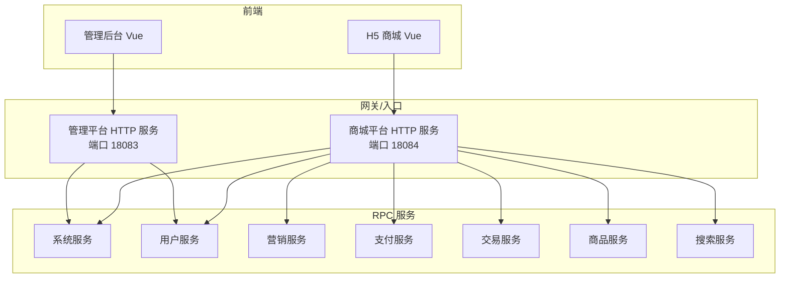
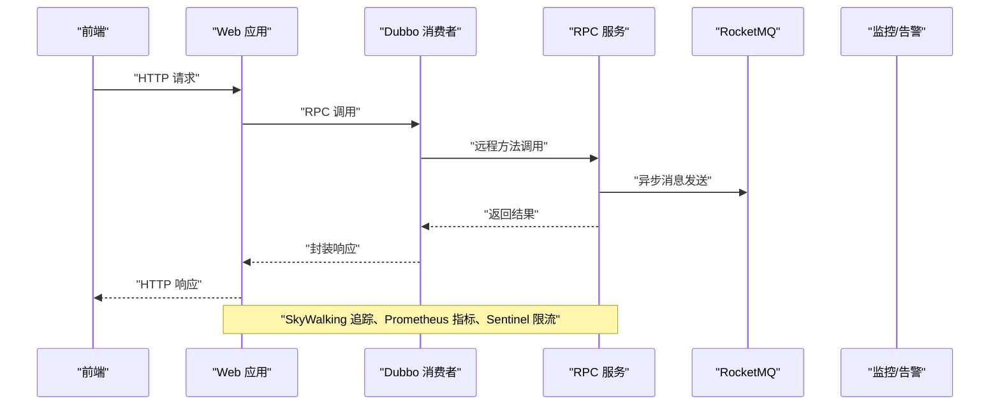
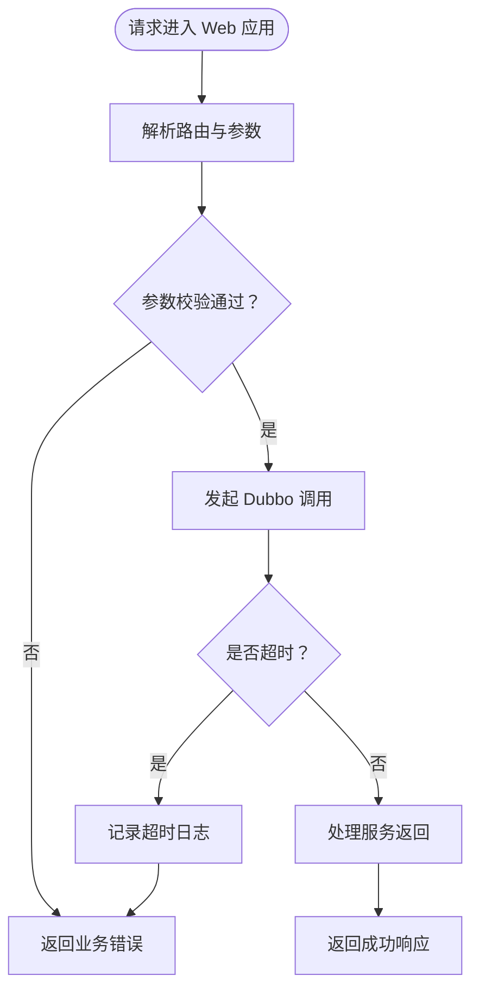
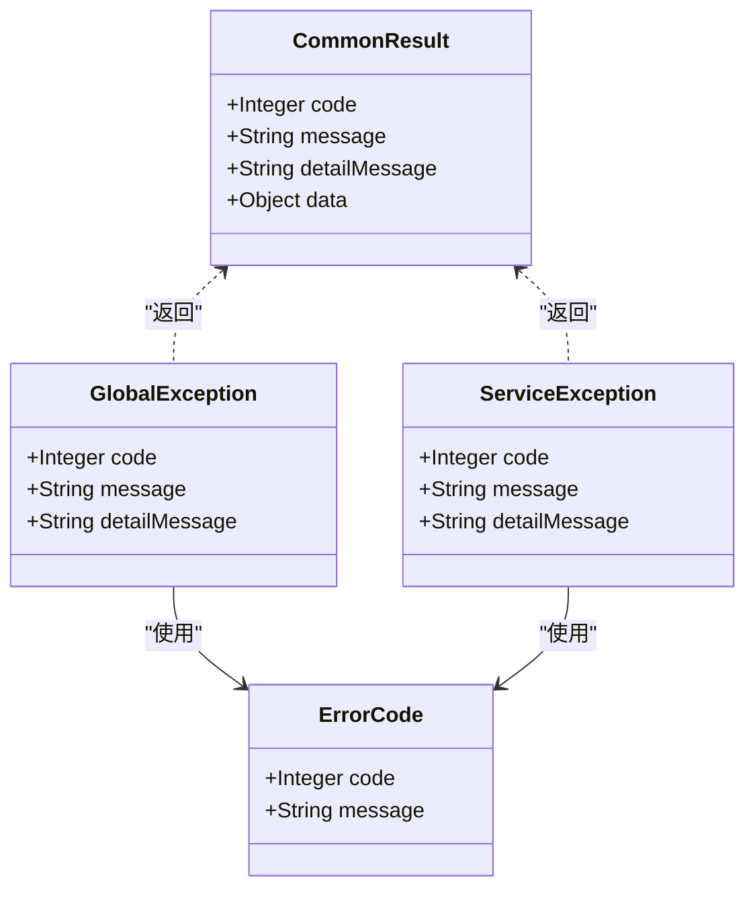
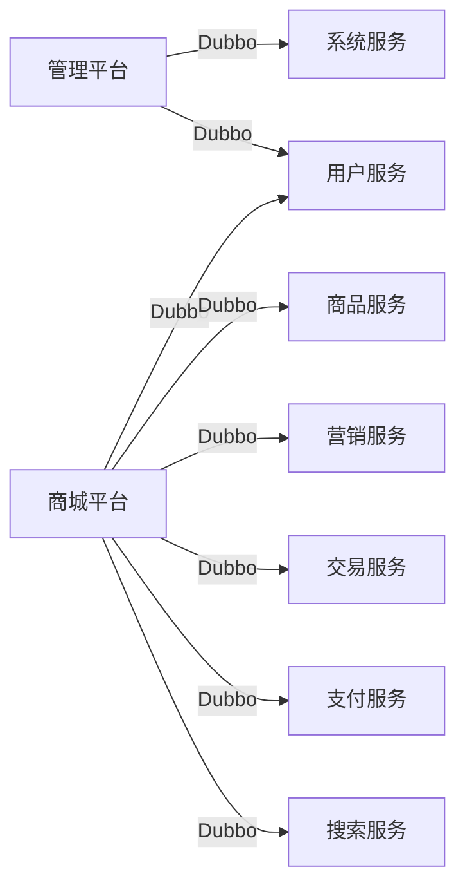

# 故障排查

<cite>
**本文引用的文件**
- [README.md](file://README.md)
- [pom.xml](file://pom.xml)
- [application.yml（管理平台）](file://management-web-app/src/main/resources/application.yml)
- [application.yml（商城平台）](file://shop-web-app/src/main/resources/application.yml)
- [GlobalException.java](file://common/common-framework/src/main/java/cn/iocoder/common/framework/exception/GlobalException.java)
- [ServiceException.java](file://common/common-framework/src/main/java/cn/iocoder/common/framework/exception/ServiceException.java)
- [ErrorCode.java](file://common/common-framework/src/main/java/cn/iocoder/common/framework/exception/ErrorCode.java)
- [CommonResult.java](file://common/common-framework/src/main/java/cn/iocoder/common/framework/vo/CommonResult.java)
- [DoNothingExceptionResolver.java](file://common/mall-spring-boot-starter-sentry/src/main/java/cn/iocoder/mall/sentry/resolver/DoNothingExceptionResolver.java)
- [CustomSentryAutoConfiguration.java](file://common/mall-spring-boot-starter-sentry/src/main/java/cn/iocoder/mall/sentry/config/CustomSentryAutoConfiguration.java)
- [SwaggerAutoConfiguration.java](file://common/mall-spring-boot-starter-swagger/src/main/java/cn/iocoder/mall/swagger/config/SwaggerAutoConfiguration.java)
- [SwaggerProperties.java](file://common/mall-spring-boot-starter-swagger/src/main/java/cn/iocoder/mall/swagger/config/SwaggerProperties.java)
- [AdminSecurityAutoConfiguration.java](file://common/mall-spring-boot-starter-security-admin/src/main/java/cn/iocoder/mall/security/admin/config/AdminSecurityAutoConfiguration.java)
- [UserSecurityAutoConfiguration.java](file://common/mall-spring-boot-starter-security-user/src/main/java/cn/iocoder/mall/security/user/config/UserSecurityAutoConfiguration.java)
- [XxlJobAutoConfiguration.java](file://common/mall-spring-boot-starter-xxl-job/src/main/java/cn/iocoder/mall/xxljob/config/XxlJobAutoConfiguration.java)
- [XxlJobProperties.java](file://common/mall-spring-boot-starter-xxl-job/src/main/java/cn/iocoder/mall/xxljob/config/XxlJobProperties.java)
- [application.yaml（支付服务）](file://pay-service-project/pay-service-app/src/main/resources/application.yaml)
- [application.yaml（商品服务）](file://product-service-project/product-service-app/src/main/resources/application.yaml)
- [application.yaml（营销服务）](file://promotion-service-project/promotion-service-app/src/main/resources/application.yaml)
- [application.yaml（搜索服务）](file://search-service-project/search-service-app/src/main/resources/application.yaml)
- [application.yaml（交易服务）](file://trade-service-project/trade-service-app/src/main/resources/application.yaml)
- [application.yaml（系统服务）](file://system-service-project/system-service-app/src/main/resources/application.yaml)
- [application.yaml（用户服务）](file://user-service-project/user-service-app/src/main/resources/application.yaml)
- [application.yml（管理平台）](file://management-web-app/src/main/resources/application.yml)
- [application.yml（商城平台）](file://shop-web-app/src/main/resources/application.yml)
</cite>

## 目录
1. [简介](#简介)
2. [项目结构](#项目结构)
3. [核心组件](#核心组件)
4. [架构总览](#架构总览)
5. [详细组件分析](#详细组件分析)
6. [依赖分析](#依赖分析)
7. [性能考量](#性能考量)
8. [故障排查指南](#故障排查指南)
9. [结论](#结论)
10. [附录](#附录)

## 简介
本指南面向 Onemall 微服务电商项目的运维与开发人员，聚焦于常见故障的识别与解决，涵盖服务启动失败、数据库连接异常、RPC 调用超时、支付回调失败等典型问题；同时提供日志分析方法、监控指标解读与告警处理、调试工具使用、分布式环境问题排查、紧急处置流程与应急预案，以及问题预防与改进建议，帮助提升系统稳定性与可靠性。

## 项目结构
Onemall 采用多模块 Maven 聚合工程，后端由多个 Web 应用与对应的 RPC 服务组成，统一通过 Spring Boot 启动，使用 Dubbo 作为 RPC 框架，结合 Zookeeper 作为注册中心，消息队列采用 RocketMQ，监控体系包含 SkyWalking、Prometheus/Grafana、Sentinel 控制台等。

图表来源
- [README.md:109-125](file://README.md#L109-L125)
- [application.yml（管理平台）:1-83](file://management-web-app/src/main/resources/application.yml#L1-L83)
- [application.yml（商城平台）:1-76](file://shop-web-app/src/main/resources/application.yml#L1-L76)

章节来源
- [README.md:107-125](file://README.md#L107-L125)
- [pom.xml:16-28](file://pom.xml#L16-L28)

## 核心组件
- Web 应用层：管理平台与商城平台，负责对外 HTTP API，暴露 Actuator 监控端点。
- RPC 服务层：系统、用户、营销、支付、交易、商品、搜索等服务，提供领域能力。
- RPC 框架：Dubbo（Spring Cloud Alibaba），消费者侧设置默认超时与参数校验。
- 监控与可观测性：SkyWalking（Trace）、Prometheus/Grafana（Metrics）、Sentinel（限流/熔断）、Dubbo Admin、RocketMQ Console、XXL-Job Console。
- 日志与异常：全局异常与业务异常模型，配合 Sentry（可选）与 Swagger 文档辅助定位问题。

章节来源
- [application.yml（管理平台）:19-71](file://management-web-app/src/main/resources/application.yml#L19-L71)
- [application.yml（商城平台）:19-63](file://shop-web-app/src/main/resources/application.yml#L19-L63)
- [README.md:185-199](file://README.md#L185-L199)

## 架构总览
下图展示了请求在系统中的流转：前端调用 Web 应用，Web 应用通过 Dubbo 调用各 RPC 服务，服务间通过 RocketMQ 进行异步解耦，监控与告警贯穿全链路。

图表来源
- [application.yml（管理平台）:19-71](file://management-web-app/src/main/resources/application.yml#L19-L71)
- [application.yml（商城平台）:19-63](file://shop-web-app/src/main/resources/application.yml#L19-L63)
- [README.md:185-199](file://README.md#L185-L199)

## 详细组件分析

### Web 应用层（管理平台与商城平台）
- 端口与上下文：管理平台 18083，商城平台 18084；Actuator 独立端口暴露监控端点。
- Dubbo 消费者：统一设置超时、参数校验、订阅服务列表，便于快速定位跨服务调用问题。
- Swagger：提供接口文档，辅助联调与问题定位。

图表来源
- [application.yml（管理平台）:19-71](file://management-web-app/src/main/resources/application.yml#L19-L71)
- [application.yml（商城平台）:19-63](file://shop-web-app/src/main/resources/application.yml#L19-L63)

章节来源
- [application.yml（管理平台）:1-83](file://management-web-app/src/main/resources/application.yml#L1-L83)
- [application.yml（商城平台）:1-76](file://shop-web-app/src/main/resources/application.yml#L1-L76)

### RPC 服务层（以支付服务为例）
- 配置要点：服务端口随机，应用名与注册中心配置，Actuator 独立端口，便于独立观测。
- 建议：为每个服务单独配置健康检查、线程池、超时策略与重试策略，避免雪崩传播。

章节来源
- [application.yaml（支付服务）](file://pay-service-project/pay-service-app/src/main/resources/application.yaml)
- [application.yaml（商品服务）](file://product-service-project/product-service-app/src/main/resources/application.yaml)
- [application.yaml（营销服务）](file://promotion-service-project/promotion-service-app/src/main/resources/application.yaml)
- [application.yaml（搜索服务）](file://search-service-project/search-service-app/src/main/resources/application.yaml)
- [application.yaml（交易服务）](file://trade-service-project/trade-service-app/src/main/resources/application.yaml)
- [application.yaml（系统服务）](file://system-service-project/system-service-app/src/main/resources/application.yaml)
- [application.yaml（用户服务）](file://user-service-project/user-service-app/src/main/resources/application.yaml)

### 异常与日志体系
- 全局异常与业务异常：统一错误码与消息结构，便于前端与监控系统消费。
- Sentry 集成：可选异常上报与解析器，减少手工埋点成本。
- Swagger：自动生成接口文档，辅助问题复现与回归验证。

图表来源
- [ErrorCode.java:13-38](file://common/common-framework/src/main/java/cn/iocoder/common/framework/exception/ErrorCode.java#L13-L38)
- [GlobalException.java:9-72](file://common/common-framework/src/main/java/cn/iocoder/common/framework/exception/GlobalException.java#L9-L72)
- [ServiceException.java:9-72](file://common/common-framework/src/main/java/cn/iocoder/common/framework/exception/ServiceException.java#L9-L72)
- [CommonResult.java](file://common/common-framework/src/main/java/cn/iocoder/common/framework/vo/CommonResult.java)

章节来源
- [GlobalException.java:1-72](file://common/common-framework/src/main/java/cn/iocoder/common/framework/exception/GlobalException.java#L1-L72)
- [ServiceException.java:1-72](file://common/common-framework/src/main/java/cn/iocoder/common/framework/exception/ServiceException.java#L1-L72)
- [ErrorCode.java:1-38](file://common/common-framework/src/main/java/cn/iocoder/common/framework/exception/ErrorCode.java#L1-L38)
- [DoNothingExceptionResolver.java](file://common/mall-spring-boot-starter-sentry/src/main/java/cn/iocoder/mall/sentry/resolver/DoNothingExceptionResolver.java)
- [CustomSentryAutoConfiguration.java](file://common/mall-spring-boot-starter-sentry/src/main/java/cn/iocoder/mall/sentry/config/CustomSentryAutoConfiguration.java)
- [SwaggerAutoConfiguration.java](file://common/mall-spring-boot-starter-swagger/src/main/java/cn/iocoder/mall/swagger/config/SwaggerAutoConfiguration.java)
- [SwaggerProperties.java](file://common/mall-spring-boot-starter-swagger/src/main/java/cn/iocoder/mall/swagger/config/SwaggerProperties.java)

## 依赖分析
- Web 应用依赖 Dubbo 消费者配置，按需订阅服务，降低启动与运行时依赖面。
- RPC 服务通过独立配置与 Actuator 端口，便于横向对比与问题隔离。
- 中间件依赖：Zookeeper（注册中心）、RocketMQ（消息）、Prometheus/SkyWalking/Sentinel（监控）。

图表来源
- [application.yml（管理平台）:22-53](file://management-web-app/src/main/resources/application.yml#L22-L53)
- [application.yml（商城平台）:22-63](file://shop-web-app/src/main/resources/application.yml#L22-L63)

章节来源
- [application.yml（管理平台）:19-71](file://management-web-app/src/main/resources/application.yml#L19-L71)
- [application.yml（商城平台）:19-63](file://shop-web-app/src/main/resources/application.yml#L19-L63)

## 性能考量
- CPU/内存：通过 Prometheus 采集 JVM 指标，结合 Grafana 可视化趋势与阈值告警。
- 接口响应时间：利用 SkyWalking Trace 采样与慢调用链定位，结合 Dubbo 调用耗时统计。
- 数据库连接：关注连接池使用率与等待时间，结合 Druid 监控页面定位热点 SQL。
- 缓存与消息：监控缓存命中率与消息积压，及时扩容或清理异常队列。

## 故障排查指南

### 一、服务启动失败
- 症状：应用无法启动、端口占用、注册中心不可达。
- 快速检查清单
  - 确认端口未被占用，Actuator 独立端口是否冲突。
  - 检查注册中心（Zookeeper）连通性与版本兼容。
  - 查看应用日志，确认依赖模块是否正确打包与加载。
  - 对比不同 profile 的配置差异，确保本地/开发环境一致性。
- 处置步骤
  - 临时关闭非必要服务，缩小问题范围。
  - 逐个启动 RPC 服务，观察启动日志与健康检查状态。
  - 若为依赖缺失，补充依赖并重新构建发布。

章节来源
- [application.yml（管理平台）:1-83](file://management-web-app/src/main/resources/application.yml#L1-L83)
- [application.yml（商城平台）:1-76](file://shop-web-app/src/main/resources/application.yml#L1-L76)
- [README.md:185-199](file://README.md#L185-L199)

### 二、数据库连接异常
- 症状：SQL 执行报错、连接池耗尽、事务异常。
- 快速检查清单
  - 检查数据库实例状态与网络连通。
  - 查看连接池配置与最大连接数、空闲超时、获取超时。
  - 关注 Druid 监控页面的 SQL 与慢查询统计。
- 处置步骤
  - 临时释放长事务与未提交事务，释放连接。
  - 调整连接池参数，增加最大连接数或缩短超时。
  - 优化热点 SQL，添加索引或改写查询。

章节来源
- [README.md:144-161](file://README.md#L144-L161)

### 三、RPC 调用超时
- 症状：Web 应用侧出现超时错误，调用链路中某服务响应缓慢。
- 快速检查清单
  - 消费端：确认 Dubbo 超时时间、参数校验开关、订阅服务列表。
  - 服务端：检查线程池、CPU 占用、慢 SQL、外部依赖延迟。
  - 注册中心：确认服务实例健康状态与权重。
- 处置步骤
  - 临时提高 Dubbo 超时时间，定位慢调用链路。
  - 在 SkyWalking 中查看 Trace，定位耗时环节。
  - 对热点接口进行限流/降级或异步化改造。

章节来源
- [application.yml（管理平台）:25-28](file://management-web-app/src/main/resources/application.yml#L25-L28)
- [application.yml（商城平台）:25-28](file://shop-web-app/src/main/resources/application.yml#L25-L28)
- [README.md:185-199](file://README.md#L185-L199)

### 四、支付回调失败
- 症状：第三方支付回调未达或重复回调，导致订单状态不一致。
- 快速检查清单
  - 检查回调签名与参数完整性。
  - 查看回调幂等逻辑与去重表。
  - 确认回调线程池与重试策略，避免阻塞。
- 处置步骤
  - 临时屏蔽重复回调，人工核对订单状态。
  - 补充回调幂等键与状态机校验，完善补偿机制。
  - 增加回调失败告警与自动重试队列。

章节来源
- [application.yml（商城平台）:58-59](file://shop-web-app/src/main/resources/application.yml#L58-L59)
- [application.yml（管理平台）:69](file://management-web-app/src/main/resources/application.yml#L69)

### 五、日志分析方法与技巧
- 错误日志查看
  - Web 应用：通过 Actuator 端点查看健康与指标，结合日志文件定位异常。
  - RPC 服务：独立端口暴露监控，便于快速定位服务侧问题。
- 异常堆栈解读
  - 优先查看异常类型与错误码来源，区分全局异常与业务异常。
  - 结合 Swagger 文档核对入参与预期行为，缩小问题范围。
- 性能日志分析
  - 利用 SkyWalking Trace 观察慢调用链路，定位数据库/缓存/外部依赖瓶颈。
  - 通过 Prometheus/Grafana 关注 CPU、内存、GC、QPS、P99 延迟等关键指标。

章节来源
- [application.yml（管理平台）:80-83](file://management-web-app/src/main/resources/application.yml#L80-L83)
- [application.yml（商城平台）:73-76](file://shop-web-app/src/main/resources/application.yml#L73-L76)
- [README.md:185-199](file://README.md#L185-L199)

### 六、监控指标解读与告警处理
- 关键指标
  - CPU 使用率、内存占用、GC 次数与停顿时间。
  - 接口响应时间（P50/P95/P99）、错误率、超时率。
  - 数据库连接池使用率、SQL 执行时间与慢查询数。
  - RocketMQ 消费延迟、堆积量、失败重试次数。
- 告警处理
  - 建立分级告警（预警/严重），明确处置时限与升级流程。
  - 结合 Grafana 仪表盘与告警规则，快速定位异常时段与波动源。

章节来源
- [README.md:185-199](file://README.md#L185-L199)

### 七、调试工具使用
- JVM 分析
  - 使用 jstat/jstack/jmap 定位 GC 与死锁问题；结合 SkyWalking Agent 观察线程与调用关系。
- 数据库性能分析
  - 使用慢查询日志与执行计划，优化热点 SQL。
- 网络抓包分析
  - 使用 tcpdump/Charles/Fiddler 抓取 Dubbo/HTTP 流量，核对请求与响应。

章节来源
- [README.md:185-199](file://README.md#L185-L199)

### 八、分布式环境问题排查
- 服务发现异常
  - 检查注册中心连通性与服务实例健康状态，确认权重与路由规则。
- 消息队列积压
  - 查看队列堆积量与消费者拉取速率，动态扩容消费者或清理死信队列。
- 缓存失效
  - 核查缓存键空间与过期策略，评估热点键与缓存穿透风险。

章节来源
- [README.md:185-199](file://README.md#L185-L199)

### 九、紧急情况处理流程与应急预案
- 服务降级
  - 对非核心接口实施限流与快速失败，保证核心链路可用。
- 流量控制
  - 通过 Sentinel 或网关层限流，保护下游系统。
- 数据恢复
  - 基于备份与 Binlog 恢复，核对一致性与幂等性。
- 应急预案
  - 明确角色职责、联系方式与处置步骤，定期演练。

章节来源
- [README.md:185-199](file://README.md#L185-L199)

### 十、问题预防与改进
- 代码层面
  - 统一异常模型与错误码，完善单元测试与集成测试。
  - 对外接口增加参数校验与入参日志，便于回溯。
- 运维层面
  - 建立完善的监控与告警体系，覆盖关键链路。
  - 定期进行压测与演练，提前发现容量与性能瓶颈。
- 流程层面
  - 规范发布流程与回滚策略，确保变更可控。

## 结论
通过统一的异常模型、完善的监控体系与清晰的应急流程，Onemall 可在高并发与复杂分布式环境下保持稳定运行。建议持续优化 RPC 超时与重试策略、加强数据库与消息队列治理，并完善自动化与演练机制，以进一步提升系统的韧性与可维护性。

## 附录
- 常用管理平台地址（演示环境）
  - SkyWalking UI、Grafana、Dubbo Admin、RocketMQ Console、XXL-Job Console、Sentinel Console
- 建议的排查顺序
  - 先检查注册中心与网络，再检查服务与数据库，最后定位消息与缓存。

章节来源
- [README.md:60-96](file://README.md#L60-L96)