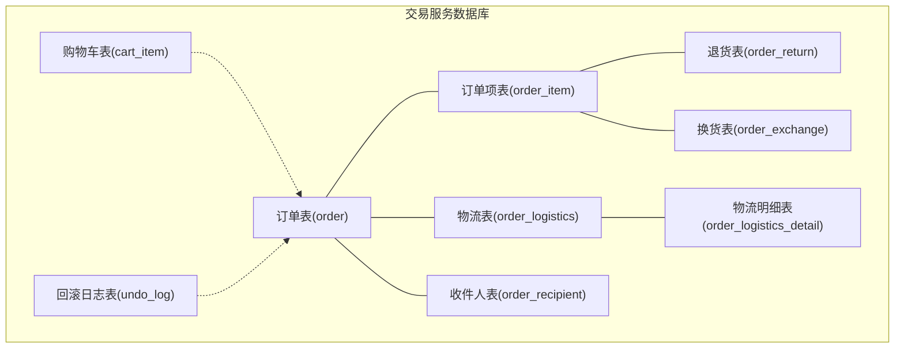
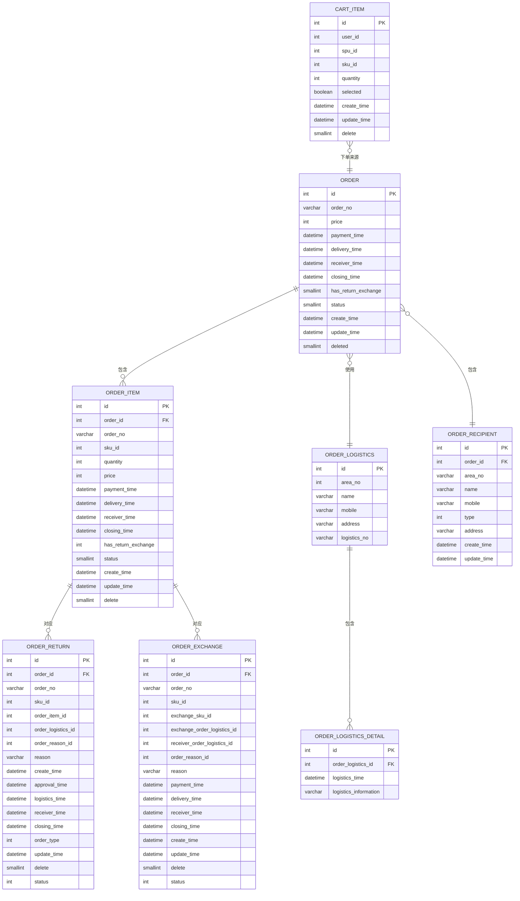
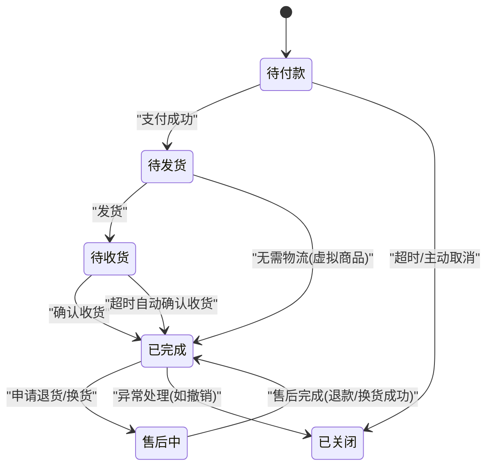
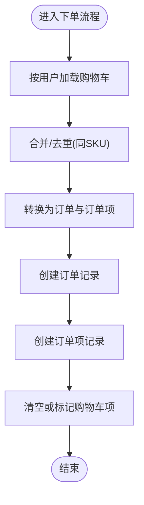
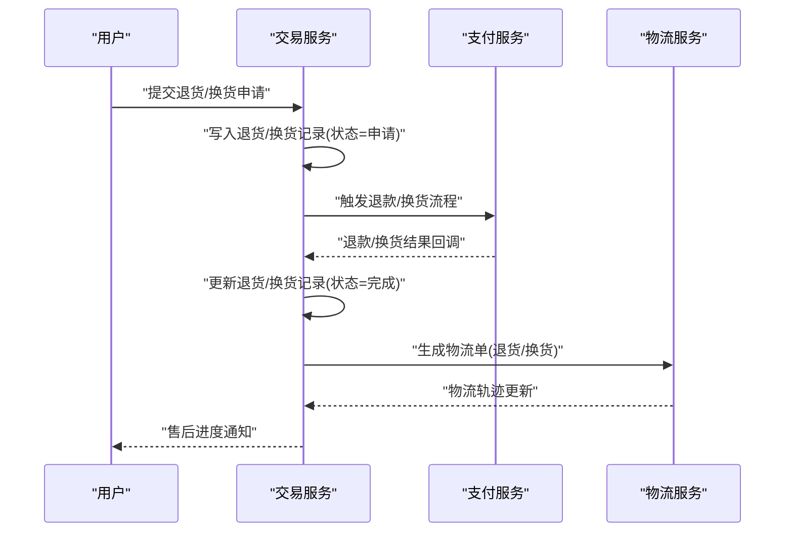
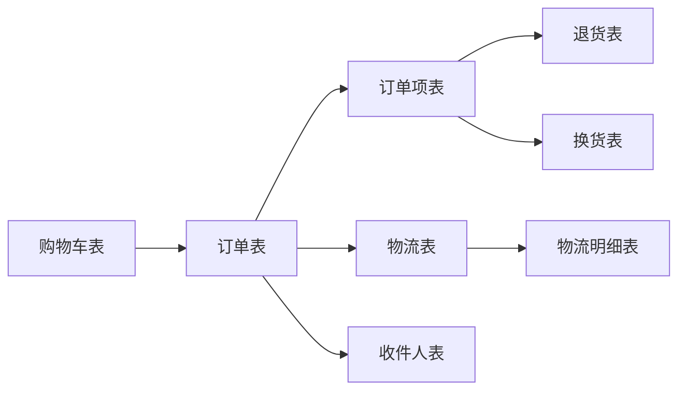

# 交易服务数据库设计

<cite>
**本文引用的文件**
- [mall_order.sql](file://docs/sql/old/mall_order.sql)
- [mall_order.sql](file://moved/order/order-service-impl/src/main/resources/sql/mall_order.sql)
- [CartItemDO.java](file://trade-service-project/trade-service-app/src/main/java/cn/iocoder/mall/tradeservice/dal/mysql/dataobject/cart/CartItemDO.java)
- [CartItemMapper.java](file://trade-service-project/trade-service-app/src/main/java/cn/iocoder/mall/tradeservice/dal/mysql/mapper/cart/CartItemMapper.java)
- [OrderPayStatus.java](file://moved/order/order-biz-api/src/main/java/cn/iocoder/mall/order/biz/enums/order/OrderPayStatus.java)
- [OrderCancelReasonsEnum.java](file://moved/order/order-biz-api/src/main/java/cn/iocoder/mall/order/biz/enums/order/OrderCancelReasonsEnum.java)
- [OrderReturnDO.java](file://moved/order/order-biz/src/main/java/cn/iocoder/mall/order/biz/dataobject/OrderReturnDO.java)
- [OrderExchangeDO.java](file://moved/order/order-biz/src/main/java/cn/iocoder/mall/order/biz/dataobject/OrderExchangeDO.java)
- [OrderLogisticsDO.java](file://moved/order/order-biz/src/main/java/cn/iocoder/mall/order/biz/dataobject/OrderLogisticsDO.java)
- [OrderLogisticsDetailDO.java](file://moved/order/order-biz/src/main/java/cn/iocoder/mall/order/biz/dataobject/OrderLogisticsDetailDO.java)
- [OrderRecipientMapper.java](file://moved/order/order-biz/src/main/java/cn/iocoder/mall/order/biz/dao/order/OrderRecipientMapper.java)
- [OrderReturnMapper.java](file://moved/order/order-biz/src/main/java/cn/iocoder/mall/order/biz/dao/order/OrderReturnMapper.java)
- [OrderLogisticsMapper.java](file://moved/order/order-biz/src/main/java/cn/iocoder/mall/order/biz/dao/order/OrderLogisticsMapper.java)
- [OrderLogisticsDetailMapper.java](file://moved/order/order-biz/src/main/java/cn/iocoder/mall/order/biz/dao/order/OrderLogisticsDetailMapper.java)
- [undo_log](file://docs/sql/old/mall_order.sql)
</cite>

## 目录
1. [引言](#引言)
2. [项目结构](#项目结构)
3. [核心组件](#核心组件)
4. [架构总览](#架构总览)
5. [详细组件分析](#详细组件分析)
6. [依赖分析](#依赖分析)
7. [性能考虑](#性能考虑)
8. [故障排查指南](#故障排查指南)
9. [结论](#结论)
10. [附录](#附录)

## 引言
本文件面向交易服务模块的数据库设计，系统性梳理订单、购物车、售后等核心数据结构的设计原理与实现要点；深入解析订单状态机（创建、支付、发货、收货、评价）在数据库中的落地；阐述购物车的持久化策略与会话管理；明确订单与商品、用户、支付、物流的关联关系与外键约束；给出订单号生成、幂等性与并发控制的数据库实现建议；并覆盖售后申请、退货换货、退款处理的数据模型；最后提供审计追踪、日志记录与异常处理的数据库设计方案，以及分表分库与性能优化思路。

## 项目结构
围绕交易服务的数据库相关文件主要分布在以下位置：
- 旧版订单相关 SQL：docs/sql/old/mall_order.sql
- 新版订单相关 SQL：moved/order/order-service-impl/src/main/resources/sql/mall_order.sql
- 购物车实体与 Mapper：trade-service-project/trade-service-app/.../cart/*
- 订单状态与取消原因枚举：moved/order/order-biz-api/.../order/*
- 售后、物流、收件人等实体与 Mapper：moved/order/order-biz/.../dataobject 与 dao/order/*

图表来源
- [mall_order.sql](file://docs/sql/old/mall_order.sql)
- [mall_order.sql](file://moved/order/order-service-impl/src/main/resources/sql/mall_order.sql)

章节来源
- [mall_order.sql](file://docs/sql/old/mall_order.sql)
- [mall_order.sql](file://moved/order/order-service-impl/src/main/resources/sql/mall_order.sql)

## 核心组件
本节聚焦交易服务的核心数据表与关键字段，说明其职责与设计考量。

- 订单表（order）
  - 关键字段：订单号、金额、支付/发货/收货/成交时间、是否退换货、状态、创建/更新/删除时间等
  - 设计要点：统一订单号作为业务主键之一；状态字段承载订单生命周期；时间戳用于审计与统计
- 订单项表（order_item）
  - 关键字段：所属订单、SKU、数量、单价、各阶段时间、状态、是否退换货等
  - 设计要点：拆分订单与订单项，便于精细化状态管理与售后定位
- 物流表（order_logistics）与物流明细（order_logistics_detail）
  - 关键字段：收件人、电话、地址、物流单号、明细节点与时间
  - 设计要点：物流与订单解耦，支持多物流节点记录
- 收件人表（order_recipient）
  - 关键字段：区域编号、姓名、手机、地址、快递方式
  - 设计要点：标准化收件信息，便于核对与售后处理
- 退货表（order_return）
  - 关键字段：服务号、订单/订单项、物流、退款金额、原因、审批/物流/收货/成交时间、状态
  - 设计要点：独立售后单据，便于流程化与审计
- 换货表（order_exchange）
  - 关键字段：原订单/订单项、换货SKU、换货物流、收件地址、原因、各阶段时间、状态
  - 设计要点：与退货区分，支持换货流程
- 购物车表（cart_item）
  - 关键字段：用户、SPU/SKU、数量、是否选中、删除状态
  - 设计要点：按用户+SKU去重，支持批量操作与汇总统计

章节来源
- [mall_order.sql](file://moved/order/order-service-impl/src/main/resources/sql/mall_order.sql)
- [CartItemDO.java](file://trade-service-project/trade-service-app/src/main/java/cn/iocoder/mall/tradeservice/dal/mysql/dataobject/cart/CartItemDO.java)
- [CartItemMapper.java](file://trade-service-project/trade-service-app/src/main/java/cn/iocoder/mall/tradeservice/dal/mysql/mapper/cart/CartItemMapper.java)

## 架构总览
交易服务数据库围绕“订单为中心”的核心模型展开，通过订单项细化到商品粒度，通过物流与收件人支撑履约，通过退货/换货表支撑售后闭环，并以购物车表承接下单前的临时数据。

图表来源
- [mall_order.sql](file://moved/order/order-service-impl/src/main/resources/sql/mall_order.sql)
- [CartItemDO.java](file://trade-service-project/trade-service-app/src/main/java/cn/iocoder/mall/tradeservice/dal/mysql/dataobject/cart/CartItemDO.java)

## 详细组件分析

### 订单状态机与数据库实现
订单状态机覆盖从创建到完成的关键阶段，结合数据库字段与业务流程实现：

- 状态字段映射
  - 订单表与订单项均包含状态字段，分别用于整体与单品状态管理
  - 状态值可参考枚举定义，确保业务与数据库一致
- 时间戳字段
  - 支付/发货/收货/成交时间用于审计与统计，避免重复计算
- 外键与一致性
  - 订单项通过订单 ID 关联订单；退货/换货通过订单与订单项 ID 关联，确保售后精准定位

章节来源
- [mall_order.sql](file://moved/order/order-service-impl/src/main/resources/sql/mall_order.sql)
- [OrderPayStatus.java](file://moved/order/order-biz-api/src/main/java/cn/iocoder/mall/order/biz/enums/order/OrderPayStatus.java)

### 购物车数据持久化与会话管理
- 数据模型
  - 购物车表按用户+SKU去重，支持数量变更与选中状态
  - 提供按用户与SKU集合的查询与批量更新接口
- 临时数据处理
  - 购物车作为临时数据载体，下单时转换为订单与订单项
  - 删除状态字段支持软删除，便于审计与恢复
- 会话管理
  - 建议前端以用户维度维护购物车，后端以用户 ID 作为查询条件
  - 批量操作（加购、改量、删除）通过 Mapper 接口实现，减少往返

图表来源
- [CartItemDO.java](file://trade-service-project/trade-service-app/src/main/java/cn/iocoder/mall/tradeservice/dal/mysql/dataobject/cart/CartItemDO.java)
- [CartItemMapper.java](file://trade-service-project/trade-service-app/src/main/java/cn/iocoder/mall/tradeservice/dal/mysql/mapper/cart/CartItemMapper.java)

章节来源
- [CartItemDO.java](file://trade-service-project/trade-service-app/src/main/java/cn/iocoder/mall/tradeservice/dal/mysql/dataobject/cart/CartItemDO.java)
- [CartItemMapper.java](file://trade-service-project/trade-service-app/src/main/java/cn/iocoder/mall/tradeservice/dal/mysql/mapper/cart/CartItemMapper.java)

### 订单与商品、用户、支付、物流的关联关系
- 订单与用户
  - 订单表未直接存储用户 ID，但可通过订单项或业务上下文关联用户
- 订单与商品
  - 订单项表包含 SKU 编号，用于关联商品信息（由商品服务提供）
- 订单与支付
  - 订单表包含支付时间字段，配合支付服务进行状态同步
- 订单与物流
  - 订单表关联物流表；物流明细记录物流轨迹
  - 收件人表提供标准化收件信息

章节来源
- [mall_order.sql](file://moved/order/order-service-impl/src/main/resources/sql/mall_order.sql)

### 售后申请、退货换货、退款处理
- 退货流程
  - 退货表记录申请、审批、物流、收货、成交等关键节点
  - 退货与订单项一一对应，便于精确退款与库存处理
- 换货流程
  - 换货表记录换货 SKU、换货物流与收件地址，支持换货状态流转
- 状态与原因
  - 退货/换货表包含状态与原因字段，便于流程化与统计

图表来源
- [OrderReturnDO.java](file://moved/order/order-biz/src/main/java/cn/iocoder/mall/order/biz/dataobject/OrderReturnDO.java)
- [OrderExchangeDO.java](file://moved/order/order-biz/src/main/java/cn/iocoder/mall/order/biz/dataobject/OrderExchangeDO.java)

章节来源
- [OrderReturnDO.java](file://moved/order/order-biz/src/main/java/cn/iocoder/mall/order/biz/dataobject/OrderReturnDO.java)
- [OrderExchangeDO.java](file://moved/order/order-biz/src/main/java/cn/iocoder/mall/order/biz/dataobject/OrderExchangeDO.java)

### 订单号生成、幂等性与并发控制
- 订单号生成
  - 建议采用全局唯一、趋势递增的编号策略（如雪花算法），避免跨库聚合
- 幂等性
  - 下单与支付回调均需基于订单号进行幂等校验，防止重复写入
- 并发控制
  - 使用数据库唯一索引（如订单号）与事务保障一致性
  - 对高并发场景，可在应用层做预占位与异步处理

章节来源
- [mall_order.sql](file://moved/order/order-service-impl/src/main/resources/sql/mall_order.sql)

### 审计追踪、日志记录与异常处理
- 回滚日志（undo_log）
  - 用于分布式事务的回滚信息存储，保障一致性
- 日志与审计
  - 建议在订单、订单项、售后表增加审计字段（操作人、IP、版本号等）
  - 通过定时任务或消息队列落库审计日志，满足合规要求

章节来源
- [undo_log](file://docs/sql/old/mall_order.sql)

## 依赖分析
- 组件耦合
  - 订单项依赖订单；售后依赖订单与订单项；物流与收件人服务于订单
- 外部依赖
  - 商品服务提供 SKU 详情；支付服务提供支付状态；物流服务提供轨迹
- 可能的循环依赖
  - 交易服务内部表之间无循环依赖；与外部服务通过 RPC/消息交互

图表来源
- [mall_order.sql](file://moved/order/order-service-impl/src/main/resources/sql/mall_order.sql)

章节来源
- [OrderReturnMapper.java](file://moved/order/order-biz/src/main/java/cn/iocoder/mall/order/biz/dao/order/OrderReturnMapper.java)
- [OrderLogisticsMapper.java](file://moved/order/order-biz/src/main/java/cn/iocoder/mall/order/biz/dao/order/OrderLogisticsMapper.java)
- [OrderLogisticsDetailMapper.java](file://moved/order/order-biz/src/main/java/cn/iocoder/mall/order/biz/dao/order/OrderLogisticsDetailMapper.java)
- [OrderRecipientMapper.java](file://moved/order/order-biz/src/main/java/cn/iocoder/mall/order/biz/dao/order/OrderRecipientMapper.java)

## 性能考虑
- 索引设计
  - 订单号、用户 ID、SKU、状态、时间范围等常用查询字段建立合适索引
- 分表分库
  - 按时间（年/月）或用户 ID 进行分片；订单与订单项同 shard
  - 售后表可独立分片，便于容量扩展
- 读写分离
  - 订单查询走从库；写入集中在主库
- 缓存策略
  - 购物车与热点商品信息缓存；订单状态与物流轨迹缓存
- 异步化
  - 发货、收货、售后等非关键路径异步处理，降低主流程延迟

## 故障排查指南
- 常见问题
  - 重复下单：检查订单号幂等与唯一索引
  - 状态不一致：核对支付回调与订单状态更新逻辑
  - 售后异常：检查退货/换货状态流转与物流回调
- 排查步骤
  - 核对订单、订单项、售后表状态与时间戳
  - 检查 undo_log 与事务日志
  - 结合业务日志与监控指标定位异常点

章节来源
- [OrderCancelReasonsEnum.java](file://moved/order/order-biz-api/src/main/java/cn/iocoder/mall/order/biz/enums/order/OrderCancelReasonsEnum.java)
- [undo_log](file://docs/sql/old/mall_order.sql)

## 结论
交易服务数据库以订单为核心，通过订单项、物流、收件人、售后等表形成完整的闭环；结合状态机与时间戳实现清晰的业务演进；购物车承担临时数据与下单前置角色；通过幂等、并发控制与审计日志保障可靠性；分表分库与缓存策略提升性能与扩展性。建议在实际落地中持续完善索引、监控与告警体系，确保高并发下的稳定性与一致性。

## 附录
- 订单状态枚举参考：[OrderPayStatus.java](file://moved/order/order-biz-api/src/main/java/cn/iocoder/mall/order/biz/enums/order/OrderPayStatus.java)
- 取消原因枚举参考：[OrderCancelReasonsEnum.java](file://moved/order/order-biz-api/src/main/java/cn/iocoder/mall/order/biz/enums/order/OrderCancelReasonsEnum.java)
- 旧版订单 SQL 参考：[mall_order.sql](file://docs/sql/old/mall_order.sql)
- 新版订单 SQL 参考：[mall_order.sql](file://moved/order/order-service-impl/src/main/resources/sql/mall_order.sql)