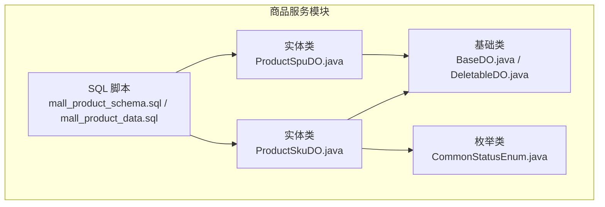
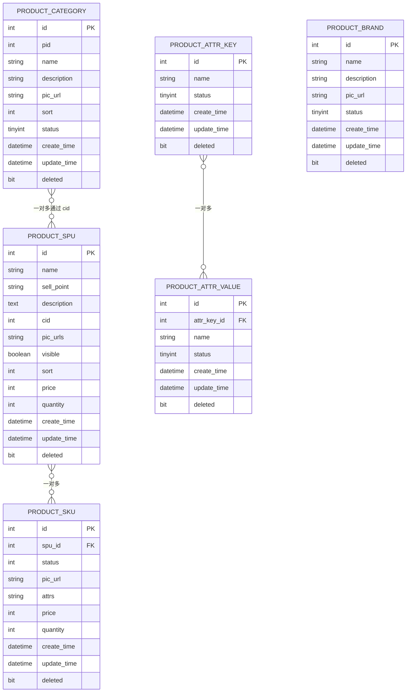
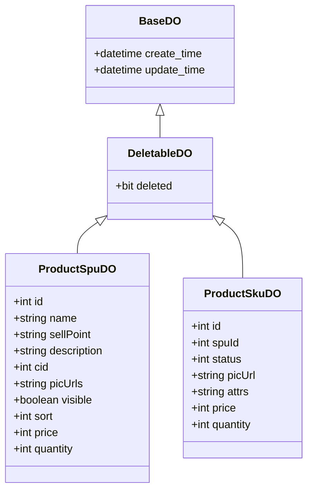
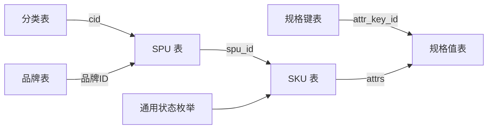
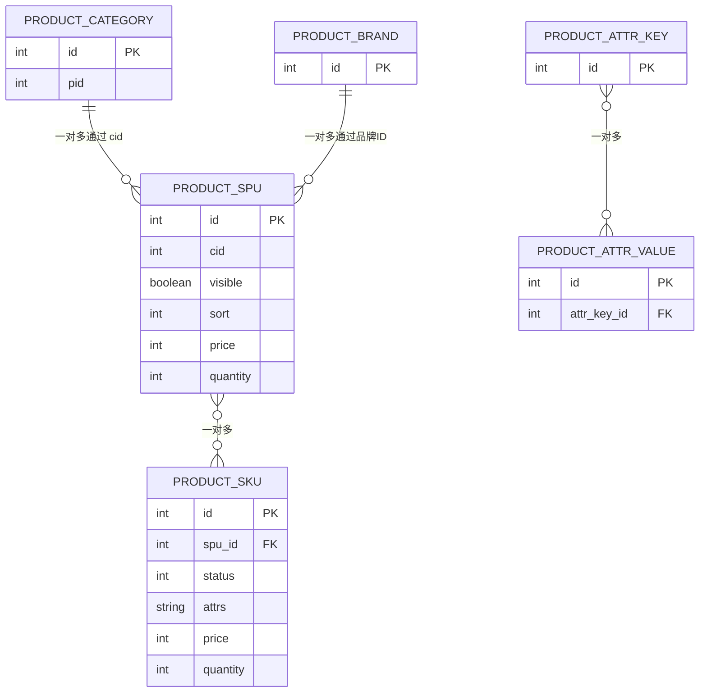

# 商品服务数据库设计

<cite>
**本文档引用的文件**
- [mall_product_schema.sql](file://product-service-project/product-service-app/src/main/resources/sql/mall_product_schema.sql)
- [mall_product_data.sql](file://product-service-project/product-service-app/src/main/resources/sql/mall_product_data.sql)
- [ProductSpuDO.java](file://product-service-project/product-service-app/src/main/java/cn/iocoder/mall/productservice/dal/mysql/dataobject/spu/ProductSpuDO.java)
- [ProductSkuDO.java](file://product-service-project/product-service-app/src/main/java/cn/iocoder/mall/productservice/dal/mysql/dataobject/sku/ProductSkuDO.java)
- [BaseDO.java](file://common/mall-spring-boot-starter-mybatis/src/main/java/cn/iocoder/mall/mybatis/core/dataobject/BaseDO.java)
- [DeletableDO.java](file://common/mall-spring-boot-starter-mybatis/src/main/java/cn/iocoder/mall/mybatis/core/dataobject/DeletableDO.java)
- [CommonStatusEnum.java](file://common/common-framework/src/main/java/cn/iocoder/common/framework/enums/CommonStatusEnum.java)
</cite>

## 目录
1. [简介](#简介)
2. [项目结构](#项目结构)
3. [核心组件](#核心组件)
4. [架构概览](#架构概览)
5. [详细组件分析](#详细组件分析)
6. [依赖分析](#依赖分析)
7. [性能考虑](#性能考虑)
8. [故障排除指南](#故障排除指南)
9. [结论](#结论)
10. [附录](#附录)

## 简介
本文件为商品服务模块的数据库设计技术文档，围绕商品主数据（SPU/SKU）、属性系统（规格键/规格值）、品牌与分类管理、状态与价格库存控制、图片与SEO、搜索索引以及用户行为数据等维度，提供从表结构到实体映射、从数据模型到业务实现的完整说明。文档同时给出数据模型图、初始化脚本路径与业务示例，帮助开发与运维人员快速理解与落地。

## 项目结构
商品服务数据库相关的核心文件位于 product-service-app 模块的 SQL 资源目录中，并通过 MyBatis Plus 的 DO（Data Object）类映射到 Java 实体。基础 DO 抽象类提供通用的审计与软删除能力。

**图表来源**
- [mall_product_schema.sql:1-104](file://product-service-project/product-service-app/src/main/resources/sql/mall_product_schema.sql#L1-L104)
- [mall_product_data.sql:1-217](file://product-service-project/product-service-app/src/main/resources/sql/mall_product_data.sql#L1-L217)
- [ProductSpuDO.java:1-83](file://product-service-project/product-service-app/src/main/java/cn/iocoder/mall/productservice/dal/mysql/dataobject/spu/ProductSpuDO.java#L1-L83)
- [ProductSkuDO.java:1-65](file://product-service-project/product-service-app/src/main/java/cn/iocoder/mall/productservice/dal/mysql/dataobject/sku/ProductSkuDO.java#L1-L65)
- [BaseDO.java](file://common/mall-spring-boot-starter-mybatis/src/main/java/cn/iocoder/mall/mybatis/core/dataobject/BaseDO.java)
- [DeletableDO.java](file://common/mall-spring-boot-starter-mybatis/src/main/java/cn/iocoder/mall/mybatis/core/dataobject/DeletableDO.java)
- [CommonStatusEnum.java](file://common/common-framework/src/main/java/cn/iocoder/common/framework/enums/CommonStatusEnum.java)

**章节来源**
- [mall_product_schema.sql:1-104](file://product-service-project/product-service-app/src/main/resources/sql/mall_product_schema.sql#L1-L104)
- [mall_product_data.sql:1-217](file://product-service-project/product-service-app/src/main/resources/sql/mall_product_data.sql#L1-L217)

## 核心组件
本节概述商品服务数据库的核心表及其职责：
- 商品 SPU 表：存储商品主数据，包含基本信息、分类、主图、上下架状态、排序、价格与库存等字段。
- 商品 SKU 表：存储具体销售单元，包含与 SPU 的一对多关系、规格组合、价格与库存、状态等。
- 属性系统：规格键（attr_key）与规格值（attr_value），支持灵活扩展的多维属性。
- 品牌表：品牌名称、描述、图片与状态。
- 分类表：树形结构的分类，支持父子关系与排序。

**章节来源**
- [mall_product_schema.sql:7-22](file://product-service-project/product-service-app/src/main/resources/sql/mall_product_schema.sql#L7-L22)
- [mall_product_schema.sql:28-40](file://product-service-project/product-service-app/src/main/resources/sql/mall_product_schema.sql#L28-L40)
- [mall_product_schema.sql:46-54](file://product-service-project/product-service-app/src/main/resources/sql/mall_product_schema.sql#L46-L54)
- [mall_product_schema.sql:60-69](file://product-service-project/product-service-app/src/main/resources/sql/mall_product_schema.sql#L60-L69)
- [mall_product_schema.sql:75-87](file://product-service-project/product-service-app/src/main/resources/sql/mall_product_schema.sql#L75-L87)
- [mall_product_schema.sql:93-103](file://product-service-project/product-service-app/src/main/resources/sql/mall_product_schema.sql#L93-L103)

## 架构概览
商品服务数据库采用“SPU 主数据 + SKU 细粒度销售单元”的两级模型，配合属性系统实现多维规格组合，通过分类与品牌完成商品的组织与检索。

**图表来源**
- [mall_product_schema.sql:7-22](file://product-service-project/product-service-app/src/main/resources/sql/mall_product_schema.sql#L7-L22)
- [mall_product_schema.sql:28-40](file://product-service-project/product-service-app/src/main/resources/sql/mall_product_schema.sql#L28-L40)
- [mall_product_schema.sql:46-54](file://product-service-project/product-service-app/src/main/resources/sql/mall_product_schema.sql#L46-L54)
- [mall_product_schema.sql:60-69](file://product-service-project/product-service-app/src/main/resources/sql/mall_product_schema.sql#L60-L69)
- [mall_product_schema.sql:75-87](file://product-service-project/product-service-app/src/main/resources/sql/mall_product_schema.sql#L75-L87)
- [mall_product_schema.sql:93-103](file://product-service-project/product-service-app/src/main/resources/sql/mall_product_schema.sql#L93-L103)

## 详细组件分析

### SPU 表（商品主数据）
- 字段要点
  - 基本信息：名称、卖点、描述、分类编号 cid、主图数组 pic_urls。
  - 上架与排序：visible、sort。
  - 价格与库存：price、quantity（注释说明当前计算方式为 SKU 最小价格与库存累加）。
  - 审计与软删除：create_time、update_time、deleted。
- 设计考量
  - 将“最小价格/总库存”等聚合字段放在 SPU，便于查询与排序。
  - pic_urls 使用逗号分隔的数组形式，便于前端展示与排序。
  - 可见性与排序字段支持运营配置。

**章节来源**
- [mall_product_schema.sql:7-22](file://product-service-project/product-service-app/src/main/resources/sql/mall_product_schema.sql#L7-L22)
- [ProductSpuDO.java:18-82](file://product-service-project/product-service-app/src/main/java/cn/iocoder/mall/productservice/dal/mysql/dataobject/spu/ProductSpuDO.java#L18-L82)

### SKU 表（销售单元）
- 字段要点
  - 关联：spu_id 指向 SPU。
  - 规格：attrs 存储规格值 ID 数组（逗号分隔），对应属性值表。
  - 价格与库存：price（分）、quantity；注释保留了“冻结库存/销量”字段的预留说明。
  - 状态：status 使用通用状态枚举。
  - 图片：pic_url 支持 SKU 级别图片。
  - 审计与软删除：create_time、update_time、deleted。
- 设计考量
  - SKU 与属性值的多对多通过 attrs 数组实现，简化关联查询。
  - 价格与库存独立维护，便于精确控制与促销场景。

**章节来源**
- [mall_product_schema.sql:28-40](file://product-service-project/product-service-app/src/main/resources/sql/mall_product_schema.sql#L28-L40)
- [ProductSkuDO.java:18-64](file://product-service-project/product-service-app/src/main/java/cn/iocoder/mall/productservice/dal/mysql/dataobject/sku/ProductSkuDO.java#L18-L64)
- [CommonStatusEnum.java](file://common/common-framework/src/main/java/cn/iocoder/common/framework/enums/CommonStatusEnum.java)

### 属性系统（规格键/规格值）
- 规格键表（product_attr_key）
  - 记录规格维度名称（如“颜色”、“尺寸”），状态与时间戳。
- 规格值表（product_attr_value）
  - 记录每个规格键下的具体取值（如“蓝色”、“XL”），并外键关联规格键。
- 设计考量
  - 支持灵活扩展新规格维度与取值，无需修改表结构。
  - SKU 的 attrs 字段通过逗号分隔的规格值 ID 组合，表达多维规格。

**章节来源**
- [mall_product_schema.sql:46-54](file://product-service-project/product-service-app/src/main/resources/sql/mall_product_schema.sql#L46-L54)
- [mall_product_schema.sql:60-69](file://product-service-project/product-service-app/src/main/resources/sql/mall_product_schema.sql#L60-L69)
- [mall_product_data.sql:127-138](file://product-service-project/product-service-app/src/main/resources/sql/mall_product_data.sql#L127-L138)
- [mall_product_data.sql:143-194](file://product-service-project/product-service-app/src/main/resources/sql/mall_product_data.sql#L143-L194)

### 品牌表
- 字段要点
  - 品牌名称、描述、图片、状态与审计字段。
- 设计考量
  - 与 SPU 通过品牌 ID 关联，便于筛选与统计。

**章节来源**
- [mall_product_schema.sql:93-103](file://product-service-project/product-service-app/src/main/resources/sql/mall_product_schema.sql#L93-L103)

### 分类表（树形结构）
- 字段要点
  - 自关联 pid 字段构成树形层级。
  - 名称、描述、图片、排序、状态与审计字段。
- 设计考量
  - 通过 cid 外键与 SPU 关联，支撑多级分类的商品组织。

**章节来源**
- [mall_product_schema.sql:75-87](file://product-service-project/product-service-app/src/main/resources/sql/mall_product_schema.sql#L75-L87)

### 数据模型类映射
- 实体基类
  - BaseDO：提供通用审计字段（create_time、update_time）。
  - DeletableDO：扩展软删除字段（deleted）。
- 实体类
  - ProductSpuDO：映射 SPU 表，包含可见性与聚合价格/库存字段。
  - ProductSkuDO：映射 SKU 表，包含状态、规格组合、价格与库存。

**图表来源**
- [BaseDO.java](file://common/mall-spring-boot-starter-mybatis/src/main/java/cn/iocoder/mall/mybatis/core/dataobject/BaseDO.java)
- [DeletableDO.java](file://common/mall-spring-boot-starter-mybatis/src/main/java/cn/iocoder/mall/mybatis/core/dataobject/DeletableDO.java)
- [ProductSpuDO.java:18-82](file://product-service-project/product-service-app/src/main/java/cn/iocoder/mall/productservice/dal/mysql/dataobject/spu/ProductSpuDO.java#L18-L82)
- [ProductSkuDO.java:18-64](file://product-service-project/product-service-app/src/main/java/cn/iocoder/mall/productservice/dal/mysql/dataobject/sku/ProductSkuDO.java#L18-L64)

## 依赖分析
- SPU 与 SKU：一对多关系，SKU 通过 spu_id 关联 SPU。
- 属性系统：规格键与规格值一对多，SKU 的 attrs 通过逗号分隔的规格值 ID 引用。
- 分类与品牌：分别通过 cid 与品牌 ID 与 SPU 关联。
- 实体层：ProductSkuDO 使用通用状态枚举，ProductSpuDO/ ProductSkuDO 继承自 DeletableDO，间接继承 BaseDO。

**图表来源**
- [mall_product_schema.sql:28-40](file://product-service-project/product-service-app/src/main/resources/sql/mall_product_schema.sql#L28-L40)
- [mall_product_schema.sql:46-54](file://product-service-project/product-service-app/src/main/resources/sql/mall_product_schema.sql#L46-L54)
- [mall_product_schema.sql:60-69](file://product-service-project/product-service-app/src/main/resources/sql/mall_product_schema.sql#L60-L69)
- [mall_product_schema.sql:75-87](file://product-service-project/product-service-app/src/main/resources/sql/mall_product_schema.sql#L75-L87)
- [mall_product_schema.sql:93-103](file://product-service-project/product-service-app/src/main/resources/sql/mall_product_schema.sql#L93-L103)
- [ProductSkuDO.java:34-36](file://product-service-project/product-service-app/src/main/java/cn/iocoder/mall/productservice/dal/mysql/dataobject/sku/ProductSkuDO.java#L34-L36)
- [CommonStatusEnum.java](file://common/common-framework/src/main/java/cn/iocoder/common/framework/enums/CommonStatusEnum.java)

**章节来源**
- [ProductSkuDO.java:34-36](file://product-service-project/product-service-app/src/main/java/cn/iocoder/mall/productservice/dal/mysql/dataobject/sku/ProductSkuDO.java#L34-L36)

## 性能考虑
- 索引建议
  - SPU：按 cid、visible、sort 建立索引，支持分类筛选与排序。
  - SKU：按 spu_id、status 建立索引，加速 SPU 下 SKU 查询与状态过滤。
  - 属性值：按 attr_key_id 建立索引，提升属性维度查询性能。
  - 分类：按 pid、sort 建立索引，支撑树形结构遍历与排序。
- 读写分离与缓存
  - SPU/SKU 列表与详情可引入缓存，热点数据（如首页商品）可预热。
- 分页与排序
  - 利用 SPU 的 sort 与 SKU 的 attrs 组合进行分页与排序，避免全表扫描。
- 写入优化
  - 批量插入 SKU 时注意 attrs 的逗号分隔格式一致性，避免解析开销。

## 故障排除指南
- 常见问题
  - SKU 价格或库存异常：检查 SPU 的 price/quantity 聚合逻辑与 SKU 的 price/quantity 更新流程。
  - 规格组合无效：确认 SKU.attrs 中的规格值 ID 在属性值表存在且状态有效。
  - 分类树异常：检查分类表 pid 与 id 的自引用完整性。
- 排查步骤
  - 核对 SPU 与 SKU 的关联关系与状态。
  - 验证属性键值对的启用状态与唯一性。
  - 检查软删除字段 deleted 的影响。
- 相关参考
  - SPU/ SKU/ 属性/ 分类/ 品牌的建表与初始数据脚本路径。

**章节来源**
- [mall_product_schema.sql:7-22](file://product-service-project/product-service-app/src/main/resources/sql/mall_product_schema.sql#L7-L22)
- [mall_product_schema.sql:28-40](file://product-service-project/product-service-app/src/main/resources/sql/mall_product_schema.sql#L28-L40)
- [mall_product_schema.sql:46-54](file://product-service-project/product-service-app/src/main/resources/sql/mall_product_schema.sql#L46-L54)
- [mall_product_schema.sql:60-69](file://product-service-project/product-service-app/src/main/resources/sql/mall_product_schema.sql#L60-L69)
- [mall_product_schema.sql:75-87](file://product-service-project/product-service-app/src/main/resources/sql/mall_product_schema.sql#L75-L87)
- [mall_product_schema.sql:93-103](file://product-service-project/product-service-app/src/main/resources/sql/mall_product_schema.sql#L93-L103)

## 结论
本设计以 SPU/SKU 为核心，结合属性系统、分类与品牌，构建了灵活可扩展的商品主数据模型。通过 SKU 的 attrs 数组表达多维规格组合，配合 SPU 的聚合价格与库存，满足电商常见的规格化与库存管理需求。实体类映射清晰，软删除与审计字段完善，便于后续扩展与维护。

## 附录

### 数据模型图（含多对多与继承关系）

**图表来源**
- [mall_product_schema.sql:7-22](file://product-service-project/product-service-app/src/main/resources/sql/mall_product_schema.sql#L7-L22)
- [mall_product_schema.sql:28-40](file://product-service-project/product-service-app/src/main/resources/sql/mall_product_schema.sql#L28-L40)
- [mall_product_schema.sql:46-54](file://product-service-project/product-service-app/src/main/resources/sql/mall_product_schema.sql#L46-L54)
- [mall_product_schema.sql:60-69](file://product-service-project/product-service-app/src/main/resources/sql/mall_product_schema.sql#L60-L69)
- [mall_product_schema.sql:75-87](file://product-service-project/product-service-app/src/main/resources/sql/mall_product_schema.sql#L75-L87)
- [mall_product_schema.sql:93-103](file://product-service-project/product-service-app/src/main/resources/sql/mall_product_schema.sql#L93-L103)

### 商品数据初始化脚本与业务示例
- 初始化脚本
  - 表结构脚本：[mall_product_schema.sql](file://product-service-project/product-service-app/src/main/resources/sql/mall_product_schema.sql)
  - 业务数据脚本：[mall_product_data.sql](file://product-service-project/product-service-app/src/main/resources/sql/mall_product_data.sql)
- 业务示例
  - SPU 示例：包含多个测试商品记录，覆盖不同分类、价格与库存。
  - SKU 示例：针对多规格商品，展示 attrs 的逗号分隔规格值组合。
  - 属性示例：规格键与规格值的插入，体现灵活扩展机制。
  - 分类与品牌示例：树形分类与品牌数据，支撑商品组织。

**章节来源**
- [mall_product_data.sql:4-121](file://product-service-project/product-service-app/src/main/resources/sql/mall_product_data.sql#L4-L121)
- [mall_product_data.sql:127-194](file://product-service-project/product-service-app/src/main/resources/sql/mall_product_data.sql#L127-L194)
- [mall_product_data.sql:199-210](file://product-service-project/product-service-app/src/main/resources/sql/mall_product_data.sql#L199-L210)
- [mall_product_data.sql:215-217](file://product-service-project/product-service-app/src/main/resources/sql/mall_product_data.sql#L215-L217)