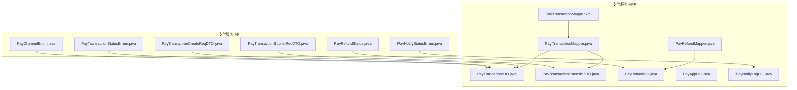
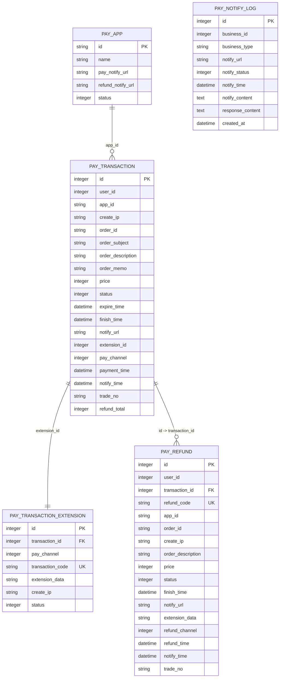
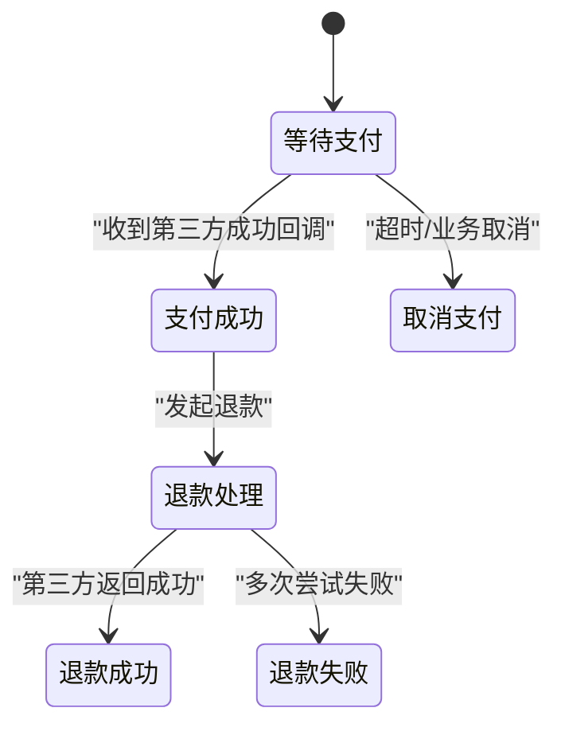
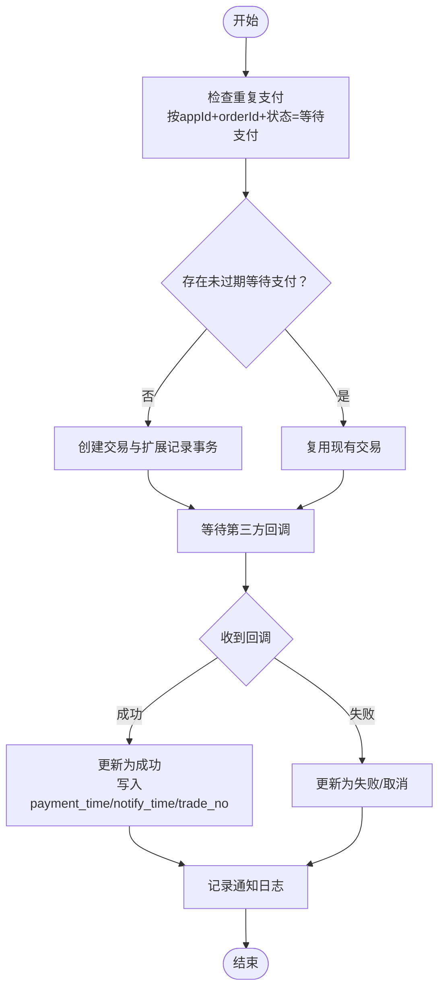
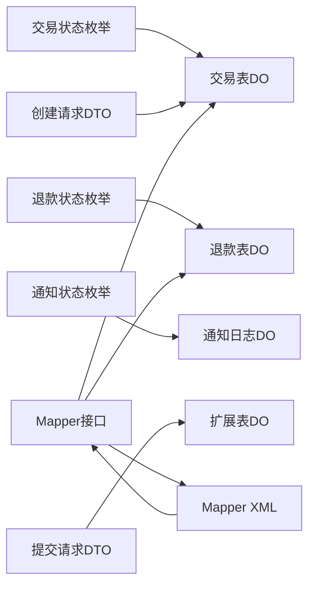

# 支付服务数据库设计

<cite>
**本文引用的文件**
- [PayTransactionStatusEnum.java](file://pay-service-project/pay-service-api/src/main/java/cn/iocoder/mall/payservice/enums/transaction/PayTransactionStatusEnum.java)
- [PayRefundStatus.java](file://pay-service-project/pay-service-api/src/main/java/cn/iocoder/mall/payservice/enums/refund/PayRefundStatus.java)
- [PayNotifyStatusEnum.java](file://pay-service-project/pay-service-api/src/main/java/cn/iocoder/mall/payservice/enums/notify/PayNotifyStatusEnum.java)
- [PayChannelEnum.java](file://pay-service-project/pay-service-api/src/main/java/cn/iocoder/mall/payservice/enums/PayChannelEnum.java)
- [PayTransactionCreateReqDTO.java](file://pay-service-project/pay-service-api/src/main/java/cn/iocoder/mall/payservice/rpc/transaction/dto/PayTransactionCreateReqDTO.java)
- [PayTransactionSubmitReqDTO.java](file://pay-service-project/pay-service-api/src/main/java/cn/iocoder/mall/payservice/rpc/transaction/dto/PayTransactionSubmitReqDTO.java)
- [PayTransactionDO.java](file://pay-service-project/pay-service-app/src/main/java/cn/iocoder/mall/payservice/dal/mysql/dataobject/transaction/PayTransactionDO.java)
- [PayTransactionExtensionDO.java](file://pay-service-project/pay-service-app/src/main/java/cn/iocoder/mall/payservice/dal/mysql/dataobject/transaction/PayTransactionExtensionDO.java)
- [PayRefundDO.java](file://pay-service-project/pay-service-app/src/main/java/cn/iocoder/mall/payservice/dal/mysql/dataobject/refund/PayRefundDO.java)
- [PayAppDO.java](file://pay-service-project/pay-service-app/src/main/java/cn/iocoder/mall/payservice/dal/mysql/dataobject/app/PayAppDO.java)
- [PayRepeatTransactionDO.java](file://pay-service-project/pay-service-app/src/main/java/cn/iocoder/mall/payservice/dal/mysql/dataobject/transaction/PayRepeatTransactionDO.java)
- [PayTransactionMapper.xml](file://pay-service-project/pay-service-app/src/main/resources/mapper/PayTransactionMapper.xml)
- [PayTransactionMapper.java](file://pay-service-project/pay-service-app/src/main/java/cn/iocoder/mall/payservice/dal/mysql/mapper/transaction/PayTransactionMapper.java)
- [PayRefundMapper.java](file://pay-service-project/pay-service-app/src/main/java/cn/iocoder/mall/payservice/dal/mysql/mapper/refund/PayRefundMapper.java)
- [PayNotifyLogDO.java](file://pay-service-project/pay-service-app/src/main/java/cn/iocoder/mall/payservice/dal/mysql/dataobject/notify/PayNotifyLogDO.java)
</cite>

## 目录
1. [简介](#简介)
2. [项目结构](#项目结构)
3. [核心组件](#核心组件)
4. [架构总览](#架构总览)
5. [详细组件分析](#详细组件分析)
6. [依赖关系分析](#依赖关系分析)
7. [性能考量](#性能考量)
8. [故障排查指南](#故障排查指南)
9. [结论](#结论)
10. [附录](#附录)

## 简介
本文件面向支付服务模块的数据库设计，系统化梳理支付交易表、退款表、应用表、通知表等核心数据结构，深入解析支付状态机在数据库层面的实现（创建、等待、成功、取消），阐述幂等性保障机制（重复支付检测、事务控制、一致性），并覆盖支付渠道集成（第三方平台对接、回调处理、对账数据存储）、通知重试与失败处理、金额计算与手续费记录、安全存储与审计、监控指标与性能优化等主题。目标是为开发者与运维人员提供权威、可执行的数据库设计方案。

## 项目结构
支付服务数据库相关代码主要分布在以下位置：
- 枚举与RPC接口定义：pay-service-api
- 数据对象与MyBatis映射：pay-service-app
- Mapper XML：resources/mapper

图表来源
- [PayChannelEnum.java:1-59](file://pay-service-project/pay-service-api/src/main/java/cn/iocoder/mall/payservice/enums/PayChannelEnum.java#L1-L59)
- [PayTransactionStatusEnum.java:1-31](file://pay-service-project/pay-service-api/src/main/java/cn/iocoder/mall/payservice/enums/transaction/PayTransactionStatusEnum.java#L1-L31)
- [PayRefundStatus.java:1-31](file://pay-service-project/pay-service-api/src/main/java/cn/iocoder/mall/payservice/enums/refund/PayRefundStatus.java#L1-L31)
- [PayNotifyStatusEnum.java:1-34](file://pay-service-project/pay-service-api/src/main/java/cn/iocoder/mall/payservice/enums/notify/PayNotifyStatusEnum.java#L1-L34)
- [PayTransactionCreateReqDTO.java:1-73](file://pay-service-project/pay-service-api/src/main/java/cn/iocoder/mall/payservice/rpc/transaction/dto/PayTransactionCreateReqDTO.java#L1-L73)
- [PayTransactionSubmitReqDTO.java:1-45](file://pay-service-project/pay-service-api/src/main/java/cn/iocoder/mall/payservice/rpc/transaction/dto/PayTransactionSubmitReqDTO.java#L1-L45)
- [PayTransactionDO.java:1-104](file://pay-service-project/pay-service-app/src/main/java/cn/iocoder/mall/payservice/dal/mysql/dataobject/transaction/PayTransactionDO.java#L1-L104)
- [PayTransactionExtensionDO.java:1-55](file://pay-service-project/pay-service-app/src/main/java/cn/iocoder/mall/payservice/dal/mysql/dataobject/transaction/PayTransactionExtensionDO.java#L1-L55)
- [PayRefundDO.java:1-109](file://pay-service-project/pay-service-app/src/main/java/cn/iocoder/mall/payservice/dal/mysql/dataobject/refund/PayRefundDO.java#L1-L109)
- [PayAppDO.java:1-44](file://pay-service-project/pay-service-app/src/main/java/cn/iocoder/mall/payservice/dal/mysql/dataobject/app/PayAppDO.java#L1-L44)
- [PayNotifyLogDO.java](file://pay-service-project/pay-service-app/src/main/java/cn/iocoder/mall/payservice/dal/mysql/dataobject/notify/PayNotifyLogDO.java)
- [PayTransactionMapper.java](file://pay-service-project/pay-service-app/src/main/java/cn/iocoder/mall/payservice/dal/mysql/mapper/transaction/PayTransactionMapper.java)
- [PayRefundMapper.java](file://pay-service-project/pay-service-app/src/main/java/cn/iocoder/mall/payservice/dal/mysql/mapper/refund/PayRefundMapper.java)
- [PayTransactionMapper.xml](file://pay-service-project/pay-service-app/src/main/resources/mapper/PayTransactionMapper.xml)

章节来源
- [PayTransactionDO.java:1-104](file://pay-service-project/pay-service-app/src/main/java/cn/iocoder/mall/payservice/dal/mysql/dataobject/transaction/PayTransactionDO.java#L1-L104)
- [PayRefundDO.java:1-109](file://pay-service-project/pay-service-app/src/main/java/cn/iocoder/mall/payservice/dal/mysql/dataobject/refund/PayRefundDO.java#L1-L109)
- [PayAppDO.java:1-44](file://pay-service-project/pay-service-app/src/main/java/cn/iocoder/mall/payservice/dal/mysql/dataobject/app/PayAppDO.java#L1-L44)
- [PayNotifyLogDO.java](file://pay-service-project/pay-service-app/src/main/java/cn/iocoder/mall/payservice/dal/mysql/dataobject/notify/PayNotifyLogDO.java)

## 核心组件
本节聚焦四大核心数据表及其职责与字段含义：
- 支付交易表（pay_transaction）：承载一次支付交易的全生命周期数据，包括金额、状态、过期时间、第三方流水号、通知时间等。
- 交易扩展表（pay_transaction_extension）：存放与第三方交互的关键信息（如第三方订单号、扩展数据、发起IP、状态），并与交易表建立关联。
- 退款表（pay_refund）：记录退款单的申请、状态、金额、渠道、第三方流水号、通知时间等。
- 支付应用表（pay_app）：记录不同业务线的应用配置（如通知地址、状态），用于统一管理各业务线的通知策略。

章节来源
- [PayTransactionDO.java:12-104](file://pay-service-project/pay-service-app/src/main/java/cn/iocoder/mall/payservice/dal/mysql/dataobject/transaction/PayTransactionDO.java#L12-L104)
- [PayTransactionExtensionDO.java:9-55](file://pay-service-project/pay-service-app/src/main/java/cn/iocoder/mall/payservice/dal/mysql/dataobject/transaction/PayTransactionExtensionDO.java#L9-L55)
- [PayRefundDO.java:12-109](file://pay-service-project/pay-service-app/src/main/java/cn/iocoder/mall/payservice/dal/mysql/dataobject/refund/PayRefundDO.java#L12-L109)
- [PayAppDO.java:9-44](file://pay-service-project/pay-service-app/src/main/java/cn/iocoder/mall/payservice/dal/mysql/dataobject/app/PayAppDO.java#L9-L44)

## 架构总览
支付服务数据库层围绕“交易-扩展-退款-应用-通知”五张核心表展开，通过枚举与DTO约束业务语义，通过Mapper/XML实现数据持久化与查询能力。

图表来源
- [PayAppDO.java:14-44](file://pay-service-project/pay-service-app/src/main/java/cn/iocoder/mall/payservice/dal/mysql/dataobject/app/PayAppDO.java#L14-L44)
- [PayTransactionDO.java:15-104](file://pay-service-project/pay-service-app/src/main/java/cn/iocoder/mall/payservice/dal/mysql/dataobject/transaction/PayTransactionDO.java#L15-L104)
- [PayTransactionExtensionDO.java:12-55](file://pay-service-project/pay-service-app/src/main/java/cn/iocoder/mall/payservice/dal/mysql/dataobject/transaction/PayTransactionExtensionDO.java#L12-L55)
- [PayRefundDO.java:15-109](file://pay-service-project/pay-service-app/src/main/java/cn/iocoder/mall/payservice/dal/mysql/dataobject/refund/PayRefundDO.java#L15-L109)
- [PayNotifyLogDO.java](file://pay-service-project/pay-service-app/src/main/java/cn/iocoder/mall/payservice/dal/mysql/dataobject/notify/PayNotifyLogDO.java)

## 详细组件分析

### 支付交易表（pay_transaction）
- 设计要点
  - 主键自增，便于顺序写入与范围查询。
  - 关联字段：appId、orderId、extensionId，支撑跨业务线与扩展数据解耦。
  - 状态字段与扩展表状态保持一致（WAITING/SUCCESS），CANCEL在交易表体现。
  - 金额以“分”为最小单位，避免浮点误差；退款累计字段用于统计已退金额。
  - 时间字段区分支付完成时间、通知时间、过期时间，便于对账与超时处理。
- 字段与约束
  - 金额price、退款累计refund_total、状态status、过期expire_time、通知finish_time等。
  - 与扩展表通过extensionId关联，与退款表通过id与transactionId关联。
- 查询与更新
  - 常见查询：按appId+orderId唯一查询；按状态与过期时间批量清理；按tradeNo回查。
  - 更新策略：状态机更新（WAITING->SUCCESS/CANCEL），退款累计累加，finish_time仅在最终态写入。

章节来源
- [PayTransactionDO.java:15-104](file://pay-service-project/pay-service-app/src/main/java/cn/iocoder/mall/payservice/dal/mysql/dataobject/transaction/PayTransactionDO.java#L15-L104)

### 交易扩展表（pay_transaction_extension）
- 设计要点
  - 存放第三方交互所需的关键数据，如第三方订单号（唯一索引）、扩展数据、发起IP、状态。
  - 与交易表一对一，确保扩展信息与主交易强关联。
- 唯一性与幂等
  - 第三方订单号transactionCode作为唯一索引，防止重复提交导致的重复支付。
- 状态同步
  - 扩展表状态仅包含WAITING与SUCCESS，与交易表状态形成一致的状态机。

章节来源
- [PayTransactionExtensionDO.java:12-55](file://pay-service-project/pay-service-app/src/main/java/cn/iocoder/mall/payservice/dal/mysql/dataobject/transaction/PayTransactionExtensionDO.java#L12-L55)

### 退款表（pay_refund）
- 设计要点
  - 退款单独立建表，支持多笔退款、部分退款、退款渠道区分。
  - 唯一索引refundCode用于防重，orderId在appId域内唯一，避免跨业务线冲突。
  - 扩展字段extensionData用于回填第三方回调数据，便于对账与审计。
- 状态机
  - WAITING/SUCCESS/FAILURE，结合REQUEST_SUCCESS/REQUEST_FAILURE细化通知阶段状态。
- 对账与追踪
  - refundTime、notifyTime、tradeNo用于与第三方对账与问题定位。

章节来源
- [PayRefundDO.java:15-109](file://pay-service-project/pay-service-app/src/main/java/cn/iocoder/mall/payservice/dal/mysql/dataobject/refund/PayRefundDO.java#L15-L109)
- [PayNotifyStatusEnum.java:9-34](file://pay-service-project/pay-service-api/src/main/java/cn/iocoder/mall/payservice/enums/notify/PayNotifyStatusEnum.java#L9-L34)

### 支付应用表（pay_app）
- 设计要点
  - 记录各业务线应用的统一通知地址（支付/退款），便于集中管理。
  - 状态字段用于开关应用，便于灰度与降级。
- 集成点
  - 交易/退款表中的notify_url与应用表的pay_notify_url/ refund_notify_url配合使用。

章节来源
- [PayAppDO.java:14-44](file://pay-service-project/pay-service-app/src/main/java/cn/iocoder/mall/payservice/dal/mysql/dataobject/app/PayAppDO.java#L14-L44)

### 通知日志表（pay_notify_log）
- 设计要点
  - 统一记录所有通知发送与响应情况，包含业务类型、URL、状态、内容、时间等。
  - 支持重试与失败处理的可视化追踪，便于问题定位与审计。
- 与状态机联动
  - 通知状态与PayNotifyStatusEnum保持一致，便于状态机驱动。

章节来源
- [PayNotifyLogDO.java](file://pay-service-project/pay-service-app/src/main/java/cn/iocoder/mall/payservice/dal/mysql/dataobject/notify/PayNotifyLogDO.java)

### 支付状态机（数据库实现）
- 交易状态机
  - WAITING（等待支付）：创建交易后初始状态；扩展表状态也应为WAITING。
  - SUCCESS（支付成功）：收到第三方回调或主动查询确认后进入；写入payment_time、notify_time、trade_no。
  - CANCEL（取消支付）：超时或业务取消触发；finish_time仅在最终态写入。
- 退款状态机
  - WAITING（处理中）：提交退款后初始状态。
  - SUCCESS（成功）：第三方返回成功。
  - FAILURE（失败）：多次尝试后仍失败。
  - REQUEST_SUCCESS/REQUEST_FAILURE：通知阶段的细分状态，便于精细化治理。
- 状态迁移图

图表来源
- [PayTransactionStatusEnum.java:9-14](file://pay-service-project/pay-service-api/src/main/java/cn/iocoder/mall/payservice/enums/transaction/PayTransactionStatusEnum.java#L9-L14)
- [PayRefundStatus.java:9-14](file://pay-service-project/pay-service-api/src/main/java/cn/iocoder/mall/payservice/enums/refund/PayRefundStatus.java#L9-L14)
- [PayNotifyStatusEnum.java:9-16](file://pay-service-project/pay-service-api/src/main/java/cn/iocoder/mall/payservice/enums/notify/PayNotifyStatusEnum.java#L9-L16)

章节来源
- [PayTransactionStatusEnum.java:1-31](file://pay-service-project/pay-service-api/src/main/java/cn/iocoder/mall/payservice/enums/transaction/PayTransactionStatusEnum.java#L1-L31)
- [PayRefundStatus.java:1-31](file://pay-service-project/pay-service-api/src/main/java/cn/iocoder/mall/payservice/enums/refund/PayRefundStatus.java#L1-L31)
- [PayNotifyStatusEnum.java:1-34](file://pay-service-project/pay-service-api/src/main/java/cn/iocoder/mall/payservice/enums/notify/PayNotifyStatusEnum.java#L1-L34)

### 幂等性保障（重复支付检测、事务控制、一致性）
- 唯一索引防重
  - 交易扩展表的transactionCode（第三方订单号）唯一索引，防止重复提交。
  - 退款表的refundCode唯一索引，防止重复退款。
- 事务控制
  - 创建交易与扩展记录需在同一事务内，确保一致性。
  - 支付成功回调时，先校验状态是否为WAITING，再更新为SUCCESS，最后落库通知日志。
- 一致性保证
  - 交易表与扩展表一对一，状态保持一致；退款累计字段仅在成功退款后累加。
- 重复支付检测
  - 在提交支付前，按appId+orderId查询是否存在未过期且状态为WAITING的交易；若存在则复用，避免重复创建。

图表来源
- [PayTransactionExtensionDO.java:33-35](file://pay-service-project/pay-service-app/src/main/java/cn/iocoder/mall/payservice/dal/mysql/dataobject/transaction/PayTransactionExtensionDO.java#L33-L35)
- [PayRefundDO.java:35-37](file://pay-service-project/pay-service-app/src/main/java/cn/iocoder/mall/payservice/dal/mysql/dataobject/refund/PayRefundDO.java#L35-L37)
- [PayTransactionDO.java:59-61](file://pay-service-project/pay-service-app/src/main/java/cn/iocoder/mall/payservice/dal/mysql/dataobject/transaction/PayTransactionDO.java#L59-L61)

章节来源
- [PayRepeatTransactionDO.java:6-16](file://pay-service-project/pay-service-app/src/main/java/cn/iocoder/mall/payservice/dal/mysql/dataobject/transaction/PayRepeatTransactionDO.java#L6-L16)

### 支付渠道集成（第三方平台对接、回调处理、对账）
- 渠道枚举
  - 支持微信、支付宝、Ping++等渠道，通过code与名称标识，便于路由与展示。
- 对接流程
  - 提交支付时指定payChannel，生成扩展记录与第三方订单号（transactionCode）。
  - 回调时根据tradeNo与channel匹配到对应交易，更新状态与时间戳。
- 对账数据
  - 交易表与退款表均保留tradeNo与notify_time，便于与第三方对账。

章节来源
- [PayChannelEnum.java:10-18](file://pay-service-project/pay-service-api/src/main/java/cn/iocoder/mall/payservice/enums/PayChannelEnum.java#L10-L18)
- [PayTransactionDO.java:81-94](file://pay-service-project/pay-service-app/src/main/java/cn/iocoder/mall/payservice/dal/mysql/dataobject/transaction/PayTransactionDO.java#L81-L94)
- [PayRefundDO.java:90-106](file://pay-service-project/pay-service-app/src/main/java/cn/iocoder/mall/payservice/dal/mysql/dataobject/refund/PayRefundDO.java#L90-L106)

### 通知重试机制、失败处理与数据恢复
- 重试策略
  - 通知日志表记录每次通知的URL、状态、内容与响应；根据状态机（WAITING/SUCCESS/FAILURE/REQUEST_*）决定是否重试。
- 失败处理
  - REQUEST_FAILURE：立即标记失败并停止重试；REQUEST_SUCCESS但业务失败：记录失败原因，人工介入。
- 数据恢复
  - 定时任务扫描WAITING状态通知，按指数退避重试；失败阈值后升级为FAILURE并告警。

章节来源
- [PayNotifyStatusEnum.java:9-16](file://pay-service-project/pay-service-api/src/main/java/cn/iocoder/mall/payservice/enums/notify/PayNotifyStatusEnum.java#L9-L16)
- [PayNotifyLogDO.java](file://pay-service-project/pay-service-app/src/main/java/cn/iocoder/mall/payservice/dal/mysql/dataobject/notify/PayNotifyLogDO.java)

### 金额计算、手续费记录、财务对账
- 金额单位
  - 金额以“分”为最小单位，避免浮点误差；退款累计字段用于统计已退金额。
- 手续费记录
  - 当前模型未显式记录手续费字段，建议在扩展表或单独的手续费明细表中补充，以便财务对账。
- 对账维度
  - 交易表与退款表均保留tradeNo、notify_time、finish_time，便于与第三方流水核对。

章节来源
- [PayTransactionDO.java:55-101](file://pay-service-project/pay-service-app/src/main/java/cn/iocoder/mall/payservice/dal/mysql/dataobject/transaction/PayTransactionDO.java#L55-L101)
- [PayRefundDO.java:64-106](file://pay-service-project/pay-service-app/src/main/java/cn/iocoder/mall/payservice/dal/mysql/dataobject/refund/PayRefundDO.java#L64-L106)

### 安全存储（敏感信息加密、访问控制、审计日志）
- 敏感信息
  - 交易与退款表未包含银行卡、身份证等敏感字段；若后续需要，建议采用字段级加密与脱敏显示。
- 访问控制
  - 通过应用表的pay_notify_url/ refund_notify_url集中管理通知出口，限制可调用方。
- 审计日志
  - 通知日志表记录通知内容与响应，便于审计与追溯。

章节来源
- [PayAppDO.java:29-35](file://pay-service-project/pay-service-app/src/main/java/cn/iocoder/mall/payservice/dal/mysql/dataobject/app/PayAppDO.java#L29-L35)
- [PayNotifyLogDO.java](file://pay-service-project/pay-service-app/src/main/java/cn/iocoder/mall/payservice/dal/mysql/dataobject/notify/PayNotifyLogDO.java)

### 监控指标、异常处理、性能优化
- 监控指标
  - 交易成功率、退款成功率、通知失败率、回调延迟、重试次数、超时单量。
- 异常处理
  - 回调异常、网络异常、参数异常分别记录到通知日志，并触发告警。
- 性能优化
  - 为常用查询字段建立索引（如appId+orderId、extensionId、refundCode、tradeNo）。
  - 分表分库：按appId或userId分片，降低热点。
  - 读写分离：通知与查询走从库，写入走主库。

章节来源
- [PayTransactionMapper.xml](file://pay-service-project/pay-service-app/src/main/resources/mapper/PayTransactionMapper.xml)
- [PayTransactionMapper.java](file://pay-service-project/pay-service-app/src/main/java/cn/iocoder/mall/payservice/dal/mysql/mapper/transaction/PayTransactionMapper.java)
- [PayRefundMapper.java](file://pay-service-project/pay-service-app/src/main/java/cn/iocoder/mall/payservice/dal/mysql/mapper/refund/PayRefundMapper.java)

## 依赖关系分析
- 枚举依赖
  - 交易表status依赖交易状态枚举；退款表status依赖退款状态枚举；通知日志status依赖通知状态枚举。
- DTO约束
  - 创建与提交请求DTO对字段进行校验，确保业务语义正确性。
- Mapper与XML
  - Mapper接口定义方法，XML中编写SQL，实现复杂查询与批量操作。

图表来源
- [PayTransactionStatusEnum.java:9-14](file://pay-service-project/pay-service-api/src/main/java/cn/iocoder/mall/payservice/enums/transaction/PayTransactionStatusEnum.java#L9-L14)
- [PayRefundStatus.java:9-14](file://pay-service-project/pay-service-api/src/main/java/cn/iocoder/mall/payservice/enums/refund/PayRefundStatus.java#L9-L14)
- [PayNotifyStatusEnum.java:9-16](file://pay-service-project/pay-service-api/src/main/java/cn/iocoder/mall/payservice/enums/notify/PayNotifyStatusEnum.java#L9-L16)
- [PayTransactionCreateReqDTO.java:18-73](file://pay-service-project/pay-service-api/src/main/java/cn/iocoder/mall/payservice/rpc/transaction/dto/PayTransactionCreateReqDTO.java#L18-L73)
- [PayTransactionSubmitReqDTO.java:17-45](file://pay-service-project/pay-service-api/src/main/java/cn/iocoder/mall/payservice/rpc/transaction/dto/PayTransactionSubmitReqDTO.java#L17-L45)
- [PayTransactionMapper.java](file://pay-service-project/pay-service-app/src/main/java/cn/iocoder/mall/payservice/dal/mysql/mapper/transaction/PayTransactionMapper.java)
- [PayRefundMapper.java](file://pay-service-project/pay-service-app/src/main/java/cn/iocoder/mall/payservice/dal/mysql/mapper/refund/PayRefundMapper.java)
- [PayTransactionMapper.xml](file://pay-service-project/pay-service-app/src/main/resources/mapper/PayTransactionMapper.xml)

章节来源
- [PayTransactionStatusEnum.java:1-31](file://pay-service-project/pay-service-api/src/main/java/cn/iocoder/mall/payservice/enums/transaction/PayTransactionStatusEnum.java#L1-L31)
- [PayRefundStatus.java:1-31](file://pay-service-project/pay-service-api/src/main/java/cn/iocoder/mall/payservice/enums/refund/PayRefundStatus.java#L1-L31)
- [PayNotifyStatusEnum.java:1-34](file://pay-service-project/pay-service-api/src/main/java/cn/iocoder/mall/payservice/enums/notify/PayNotifyStatusEnum.java#L1-L34)
- [PayTransactionCreateReqDTO.java:1-73](file://pay-service-project/pay-service-api/src/main/java/cn/iocoder/mall/payservice/rpc/transaction/dto/PayTransactionCreateReqDTO.java#L1-L73)
- [PayTransactionSubmitReqDTO.java:1-45](file://pay-service-project/pay-service-api/src/main/java/cn/iocoder/mall/payservice/rpc/transaction/dto/PayTransactionSubmitReqDTO.java#L1-L45)

## 性能考量
- 索引策略
  - 交易：orderId、appId+orderId、extensionId、tradeNo、status+expireTime。
  - 退款：orderId、appId+orderId、refundCode、tradeNo、status。
- 分片与分区
  - 按appId或userId分片，热点数据隔离。
  - 按时间分区归档历史数据，提升查询效率。
- 读写分离
  - 通知与查询走从库，写入走主库，降低写放大。
- 批处理
  - 超时清理、通知重试、对账任务采用批处理，减少频繁小事务。

## 故障排查指南
- 支付未到账
  - 检查交易表状态是否为SUCCESS，payment_time/notify_time是否写入，tradeNo是否正确。
  - 查看通知日志表的最后一次通知状态与响应内容。
- 重复支付
  - 检查扩展表transactionCode是否唯一，是否存在WAITING状态的重复订单。
- 退款异常
  - 检查退款表状态与通知日志，确认REQUEST_SUCCESS/REQUEST_FAILURE的具体原因。
- 对账不平
  - 对比交易与退款表的tradeNo、金额、finish_time与第三方对账单。

章节来源
- [PayTransactionDO.java:59-94](file://pay-service-project/pay-service-app/src/main/java/cn/iocoder/mall/payservice/dal/mysql/dataobject/transaction/PayTransactionDO.java#L59-L94)
- [PayRefundDO.java:70-106](file://pay-service-project/pay-service-app/src/main/java/cn/iocoder/mall/payservice/dal/mysql/dataobject/refund/PayRefundDO.java#L70-L106)
- [PayNotifyLogDO.java](file://pay-service-project/pay-service-app/src/main/java/cn/iocoder/mall/payservice/dal/mysql/dataobject/notify/PayNotifyLogDO.java)

## 结论
本数据库设计方案以“交易-扩展-退款-应用-通知”为核心，通过状态机、幂等索引、事务控制与统一通知日志，构建了高可靠、可审计、易对账的支付数据体系。建议在后续迭代中补充手续费明细、完善分片策略与监控告警，持续提升系统的稳定性与可维护性。

## 附录
- 关键字段速查
  - 交易表：orderId、appId、price、status、expireTime、paymentTime、notifyTime、tradeNo、refundTotal。
  - 扩展表：transactionCode（UK）、extensionData、createIp、status。
  - 退款表：refundCode（UK）、orderId、appId、price、status、refundTime、notifyTime、tradeNo。
  - 应用表：pay_notify_url、refund_notify_url、status。
  - 通知日志：business_type、notify_url、notify_status、notify_content、response_content、created_at。