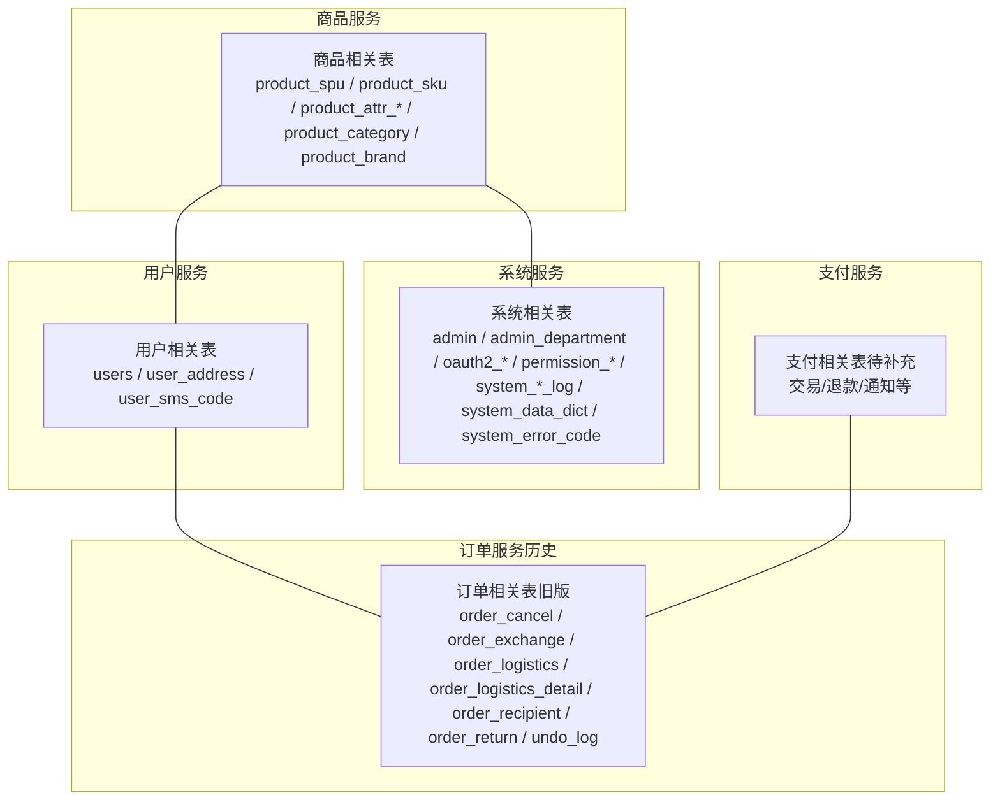
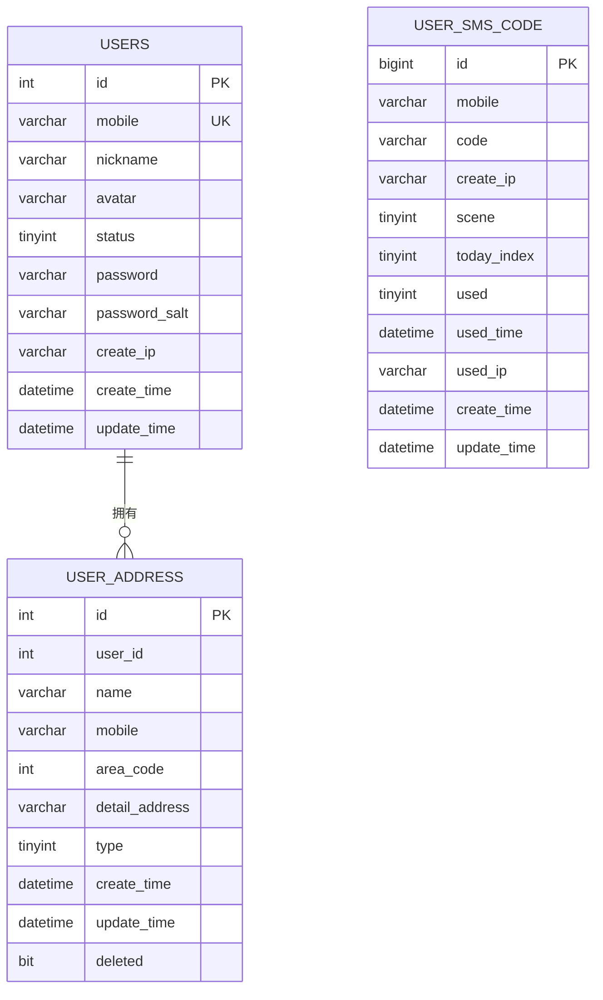
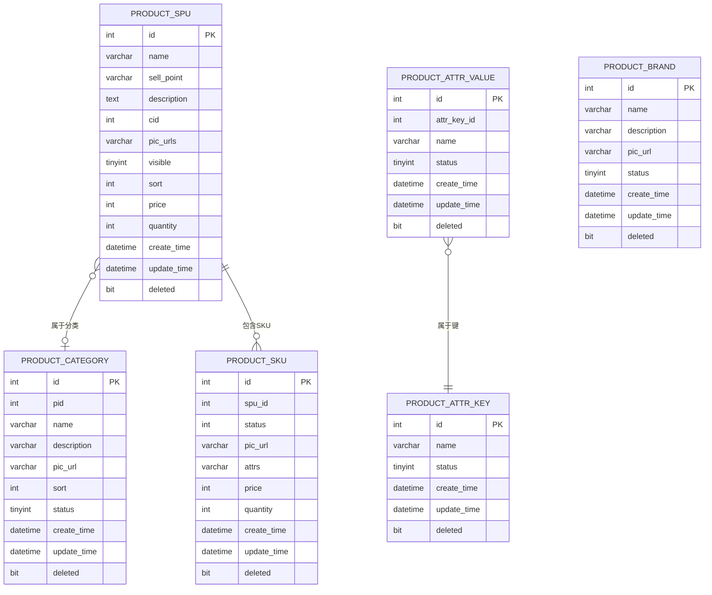
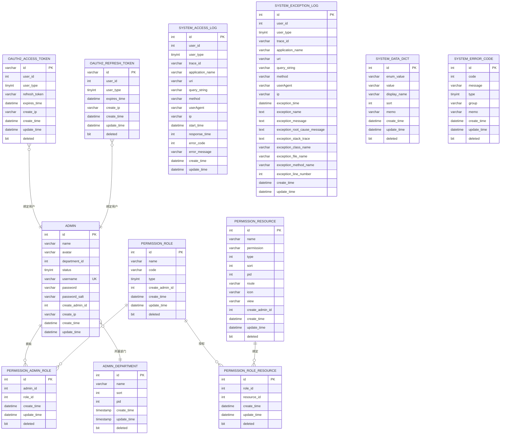
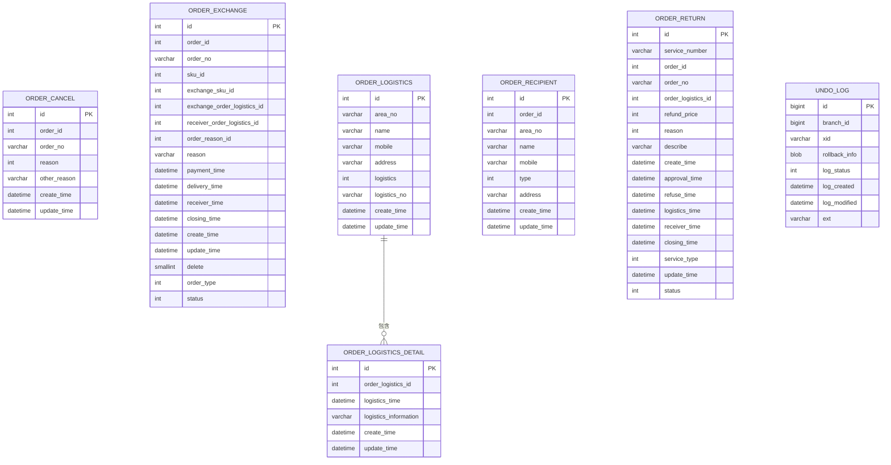
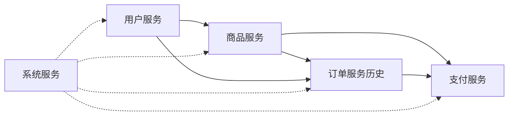

# 数据库设计

<cite>
**本文引用的文件**
- [mall_order.sql](file://docs/sql/old/mall_order.sql)
- [mall_product_schema.sql](file://product-service-project/product-service-app/src/main/resources/sql/mall_product_schema.sql)
- [mall_system_schema.sql](file://system-service-project/system-service-app/src/main/resources/sql/mall_system_schema.sql)
- [mall_user_schema.sql](file://user-service-project/user-service-app/src/main/resources/sql/mall_user_schema.sql)
- [application.yaml（商品服务）](file://product-service-project/product-service-app/src/main/resources/application.yaml)
- [application.yaml（系统服务）](file://system-service-project/system-service-app/src/main/resources/application.yaml)
- [application.yaml（用户服务）](file://user-service-project/user-service-app/src/main/resources/application.yaml)
- [application.yaml（支付服务）](file://pay-service-project/pay-service-app/src/main/resources/application.yaml)
</cite>

## 目录
1. [简介](#简介)
2. [项目结构](#项目结构)
3. [核心组件](#核心组件)
4. [架构总览](#架构总览)
5. [详细组件分析](#详细组件分析)
6. [依赖分析](#依赖分析)
7. [性能考量](#性能考量)
8. [故障排查指南](#故障排查指南)
9. [结论](#结论)
10. [附录](#附录)

## 简介
本文件面向 Onemall 项目的数据库设计，系统性梳理各业务模块的数据表结构、规范化与反规范化策略、索引与查询优化、分库分表规划、一致性保障机制、服务侧数据库配置与监控运维建议，并提供 ER 关系图与表结构说明，帮助开发者与运维人员快速理解与落地数据库层面的设计。

## 项目结构
- 各服务独立维护自己的数据库模式与数据脚本，采用按服务拆分的数据库布局，便于职责清晰与演进隔离。
- 商品服务负责商品（SPU/SKU/属性/分类/品牌）相关表；系统服务负责权限、数据字典、访问日志、异常日志等；用户服务负责用户、地址、短信验证码；订单相关历史脚本位于 docs/sql/old 中；支付服务在独立工程中，其配置位于 pay-service-app 的 application.yaml。

图表来源
- [mall_product_schema.sql:1-104](file://product-service-project/product-service-app/src/main/resources/sql/mall_product_schema.sql#L1-L104)
- [mall_system_schema.sql:1-228](file://system-service-project/system-service-app/src/main/resources/sql/mall_system_schema.sql#L1-L228)
- [mall_user_schema.sql:1-58](file://user-service-project/user-service-app/src/main/resources/sql/mall_user_schema.sql#L1-L58)
- [mall_order.sql:1-140](file://docs/sql/old/mall_order.sql#L1-L140)

章节来源
- [mall_product_schema.sql:1-104](file://product-service-project/product-service-app/src/main/resources/sql/mall_product_schema.sql#L1-L104)
- [mall_system_schema.sql:1-228](file://system-service-project/system-service-app/src/main/resources/sql/mall_system_schema.sql#L1-L228)
- [mall_user_schema.sql:1-58](file://user-service-project/user-service-app/src/main/resources/sql/mall_user_schema.sql#L1-L58)
- [mall_order.sql:1-140](file://docs/sql/old/mall_order.sql#L1-L140)

## 核心组件
- 用户表 users：存储用户基本信息、登录凭据与注册 IP，唯一索引手机号，支持状态与头像等扩展字段。
- 地址表 user_address：用户收件地址，按用户维度建立索引，支持软删除。
- 短信验证码表 user_sms_code：按手机号建立索引，记录发送场景、今日序号、使用状态与使用时间。
- 商品 SPU 表 product_spu：商品主信息，包含名称、卖点、描述、分类、主图、上下架状态、排序、价格、库存、逻辑删除标志。
- 商品 SKU 表 product_sku：SKU 维度的价格、库存、规格值、状态与逻辑删除。
- 规格键/值表 product_attr_key/value：规格体系，支持启用/禁用与排序。
- 分类表 product_category：树形分类，支持父节点、排序、状态与逻辑删除。
- 品牌表 product_brand：品牌信息与状态。
- 系统表 admin/admin_department/oauth2_*：管理员、部门、OAuth2 访问/刷新令牌、权限资源与角色等。
- 日志表 system_access_log/system_exception_log：系统访问与异常日志，支持链路追踪与错误码。
- 数据字典与错误码表 system_data_dict/system_error_code：统一的数据字典与错误码管理。
- 订单相关表（旧版）：order_cancel/order_exchange/order_logistics/order_logistics_detail/order_recipient/order_return/undo_log，覆盖取消、换货、退货、物流与回滚日志。

章节来源
- [mall_user_schema.sql:1-58](file://user-service-project/user-service-app/src/main/resources/sql/mall_user_schema.sql#L1-L58)
- [mall_product_schema.sql:1-104](file://product-service-project/product-service-app/src/main/resources/sql/mall_product_schema.sql#L1-L104)
- [mall_system_schema.sql:1-228](file://system-service-project/system-service-app/src/main/resources/sql/mall_system_schema.sql#L1-L228)
- [mall_order.sql:1-140](file://docs/sql/old/mall_order.sql#L1-L140)

## 架构总览
- 服务化数据库：每个服务拥有独立的数据库与表空间，降低耦合，便于独立扩容与演进。
- 读写分离与分库分表：当前仓库未见分库分表实现代码，建议基于业务维度进行水平拆分（如用户/商品/订单），并选择合适的分片键（如用户 ID、商品 ID、订单 ID）。
- 一致性与事务：跨服务事务采用分布式事务（如 Seata）或最终一致性（消息队列）策略；单服务内使用本地事务与幂等设计。
- 监控与运维：通过 Actuator 暴露端点，结合慢查询日志、索引使用率与 QPS/TPS 监控进行持续优化。

## 详细组件分析

### 用户模块（users、user_address、user_sms_code）
- 字段要点
  - users：用户编号、昵称、头像、状态、手机号（唯一）、密码与盐、注册 IP、创建/更新时间。
  - user_address：地址编号、用户编号（索引）、收件人、手机、地区编码、详细地址、类型、软删除。
  - user_sms_code：编号、手机号（索引）、验证码、发送场景、今日序号、使用状态与时间、IP。
- 约束与索引
  - users：主键、手机号唯一索引。
  - user_address：主键、用户维度索引。
  - user_sms_code：主键、手机号索引。
- 设计建议
  - 对手机号建立唯一索引，确保登录与安全。
  - 地址表按用户维度查询频繁，建议保留用户索引。
  - 短信表可按手机号+场景组合索引，提升查询效率。

图表来源
- [mall_user_schema.sql:1-58](file://user-service-project/user-service-app/src/main/resources/sql/mall_user_schema.sql#L1-L58)

章节来源
- [mall_user_schema.sql:1-58](file://user-service-project/user-service-app/src/main/resources/sql/mall_user_schema.sql#L1-L58)

### 商品模块（product_spu、product_sku、product_attr_key/value、product_category、product_brand）
- 字段要点
  - product_spu：SPU 编号、名称、卖点、描述、分类、主图、上下架、排序、价格、库存、逻辑删除。
  - product_sku：SKU 编号、SPU 编号、状态、图片、规格值、价格（分）、库存、逻辑删除。
  - product_attr_key/value：规格键/值，状态、排序、逻辑删除。
  - product_category：分类编号、父分类、名称、描述、图片、排序、状态、逻辑删除。
  - product_brand：品牌编号、名称、描述、图片、状态、逻辑删除。
- 约束与索引
  - 主键均为自增整型；SKU 与分类/品牌存在外键关联（DDL 中注释体现）。
  - 逻辑删除使用 bit(1) 标记。
- 设计建议
  - SKU 价格与库存需强一致，建议在下单流程中进行库存锁定与扣减。
  - 规格键/值用于动态组合 SKU，建议配合缓存与预热。

图表来源
- [mall_product_schema.sql:1-104](file://product-service-project/product-service-app/src/main/resources/sql/mall_product_schema.sql#L1-L104)

章节来源
- [mall_product_schema.sql:1-104](file://product-service-project/product-service-app/src/main/resources/sql/mall_product_schema.sql#L1-L104)

### 系统模块（admin、admin_department、oauth2_*、permission_*、system_*_log、system_data_dict、system_error_code）
- 字段要点
  - admin：管理员编号、姓名、头像、部门、状态、用户名（唯一）、密码与盐、创建者与 IP、创建/更新时间。
  - admin_department：部门编号、名称、排序、父级、创建/更新时间、软删除。
  - oauth2_access_token/refresh_token：访问令牌、刷新令牌、用户类型、过期时间、创建 IP、软删除。
  - permission_*：角色、资源、角色-资源映射。
  - system_access_log/system_exception_log：访问与异常日志，含链路追踪、错误码与堆栈信息。
  - system_data_dict/system_error_code：数据字典与错误码。
- 约束与索引
  - admin：用户名唯一索引。
  - oauth2_*：用户维度索引与刷新令牌索引。
  - system_access_log：多字段索引支撑查询。
- 设计建议
  - 权限与角色采用 RBAC 模型，建议对资源路径与权限标识建立索引。
  - 日志表建议按天分区或定期归档，避免单表膨胀。

图表来源
- [mall_system_schema.sql:1-228](file://system-service-project/system-service-app/src/main/resources/sql/mall_system_schema.sql#L1-L228)

章节来源
- [mall_system_schema.sql:1-228](file://system-service-project/system-service-app/src/main/resources/sql/mall_system_schema.sql#L1-L228)

### 订单模块（历史脚本）
- 字段要点
  - order_cancel/order_exchange/order_return：订单取消/换货/退货的申请、状态流转与时间戳。
  - order_logistics/order_logistics_detail：物流信息与物流轨迹。
  - order_recipient：收件人信息。
  - undo_log：Seata 回滚日志。
- 设计建议
  - 状态字段建议统一枚举，便于查询与统计。
  - 物流明细按时间顺序插入，建议按物流单号与时间建立索引。

图表来源
- [mall_order.sql:1-140](file://docs/sql/old/mall_order.sql#L1-L140)

章节来源
- [mall_order.sql:1-140](file://docs/sql/old/mall_order.sql#L1-L140)

## 依赖分析
- 服务间数据依赖
  - 用户服务为上游（用户、地址、短信），商品服务为上游（SPU/SKU/分类/品牌），系统服务为基础设施（权限、日志、数据字典）。
  - 订单服务（历史）与用户/商品存在强关联，支付服务与订单/商品存在交互。
- 外键关系
  - product_sku.spu_id → product_spu.id（DDL 注释体现）
  - product_attr_value.attr_key_id → product_attr_key.id（DDL 注释体现）
  - permission_role_resource.role_id → permission_role.id（DDL 注释体现）
  - permission_role_resource.resource_id → permission_resource.id（DDL 注释体现）

图表来源
- [mall_product_schema.sql:1-104](file://product-service-project/product-service-app/src/main/resources/sql/mall_product_schema.sql#L1-L104)
- [mall_system_schema.sql:1-228](file://system-service-project/system-service-app/src/main/resources/sql/mall_system_schema.sql#L1-L228)
- [mall_order.sql:1-140](file://docs/sql/old/mall_order.sql#L1-L140)

章节来源
- [mall_product_schema.sql:1-104](file://product-service-project/product-service-app/src/main/resources/sql/mall_product_schema.sql#L1-L104)
- [mall_system_schema.sql:1-228](file://system-service-project/system-service-app/src/main/resources/sql/mall_system_schema.sql#L1-L228)
- [mall_order.sql:1-140](file://docs/sql/old/mall_order.sql#L1-L140)

## 性能考量
- 规范化与反规范化
  - 规范化：减少冗余，提升一致性（如权限资源与角色解耦）。
  - 反规范化：热点查询加冗余字段（如商品表加分类名称、品牌名称），降低 JOIN 成本。
- 索引策略
  - 唯一索引：手机号（用户）、用户名（管理员）。
  - 普通索引：用户维度（地址、订单）、手机号（短信）、刷新令牌（OAuth2）。
  - 复合索引：日志表按时间、应用名、错误码组合索引。
- 查询优化
  - 使用覆盖索引减少回表。
  - 对高频过滤字段（状态、时间范围）建立索引。
  - 分页查询使用“延迟关联”或“索引下推”优化。
- 分库分表建议
  - 水平分表：按用户 ID（尾数）分片商品与订单；按商品 ID 分片 SKU；按订单 ID 分片物流与售后。
  - 分片键选择：用户 ID（高并发、就近访问）、商品 ID（商品域内聚合）、订单 ID（业务主键）。
  - 垂直分表：将大字段（描述、图片列表）拆分到独立表，降低主表宽度。
- 事务与并发
  - 单服务内使用本地事务；跨服务使用分布式事务或消息最终一致。
  - 库存扣减使用“预占+确认/释放”，避免超卖。
- 连接池与 SQL 优化
  - 控制最大连接数与空闲连接，设置合理的超时与重试。
  - 使用参数化 SQL，避免全表扫描与隐式转换。

## 故障排查指南
- 常见问题定位
  - 登录失败：检查 admin.users 表用户名唯一性与密码盐值。
  - 发送短信失败：检查 user_sms_code 表手机号索引与场景限制。
  - 商品查询缓慢：检查 product_spu/product_sku 是否命中索引，是否存在不必要的 JOIN。
  - 订单状态异常：核对 order_return/exchange/cancel 的状态字段与时间戳。
- 日志与监控
  - system_access_log 与 system_exception_log 支持按 trace_id 关联排查。
  - 结合 Actuator 暴露的指标（HTTP 请求、线程、JVM）定位瓶颈。
- 一致性与回滚
  - 分布式事务：检查 undo_log 是否存在未清理的回滚记录。
  - 幂等设计：对重复提交的订单/支付请求进行幂等校验。

章节来源
- [mall_system_schema.sql:1-228](file://system-service-project/system-service-app/src/main/resources/sql/mall_system_schema.sql#L1-L228)
- [mall_order.sql:1-140](file://docs/sql/old/mall_order.sql#L1-L140)

## 结论
Onemall 的数据库设计遵循服务化拆分与规范化建模，结合必要的反规范化与索引策略满足高并发场景下的查询需求。建议在后续阶段引入分库分表与分布式事务治理，完善监控与容量规划，持续优化热点路径与慢查询，确保系统的稳定性与可扩展性。

## 附录

### 服务数据库配置概览（MyBatis Plus 与 Dubbo）
- 商品服务
  - MyBatis Plus：驼峰映射开启、自动 ID、逻辑删除值配置、Mapper XML 位置、实体包扫描。
  - Dubbo：协议、端口、扫描基础包、服务版本与消费者版本。
- 系统服务
  - MyBatis Plus：同上。
  - Dubbo：提供方多 RPC 服务版本配置。
- 用户服务
  - MyBatis Plus：同上。
  - Dubbo：User、SmsCode、Address 相关 RPC 服务版本。
- 支付服务
  - MyBatis Plus：同上。
  - RocketMQ：NameServer 与生产者 Group。
  - Actuator：独立端口暴露监控端点。

章节来源
- [application.yaml（商品服务）:1-61](file://product-service-project/product-service-app/src/main/resources/application.yaml#L1-L61)
- [application.yaml（系统服务）:1-79](file://system-service-project/system-service-app/src/main/resources/application.yaml#L1-L79)
- [application.yaml（用户服务）:1-53](file://user-service-project/user-service-app/src/main/resources/application.yaml#L1-L53)
- [application.yaml（支付服务）:1-65](file://pay-service-project/pay-service-app/src/main/resources/application.yaml#L1-L65)