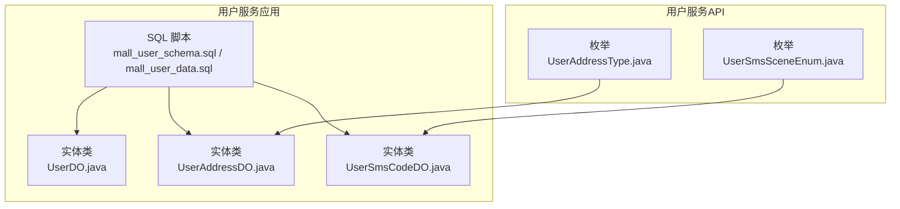
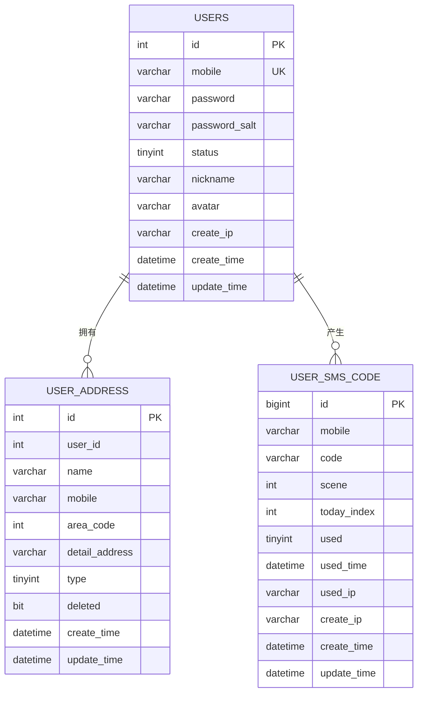
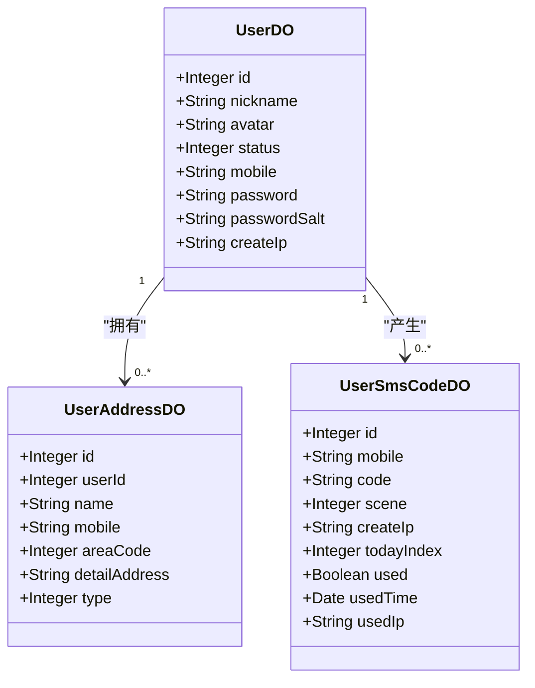
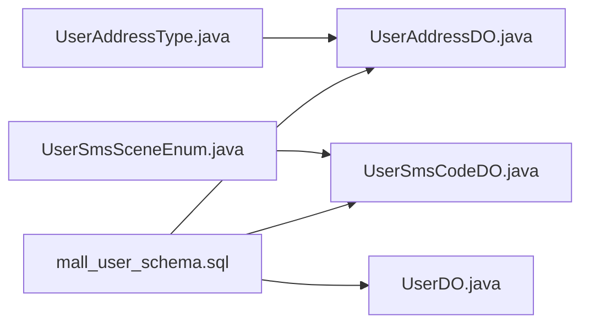

# 用户服务数据库设计

<cite>
**本文引用的文件**
- [mall_user_schema.sql](file://user-service-project/user-service-app/src/main/resources/sql/mall_user_schema.sql)
- [mall_user_data.sql](file://user-service-project/user-service-app/src/main/resources/sql/mall_user_data.sql)
- [UserDO.java](file://user-service-project/user-service-app/src/main/java/cn/iocoder/mall/userservice/dal/mysql/dataobject/user/UserDO.java)
- [UserAddressDO.java](file://user-service-project/user-service-app/src/main/java/cn/iocoder/mall/userservice/dal/mysql/dataobject/address/UserAddressDO.java)
- [UserSmsCodeDO.java](file://user-service-project/user-service-app/src/main/java/cn/iocoder/mall/userservice/dal/mysql/dataobject/sms/UserSmsCodeDO.java)
- [UserAddressType.java](file://user-service-project/user-service-api/src/main/java/cn/iocoder/mall/userservice/enums/address/UserAddressType.java)
- [UserSmsSceneEnum.java](file://user-service-project/user-service-api/src/main/java/cn/iocoder/mall/userservice/enums/sms/UserSmsSceneEnum.java)
</cite>

## 目录
1. [简介](#简介)
2. [项目结构](#项目结构)
3. [核心组件](#核心组件)
4. [架构总览](#架构总览)
5. [详细组件分析](#详细组件分析)
6. [依赖分析](#依赖分析)
7. [性能考虑](#性能考虑)
8. [故障排查指南](#故障排查指南)
9. [结论](#结论)
10. [附录](#附录)

## 简介
本技术文档围绕用户服务模块的数据库设计进行系统化梳理，覆盖用户表(users)、用户地址表(user_address)、短信验证码表(user_sms_code)三张核心表的字段设计、约束与索引策略，并结合实体类与枚举定义，解释用户状态管理、密码加密存储、手机号唯一性约束、地址类型区分、地区编码规范、软删除机制以及短信验证码的场景分类与使用状态追踪等关键设计点。文末提供完整的表结构图与ER关系图、索引设计说明、初始化数据示例与迁移脚本位置。

## 项目结构
用户服务数据库脚本位于应用资源目录中，对应三张核心表的建表与初始化数据；实体类与枚举分别位于应用层与API层，用于映射表结构与业务语义。

图表来源
- [mall_user_schema.sql:1-58](file://user-service-project/user-service-app/src/main/resources/sql/mall_user_schema.sql#L1-L58)
- [UserDO.java:1-58](file://user-service-project/user-service-app/src/main/java/cn/iocoder/mall/userservice/dal/mysql/dataobject/user/UserDO.java#L1-L58)
- [UserAddressDO.java:1-56](file://user-service-project/user-service-app/src/main/java/cn/iocoder/mall/userservice/dal/mysql/dataobject/address/UserAddressDO.java#L1-L56)
- [UserSmsCodeDO.java:1-63](file://user-service-project/user-service-app/src/main/java/cn/iocoder/mall/userservice/dal/mysql/dataobject/sms/UserSmsCodeDO.java#L1-L63)
- [UserAddressType.java:1-40](file://user-service-project/user-service-api/src/main/java/cn/iocoder/mall/userservice/enums/address/UserAddressType.java#L1-L40)
- [UserSmsSceneEnum.java:1-40](file://user-service-project/user-service-api/src/main/java/cn/iocoder/mall/userservice/enums/sms/UserSmsSceneEnum.java#L1-L40)

章节来源
- [mall_user_schema.sql:1-58](file://user-service-project/user-service-app/src/main/resources/sql/mall_user_schema.sql#L1-L58)
- [UserDO.java:1-58](file://user-service-project/user-service-app/src/main/java/cn/iocoder/mall/userservice/dal/mysql/dataobject/user/UserDO.java#L1-L58)
- [UserAddressDO.java:1-56](file://user-service-project/user-service-app/src/main/java/cn/iocoder/mall/userservice/dal/mysql/dataobject/address/UserAddressDO.java#L1-L56)
- [UserSmsCodeDO.java:1-63](file://user-service-project/user-service-app/src/main/java/cn/iocoder/mall/userservice/dal/mysql/dataobject/sms/UserSmsCodeDO.java#L1-L63)
- [UserAddressType.java:1-40](file://user-service-project/user-service-api/src/main/java/cn/iocoder/mall/userservice/enums/address/UserAddressType.java#L1-L40)
- [UserSmsSceneEnum.java:1-40](file://user-service-project/user-service-api/src/main/java/cn/iocoder/mall/userservice/enums/sms/UserSmsSceneEnum.java#L1-L40)

## 核心组件
本节对三张核心表进行字段级解析，涵盖数据类型、约束、索引与业务含义。

- users（用户表）
  - 主键：自增整型 id
  - 唯一索引：mobile（手机号唯一）
  - 关键字段：昵称、头像、状态、手机号、加密密码、密码盐、注册IP、创建/更新时间
  - 设计要点：手机号唯一性保证登录入口唯一；密码采用加盐加密存储；状态字段配合通用状态枚举使用

- user_address（用户地址表）
  - 主键：自增整型 id
  - 索引：user_id（用户维度查询）
  - 关键字段：用户编号、收件人姓名、手机号、地区编码(area_code)、详细地址、地址类型(type)、软删除标记(deleted)
  - 设计要点：地址类型区分默认与普通；软删除便于历史记录保留；地区编码统一管理行政区域

- user_sms_code（短信验证码表）
  - 主键：自增长整型 id
  - 索引：mobile（按手机号检索）
  - 关键字段：手机号、验证码、发送场景(scene)、今日序号(today_index)、使用状态(used)、使用时间/IP、创建/更新时间
  - 设计要点：场景化管理不同业务用途；使用状态与时间用于防重与审计；今日序号支持风控统计

章节来源
- [mall_user_schema.sql:7-20](file://user-service-project/user-service-app/src/main/resources/sql/mall_user_schema.sql#L7-L20)
- [mall_user_schema.sql:44-57](file://user-service-project/user-service-app/src/main/resources/sql/mall_user_schema.sql#L44-L57)
- [mall_user_schema.sql:25-39](file://user-service-project/user-service-app/src/main/resources/sql/mall_user_schema.sql#L25-L39)

## 架构总览
下图展示三张表之间的关系、索引与典型查询路径：

图表来源
- [mall_user_schema.sql:7-20](file://user-service-project/user-service-app/src/main/resources/sql/mall_user_schema.sql#L7-L20)
- [mall_user_schema.sql:44-57](file://user-service-project/user-service-app/src/main/resources/sql/mall_user_schema.sql#L44-L57)
- [mall_user_schema.sql:25-39](file://user-service-project/user-service-app/src/main/resources/sql/mall_user_schema.sql#L25-L39)

## 详细组件分析

### 用户表 users
- 字段设计与约束
  - id：自增主键，作为用户标识
  - mobile：唯一索引，确保手机号唯一性，适合作为登录入口
  - password/password_salt：密码与盐值，配合加盐哈希存储
  - status：用户状态，建议配合通用状态枚举使用
  - nickname/avatar/create_ip：基础资料与来源信息
  - create_time/update_time：标准时间戳字段，便于审计与排序

- 数据类型选择与复杂度
  - 整型主键与唯一索引在查询与连接上具备 O(log n) 的高效性
  - 字符串字段采用合适长度，兼顾业务需求与存储成本

- 索引策略
  - uk_mobile：唯一索引，保障手机号唯一
  - 可根据实际查询模式增加索引（如按昵称、状态等）

- 业务含义
  - 用户身份与认证入口
  - 密码安全与状态控制的关键载体

章节来源
- [mall_user_schema.sql:7-20](file://user-service-project/user-service-app/src/main/resources/sql/mall_user_schema.sql#L7-L20)
- [UserDO.java:1-58](file://user-service-project/user-service-app/src/main/java/cn/iocoder/mall/userservice/dal/mysql/dataobject/user/UserDO.java#L1-L58)

### 用户地址表 user_address
- 字段设计与约束
  - user_id：关联 users.id，一对多关系
  - name/mobile/area_code/detail_address/type：收货信息与类型
  - deleted：软删除位，避免物理删除造成数据不可追溯
  - create_time/update_time：记录变更时间

- 数据类型选择与复杂度
  - 地址类型采用 tinyint，配合枚举映射，占用小且易扩展
  - 地区编码采用整型，便于跨系统统一与范围查询

- 索引策略
  - idx_userId：按用户维度查询地址列表
  - 可按需增加 area_code 或组合索引以优化区域筛选

- 业务含义
  - 默认地址与普通地址的区分，满足“一个用户一个默认地址”的常见业务
  - 软删除便于历史订单地址保留与审计

章节来源
- [mall_user_schema.sql:44-57](file://user-service-project/user-service-app/src/main/resources/sql/mall_user_schema.sql#L44-L57)
- [UserAddressDO.java:1-56](file://user-service-project/user-service-app/src/main/java/cn/iocoder/mall/userservice/dal/mysql/dataobject/address/UserAddressDO.java#L1-L56)
- [UserAddressType.java:1-40](file://user-service-project/user-service-api/src/main/java/cn/iocoder/mall/userservice/enums/address/UserAddressType.java#L1-L40)

### 短信验证码表 user_sms_code
- 字段设计与约束
  - mobile/code：手机号与验证码
  - scene：发送场景，配合枚举区分不同业务用途
  - today_index：当日序号，用于风控统计
  - used/used_time/used_ip：使用状态与审计信息
  - create_ip/create_time/update_time：创建与更新时间

- 数据类型选择与复杂度
  - 验证码通常为短数字串，采用固定长度字符串即可
  - 场景与使用状态采用整型，便于快速过滤与统计

- 索引策略
  - idx_mobile：按手机号检索，支持验证码校验与风控
  - 可按场景(scene)或使用状态(used)建立二级索引以优化查询

- 业务含义
  - 场景化管理：如短信登录、更换手机号等
  - 使用状态与时间：防止重复使用与审计追踪
  - 今日序号：限制单日发送量，支撑风控策略

章节来源
- [mall_user_schema.sql:25-39](file://user-service-project/user-service-app/src/main/resources/sql/mall_user_schema.sql#L25-L39)
- [UserSmsCodeDO.java:1-63](file://user-service-project/user-service-app/src/main/java/cn/iocoder/mall/userservice/dal/mysql/dataobject/sms/UserSmsCodeDO.java#L1-L63)
- [UserSmsSceneEnum.java:1-40](file://user-service-project/user-service-api/src/main/java/cn/iocoder/mall/userservice/enums/sms/UserSmsSceneEnum.java#L1-L40)

### 类与表映射关系

图表来源
- [UserDO.java:1-58](file://user-service-project/user-service-app/src/main/java/cn/iocoder/mall/userservice/dal/mysql/dataobject/user/UserDO.java#L1-L58)
- [UserAddressDO.java:1-56](file://user-service-project/user-service-app/src/main/java/cn/iocoder/mall/userservice/dal/mysql/dataobject/address/UserAddressDO.java#L1-L56)
- [UserSmsCodeDO.java:1-63](file://user-service-project/user-service-app/src/main/java/cn/iocoder/mall/userservice/dal/mysql/dataobject/sms/UserSmsCodeDO.java#L1-L63)

## 依赖分析
- 实体类与表结构的映射关系清晰，字段命名与注释一致
- 枚举与表字段的值域保持一致，确保业务一致性
- 索引与查询路径匹配：users.uk_mobile、user_address.idx_userId、user_sms_code.idx_mobile

图表来源
- [UserAddressType.java:1-40](file://user-service-project/user-service-api/src/main/java/cn/iocoder/mall/userservice/enums/address/UserAddressType.java#L1-L40)
- [UserSmsSceneEnum.java:1-40](file://user-service-project/user-service-api/src/main/java/cn/iocoder/mall/userservice/enums/sms/UserSmsSceneEnum.java#L1-L40)
- [UserDO.java:1-58](file://user-service-project/user-service-app/src/main/java/cn/iocoder/mall/userservice/dal/mysql/dataobject/user/UserDO.java#L1-L58)
- [UserAddressDO.java:1-56](file://user-service-project/user-service-app/src/main/java/cn/iocoder/mall/userservice/dal/mysql/dataobject/address/UserAddressDO.java#L1-L56)
- [UserSmsCodeDO.java:1-63](file://user-service-project/user-service-app/src/main/java/cn/iocoder/mall/userservice/dal/mysql/dataobject/sms/UserSmsCodeDO.java#L1-L63)
- [mall_user_schema.sql:1-58](file://user-service-project/user-service-app/src/main/resources/sql/mall_user_schema.sql#L1-L58)

## 性能考虑
- 索引设计
  - users.uk_mobile：登录与注册校验高频访问
  - user_address.idx_userId：用户地址列表查询
  - user_sms_code.idx_mobile：验证码查询与风控
- 查询优化
  - 按需添加复合索引：如按场景与使用状态联合过滤验证码
  - 控制扫描范围：通过场景与时间窗口限制查询结果集
- 存储与字符集
  - 使用 utf8mb4 与二进制排序规则，兼顾多语言与排序稳定性
- 审计与归档
  - 对于历史验证码与地址可定期归档，降低在线表规模

## 故障排查指南
- 登录失败或重复注册
  - 检查手机号是否已存在（uk_mobile 唯一索引）
  - 核对密码与盐值是否正确匹配
- 验证码无效或重复使用
  - 核对验证码是否已使用(used)、是否在有效期内
  - 检查手机号索引是否生效
- 地址查询异常
  - 确认 user_id 索引是否存在
  - 检查软删除标记是否导致数据不可见

## 结论
本设计以用户表为核心，围绕认证入口、地址管理与短信验证三大场景构建了清晰的表结构与索引策略。通过手机号唯一性、密码加盐存储、地址类型与软删除、验证码场景化与使用状态追踪等设计，既满足当前业务需求，又为后续扩展与性能优化预留空间。

## 附录

### 表结构与索引说明
- users
  - 主键：id
  - 唯一索引：mobile
  - 典型查询：按手机号登录、按状态筛选
- user_address
  - 主键：id
  - 索引：user_id
  - 典型查询：按用户查询地址列表、按默认地址筛选
- user_sms_code
  - 主键：id
  - 索引：mobile
  - 典型查询：按手机号与场景查询验证码、按使用状态统计

章节来源
- [mall_user_schema.sql:7-20](file://user-service-project/user-service-app/src/main/resources/sql/mall_user_schema.sql#L7-L20)
- [mall_user_schema.sql:44-57](file://user-service-project/user-service-app/src/main/resources/sql/mall_user_schema.sql#L44-L57)
- [mall_user_schema.sql:25-39](file://user-service-project/user-service-app/src/main/resources/sql/mall_user_schema.sql#L25-L39)

### 初始化数据示例
- users 初始化样例
  - 字段：id、nickname、avatar、status、mobile、password、password_salt、create_ip、create_time、update_time
  - 示例位置：[mall_user_data.sql:4-4](file://user-service-project/user-service-app/src/main/resources/sql/mall_user_data.sql#L4-L4)

章节来源
- [mall_user_data.sql:1-16](file://user-service-project/user-service-app/src/main/resources/sql/mall_user_data.sql#L1-L16)

### 迁移脚本位置
- 建表脚本：[mall_user_schema.sql:1-58](file://user-service-project/user-service-app/src/main/resources/sql/mall_user_schema.sql#L1-L58)
- 初始化数据：[mall_user_data.sql:1-16](file://user-service-project/user-service-app/src/main/resources/sql/mall_user_data.sql#L1-L16)