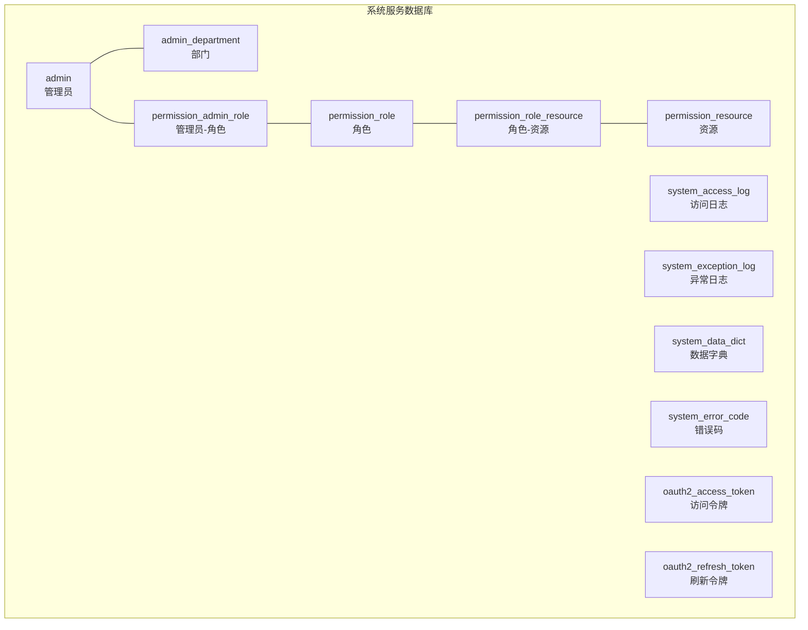
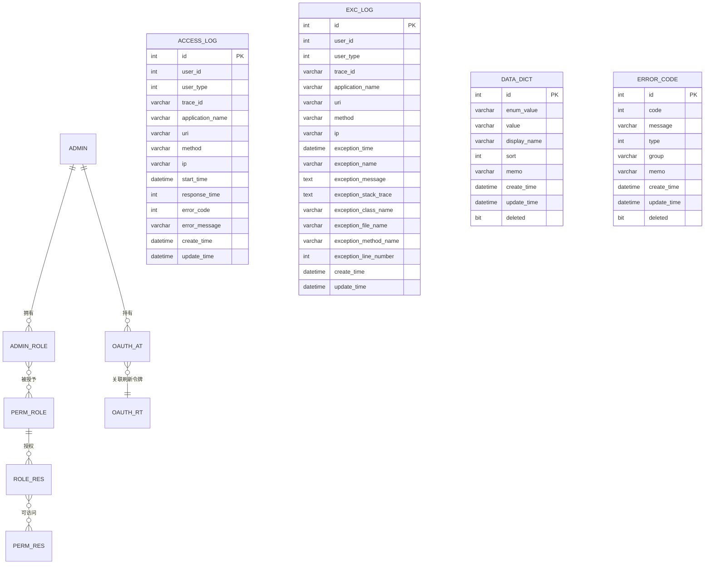
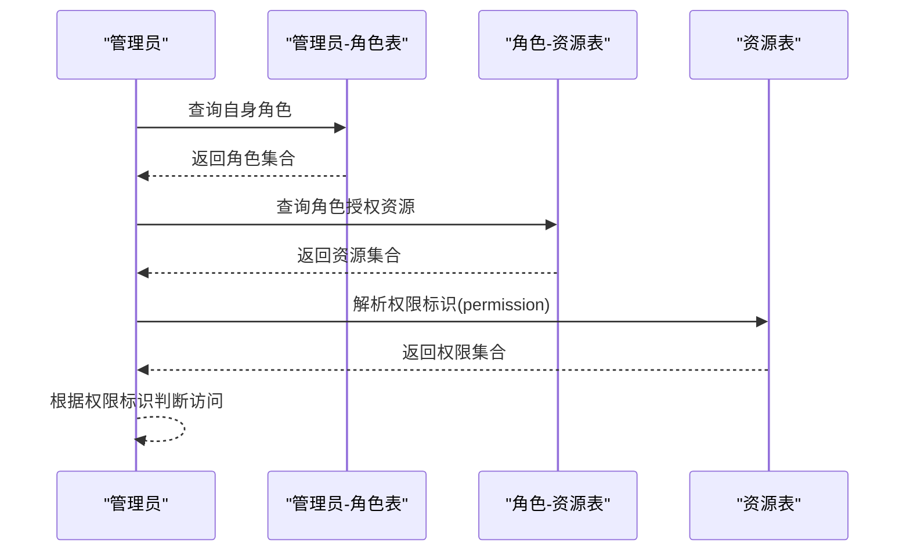
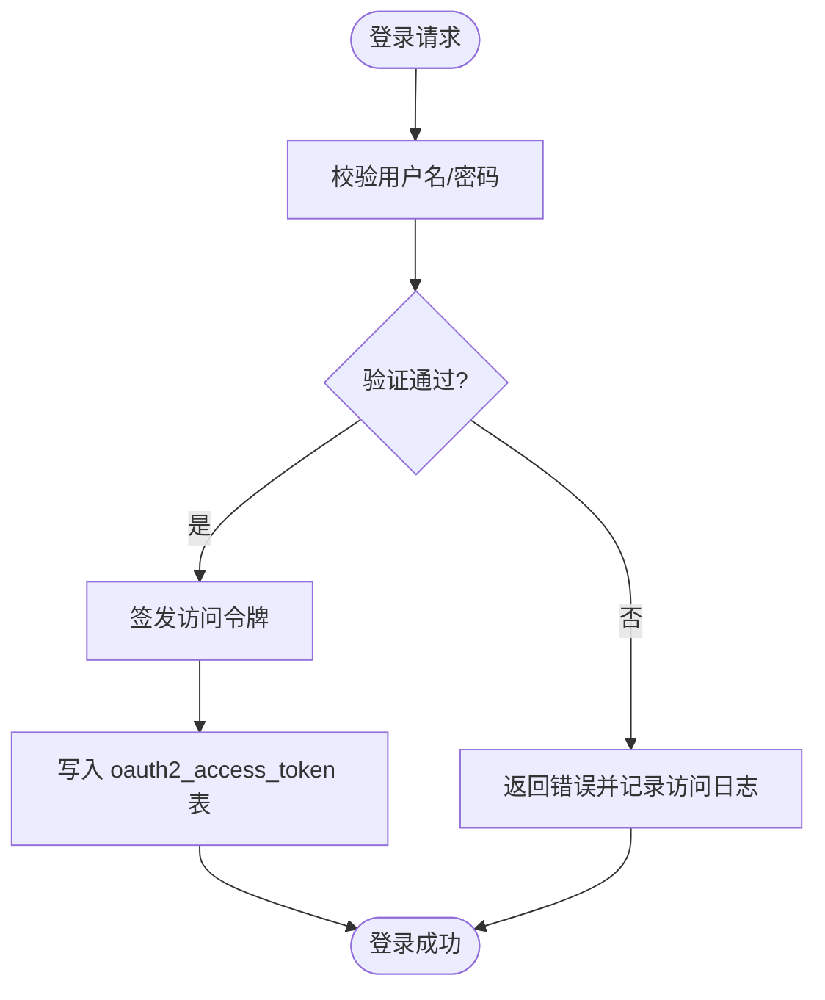
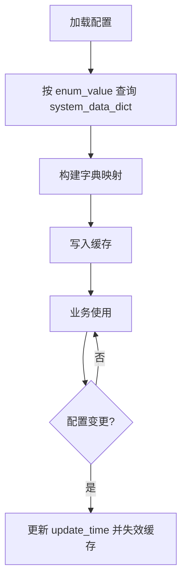
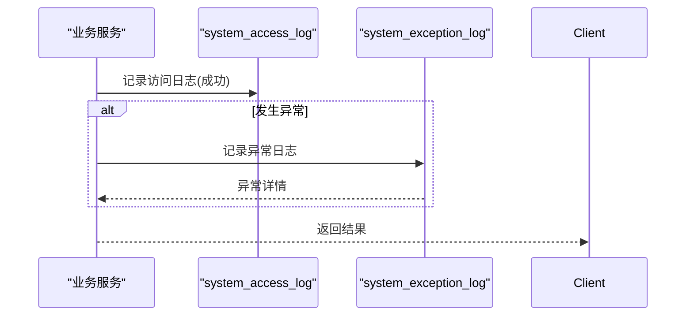
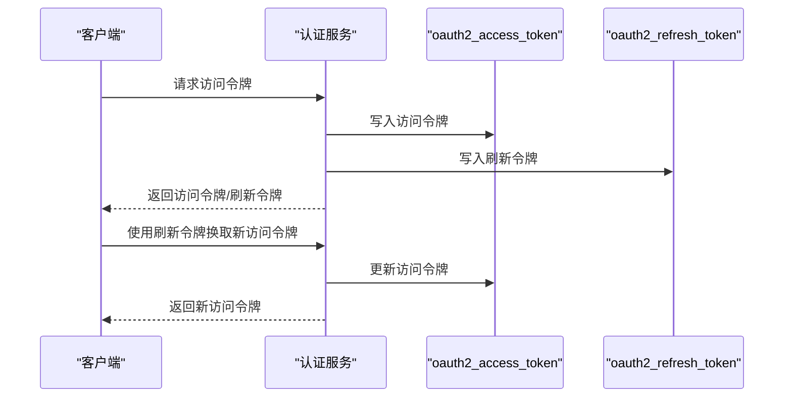
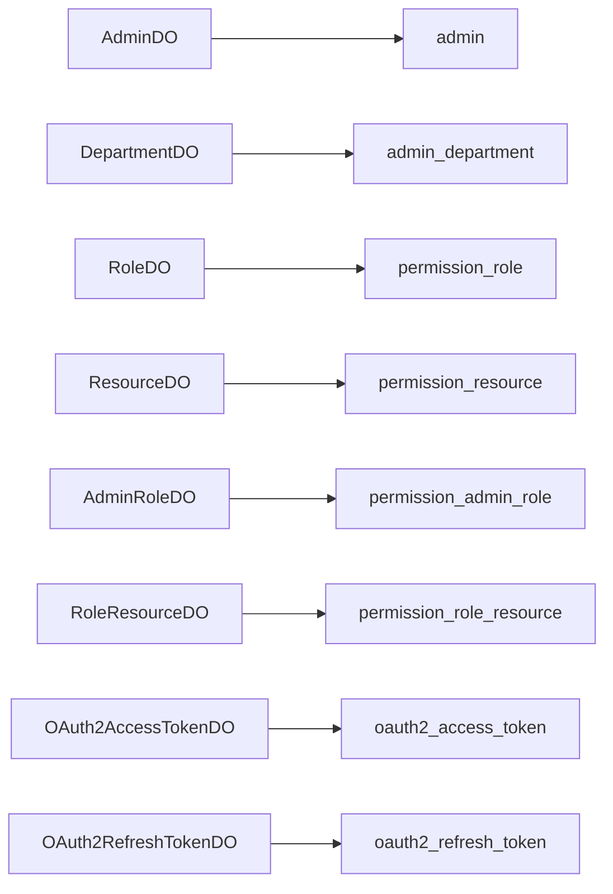

# 系统服务数据库设计

<cite>
**本文引用的文件**
- [mall_system_schema.sql](file://system-service-project/system-service-app/src/main/resources/sql/mall_system_schema.sql)
- [mall_system_data.sql](file://system-service-project/system-service-app/src/main/resources/sql/mall_system_data.sql)
- [AdminDO.java](file://system-service-project/system-service-app/src/main/java/cn/iocoder/mall/systemservice/dal/mysql/dataobject/admin/AdminDO.java)
- [DepartmentDO.java](file://system-service-project/system-service-app/src/main/java/cn/iocoder/mall/systemservice/dal/mysql/dataobject/admin/DepartmentDO.java)
- [ResourceDO.java](file://system-service-project/system-service-app/src/main/java/cn/iocoder/mall/systemservice/dal/mysql/dataobject/permission/ResourceDO.java)
- [RoleDO.java](file://system-service-project/system-service-app/src/main/java/cn/iocoder/mall/systemservice/dal/mysql/dataobject/permission/RoleDO.java)
- [AdminRoleDO.java](file://system-service-project/system-service-app/src/main/java/cn/iocoder/mall/systemservice/dal/mysql/dataobject/permission/AdminRoleDO.java)
- [RoleResourceDO.java](file://system-service-project/system-service-app/src/main/java/cn/iocoder/mall/systemservice/dal/mysql/dataobject/permission/RoleResourceDO.java)
- [OAuth2AccessTokenDO.java](file://system-service-project/system-service-app/src/main/java/cn/iocoder/mall/systemservice/dal/mysql/dataobject/oauth/OAuth2AccessTokenDO.java)
- [OAuth2RefreshTokenDO.java](file://system-service-project/system-service-app/src/main/java/cn/iocoder/mall/systemservice/dal/mysql/dataobject/oauth/OAuth2RefreshTokenDO.java)
</cite>

## 目录
1. [简介](#简介)
2. [项目结构](#项目结构)
3. [核心组件](#核心组件)
4. [架构总览](#架构总览)
5. [详细组件分析](#详细组件分析)
6. [依赖分析](#依赖分析)
7. [性能考虑](#性能考虑)
8. [故障排查指南](#故障排查指南)
9. [结论](#结论)
10. [附录](#附录)

## 简介
本文件面向系统服务模块的数据库设计，围绕管理员、部门、角色、权限资源、数据字典、操作日志等核心系统管理数据结构，系统化阐述以下主题：
- RBAC 模型的数据库实现：角色、资源、管理员三者之间的关联与继承关系
- 管理员账号管理：安全字段、登录审计、会话管理（含 OAuth2）
- 数据字典：层级结构、动态配置与缓存同步策略
- 操作日志：访问日志、异常日志、审计日志的存储与查询优化
- OAuth2 认证：令牌管理、刷新机制、权限范围的数据库设计
- 系统配置：参数配置、版本管理、热更新的数据结构设计
- 系统监控：性能指标、资源使用、健康检查的数据库实现思路

## 项目结构
系统服务模块的数据库脚本位于 system-service-app 的 resources/sql 目录，包含表结构与初始数据；对应的 Java 实体类位于 system-service-app 的 dal.mysql.dataobject.* 包中，用于 MyBatis-Plus 映射。

图表来源
- [mall_system_schema.sql:4-228](file://system-service-project/system-service-app/src/main/resources/sql/mall_system_schema.sql#L4-L228)

章节来源
- [mall_system_schema.sql:1-228](file://system-service-project/system-service-app/src/main/resources/sql/mall_system_schema.sql#L1-L228)

## 核心组件
本节从数据库层面梳理关键表及其职责，并结合实体类映射关系说明字段含义与约束。

- 管理员表（admin）
  - 主键：id
  - 唯一索引：username
  - 安全字段：password、password_salt
  - 关联：department_id -> admin_department.id
  - 审计：create_admin_id、create_ip、create_time、update_time
- 部门表（admin_department）
  - 层级结构：pid（父级部门）、sort（排序）
  - 软删除：deleted（位图）
- 角色表（permission_role）
  - 角色类型：type（内置/自定义）
  - 角色编码：code（唯一性由业务保证）
- 资源表（permission_resource）
  - 资源类型：type（菜单/按钮）
  - 权限标识：permission（如 system:resource:create）
  - 前端属性：route、icon、view
  - 层级：pid（父子资源）
- 管理员-角色关联表（permission_admin_role）
  - 多对多：admin.id <-> role.id
  - 软删除：deleted
- 角色-资源关联表（permission_role_resource）
  - 多对多：role.id <-> resource.id
  - 软删除：deleted
- OAuth2 访问令牌（oauth2_access_token）
  - 主键：id（访问令牌字符串）
  - 索引：idx_userId、idx_refreshToken
  - 关联：refresh_token -> oauth2_refresh_token.id
  - 过期：expires_time
- OAuth2 刷新令牌（oauth2_refresh_token）
  - 主键：id（刷新令牌字符串）
  - 索引：idx_userId
  - 过期：expires_time
- 访问日志（system_access_log）
  - 请求维度：uri、method、user_agent、ip、start_time、response_time
  - 错误维度：error_code、error_message
  - 审计维度：trace_id、application_name
- 异常日志（system_exception_log）
  - 异常维度：exception_name、exception_message、exception_stack_trace
  - 审计维度：trace_id、application_name、user_id、user_type
- 数据字典（system_data_dict）
  - 分组：enum_value + value（组合唯一）
  - 展示：display_name、sort、memo
  - 软删除：deleted
- 错误码（system_error_code）
  - 结构：code、message、type、group、memo
  - 软删除：deleted

章节来源
- [mall_system_schema.sql:7-228](file://system-service-project/system-service-app/src/main/resources/sql/mall_system_schema.sql#L7-L228)
- [AdminDO.java:1-71](file://system-service-project/system-service-app/src/main/java/cn/iocoder/mall/systemservice/dal/mysql/dataobject/admin/AdminDO.java#L1-L71)
- [DepartmentDO.java:1-38](file://system-service-project/system-service-app/src/main/java/cn/iocoder/mall/systemservice/dal/mysql/dataobject/admin/DepartmentDO.java#L1-L38)
- [ResourceDO.java:1-83](file://system-service-project/system-service-app/src/main/java/cn/iocoder/mall/systemservice/dal/mysql/dataobject/permission/ResourceDO.java#L1-L83)
- [RoleDO.java:1-46](file://system-service-project/system-service-app/src/main/java/cn/iocoder/mall/systemservice/dal/mysql/dataobject/permission/RoleDO.java#L1-L46)
- [AdminRoleDO.java:1-37](file://system-service-project/system-service-app/src/main/java/cn/iocoder/mall/systemservice/dal/mysql/dataobject/permission/AdminRoleDO.java#L1-L37)
- [RoleResourceDO.java:1-32](file://system-service-project/system-service-app/src/main/java/cn/iocoder/mall/systemservice/dal/mysql/dataobject/permission/RoleResourceDO.java#L1-L32)
- [OAuth2AccessTokenDO.java:1-57](file://system-service-project/system-service-app/src/main/java/cn/iocoder/mall/systemservice/dal/mysql/dataobject/oauth/OAuth2AccessTokenDO.java#L1-L57)
- [OAuth2RefreshTokenDO.java:1-50](file://system-service-project/system-service-app/src/main/java/cn/iocoder/mall/systemservice/dal/mysql/dataobject/oauth/OAuth2RefreshTokenDO.java#L1-L50)

## 架构总览
系统服务数据库采用“中心化权限控制 + 会话与日志”的整体设计：
- 权限控制：RBAC 模型通过资源与角色解耦，管理员通过角色间接获得资源权限
- 会话与认证：OAuth2 访问/刷新令牌独立表，支持过期与撤销
- 日志体系：访问日志与异常日志分离存储，便于查询与审计
- 配置与字典：数据字典与错误码表支撑动态配置与统一错误码管理

图表来源
- [mall_system_schema.sql:4-228](file://system-service-project/system-service-app/src/main/resources/sql/mall_system_schema.sql#L4-L228)

## 详细组件分析

### RBAC 权限模型与数据设计
- 角色与资源
  - 角色表（permission_role）定义角色与类型
  - 资源表（permission_resource）定义菜单/按钮与权限标识
  - 角色-资源关联表（permission_role_resource）建立授权关系
- 管理员与角色
  - 管理员-角色关联表（permission_admin_role）建立多对多关系
- 权限继承与动态授权
  - 通过角色-资源关联实现权限继承
  - 动态授权通过新增/删除角色-资源关联实现
- 查询路径
  - 管理员权限 = SELECT r.permission FROM permission_resource r JOIN permission_role_resource rr ON r.id = rr.resource_id JOIN permission_admin_role ar ON rr.role_id = ar.role_id WHERE ar.admin_id = ? AND r.deleted = 0 AND rr.deleted = 0 AND ar.deleted = 0

图表来源
- [mall_system_schema.sql:77-139](file://system-service-project/system-service-app/src/main/resources/sql/mall_system_schema.sql#L77-L139)
- [AdminRoleDO.java:1-37](file://system-service-project/system-service-app/src/main/java/cn/iocoder/mall/systemservice/dal/mysql/dataobject/permission/AdminRoleDO.java#L1-L37)
- [RoleResourceDO.java:1-32](file://system-service-project/system-service-app/src/main/java/cn/iocoder/mall/systemservice/dal/mysql/dataobject/permission/RoleResourceDO.java#L1-L32)
- [ResourceDO.java:1-83](file://system-service-project/system-service-app/src/main/java/cn/iocoder/mall/systemservice/dal/mysql/dataobject/permission/ResourceDO.java#L1-L83)

章节来源
- [mall_system_schema.sql:77-139](file://system-service-project/system-service-app/src/main/resources/sql/mall_system_schema.sql#L77-L139)
- [AdminRoleDO.java:1-37](file://system-service-project/system-service-app/src/main/java/cn/iocoder/mall/systemservice/dal/mysql/dataobject/permission/AdminRoleDO.java#L1-L37)
- [RoleResourceDO.java:1-32](file://system-service-project/system-service-app/src/main/java/cn/iocoder/mall/systemservice/dal/mysql/dataobject/permission/RoleResourceDO.java#L1-L32)
- [ResourceDO.java:1-83](file://system-service-project/system-service-app/src/main/java/cn/iocoder/mall/systemservice/dal/mysql/dataobject/permission/ResourceDO.java#L1-L83)

### 管理员账号管理与登录审计
- 安全字段
  - password：存储加密后的密码
  - password_salt：密码盐，增强抗彩虹表能力
- 登录审计
  - create_ip：注册/创建时的 IP
  - create_time/update_time：审计时间线
- 会话管理（OAuth2）
  - oauth2_access_token：访问令牌、过期时间、关联刷新令牌
  - oauth2_refresh_token：刷新令牌、过期时间
  - 通过索引 idx_userId、idx_refreshToken 支持快速检索与撤销

图表来源
- [mall_system_schema.sql:41-74](file://system-service-project/system-service-app/src/main/resources/sql/mall_system_schema.sql#L41-L74)
- [AdminDO.java:1-71](file://system-service-project/system-service-app/src/main/java/cn/iocoder/mall/systemservice/dal/mysql/dataobject/admin/AdminDO.java#L1-L71)
- [OAuth2AccessTokenDO.java:1-57](file://system-service-project/system-service-app/src/main/java/cn/iocoder/mall/systemservice/dal/mysql/dataobject/oauth/OAuth2AccessTokenDO.java#L1-L57)
- [OAuth2RefreshTokenDO.java:1-50](file://system-service-project/system-service-app/src/main/java/cn/iocoder/mall/systemservice/dal/mysql/dataobject/oauth/OAuth2RefreshTokenDO.java#L1-L50)

章节来源
- [mall_system_schema.sql:41-74](file://system-service-project/system-service-app/src/main/resources/sql/mall_system_schema.sql#L41-L74)
- [AdminDO.java:1-71](file://system-service-project/system-service-app/src/main/java/cn/iocoder/mall/systemservice/dal/mysql/dataobject/admin/AdminDO.java#L1-L71)
- [OAuth2AccessTokenDO.java:1-57](file://system-service-project/system-service-app/src/main/java/cn/iocoder/mall/systemservice/dal/mysql/dataobject/oauth/OAuth2AccessTokenDO.java#L1-L57)
- [OAuth2RefreshTokenDO.java:1-50](file://system-service-project/system-service-app/src/main/java/cn/iocoder/mall/systemservice/dal/mysql/dataobject/oauth/OAuth2RefreshTokenDO.java#L1-L50)

### 数据字典与动态配置
- 层级结构设计
  - 通过 enum_value + value 唯一标识一个字典项
  - sort 控制展示顺序
- 动态配置管理
  - 业务层按 enum_value 分组读取，构建运行时配置
- 缓存同步策略
  - 建议：在配置变更时更新 system_data_dict 的 update_time，并触发缓存失效/刷新
  - 可选：引入版本号字段以支持客户端版本对比与热更新

图表来源
- [mall_system_schema.sql:166-180](file://system-service-project/system-service-app/src/main/resources/sql/mall_system_schema.sql#L166-L180)
- [mall_system_data.sql:134-210](file://system-service-project/system-service-app/src/main/resources/sql/mall_system_data.sql#L134-L210)

章节来源
- [mall_system_schema.sql:166-180](file://system-service-project/system-service-app/src/main/resources/sql/mall_system_schema.sql#L166-L180)
- [mall_system_data.sql:134-210](file://system-service-project/system-service-app/src/main/resources/sql/mall_system_data.sql#L134-L210)

### 操作日志与审计
- 访问日志（system_access_log）
  - 记录请求维度、错误维度与审计维度
  - 支持按 uri、method、user_id、start_time 等条件查询
- 异常日志（system_exception_log）
  - 记录异常堆栈与根因，便于定位问题
  - 通过 trace_id 关联访问日志与链路日志
- 审计日志
  - 建议：在业务关键操作处插入审计记录，字段包含操作人、操作类型、影响范围、时间戳等

图表来源
- [mall_system_schema.sql:142-225](file://system-service-project/system-service-app/src/main/resources/sql/mall_system_schema.sql#L142-L225)

章节来源
- [mall_system_schema.sql:142-225](file://system-service-project/system-service-app/src/main/resources/sql/mall_system_schema.sql#L142-L225)

### OAuth2 认证数据模型
- 令牌管理
  - 访问令牌表：主键为令牌字符串，包含过期时间与创建 IP
  - 刷新令牌表：主键为令牌字符串，与访问令牌建立关联
- 刷新机制
  - 使用 refresh_token 生成新的访问令牌，旧令牌可撤销
- 权限范围
  - 通过资源表的权限标识（permission）与角色授权共同决定访问范围

图表来源
- [mall_system_schema.sql:41-74](file://system-service-project/system-service-app/src/main/resources/sql/mall_system_schema.sql#L41-L74)
- [OAuth2AccessTokenDO.java:1-57](file://system-service-project/system-service-app/src/main/java/cn/iocoder/mall/systemservice/dal/mysql/dataobject/oauth/OAuth2AccessTokenDO.java#L1-L57)
- [OAuth2RefreshTokenDO.java:1-50](file://system-service-project/system-service-app/src/main/java/cn/iocoder/mall/systemservice/dal/mysql/dataobject/oauth/OAuth2RefreshTokenDO.java#L1-L50)

章节来源
- [mall_system_schema.sql:41-74](file://system-service-project/system-service-app/src/main/resources/sql/mall_system_schema.sql#L41-L74)
- [OAuth2AccessTokenDO.java:1-57](file://system-service-project/system-service-app/src/main/java/cn/iocoder/mall/systemservice/dal/mysql/dataobject/oauth/OAuth2AccessTokenDO.java#L1-L57)
- [OAuth2RefreshTokenDO.java:1-50](file://system-service-project/system-service-app/src/main/java/cn/iocoder/mall/systemservice/dal/mysql/dataobject/oauth/OAuth2RefreshTokenDO.java#L1-L50)

### 系统配置与热更新
- 参数配置
  - 建议：引入 system_config 表存储系统参数，包含 key、value、version、memo 等
- 版本管理
  - version 字段用于客户端与服务端版本比对，支持灰度与回滚
- 热更新
  - 服务端监听配置变更事件，更新内存缓存并广播变更
  - 客户端定期拉取最新配置或接收推送

（本节为概念性建议，不直接对应现有代码文件）

### 系统监控数据存储
- 性能指标
  - 建议：引入 metrics_* 表存储指标（如 QPS、P95、错误率），按时间窗口聚合
- 资源使用
  - 建议：引入 resource_usage_* 表记录 CPU、内存、磁盘、连接数等
- 健康检查
  - 建议：引入 health_check_* 表记录各组件健康状态与告警信息

（本节为概念性建议，不直接对应现有代码文件）

## 依赖分析
- 实体类与表的映射关系
  - AdminDO -> admin
  - DepartmentDO -> admin_department
  - RoleDO -> permission_role
  - ResourceDO -> permission_resource
  - AdminRoleDO -> permission_admin_role
  - RoleResourceDO -> permission_role_resource
  - OAuth2AccessTokenDO -> oauth2_access_token
  - OAuth2RefreshTokenDO -> oauth2_refresh_token
- 外键与索引
  - admin.department_id -> admin_department.id
  - permission_admin_role.admin_id -> admin.id
  - permission_admin_role.role_id -> permission_role.id
  - permission_role_resource.role_id -> permission_role.id
  - permission_role_resource.resource_id -> permission_resource.id
  - oauth2_access_token.refresh_token -> oauth2_refresh_token.id
  - oauth2_access_token.idx_userId、oauth2_access_token.idx_refreshToken
  - oauth2_refresh_token.idx_userId

图表来源
- [AdminDO.java:1-71](file://system-service-project/system-service-app/src/main/java/cn/iocoder/mall/systemservice/dal/mysql/dataobject/admin/AdminDO.java#L1-L71)
- [DepartmentDO.java:1-38](file://system-service-project/system-service-app/src/main/java/cn/iocoder/mall/systemservice/dal/mysql/dataobject/admin/DepartmentDO.java#L1-L38)
- [RoleDO.java:1-46](file://system-service-project/system-service-app/src/main/java/cn/iocoder/mall/systemservice/dal/mysql/dataobject/permission/RoleDO.java#L1-L46)
- [ResourceDO.java:1-83](file://system-service-project/system-service-app/src/main/java/cn/iocoder/mall/systemservice/dal/mysql/dataobject/permission/ResourceDO.java#L1-L83)
- [AdminRoleDO.java:1-37](file://system-service-project/system-service-app/src/main/java/cn/iocoder/mall/systemservice/dal/mysql/dataobject/permission/AdminRoleDO.java#L1-L37)
- [RoleResourceDO.java:1-32](file://system-service-project/system-service-app/src/main/java/cn/iocoder/mall/systemservice/dal/mysql/dataobject/permission/RoleResourceDO.java#L1-L32)
- [OAuth2AccessTokenDO.java:1-57](file://system-service-project/system-service-app/src/main/java/cn/iocoder/mall/systemservice/dal/mysql/dataobject/oauth/OAuth2AccessTokenDO.java#L1-L57)
- [OAuth2RefreshTokenDO.java:1-50](file://system-service-project/system-service-app/src/main/java/cn/iocoder/mall/systemservice/dal/mysql/dataobject/oauth/OAuth2RefreshTokenDO.java#L1-L50)

章节来源
- [AdminDO.java:1-71](file://system-service-project/system-service-app/src/main/java/cn/iocoder/mall/systemservice/dal/mysql/dataobject/admin/AdminDO.java#L1-L71)
- [DepartmentDO.java:1-38](file://system-service-project/system-service-app/src/main/java/cn/iocoder/mall/systemservice/dal/mysql/dataobject/admin/DepartmentDO.java#L1-L38)
- [RoleDO.java:1-46](file://system-service-project/system-service-app/src/main/java/cn/iocoder/mall/systemservice/dal/mysql/dataobject/permission/RoleDO.java#L1-L46)
- [ResourceDO.java:1-83](file://system-service-project/system-service-app/src/main/java/cn/iocoder/mall/systemservice/dal/mysql/dataobject/permission/ResourceDO.java#L1-L83)
- [AdminRoleDO.java:1-37](file://system-service-project/system-service-app/src/main/java/cn/iocoder/mall/systemservice/dal/mysql/dataobject/permission/AdminRoleDO.java#L1-L37)
- [RoleResourceDO.java:1-32](file://system-service-project/system-service-app/src/main/java/cn/iocoder/mall/systemservice/dal/mysql/dataobject/permission/RoleResourceDO.java#L1-L32)
- [OAuth2AccessTokenDO.java:1-57](file://system-service-project/system-service-app/src/main/java/cn/iocoder/mall/systemservice/dal/mysql/dataobject/oauth/OAuth2AccessTokenDO.java#L1-L57)
- [OAuth2RefreshTokenDO.java:1-50](file://system-service-project/system-service-app/src/main/java/cn/iocoder/mall/systemservice/dal/mysql/dataobject/oauth/OAuth2RefreshTokenDO.java#L1-L50)

## 性能考虑
- 索引设计
  - admin.username（唯一索引）
  - oauth2_access_token.idx_userId、idx_refreshToken
  - oauth2_refresh_token.idx_userId
  - permission_resource.pid（层级查询）
- 查询优化
  - 权限查询尽量走角色-资源关联表，避免跨表全量扫描
  - 日志表按天/周分区，限制查询时间范围
- 写入优化
  - 批量插入数据字典与错误码
  - 令牌写入与过期清理异步化

（本节提供通用指导，不直接分析具体文件）

## 故障排查指南
- 权限不足
  - 检查管理员是否绑定角色、角色是否授权资源
  - 核对资源类型（菜单/按钮）与权限标识（permission）
- 会话异常
  - 核对访问令牌是否过期、刷新令牌是否有效
  - 检查 idx_userId、idx_refreshToken 是否命中
- 日志定位
  - 使用 trace_id 关联访问日志与异常日志
  - 按 uri、method、user_id、start_time 精确查询

章节来源
- [mall_system_schema.sql:41-225](file://system-service-project/system-service-app/src/main/resources/sql/mall_system_schema.sql#L41-L225)

## 结论
本数据库设计方案以 RBAC 为核心，结合 OAuth2 会话管理与完善的日志体系，满足系统管理场景下的权限控制、审计与运维需求。通过数据字典与错误码表支撑动态配置与统一错误码管理。建议后续补充系统配置与监控数据表，完善热更新与健康检查能力。

## 附录
- 初始化数据参考
  - 管理员、部门、角色、资源、数据字典、错误码等初始化数据位于 mall_system_data.sql

章节来源
- [mall_system_data.sql:1-218](file://system-service-project/system-service-app/src/main/resources/sql/mall_system_data.sql#L1-L218)