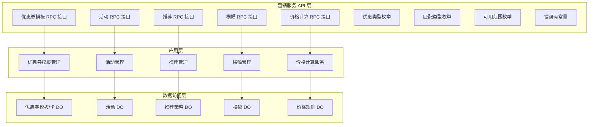
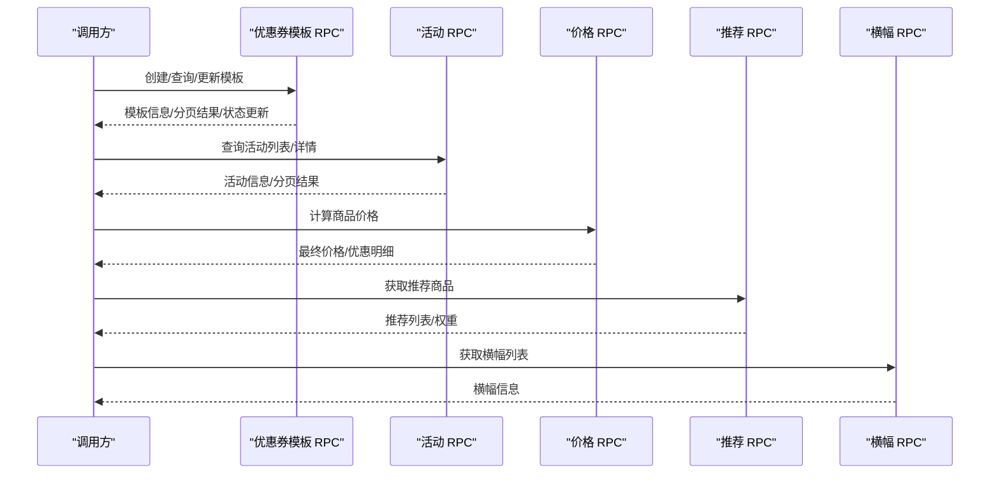
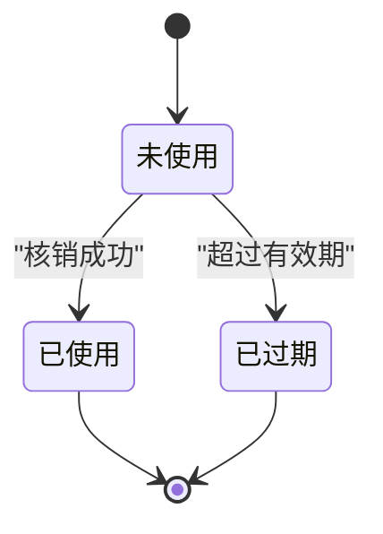
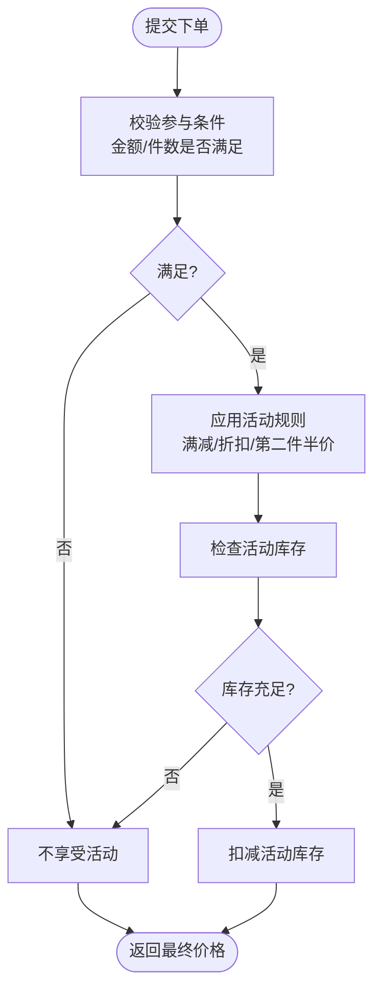
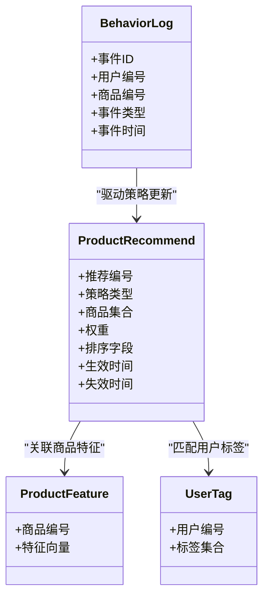
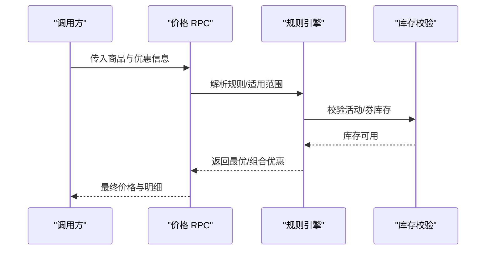
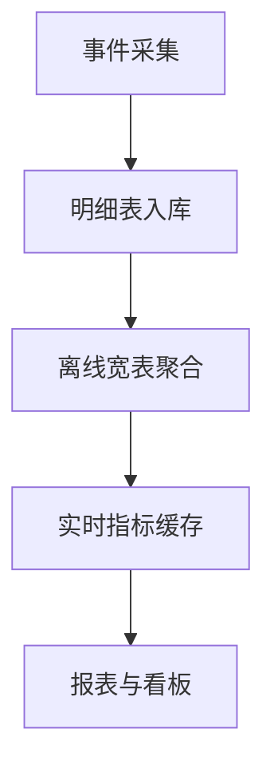
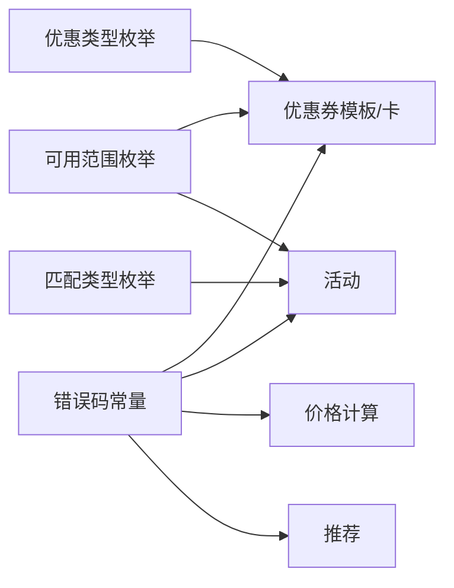

# 营销服务数据库设计

<cite>
**本文引用的文件**
- [PreferentialTypeEnum.java](file://promotion-service-project/promotion-service-api/src/main/java/cn/iocoder/mall/promotion/api/enums/PreferentialTypeEnum.java)
- [MeetTypeEnum.java](file://promotion-service-project/promotion-service-api/src/main/java/cn/iocoder/mall/promotion/api/enums/MeetTypeEnum.java)
- [RangeTypeEnum.java](file://promotion-service-project/promotion-service-api/src/main/java/cn/iocoder/mall/promotion/api/enums/RangeTypeEnum.java)
- [PromotionErrorCodeConstants.java](file://promotion-service-project/promotion-service-api/src/main/java/cn/iocoder/mall/promotion/api/enums/PromotionErrorCodeConstants.java)
- [CouponTemplateRpc.java](file://promotion-service-project/promotion-service-api/src/main/java/cn/iocoder/mall/promotion/api/rpc/coupon/CouponTemplateRpc.java)
- [PriceRpc.java](file://promotion-service-project/promotion-service-api/src/main/java/cn/iocoder/mall/promotion/api/rpc/price/PriceRpc.java)
- [PromotionActivityRpc.java](file://promotion-service-project/promotion-service-api/src/main/java/cn/iocoder/mall/promotion/api/rpc/activity/PromotionActivityRpc.java)
- [ProductRecommendRpc.java](file://promotion-service-project/promotion-service-api/src/main/java/cn/iocoder/mall/promotion/api/rpc/recommend/ProductRecommendRpc.java)
- [BannerRpc.java](file://promotion-service-project/promotion-service-api/src/main/java/cn/iocoder/mall/promotion/api/rpc/banner/BannerRpc.java)
</cite>

## 目录
1. [引言](#引言)
2. [项目结构](#项目结构)
3. [核心组件](#核心组件)
4. [架构总览](#架构总览)
5. [详细组件分析](#详细组件分析)
6. [依赖分析](#依赖分析)
7. [性能考虑](#性能考虑)
8. [故障排查指南](#故障排查指南)
9. [结论](#结论)
10. [附录](#附录)

## 引言
本技术文档聚焦于营销服务模块的数据库设计与数据模型，围绕优惠券模板、优惠券卡、活动、推荐、价格计算等核心能力，系统阐述以下主题：
- 优惠券生命周期管理：创建、发放、使用、过期的完整状态流转设计
- 营销活动的数据模型：活动类型、参与条件、奖励规则、时间限制的灵活配置
- 商品推荐算法的数据支撑：推荐策略、用户画像、行为追踪的数据存储设计
- 价格计算引擎的数据模型：满减规则、折扣策略、组合优惠的数据库实现
- 营销效果统计：点击率、转化率、ROI分析的指标存储方案
- A/B测试、个性化推荐、智能定价的数据结构设计
- 实时计算、离线分析、数据挖掘的数据库优化策略

## 项目结构
营销服务模块位于 promotion-service-project 中，采用分层架构：
- API 层：定义 RPC 接口与枚举常量，统一对外暴露能力
- 应用层：实现业务逻辑、数据访问与服务编排
- 数据访问层：基于 MyBatis Plus 的数据对象与 Mapper 映射
- 配置层：异步任务与数据库连接配置

图表来源
- [CouponTemplateRpc.java:1-58](file://promotion-service-project/promotion-service-api/src/main/java/cn/iocoder/mall/promotion/api/rpc/coupon/CouponTemplateRpc.java#L1-L58)
- [PriceRpc.java:1-15](file://promotion-service-project/promotion-service-api/src/main/java/cn/iocoder/mall/promotion/api/rpc/price/PriceRpc.java#L1-L15)
- [PromotionActivityRpc.java](file://promotion-service-project/promotion-service-api/src/main/java/cn/iocoder/mall/promotion/api/rpc/activity/PromotionActivityRpc.java)
- [ProductRecommendRpc.java](file://promotion-service-project/promotion-service-api/src/main/java/cn/iocoder/mall/promotion/api/rpc/recommend/ProductRecommendRpc.java)
- [BannerRpc.java](file://promotion-service-project/promotion-service-api/src/main/java/cn/iocoder/mall/promotion/api/rpc/banner/BannerRpc.java)

章节来源
- [CouponTemplateRpc.java:1-58](file://promotion-service-project/promotion-service-api/src/main/java/cn/iocoder/mall/promotion/api/rpc/coupon/CouponTemplateRpc.java#L1-L58)
- [PriceRpc.java:1-15](file://promotion-service-project/promotion-service-api/src/main/java/cn/iocoder/mall/promotion/api/rpc/price/PriceRpc.java#L1-L15)

## 核心组件
本节从数据模型角度梳理核心组件，并给出数据库设计要点与约束。

- 优惠券模板表（CouponTemplate）
  - 设计要点：模板类型（卡券/优惠码）、有效期类型（固定时间段/领取后N天）、可使用范围（全商品/部分商品/部分分类）、优惠类型（减价/打折）、门槛金额、折扣参数、总量与剩余量、状态（启用/停用）
  - 关键字段：模板编号、模板名称、模板类型、有效期类型、开始/结束时间、可使用范围类型、适用商品/分类集合、优惠类型、门槛金额、优惠数值、总量、剩余量、状态、创建/更新时间
  - 约束：总量不可回退；剩余量需与发放记录一致；状态变更需幂等校验

- 优惠券卡表（CouponCard）
  - 设计要点：卡券唯一标识、所属用户、模板关联、领取方式（主动领取/系统发放）、使用状态（未使用/已使用/已过期/已转赠）、使用订单号、核销时间、过期时间
  - 关键字段：卡券编号、模板编号、用户编号、卡券码、领取方式、使用状态、订单编号、核销时间、过期时间、创建/更新时间
  - 约束：同一用户对同一模板的领取次数上限；使用前校验状态与有效期；使用后原子性更新状态与订单号

- 营销活动表（PromotionActivity）
  - 设计要点：活动类型（满减/满折/第二件半价等）、参与条件（满足金额/件数）、奖励规则（减免金额/折扣比例）、时间限制、库存与已用库存、适用范围
  - 关键字段：活动编号、活动名称、活动类型、状态、开始/结束时间、门槛金额、门槛件数、奖励规则JSON、适用范围JSON、总库存、剩余库存、创建/更新时间
  - 约束：活动期间内规则不可随意变更；库存扣减需分布式锁保护

- 商品推荐表（ProductRecommend）
  - 设计要点：推荐策略类型（热门/新品/个性化/搭配购）、推荐权重、排序字段、生效时间、目标用户标签、商品集合
  - 关键字段：推荐编号、策略类型、商品集合、权重、排序字段、生效时间、失效时间、目标用户标签、创建/更新时间
  - 约束：个性化推荐需与用户画像标签匹配；权重与排序需支持动态调整

- 横幅表（Banner）
  - 设计要点：横幅位置、跳转链接、展示顺序、生效/失效时间、素材信息
  - 关键字段：横幅编号、位置标识、标题、图片URL、跳转链接、排序、生效时间、失效时间、创建/更新时间
  - 约束：同一位置的横幅按排序展示；时间窗口内仅允许一个生效

- 价格规则表（PriceRule）
  - 设计要点：满减规则（满X减Y）、折扣策略（N折/直降）、组合优惠（多策略叠加/互斥）、适用范围与时间
  - 关键字段：规则编号、规则名称、规则类型（满减/折扣/组合）、适用范围JSON、阈值与优惠值、叠加策略、生效时间、失效时间、创建/更新时间
  - 约束：组合优惠需明确优先级与互斥关系；规则变更需灰度发布

章节来源
- [PreferentialTypeEnum.java:10-46](file://promotion-service-project/promotion-service-api/src/main/java/cn/iocoder/mall/promotion/api/enums/PreferentialTypeEnum.java#L10-L46)
- [MeetTypeEnum.java:6-33](file://promotion-service-project/promotion-service-api/src/main/java/cn/iocoder/mall/promotion/api/enums/MeetTypeEnum.java#L6-L33)
- [RangeTypeEnum.java:10-49](file://promotion-service-project/promotion-service-api/src/main/java/cn/iocoder/mall/promotion/api/enums/RangeTypeEnum.java#L10-L49)

## 架构总览
营销服务通过 RPC 接口向上层提供能力，内部以数据对象为核心驱动业务流程。下图展示关键接口与数据对象之间的交互关系。

图表来源
- [CouponTemplateRpc.java:10-57](file://promotion-service-project/promotion-service-api/src/main/java/cn/iocoder/mall/promotion/api/rpc/coupon/CouponTemplateRpc.java#L10-L57)
- [PromotionActivityRpc.java](file://promotion-service-project/promotion-service-api/src/main/java/cn/iocoder/mall/promotion/api/rpc/activity/PromotionActivityRpc.java)
- [PriceRpc.java:10-14](file://promotion-service-project/promotion-service-api/src/main/java/cn/iocoder/mall/promotion/api/rpc/price/PriceRpc.java#L10-L14)
- [ProductRecommendRpc.java](file://promotion-service-project/promotion-service-api/src/main/java/cn/iocoder/mall/promotion/api/rpc/recommend/ProductRecommendRpc.java)
- [BannerRpc.java](file://promotion-service-project/promotion-service-api/src/main/java/cn/iocoder/mall/promotion/api/rpc/banner/BannerRpc.java)

## 详细组件分析

### 优惠券生命周期管理
- 创建阶段：校验模板基础信息、范围类型、优惠类型与阈值；生成模板编号并落库
- 发放阶段：记录领取方式与用户维度；校验总量与每人上限；原子性扣减剩余量
- 使用阶段：校验状态、有效期、适用范围；使用后写入订单号并更新状态
- 过期阶段：定时任务扫描过期卡券并更新状态；释放占用库存

图表来源
- [CouponCardStatusEnum.java](file://promotion-service-project/promotion-service-api/src/main/java/cn/iocoder/mall/promotion/api/enums/coupon/card/CouponCardStatusEnum.java)
- [CouponCardTakeTypeEnum.java](file://promotion-service-project/promotion-service-api/src/main/java/cn/iocoder/mall/promotion/api/enums/coupon/card/CouponCardTakeTypeEnum.java)
- [CouponTemplateStatusEnum.java](file://promotion-service-project/promotion-service-api/src/main/java/cn/iocoder/mall/promotion/api/enums/coupon/template/CouponTemplateStatusEnum.java)
- [CouponTemplateTypeEnum.java](file://promotion-service-project/promotion-service-api/src/main/java/cn/iocoder/mall/promotion/api/enums/coupon/template/CouponTemplateTypeEnum.java)
- [CouponTemplateDateTypeEnum.java](file://promotion-service-project/promotion-service-api/src/main/java/cn/iocoder/mall/promotion/api/enums/coupon/template/CouponTemplateDateTypeEnum.java)

章节来源
- [PromotionErrorCodeConstants.java:21-35](file://promotion-service-project/promotion-service-api/src/main/java/cn/iocoder/mall/promotion/api/enums/PromotionErrorCodeConstants.java#L21-L35)

### 营销活动的数据模型设计
- 活动类型：满减、满折、第二件半价等
- 参与条件：满足金额或件数
- 奖励规则：固定减免金额或折扣比例
- 时间限制：活动开始/结束时间
- 适用范围：全商品/部分商品/部分分类
- 库存控制：总库存与剩余库存，使用时原子扣减

图表来源
- [PromotionActivityTypeEnum.java](file://promotion-service-project/promotion-service-api/src/main/java/cn/iocoder/mall/promotion/api/enums/activity/PromotionActivityTypeEnum.java)
- [PromotionActivityStatusEnum.java](file://promotion-service-project/promotion-service-api/src/main/java/cn/iocoder/mall/promotion/api/enums/activity/PromotionActivityStatusEnum.java)
- [MeetTypeEnum.java:6-33](file://promotion-service-project/promotion-service-api/src/main/java/cn/iocoder/mall/promotion/api/enums/MeetTypeEnum.java#L6-L33)
- [RangeTypeEnum.java:10-49](file://promotion-service-project/promotion-service-api/src/main/java/cn/iocoder/mall/promotion/api/enums/RangeTypeEnum.java#L10-L49)

章节来源
- [PromotionErrorCodeConstants.java:12-13](file://promotion-service-project/promotion-service-api/src/main/java/cn/iocoder/mall/promotion/api/enums/PromotionErrorCodeConstants.java#L12-L13)

### 商品推荐算法的数据支撑
- 推荐策略：热门、新品、个性化、搭配购
- 用户画像：用户标签、偏好品类、历史购买行为
- 行为追踪：浏览、加购、收藏、购买等事件
- 数据存储：推荐策略表、用户标签表、行为日志表、商品特征表

图表来源
- [ProductRecommendTypeEnum.java](file://promotion-service-project/promotion-service-api/src/main/java/cn/iocoder/mall/promotion/api/enums/recommend/ProductRecommendTypeEnum.java)
- [ProductRecommendRpc.java](file://promotion-service-project/promotion-service-api/src/main/java/cn/iocoder/mall/promotion/api/rpc/recommend/ProductRecommendRpc.java)

章节来源
- [PromotionErrorCodeConstants.java:15-18](file://promotion-service-project/promotion-service-api/src/main/java/cn/iocoder/mall/promotion/api/enums/PromotionErrorCodeConstants.java#L15-L18)

### 价格计算引擎的数据模型
- 规则类型：满减、折扣、组合优惠
- 适用范围：全商品/部分商品/部分分类
- 组合策略：优先级、互斥、叠加上限
- 实时计算：输入商品清单与优惠信息，输出最终价格与优惠明细

图表来源
- [PriceRpc.java:10-14](file://promotion-service-project/promotion-service-api/src/main/java/cn/iocoder/mall/promotion/api/rpc/price/PriceRpc.java#L10-L14)
- [PreferentialTypeEnum.java:10-46](file://promotion-service-project/promotion-service-api/src/main/java/cn/iocoder/mall/promotion/api/enums/PreferentialTypeEnum.java#L10-L46)
- [RangeTypeEnum.java:10-49](file://promotion-service-project/promotion-service-api/src/main/java/cn/iocoder/mall/promotion/api/enums/RangeTypeEnum.java#L10-L49)

章节来源
- [PromotionErrorCodeConstants.java:37-38](file://promotion-service-project/promotion-service-api/src/main/java/cn/iocoder/mall/promotion/api/enums/PromotionErrorCodeConstants.java#L37-L38)

### 营销效果统计的数据设计
- 指标体系：点击率、转化率、客单价、GMV、ROI
- 数据来源：曝光/点击/下单/支付流水、优惠券使用、活动参与
- 存储设计：宽表聚合（按日/小时/活动维度）、明细表保留原始事件、缓存热点指标

图表来源
- [PromotionActivityRpc.java](file://promotion-service-project/promotion-service-api/src/main/java/cn/iocoder/mall/promotion/api/rpc/activity/PromotionActivityRpc.java)
- [CouponTemplateRpc.java:10-57](file://promotion-service-project/promotion-service-api/src/main/java/cn/iocoder/mall/promotion/api/rpc/coupon/CouponTemplateRpc.java#L10-L57)
- [PriceRpc.java:10-14](file://promotion-service-project/promotion-service-api/src/main/java/cn/iocoder/mall/promotion/api/rpc/price/PriceRpc.java#L10-L14)

### A/B测试、个性化推荐、智能定价的数据结构设计
- A/B测试：实验组/对照组标识、流量分配、指标对比
- 个性化推荐：用户标签、协同过滤特征、深度学习Embedding
- 智能定价：竞争价格、成本、需求弹性、动态折扣

章节来源
- [ProductRecommendRpc.java](file://promotion-service-project/promotion-service-api/src/main/java/cn/iocoder/mall/promotion/api/rpc/recommend/ProductRecommendRpc.java)
- [PromotionErrorCodeConstants.java:15-18](file://promotion-service-project/promotion-service-api/src/main/java/cn/iocoder/mall/promotion/api/enums/PromotionErrorCodeConstants.java#L15-L18)

## 依赖分析
营销服务各模块之间通过 RPC 接口解耦，内部依赖主要体现在枚举与错误码常量上，确保跨模块一致性。

图表来源
- [PreferentialTypeEnum.java:10-46](file://promotion-service-project/promotion-service-api/src/main/java/cn/iocoder/mall/promotion/api/enums/PreferentialTypeEnum.java#L10-L46)
- [MeetTypeEnum.java:6-33](file://promotion-service-project/promotion-service-api/src/main/java/cn/iocoder/mall/promotion/api/enums/MeetTypeEnum.java#L6-L33)
- [RangeTypeEnum.java:10-49](file://promotion-service-project/promotion-service-api/src/main/java/cn/iocoder/mall/promotion/api/enums/RangeTypeEnum.java#L10-L49)
- [PromotionErrorCodeConstants.java:10-40](file://promotion-service-project/promotion-service-api/src/main/java/cn/iocoder/mall/promotion/api/enums/PromotionErrorCodeConstants.java#L10-L40)

章节来源
- [PromotionErrorCodeConstants.java:10-40](file://promotion-service-project/promotion-service-api/src/main/java/cn/iocoder/mall/promotion/api/enums/PromotionErrorCodeConstants.java#L10-L40)

## 性能考虑
- 索引设计：按模板编号、用户编号、状态、时间窗口建立复合索引；对活动与推荐的生效时间、排序字段建立覆盖索引
- 缓存策略：热点模板/活动/推荐结果缓存；使用分布式锁保证库存扣减一致性
- 分片与分区：按用户/活动维度水平分片；按时间分区归档历史数据
- 批处理与异步：批量发放优惠券、批量计算价格、异步统计与报表生成
- 读写分离：统计查询走只读副本；写入集中在主库

## 故障排查指南
- 优惠券相关错误
  - 模板不存在/状态异常：检查模板状态与有效期
  - 领取超限：检查每人上限与模板总量
  - 使用失败：检查状态、有效期、适用范围
- 活动相关错误
  - 库存不足：检查活动剩余库存与并发扣减
  - 规则不匹配：检查适用范围与门槛条件
- 价格计算错误
  - SKU不存在：检查商品清单与价格规则
- 推荐与横幅
  - 推荐不存在：检查策略与生效时间
  - 横幅失效：检查时间窗口与排序

章节来源
- [PromotionErrorCodeConstants.java:12-38](file://promotion-service-project/promotion-service-api/src/main/java/cn/iocoder/mall/promotion/api/enums/PromotionErrorCodeConstants.java#L12-L38)

## 结论
本文从数据模型与业务流程两个维度，系统化梳理了营销服务的核心数据库设计。通过清晰的表结构、严格的约束与合理的索引策略，支撑优惠券生命周期、活动配置、推荐与价格计算等关键场景。配合缓存、分片与异步化手段，可进一步提升系统的吞吐与稳定性。建议在后续迭代中持续完善指标体系与A/B测试框架，以数据驱动营销效果优化。

## 附录
- 数据模型概览（概念性）
  - 优惠券模板/卡：模板维度与卡券维度分离，便于规则复用与独立追踪
  - 活动：规则与库存解耦，支持灵活的时间窗口与适用范围
  - 推荐：策略与商品/用户特征解耦，支持多策略组合与动态调整
  - 价格：规则与商品维度解耦，支持组合优惠与优先级控制
  - 横幅：位置与内容解耦，支持多位置与多样式展示