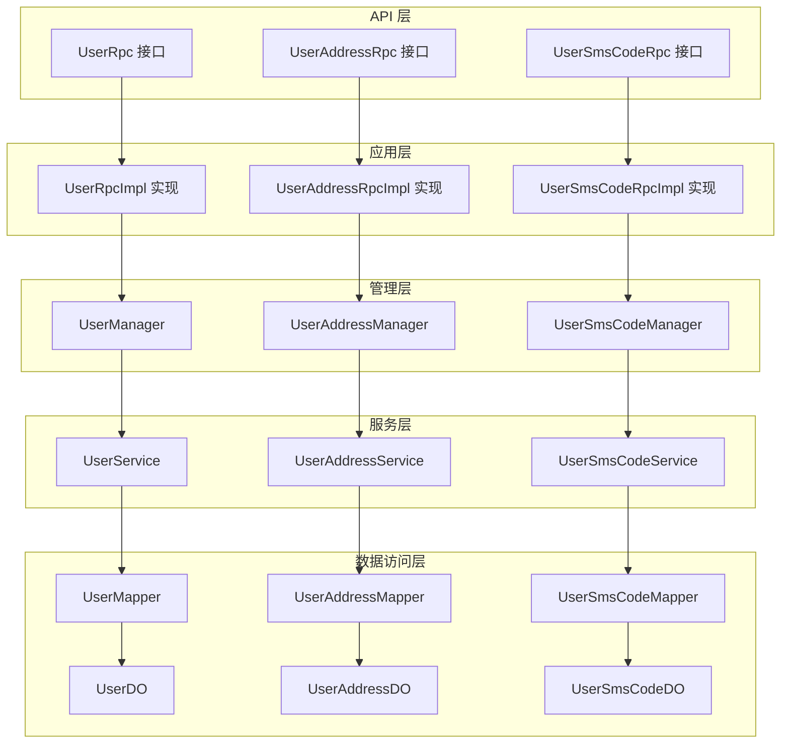
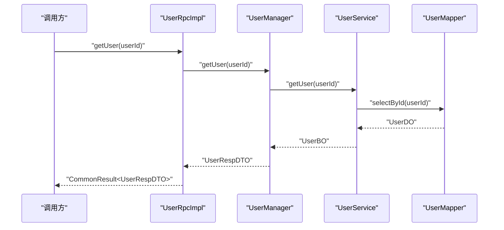
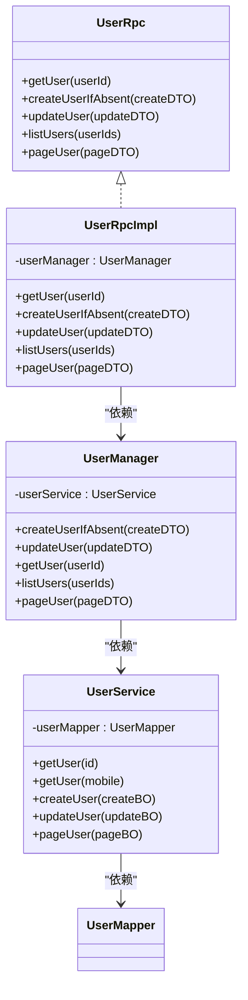
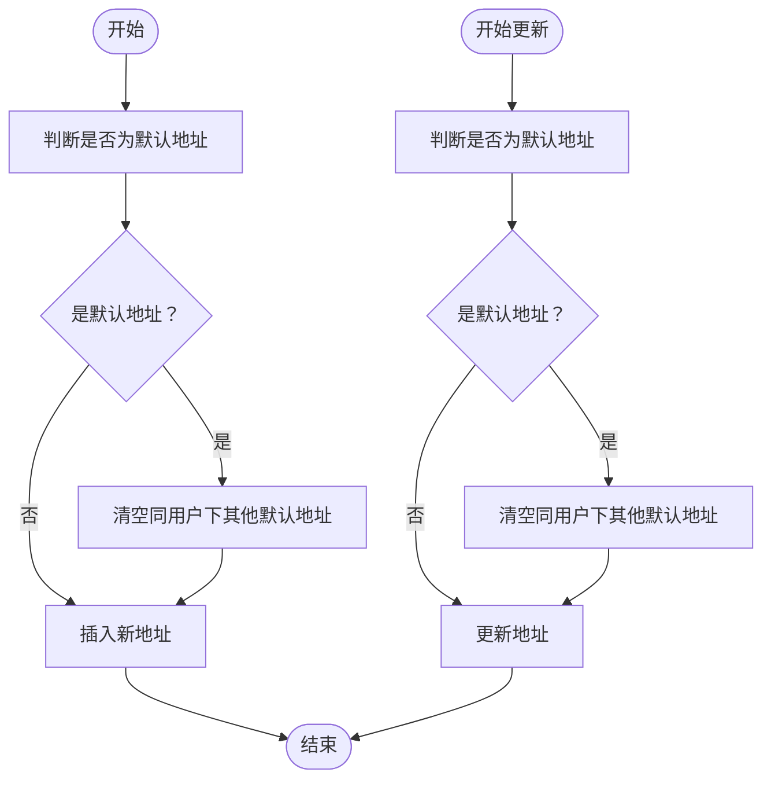
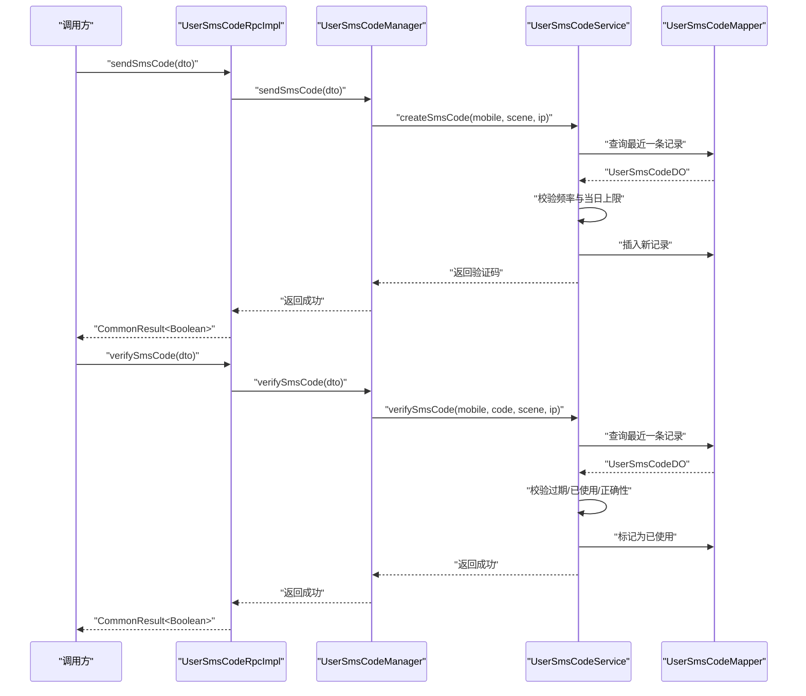
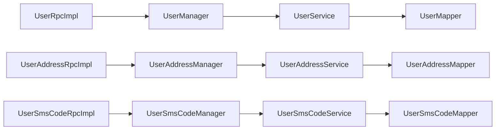

# 用户服务模块

<cite>
**本文引用的文件**
- [UserRpc.java](file://user-service-project/user-service-api/src/main/java/cn/iocoder/mall/userservice/rpc/user/UserRpc.java)
- [UserRpcImpl.java](file://user-service-project/user-service-app/src/main/java/cn/iocoder/mall/userservice/rpc/user/UserRpcImpl.java)
- [UserManager.java](file://user-service-project/user-service-app/src/main/java/cn/iocoder/mall/userservice/manager/user/UserManager.java)
- [UserService.java](file://user-service-project/user-service-app/src/main/java/cn/iocoder/mall/userservice/service/user/UserService.java)
- [UserAddressRpc.java](file://user-service-project/user-service-api/src/main/java/cn/iocoder/mall/userservice/rpc/address/UserAddressRpc.java)
- [UserAddressRpcImpl.java](file://user-service-project/user-service-app/src/main/java/cn/iocoder/mall/userservice/rpc/address/UserAddressRpcImpl.java)
- [UserAddressManager.java](file://user-service-project/user-service-app/src/main/java/cn/iocoder/mall/userservice/manager/address/UserAddressManager.java)
- [UserAddressService.java](file://user-service-project/user-service-app/src/main/java/cn/iocoder/mall/userservice/service/address/UserAddressService.java)
- [UserSmsCodeRpc.java](file://user-service-project/user-service-api/src/main/java/cn/iocoder/mall/userservice/rpc/sms/UserSmsCodeRpc.java)
- [UserSmsCodeRpcImpl.java](file://user-service-project/user-service-app/src/main/java/cn/iocoder/mall/userservice/rpc/sms/UserSmsCodeRpcImpl.java)
- [UserSmsCodeManager.java](file://user-service-project/user-service-app/src/main/java/cn/iocoder/mall/userservice/manager/sms/UserSmsCodeManager.java)
- [UserSmsCodeService.java](file://user-service-project/user-service-app/src/main/java/cn/iocoder/mall/userservice/service/sms/UserSmsCodeService.java)
- [UserAddressDO.java](file://user-service-project/user-service-app/src/main/java/cn/iocoder/mall/userservice/dal/mysql/dataobject/address/UserAddressDO.java)
- [UserSmsCodeDO.java](file://user-service-project/user-service-app/src/main/java/cn/iocoder/mall/userservice/dal/mysql/dataobject/sms/UserSmsCodeDO.java)
- [UserDO.java](file://user-service-project/user-service-app/src/main/java/cn/iocoder/mall/userservice/dal/mysql/dataobject/user/UserDO.java)
- [UserAddressMapper.java](file://user-service-project/user-service-app/src/main/java/cn/iocoder/mall/userservice/dal/mysql/mapper/address/UserAddressMapper.java)
- [UserSmsCodeMapper.java](file://user-service-project/user-service-app/src/main/java/cn/iocoder/mall/userservice/dal/mysql/mapper/sms/UserSmsCodeMapper.java)
- [UserMapper.java](file://user-service-project/user-service-app/src/main/java/cn/iocoder/mall/userservice/dal/mysql/mapper/user/UserMapper.java)
- [UserAddressType.java](file://user-service-project/user-service-api/src/main/java/cn/iocoder/mall/userservice/enums/address/UserAddressType.java)
- [UserSmsSceneEnum.java](file://user-service-project/user-service-api/src/main/java/cn/iocoder/mall/userservice/enums/sms/UserSmsSceneEnum.java)
- [UserErrorCodeConstants.java](file://user-service-project/user-service-api/src/main/java/cn/iocoder/mall/userservice/enums/UserErrorCodeConstants.java)
- [application.yaml](file://user-service-project/user-service-app/src/main/resources/application.yaml)
- [CommonResult.java](file://common/common-framework/src/main/java/cn/iocoder/common/framework/vo/CommonResult.java)
- [PageResult.java](file://common/common-framework/src/main/java/cn/iocoder/common/framework/vo/PageResult.java)
- [CommonStatusEnum.java](file://common/common-framework/src/main/java/cn/iocoder/common/framework/enums/CommonStatusEnum.java)
- [UserTypeEnum.java](file://common/common-framework/src/main/java/cn/iocoder/common/framework/enums/UserTypeEnum.java)
- [DigestUtils.java](file://common/common-framework/src/main/java/cn/iocoder/common/framework/util/DigestUtils.java)
- [StringUtils.java](file://common/common-framework/src/main/java/cn/iocoder/common/framework/util/StringUtils.java)
- [ServiceExceptionUtil.java](file://common/common-framework/src/main/java/cn/iocoder/common/framework/exception/util/ServiceExceptionUtil.java)
- [OAuth2Rpc.java](file://system-service-project/system-service-api/src/main/java/cn/iocoder/mall/systemservice/rpc/oauth/OAuth2Rpc.java)
</cite>

## 目录
1. [简介](#简介)
2. [项目结构](#项目结构)
3. [核心组件](#核心组件)
4. [架构总览](#架构总览)
5. [详细组件分析](#详细组件分析)
6. [依赖分析](#依赖分析)
7. [性能考虑](#性能考虑)
8. [故障排查指南](#故障排查指南)
9. [结论](#结论)
10. [附录](#附录)

## 简介
本文件为“用户服务模块”的全面技术文档，覆盖以下主题：
- 用户管理：注册、登录认证、个人信息管理、密码安全策略
- 地址管理：收货地址的增删改查、默认地址设置、地址簿管理
- 短信验证码：发送策略、验证机制、防刷措施
- 权限控制：基于角色的访问控制（RBAC）与动态权限检查
- RPC 接口设计与实现：接口定义、参数校验、异常处理
- 完整 API 文档与使用示例：请求格式、响应结构、错误码说明
- 性能优化建议与安全防护措施

## 项目结构
用户服务模块采用典型的分层架构：
- API 层：对外暴露 RPC 接口，定义 DTO
- 应用层：实现 RPC 入口，编排 Manager
- 管理层：业务编排与跨服务调用（如 OAuth2）
- 服务层：领域服务，负责业务规则与事务
- 数据访问层：MyBatis Mapper 与 DO/BO/DTO 转换

图表来源
- [UserRpc.java:1-55](file://user-service-project/user-service-api/src/main/java/cn/iocoder/mall/userservice/rpc/user/UserRpc.java#L1-L55)
- [UserAddressRpc.java:1-63](file://user-service-project/user-service-api/src/main/java/cn/iocoder/mall/userservice/rpc/address/UserAddressRpc.java#L1-L63)
- [UserSmsCodeRpc.java:1-17](file://user-service-project/user-service-api/src/main/java/cn/iocoder/mall/userservice/rpc/sms/UserSmsCodeRpc.java#L1-L17)
- [UserRpcImpl.java:1-50](file://user-service-project/user-service-app/src/main/java/cn/iocoder/mall/userservice/rpc/user/UserRpcImpl.java#L1-L50)
- [UserAddressRpcImpl.java:1-57](file://user-service-project/user-service-app/src/main/java/cn/iocoder/mall/userservice/rpc/address/UserAddressRpcImpl.java#L1-L57)
- [UserSmsCodeRpcImpl.java:1-29](file://user-service-project/user-service-app/src/main/java/cn/iocoder/mall/userservice/rpc/sms/UserSmsCodeRpcImpl.java#L1-L29)
- [UserManager.java:1-92](file://user-service-project/user-service-app/src/main/java/cn/iocoder/mall/userservice/manager/user/UserManager.java#L1-L92)
- [UserAddressManager.java:1-87](file://user-service-project/user-service-app/src/main/java/cn/iocoder/mall/userservice/manager/address/UserAddressManager.java#L1-L87)
- [UserSmsCodeManager.java:1-28](file://user-service-project/user-service-app/src/main/java/cn/iocoder/mall/userservice/manager/sms/UserSmsCodeManager.java#L1-L28)
- [UserService.java:1-118](file://user-service-project/user-service-app/src/main/java/cn/iocoder/mall/userservice/service/user/UserService.java#L1-L118)
- [UserAddressService.java:1-131](file://user-service-project/user-service-app/src/main/java/cn/iocoder/mall/userservice/service/address/UserAddressService.java#L1-L131)
- [UserSmsCodeService.java:1-106](file://user-service-project/user-service-app/src/main/java/cn/iocoder/mall/userservice/service/sms/UserSmsCodeService.java#L1-L106)
- [UserMapper.java](file://user-service-project/user-service-app/src/main/java/cn/iocoder/mall/userservice/dal/mysql/mapper/user/UserMapper.java)
- [UserAddressMapper.java](file://user-service-project/user-service-app/src/main/java/cn/iocoder/mall/userservice/dal/mysql/mapper/address/UserAddressMapper.java)
- [UserSmsCodeMapper.java](file://user-service-project/user-service-app/src/main/java/cn/iocoder/mall/userservice/dal/mysql/mapper/sms/UserSmsCodeMapper.java)
- [UserDO.java](file://user-service-project/user-service-app/src/main/java/cn/iocoder/mall/userservice/dal/mysql/dataobject/user/UserDO.java)
- [UserAddressDO.java](file://user-service-project/user-service-app/src/main/java/cn/iocoder/mall/userservice/dal/mysql/dataobject/address/UserAddressDO.java)
- [UserSmsCodeDO.java](file://user-service-project/user-service-app/src/main/java/cn/iocoder/mall/userservice/dal/mysql/dataobject/sms/UserSmsCodeDO.java)

章节来源
- [UserRpc.java:1-55](file://user-service-project/user-service-api/src/main/java/cn/iocoder/mall/userservice/rpc/user/UserRpc.java#L1-L55)
- [UserAddressRpc.java:1-63](file://user-service-project/user-service-api/src/main/java/cn/iocoder/mall/userservice/rpc/address/UserAddressRpc.java#L1-L63)
- [UserSmsCodeRpc.java:1-17](file://user-service-project/user-service-api/src/main/java/cn/iocoder/mall/userservice/rpc/sms/UserSmsCodeRpc.java#L1-L17)

## 核心组件
- 用户 RPC 接口与实现：提供用户查询、创建（若不存在）、更新、分页等能力
- 地址 RPC 接口与实现：提供地址的增删改查、按用户与类型查询
- 短信验证码 RPC 接口与实现：提供发送与验证能力
- 管理器与服务：封装业务编排、参数转换、跨服务调用（如 OAuth2）
- 数据模型与映射：UserDO、UserAddressDO、UserSmsCodeDO 及对应 Mapper

章节来源
- [UserRpcImpl.java:1-50](file://user-service-project/user-service-app/src/main/java/cn/iocoder/mall/userservice/rpc/user/UserRpcImpl.java#L1-L50)
- [UserAddressRpcImpl.java:1-57](file://user-service-project/user-service-app/src/main/java/cn/iocoder/mall/userservice/rpc/address/UserAddressRpcImpl.java#L1-L57)
- [UserSmsCodeRpcImpl.java:1-29](file://user-service-project/user-service-app/src/main/java/cn/iocoder/mall/userservice/rpc/sms/UserSmsCodeRpcImpl.java#L1-L29)
- [UserManager.java:1-92](file://user-service-project/user-service-app/src/main/java/cn/iocoder/mall/userservice/manager/user/UserManager.java#L1-L92)
- [UserAddressManager.java:1-87](file://user-service-project/user-service-app/src/main/java/cn/iocoder/mall/userservice/manager/address/UserAddressManager.java#L1-L87)
- [UserSmsCodeManager.java:1-28](file://user-service-project/user-service-app/src/main/java/cn/iocoder/mall/userservice/manager/sms/UserSmsCodeManager.java#L1-L28)
- [UserService.java:1-118](file://user-service-project/user-service-app/src/main/java/cn/iocoder/mall/userservice/service/user/UserService.java#L1-L118)
- [UserAddressService.java:1-131](file://user-service-project/user-service-app/src/main/java/cn/iocoder/mall/userservice/service/address/UserAddressService.java#L1-L131)
- [UserSmsCodeService.java:1-106](file://user-service-project/user-service-app/src/main/java/cn/iocoder/mall/userservice/service/sms/UserSmsCodeService.java#L1-L106)

## 架构总览
用户服务通过 Dubbo 暴露 RPC 接口，应用层实现类仅做参数透传与结果包装，核心业务由服务层完成；管理层负责跨服务调用与 DTO/BO 转换。

图表来源
- [UserRpcImpl.java:23-26](file://user-service-project/user-service-app/src/main/java/cn/iocoder/mall/userservice/rpc/user/UserRpcImpl.java#L23-L26)
- [UserManager.java:64-67](file://user-service-project/user-service-app/src/main/java/cn/iocoder/mall/userservice/manager/user/UserManager.java#L64-L67)
- [UserService.java:29-32](file://user-service-project/user-service-app/src/main/java/cn/iocoder/mall/userservice/service/user/UserService.java#L29-L32)
- [UserMapper.java](file://user-service-project/user-service-app/src/main/java/cn/iocoder/mall/userservice/dal/mysql/mapper/user/UserMapper.java)

## 详细组件分析

### 用户管理
- 注册：支持“若不存在则创建”，自动设置状态为启用，密码盐值与哈希处理
- 登录认证：当前模块未直接暴露登录接口，但提供用户查询与密码更新能力；登录鉴权通常由系统服务模块的 OAuth2 组件负责
- 个人信息管理：支持按 ID、批量 ID 查询，支持分页查询；支持按手机号更新并校验唯一性
- 密码安全策略：使用 bcrypt 加盐哈希，自动生成盐值；更新密码时重新生成盐值并加密

图表来源
- [UserRpc.java:12-54](file://user-service-project/user-service-api/src/main/java/cn/iocoder/mall/userservice/rpc/user/UserRpc.java#L12-L54)
- [UserRpcImpl.java:17-49](file://user-service-project/user-service-app/src/main/java/cn/iocoder/mall/userservice/rpc/user/UserRpcImpl.java#L17-L49)
- [UserManager.java:22-91](file://user-service-project/user-service-app/src/main/java/cn/iocoder/mall/userservice/manager/user/UserManager.java#L22-L91)
- [UserService.java:23-117](file://user-service-project/user-service-app/src/main/java/cn/iocoder/mall/userservice/service/user/UserService.java#L23-L117)

章节来源
- [UserRpc.java:1-55](file://user-service-project/user-service-api/src/main/java/cn/iocoder/mall/userservice/rpc/user/UserRpc.java#L1-L55)
- [UserRpcImpl.java:1-50](file://user-service-project/user-service-app/src/main/java/cn/iocoder/mall/userservice/rpc/user/UserRpcImpl.java#L1-L50)
- [UserManager.java:1-92](file://user-service-project/user-service-app/src/main/java/cn/iocoder/mall/userservice/manager/user/UserManager.java#L1-L92)
- [UserService.java:1-118](file://user-service-project/user-service-app/src/main/java/cn/iocoder/mall/userservice/service/user/UserService.java#L1-L118)

### 地址管理
- 收货地址的增删改查：支持按 ID、批量 ID、用户+类型查询
- 默认地址设置：新增或更新默认地址时，会自动将同用户下的其他默认地址取消默认
- 事务保证：地址操作在服务层使用事务，确保一致性

图表来源
- [UserAddressService.java:38-80](file://user-service-project/user-service-app/src/main/java/cn/iocoder/mall/userservice/service/address/UserAddressService.java#L38-L80)

章节来源
- [UserAddressRpc.java:1-63](file://user-service-project/user-service-api/src/main/java/cn/iocoder/mall/userservice/rpc/address/UserAddressRpc.java#L1-L63)
- [UserAddressRpcImpl.java:1-57](file://user-service-project/user-service-app/src/main/java/cn/iocoder/mall/userservice/rpc/address/UserAddressRpcImpl.java#L1-L57)
- [UserAddressManager.java:1-87](file://user-service-project/user-service-app/src/main/java/cn/iocoder/mall/userservice/manager/address/UserAddressManager.java#L1-L87)
- [UserAddressService.java:1-131](file://user-service-project/user-service-app/src/main/java/cn/iocoder/mall/userservice/service/address/UserAddressService.java#L1-L131)

### 短信验证码服务
- 发送策略：限制每日发送次数、发送频率；记录今日索引与创建时间
- 验证机制：校验是否存在、是否过期、是否已使用、是否匹配；验证成功后标记为已使用
- 防刷措施：基于手机号维度的频率限制与当日上限；预留 IP 维度扩展点

图表来源
- [UserSmsCodeRpcImpl.java:16-26](file://user-service-project/user-service-app/src/main/java/cn/iocoder/mall/userservice/rpc/sms/UserSmsCodeRpcImpl.java#L16-L26)
- [UserSmsCodeManager.java:15-25](file://user-service-project/user-service-app/src/main/java/cn/iocoder/mall/userservice/manager/sms/UserSmsCodeManager.java#L15-L25)
- [UserSmsCodeService.java:50-103](file://user-service-project/user-service-app/src/main/java/cn/iocoder/mall/userservice/service/sms/UserSmsCodeService.java#L50-L103)
- [UserSmsCodeMapper.java](file://user-service-project/user-service-app/src/main/java/cn/iocoder/mall/userservice/dal/mysql/mapper/sms/UserSmsCodeMapper.java)

章节来源
- [UserSmsCodeRpc.java:1-17](file://user-service-project/user-service-api/src/main/java/cn/iocoder/mall/userservice/rpc/sms/UserSmsCodeRpc.java#L1-L17)
- [UserSmsCodeRpcImpl.java:1-29](file://user-service-project/user-service-app/src/main/java/cn/iocoder/mall/userservice/rpc/sms/UserSmsCodeRpcImpl.java#L1-L29)
- [UserSmsCodeManager.java:1-28](file://user-service-project/user-service-app/src/main/java/cn/iocoder/mall/userservice/manager/sms/UserSmsCodeManager.java#L1-L28)
- [UserSmsCodeService.java:1-106](file://user-service-project/user-service-app/src/main/java/cn/iocoder/mall/userservice/service/sms/UserSmsCodeService.java#L1-L106)

### 权限控制机制
- RBAC 与动态权限检查：用户管理相关操作由系统服务模块的 OAuth2 组件统一负责，用户服务在更新密码或禁用用户时，会调用 OAuth2 移除相关令牌，确保权限即时生效
- 角色与用户类型：用户类型枚举用于区分用户与管理员，便于权限边界划分

章节来源
- [UserManager.java:47-56](file://user-service-project/user-service-app/src/main/java/cn/iocoder/mall/userservice/manager/user/UserManager.java#L47-L56)
- [OAuth2Rpc.java](file://system-service-project/system-service-api/src/main/java/cn/iocoder/mall/systemservice/rpc/oauth/OAuth2Rpc.java)
- [UserTypeEnum.java](file://common/common-framework/src/main/java/cn/iocoder/common/framework/enums/UserTypeEnum.java)

### RPC 接口设计与实现
- 接口定义：清晰的职责划分，按功能拆分为用户、地址、短信三类 RPC 接口
- 参数校验：使用注解与业务校验相结合，如手机号格式、默认地址类型、验证码有效期与正确性
- 异常处理：集中使用通用异常工具类抛出业务异常，配合统一错误码

章节来源
- [UserRpc.java:1-55](file://user-service-project/user-service-api/src/main/java/cn/iocoder/mall/userservice/rpc/user/UserRpc.java#L1-L55)
- [UserAddressRpc.java:1-63](file://user-service-project/user-service-api/src/main/java/cn/iocoder/mall/userservice/rpc/address/UserAddressRpc.java#L1-L63)
- [UserSmsCodeRpc.java:1-17](file://user-service-project/user-service-api/src/main/java/cn/iocoder/mall/userservice/rpc/sms/UserSmsCodeRpc.java#L1-L17)
- [ServiceExceptionUtil.java](file://common/common-framework/src/main/java/cn/iocoder/common/framework/exception/util/ServiceExceptionUtil.java)

## 依赖分析
- 组件耦合：应用层实现类仅依赖管理层；管理层依赖服务层；服务层依赖数据访问层
- 外部依赖：Dubbo 注解用于暴露 RPC；MyBatis Plus 用于数据持久化；Spring Validation 用于参数校验
- 循环依赖：未发现循环依赖迹象

图表来源
- [UserRpcImpl.java:17-49](file://user-service-project/user-service-app/src/main/java/cn/iocoder/mall/userservice/rpc/user/UserRpcImpl.java#L17-L49)
- [UserAddressRpcImpl.java:18-54](file://user-service-project/user-service-app/src/main/java/cn/iocoder/mall/userservice/rpc/address/UserAddressRpcImpl.java#L18-L54)
- [UserSmsCodeRpcImpl.java:10-26](file://user-service-project/user-service-app/src/main/java/cn/iocoder/mall/userservice/rpc/sms/UserSmsCodeRpcImpl.java#L10-L26)
- [UserManager.java:25-29](file://user-service-project/user-service-app/src/main/java/cn/iocoder/mall/userservice/manager/user/UserManager.java#L25-L29)
- [UserAddressManager.java:20-21](file://user-service-project/user-service-app/src/main/java/cn/iocoder/mall/userservice/manager/address/UserAddressManager.java#L20-L21)
- [UserSmsCodeManager.java:12-13](file://user-service-project/user-service-app/src/main/java/cn/iocoder/mall/userservice/manager/sms/UserSmsCodeManager.java#L12-L13)

章节来源
- [UserRpcImpl.java:1-50](file://user-service-project/user-service-app/src/main/java/cn/iocoder/mall/userservice/rpc/user/UserRpcImpl.java#L1-L50)
- [UserAddressRpcImpl.java:1-57](file://user-service-project/user-service-app/src/main/java/cn/iocoder/mall/userservice/rpc/address/UserAddressRpcImpl.java#L1-L57)
- [UserSmsCodeRpcImpl.java:1-29](file://user-service-project/user-service-app/src/main/java/cn/iocoder/mall/userservice/rpc/sms/UserSmsCodeRpcImpl.java#L1-L29)

## 性能考虑
- 缓存策略：建议对热点用户信息与常用地址列表增加缓存，降低数据库压力
- 分页查询：使用分页查询避免一次性加载大量数据
- 并发控制：验证码发送频率与当日上限已在服务层实现，建议结合分布式锁或 Redis 计数器进一步强化
- 数据库优化：为手机号、地址用户 ID、验证码创建索引，提升查询效率
- RPC 调用：减少不必要的跨服务调用，合并必要的批量查询

## 故障排查指南
- 用户相关
  - 用户不存在：检查用户 ID 或手机号是否正确
  - 手机号已存在：更新时避免冲突
  - 状态重复：禁止将状态更新为已有值
- 地址相关
  - 地址不存在：确认地址 ID 是否正确
  - 默认地址冲突：确保同一用户只有一个默认地址
- 短信验证码相关
  - 发送过于频繁：等待冷却时间或调整频率配置
  - 超过当日上限：等待次日或调整上限配置
  - 验证码过期/已使用/不正确：确认验证码时效与输入准确性

章节来源
- [UserService.java:66-92](file://user-service-project/user-service-app/src/main/java/cn/iocoder/mall/userservice/service/user/UserService.java#L66-L92)
- [UserAddressService.java:87-94](file://user-service-project/user-service-app/src/main/java/cn/iocoder/mall/userservice/service/address/UserAddressService.java#L87-L94)
- [UserSmsCodeService.java:50-103](file://user-service-project/user-service-app/src/main/java/cn/iocoder/mall/userservice/service/sms/UserSmsCodeService.java#L50-L103)
- [UserErrorCodeConstants.java](file://user-service-project/user-service-api/src/main/java/cn/iocoder/mall/userservice/enums/UserErrorCodeConstants.java)

## 结论
用户服务模块以清晰的分层架构实现了用户、地址与短信验证码的核心能力，具备良好的扩展性与安全性。通过引入系统服务模块的 OAuth2 能力，实现了统一的权限控制与令牌管理。建议在生产环境中结合缓存、索引与并发控制策略进一步提升性能与稳定性。

## 附录

### API 文档与使用示例

- 用户 RPC 接口
  - 接口：[UserRpc.java:12-54](file://user-service-project/user-service-api/src/main/java/cn/iocoder/mall/userservice/rpc/user/UserRpc.java#L12-L54)
  - 实现：[UserRpcImpl.java:17-49](file://user-service-project/user-service-app/src/main/java/cn/iocoder/mall/userservice/rpc/user/UserRpcImpl.java#L17-L49)
  - 响应包装：[CommonResult.java](file://common/common-framework/src/main/java/cn/iocoder/common/framework/vo/CommonResult.java)
  - 分页结果：[PageResult.java](file://common/common-framework/src/main/java/cn/iocoder/common/framework/vo/PageResult.java)

- 地址 RPC 接口
  - 接口：[UserAddressRpc.java:13-62](file://user-service-project/user-service-api/src/main/java/cn/iocoder/mall/userservice/rpc/address/UserAddressRpc.java#L13-L62)
  - 实现：[UserAddressRpcImpl.java:18-54](file://user-service-project/user-service-app/src/main/java/cn/iocoder/mall/userservice/rpc/address/UserAddressRpcImpl.java#L18-L54)
  - 地址类型枚举：[UserAddressType.java](file://user-service-project/user-service-api/src/main/java/cn/iocoder/mall/userservice/enums/address/UserAddressType.java)

- 短信验证码 RPC 接口
  - 接口：[UserSmsCodeRpc.java:10-16](file://user-service-project/user-service-api/src/main/java/cn/iocoder/mall/userservice/rpc/sms/UserSmsCodeRpc.java#L10-L16)
  - 实现：[UserSmsCodeRpcImpl.java:10-26](file://user-service-project/user-service-app/src/main/java/cn/iocoder/mall/userservice/rpc/sms/UserSmsCodeRpcImpl.java#L10-L26)
  - 场景枚举：[UserSmsSceneEnum.java](file://user-service-project/user-service-api/src/main/java/cn/iocoder/mall/userservice/enums/sms/UserSmsSceneEnum.java)

- 配置项参考
  - 验证码过期时间（毫秒）：modules.user-sms-code-service.code-expire-time-millis
  - 每日最大发送数量：modules.user-sms-code-service.send-maximum-quantity-per-day
  - 发送频率（毫秒）：modules.user-sms-code-service.send-frequency
  - 配置文件位置：[application.yaml](file://user-service-project/user-service-app/src/main/resources/application.yaml)

- 错误码
  - 用户相关错误码：[UserErrorCodeConstants.java](file://user-service-project/user-service-api/src/main/java/cn/iocoder/mall/userservice/enums/UserErrorCodeConstants.java)
  - 通用状态枚举：[CommonStatusEnum.java](file://common/common-framework/src/main/java/cn/iocoder/common/framework/enums/CommonStatusEnum.java)

- 数据模型
  - 用户：[UserDO.java](file://user-service-project/user-service-app/src/main/java/cn/iocoder/mall/userservice/dal/mysql/dataobject/user/UserDO.java)
  - 地址：[UserAddressDO.java](file://user-service-project/user-service-app/src/main/java/cn/iocoder/mall/userservice/dal/mysql/dataobject/address/UserAddressDO.java)
  - 短信验证码：[UserSmsCodeDO.java](file://user-service-project/user-service-app/src/main/java/cn/iocoder/mall/userservice/dal/mysql/dataobject/sms/UserSmsCodeDO.java)

- 工具与异常
  - 加密工具：[DigestUtils.java](file://common/common-framework/src/main/java/cn/iocoder/common/framework/util/DigestUtils.java)
  - 字符串工具：[StringUtils.java](file://common/common-framework/src/main/java/cn/iocoder/common/framework/util/StringUtils.java)
  - 异常工具：[ServiceExceptionUtil.java](file://common/common-framework/src/main/java/cn/iocoder/common/framework/exception/util/ServiceExceptionUtil.java)