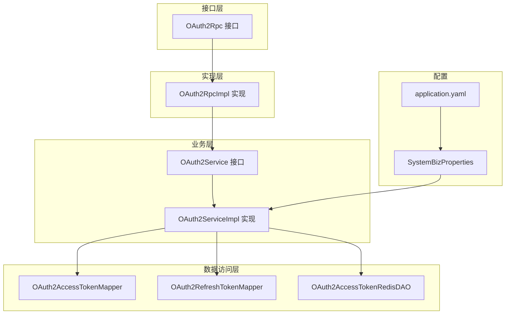
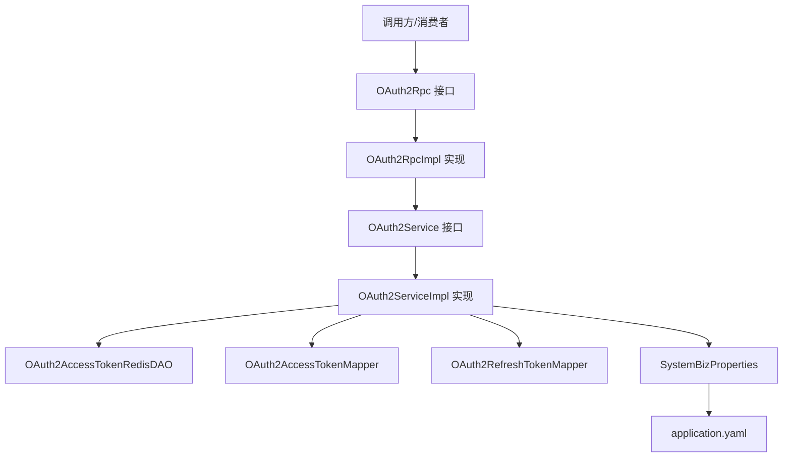
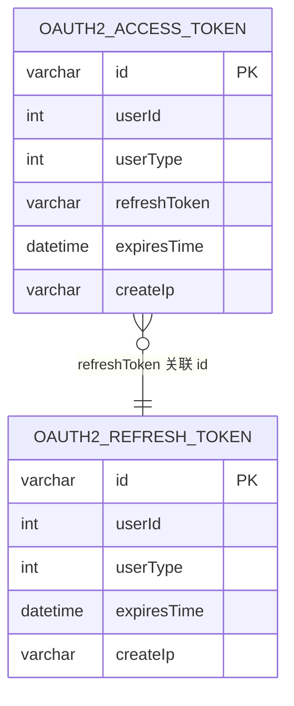
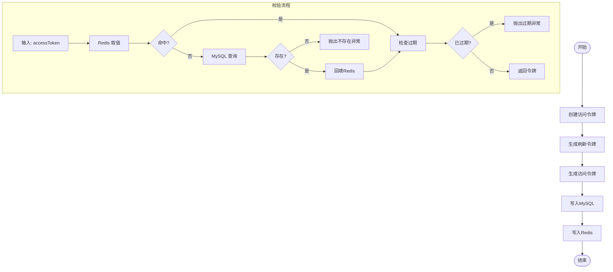
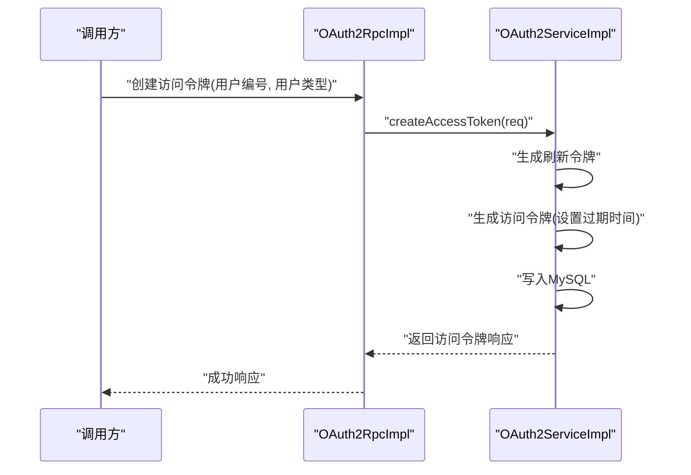
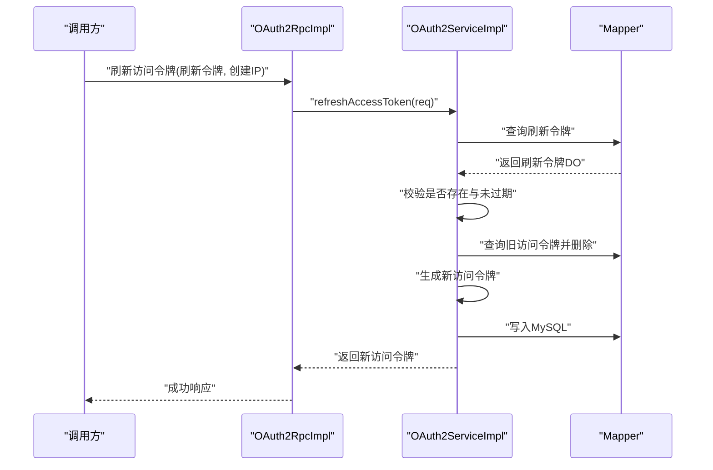
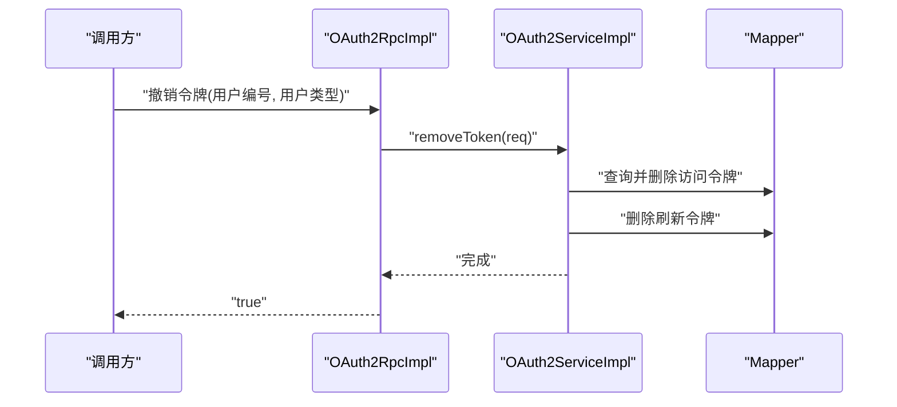
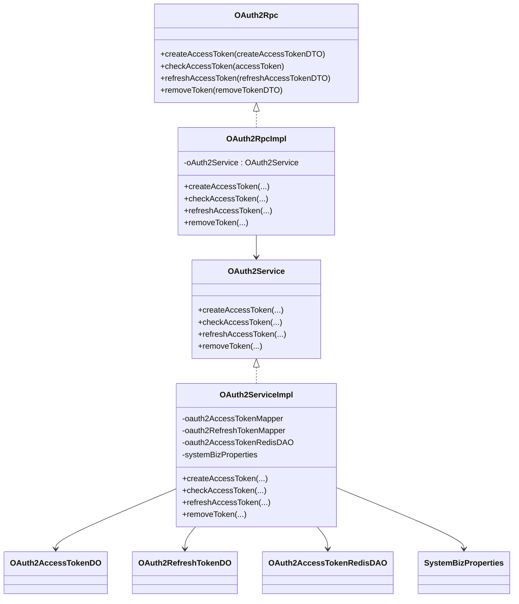
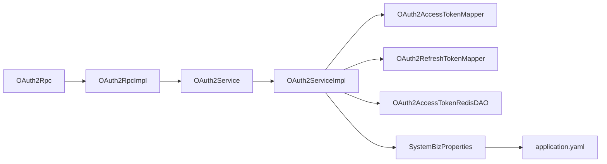

# OAuth2认证

<cite>
**本文引用的文件**   
- [OAuth2Rpc.java](file://system-service-project/system-service-api/src/main/java/cn/iocoder/mall/systemservice/rpc/oauth/OAuth2Rpc.java)
- [OAuth2RpcImpl.java](file://system-service-project/system-service-app/src/main/java/cn/iocoder/mall/systemservice/rpc/oauth/OAuth2RpcImpl.java)
- [OAuth2Service.java](file://system-service-project/system-service-app/src/main/java/cn/iocoder/mall/systemservice/service/oauth/OAuth2Service.java)
- [OAuth2ServiceImpl.java](file://system-service-project/system-service-app/src/main/java/cn/iocoder/mall/systemservice/service/oauth/OAuth2ServiceImpl.java)
- [OAuth2AccessTokenRespDTO.java](file://system-service-project/system-service-api/src/main/java/cn/iocoder/mall/systemservice/rpc/oauth/dto/OAuth2AccessTokenRespDTO.java)
- [OAuth2CreateAccessTokenReqDTO.java](file://system-service-project/system-service-api/src/main/java/cn/iocoder/mall/systemservice/rpc/oauth/dto/OAuth2CreateAccessTokenReqDTO.java)
- [OAuth2RefreshAccessTokenReqDTO.java](file://system-service-project/system-service-api/src/main/java/cn/iocoder/mall/systemservice/rpc/oauth/dto/OAuth2RefreshAccessTokenReqDTO.java)
- [OAuth2RemoveTokenByUserReqDTO.java](file://system-service-project/system-service-api/src/main/java/cn/iocoder/mall/systemservice/rpc/oauth/dto/OAuth2RemoveTokenByUserReqDTO.java)
- [OAuth2AccessTokenDO.java](file://system-service-project/system-service-app/src/main/java/cn/iocoder/mall/systemservice/dal/mysql/dataobject/oauth/OAuth2AccessTokenDO.java)
- [OAuth2RefreshTokenDO.java](file://system-service-project/system-service-app/src/main/java/cn/iocoder/mall/systemservice/dal/mysql/dataobject/oauth/OAuth2RefreshTokenDO.java)
- [OAuth2AccessTokenRedisDAO.java](file://system-service-project/system-service-app/src/main/java/cn/iocoder/mall/systemservice/dal/redis/dao/OAuth2AccessTokenRedisDAO.java)
- [SystemBizProperties.java](file://system-service-project/system-service-app/src/main/java/cn/iocoder/mall/systemservice/config/SystemBizProperties.java)
- [application.yaml](file://system-service-project/system-service-app/src/main/resources/application.yaml)
</cite>

## 目录
1. [简介](#简介)
2. [项目结构](#项目结构)
3. [核心组件](#核心组件)
4. [架构总览](#架构总览)
5. [详细组件分析](#详细组件分析)
6. [依赖关系分析](#依赖关系分析)
7. [性能考量](#性能考量)
8. [故障排查指南](#故障排查指南)
9. [结论](#结论)
10. [附录](#附录)

## 简介
本文件面向OneMall项目的OAuth2认证子系统，系统性梳理了访问令牌的生成、验证、刷新与撤销等核心能力，以及令牌数据模型、生命周期管理（创建、续期、失效处理、安全存储）与授权模式落地方式。文档同时给出关键流程的时序图与类图，并提供可定位到源码路径的实现线索，便于开发者快速理解与扩展。

## 项目结构
OAuth2相关代码集中在“系统服务”模块中，采用分层设计：
- 接口层：对外RPC接口定义
- 实现层：基于Dubbo的服务实现
- 业务层：核心业务逻辑（令牌生成、校验、刷新、撤销）
- 数据访问层：MySQL Mapper与Redis DAO
- 配置层：业务参数（令牌有效期）

图表来源
- [OAuth2Rpc.java:1-20](file://system-service-project/system-service-api/src/main/java/cn/iocoder/mall/systemservice/rpc/oauth/OAuth2Rpc.java#L1-L20)
- [OAuth2RpcImpl.java:1-42](file://system-service-project/system-service-app/src/main/java/cn/iocoder/mall/systemservice/rpc/oauth/OAuth2RpcImpl.java#L1-L42)
- [OAuth2Service.java:1-22](file://system-service-project/system-service-app/src/main/java/cn/iocoder/mall/systemservice/service/oauth/OAuth2Service.java#L1-L22)
- [OAuth2ServiceImpl.java:1-162](file://system-service-project/system-service-app/src/main/java/cn/iocoder/mall/systemservice/service/oauth/OAuth2ServiceImpl.java#L1-L162)
- [OAuth2AccessTokenRedisDAO.java:1-37](file://system-service-project/system-service-app/src/main/java/cn/iocoder/mall/systemservice/dal/redis/dao/OAuth2AccessTokenRedisDAO.java#L1-L37)
- [SystemBizProperties.java:1-31](file://system-service-project/system-service-app/src/main/java/cn/iocoder/mall/systemservice/config/SystemBizProperties.java#L1-L31)
- [application.yaml:75-79](file://system-service-project/system-service-app/src/main/resources/application.yaml#L75-L79)

章节来源
- [OAuth2Rpc.java:1-20](file://system-service-project/system-service-api/src/main/java/cn/iocoder/mall/systemservice/rpc/oauth/OAuth2Rpc.java#L1-L20)
- [OAuth2RpcImpl.java:1-42](file://system-service-project/system-service-app/src/main/java/cn/iocoder/mall/systemservice/rpc/oauth/OAuth2RpcImpl.java#L1-L42)
- [OAuth2Service.java:1-22](file://system-service-project/system-service-app/src/main/java/cn/iocoder/mall/systemservice/service/oauth/OAuth2Service.java#L1-L22)
- [OAuth2ServiceImpl.java:1-162](file://system-service-project/system-service-app/src/main/java/cn/iocoder/mall/systemservice/service/oauth/OAuth2ServiceImpl.java#L1-L162)
- [OAuth2AccessTokenRedisDAO.java:1-37](file://system-service-project/system-service-app/src/main/java/cn/iocoder/mall/systemservice/dal/redis/dao/OAuth2AccessTokenRedisDAO.java#L1-L37)
- [SystemBizProperties.java:1-31](file://system-service-project/system-service-app/src/main/java/cn/iocoder/mall/systemservice/config/SystemBizProperties.java#L1-L31)
- [application.yaml:75-79](file://system-service-project/system-service-app/src/main/resources/application.yaml#L75-L79)

## 核心组件
- OAuth2Rpc：对外RPC接口，提供创建、校验、刷新、撤销令牌的能力
- OAuth2RpcImpl：基于Dubbo的实现，透传调用业务层
- OAuth2Service/OAuth2ServiceImpl：核心业务逻辑，负责令牌生成、校验、刷新、撤销与缓存交互
- OAuth2AccessTokenDO/OAuth2RefreshTokenDO：MySQL持久化实体，承载令牌元数据
- OAuth2AccessTokenRedisDAO：Redis缓存访问，提升令牌校验性能
- SystemBizProperties：业务配置，包含访问令牌与刷新令牌的过期时间

章节来源
- [OAuth2Rpc.java:1-20](file://system-service-project/system-service-api/src/main/java/cn/iocoder/mall/systemservice/rpc/oauth/OAuth2Rpc.java#L1-L20)
- [OAuth2RpcImpl.java:1-42](file://system-service-project/system-service-app/src/main/java/cn/iocoder/mall/systemservice/rpc/oauth/OAuth2RpcImpl.java#L1-L42)
- [OAuth2Service.java:1-22](file://system-service-project/system-service-app/src/main/java/cn/iocoder/mall/systemservice/service/oauth/OAuth2Service.java#L1-L22)
- [OAuth2ServiceImpl.java:1-162](file://system-service-project/system-service-app/src/main/java/cn/iocoder/mall/systemservice/service/oauth/OAuth2ServiceImpl.java#L1-L162)
- [OAuth2AccessTokenDO.java:1-57](file://system-service-project/system-service-app/src/main/java/cn/iocoder/mall/systemservice/dal/mysql/dataobject/oauth/OAuth2AccessTokenDO.java#L1-L57)
- [OAuth2RefreshTokenDO.java:1-50](file://system-service-project/system-service-app/src/main/java/cn/iocoder/mall/systemservice/dal/mysql/dataobject/oauth/OAuth2RefreshTokenDO.java#L1-L50)
- [OAuth2AccessTokenRedisDAO.java:1-37](file://system-service-project/system-service-app/src/main/java/cn/iocoder/mall/systemservice/dal/redis/dao/OAuth2AccessTokenRedisDAO.java#L1-L37)
- [SystemBizProperties.java:1-31](file://system-service-project/system-service-app/src/main/java/cn/iocoder/mall/systemservice/config/SystemBizProperties.java#L1-L31)

## 架构总览
系统采用“接口层-实现层-业务层-数据访问层”的清晰分层，配合Redis缓存与MySQL持久化，实现高性能、可扩展的令牌管理。

图表来源
- [OAuth2Rpc.java:1-20](file://system-service-project/system-service-api/src/main/java/cn/iocoder/mall/systemservice/rpc/oauth/OAuth2Rpc.java#L1-L20)
- [OAuth2RpcImpl.java:1-42](file://system-service-project/system-service-app/src/main/java/cn/iocoder/mall/systemservice/rpc/oauth/OAuth2RpcImpl.java#L1-L42)
- [OAuth2Service.java:1-22](file://system-service-project/system-service-app/src/main/java/cn/iocoder/mall/systemservice/service/oauth/OAuth2Service.java#L1-L22)
- [OAuth2ServiceImpl.java:1-162](file://system-service-project/system-service-app/src/main/java/cn/iocoder/mall/systemservice/service/oauth/OAuth2ServiceImpl.java#L1-L162)
- [OAuth2AccessTokenRedisDAO.java:1-37](file://system-service-project/system-service-app/src/main/java/cn/iocoder/mall/systemservice/dal/redis/dao/OAuth2AccessTokenRedisDAO.java#L1-L37)
- [SystemBizProperties.java:1-31](file://system-service-project/system-service-app/src/main/java/cn/iocoder/mall/systemservice/config/SystemBizProperties.java#L1-L31)
- [application.yaml:75-79](file://system-service-project/system-service-app/src/main/resources/application.yaml#L75-L79)

## 详细组件分析

### 访问令牌数据模型与字段
- 访问令牌：字符串主键，UUID格式
- 刷新令牌：字符串主键，UUID格式，关联访问令牌
- 用户信息：用户编号、用户类型
- 过期时间：Date类型，毫秒级
- 创建IP：记录创建来源IP
- Redis缓存键模板：通过统一的RedisKey常量进行格式化

图表来源
- [OAuth2AccessTokenDO.java:20-57](file://system-service-project/system-service-app/src/main/java/cn/iocoder/mall/systemservice/dal/mysql/dataobject/oauth/OAuth2AccessTokenDO.java#L20-L57)
- [OAuth2RefreshTokenDO.java:19-50](file://system-service-project/system-service-app/src/main/java/cn/iocoder/mall/systemservice/dal/mysql/dataobject/oauth/OAuth2RefreshTokenDO.java#L19-L50)

章节来源
- [OAuth2AccessTokenDO.java:1-57](file://system-service-project/system-service-app/src/main/java/cn/iocoder/mall/systemservice/dal/mysql/dataobject/oauth/OAuth2AccessTokenDO.java#L1-L57)
- [OAuth2RefreshTokenDO.java:1-50](file://system-service-project/system-service-app/src/main/java/cn/iocoder/mall/systemservice/dal/mysql/dataobject/oauth/OAuth2RefreshTokenDO.java#L1-L50)
- [OAuth2AccessTokenRedisDAO.java:9-37](file://system-service-project/system-service-app/src/main/java/cn/iocoder/mall/systemservice/dal/redis/dao/OAuth2AccessTokenRedisDAO.java#L9-L37)

### 令牌生命周期管理
- 创建：生成刷新令牌与访问令牌，设置过期时间，写入MySQL并回填响应
- 校验：优先从Redis命中；未命中则查询MySQL并回填Redis；检查过期时间
- 刷新：校验刷新令牌有效性；标记旧访问令牌失效；生成新访问令牌
- 撤销：按用户维度删除访问令牌与刷新令牌
- 安全存储：访问令牌以JSON序列化形式写入Redis，带超时；MySQL作为持久化根

图表来源
- [OAuth2ServiceImpl.java:42-65](file://system-service-project/system-service-app/src/main/java/cn/iocoder/mall/systemservice/service/oauth/OAuth2ServiceImpl.java#L42-L65)
- [OAuth2ServiceImpl.java:104-139](file://system-service-project/system-service-app/src/main/java/cn/iocoder/mall/systemservice/service/oauth/OAuth2ServiceImpl.java#L104-L139)
- [OAuth2AccessTokenRedisDAO.java:17-30](file://system-service-project/system-service-app/src/main/java/cn/iocoder/mall/systemservice/dal/redis/dao/OAuth2AccessTokenRedisDAO.java#L17-L30)

章节来源
- [OAuth2ServiceImpl.java:42-102](file://system-service-project/system-service-app/src/main/java/cn/iocoder/mall/systemservice/service/oauth/OAuth2ServiceImpl.java#L42-L102)
- [OAuth2ServiceImpl.java:104-159](file://system-service-project/system-service-app/src/main/java/cn/iocoder/mall/systemservice/service/oauth/OAuth2ServiceImpl.java#L104-L159)
- [OAuth2AccessTokenRedisDAO.java:1-37](file://system-service-project/system-service-app/src/main/java/cn/iocoder/mall/systemservice/dal/redis/dao/OAuth2AccessTokenRedisDAO.java#L1-L37)

### 授权模式与应用场景
- 密码模式：由调用方提供用户编号与用户类型，系统生成访问令牌与刷新令牌
- 客户端模式：当前实现未体现专用“客户端凭证”字段，建议在DTO中增加client_id/client_secret并在校验时校验
- 刷新模式：使用刷新令牌换取新的访问令牌，旧访问令牌作废

图表来源
- [OAuth2RpcImpl.java:20-23](file://system-service-project/system-service-app/src/main/java/cn/iocoder/mall/systemservice/rpc/oauth/OAuth2RpcImpl.java#L20-L23)
- [OAuth2ServiceImpl.java:42-51](file://system-service-project/system-service-app/src/main/java/cn/iocoder/mall/systemservice/service/oauth/OAuth2ServiceImpl.java#L42-L51)

章节来源
- [OAuth2CreateAccessTokenReqDTO.java:1-35](file://system-service-project/system-service-api/src/main/java/cn/iocoder/mall/systemservice/rpc/oauth/dto/OAuth2CreateAccessTokenReqDTO.java#L1-L35)
- [OAuth2ServiceImpl.java:42-51](file://system-service-project/system-service-app/src/main/java/cn/iocoder/mall/systemservice/service/oauth/OAuth2ServiceImpl.java#L42-L51)

### 刷新令牌流程
- 输入：刷新令牌与创建IP
- 校验：刷新令牌存在且未过期
- 失效旧访问令牌：根据刷新令牌查询并删除所有关联访问令牌
- 生成新访问令牌：设置过期时间并写入MySQL
- 输出：新访问令牌响应

图表来源
- [OAuth2RpcImpl.java:30-33](file://system-service-project/system-service-app/src/main/java/cn/iocoder/mall/systemservice/rpc/oauth/OAuth2RpcImpl.java#L30-L33)
- [OAuth2ServiceImpl.java:67-88](file://system-service-project/system-service-app/src/main/java/cn/iocoder/mall/systemservice/service/oauth/OAuth2ServiceImpl.java#L67-L88)

章节来源
- [OAuth2RefreshAccessTokenReqDTO.java:1-35](file://system-service-project/system-service-api/src/main/java/cn/iocoder/mall/systemservice/rpc/oauth/dto/OAuth2RefreshAccessTokenReqDTO.java#L1-L35)
- [OAuth2ServiceImpl.java:67-88](file://system-service-project/system-service-app/src/main/java/cn/iocoder/mall/systemservice/service/oauth/OAuth2ServiceImpl.java#L67-L88)

### 撤销令牌流程
- 输入：用户编号与用户类型
- 处理：删除该用户的访问令牌与刷新令牌
- 输出：布尔结果

图表来源
- [OAuth2RpcImpl.java:35-39](file://system-service-project/system-service-app/src/main/java/cn/iocoder/mall/systemservice/rpc/oauth/OAuth2RpcImpl.java#L35-L39)
- [OAuth2ServiceImpl.java:90-102](file://system-service-project/system-service-app/src/main/java/cn/iocoder/mall/systemservice/service/oauth/OAuth2ServiceImpl.java#L90-L102)

章节来源
- [OAuth2RemoveTokenByUserReqDTO.java:1-35](file://system-service-project/system-service-api/src/main/java/cn/iocoder/mall/systemservice/rpc/oauth/dto/OAuth2RemoveTokenByUserReqDTO.java#L1-L35)
- [OAuth2ServiceImpl.java:90-102](file://system-service-project/system-service-app/src/main/java/cn/iocoder/mall/systemservice/service/oauth/OAuth2ServiceImpl.java#L90-L102)

### 类关系与依赖

图表来源
- [OAuth2Rpc.java:1-20](file://system-service-project/system-service-api/src/main/java/cn/iocoder/mall/systemservice/rpc/oauth/OAuth2Rpc.java#L1-L20)
- [OAuth2RpcImpl.java:1-42](file://system-service-project/system-service-app/src/main/java/cn/iocoder/mall/systemservice/rpc/oauth/OAuth2RpcImpl.java#L1-L42)
- [OAuth2Service.java:1-22](file://system-service-project/system-service-app/src/main/java/cn/iocoder/mall/systemservice/service/oauth/OAuth2Service.java#L1-L22)
- [OAuth2ServiceImpl.java:1-162](file://system-service-project/system-service-app/src/main/java/cn/iocoder/mall/systemservice/service/oauth/OAuth2ServiceImpl.java#L1-L162)
- [OAuth2AccessTokenDO.java:1-57](file://system-service-project/system-service-app/src/main/java/cn/iocoder/mall/systemservice/dal/mysql/dataobject/oauth/OAuth2AccessTokenDO.java#L1-L57)
- [OAuth2RefreshTokenDO.java:1-50](file://system-service-project/system-service-app/src/main/java/cn/iocoder/mall/systemservice/dal/mysql/dataobject/oauth/OAuth2RefreshTokenDO.java#L1-L50)
- [OAuth2AccessTokenRedisDAO.java:1-37](file://system-service-project/system-service-app/src/main/java/cn/iocoder/mall/systemservice/dal/redis/dao/OAuth2AccessTokenRedisDAO.java#L1-L37)
- [SystemBizProperties.java:1-31](file://system-service-project/system-service-app/src/main/java/cn/iocoder/mall/systemservice/config/SystemBizProperties.java#L1-L31)

章节来源
- [OAuth2Rpc.java:1-20](file://system-service-project/system-service-api/src/main/java/cn/iocoder/mall/systemservice/rpc/oauth/OAuth2Rpc.java#L1-L20)
- [OAuth2RpcImpl.java:1-42](file://system-service-project/system-service-app/src/main/java/cn/iocoder/mall/systemservice/rpc/oauth/OAuth2RpcImpl.java#L1-L42)
- [OAuth2Service.java:1-22](file://system-service-project/system-service-app/src/main/java/cn/iocoder/mall/systemservice/service/oauth/OAuth2Service.java#L1-L22)
- [OAuth2ServiceImpl.java:1-162](file://system-service-project/system-service-app/src/main/java/cn/iocoder/mall/systemservice/service/oauth/OAuth2ServiceImpl.java#L1-L162)
- [OAuth2AccessTokenDO.java:1-57](file://system-service-project/system-service-app/src/main/java/cn/iocoder/mall/systemservice/dal/mysql/dataobject/oauth/OAuth2AccessTokenDO.java#L1-L57)
- [OAuth2RefreshTokenDO.java:1-50](file://system-service-project/system-service-app/src/main/java/cn/iocoder/mall/systemservice/dal/mysql/dataobject/oauth/OAuth2RefreshTokenDO.java#L1-L50)
- [OAuth2AccessTokenRedisDAO.java:1-37](file://system-service-project/system-service-app/src/main/java/cn/iocoder/mall/systemservice/dal/redis/dao/OAuth2AccessTokenRedisDAO.java#L1-L37)
- [SystemBizProperties.java:1-31](file://system-service-project/system-service-app/src/main/java/cn/iocoder/mall/systemservice/config/SystemBizProperties.java#L1-L31)

## 依赖关系分析
- 接口与实现：OAuth2Rpc与OAuth2RpcImpl通过Dubbo注解暴露服务
- 业务与数据：OAuth2ServiceImpl依赖Mapper与RedisDAO，配置来源于SystemBizProperties
- 配置来源：application.yaml中biz.*配置项驱动令牌过期时间

图表来源
- [OAuth2Rpc.java:1-20](file://system-service-project/system-service-api/src/main/java/cn/iocoder/mall/systemservice/rpc/oauth/OAuth2Rpc.java#L1-L20)
- [OAuth2RpcImpl.java:1-42](file://system-service-project/system-service-app/src/main/java/cn/iocoder/mall/systemservice/rpc/oauth/OAuth2RpcImpl.java#L1-L42)
- [OAuth2Service.java:1-22](file://system-service-project/system-service-app/src/main/java/cn/iocoder/mall/systemservice/service/oauth/OAuth2Service.java#L1-L22)
- [OAuth2ServiceImpl.java:1-162](file://system-service-project/system-service-app/src/main/java/cn/iocoder/mall/systemservice/service/oauth/OAuth2ServiceImpl.java#L1-L162)
- [SystemBizProperties.java:1-31](file://system-service-project/system-service-app/src/main/java/cn/iocoder/mall/systemservice/config/SystemBizProperties.java#L1-L31)
- [application.yaml:75-79](file://system-service-project/system-service-app/src/main/resources/application.yaml#L75-L79)

章节来源
- [OAuth2RpcImpl.java:14-19](file://system-service-project/system-service-app/src/main/java/cn/iocoder/mall/systemservice/rpc/oauth/OAuth2RpcImpl.java#L14-L19)
- [OAuth2ServiceImpl.java:31-40](file://system-service-project/system-service-app/src/main/java/cn/iocoder/mall/systemservice/service/oauth/OAuth2ServiceImpl.java#L31-L40)
- [SystemBizProperties.java:17-31](file://system-service-project/system-service-app/src/main/java/cn/iocoder/mall/systemservice/config/SystemBizProperties.java#L17-L31)
- [application.yaml:75-79](file://system-service-project/system-service-app/src/main/resources/application.yaml#L75-L79)

## 性能考量
- 缓存优先策略：令牌校验优先从Redis读取，未命中再回源MySQL，降低数据库压力
- 序列化与超时：访问令牌以JSON形式写入Redis，使用统一的超时配置
- 批量失效：刷新时批量删除旧访问令牌，避免遗留无效令牌
- 建议优化点：对热点用户令牌做本地缓存；对频繁刷新场景引入幂等与限流

## 故障排查指南
- 令牌不存在：校验阶段若返回“令牌不存在”，检查创建流程与Redis写入是否成功
- 令牌过期：校验阶段若返回“令牌过期”，确认系统时间与过期时间计算逻辑
- 刷新令牌异常：刷新阶段若返回“刷新令牌不存在/过期”，检查刷新令牌生成与过期时间配置
- 撤销失败：撤销后仍可访问，检查MySQL与Redis删除一致性

章节来源
- [OAuth2ServiceImpl.java:55-64](file://system-service-project/system-service-app/src/main/java/cn/iocoder/mall/systemservice/service/oauth/OAuth2ServiceImpl.java#L55-L64)
- [OAuth2ServiceImpl.java:69-87](file://system-service-project/system-service-app/src/main/java/cn/iocoder/mall/systemservice/service/oauth/OAuth2ServiceImpl.java#L69-L87)
- [OAuth2ServiceImpl.java:90-102](file://system-service-project/system-service-app/src/main/java/cn/iocoder/mall/systemservice/service/oauth/OAuth2ServiceImpl.java#L90-L102)

## 结论
本OAuth2子系统以清晰的分层架构实现了令牌的全生命周期管理，结合Redis缓存与MySQL持久化，满足高并发下的令牌校验需求。建议后续补充客户端模式与更细粒度的权限控制集成，进一步完善授权体系。

## 附录
- 配置项说明
  - 访问令牌过期时间：biz.access-token-expire-time-millis
  - 刷新令牌过期时间：biz.refresh-token-expire-time-millis

章节来源
- [application.yaml:75-79](file://system-service-project/system-service-app/src/main/resources/application.yaml#L75-L79)
- [SystemBizProperties.java:21-28](file://system-service-project/system-service-app/src/main/java/cn/iocoder/mall/systemservice/config/SystemBizProperties.java#L21-L28)