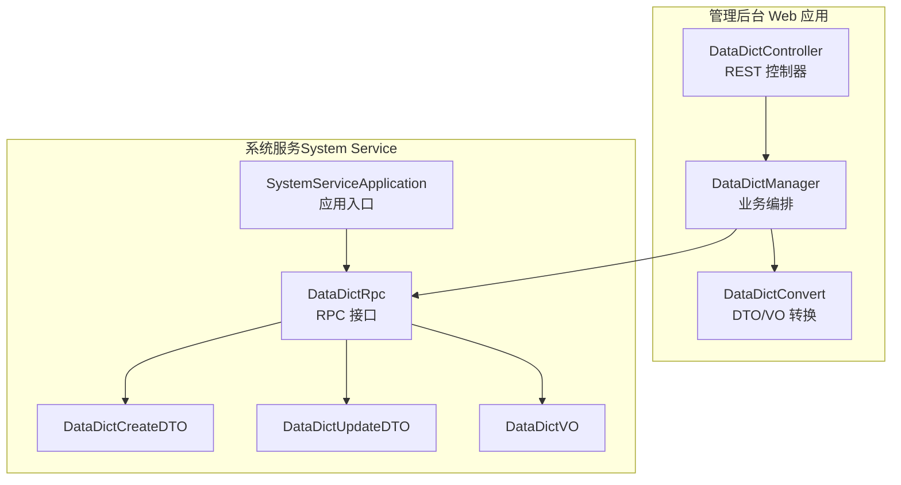
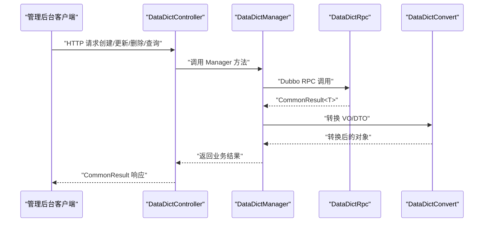
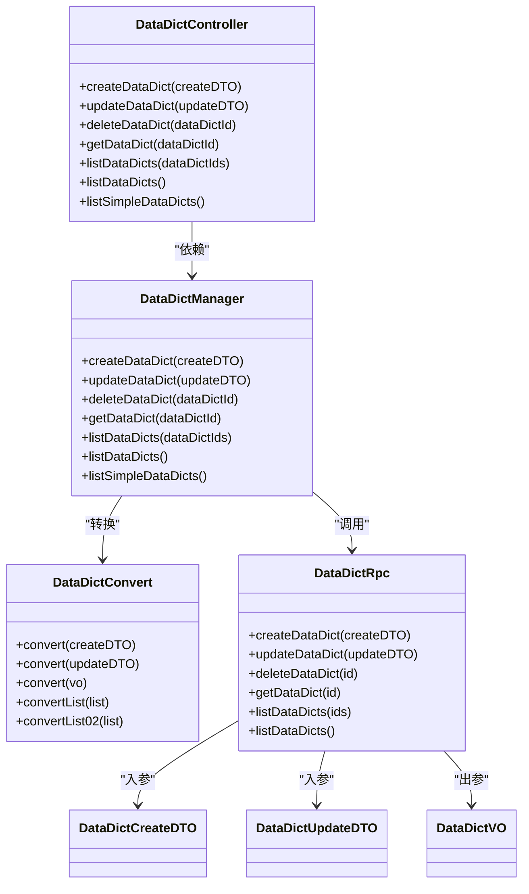
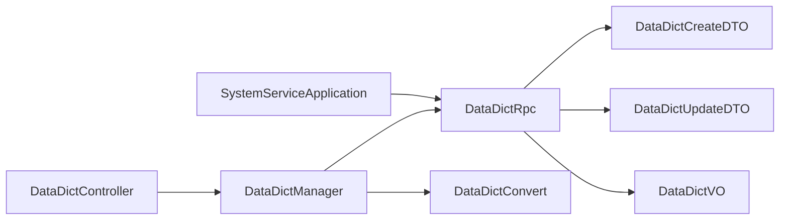

# 数据字典

<cite>
**本文引用的文件**
- [DataDictController.java](file://management-web-app/src/main/java/cn/iocoder/mall/managementweb/controller/datadict/DataDictController.java)
- [DataDictManager.java](file://management-web-app/src/main/java/cn/iocoder/mall/managementweb/manager/datadict/DataDictManager.java)
- [DataDictConvert.java](file://management-web-app/src/main/java/cn/iocoder/mall/managementweb/convert/datadict/DataDictConvert.java)
- [DataDictRpc.java](file://system-service-project/system-service-api/src/main/java/cn/iocoder/mall/systemservice/rpc/datadict/DataDictRpc.java)
- [DataDictCreateDTO.java](file://system-service-project/system-service-api/src/main/java/cn/iocoder/mall/systemservice/rpc/datadict/dto/DataDictCreateDTO.java)
- [DataDictUpdateDTO.java](file://system-service-project/system-service-api/src/main/java/cn/iocoder/mall/systemservice/rpc/datadict/dto/DataDictUpdateDTO.java)
- [DataDictVO.java](file://system-service-project/system-service-api/src/main/java/cn/iocoder/mall/systemservice/rpc/datadict/vo/DataDictVO.java)
- [SystemServiceApplication.java](file://system-service-project/system-service-app/src/main/java/cn/iocoder/mall/systemservice/SystemServiceApplication.java)
</cite>

## 目录
1. [简介](#简介)
2. [项目结构](#项目结构)
3. [核心组件](#核心组件)
4. [架构总览](#架构总览)
5. [详细组件分析](#详细组件分析)
6. [依赖分析](#依赖分析)
7. [性能考虑](#性能考虑)
8. [故障排查指南](#故障排查指南)
9. [结论](#结论)
10. [附录](#附录)

## 简介
本技术文档围绕数据字典系统展开，系统采用前后端分离与微服务架构，通过管理后台 Web 应用暴露 REST 接口，调用系统服务（System Service）提供的 RPC 接口完成数据字典的增删改查、列表查询与排序等能力。数据字典包含“大类枚举值”“小类数值”“展示名”“排序值”“备注”等元数据，并支持按枚举值与排序字段进行稳定排序；同时提供精简版列表接口，便于前端缓存与渲染。

## 项目结构
数据字典相关代码分布在两个模块中：
- 管理后台 Web 应用：负责对外暴露 HTTP 接口、鉴权与权限校验、调用系统服务 RPC、结果转换与返回。
- 系统服务（System Service）：定义 RPC 接口、传输对象与 VO，承载业务逻辑与持久化交互。

图表来源
- [DataDictController.java:1-89](file://management-web-app/src/main/java/cn/iocoder/mall/managementweb/controller/datadict/DataDictController.java#L1-L89)
- [DataDictManager.java:1-114](file://management-web-app/src/main/java/cn/iocoder/mall/managementweb/manager/datadict/DataDictManager.java#L1-L114)
- [DataDictConvert.java:1-28](file://management-web-app/src/main/java/cn/iocoder/mall/managementweb/convert/datadict/DataDictConvert.java#L1-L28)
- [DataDictRpc.java:1-61](file://system-service-project/system-service-api/src/main/java/cn/iocoder/mall/systemservice/rpc/datadict/DataDictRpc.java#L1-L61)
- [DataDictCreateDTO.java:1-43](file://system-service-project/system-service-api/src/main/java/cn/iocoder/mall/systemservice/rpc/datadict/dto/DataDictCreateDTO.java#L1-L43)
- [DataDictUpdateDTO.java:1-48](file://system-service-project/system-service-api/src/main/java/cn/iocoder/mall/systemservice/rpc/datadict/dto/DataDictUpdateDTO.java#L1-L48)
- [DataDictVO.java:1-46](file://system-service-project/system-service-api/src/main/java/cn/iocoder/mall/systemservice/rpc/datadict/vo/DataDictVO.java#L1-L46)
- [SystemServiceApplication.java:1-14](file://system-service-project/system-service-app/src/main/java/cn/iocoder/mall/systemservice/SystemServiceApplication.java#L1-L14)

章节来源
- [DataDictController.java:1-89](file://management-web-app/src/main/java/cn/iocoder/mall/managementweb/controller/datadict/DataDictController.java#L1-L89)
- [DataDictManager.java:1-114](file://management-web-app/src/main/java/cn/iocoder/mall/managementweb/manager/datadict/DataDictManager.java#L1-L114)
- [DataDictConvert.java:1-28](file://management-web-app/src/main/java/cn/iocoder/mall/managementweb/convert/datadict/DataDictConvert.java#L1-L28)
- [DataDictRpc.java:1-61](file://system-service-project/system-service-api/src/main/java/cn/iocoder/mall/systemservice/rpc/datadict/DataDictRpc.java#L1-L61)
- [DataDictCreateDTO.java:1-43](file://system-service-project/system-service-api/src/main/java/cn/iocoder/mall/systemservice/rpc/datadict/dto/DataDictCreateDTO.java#L1-L43)
- [DataDictUpdateDTO.java:1-48](file://system-service-project/system-service-api/src/main/java/cn/iocoder/mall/systemservice/rpc/datadict/dto/DataDictUpdateDTO.java#L1-L48)
- [DataDictVO.java:1-46](file://system-service-project/system-service-api/src/main/java/cn/iocoder/mall/systemservice/rpc/datadict/vo/DataDictVO.java#L1-L46)
- [SystemServiceApplication.java:1-14](file://system-service-project/system-service-app/src/main/java/cn/iocoder/mall/systemservice/SystemServiceApplication.java#L1-L14)

## 核心组件
- REST 控制器：提供创建、更新、删除、单条查询、批量查询、全量查询以及精简全量查询等接口，统一鉴权与权限校验。
- Manager：封装 RPC 调用、错误检查与结果转换，负责排序与返回格式统一。
- Convert：基于 MapStruct 的 DTO/VO 转换器，保证前后端数据结构一致。
- RPC 接口：定义数据字典的增删改查与列表查询契约，返回统一的结果包装。
- DTO/VO：定义创建、更新、查询时的数据结构与字段约束。

章节来源
- [DataDictController.java:25-89](file://management-web-app/src/main/java/cn/iocoder/mall/managementweb/controller/datadict/DataDictController.java#L25-L89)
- [DataDictManager.java:19-114](file://management-web-app/src/main/java/cn/iocoder/mall/managementweb/manager/datadict/DataDictManager.java#L19-L114)
- [DataDictConvert.java:12-27](file://management-web-app/src/main/java/cn/iocoder/mall/managementweb/convert/datadict/DataDictConvert.java#L12-L27)
- [DataDictRpc.java:10-61](file://system-service-project/system-service-api/src/main/java/cn/iocoder/mall/systemservice/rpc/datadict/DataDictRpc.java#L10-L61)
- [DataDictCreateDTO.java:10-43](file://system-service-project/system-service-api/src/main/java/cn/iocoder/mall/systemservice/rpc/datadict/dto/DataDictCreateDTO.java#L10-L43)
- [DataDictUpdateDTO.java:10-48](file://system-service-project/system-service-api/src/main/java/cn/iocoder/mall/systemservice/rpc/datadict/dto/DataDictUpdateDTO.java#L10-L48)
- [DataDictVO.java:9-46](file://system-service-project/system-service-api/src/main/java/cn/iocoder/mall/systemservice/rpc/datadict/vo/DataDictVO.java#L9-L46)

## 架构总览
数据字典的调用链路从管理后台控制器进入，经由 Manager 编排，最终通过 Dubbo 调用系统服务的 RPC 接口。返回结果统一由 Convert 进行结构转换，再由控制器封装为通用响应返回。

图表来源
- [DataDictController.java:34-86](file://management-web-app/src/main/java/cn/iocoder/mall/managementweb/controller/datadict/DataDictController.java#L34-L86)
- [DataDictManager.java:35-111](file://management-web-app/src/main/java/cn/iocoder/mall/managementweb/manager/datadict/DataDictManager.java#L35-L111)
- [DataDictConvert.java:17-26](file://management-web-app/src/main/java/cn/iocoder/mall/managementweb/convert/datadict/DataDictConvert.java#L17-L26)
- [DataDictRpc.java:21-58](file://system-service-project/system-service-api/src/main/java/cn/iocoder/mall/systemservice/rpc/datadict/DataDictRpc.java#L21-L58)

## 详细组件分析

### 控制器层（DataDictController）
- 提供 REST 接口：
  - 创建：POST /data-dict/create
  - 更新：POST /data-dict/update
  - 删除：POST /data-dict/delete
  - 单条查询：GET /data-dict/get
  - 批量查询：GET /data-dict/list
  - 全量查询：GET /data-dict/list-all
  - 全量精简查询：GET /data-dict/list-all-simple
- 权限控制：使用注解对各接口进行权限校验，如 system:data-dict:create、system:data-dict:update、system:data-dict:delete、system:data-dict:list。
- 返回封装：统一使用 CommonResult 包装响应。

章节来源
- [DataDictController.java:25-89](file://management-web-app/src/main/java/cn/iocoder/mall/managementweb/controller/datadict/DataDictController.java#L25-L89)

### 管理编排层（DataDictManager）
- 职责：
  - 组织 RPC 调用，统一错误检查。
  - 对全量查询结果按 enumValue 与 sort 字段进行稳定排序。
  - 提供精简版列表接口，仅返回必要字段，便于前端缓存。
- 关键点：
  - 使用 Dubbo 注解引用系统服务 RPC。
  - 转换层调用由 Convert 完成，确保类型安全与字段一致性。

章节来源
- [DataDictManager.java:19-114](file://management-web-app/src/main/java/cn/iocoder/mall/managementweb/manager/datadict/DataDictManager.java#L19-L114)

### 转换层（DataDictConvert）
- 作用：将管理后台 DTO/VO 与系统服务 DTO/VO 进行双向转换。
- 特性：MapStruct 自动生成实现，提升转换效率与可维护性。

章节来源
- [DataDictConvert.java:12-27](file://management-web-app/src/main/java/cn/iocoder/mall/managementweb/convert/datadict/DataDictConvert.java#L12-L27)

### RPC 接口层（DataDictRpc）
- 定义：
  - createDataDict：创建并返回编号
  - updateDataDict：更新
  - deleteDataDict：删除
  - getDataDict：按编号获取
  - listDataDicts：按编号列表获取
  - listDataDicts：全量获取
- 返回：统一使用 CommonResult<T> 包装，便于上层统一处理。

章节来源
- [DataDictRpc.java:10-61](file://system-service-project/system-service-api/src/main/java/cn/iocoder/mall/systemservice/rpc/datadict/DataDictRpc.java#L10-L61)

### 数据模型与传输对象
- DataDictCreateDTO：创建时的输入对象，包含大类枚举值、小类数值、展示名、排序值、备注等字段。
- DataDictUpdateDTO：更新时的输入对象，包含编号、大类枚举值、小类数值、展示名、排序值、备注等字段。
- DataDictVO：查询返回的对象，包含编号、大类枚举值、小类数值、展示名、排序值、备注、创建时间等字段。

章节来源
- [DataDictCreateDTO.java:10-43](file://system-service-project/system-service-api/src/main/java/cn/iocoder/mall/systemservice/rpc/datadict/dto/DataDictCreateDTO.java#L10-L43)
- [DataDictUpdateDTO.java:10-48](file://system-service-project/system-service-api/src/main/java/cn/iocoder/mall/systemservice/rpc/datadict/dto/DataDictUpdateDTO.java#L10-L48)
- [DataDictVO.java:9-46](file://system-service-project/system-service-api/src/main/java/cn/iocoder/mall/systemservice/rpc/datadict/vo/DataDictVO.java#L9-L46)

### 类关系图

图表来源
- [DataDictController.java:25-89](file://management-web-app/src/main/java/cn/iocoder/mall/managementweb/controller/datadict/DataDictController.java#L25-L89)
- [DataDictManager.java:19-114](file://management-web-app/src/main/java/cn/iocoder/mall/managementweb/manager/datadict/DataDictManager.java#L19-L114)
- [DataDictConvert.java:12-27](file://management-web-app/src/main/java/cn/iocoder/mall/managementweb/convert/datadict/DataDictConvert.java#L12-L27)
- [DataDictRpc.java:10-61](file://system-service-project/system-service-api/src/main/java/cn/iocoder/mall/systemservice/rpc/datadict/DataDictRpc.java#L10-L61)
- [DataDictCreateDTO.java:10-43](file://system-service-project/system-service-api/src/main/java/cn/iocoder/mall/systemservice/rpc/datadict/dto/DataDictCreateDTO.java#L10-L43)
- [DataDictUpdateDTO.java:10-48](file://system-service-project/system-service-api/src/main/java/cn/iocoder/mall/systemservice/rpc/datadict/dto/DataDictUpdateDTO.java#L10-L48)
- [DataDictVO.java:9-46](file://system-service-project/system-service-api/src/main/java/cn/iocoder/mall/systemservice/rpc/datadict/vo/DataDictVO.java#L9-L46)

## 依赖分析
- 控制器依赖管理编排层，管理编排层依赖 RPC 接口与转换层。
- 管理编排层通过 Dubbo 引用系统服务 RPC，实现远程调用。
- 转换层作为中间层，屏蔽前后端对象差异，降低耦合度。
- 应用入口位于系统服务模块，负责启动 RPC 服务。

图表来源
- [DataDictController.java:25-89](file://management-web-app/src/main/java/cn/iocoder/mall/managementweb/controller/datadict/DataDictController.java#L25-L89)
- [DataDictManager.java:19-114](file://management-web-app/src/main/java/cn/iocoder/mall/managementweb/manager/datadict/DataDictManager.java#L19-L114)
- [DataDictConvert.java:12-27](file://management-web-app/src/main/java/cn/iocoder/mall/managementweb/convert/datadict/DataDictConvert.java#L12-L27)
- [DataDictRpc.java:10-61](file://system-service-project/system-service-api/src/main/java/cn/iocoder/mall/systemservice/rpc/datadict/DataDictRpc.java#L10-L61)
- [SystemServiceApplication.java:1-14](file://system-service-project/system-service-app/src/main/java/cn/iocoder/mall/systemservice/SystemServiceApplication.java#L1-L14)

章节来源
- [DataDictController.java:25-89](file://management-web-app/src/main/java/cn/iocoder/mall/managementweb/controller/datadict/DataDictController.java#L25-L89)
- [DataDictManager.java:19-114](file://management-web-app/src/main/java/cn/iocoder/mall/managementweb/manager/datadict/DataDictManager.java#L19-L114)
- [DataDictConvert.java:12-27](file://management-web-app/src/main/java/cn/iocoder/mall/managementweb/convert/datadict/DataDictConvert.java#L12-L27)
- [DataDictRpc.java:10-61](file://system-service-project/system-service-api/src/main/java/cn/iocoder/mall/systemservice/rpc/datadict/DataDictRpc.java#L10-L61)
- [SystemServiceApplication.java:1-14](file://system-service-project/system-service-app/src/main/java/cn/iocoder/mall/systemservice/SystemServiceApplication.java#L1-L14)

## 性能考虑
- 排序优化：管理编排层对全量数据按 enumValue 与 sort 进行稳定排序，确保前端展示一致性与可预期性。
- 精简接口：提供 list-all-simple 接口，减少字段数量与网络开销，适合前端缓存与快速渲染。
- 转换效率：使用 MapStruct 进行 DTO/VO 转换，避免手写映射带来的性能损耗与维护成本。
- 缓存策略：当前仓库未发现 Redis 缓存或缓存失效、缓存穿透防护的具体实现。建议在系统服务侧引入缓存层（如 Redis），结合版本号或时间戳实现缓存更新与失效，配合布隆过滤器缓解缓存穿透风险。

## 故障排查指南
- 权限不足：若出现接口 403，请确认是否具备 system:data-dict:* 权限。
- 参数校验失败：创建/更新接口对字段进行非空校验，需确保 enumValue、value、displayName、sort 等字段有效。
- RPC 调用异常：管理编排层统一检查 CommonResult 错误码，定位系统服务侧异常或网络问题。
- 排序不一致：全量查询默认按 enumValue 与 sort 排序，若前端显示异常，检查传入参数与排序逻辑。

章节来源
- [DataDictController.java:34-86](file://management-web-app/src/main/java/cn/iocoder/mall/managementweb/controller/datadict/DataDictController.java#L34-L86)
- [DataDictManager.java:35-111](file://management-web-app/src/main/java/cn/iocoder/mall/managementweb/manager/datadict/DataDictManager.java#L35-L111)
- [DataDictCreateDTO.java:20-36](file://system-service-project/system-service-api/src/main/java/cn/iocoder/mall/systemservice/rpc/datadict/dto/DataDictCreateDTO.java#L20-L36)
- [DataDictUpdateDTO.java:20-41](file://system-service-project/system-service-api/src/main/java/cn/iocoder/mall/systemservice/rpc/datadict/dto/DataDictUpdateDTO.java#L20-L41)

## 结论
数据字典系统以清晰的分层设计实现了稳定的增删改查能力，结合权限控制与统一响应包装，满足管理后台的使用需求。当前实现侧重于接口与数据模型层面，建议后续在系统服务侧补充缓存策略与版本管理，以进一步提升性能与可维护性。

## 附录
- 应用启动：系统服务应用入口负责启动 RPC 服务，确保数据字典相关 RPC 可被调用。

章节来源
- [SystemServiceApplication.java:1-14](file://system-service-project/system-service-app/src/main/java/cn/iocoder/mall/systemservice/SystemServiceApplication.java#L1-L14)