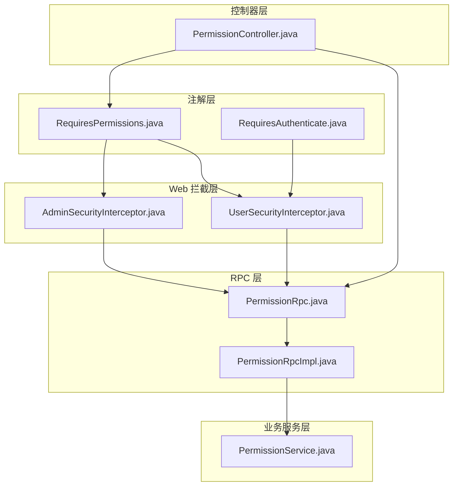
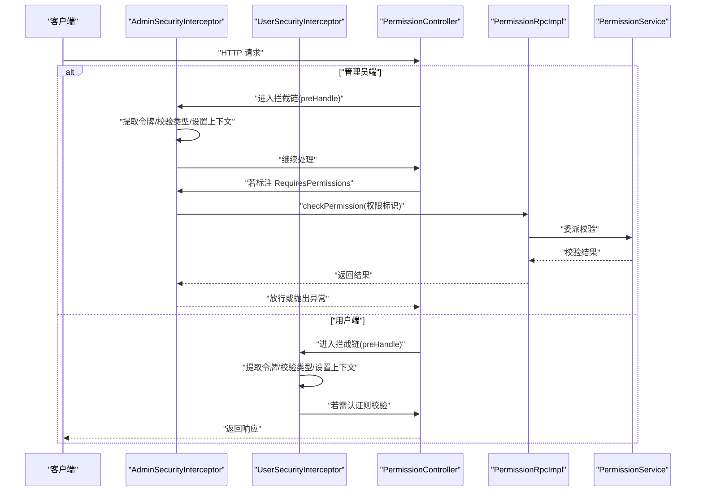
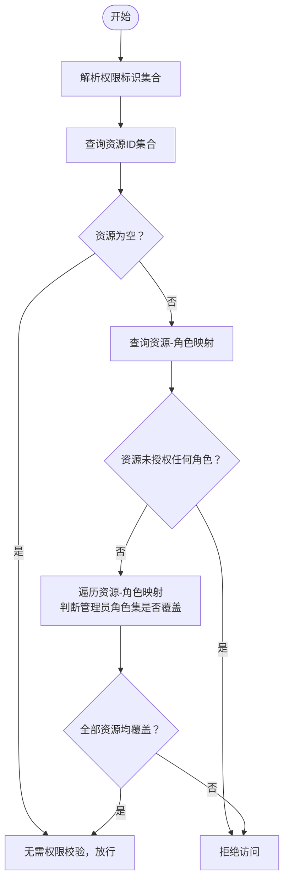
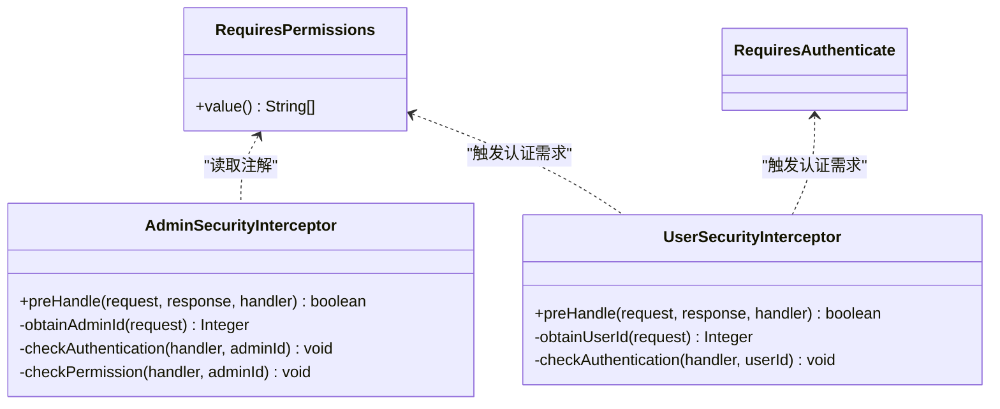
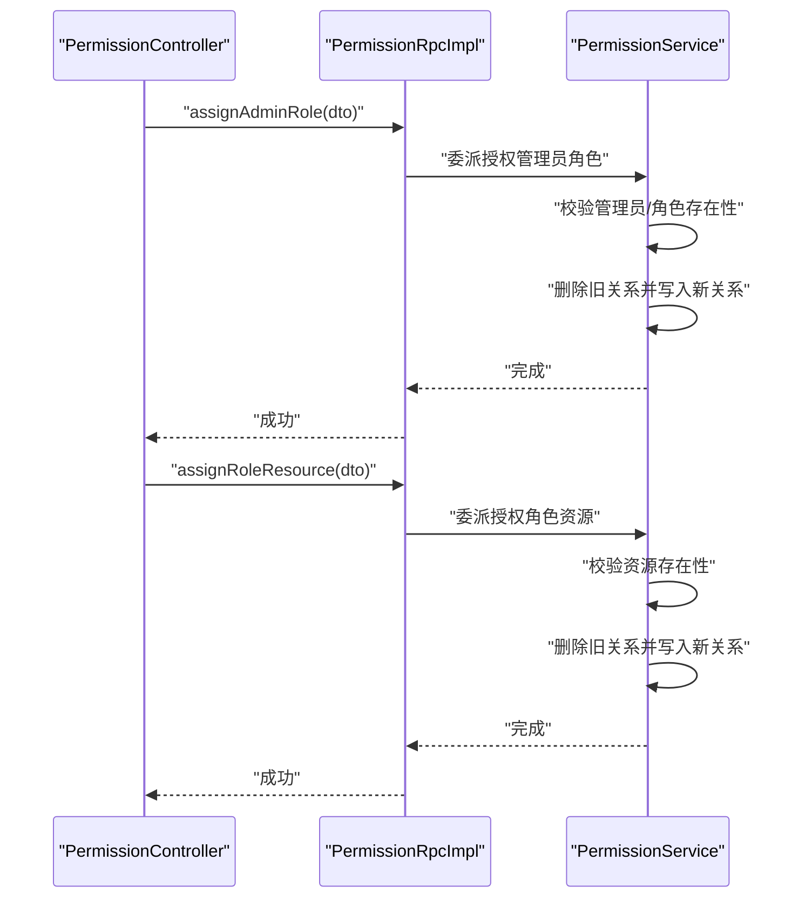
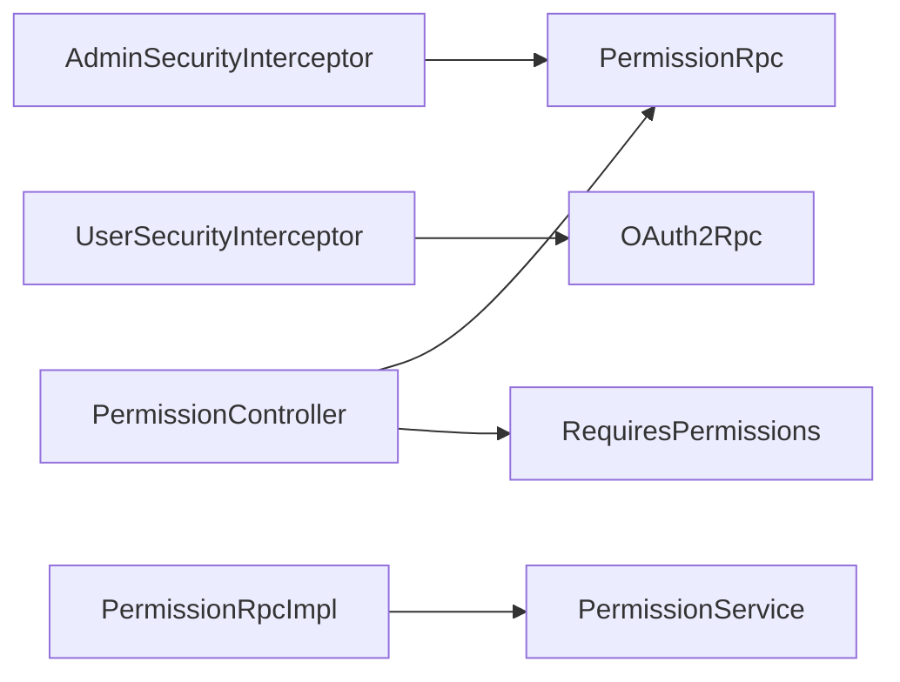

# 权限控制

<cite>
**本文引用的文件**
- [RequiresPermissions.java](file://common/mall-security-annotations/src/main/java/cn/iocoder/security/annotations/RequiresPermissions.java)
- [RequiresAuthenticate.java](file://common/mall-security-annotations/src/main/java/cn/iocoder/security/annotations/RequiresAuthenticate.java)
- [AdminSecurityInterceptor.java](file://common/mall-spring-boot-starter-security-admin/src/main/java/cn/iocoder/mall/security/admin/core/interceptor/AdminSecurityInterceptor.java)
- [UserSecurityInterceptor.java](file://common/mall-spring-boot-starter-security-user/src/main/java/cn/iocoder/mall/security/user/core/interceptor/UserSecurityInterceptor.java)
- [PermissionRpc.java](file://system-service-project/system-service-api/src/main/java/cn/iocoder/mall/systemservice/rpc/permission/PermissionRpc.java)
- [PermissionRpcImpl.java](file://system-service-project/system-service-app/src/main/java/cn/iocoder/mall/systemservice/rpc/permission/PermissionRpcImpl.java)
- [PermissionService.java](file://system-service-project/system-service-app/src/main/java/cn/iocoder/mall/systemservice/service/permission/PermissionService.java)
- [PermissionController.java](file://management-web-app/src/main/java/cn/iocoder/mall/managementweb/controller/permission/PermissionController.java)
</cite>

## 目录
1. [引言](#引言)
2. [项目结构](#项目结构)
3. [核心组件](#核心组件)
4. [架构总览](#架构总览)
5. [详细组件分析](#详细组件分析)
6. [依赖分析](#依赖分析)
7. [性能考虑](#性能考虑)
8. [故障排查指南](#故障排查指南)
9. [结论](#结论)
10. [附录](#附录)

## 引言
本文件面向权限控制系统，围绕 RBAC（基于角色的访问控制）模型，系统性梳理“用户、角色、资源、权限”四要素及它们之间的关系；详解权限分配机制（管理员角色分配、角色资源授权、权限继承规则）、资源类型分类（菜单、按钮、接口等）、权限检查实现（动态权限验证、权限缓存优化、权限过期处理），并给出架构图与最佳实践（权限注解、AOP 拦截器、异常处理）。

## 项目结构
权限控制由“注解层 + Web 拦截层 + RPC 层 + 业务服务层 + 控制器层”构成，采用分层清晰、职责分离的设计：
- 注解层：提供权限与认证注解，用于在控制器方法上声明式标注。
- Web 拦截层：分别针对管理员与普通用户，完成认证与权限检查。
- RPC 层：对外暴露权限相关能力，供其他模块调用。
- 业务服务层：实现权限校验、角色与资源映射、管理员角色分配等核心逻辑。
- 控制器层：提供权限管理的管理端接口，受注解保护。

图表来源
- [RequiresPermissions.java:1-25](file://common/mall-security-annotations/src/main/java/cn/iocoder/security/annotations/RequiresPermissions.java#L1-L25)
- [RequiresAuthenticate.java:1-78](file://common/mall-spring-boot-starter-security-user/src/main/java/cn/iocoder/mall/security/user/core/interceptor/UserSecurityInterceptor.java#L1-L78)
- [AdminSecurityInterceptor.java:1-97](file://common/mall-spring-boot-starter-security-admin/src/main/java/cn/iocoder/mall/security/admin/core/interceptor/AdminSecurityInterceptor.java#L1-L97)
- [UserSecurityInterceptor.java:1-78](file://common/mall-spring-boot-starter-security-user/src/main/java/cn/iocoder/mall/security/user/core/interceptor/UserSecurityInterceptor.java#L1-L78)
- [PermissionRpc.java:1-69](file://system-service-project/system-service-api/src/main/java/cn/iocoder/mall/systemservice/rpc/permission/PermissionRpc.java#L1-L69)
- [PermissionRpcImpl.java:1-60](file://system-service-project/system-service-app/src/main/java/cn/iocoder/mall/systemservice/rpc/permission/PermissionRpcImpl.java#L1-L60)
- [PermissionService.java:1-167](file://system-service-project/system-service-app/src/main/java/cn/iocoder/mall/systemservice/service/permission/PermissionService.java#L1-L167)
- [PermissionController.java:1-67](file://management-web-app/src/main/java/cn/iocoder/mall/managementweb/controller/permission/PermissionController.java#L1-L67)

章节来源
- [RequiresPermissions.java:1-25](file://common/mall-security-annotations/src/main/java/cn/iocoder/security/annotations/RequiresPermissions.java#L1-L25)
- [RequiresAuthenticate.java:1-19](file://common/mall-security-annotations/src/main/java/cn/iocoder/security/annotations/RequiresAuthenticate.java#L1-L19)
- [AdminSecurityInterceptor.java:1-97](file://common/mall-spring-boot-starter-security-admin/src/main/java/cn/iocoder/mall/security/admin/core/interceptor/AdminSecurityInterceptor.java#L1-L97)
- [UserSecurityInterceptor.java:1-78](file://common/mall-spring-boot-starter-security-user/src/main/java/cn/iocoder/mall/security/user/core/interceptor/UserSecurityInterceptor.java#L1-L78)
- [PermissionRpc.java:1-69](file://system-service-project/system-service-api/src/main/java/cn/iocoder/mall/systemservice/rpc/permission/PermissionRpc.java#L1-L69)
- [PermissionRpcImpl.java:1-60](file://system-service-project/system-service-app/src/main/java/cn/iocoder/mall/systemservice/rpc/permission/PermissionRpcImpl.java#L1-L60)
- [PermissionService.java:1-167](file://system-service-project/system-service-app/src/main/java/cn/iocoder/mall/systemservice/service/permission/PermissionService.java#L1-L167)
- [PermissionController.java:1-67](file://management-web-app/src/main/java/cn/iocoder/mall/managementweb/controller/permission/PermissionController.java#L1-L67)

## 核心组件
- 权限注解
  - RequiresPermissions：在控制器方法上声明所需权限标识，拦截器在 preHandle 阶段调用 RPC 进行校验。
  - RequiresAuthenticate：要求用户已登录，用于显式声明需要认证的接口。
- 管理端安全拦截器（AdminSecurityInterceptor）
  - 提取访问令牌，校验用户类型为管理员，设置上下文；随后对标注 RequiresPermissions 的方法执行权限校验。
- 用户端安全拦截器（UserSecurityInterceptor）
  - 提取访问令牌，校验用户类型为普通用户；当方法标注 RequiresAuthenticate 或 RequiresPermissions 时，要求已登录。
- 权限 RPC 接口与实现
  - PermissionRpc：定义角色资源查询、角色资源授权、管理员角色查询/授权、权限校验等能力。
  - PermissionRpcImpl：将 RPC 调用委托给 PermissionManager。
- 权限服务（PermissionService）
  - 实现权限校验的核心逻辑：根据权限标识解析资源，再根据管理员所拥有的角色集合判断其是否具备相应资源授权。
- 权限控制器（PermissionController）
  - 提供角色资源授权、管理员角色授权等管理端接口，并通过注解保护。

章节来源
- [RequiresPermissions.java:1-25](file://common/mall-security-annotations/src/main/java/cn/iocoder/security/annotations/RequiresPermissions.java#L1-L25)
- [RequiresAuthenticate.java:1-19](file://common/mall-security-annotations/src/main/java/cn/iocoder/security/annotations/RequiresAuthenticate.java#L1-L19)
- [AdminSecurityInterceptor.java:1-97](file://common/mall-spring-boot-starter-security-admin/src/main/java/cn/iocoder/mall/security/admin/core/interceptor/AdminSecurityInterceptor.java#L1-L97)
- [UserSecurityInterceptor.java:1-78](file://common/mall-spring-boot-starter-security-user/src/main/java/cn/iocoder/mall/security/user/core/interceptor/UserSecurityInterceptor.java#L1-L78)
- [PermissionRpc.java:1-69](file://system-service-project/system-service-api/src/main/java/cn/iocoder/mall/systemservice/rpc/permission/PermissionRpc.java#L1-L69)
- [PermissionRpcImpl.java:1-60](file://system-service-project/system-service-app/src/main/java/cn/iocoder/mall/systemservice/rpc/permission/PermissionRpcImpl.java#L1-L60)
- [PermissionService.java:1-167](file://system-service-project/system-service-app/src/main/java/cn/iocoder/mall/systemservice/service/permission/PermissionService.java#L1-L167)
- [PermissionController.java:1-67](file://management-web-app/src/main/java/cn/iocoder/mall/managementweb/controller/permission/PermissionController.java#L1-L67)

## 架构总览
下图展示从 Web 请求到权限校验的整体流程，以及各组件间的依赖关系。

图表来源
- [AdminSecurityInterceptor.java:36-88](file://common/mall-spring-boot-starter-security-admin/src/main/java/cn/iocoder/mall/security/admin/core/interceptor/AdminSecurityInterceptor.java#L36-L88)
- [UserSecurityInterceptor.java:29-69](file://common/mall-spring-boot-starter-security-user/src/main/java/cn/iocoder/mall/security/user/core/interceptor/UserSecurityInterceptor.java#L29-L69)
- [PermissionRpcImpl.java:53-57](file://system-service-project/system-service-app/src/main/java/cn/iocoder/mall/systemservice/rpc/permission/PermissionRpcImpl.java#L53-L57)
- [PermissionService.java:144-164](file://system-service-project/system-service-app/src/main/java/cn/iocoder/mall/systemservice/service/permission/PermissionService.java#L144-L164)
- [PermissionController.java:37-64](file://management-web-app/src/main/java/cn/iocoder/mall/managementweb/controller/permission/PermissionController.java#L37-L64)

## 详细组件分析

### RBAC 模型与数据流
- 四要素关系
  - 用户：管理员与普通用户两类，通过访问令牌中的用户类型区分。
  - 角色：管理员可拥有多个角色。
  - 资源：权限标识映射到资源记录，资源可被授予角色。
  - 权限：以权限标识表达，最终映射到资源集合，再与角色关联判断是否允许。
- 权限检查流程
  - 将权限标识集合转换为资源 ID 集合；
  - 查询这些资源被授予了哪些角色；
  - 若资源未授予任何角色，直接拒绝；
  - 否则，只要管理员所拥有的任意一个角色包含在该资源的授权角色集中，即视为通过。

图表来源
- [PermissionService.java:144-164](file://system-service-project/system-service-app/src/main/java/cn/iocoder/mall/systemservice/service/permission/PermissionService.java#L144-L164)

章节来源
- [PermissionService.java:144-164](file://system-service-project/system-service-app/src/main/java/cn/iocoder/mall/systemservice/service/permission/PermissionService.java#L144-L164)

### 权限注解与拦截器
- 注解
  - RequiresPermissions：在方法上声明所需权限标识数组，拦截器在 preHandle 阶段调用 RPC 校验。
  - RequiresAuthenticate：显式要求用户已登录，用于需要认证但不带权限标识的接口。
- 管理端拦截器
  - 提取访问令牌，校验用户类型为管理员，设置上下文；
  - 若方法标注 RequiresPermissions，则调用 PermissionRpc.checkPermission 完成校验。
- 用户端拦截器
  - 提取访问令牌，校验用户类型为普通用户；
  - 当方法标注 RequiresAuthenticate 或 RequiresPermissions 时，要求已登录。

图表来源
- [RequiresPermissions.java:15-22](file://common/mall-security-annotations/src/main/java/cn/iocoder/security/annotations/RequiresPermissions.java#L15-L22)
- [RequiresAuthenticate.java:17-18](file://common/mall-security-annotations/src/main/java/cn/iocoder/security/annotations/RequiresAuthenticate.java#L17-L18)
- [AdminSecurityInterceptor.java:36-88](file://common/mall-spring-boot-starter-security-admin/src/main/java/cn/iocoder/mall/security/admin/core/interceptor/AdminSecurityInterceptor.java#L36-L88)
- [UserSecurityInterceptor.java:29-69](file://common/mall-spring-boot-starter-security-user/src/main/java/cn/iocoder/mall/security/user/core/interceptor/UserSecurityInterceptor.java#L29-L69)

章节来源
- [RequiresPermissions.java:1-25](file://common/mall-security-annotations/src/main/java/cn/iocoder/security/annotations/RequiresPermissions.java#L1-L25)
- [RequiresAuthenticate.java:1-19](file://common/mall-security-annotations/src/main/java/cn/iocoder/security/annotations/RequiresAuthenticate.java#L1-L19)
- [AdminSecurityInterceptor.java:1-97](file://common/mall-spring-boot-starter-security-admin/src/main/java/cn/iocoder/mall/security/admin/core/interceptor/AdminSecurityInterceptor.java#L1-L97)
- [UserSecurityInterceptor.java:1-78](file://common/mall-spring-boot-starter-security-user/src/main/java/cn/iocoder/mall/security/user/core/interceptor/UserSecurityInterceptor.java#L1-L78)

### 权限分配与资源授权
- 管理员角色分配
  - 通过 PermissionRpc.assignAdminRole 授权管理员角色；
  - 服务层校验管理员存在与角色有效性后，替换旧的关系映射。
- 角色资源授权
  - 通过 PermissionRpc.assignRoleResource 授权角色资源；
  - 服务层校验资源存在性后，替换旧的关系映射。
- 资源查询
  - 支持按角色查询其资源 ID 列表；
  - 支持批量查询管理员的角色映射。

图表来源
- [PermissionController.java:42-64](file://management-web-app/src/main/java/cn/iocoder/mall/managementweb/controller/permission/PermissionController.java#L42-L64)
- [PermissionRpcImpl.java:32-51](file://system-service-project/system-service-app/src/main/java/cn/iocoder/mall/systemservice/rpc/permission/PermissionRpcImpl.java#L32-L51)
- [PermissionService.java:63-116](file://system-service-project/system-service-app/src/main/java/cn/iocoder/mall/systemservice/service/permission/PermissionService.java#L63-L116)

章节来源
- [PermissionController.java:1-67](file://management-web-app/src/main/java/cn/iocoder/mall/managementweb/controller/permission/PermissionController.java#L1-L67)
- [PermissionRpcImpl.java:1-60](file://system-service-project/system-service-app/src/main/java/cn/iocoder/mall/systemservice/rpc/permission/PermissionRpcImpl.java#L1-L60)
- [PermissionService.java:1-167](file://system-service-project/system-service-app/src/main/java/cn/iocoder/mall/systemservice/service/permission/PermissionService.java#L1-L167)

### 资源类型与权限控制
- 资源类型
  - 菜单资源：通常对应页面入口或导航项，权限标识用于控制菜单显示。
  - 按钮资源：对应页面上的操作按钮，权限标识用于控制按钮可用性。
  - 接口资源：对应后端 API，权限标识用于控制接口访问。
- 控制方式
  - 通过权限标识与资源映射，结合角色授权实现细粒度控制；
  - 管理端接口通过 RequiresPermissions 注解保护，拦截器统一校验。

章节来源
- [PermissionController.java:34-64](file://management-web-app/src/main/java/cn/iocoder/mall/managementweb/controller/permission/PermissionController.java#L34-L64)
- [AdminSecurityInterceptor.java:76-88](file://common/mall-spring-boot-starter-security-admin/src/main/java/cn/iocoder/mall/security/admin/core/interceptor/AdminSecurityInterceptor.java#L76-L88)

### 权限检查实现原理
- 动态权限验证
  - 基于权限标识集合解析资源 ID，再查询资源授权角色集合，最后与管理员角色集合比对。
- 权限缓存优化
  - 可在服务层或 RPC 层引入缓存（例如角色-资源映射缓存），减少重复查询；
  - 缓存键建议包含角色集合与权限标识集合，避免脏读。
- 权限过期处理
  - 在令牌刷新或角色变更时主动失效相关缓存；
  - 对于高并发场景，可采用版本号或时间戳标记缓存有效性。

章节来源
- [PermissionService.java:144-164](file://system-service-project/system-service-app/src/main/java/cn/iocoder/mall/systemservice/service/permission/PermissionService.java#L144-L164)

## 依赖分析
- 组件耦合
  - AdminSecurityInterceptor 与 PermissionRpc 强耦合，负责管理员端的认证与权限校验；
  - UserSecurityInterceptor 与 OAuth2Rpc 强耦合，负责用户端的认证；
  - PermissionRpcImpl 仅作为适配层，依赖 PermissionService 实现具体逻辑；
  - PermissionController 依赖注解与 PermissionRpc，提供管理端权限操作接口。
- 外部依赖
  - Dubbo 注解驱动的服务暴露与引用；
  - Spring MVC 拦截器链；
  - 通用框架异常与返回封装。

图表来源
- [AdminSecurityInterceptor.java:31-34](file://common/mall-spring-boot-starter-security-admin/src/main/java/cn/iocoder/mall/security/admin/core/interceptor/AdminSecurityInterceptor.java#L31-L34)
- [UserSecurityInterceptor.java:26-27](file://common/mall-spring-boot-starter-security-user/src/main/java/cn/iocoder/mall/security/user/core/interceptor/UserSecurityInterceptor.java#L26-L27)
- [PermissionRpcImpl.java:20-24](file://system-service-project/system-service-app/src/main/java/cn/iocoder/mall/systemservice/rpc/permission/PermissionRpcImpl.java#L20-L24)
- [PermissionController.java:31-32](file://management-web-app/src/main/java/cn/iocoder/mall/managementweb/controller/permission/PermissionController.java#L31-L32)

章节来源
- [AdminSecurityInterceptor.java:1-97](file://common/mall-spring-boot-starter-security-admin/src/main/java/cn/iocoder/mall/security/admin/core/interceptor/AdminSecurityInterceptor.java#L1-L97)
- [UserSecurityInterceptor.java:1-78](file://common/mall-spring-boot-starter-security-user/src/main/java/cn/iocoder/mall/security/user/core/interceptor/UserSecurityInterceptor.java#L1-L78)
- [PermissionRpcImpl.java:1-60](file://system-service-project/system-service-app/src/main/java/cn/iocoder/mall/systemservice/rpc/permission/PermissionRpcImpl.java#L1-L60)
- [PermissionController.java:1-67](file://management-web-app/src/main/java/cn/iocoder/mall/managementweb/controller/permission/PermissionController.java#L1-L67)

## 性能考虑
- 查询优化
  - 批量查询管理员角色映射（mapAdminRoleIds）减少多次 RPC 调用；
  - 对资源-角色映射建立索引，加速权限校验。
- 缓存策略
  - 缓存管理员角色集合与资源-角色映射；
  - 缓存失效策略：角色变更、资源授权变更时主动清理。
- 并发控制
  - 分布式锁或幂等设计，防止并发授权导致的数据不一致。

## 故障排查指南
- 未登录访问
  - 现象：返回未授权错误；
  - 排查：确认请求头携带令牌且用户类型正确；检查拦截器是否生效。
- 权限不足
  - 现象：返回禁止访问错误；
  - 排查：确认权限标识是否正确；确认资源是否已授权给角色；确认管理员是否拥有对应角色。
- 令牌类型错误
  - 现象：用户类型不匹配异常；
  - 排查：确认访问的是管理员端还是用户端接口；确认令牌签发与校验逻辑。
- 授权失败
  - 现象：角色或资源授权失败；
  - 排查：确认目标对象存在性；确认授权流程事务一致性。

章节来源
- [AdminSecurityInterceptor.java:53-56](file://common/mall-spring-boot-starter-security-admin/src/main/java/cn/iocoder/mall/security/admin/core/interceptor/AdminSecurityInterceptor.java#L53-L56)
- [UserSecurityInterceptor.java:44-47](file://common/mall-spring-boot-starter-security-user/src/main/java/cn/iocoder/mall/security/user/core/interceptor/UserSecurityInterceptor.java#L44-L47)
- [PermissionService.java:66-75](file://system-service-project/system-service-app/src/main/java/cn/iocoder/mall/systemservice/service/permission/PermissionService.java#L66-L75)
- [PermissionService.java:95-106](file://system-service-project/system-service-app/src/main/java/cn/iocoder/mall/systemservice/service/permission/PermissionService.java#L95-L106)

## 结论
本权限体系以 RBAC 为核心，通过注解声明、拦截器统一校验、RPC 抽象与服务层实现，形成从“声明-拦截-校验-授权”的闭环。系统支持管理员与普通用户双通道，具备良好的扩展性与可维护性。建议在生产环境中引入缓存与失效策略，确保性能与一致性。

## 附录
- 最佳实践清单
  - 使用 RequiresPermissions 明确标注接口所需权限；
  - 管理端接口默认需要登录，必要时显式标注 RequiresAuthenticate；
  - 授权操作采用事务保证角色-资源关系一致性；
  - 引入缓存与失效策略，提升权限校验性能；
  - 对异常进行统一处理，便于前端提示与日志追踪。