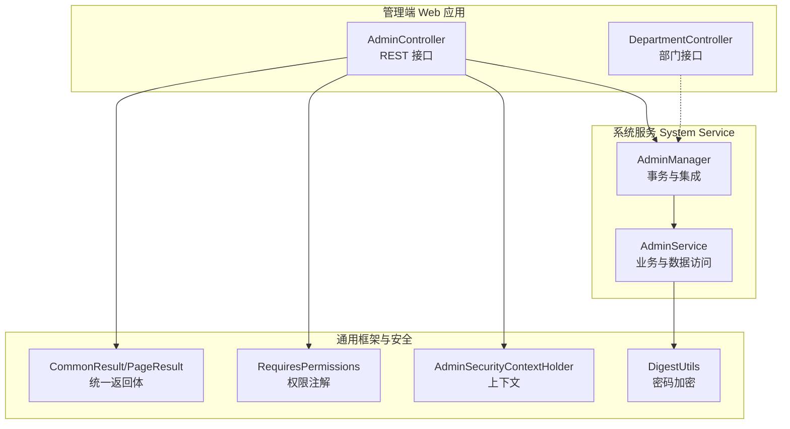
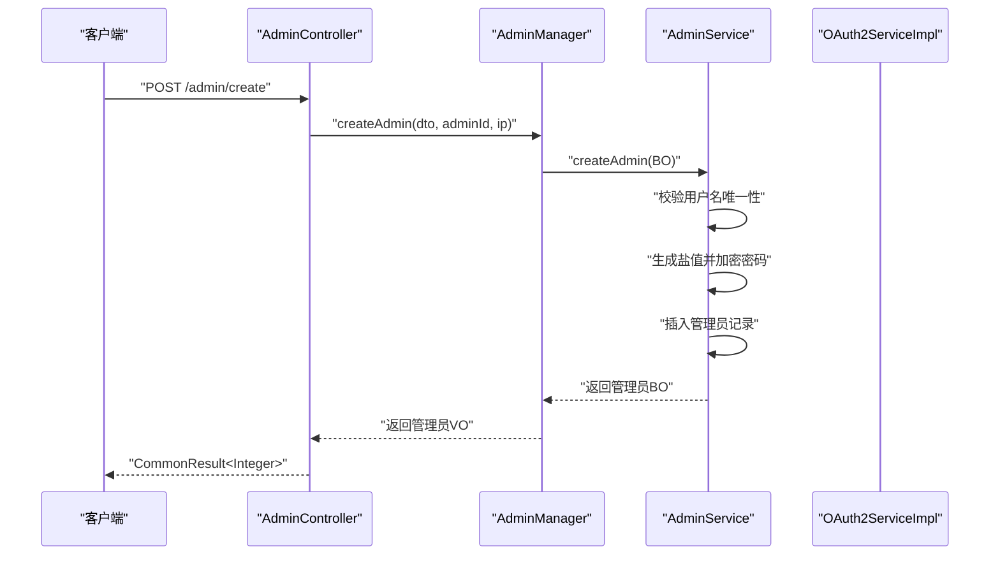
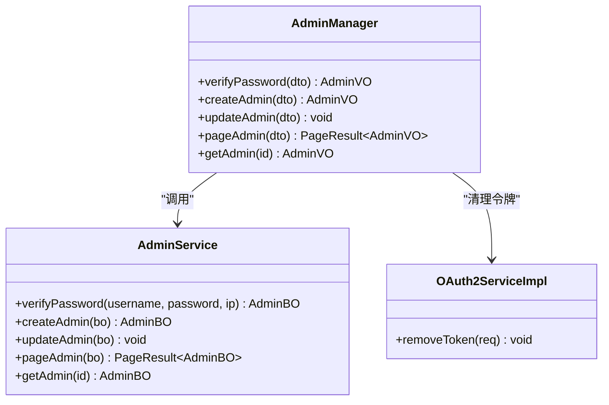
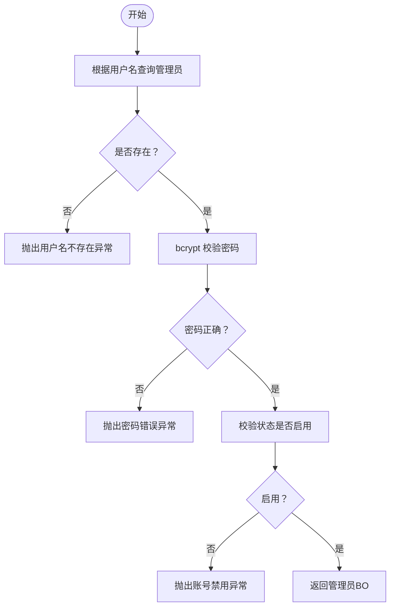
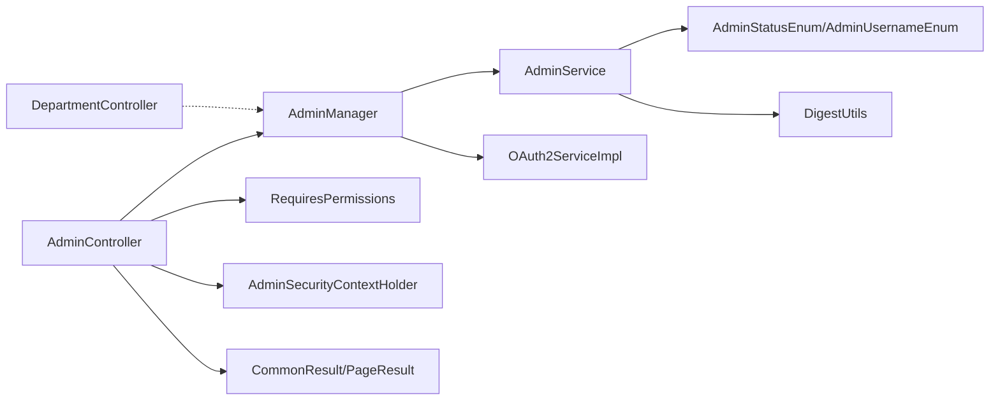
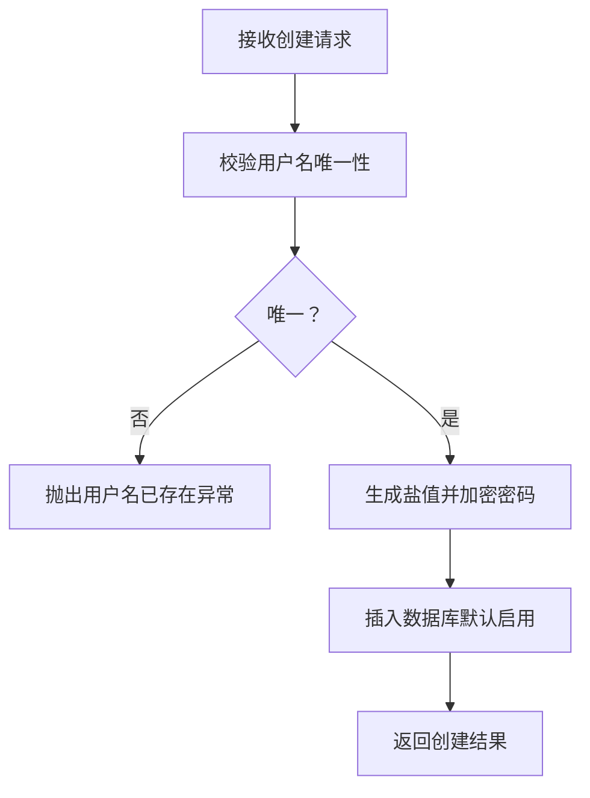

# 管理员管理

<cite>
**本文引用的文件**
- [AdminController.java](file://management-web-app/src/main/java/cn/iocoder/mall/managementweb/controller/admin/AdminController.java)
- [DepartmentController.java](file://management-web-app/src/main/java/cn/iocoder/mall/managementweb/controller/admin/DepartmentController.java)
- [AdminManager.java](file://system-service-project/system-service-app/src/main/java/cn/iocoder/mall/systemservice/manager/admin/AdminManager.java)
- [AdminService.java](file://system-service-project/system-service-app/src/main/java/cn/iocoder/mall/systemservice/service/admin/AdminService.java)
- [AdminStatusEnum.java](file://system-service-project/system-service-api/src/main/java/cn/iocoder/mall/systemservice/enums/admin/AdminStatusEnum.java)
- [AdminUsernameEnum.java](file://system-service-project/system-service-api/src/main/java/cn/iocoder/mall/systemservice/enums/admin/AdminUsernameEnum.java)
- [CommonStatusEnum.java](file://common/common-framework/src/main/java/cn/iocoder/common/framework/enums/CommonStatusEnum.java)
- [DigestUtils.java](file://common/common-framework/src/main/java/cn/iocoder/common/framework/util/DigestUtils.java)
- [PageResult.java](file://common/common-framework/src/main/java/cn/iocoder/common/framework/vo/PageResult.java)
- [CommonResult.java](file://common/common-framework/src/main/java/cn/iocoder/common/framework/vo/CommonResult.java)
- [RequiresPermissions.java](file://common/mall-security-annotations/src/main/java/cn/iocoder/security/annotations/RequiresPermissions.java)
- [AdminSecurityContextHolder.java](file://common/mall-security-annotations/src/main/java/cn/iocoder/security/core/context/AdminSecurityContextHolder.java)
- [HttpUtil.java](file://common/common-framework/src/main/java/cn/iocoder/common/framework/util/HttpUtil.java)
</cite>

## 目录
1. [简介](#简介)
2. [项目结构](#项目结构)
3. [核心组件](#核心组件)
4. [架构总览](#架构总览)
5. [详细组件分析](#详细组件分析)
6. [依赖关系分析](#依赖关系分析)
7. [性能考虑](#性能考虑)
8. [故障排查指南](#故障排查指南)
9. [结论](#结论)
10. [附录](#附录)

## 简介
本技术文档围绕“管理员管理”功能展开，系统性阐述管理员账户的全生命周期管理（创建、更新、删除、状态变更）、分页查询与详情获取、密码验证等核心能力，并说明管理员与部门的关联关系、状态枚举、用户名唯一性约束以及密码加密存储等安全机制。文档同时提供管理员管理流程图与接口调用示例，覆盖参数校验、异常处理、事务管理等最佳实践。

## 项目结构
管理员管理涉及三层：Web 控制层（管理端应用）、系统服务层（System Service），以及通用框架与安全注解支持。控制层负责暴露 REST 接口并进行权限校验；服务层封装业务逻辑与数据访问；框架层提供统一返回体、分页模型、工具类与安全注解。

图表来源
- [AdminController.java:1-68](file://management-web-app/src/main/java/cn/iocoder/mall/managementweb/controller/admin/AdminController.java#L1-68)
- [DepartmentController.java:1-82](file://management-web-app/src/main/java/cn/iocoder/mall/managementweb/controller/admin/DepartmentController.java#L1-82)
- [AdminManager.java:1-61](file://system-service-project/system-service-app/src/main/java/cn/iocoder/mall/systemservice/manager/admin/AdminManager.java#L1-61)
- [AdminService.java:1-123](file://system-service-project/system-service-app/src/main/java/cn/iocoder/mall/systemservice/service/admin/AdminService.java#L1-123)
- [CommonResult.java](file://common/common-framework/src/main/java/cn/iocoder/common/framework/vo/CommonResult.java)
- [PageResult.java](file://common/common-framework/src/main/java/cn/iocoder/common/framework/vo/PageResult.java)
- [RequiresPermissions.java](file://common/mall-security-annotations/src/main/java/cn/iocoder/security/annotations/RequiresPermissions.java)
- [AdminSecurityContextHolder.java](file://common/mall-security-annotations/src/main/java/cn/iocoder/security/core/context/AdminSecurityContextHolder.java)
- [DigestUtils.java](file://common/common-framework/src/main/java/cn/iocoder/common/framework/util/DigestUtils.java)

章节来源
- [AdminController.java:1-68](file://management-web-app/src/main/java/cn/iocoder/mall/managementweb/controller/admin/AdminController.java#L1-68)
- [DepartmentController.java:1-82](file://management-web-app/src/main/java/cn/iocoder/mall/managementweb/controller/admin/DepartmentController.java#L1-82)
- [AdminManager.java:1-61](file://system-service-project/system-service-app/src/main/java/cn/iocoder/mall/systemservice/manager/admin/AdminManager.java#L1-61)
- [AdminService.java:1-123](file://system-service-project/system-service-app/src/main/java/cn/iocoder/mall/systemservice/service/admin/AdminService.java#L1-123)

## 核心组件
- 控制器层
  - 管理员控制器：提供分页查询、创建、更新、状态更新等接口，并通过权限注解进行访问控制。
  - 部门控制器：提供部门的创建、更新、删除、查询与树形结构展示等接口。
- 管理层（Manager）
  - AdminManager：封装管理员业务流程，包含事务控制与与 OAuth2 的令牌清理集成。
- 服务层（Service）
  - AdminService：实现管理员密码验证、创建、更新、分页查询与详情获取等核心逻辑，包含用户名唯一性校验、密码加密与状态校验。
- 安全与框架
  - 权限注解与上下文：用于接口级权限校验与当前管理员上下文获取。
  - 统一返回体与分页模型：标准化响应格式与分页结果。
  - 密码加密工具：基于 bcrypt 的盐值生成与密码加密。

章节来源
- [AdminController.java:28-67](file://management-web-app/src/main/java/cn/iocoder/mall/managementweb/controller/admin/AdminController.java#L28-L67)
- [DepartmentController.java:22-81](file://management-web-app/src/main/java/cn/iocoder/mall/managementweb/controller/admin/DepartmentController.java#L22-L81)
- [AdminManager.java:21-60](file://system-service-project/system-service-app/src/main/java/cn/iocoder/mall/systemservice/manager/admin/AdminManager.java#L21-L60)
- [AdminService.java:22-122](file://system-service-project/system-service-app/src/main/java/cn/iocoder/mall/systemservice/service/admin/AdminService.java#L22-L122)
- [RequiresPermissions.java](file://common/mall-security-annotations/src/main/java/cn/iocoder/security/annotations/RequiresPermissions.java)
- [AdminSecurityContextHolder.java](file://common/mall-security-annotations/src/main/java/cn/iocoder/security/core/context/AdminSecurityContextHolder.java)
- [CommonResult.java](file://common/common-framework/src/main/java/cn/iocoder/common/framework/vo/CommonResult.java)
- [PageResult.java](file://common/common-framework/src/main/java/cn/iocoder/common/framework/vo/PageResult.java)
- [DigestUtils.java](file://common/common-framework/src/main/java/cn/iocoder/common/framework/util/DigestUtils.java)

## 架构总览
管理员管理采用典型的分层架构：Web 层暴露接口并进行权限拦截，Manager 层协调服务与外部系统（如 OAuth2），Service 层完成数据持久化与业务规则校验，框架层提供统一返回体与工具类。

图表来源
- [AdminController.java:44-49](file://management-web-app/src/main/java/cn/iocoder/mall/managementweb/controller/admin/AdminController.java#L44-L49)
- [AdminManager.java:35-38](file://system-service-project/system-service-app/src/main/java/cn/iocoder/mall/systemservice/manager/admin/AdminManager.java#L35-L38)
- [AdminService.java:59-74](file://system-service-project/system-service-app/src/main/java/cn/iocoder/mall/systemservice/service/admin/AdminService.java#L59-L74)

## 详细组件分析

### 管理员控制器（AdminController）
- 分页查询
  - 接口：GET /admin/page
  - 权限：system:admin:page
  - 输入：AdminPageDTO（分页参数由框架提供）
  - 输出：分页结果（PageResult<AdminPageItemVO>）
- 创建管理员
  - 接口：POST /admin/create
  - 权限：system:admin:create
  - 输入：AdminCreateDTO（包含用户名、密码、昵称、部门等）
  - 行为：获取当前管理员 ID 与请求 IP，调用 Manager 创建
- 更新管理员信息
  - 接口：POST /admin/update
  - 权限：system:admin:update
  - 输入：AdminUpdateInfoDTO（可包含昵称、手机号、邮箱等）
- 更新管理员状态
  - 接口：POST /admin/update-status
  - 权限：system:admin:update-status
  - 输入：AdminUpdateStatusDTO（状态值）

章节来源
- [AdminController.java:37-67](file://management-web-app/src/main/java/cn/iocoder/mall/managementweb/controller/admin/AdminController.java#L37-L67)

### 部门控制器（DepartmentController）
- 创建部门：POST /department/create
- 更新部门：POST /department/update
- 删除部门：POST /department/delete
- 获取部门详情：GET /department/get
- 批量获取部门：GET /department/list
- 获取部门树：GET /department/tree

章节来源
- [DepartmentController.java:34-79](file://management-web-app/src/main/java/cn/iocoder/mall/managementweb/controller/admin/DepartmentController.java#L34-L79)

### 管理员管理层（AdminManager）
- 密码验证：委托 Service 进行用户名与密码校验，返回 VO
- 创建管理员：转换 DTO 为 BO 后调用 Service 创建
- 更新管理员：在事务中执行更新；若修改密码或禁用管理员，调用 OAuth2 清理令牌
- 分页查询与详情：委托 Service 并进行 VO 转换

图表来源
- [AdminManager.java:21-60](file://system-service-project/system-service-app/src/main/java/cn/iocoder/mall/systemservice/manager/admin/AdminManager.java#L21-L60)
- [AdminService.java:22-122](file://system-service-project/system-service-app/src/main/java/cn/iocoder/mall/systemservice/service/admin/AdminService.java#L22-L122)

章节来源
- [AdminManager.java:29-59](file://system-service-project/system-service-app/src/main/java/cn/iocoder/mall/systemservice/manager/admin/AdminManager.java#L29-L59)

### 管理员服务层（AdminService）
- 密码验证流程
  - 根据用户名查询管理员记录
  - 使用 bcrypt 校验密码（含盐值）
  - 校验状态必须为启用
  - 返回 AdminBO
- 创建管理员流程
  - 校验用户名唯一性
  - 生成盐值并加密密码
  - 插入数据库，默认启用状态
- 更新管理员流程
  - 校验管理员存在性
  - 特殊账号（如 ADMIN、DEMO）禁止编辑
  - 若更新用户名，校验唯一性
  - 若更新状态，避免重复设置相同状态
  - 可选更新密码（重新生成盐值与加密）
  - 写入数据库
- 查询与详情
  - 分页查询与详情获取

图表来源
- [AdminService.java:36-53](file://system-service-project/system-service-app/src/main/java/cn/iocoder/mall/systemservice/service/admin/AdminService.java#L36-L53)

章节来源
- [AdminService.java:28-122](file://system-service-project/system-service-app/src/main/java/cn/iocoder/mall/systemservice/service/admin/AdminService.java#L28-L122)

### 安全与数据模型要点
- 状态枚举
  - AdminStatusEnum：管理员状态（启用/禁用）
  - CommonStatusEnum：通用状态（启用/禁用）用于默认状态赋值
- 用户名枚举
  - AdminUsernameEnum：特殊保留用户名（如 ADMIN、DEMO），禁止编辑
- 密码加密
  - DigestUtils.bcrypt：基于盐值的 bcrypt 加密
  - 每个管理员独立盐值，确保安全性
- 统一返回与分页
  - CommonResult：统一响应包装
  - PageResult：分页结果封装

章节来源
- [AdminStatusEnum.java](file://system-service-project/system-service-api/src/main/java/cn/iocoder/mall/systemservice/enums/admin/AdminStatusEnum.java)
- [AdminUsernameEnum.java](file://system-service-project/system-service-api/src/main/java/cn/iocoder/mall/systemservice/enums/admin/AdminUsernameEnum.java)
- [CommonStatusEnum.java](file://common/common-framework/src/main/java/cn/iocoder/common/framework/enums/CommonStatusEnum.java)
- [DigestUtils.java](file://common/common-framework/src/main/java/cn/iocoder/common/framework/util/DigestUtils.java)
- [CommonResult.java](file://common/common-framework/src/main/java/cn/iocoder/common/framework/vo/CommonResult.java)
- [PageResult.java](file://common/common-framework/src/main/java/cn/iocoder/common/framework/vo/PageResult.java)

## 依赖关系分析
- 控制器依赖 Manager，Manager 依赖 Service 与 OAuth2 服务
- Service 依赖 Mapper 与枚举、工具类
- 权限注解与上下文贯穿控制层，保证接口级访问控制
- 统一返回体与分页模型为各层提供一致的契约

图表来源
- [AdminController.java:34-35](file://management-web-app/src/main/java/cn/iocoder/mall/managementweb/controller/admin/AdminController.java#L34-L35)
- [AdminManager.java:24-27](file://system-service-project/system-service-app/src/main/java/cn/iocoder/mall/systemservice/manager/admin/AdminManager.java#L24-L27)
- [AdminService.java:25-26](file://system-service-project/system-service-app/src/main/java/cn/iocoder/mall/systemservice/service/admin/AdminService.java#L25-L26)
- [RequiresPermissions.java](file://common/mall-security-annotations/src/main/java/cn/iocoder/security/annotations/RequiresPermissions.java)
- [AdminSecurityContextHolder.java](file://common/mall-security-annotations/src/main/java/cn/iocoder/security/core/context/AdminSecurityContextHolder.java)
- [CommonResult.java](file://common/common-framework/src/main/java/cn/iocoder/common/framework/vo/CommonResult.java)
- [PageResult.java](file://common/common-framework/src/main/java/cn/iocoder/common/framework/vo/PageResult.java)

章节来源
- [AdminController.java:1-68](file://management-web-app/src/main/java/cn/iocoder/mall/managementweb/controller/admin/AdminController.java#L1-L68)
- [AdminManager.java:1-61](file://system-service-project/system-service-app/src/main/java/cn/iocoder/mall/systemservice/manager/admin/AdminManager.java#L1-L61)
- [AdminService.java:1-123](file://system-service-project/system-service-app/src/main/java/cn/iocoder/mall/systemservice/service/admin/AdminService.java#L1-L123)

## 性能考虑
- 分页查询：使用 PageResult 与后端分页，避免一次性加载大量数据
- 密码加密：bcrypt 带盐值，单次校验成本可控；批量导入时建议异步处理
- 事务边界：更新管理员与清理 OAuth2 令牌在单事务内完成，保证一致性
- 缓存策略：可对常用查询结果（如管理员详情）引入缓存，降低数据库压力

## 故障排查指南
- 用户名不存在
  - 触发条件：登录或更新时用户名不存在
  - 处理建议：检查用户名输入与大小写；确认用户是否被删除
- 密码错误
  - 触发条件：bcrypt 校验失败
  - 处理建议：确认密码输入；关注错误次数限制（后续可扩展）
- 账号被禁用
  - 触发条件：状态非启用
  - 处理建议：先启用再登录
- 用户名已存在
  - 触发条件：创建或更新时用户名冲突
  - 处理建议：更换用户名或确认唯一性约束
- 状态重复设置
  - 触发条件：更新状态时目标状态与当前状态相同
  - 处理建议：避免无效操作
- 特殊账号不可编辑
  - 触发条件：尝试编辑 ADMIN 或 DEMO
  - 处理建议：遵循系统约定，不直接修改特殊账号

章节来源
- [AdminService.java:36-53](file://system-service-project/system-service-app/src/main/java/cn/iocoder/mall/systemservice/service/admin/AdminService.java#L36-L53)
- [AdminService.java:59-74](file://system-service-project/system-service-app/src/main/java/cn/iocoder/mall/systemservice/service/admin/AdminService.java#L59-L74)
- [AdminService.java:84-115](file://system-service-project/system-service-app/src/main/java/cn/iocoder/mall/systemservice/service/admin/AdminService.java#L84-L115)

## 结论
管理员管理模块以清晰的分层设计实现了从接口到服务再到数据访问的完整链路，结合权限注解、统一返回体与密码加密等安全与工程化措施，保障了系统的可维护性与安全性。通过事务与 OAuth2 集成，确保在管理员密码更新或禁用场景下的会话一致性。

## 附录

### 管理员管理流程图（创建）

图表来源
- [AdminService.java:59-74](file://system-service-project/system-service-app/src/main/java/cn/iocoder/mall/systemservice/service/admin/AdminService.java#L59-L74)

### 接口调用示例（参数与返回）
- 创建管理员
  - 请求路径：POST /admin/create
  - 权限：system:admin:create
  - 参数：AdminCreateDTO（用户名、密码、昵称、部门等）
  - 返回：CommonResult<Integer>（管理员ID）
- 更新管理员
  - 请求路径：POST /admin/update
  - 权限：system:admin:update
  - 参数：AdminUpdateInfoDTO（昵称、手机号、邮箱等）
  - 返回：CommonResult<Boolean>（true）
- 更新管理员状态
  - 请求路径：POST /admin/update-status
  - 权限：system:admin:update-status
  - 参数：AdminUpdateStatusDTO（状态值）
  - 返回：CommonResult<Boolean>（true）
- 分页查询
  - 请求路径：GET /admin/page
  - 权限：system:admin:page
  - 参数：AdminPageDTO（分页参数）
  - 返回：CommonResult<PageResult<AdminPageItemVO>>

章节来源
- [AdminController.java:37-67](file://management-web-app/src/main/java/cn/iocoder/mall/managementweb/controller/admin/AdminController.java#L37-L67)