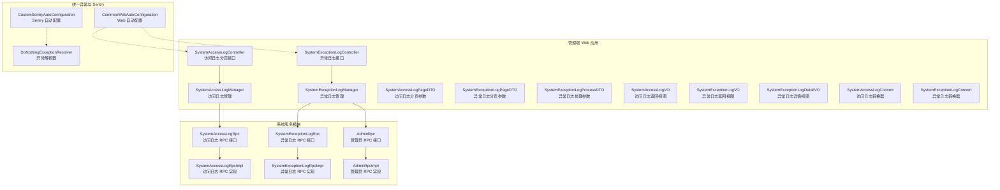
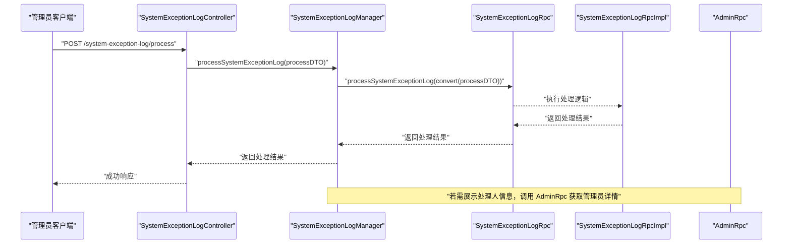
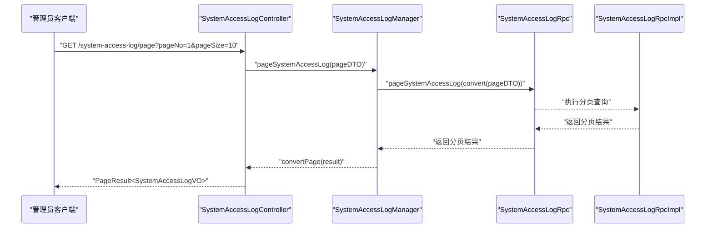
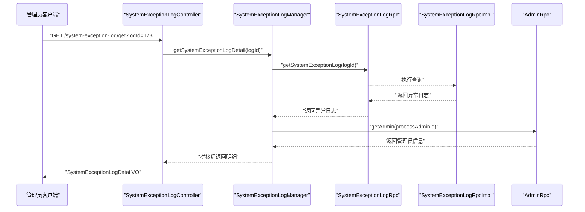
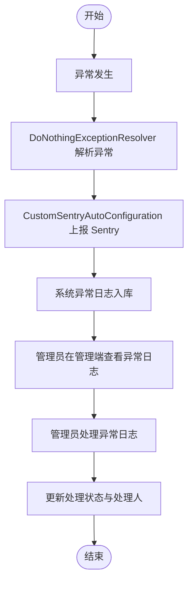
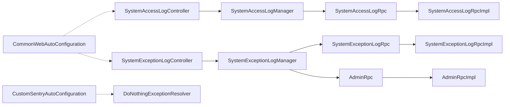

# 系统日志

<cite>
**本文引用的文件**
- [SystemAccessLogController.java](file://management-web-app/src/main/java/cn/iocoder/mall/managementweb/controller/systemlog/SystemAccessLogController.java)
- [SystemExceptionLogController.java](file://management-web-app/src/main/java/cn/iocoder/mall/managementweb/controller/systemlog/SystemExceptionLogController.java)
- [SystemAccessLogPageDTO.java](file://management-web-app/src/main/java/cn/iocoder/mall/managementweb/controller/systemlog/dto/SystemAccessLogPageDTO.java)
- [SystemExceptionLogPageDTO.java](file://management-web-app/src/main/java/cn/iocoder/mall/managementweb/controller/systemlog/dto/SystemExceptionLogPageDTO.java)
- [SystemExceptionLogProcessDTO.java](file://management-web-app/src/main/java/cn/iocoder/mall/managementweb/controller/systemlog/dto/SystemExceptionLogProcessDTO.java)
- [SystemAccessLogVO.java](file://management-web-app/src/main/java/cn/iocoder/mall/managementweb/controller/systemlog/vo/SystemAccessLogVO.java)
- [SystemExceptionLogDetailVO.java](file://management-web-app/src/main/java/cn/iocoder/mall/managementweb/controller/systemlog/vo/SystemExceptionLogDetailVO.java)
- [SystemExceptionLogVO.java](file://management-web-app/src/main/java/cn/iocoder/mall/managementweb/controller/systemlog/vo/SystemExceptionLogVO.java)
- [SystemAccessLogConvert.java](file://management-web-app/src/main/java/cn/iocoder/mall/managementweb/convert/systemlog/SystemAccessLogConvert.java)
- [SystemExceptionLogConvert.java](file://management-web-app/src/main/java/cn/iocoder/mall/managementweb/convert/systemlog/SystemExceptionLogConvert.java)
- [SystemAccessLogManager.java](file://management-web-app/src/main/java/cn/iocoder/mall/managementweb/manager/systemlog/SystemAccessLogManager.java)
- [SystemExceptionLogManager.java](file://management-web-app/src/main/java/cn/iocoder/mall/managementweb/manager/systemlog/SystemExceptionLogManager.java)
- [SystemAccessLogRpc.java](file://system-service-project/system-service-api/src/main/java/cn/iocoder/mall/systemservice/rpc/systemlog/SystemAccessLogRpc.java)
- [SystemExceptionLogRpc.java](file://system-service-project/system-service-api/src/main/java/cn/iocoder/mall/systemservice/rpc/systemlog/SystemExceptionLogRpc.java)
- [SystemAccessLogRpcImpl.java](file://system-service-project/system-service-app/src/main/java/cn/iocoder/mall/systemservice/rpc/systemlog/SystemAccessLogRpcImpl.java)
- [SystemExceptionLogRpcImpl.java](file://system-service-project/system-service-app/src/main/java/cn/iocoder/mall/systemservice/rpc/systemlog/SystemExceptionLogRpcImpl.java)
- [AdminRpc.java](file://system-service-project/system-service-api/src/main/java/cn/iocoder/mall/systemservice/rpc/admin/AdminRpc.java)
- [AdminRpcImpl.java](file://system-service-project/system-service-app/src/main/java/cn/iocoder/mall/systemservice/rpc/admin/AdminRpcImpl.java)
- [CommonWebAutoConfiguration.java](file://common/mall-spring-boot-starter-web/src/main/java/cn/iocoder/mall/web/config/CommonWebAutoConfiguration.java)
- [DoNothingExceptionResolver.java](file://common/mall-spring-boot-starter-sentry/src/main/java/cn/iocoder/mall/sentry/resolver/DoNothingExceptionResolver.java)
- [CustomSentryAutoConfiguration.java](file://common/mall-spring-boot-starter-sentry/src/main/java/cn/iocoder/mall/sentry/config/CustomSentryAutoConfiguration.java)
- [application.yml](file://management-web-app/src/main/resources/application.yml)
- [application-dev.yml](file://management-web-app/src/main/resources/application-dev.yml)
- [application-local.yml](file://management-web-app/src/main/resources/application-local.yml)
</cite>

## 目录
1. [简介](#简介)
2. [项目结构](#项目结构)
3. [核心组件](#核心组件)
4. [架构总览](#架构总览)
5. [详细组件分析](#详细组件分析)
6. [依赖关系分析](#依赖关系分析)
7. [性能考虑](#性能考虑)
8. [故障排查指南](#故障排查指南)
9. [结论](#结论)
10. [附录](#附录)

## 简介
本技术文档围绕系统日志功能展开，覆盖访问日志记录、异常日志收集、日志查询统计、日志处理流程等核心能力。系统通过管理端 Web 应用暴露 REST 接口，使用 Dubbo 远程调用系统服务模块提供的 RPC 接口完成日志数据的分页查询与处理；同时结合统一异常处理与 Sentry 集成，确保异常信息可采集、可追踪、可处理。

## 项目结构
系统日志相关代码主要分布在以下位置：
- 管理端 Web 应用：控制器、DTO/VO、转换器、管理器
- 系统服务模块：RPC 接口与实现（访问日志、异常日志、管理员 RPC）
- 统一异常处理与 Sentry 集成：全局异常解析与自动配置
- 配置文件：应用环境配置

图表来源
- [SystemAccessLogController.java:1-39](file://management-web-app/src/main/java/cn/iocoder/mall/managementweb/controller/systemlog/SystemAccessLogController.java#L1-L39)
- [SystemExceptionLogController.java:1-57](file://management-web-app/src/main/java/cn/iocoder/mall/managementweb/controller/systemlog/SystemExceptionLogController.java#L1-L57)
- [SystemAccessLogManager.java:1-35](file://management-web-app/src/main/java/cn/iocoder/mall/managementweb/manager/systemlog/SystemAccessLogManager.java#L1-L35)
- [SystemExceptionLogManager.java:1-77](file://management-web-app/src/main/java/cn/iocoder/mall/managementweb/manager/systemlog/SystemExceptionLogManager.java#L1-L77)
- [SystemAccessLogRpc.java](file://system-service-project/system-service-api/src/main/java/cn/iocoder/mall/systemservice/rpc/systemlog/SystemAccessLogRpc.java)
- [SystemExceptionLogRpc.java](file://system-service-project/system-service-api/src/main/java/cn/iocoder/mall/systemservice/rpc/systemlog/SystemExceptionLogRpc.java)
- [SystemAccessLogRpcImpl.java](file://system-service-project/system-service-app/src/main/java/cn/iocoder/mall/systemservice/rpc/systemlog/SystemAccessLogRpcImpl.java)
- [SystemExceptionLogRpcImpl.java](file://system-service-project/system-service-app/src/main/java/cn/iocoder/mall/systemservice/rpc/systemlog/SystemExceptionLogRpcImpl.java)
- [AdminRpc.java](file://system-service-project/system-service-api/src/main/java/cn/iocoder/mall/systemservice/rpc/admin/AdminRpc.java)
- [AdminRpcImpl.java](file://system-service-project/system-service-app/src/main/java/cn/iocoder/mall/systemservice/rpc/admin/AdminRpcImpl.java)
- [CommonWebAutoConfiguration.java](file://common/mall-spring-boot-starter-web/src/main/java/cn/iocoder/mall/web/config/CommonWebAutoConfiguration.java)
- [DoNothingExceptionResolver.java](file://common/mall-spring-boot-starter-sentry/src/main/java/cn/iocoder/mall/sentry/resolver/DoNothingExceptionResolver.java)
- [CustomSentryAutoConfiguration.java](file://common/mall-spring-boot-starter-sentry/src/main/java/cn/iocoder/mall/sentry/config/CustomSentryAutoConfiguration.java)

章节来源
- [SystemAccessLogController.java:1-39](file://management-web-app/src/main/java/cn/iocoder/mall/managementweb/controller/systemlog/SystemAccessLogController.java#L1-L39)
- [SystemExceptionLogController.java:1-57](file://management-web-app/src/main/java/cn/iocoder/mall/managementweb/controller/systemlog/SystemExceptionLogController.java#L1-L57)
- [SystemAccessLogManager.java:1-35](file://management-web-app/src/main/java/cn/iocoder/mall/managementweb/manager/systemlog/SystemAccessLogManager.java#L1-L35)
- [SystemExceptionLogManager.java:1-77](file://management-web-app/src/main/java/cn/iocoder/mall/managementweb/manager/systemlog/SystemExceptionLogManager.java#L1-L77)

## 核心组件
- 访问日志控制器：提供访问日志分页查询接口，权限控制为“system:system-access-log:page”。
- 异常日志控制器：提供异常日志明细查询、分页查询、处理操作，权限分别为“system:system-exception-log:page”、“system:system-exception-log:process”。
- 访问日志管理器：封装对 SystemAccessLogRpc 的远程调用，负责分页查询与结果转换。
- 异常日志管理器：封装对 SystemExceptionLogRpc 与 AdminRpc 的远程调用，负责明细、分页查询以及处理流程，并拼接处理人信息。
- DTO/VO：定义分页查询参数与返回视图对象，包含用户标识、应用名、URI、参数、HTTP 方法、UA、IP、起始时间、响应时长、错误码与错误信息等字段。
- 转换器：基于 MapStruct 将管理端 DTO/VO 与系统服务 RPC 层的 DTO/VO 进行双向转换。
- RPC 接口与实现：系统服务模块提供访问日志与异常日志的 RPC 接口及实现，供管理端调用。
- 异常处理与 Sentry：通过 Web 自动配置与 Sentry 自动配置，结合异常解析器，实现异常采集与上报。

章节来源
- [SystemAccessLogController.java:19-39](file://management-web-app/src/main/java/cn/iocoder/mall/managementweb/controller/systemlog/SystemAccessLogController.java#L19-L39)
- [SystemExceptionLogController.java:21-57](file://management-web-app/src/main/java/cn/iocoder/mall/managementweb/controller/systemlog/SystemExceptionLogController.java#L21-L57)
- [SystemAccessLogManager.java:12-35](file://management-web-app/src/main/java/cn/iocoder/mall/managementweb/manager/systemlog/SystemAccessLogManager.java#L12-L35)
- [SystemExceptionLogManager.java:16-77](file://management-web-app/src/main/java/cn/iocoder/mall/managementweb/manager/systemlog/SystemExceptionLogManager.java#L16-L77)
- [SystemAccessLogPageDTO.java:8-20](file://management-web-app/src/main/java/cn/iocoder/mall/managementweb/controller/systemlog/dto/SystemAccessLogPageDTO.java#L8-L20)
- [SystemExceptionLogPageDTO.java](file://management-web-app/src/main/java/cn/iocoder/mall/managementweb/controller/systemlog/dto/SystemExceptionLogPageDTO.java)
- [SystemExceptionLogProcessDTO.java](file://management-web-app/src/main/java/cn/iocoder/mall/managementweb/controller/systemlog/dto/SystemExceptionLogProcessDTO.java)
- [SystemAccessLogVO.java:7-41](file://management-web-app/src/main/java/cn/iocoder/mall/managementweb/controller/systemlog/vo/SystemAccessLogVO.java#L7-L41)
- [SystemExceptionLogVO.java](file://management-web-app/src/main/java/cn/iocoder/mall/managementweb/controller/systemlog/vo/SystemExceptionLogVO.java)
- [SystemExceptionLogDetailVO.java](file://management-web-app/src/main/java/cn/iocoder/mall/managementweb/controller/systemlog/vo/SystemExceptionLogDetailVO.java)
- [SystemAccessLogConvert.java:9-19](file://management-web-app/src/main/java/cn/iocoder/mall/managementweb/convert/systemlog/SystemAccessLogConvert.java#L9-L19)
- [SystemExceptionLogConvert.java](file://management-web-app/src/main/java/cn/iocoder/mall/managementweb/convert/systemlog/SystemExceptionLogConvert.java)
- [SystemAccessLogRpc.java](file://system-service-project/system-service-api/src/main/java/cn/iocoder/mall/systemservice/rpc/systemlog/SystemAccessLogRpc.java)
- [SystemExceptionLogRpc.java](file://system-service-project/system-service-api/src/main/java/cn/iocoder/mall/systemservice/rpc/systemlog/SystemExceptionLogRpc.java)
- [SystemAccessLogRpcImpl.java](file://system-service-project/system-service-app/src/main/java/cn/iocoder/mall/systemservice/rpc/systemlog/SystemAccessLogRpcImpl.java)
- [SystemExceptionLogRpcImpl.java](file://system-service-project/system-service-app/src/main/java/cn/iocoder/mall/systemservice/rpc/systemlog/SystemExceptionLogRpcImpl.java)
- [AdminRpc.java](file://system-service-project/system-service-api/src/main/java/cn/iocoder/mall/systemservice/rpc/admin/AdminRpc.java)
- [AdminRpcImpl.java](file://system-service-project/system-service-app/src/main/java/cn/iocoder/mall/systemservice/rpc/admin/AdminRpcImpl.java)
- [CommonWebAutoConfiguration.java](file://common/mall-spring-boot-starter-web/src/main/java/cn/iocoder/mall/web/config/CommonWebAutoConfiguration.java)
- [DoNothingExceptionResolver.java](file://common/mall-spring-boot-starter-sentry/src/main/java/cn/iocoder/mall/sentry/resolver/DoNothingExceptionResolver.java)
- [CustomSentryAutoConfiguration.java](file://common/mall-spring-boot-starter-sentry/src/main/java/cn/iocoder/mall/sentry/config/CustomSentryAutoConfiguration.java)

## 架构总览
系统日志采用“管理端 Web 应用 + 系统服务模块”的分层设计，管理端通过 Dubbo RPC 调用系统服务模块的接口，实现访问日志与异常日志的查询与处理。异常采集通过统一异常处理与 Sentry 集成，确保异常信息可追踪与可上报。

图表来源
- [SystemExceptionLogController.java:48-54](file://management-web-app/src/main/java/cn/iocoder/mall/managementweb/controller/systemlog/SystemExceptionLogController.java#L48-L54)
- [SystemExceptionLogManager.java:64-77](file://management-web-app/src/main/java/cn/iocoder/mall/managementweb/manager/systemlog/SystemExceptionLogManager.java#L64-L77)
- [SystemExceptionLogRpc.java](file://system-service-project/system-service-api/src/main/java/cn/iocoder/mall/systemservice/rpc/systemlog/SystemExceptionLogRpc.java)
- [SystemExceptionLogRpcImpl.java](file://system-service-project/system-service-app/src/main/java/cn/iocoder/mall/systemservice/rpc/systemlog/SystemExceptionLogRpcImpl.java)
- [AdminRpc.java](file://system-service-project/system-service-api/src/main/java/cn/iocoder/mall/systemservice/rpc/admin/AdminRpc.java)

## 详细组件分析

### 访问日志组件
- 控制器：提供“系统访问日志分页”接口，权限为“system:system-access-log:page”，入参为 SystemAccessLogPageDTO，出参为 PageResult<SystemAccessLogVO>。
- 管理器：通过 SystemAccessLogRpc 执行分页查询，并进行结果转换。
- DTO/VO：包含用户标识、应用名、URI、参数、HTTP 方法、UA、IP、起始时间、响应时长、错误码与错误信息等字段。
- 转换器：将管理端 DTO/VO 转换为 RPC 层 DTO/VO 并进行分页结果转换。

图表来源
- [SystemAccessLogController.java:31-36](file://management-web-app/src/main/java/cn/iocoder/mall/managementweb/controller/systemlog/SystemAccessLogController.java#L31-L36)
- [SystemAccessLogManager.java:27-32](file://management-web-app/src/main/java/cn/iocoder/mall/managementweb/manager/systemlog/SystemAccessLogManager.java#L27-L32)
- [SystemAccessLogConvert.java:14-16](file://management-web-app/src/main/java/cn/iocoder/mall/managementweb/convert/systemlog/SystemAccessLogConvert.java#L14-L16)
- [SystemAccessLogRpc.java](file://system-service-project/system-service-api/src/main/java/cn/iocoder/mall/systemservice/rpc/systemlog/SystemAccessLogRpc.java)
- [SystemAccessLogRpcImpl.java](file://system-service-project/system-service-app/src/main/java/cn/iocoder/mall/systemservice/rpc/systemlog/SystemAccessLogRpcImpl.java)

章节来源
- [SystemAccessLogController.java:19-39](file://management-web-app/src/main/java/cn/iocoder/mall/managementweb/controller/systemlog/SystemAccessLogController.java#L19-L39)
- [SystemAccessLogManager.java:12-35](file://management-web-app/src/main/java/cn/iocoder/mall/managementweb/manager/systemlog/SystemAccessLogManager.java#L12-L35)
- [SystemAccessLogPageDTO.java:8-20](file://management-web-app/src/main/java/cn/iocoder/mall/managementweb/controller/systemlog/dto/SystemAccessLogPageDTO.java#L8-L20)
- [SystemAccessLogVO.java:7-41](file://management-web-app/src/main/java/cn/iocoder/mall/managementweb/controller/systemlog/vo/SystemAccessLogVO.java#L7-L41)
- [SystemAccessLogConvert.java:9-19](file://management-web-app/src/main/java/cn/iocoder/mall/managementweb/convert/systemlog/SystemAccessLogConvert.java#L9-L19)

### 异常日志组件
- 控制器：提供“异常日志明细获取”“异常日志分页”“异常日志处理”三个接口，分别对应权限“system:system-exception-log:page”“system:system-exception-log:process”。
- 管理器：封装 RPC 调用，支持获取明细并拼接处理管理员信息，支持分页查询与处理操作。
- DTO/VO：异常日志明细 VO 包含处理管理员信息；分页查询参数支持按异常状态、处理状态等条件过滤。
- 转换器：将管理端 DTO/VO 转换为 RPC 层 DTO/VO 并进行分页结果转换。

图表来源
- [SystemExceptionLogController.java:33-39](file://management-web-app/src/main/java/cn/iocoder/mall/managementweb/controller/systemlog/SystemExceptionLogController.java#L33-L39)
- [SystemExceptionLogManager.java:33-49](file://management-web-app/src/main/java/cn/iocoder/mall/managementweb/manager/systemlog/SystemExceptionLogManager.java#L33-L49)
- [SystemExceptionLogRpc.java](file://system-service-project/system-service-api/src/main/java/cn/iocoder/mall/systemservice/rpc/systemlog/SystemExceptionLogRpc.java)
- [SystemExceptionLogRpcImpl.java](file://system-service-project/system-service-app/src/main/java/cn/iocoder/mall/systemservice/rpc/systemlog/SystemExceptionLogRpcImpl.java)
- [AdminRpc.java](file://system-service-project/system-service-api/src/main/java/cn/iocoder/mall/systemservice/rpc/admin/AdminRpc.java)

章节来源
- [SystemExceptionLogController.java:21-57](file://management-web-app/src/main/java/cn/iocoder/mall/managementweb/controller/systemlog/SystemExceptionLogController.java#L21-L57)
- [SystemExceptionLogManager.java:16-77](file://management-web-app/src/main/java/cn/iocoder/mall/managementweb/manager/systemlog/SystemExceptionLogManager.java#L16-L77)
- [SystemExceptionLogPageDTO.java](file://management-web-app/src/main/java/cn/iocoder/mall/managementweb/controller/systemlog/dto/SystemExceptionLogPageDTO.java)
- [SystemExceptionLogProcessDTO.java](file://management-web-app/src/main/java/cn/iocoder/mall/managementweb/controller/systemlog/dto/SystemExceptionLogProcessDTO.java)
- [SystemExceptionLogVO.java](file://management-web-app/src/main/java/cn/iocoder/mall/managementweb/controller/systemlog/vo/SystemExceptionLogVO.java)
- [SystemExceptionLogDetailVO.java](file://management-web-app/src/main/java/cn/iocoder/mall/managementweb/controller/systemlog/vo/SystemExceptionLogDetailVO.java)
- [SystemExceptionLogConvert.java](file://management-web-app/src/main/java/cn/iocoder/mall/managementweb/convert/systemlog/SystemExceptionLogConvert.java)

### 日志查询接口设计
- 分页查询：统一继承 PageParam，支持 pageNo、pageSize 等通用分页参数。
- 条件过滤：访问日志支持按用户编号、用户类型、应用名过滤；异常日志支持按异常状态、处理状态等条件过滤（具体字段以 RPC 层定义为准）。
- 排序规则：排序字段由 RPC 层定义，管理端不直接处理排序逻辑。
- 统计分析：当前管理端未提供专门的统计接口，可在系统服务模块扩展 RPC 接口以支持统计分析。

章节来源
- [SystemAccessLogPageDTO.java:8-20](file://management-web-app/src/main/java/cn/iocoder/mall/managementweb/controller/systemlog/dto/SystemAccessLogPageDTO.java#L8-L20)
- [SystemExceptionLogPageDTO.java](file://management-web-app/src/main/java/cn/iocoder/mall/managementweb/controller/systemlog/dto/SystemExceptionLogPageDTO.java)
- [SystemAccessLogManager.java:27-32](file://management-web-app/src/main/java/cn/iocoder/mall/managementweb/manager/systemlog/SystemAccessLogManager.java#L27-L32)
- [SystemExceptionLogManager.java:57-62](file://management-web-app/src/main/java/cn/iocoder/mall/managementweb/manager/systemlog/SystemExceptionLogManager.java#L57-L62)

### 异常日志捕获与处理
- 捕获机制：通过统一异常处理与 Sentry 自动配置，结合异常解析器，实现异常采集与上报。
- 处理流程：管理员在管理端对异常日志进行处理，设置处理人并持久化处理状态；管理器会调用 AdminRpc 获取处理人信息并拼接到返回结果中。

图表来源
- [DoNothingExceptionResolver.java](file://common/mall-spring-boot-starter-sentry/src/main/java/cn/iocoder/mall/sentry/resolver/DoNothingExceptionResolver.java)
- [CustomSentryAutoConfiguration.java](file://common/mall-spring-boot-starter-sentry/src/main/java/cn/iocoder/mall/sentry/config/CustomSentryAutoConfiguration.java)
- [SystemExceptionLogController.java:48-54](file://management-web-app/src/main/java/cn/iocoder/mall/managementweb/controller/systemlog/SystemExceptionLogController.java#L48-L54)
- [SystemExceptionLogManager.java:70-74](file://management-web-app/src/main/java/cn/iocoder/mall/managementweb/manager/systemlog/SystemExceptionLogManager.java#L70-L74)

章节来源
- [DoNothingExceptionResolver.java](file://common/mall-spring-boot-starter-sentry/src/main/java/cn/iocoder/mall/sentry/resolver/DoNothingExceptionResolver.java)
- [CustomSentryAutoConfiguration.java](file://common/mall-spring-boot-starter-sentry/src/main/java/cn/iocoder/mall/sentry/config/CustomSentryAutoConfiguration.java)
- [SystemExceptionLogController.java:21-57](file://management-web-app/src/main/java/cn/iocoder/mall/managementweb/controller/systemlog/SystemExceptionLogController.java#L21-L57)
- [SystemExceptionLogManager.java:64-77](file://management-web-app/src/main/java/cn/iocoder/mall/managementweb/manager/systemlog/SystemExceptionLogManager.java#L64-L77)

## 依赖关系分析
- 控制器依赖管理器；管理器依赖 RPC 接口；RPC 接口由系统服务模块实现。
- 异常日志管理器额外依赖 AdminRpc，用于拼接处理管理员信息。
- Web 自动配置与 Sentry 自动配置为异常采集提供基础设施。

图表来源
- [SystemAccessLogController.java:22-36](file://management-web-app/src/main/java/cn/iocoder/mall/managementweb/controller/systemlog/SystemAccessLogController.java#L22-L36)
- [SystemExceptionLogController.java:24-54](file://management-web-app/src/main/java/cn/iocoder/mall/managementweb/controller/systemlog/SystemExceptionLogController.java#L24-L54)
- [SystemAccessLogManager.java:18-32](file://management-web-app/src/main/java/cn/iocoder/mall/managementweb/manager/systemlog/SystemAccessLogManager.java#L18-L32)
- [SystemExceptionLogManager.java:22-74](file://management-web-app/src/main/java/cn/iocoder/mall/managementweb/manager/systemlog/SystemExceptionLogManager.java#L22-L74)
- [SystemAccessLogRpc.java](file://system-service-project/system-service-api/src/main/java/cn/iocoder/mall/systemservice/rpc/systemlog/SystemAccessLogRpc.java)
- [SystemExceptionLogRpc.java](file://system-service-project/system-service-api/src/main/java/cn/iocoder/mall/systemservice/rpc/systemlog/SystemExceptionLogRpc.java)
- [SystemAccessLogRpcImpl.java](file://system-service-project/system-service-app/src/main/java/cn/iocoder/mall/systemservice/rpc/systemlog/SystemAccessLogRpcImpl.java)
- [SystemExceptionLogRpcImpl.java](file://system-service-project/system-service-app/src/main/java/cn/iocoder/mall/systemservice/rpc/systemlog/SystemExceptionLogRpcImpl.java)
- [AdminRpc.java](file://system-service-project/system-service-api/src/main/java/cn/iocoder/mall/systemservice/rpc/admin/AdminRpc.java)
- [AdminRpcImpl.java](file://system-service-project/system-service-app/src/main/java/cn/iocoder/mall/systemservice/rpc/admin/AdminRpcImpl.java)
- [CommonWebAutoConfiguration.java](file://common/mall-spring-boot-starter-web/src/main/java/cn/iocoder/mall/web/config/CommonWebAutoConfiguration.java)
- [CustomSentryAutoConfiguration.java](file://common/mall-spring-boot-starter-sentry/src/main/java/cn/iocoder/mall/sentry/config/CustomSentryAutoConfiguration.java)

章节来源
- [SystemAccessLogController.java:1-39](file://management-web-app/src/main/java/cn/iocoder/mall/managementweb/controller/systemlog/SystemAccessLogController.java#L1-L39)
- [SystemExceptionLogController.java:1-57](file://management-web-app/src/main/java/cn/iocoder/mall/managementweb/controller/systemlog/SystemExceptionLogController.java#L1-L57)
- [SystemAccessLogManager.java:1-35](file://management-web-app/src/main/java/cn/iocoder/mall/managementweb/manager/systemlog/SystemAccessLogManager.java#L1-L35)
- [SystemExceptionLogManager.java:1-77](file://management-web-app/src/main/java/cn/iocoder/mall/managementweb/manager/systemlog/SystemExceptionLogManager.java#L1-L77)

## 性能考虑
- 分页查询：建议在系统服务模块对日志表建立合适的索引（如用户标识、应用名、时间范围），以提升分页查询性能。
- 缓存策略：对于高频查询的异常日志状态统计，可在系统服务模块引入缓存（如 Redis）以降低数据库压力。
- 异步处理：异常日志入库可考虑异步写入或批量写入，减少接口延迟。
- 压测与限流：在高并发场景下，建议对日志查询接口增加限流与熔断保护，避免对数据库造成过大冲击。

## 故障排查指南
- 接口无权限：确认管理员是否具备相应权限（system:system-access-log:page、system:system-exception-log:page、system:system-exception-log:process）。
- RPC 调用失败：检查系统服务模块是否正常启动，Dubbo 版本配置是否正确，网络连通性是否正常。
- 异常未上报：确认 Sentry 自动配置与异常解析器是否生效，检查异常解析器是否拦截了预期异常。
- 处理人信息为空：确认 AdminRpc 是否能正确返回管理员信息，检查处理管理员 ID 是否存在。

章节来源
- [SystemAccessLogController.java:33-36](file://management-web-app/src/main/java/cn/iocoder/mall/managementweb/controller/systemlog/SystemAccessLogController.java#L33-L36)
- [SystemExceptionLogController.java:36-54](file://management-web-app/src/main/java/cn/iocoder/mall/managementweb/controller/systemlog/SystemExceptionLogController.java#L36-L54)
- [SystemExceptionLogManager.java:33-49](file://management-web-app/src/main/java/cn/iocoder/mall/managementweb/manager/systemlog/SystemExceptionLogManager.java#L33-L49)
- [DoNothingExceptionResolver.java](file://common/mall-spring-boot-starter-sentry/src/main/java/cn/iocoder/mall/sentry/resolver/DoNothingExceptionResolver.java)
- [CustomSentryAutoConfiguration.java](file://common/mall-spring-boot-starter-sentry/src/main/java/cn/iocoder/mall/sentry/config/CustomSentryAutoConfiguration.java)

## 结论
系统日志功能通过清晰的分层设计与 RPC 调用实现了访问日志与异常日志的查询与处理。管理端提供完善的接口与权限控制，系统服务模块负责数据持久化与业务逻辑，异常采集通过 Sentry 与统一异常处理机制保障。后续可在系统服务模块扩展统计分析接口与优化查询性能，以满足更复杂的运维需求。

## 附录
- 配置文件示例路径：application.yml、application-dev.yml、application-local.yml
- 参考路径：[application.yml](file://management-web-app/src/main/resources/application.yml)，[application-dev.yml](file://management-web-app/src/main/resources/application-dev.yml)，[application-local.yml](file://management-web-app/src/main/resources/application-local.yml)