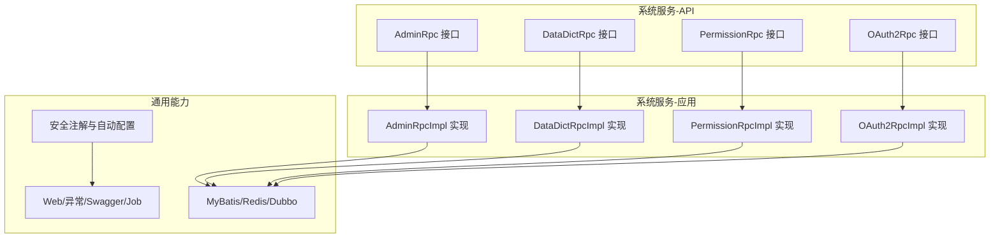
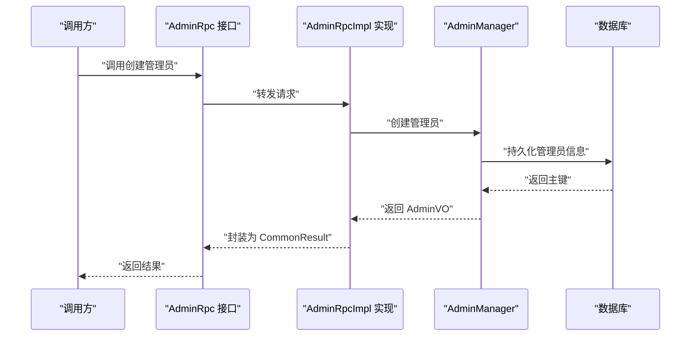
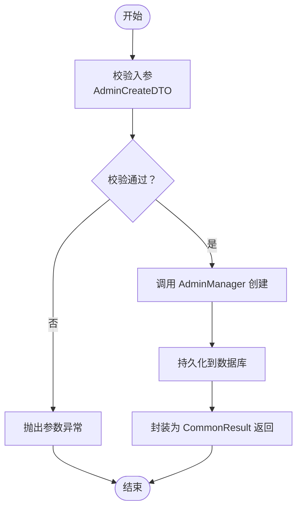
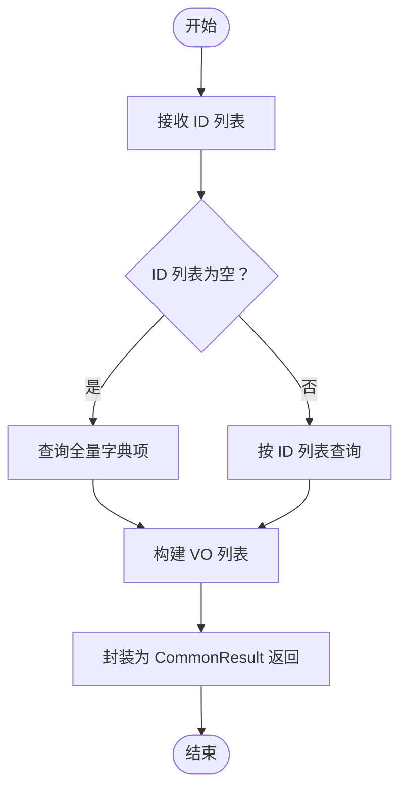
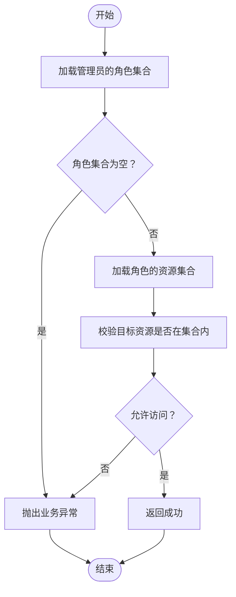
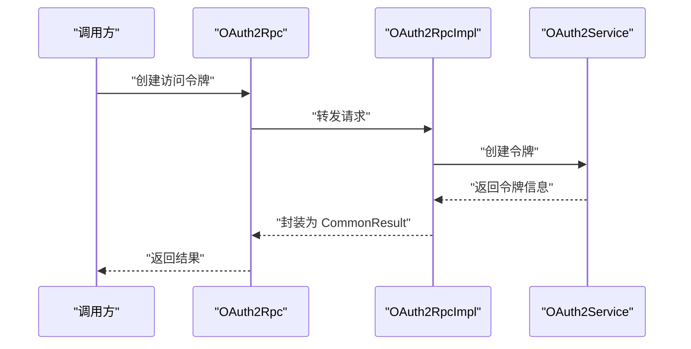
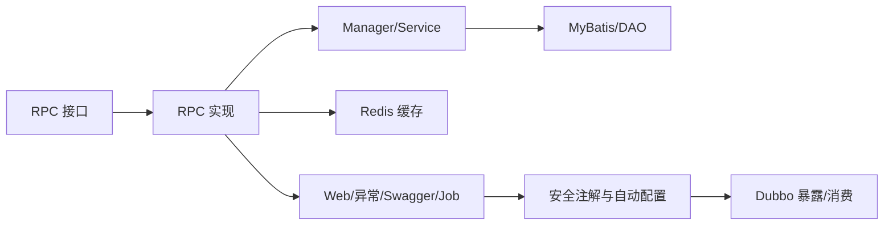

# 系统服务模块

<cite>
**本文引用的文件**
- [AdminRpc.java](file://system-service-project/system-service-api/src/main/java/cn/iocoder/mall/systemservice/rpc/admin/AdminRpc.java)
- [AdminRpcImpl.java](file://system-service-project/system-service-app/src/main/java/cn/iocoder/mall/systemservice/rpc/admin/AdminRpcImpl.java)
- [AdminCreateDTO.java](file://system-service-project/system-service-api/src/main/java/cn/iocoder/mall/systemservice/rpc/admin/dto/AdminCreateDTO.java)
- [AdminUpdateDTO.java](file://system-service-project/system-service-api/src/main/java/cn/iocoder/mall/systemservice/rpc/admin/dto/AdminUpdateDTO.java)
- [AdminPageDTO.java](file://system-service-project/system-service-api/src/main/java/cn/iocoder/mall/systemservice/rpc/admin/dto/AdminPageDTO.java)
- [AdminVerifyPasswordDTO.java](file://system-service-project/system-service-api/src/main/java/cn/iocoder/mall/systemservice/rpc/admin/dto/AdminVerifyPasswordDTO.java)
- [DataDictRpc.java](file://system-service-project/system-service-api/src/main/java/cn/iocoder/mall/systemservice/rpc/datadict/DataDictRpc.java)
- [DataDictRpcImpl.java](file://system-service-project/system-service-app/src/main/java/cn/iocoder/mall/systemservice/rpc/datadict/DataDictRpcImpl.java)
- [PermissionRpc.java](file://system-service-project/system-service-api/src/main/java/cn/iocoder/mall/systemservice/rpc/permission/PermissionRpc.java)
- [PermissionRpcImpl.java](file://system-service-project/system-service-app/src/main/java/cn/iocoder/mall/systemservice/rpc/permission/PermissionRpcImpl.java)
- [OAuth2Rpc.java](file://system-service-project/system-service-api/src/main/java/cn/iocoder/mall/systemservice/rpc/oauth/OAuth2Rpc.java)
- [OAuth2RpcImpl.java](file://system-service-project/system-service-app/src/main/java/cn/iocoder/mall/systemservice/rpc/oauth/OAuth2RpcImpl.java)
- [CommonResult.java](file://common/common-framework/src/main/java/cn/iocoder/common/framework/vo/CommonResult.java)
- [PageResult.java](file://common/common-framework/src/main/java/cn/iocoder/common/framework/vo/PageResult.java)
- [ErrorCode.java](file://common/common-framework/src/main/java/cn/iocoder/common/framework/exception/ErrorCode.java)
- [GlobalException.java](file://common/common-framework/src/main/java/cn/iocoder/common/framework/exception/GlobalException.java)
- [ServiceException.java](file://common/common-framework/src/main/java/cn/iocoder/common/framework/exception/ServiceException.java)
- [RequiresPermissions.java](file://common/mall-security-annotations/src/main/java/cn/iocoder/security/annotations/RequiresPermissions.java)
- [AdminSecurityAutoConfiguration.java](file://common/mall-spring-boot-starter-security-admin/src/main/java/cn/iocoder/mall/security/admin/config/AdminSecurityAutoConfiguration.java)
- [AdminSecurityProperties.java](file://common/mall-spring-boot-starter-security-admin/src/main/java/cn/iocoder/mall/security/admin/config/AdminSecurityProperties.java)
- [UserSecurityAutoConfiguration.java](file://common/mall-spring-boot-starter-security-user/src/main/java/cn/iocoder/mall/security/user/config/UserSecurityAutoConfiguration.java)
- [UserSecurityProperties.java](file://common/mall-spring-boot-starter-security-user/src/main/java/cn/iocoder/mall/security/user/config/UserSecurityProperties.java)
- [ErrorCodeAutoConfiguration.java](file://common/mall-spring-boot-starter-system-error-code/src/main/java/cn/iocoder/mall/system/errorcode/config/ErrorCodeAutoConfiguration.java)
- [ErrorCodeProperties.java](file://common/mall-spring-boot-starter-system-error-code/src/main/java/cn/iocoder/mall/system/errorcode/config/ErrorCodeProperties.java)
- [ErrorCodeRemoteLoader.java](file://common/mall-spring-boot-starter-system-error-code/src/main/java/cn/iocoder/mall/system/errorcode/core/ErrorCodeRemoteLoader.java)
- [ErrorCodeAutoGenerator.java](file://common/mall-spring-boot-starter-system-error-code/src/main/java/cn/iocoder/mall/system/errorcode/core/ErrorCodeAutoGenerator.java)
- [SpringDataRedisConfig.java](file://common/mall-spring-boot-starter-cache/src/main/java/cn/iocoder/mall/cache/config/SpringDataRedisConfig.java)
- [JedisClient.java](file://common/mall-spring-boot-starter-cache/src/main/java/cn/iocoder/mall/cache/config/JedisClient.java)
- [RedissonClient.java](file://common/mall-spring-boot-starter-cache/src/main/java/cn/iocoder/mall/cache/config/RedissonClient.java)
- [RedisKeyDefine.java](file://common/mall-spring-boot-starter-redis/src/main/java/cn/iocoder/mall/redis/core/RedisKeyDefine.java)
- [MybatisPlusAutoConfiguration.java](file://common/mall-spring-boot-starter-mybatis/src/main/java/cn/iocoder/mall/mybatis/config/MybatisPlusAutoConfiguration.java)
- [SwaggerAutoConfiguration.java](file://common/mall-spring-boot-starter-swagger/src/main/java/cn/iocoder/mall/swagger/config/SwaggerAutoConfiguration.java)
- [CommonWebAutoConfiguration.java](file://common/mall-spring-boot-starter-web/src/main/java/cn/iocoder/mall/web/config/CommonWebAutoConfiguration.java)
- [CustomSentryAutoConfiguration.java](file://common/mall-spring-boot-starter-sentry/src/main/java/cn/iocoder/mall/sentry/config/CustomSentryAutoConfiguration.java)
- [DoNothingExceptionResolver.java](file://common/mall-spring-boot-starter-sentry/src/main/java/cn/iocoder/mall/sentry/resolver/DoNothingExceptionResolver.java)
- [XxlJobAutoConfiguration.java](file://common/mall-spring-boot-starter-xxl-job/src/main/java/cn/iocoder/mall/xxljob/config/XxlJobAutoConfiguration.java)
- [XxlJobProperties.java](file://common/mall-spring-boot-starter-xxl-job/src/main/java/cn/iocoder/mall/xxljob/config/XxlJobProperties.java)
- [DubbioEnvironmentPostProcessor.java](file://common/mall-spring-boot-starter-dubbo/src/main/java/cn/iocoder/mall/dubbo/config/DubboEnvironmentPostProcessor.java)
- [DubboWebAutoConfiguration.java](file://common/mall-spring-boot-starter-dubbo/src/main/java/cn/iocoder/mall/dubbo/config/DubboWebAutoConfiguration.java)
- [SystemServiceApplication.java](file://system-service-project/system-service-app/src/main/java/cn/iocoder/mall/systemservice/SystemServiceApplication.java)
</cite>

## 目录
1. [引言](#引言)
2. [项目结构](#项目结构)
3. [核心组件](#核心组件)
4. [架构总览](#架构总览)
5. [详细组件分析](#详细组件分析)
6. [依赖关系分析](#依赖关系分析)
7. [性能考虑](#性能考虑)
8. [故障排查指南](#故障排查指南)
9. [结论](#结论)
10. [附录](#附录)

## 引言
本技术文档聚焦于系统服务模块，围绕管理员管理、数据字典、权限控制、OAuth2 认证与授权、RPC 接口设计与实现进行系统化说明，并提供权限模型图与关键流程图示，帮助开发者快速理解并扩展系统能力。

## 项目结构
系统服务模块采用分层与领域划分相结合的组织方式：
- API 层：定义 RPC 接口与 DTO/VO，统一对外契约
- 应用层：实现 RPC 接口，编排业务流程
- 基础设施与通用能力：安全注解、Web 统一配置、MyBatis、Redis、Swagger、Sentry、XXL-Job、Dubbo 等



图表来源
- [AdminRpc.java:1-27](file://system-service-project/system-service-api/src/main/java/cn/iocoder/mall/systemservice/rpc/admin/AdminRpc.java#L1-L27)
- [DataDictRpc.java:1-61](file://system-service-project/system-service-api/src/main/java/cn/iocoder/mall/systemservice/rpc/datadict/DataDictRpc.java#L1-L61)
- [PermissionRpc.java:1-69](file://system-service-project/system-service-api/src/main/java/cn/iocoder/mall/systemservice/rpc/permission/PermissionRpc.java#L1-L69)
- [OAuth2Rpc.java:1-20](file://system-service-project/system-service-api/src/main/java/cn/iocoder/mall/systemservice/rpc/oauth/OAuth2Rpc.java#L1-L20)
- [AdminRpcImpl.java:1-50](file://system-service-project/system-service-app/src/main/java/cn/iocoder/mall/systemservice/rpc/admin/AdminRpcImpl.java#L1-L50)
- [DataDictRpcImpl.java:1-57](file://system-service-project/system-service-app/src/main/java/cn/iocoder/mall/systemservice/rpc/datadict/DataDictRpcImpl.java#L1-L57)
- [PermissionRpcImpl.java:1-60](file://system-service-project/system-service-app/src/main/java/cn/iocoder/mall/systemservice/rpc/permission/PermissionRpcImpl.java#L1-L60)
- [OAuth2RpcImpl.java:1-42](file://system-service-project/system-service-app/src/main/java/cn/iocoder/mall/systemservice/rpc/oauth/OAuth2RpcImpl.java#L1-L42)

章节来源
- [SystemServiceApplication.java](file://system-service-project/system-service-app/src/main/java/cn/iocoder/mall/systemservice/SystemServiceApplication.java)

## 核心组件
- 管理员 RPC：提供管理员的创建、更新、分页查询、详情获取与密码校验能力
- 数据字典 RPC：提供字典项的增删改查与批量查询能力
- 权限 RPC：提供角色资源授权、管理员角色授权、权限校验等能力
- OAuth2 RPC：提供访问令牌创建、校验、刷新与移除能力

章节来源
- [AdminRpc.java:14-26](file://system-service-project/system-service-api/src/main/java/cn/iocoder/mall/systemservice/rpc/admin/AdminRpc.java#L14-L26)
- [DataDictRpc.java:13-60](file://system-service-project/system-service-api/src/main/java/cn/iocoder/mall/systemservice/rpc/datadict/DataDictRpc.java#L13-L60)
- [PermissionRpc.java:15-68](file://system-service-project/system-service-api/src/main/java/cn/iocoder/mall/systemservice/rpc/permission/PermissionRpc.java#L15-L68)
- [OAuth2Rpc.java:9-19](file://system-service-project/system-service-api/src/main/java/cn/iocoder/mall/systemservice/rpc/oauth/OAuth2Rpc.java#L9-L19)

## 架构总览
系统服务模块通过 Dubbo 暴露 RPC 接口，应用层实现类作为服务提供者，调用各领域 Manager/Service 完成业务处理；通用能力（Web、MyBatis、Redis、Swagger、Sentry、XXL-Job、Dubbo）贯穿于应用启动与运行期。



图表来源
- [AdminRpc.java:16-18](file://system-service-project/system-service-api/src/main/java/cn/iocoder/mall/systemservice/rpc/admin/AdminRpc.java#L16-L18)
- [AdminRpcImpl.java:28-31](file://system-service-project/system-service-app/src/main/java/cn/iocoder/mall/systemservice/rpc/admin/AdminRpcImpl.java#L28-L31)
- [CommonResult.java](file://common/common-framework/src/main/java/cn/iocoder/common/framework/vo/CommonResult.java)

## 详细组件分析

### 管理员管理
- 接口职责
  - 密码校验：校验管理员登录凭据
  - 创建管理员：接收创建参数，返回主键
  - 更新管理员：支持字段级更新
  - 分页查询：支持名称与部门筛选
  - 获取详情：按主键查询
- 数据传输对象
  - AdminCreateDTO：包含昵称、部门、账号、密码、创建人与创建 IP
  - AdminUpdateDTO：包含主键、昵称、部门、状态、可选密码
  - AdminPageDTO：分页参数扩展（名称、部门）
  - AdminVerifyPasswordDTO：账号、密码、登录 IP
- 实现要点
  - RPC 实现类通过注入 Manager 完成业务编排
  - 返回值统一使用 CommonResult 包裹
- 关键流程图（创建管理员）



图表来源
- [AdminCreateDTO.java:17-56](file://system-service-project/system-service-api/src/main/java/cn/iocoder/mall/systemservice/rpc/admin/dto/AdminCreateDTO.java#L17-L56)
- [AdminRpcImpl.java:28-31](file://system-service-project/system-service-app/src/main/java/cn/iocoder/mall/systemservice/rpc/admin/AdminRpcImpl.java#L28-L31)

章节来源
- [AdminRpc.java:16-26](file://system-service-project/system-service-api/src/main/java/cn/iocoder/mall/systemservice/rpc/admin/AdminRpc.java#L16-L26)
- [AdminRpcImpl.java:22-47](file://system-service-project/system-service-app/src/main/java/cn/iocoder/mall/systemservice/rpc/admin/AdminRpcImpl.java#L22-L47)
- [AdminCreateDTO.java:17-56](file://system-service-project/system-service-api/src/main/java/cn/iocoder/mall/systemservice/rpc/admin/dto/AdminCreateDTO.java#L17-L56)
- [AdminUpdateDTO.java:18-51](file://system-service-project/system-service-api/src/main/java/cn/iocoder/mall/systemservice/rpc/admin/dto/AdminUpdateDTO.java#L18-L51)
- [AdminPageDTO.java:14-25](file://system-service-project/system-service-api/src/main/java/cn/iocoder/mall/systemservice/rpc/admin/dto/AdminPageDTO.java#L14-L25)
- [AdminVerifyPasswordDTO.java:16-37](file://system-service-project/system-service-api/src/main/java/cn/iocoder/mall/systemservice/rpc/admin/dto/AdminVerifyPasswordDTO.java#L16-L37)

### 数据字典系统
- 接口职责
  - 创建、更新、删除字典项
  - 单条与批量查询
  - 查询全量字典项
- 实现要点
  - RPC 实现类注入 DataDictManager
  - 批量查询支持传入 ID 列表
- 关键流程图（批量查询）



图表来源
- [DataDictRpc.java:42-58](file://system-service-project/system-service-api/src/main/java/cn/iocoder/mall/systemservice/rpc/datadict/DataDictRpc.java#L42-L58)
- [DataDictRpcImpl.java:42-54](file://system-service-project/system-service-app/src/main/java/cn/iocoder/mall/systemservice/rpc/datadict/DataDictRpcImpl.java#L42-L54)

章节来源
- [DataDictRpc.java:13-60](file://system-service-project/system-service-api/src/main/java/cn/iocoder/mall/systemservice/rpc/datadict/DataDictRpc.java#L13-L60)
- [DataDictRpcImpl.java:24-54](file://system-service-project/system-service-app/src/main/java/cn/iocoder/mall/systemservice/rpc/datadict/DataDictRpcImpl.java#L24-L54)

### 权限控制系统
- 接口职责
  - 角色资源授权与查询
  - 管理员角色授权与查询（单个与批量映射）
  - 权限校验（无权限时抛出业务异常）
- 设计要点
  - 基于资源的权限模型：角色持有资源集合，管理员持有角色集合
  - 权限校验集中化，便于在网关或拦截器中复用
  - 返回值统一使用 CommonResult，异常通过 ServiceException 抛出
- 关键流程图（权限校验）



图表来源
- [PermissionRpc.java:38-66](file://system-service-project/system-service-api/src/main/java/cn/iocoder/mall/systemservice/rpc/permission/PermissionRpc.java#L38-L66)
- [PermissionRpcImpl.java:38-57](file://system-service-project/system-service-app/src/main/java/cn/iocoder/mall/systemservice/rpc/permission/PermissionRpcImpl.java#L38-L57)
- [ServiceException.java](file://common/common-framework/src/main/java/cn/iocoder/common/framework/exception/ServiceException.java)

章节来源
- [PermissionRpc.java:15-68](file://system-service-project/system-service-api/src/main/java/cn/iocoder/mall/systemservice/rpc/permission/PermissionRpc.java#L15-L68)
- [PermissionRpcImpl.java:26-57](file://system-service-project/system-service-app/src/main/java/cn/iocoder/mall/systemservice/rpc/permission/PermissionRpcImpl.java#L26-L57)

### OAuth2 认证授权
- 接口职责
  - 创建访问令牌
  - 校验访问令牌
  - 刷新访问令牌
  - 移除用户令牌
- 实现要点
  - RPC 实现类注入 OAuth2Service
  - 使用 DubboService 注解暴露服务
- 关键流程图（创建访问令牌）



图表来源
- [OAuth2Rpc.java:11-11](file://system-service-project/system-service-api/src/main/java/cn/iocoder/mall/systemservice/rpc/oauth/OAuth2Rpc.java#L11-L11)
- [OAuth2RpcImpl.java:21-23](file://system-service-project/system-service-app/src/main/java/cn/iocoder/mall/systemservice/rpc/oauth/OAuth2RpcImpl.java#L21-L23)

章节来源
- [OAuth2Rpc.java:9-19](file://system-service-project/system-service-api/src/main/java/cn/iocoder/mall/systemservice/rpc/oauth/OAuth2Rpc.java#L9-L19)
- [OAuth2RpcImpl.java:14-41](file://system-service-project/system-service-app/src/main/java/cn/iocoder/mall/systemservice/rpc/oauth/OAuth2RpcImpl.java#L14-L41)

### 操作日志系统（概念性说明）
- 日志类型
  - 操作日志：记录管理员关键操作轨迹
  - 异常日志：统一异常捕获与上报
- 查询统计与清理
  - 支持按时间、操作类型、管理员维度查询
  - 定期归档与清理过期日志，保障存储与性能
- 与 Sentry 集成
  - 通过异常解析器统一处理未捕获异常，上报至 Sentry

[本节为概念性说明，不直接分析具体文件，故无“章节来源”]

## 依赖关系分析
系统服务模块与通用能力之间存在清晰的依赖边界：
- Web/异常/Swagger/Job：提供统一的 Web 处理、异常解析、接口文档与定时任务能力
- MyBatis：提供 ORM 能力
- Redis：提供缓存与分布式锁等能力
- Dubbo：提供 RPC 暴露与消费能力
- 安全注解与自动配置：提供基于注解的权限控制与拦截器装配



图表来源
- [MybatisPlusAutoConfiguration.java](file://common/mall-spring-boot-starter-mybatis/src/main/java/cn/iocoder/mall/mybatis/config/MybatisPlusAutoConfiguration.java)
- [SpringDataRedisConfig.java](file://common/mall-spring-boot-starter-cache/src/main/java/cn/iocoder/mall/cache/config/SpringDataRedisConfig.java)
- [SwaggerAutoConfiguration.java](file://common/mall-spring-boot-starter-swagger/src/main/java/cn/iocoder/mall/swagger/config/SwaggerAutoConfiguration.java)
- [CommonWebAutoConfiguration.java](file://common/mall-spring-boot-starter-web/src/main/java/cn/iocoder/mall/web/config/CommonWebAutoConfiguration.java)
- [CustomSentryAutoConfiguration.java](file://common/mall-spring-boot-starter-sentry/src/main/java/cn/iocoder/mall/sentry/config/CustomSentryAutoConfiguration.java)
- [XxlJobAutoConfiguration.java](file://common/mall-spring-boot-starter-xxl-job/src/main/java/cn/iocoder/mall/xxljob/config/XxlJobAutoConfiguration.java)
- [DubbioEnvironmentPostProcessor.java](file://common/mall-spring-boot-starter-dubbo/src/main/java/cn/iocoder/mall/dubbo/config/DubboEnvironmentPostProcessor.java)
- [DubboWebAutoConfiguration.java](file://common/mall-spring-boot-starter-dubbo/src/main/java/cn/iocoder/mall/dubbo/config/DubboWebAutoConfiguration.java)

## 性能考虑
- 缓存策略
  - 权限与字典数据：热点数据放入 Redis，设置合理过期时间，结合本地缓存降低延迟
  - 管理员会话：令牌与会话信息缓存，避免频繁数据库查询
- 分页与批量
  - 分页查询限制每页大小，避免超大数据集扫描
  - 批量查询使用 IN 查询，减少网络往返
- 并发与一致性
  - 使用 Redis 分布式锁保护关键写路径
  - 读多写少场景优先读缓存，写后失效或异步刷新
- RPC 与序列化
  - DTO 尽量扁平，避免深层嵌套
  - 合理拆分接口，避免单次调用返回超大对象

[本节提供通用指导，不直接分析具体文件，故无“章节来源”]

## 故障排查指南
- 统一异常与错误码
  - 业务异常通过 ServiceException 抛出，配合 ErrorCode 进行错误码管理
  - 错误码远程加载与自动生成，确保前后端一致
- 异常解析与上报
  - 通过 DoNothingExceptionResolver 统一解析异常，结合 Sentry 上报
- 常见问题定位
  - 参数校验失败：检查 DTO 字段约束与前端传参
  - 权限不足：确认管理员角色与资源授权链路
  - 缓存不一致：检查缓存失效策略与刷新逻辑
  - RPC 调用失败：检查 Dubbo 版本与注册中心连通性

章节来源
- [ServiceException.java](file://common/common-framework/src/main/java/cn/iocoder/common/framework/exception/ServiceException.java)
- [ErrorCode.java](file://common/common-framework/src/main/java/cn/iocoder/common/framework/exception/ErrorCode.java)
- [ErrorCodeAutoConfiguration.java](file://common/mall-spring-boot-starter-system-error-code/src/main/java/cn/iocoder/mall/system/errorcode/config/ErrorCodeAutoConfiguration.java)
- [ErrorCodeRemoteLoader.java](file://common/mall-spring-boot-starter-system-error-code/src/main/java/cn/iocoder/mall/system/errorcode/core/ErrorCodeRemoteLoader.java)
- [ErrorCodeAutoGenerator.java](file://common/mall-spring-boot-starter-system-error-code/src/main/java/cn/iocoder/mall/system/errorcode/core/ErrorCodeAutoGenerator.java)
- [DoNothingExceptionResolver.java](file://common/mall-spring-boot-starter-sentry/src/main/java/cn/iocoder/mall/sentry/resolver/DoNothingExceptionResolver.java)

## 结论
系统服务模块以清晰的 RPC 接口与实现分离为核心，结合通用能力栈实现了管理员管理、数据字典、权限控制与 OAuth2 授权的完整闭环。通过统一的异常与错误码体系、缓存与 RPC 优化策略，能够满足高并发与可维护性的工程需求。建议后续持续完善操作日志与审计追踪能力，并进一步细化权限模型与资源粒度。

## 附录
- 权限模型图（基于资源的 RBAC）

```mermaid
classDiagram
class 管理员 {
+整型标识
+字符串账号
+整型状态
}
class 角色 {
+整型标识
+字符串名称
}
class 资源 {
+整型标识
+字符串名称
+枚举类型
}
class 管理员_角色 {
+整型管理员标识
+整型角色标识
}
class 角色_资源 {
+整型角色标识
+整型资源标识
}
管理员 ||--o{ 管理员_角色 : "拥有"
角色 ||--o{ 角色_资源 : "持有"
管理员_角色 ||--|{ 角色 : "映射"
角色_资源 ||--|{ 资源 : "映射"
```

- 操作流程说明（管理员创建）
  1) 调用方准备 AdminCreateDTO
  2) AdminRpcImpl 校验并调用 Manager
  3) Manager 写入数据库并返回 AdminVO
  4) RPC 层封装为 CommonResult 返回

章节来源
- [AdminRpcImpl.java:28-31](file://system-service-project/system-service-app/src/main/java/cn/iocoder/mall/systemservice/rpc/admin/AdminRpcImpl.java#L28-L31)
- [CommonResult.java](file://common/common-framework/src/main/java/cn/iocoder/common/framework/vo/CommonResult.java)