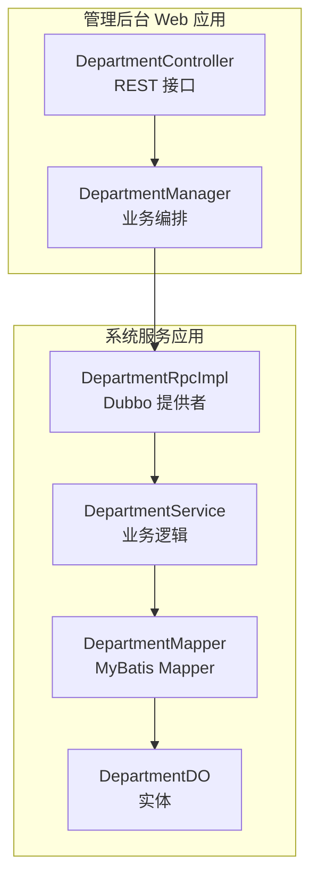
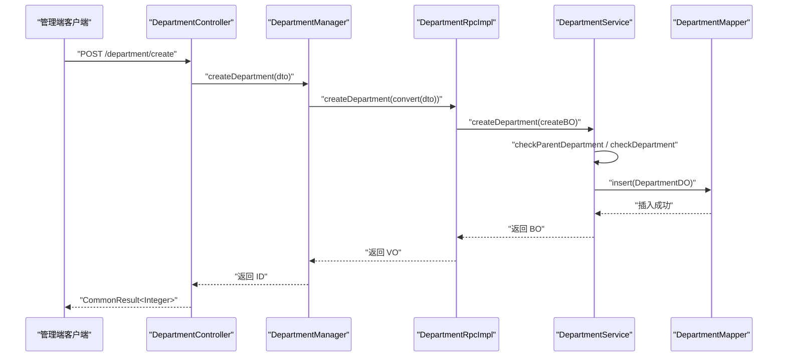
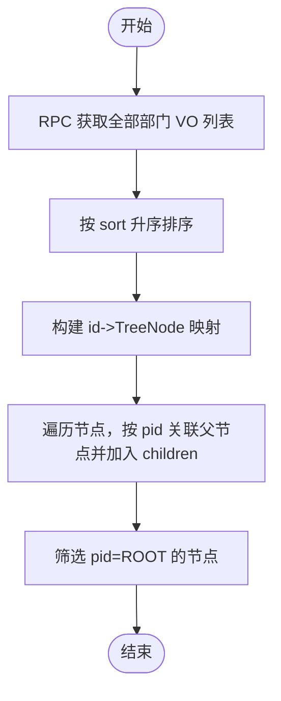
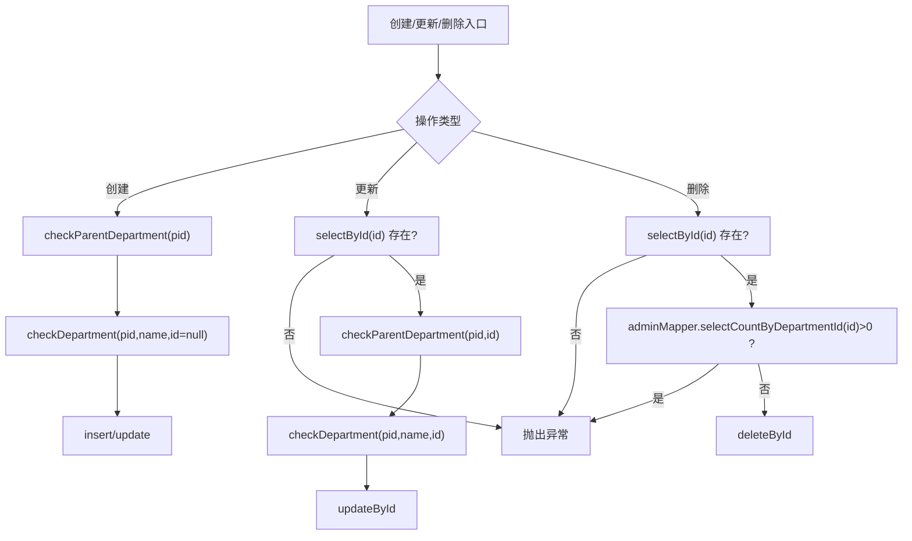
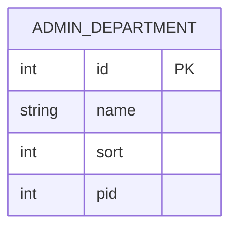
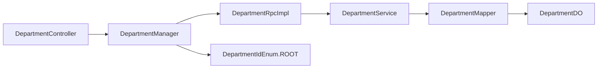

# 部门管理

<cite>
**本文引用的文件**
- [DepartmentController.java](file://management-web-app/src/main/java/cn/iocoder/mall/managementweb/controller/admin/DepartmentController.java)
- [DepartmentCreateDTO.java](file://management-web-app/src/main/java/cn/iocoder/mall/managementweb/controller/admin/dto/DepartmentCreateDTO.java)
- [DepartmentUpdateDTO.java](file://management-web-app/src/main/java/cn/iocoder/mall/managementweb/controller/admin/dto/DepartmentUpdateDTO.java)
- [DepartmentTreeNodeVO.java](file://management-web-app/src/main/java/cn/iocoder/mall/managementweb/controller/admin/vo/DepartmentTreeNodeVO.java)
- [DepartmentVO.java](file://management-web-app/src/main/java/cn/iocoder/mall/managementweb/controller/admin/vo/DepartmentVO.java)
- [DepartmentManager.java](file://management-web-app/src/main/java/cn/iocoder/mall/managementweb/manager/admin/DepartmentManager.java)
- [DepartmentRpcImpl.java](file://system-service-project/system-service-app/src/main/java/cn/iocoder/mall/systemservice/rpc/admin/DepartmentRpcImpl.java)
- [DepartmentService.java](file://system-service-project/system-service-app/src/main/java/cn/iocoder/mall/systemservice/service/admin/DepartmentService.java)
- [DepartmentDO.java](file://system-service-project/system-service-app/src/main/java/cn/iocoder/mall/systemservice/dal/mysql/dataobject/admin/DepartmentDO.java)
- [DepartmentMapper.java](file://system-service-project/system-service-app/src/main/java/cn/iocoder/mall/systemservice/dal/mysql/mapper/admin/DepartmentMapper.java)
- [DepartmentIdEnum.java](file://system-service-project/system-service-api/src/main/java/cn/iocoder/mall/systemservice/enums/admin/DepartmentIdEnum.java)
</cite>

## 目录
1. [简介](#简介)
2. [项目结构](#项目结构)
3. [核心组件](#核心组件)
4. [架构总览](#架构总览)
5. [详细组件分析](#详细组件分析)
6. [依赖分析](#依赖分析)
7. [性能考虑](#性能考虑)
8. [故障排查指南](#故障排查指南)
9. [结论](#结论)

## 简介
本技术文档围绕“部门管理”功能展开，系统性介绍组织架构管理的核心能力：部门创建、层级结构维护、部门信息更新、部门删除；深入解析部门树形结构的实现原理（父子关系管理、层级遍历、排序字段）；阐述部门与管理员的关联关系（部门成员管理）；并给出完整的流程图与关键实现路径指引，覆盖递归查询、权限校验、数据一致性保障等关键技术点。

## 项目结构
部门管理功能在整体工程中采用“Web 控制层 → 管理器 → RPC 接口 → 服务层 → 数据访问层”的分层设计，前端通过 Web 控制器暴露 REST 接口，后端通过 Dubbo RPC 调用系统服务模块完成业务逻辑与持久化。

图表来源
- [DepartmentController.java:25-81](file://management-web-app/src/main/java/cn/iocoder/mall/managementweb/controller/admin/DepartmentController.java#L25-L81)
- [DepartmentManager.java:23-128](file://management-web-app/src/main/java/cn/iocoder/mall/managementweb/manager/admin/DepartmentManager.java#L23-L128)
- [DepartmentRpcImpl.java:20-57](file://system-service-project/system-service-app/src/main/java/cn/iocoder/mall/systemservice/rpc/admin/DepartmentRpcImpl.java#L20-L57)
- [DepartmentService.java:27-168](file://system-service-project/system-service-app/src/main/java/cn/iocoder/mall/systemservice/service/admin/DepartmentService.java#L27-L168)
- [DepartmentMapper.java:9-16](file://system-service-project/system-service-app/src/main/java/cn/iocoder/mall/systemservice/dal/mysql/mapper/admin/DepartmentMapper.java#L9-L16)
- [DepartmentDO.java:16-37](file://system-service-project/system-service-app/src/main/java/cn/iocoder/mall/systemservice/dal/mysql/dataobject/admin/DepartmentDO.java#L16-L37)

章节来源
- [DepartmentController.java:25-81](file://management-web-app/src/main/java/cn/iocoder/mall/managementweb/controller/admin/DepartmentController.java#L25-L81)
- [DepartmentManager.java:23-128](file://management-web-app/src/main/java/cn/iocoder/mall/managementweb/manager/admin/DepartmentManager.java#L23-L128)
- [DepartmentRpcImpl.java:20-57](file://system-service-project/system-service-app/src/main/java/cn/iocoder/mall/systemservice/rpc/admin/DepartmentRpcImpl.java#L20-L57)
- [DepartmentService.java:27-168](file://system-service-project/system-service-app/src/main/java/cn/iocoder/mall/systemservice/service/admin/DepartmentService.java#L27-L168)
- [DepartmentMapper.java:9-16](file://system-service-project/system-service-app/src/main/java/cn/iocoder/mall/systemservice/dal/mysql/mapper/admin/DepartmentMapper.java#L9-L16)
- [DepartmentDO.java:16-37](file://system-service-project/system-service-app/src/main/java/cn/iocoder/mall/systemservice/dal/mysql/dataobject/admin/DepartmentDO.java#L16-L37)

## 核心组件
- 控制层（Web）：提供部门创建、更新、删除、查询、树形结构获取等接口，并进行权限校验。
- 管理器（Manager）：封装 RPC 调用、结果校验、树构建逻辑。
- RPC 层：Dubbo 提供者，转发调用系统服务。
- 服务层（Service）：执行业务规则（父子关系校验、重名校验、删除前置检查）、与 DAO 交互。
- 数据访问层（DAO/DO）：定义实体与表结构，提供按 pid+name 唯一性查询等方法。

章节来源
- [DepartmentController.java:25-81](file://management-web-app/src/main/java/cn/iocoder/mall/managementweb/controller/admin/DepartmentController.java#L25-L81)
- [DepartmentManager.java:23-128](file://management-web-app/src/main/java/cn/iocoder/mall/managementweb/manager/admin/DepartmentManager.java#L23-L128)
- [DepartmentRpcImpl.java:20-57](file://system-service-project/system-service-app/src/main/java/cn/iocoder/mall/systemservice/rpc/admin/DepartmentRpcImpl.java#L20-L57)
- [DepartmentService.java:27-168](file://system-service-project/system-service-app/src/main/java/cn/iocoder/mall/systemservice/service/admin/DepartmentService.java#L27-L168)
- [DepartmentDO.java:16-37](file://system-service-project/system-service-app/src/main/java/cn/iocoder/mall/systemservice/dal/mysql/dataobject/admin/DepartmentDO.java#L16-L37)
- [DepartmentMapper.java:9-16](file://system-service-project/system-service-app/src/main/java/cn/iocoder/mall/systemservice/dal/mysql/mapper/admin/DepartmentMapper.java#L9-L16)

## 架构总览
部门管理遵循“控制层 → 管理器 → RPC → 服务 → DAO”的调用链路，权限注解确保接口访问受控，树形结构由管理器在内存中组装，保证排序与父子关系正确。

图表来源
- [DepartmentController.java:34-39](file://management-web-app/src/main/java/cn/iocoder/mall/managementweb/controller/admin/DepartmentController.java#L34-L39)
- [DepartmentManager.java:34-38](file://management-web-app/src/main/java/cn/iocoder/mall/managementweb/manager/admin/DepartmentManager.java#L34-L38)
- [DepartmentRpcImpl.java:26-28](file://system-service-project/system-service-app/src/main/java/cn/iocoder/mall/systemservice/rpc/admin/DepartmentRpcImpl.java#L26-L28)
- [DepartmentService.java:40-50](file://system-service-project/system-service-app/src/main/java/cn/iocoder/mall/systemservice/service/admin/DepartmentService.java#L40-L50)
- [DepartmentMapper.java:9-16](file://system-service-project/system-service-app/src/main/java/cn/iocoder/mall/systemservice/dal/mysql/mapper/admin/DepartmentMapper.java#L9-L16)

## 详细组件分析

### 控制层：DepartmentController
- 提供创建、更新、删除、单个查询、批量查询、树形查询等接口。
- 使用权限注解限制访问，如“system:department:create/update/delete/tree”。
- 统一返回 CommonResult 包装结果。

章节来源
- [DepartmentController.java:34-81](file://management-web-app/src/main/java/cn/iocoder/mall/managementweb/controller/admin/DepartmentController.java#L34-L81)

### 管理器：DepartmentManager
- 负责调用 RPC、结果校验、树形构建。
- 树构建算法要点：
  - 先按 sort 升序排序，保证输出顺序稳定。
  - 使用映射将所有节点转为树节点 VO 并缓存。
  - 过滤非根节点，根据 pid 关联父节点，填充 children。
  - 最终收集所有根节点作为树输出。

图表来源
- [DepartmentManager.java:89-126](file://management-web-app/src/main/java/cn/iocoder/mall/managementweb/manager/admin/DepartmentManager.java#L89-L126)
- [DepartmentIdEnum.java:6-23](file://system-service-project/system-service-api/src/main/java/cn/iocoder/mall/systemservice/enums/admin/DepartmentIdEnum.java#L6-L23)

章节来源
- [DepartmentManager.java:89-126](file://management-web-app/src/main/java/cn/iocoder/mall/managementweb/manager/admin/DepartmentManager.java#L89-L126)
- [DepartmentIdEnum.java:6-23](file://system-service-project/system-service-api/src/main/java/cn/iocoder/mall/systemservice/enums/admin/DepartmentIdEnum.java#L6-L23)

### RPC 层：DepartmentRpcImpl
- 作为 Dubbo 提供者，直接委托给 DepartmentManager 完成业务。
- 提供 create、update、delete、get、list 等 RPC 方法。

章节来源
- [DepartmentRpcImpl.java:20-57](file://system-service-project/system-service-app/src/main/java/cn/iocoder/mall/systemservice/rpc/admin/DepartmentRpcImpl.java#L20-L57)

### 服务层：DepartmentService
- 业务规则与数据一致性保障：
  - 创建：校验父部门存在且不自指；校验同级部门名唯一；插入记录。
  - 更新：先查再校验存在；校验父部门合法性；校验同级部门名唯一；更新记录。
  - 删除：先查再校验存在；校验部门下无管理员；执行删除。
- 查询：支持按 ids 批量查询、全量查询；提供按 pid+name 唯一性查询。

图表来源
- [DepartmentService.java:40-87](file://system-service-project/system-service-app/src/main/java/cn/iocoder/mall/systemservice/service/admin/DepartmentService.java#L40-L87)
- [DepartmentMapper.java:11-14](file://system-service-project/system-service-app/src/main/java/cn/iocoder/mall/systemservice/dal/mysql/mapper/admin/DepartmentMapper.java#L11-L14)

章节来源
- [DepartmentService.java:40-168](file://system-service-project/system-service-app/src/main/java/cn/iocoder/mall/systemservice/service/admin/DepartmentService.java#L40-L168)
- [DepartmentMapper.java:11-14](file://system-service-project/system-service-app/src/main/java/cn/iocoder/mall/systemservice/dal/mysql/mapper/admin/DepartmentMapper.java#L11-L14)

### 数据模型：DepartmentDO 与 DepartmentMapper
- DepartmentDO 定义了部门实体字段：id、name、sort、pid。
- DepartmentMapper 提供按 pid+name 唯一性查询方法，用于同级部门名去重校验。

图表来源
- [DepartmentDO.java:16-37](file://system-service-project/system-service-app/src/main/java/cn/iocoder/mall/systemservice/dal/mysql/dataobject/admin/DepartmentDO.java#L16-L37)
- [DepartmentMapper.java:9-16](file://system-service-project/system-service-app/src/main/java/cn/iocoder/mall/systemservice/dal/mysql/mapper/admin/DepartmentMapper.java#L9-L16)

章节来源
- [DepartmentDO.java:16-37](file://system-service-project/system-service-app/src/main/java/cn/iocoder/mall/systemservice/dal/mysql/dataobject/admin/DepartmentDO.java#L16-L37)
- [DepartmentMapper.java:9-16](file://system-service-project/system-service-app/src/main/java/cn/iocoder/mall/systemservice/dal/mysql/mapper/admin/DepartmentMapper.java#L9-L16)

### DTO/VO 与枚举
- DTO：DepartmentCreateDTO、DepartmentUpdateDTO，用于接收前端参数并进行校验。
- VO：DepartmentVO、DepartmentTreeNodeVO，用于对外输出。
- 枚举：DepartmentIdEnum，定义根节点标识。

章节来源
- [DepartmentCreateDTO.java:12-24](file://management-web-app/src/main/java/cn/iocoder/mall/managementweb/controller/admin/dto/DepartmentCreateDTO.java#L12-L24)
- [DepartmentUpdateDTO.java:12-27](file://management-web-app/src/main/java/cn/iocoder/mall/managementweb/controller/admin/dto/DepartmentUpdateDTO.java#L12-L27)
- [DepartmentVO.java:9-22](file://management-web-app/src/main/java/cn/iocoder/mall/managementweb/controller/admin/vo/DepartmentVO.java#L9-L22)
- [DepartmentTreeNodeVO.java:12-30](file://management-web-app/src/main/java/cn/iocoder/mall/managementweb/controller/admin/vo/DepartmentTreeNodeVO.java#L12-L30)
- [DepartmentIdEnum.java:6-23](file://system-service-project/system-service-api/src/main/java/cn/iocoder/mall/systemservice/enums/admin/DepartmentIdEnum.java#L6-L23)

## 依赖分析
- 控制层依赖管理器；管理器依赖 RPC；RPC 依赖服务；服务依赖 Mapper；Mapper 操作 DO。
- 权限注解贯穿控制层，确保接口访问安全。
- 树构建依赖根节点枚举，保证层级根识别正确。

图表来源
- [DepartmentController.java:31-32](file://management-web-app/src/main/java/cn/iocoder/mall/managementweb/controller/admin/DepartmentController.java#L31-L32)
- [DepartmentManager.java:25-26](file://management-web-app/src/main/java/cn/iocoder/mall/managementweb/manager/admin/DepartmentManager.java#L25-L26)
- [DepartmentRpcImpl.java:22-23](file://system-service-project/system-service-app/src/main/java/cn/iocoder/mall/systemservice/rpc/admin/DepartmentRpcImpl.java#L22-L23)
- [DepartmentService.java:29-32](file://system-service-project/system-service-app/src/main/java/cn/iocoder/mall/systemservice/service/admin/DepartmentService.java#L29-L32)
- [DepartmentMapper.java:9-16](file://system-service-project/system-service-app/src/main/java/cn/iocoder/mall/systemservice/dal/mysql/mapper/admin/DepartmentMapper.java#L9-L16)
- [DepartmentDO.java:16-37](file://system-service-project/system-service-app/src/main/java/cn/iocoder/mall/systemservice/dal/mysql/dataobject/admin/DepartmentDO.java#L16-L37)
- [DepartmentIdEnum.java:6-23](file://system-service-project/system-service-api/src/main/java/cn/iocoder/mall/systemservice/enums/admin/DepartmentIdEnum.java#L6-L23)

章节来源
- [DepartmentController.java:31-32](file://management-web-app/src/main/java/cn/iocoder/mall/managementweb/controller/admin/DepartmentController.java#L31-L32)
- [DepartmentManager.java:25-26](file://management-web-app/src/main/java/cn/iocoder/mall/managementweb/manager/admin/DepartmentManager.java#L25-L26)
- [DepartmentRpcImpl.java:22-23](file://system-service-project/system-service-app/src/main/java/cn/iocoder/mall/systemservice/rpc/admin/DepartmentRpcImpl.java#L22-L23)
- [DepartmentService.java:29-32](file://system-service-project/system-service-app/src/main/java/cn/iocoder/mall/systemservice/service/admin/DepartmentService.java#L29-L32)
- [DepartmentMapper.java:9-16](file://system-service-project/system-service-app/src/main/java/cn/iocoder/mall/systemservice/dal/mysql/mapper/admin/DepartmentMapper.java#L9-L16)
- [DepartmentDO.java:16-37](file://system-service-project/system-service-app/src/main/java/cn/iocoder/mall/systemservice/dal/mysql/dataobject/admin/DepartmentDO.java#L16-L37)
- [DepartmentIdEnum.java:6-23](file://system-service-project/system-service-api/src/main/java/cn/iocoder/mall/systemservice/enums/admin/DepartmentIdEnum.java#L6-L23)

## 性能考虑
- 树构建在内存中完成，复杂度 O(n)（一次遍历 + 映射），适合中小规模组织架构。
- 排序字段 sort 用于稳定输出顺序，避免 UI 展示抖动。
- 批量查询接口支持按 ids 快速获取，减少多次往返。
- 建议在数据量较大时考虑：
  - 后端分页或懒加载树节点；
  - 缓存树结构以降低重复计算；
  - 对热点部门的查询增加索引优化（如按 pid/name 的组合索引）。

## 故障排查指南
- 创建失败：检查父部门 pid 是否为根或存在；同级部门名是否重复；请求参数是否完整。
- 更新失败：确认部门 id 存在；父部门 pid 不可自指；同级部门名唯一性。
- 删除失败：确认部门存在；部门下无管理员绑定。
- 树构建异常：排查节点 pid 是否指向不存在的父节点；确保根节点 pid 对应枚举值。

章节来源
- [DepartmentService.java:57-87](file://system-service-project/system-service-app/src/main/java/cn/iocoder/mall/systemservice/service/admin/DepartmentService.java#L57-L87)
- [DepartmentManager.java:111-125](file://management-web-app/src/main/java/cn/iocoder/mall/managementweb/manager/admin/DepartmentManager.java#L111-L125)

## 结论
部门管理功能通过清晰的分层设计与严格的业务校验，实现了组织架构的创建、更新、删除与树形展示。树构建算法简洁高效，配合排序字段与根节点枚举，确保层级关系与展示顺序稳定可靠。结合权限控制与数据一致性保障，满足管理后台对组织架构管理的高可用需求。