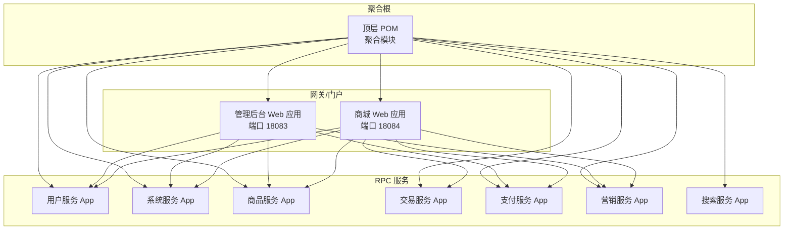
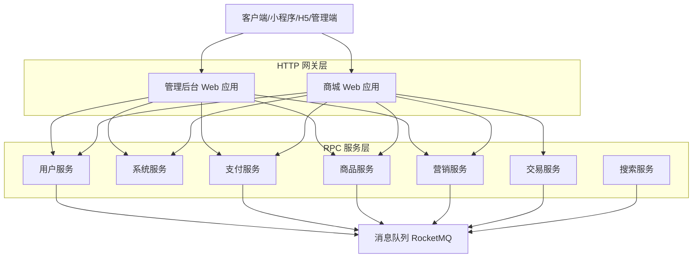
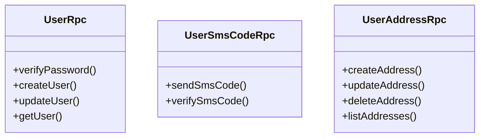
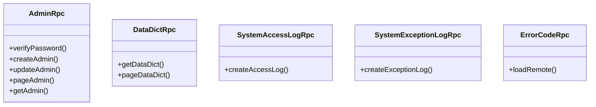
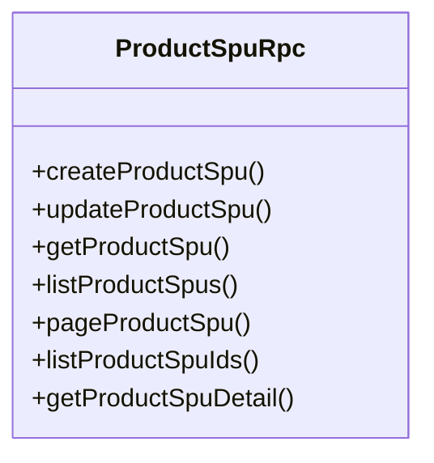
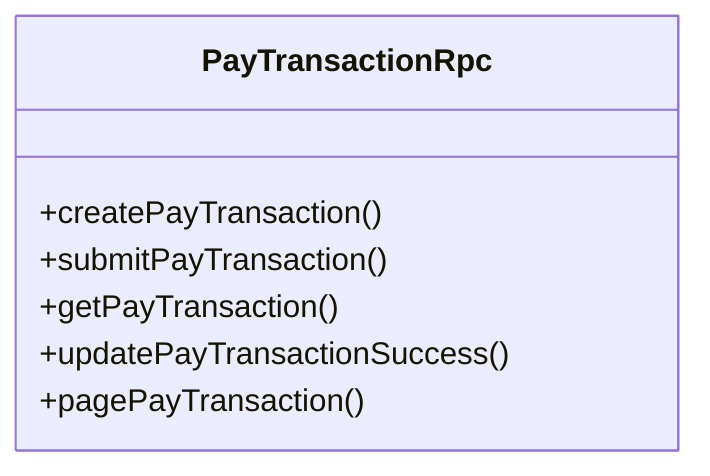
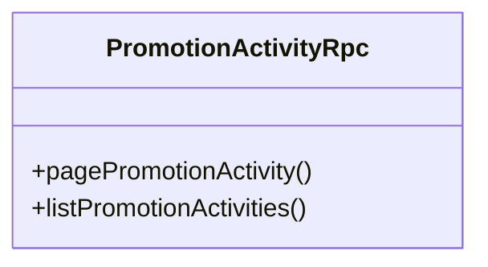
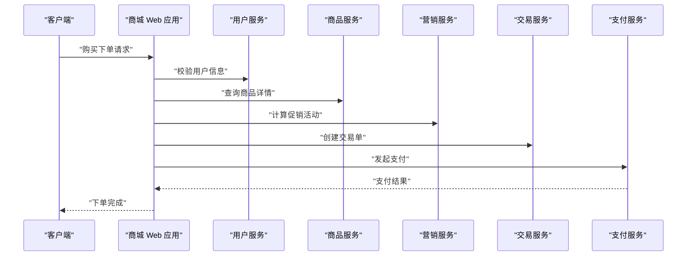
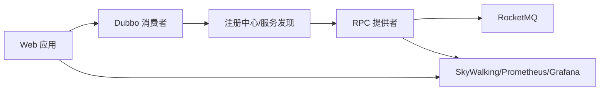

# 微服务架构设计

<cite>
**本文引用的文件**
- [README.md](file://README.md)
- [pom.xml](file://pom.xml)
- [application.yml（管理后台 Web）](file://management-web-app/src/main/resources/application.yml)
- [application.yml（商城 Web）](file://shop-web-app/src/main/resources/application.yml)
- [application.yaml（用户服务 App）](file://user-service-project/user-service-app/src/main/resources/application.yaml)
- [application.yaml（系统服务 App）](file://system-service-project/system-service-app/src/main/resources/application.yaml)
- [application.yaml（支付服务 App）](file://pay-service-project/pay-service-app/src/main/resources/application.yaml)
- [AdminRpc.java（系统服务 API）](file://system-service-project/system-service-api/src/main/java/cn/iocoder/mall/systemservice/rpc/admin/AdminRpc.java)
- [PayTransactionRpc.java（支付服务 API）](file://pay-service-project/pay-service-api/src/main/java/cn/iocoder/mall/payservice/rpc/transaction/PayTransactionRpc.java)
- [ProductSpuRpc.java（商品服务 API）](file://product-service-project/product-service-api/src/main/java/cn/iocoder/mall/productservice/rpc/spu/ProductSpuRpc.java)
- [PromotionActivityRpc.java（营销服务 API）](file://promotion-service-project/promotion-service-api/src/main/java/cn/iocoder/mall/promotion/api/rpc/activity/PromotionActivityRpc.java)
</cite>

## 目录
1. [简介](#简介)
2. [项目结构](#项目结构)
3. [核心组件](#核心组件)
4. [架构总览](#架构总览)
5. [详细组件分析](#详细组件分析)
6. [依赖分析](#依赖分析)
7. [性能考量](#性能考量)
8. [故障排查指南](#故障排查指南)
9. [结论](#结论)
10. [附录](#附录)

## 简介
本项目基于 Spring Boot 2.2.4 与 Spring Cloud Alibaba，采用微服务架构拆分用户、商品、交易、支付、营销、系统、搜索等核心服务，结合 Dubbo（RPC）、HTTP REST、消息队列 RocketMQ 等多种通信方式，实现高内聚、低耦合的服务化体系。项目同时引入 SkyWalking、Prometheus/Grafana、Sentinel 等监控与治理能力，支撑电商 B2C 场景的业务演进。

## 项目结构
项目采用多模块聚合结构，顶层 POM 聚合公共模块与各服务模块；每个服务遵循“xxx-web-app + xxx-service-project”的双层结构：Web 层负责对外 HTTP API，Service 层负责内部 RPC 提供者与消费者。

图表来源
- [pom.xml:16-28](file://pom.xml#L16-L28)
- [application.yml（管理后台 Web）:1-83](file://management-web-app/src/main/resources/application.yml#L1-L83)
- [application.yml（商城 Web）:1-76](file://shop-web-app/src/main/resources/application.yml#L1-L76)
- [application.yaml（用户服务 App）:1-53](file://user-service-project/user-service-app/src/main/resources/application.yaml#L1-L53)
- [application.yaml（系统服务 App）:1-79](file://system-service-project/system-service-app/src/main/resources/application.yaml#L1-L79)
- [application.yaml（支付服务 App）:1-65](file://pay-service-project/pay-service-app/src/main/resources/application.yaml#L1-L65)

章节来源
- [pom.xml:16-28](file://pom.xml#L16-L28)
- [README.md:107-139](file://README.md#L107-L139)

## 核心组件
- 管理后台 Web 应用：提供管理端 HTTP API，订阅系统、用户、商品、营销、支付等服务。
- 商城 Web 应用：提供用户购物流程 HTTP API，订阅用户、系统、商品、营销、交易、支付等服务。
- 用户服务：提供用户、地址、短信验证码等 RPC 接口。
- 系统服务：提供管理员、权限、字典、日志、错误码等 RPC 接口。
- 商品服务：提供 SPU、SKU、分类、品牌等 RPC 接口。
- 交易服务：提供购物车、订单等 RPC 接口。
- 支付服务：提供支付交易单创建、提交、查询、成功更新等 RPC 接口，并集成 RocketMQ。
- 营销服务：提供活动、优惠券、推荐等 RPC 接口。
- 搜索服务：提供商品检索 RPC 接口。

章节来源
- [application.yml（管理后台 Web）:19-71](file://management-web-app/src/main/resources/application.yml#L19-L71)
- [application.yml（商城 Web）:19-63](file://shop-web-app/src/main/resources/application.yml#L19-L63)
- [application.yaml（用户服务 App）:21-46](file://user-service-project/user-service-app/src/main/resources/application.yaml#L21-L46)
- [application.yaml（系统服务 App）:22-60](file://system-service-project/system-service-app/src/main/resources/application.yaml#L22-L60)
- [application.yaml（支付服务 App）:21-46](file://pay-service-project/pay-service-app/src/main/resources/application.yaml#L21-L46)
- [AdminRpc.java:14-26](file://system-service-project/system-service-api/src/main/java/cn/iocoder/mall/systemservice/rpc/admin/AdminRpc.java#L14-L26)
- [PayTransactionRpc.java:10-52](file://pay-service-project/pay-service-api/src/main/java/cn/iocoder/mall/payservice/rpc/transaction/PayTransactionRpc.java#L10-L52)
- [ProductSpuRpc.java:13-65](file://product-service-project/product-service-api/src/main/java/cn/iocoder/mall/productservice/rpc/spu/ProductSpuRpc.java#L13-L65)
- [PromotionActivityRpc.java:14-20](file://promotion-service-project/promotion-service-api/src/main/java/cn/iocoder/mall/promotion/api/rpc/activity/PromotionActivityRpc.java#L14-L20)

## 架构总览
系统采用“HTTP 网关 + Dubbo RPC + 消息队列”的混合通信模式：
- HTTP 层：管理后台与商城 Web 应用通过 Spring MVC 对外提供 REST API。
- RPC 层：服务间通过 Dubbo（Spring Cloud Alibaba）进行高性能 RPC 调用。
- 消息层：支付服务通过 RocketMQ 异步解耦，支持异步通知与对账。

图表来源
- [application.yml（管理后台 Web）:19-71](file://management-web-app/src/main/resources/application.yml#L19-L71)
- [application.yml（商城 Web）:19-63](file://shop-web-app/src/main/resources/application.yml#L19-L63)
- [application.yaml（支付服务 App）:47-52](file://pay-service-project/pay-service-app/src/main/resources/application.yaml#L47-L52)

## 详细组件分析

### 用户服务（User Service）
- 角色定位：提供用户、地址、短信验证码等 RPC 接口，供 Web 层与其它服务消费。
- 关键点：
  - Dubbo 提供者协议与扫描包配置。
  - Actuator 独立端口暴露监控指标。
- 服务边界：围绕用户域的增删改查、登录态、地址管理等。

图表来源
- [application.yaml（用户服务 App）:37-42](file://user-service-project/user-service-app/src/main/resources/application.yaml#L37-L42)

章节来源
- [application.yaml（用户服务 App）:21-53](file://user-service-project/user-service-app/src/main/resources/application.yaml#L21-L53)

### 系统服务（System Service）
- 角色定位：提供管理员、权限、字典、日志、错误码等通用能力。
- 关键点：
  - 多个 RPC 接口（管理员、资源、角色、权限、部门、数据字典、系统日志、错误码）。
  - 通过错误码组与常量类统一管理错误码。
- 服务边界：跨业务的基础设施能力，强调稳定与复用。

图表来源
- [AdminRpc.java:14-26](file://system-service-project/system-service-api/src/main/java/cn/iocoder/mall/systemservice/rpc/admin/AdminRpc.java#L14-L26)
- [application.yaml（系统服务 App）:39-56](file://system-service-project/system-service-app/src/main/resources/application.yaml#L39-L56)

章节来源
- [application.yaml（系统服务 App）:22-79](file://system-service-project/system-service-app/src/main/resources/application.yaml#L22-L79)

### 商品服务（Product Service）
- 角色定位：提供商品 SPU/ SKU/ 分类/ 品牌等核心数据的 RPC 接口。
- 关键点：
  - 支持创建、更新、分页、明细查询、顺序 ID 列表等。
- 服务边界：商品主数据域，强调一致性与高可用。

图表来源
- [ProductSpuRpc.java:13-65](file://product-service-project/product-service-api/src/main/java/cn/iocoder/mall/productservice/rpc/spu/ProductSpuRpc.java#L13-L65)

章节来源
- [application.yaml（系统服务 App）:22-79](file://system-service-project/system-service-app/src/main/resources/application.yaml#L22-L79)

### 支付服务（Pay Service）
- 角色定位：提供支付交易单生命周期管理的 RPC 接口，并通过 RocketMQ 异步处理支付回调与通知。
- 关键点：
  - 创建、提交、查询、成功更新、分页查询等接口。
  - 集成 RocketMQ NameServer 与生产者组配置。
- 服务边界：支付域，强调幂等、一致性与异步解耦。

图表来源
- [PayTransactionRpc.java:10-52](file://pay-service-project/pay-service-api/src/main/java/cn/iocoder/mall/payservice/rpc/transaction/PayTransactionRpc.java#L10-L52)

章节来源
- [application.yaml（支付服务 App）:21-65](file://pay-service-project/pay-service-app/src/main/resources/application.yaml#L21-L65)

### 营销服务（Promotion Service）
- 角色定位：提供活动、优惠券、推荐等促销能力的 RPC 接口。
- 关键点：
  - 活动分页与列表查询接口。
- 服务边界：促销域，强调规则引擎与实时计算。

图表来源
- [PromotionActivityRpc.java:14-20](file://promotion-service-project/promotion-service-api/src/main/java/cn/iocoder/mall/promotion/api/rpc/activity/PromotionActivityRpc.java#L14-L20)

章节来源
- [application.yml（商城 Web）:46-57](file://shop-web-app/src/main/resources/application.yml#L46-L57)

### 交易服务（Trade Service）
- 角色定位：提供购物车、订单等交易域能力（接口定义位于模块中，具体实现按需扩展）。
- 关键点：
  - 与支付、商品、营销服务存在紧密协作。
- 服务边界：交易域，强调事务一致性与状态流转。

章节来源
- [application.yml（商城 Web）:56-58](file://shop-web-app/src/main/resources/application.yml#L56-L58)

### 搜索服务（Search Service）
- 角色定位：提供商品检索 RPC 接口（接口定义位于模块中，具体实现按需扩展）。
- 关键点：
  - 与商品服务协同，提供高效检索能力。
- 服务边界：搜索域，强调性能与可扩展性。

章节来源
- [application.yml（商城 Web）:42-43](file://shop-web-app/src/main/resources/application.yml#L42-L43)

### Web 应用（管理后台与商城）
- 角色定位：对外提供 HTTP API，作为系统的统一入口。
- 关键点：
  - Dubbo 消费者侧配置，声明式订阅所需服务。
  - Swagger 文档与 Actuator 监控端点。
- 服务边界：面向外部的 API 网关层，负责编排与转发。

图表来源
- [application.yml（商城 Web）:19-63](file://shop-web-app/src/main/resources/application.yml#L19-L63)

章节来源
- [application.yml（管理后台 Web）:19-71](file://management-web-app/src/main/resources/application.yml#L19-L71)
- [application.yml（商城 Web）:19-76](file://shop-web-app/src/main/resources/application.yml#L19-L76)

## 依赖分析
- 服务注册与发现：通过 Spring Cloud Alibaba Dubbo 的云配置实现服务订阅与发现（消费者侧通过 subscribed-services 指定订阅范围）。
- 负载均衡：Dubbo 默认使用随机轮询策略，可通过集群容错与路由策略进一步细化。
- 熔断降级：项目计划引入 Sentinel，当前未见显式配置，建议在网关或服务侧逐步接入。
- 配置管理：系统服务通过错误码组与常量类集中管理错误码；Web 层通过 application.yml 配置 Dubbo 消费者版本与超时等。
- 监控与可观测性：SkyWalking（分布式追踪）、Prometheus/Grafana（指标可视化）、Actuator（健康检查与指标导出）。
- 消息队列：支付服务集成 RocketMQ，用于异步通知与对账。

图表来源
- [application.yml（管理后台 Web）:22-23](file://management-web-app/src/main/resources/application.yml#L22-L23)
- [application.yml（商城 Web）:22-23](file://shop-web-app/src/main/resources/application.yml#L22-L23)
- [application.yaml（支付服务 App）:47-52](file://pay-service-project/pay-service-app/src/main/resources/application.yaml#L47-L52)
- [README.md:185-199](file://README.md#L185-L199)

章节来源
- [application.yml（管理后台 Web）:22-23](file://management-web-app/src/main/resources/application.yml#L22-L23)
- [application.yml（商城 Web）:22-23](file://shop-web-app/src/main/resources/application.yml#L22-L23)
- [application.yaml（支付服务 App）:47-52](file://pay-service-project/pay-service-app/src/main/resources/application.yaml#L47-L52)
- [README.md:185-199](file://README.md#L185-L199)

## 性能考量
- RPC 调用链路优化：合理设置 Dubbo 超时时间与重试策略，避免长尾延迟放大。
- 缓存策略：结合 Redis/Redisson 在热点数据读取场景提升吞吐。
- 并发与限流：在网关与服务侧引入限流与隔离，防止雪崩效应。
- 指标与告警：完善 Prometheus 指标采集与 Grafana 可视化，建立告警闭环。
- 消息处理：RocketMQ 生产者/消费者并发度与批量发送策略需按业务峰值调优。

## 故障排查指南
- 服务不可达
  - 检查 Dubbo 消费者订阅配置（subscribed-services）是否正确。
  - 确认提供者端 Dubbo 协议与扫描包配置无误。
- 调用超时
  - 调整 Dubbo consumer.timeout 与 provider.validation。
  - 结合 Actuator 指标观察 RT 与异常分布。
- 错误码不一致
  - 核对系统服务的错误码组与常量类配置。
- 监控缺失
  - 确认 Actuator 暴露端点与监控平台连通性。
  - SkyWalking Agent 与探针配置正确。

章节来源
- [application.yml（管理后台 Web）:25-28](file://management-web-app/src/main/resources/application.yml#L25-L28)
- [application.yml（商城 Web）:25-27](file://shop-web-app/src/main/resources/application.yml#L25-L27)
- [application.yaml（系统服务 App）:68-79](file://system-service-project/system-service-app/src/main/resources/application.yaml#L68-L79)
- [README.md:185-199](file://README.md#L185-L199)

## 结论
Onemall 以 Spring Cloud Alibaba 为核心，构建了以 Dubbo 为主的 RPC 服务体系，配合 HTTP 网关与 RocketMQ 异步解耦，形成清晰的服务边界与高效的协作机制。通过 SkyWalking、Prometheus/Grafana、Actuator 等手段实现可观测性，为后续引入 Sentinel 熔断降级与 Apollo 配置中心提供了良好基础。建议在网关与关键服务侧逐步落地限流、隔离与降级策略，持续优化 RPC 调用链路与缓存命中率，确保系统在高并发场景下的稳定性与性能。

## 附录
- 项目端口与模块映射
  - 管理后台 Web：18083
  - 商城 Web：18084
  - 各 RPC 服务：随机端口（由 Actuator 独立暴露监控端口）

章节来源
- [README.md:109-125](file://README.md#L109-L125)