# 服务拆分原则与边界

<cite>
**本文引用的文件**
- [README.md](file://README.md)
- [pom.xml](file://pom.xml)
- [UserRpc.java](file://user-service-project/user-service-api/src/main/java/cn/iocoder/mall/userservice/rpc/user/UserRpc.java)
- [PayTransactionRpc.java](file://pay-service-project/pay-service-api/src/main/java/cn/iocoder/mall/payservice/rpc/transaction/PayTransactionRpc.java)
- [AdminRpc.java](file://system-service-project/system-service-api/src/main/java/cn/iocoder/mall/systemservice/rpc/admin/AdminRpc.java)
- [PreferentialTypeEnum.java](file://promotion-service-project/promotion-service-api/src/main/java/cn/iocoder/mall/promotion/api/enums/PreferentialTypeEnum.java)
- [AdminStatusEnum.java](file://system-service-project/system-service-api/src/main/java/cn/iocoder/mall/systemservice/enums/admin/AdminStatusEnum.java)
</cite>

## 目录
1. [引言](#引言)
2. [项目结构](#项目结构)
3. [核心组件](#核心组件)
4. [架构总览](#架构总览)
5. [详细组件分析](#详细组件分析)
6. [依赖分析](#依赖分析)
7. [性能考量](#性能考量)
8. [故障排查指南](#故障排查指南)
9. [结论](#结论)
10. [附录](#附录)

## 引言
本文件围绕 Onemall 的微服务拆分原则展开，结合 DDD 的领域边界划分思想，系统阐述用户服务、商品服务、交易服务、支付服务、营销服务、系统服务、搜索服务等核心服务的职责边界与业务范围，并给出服务边界图与职责矩阵，帮助开发者快速理解每个服务的核心功能及彼此关系。

## 项目结构
Onemall 采用多模块聚合工程组织，顶层 POM 明确声明了各服务模块与 Web 应用模块，形成“Web 应用 + RPC 服务”的典型分层结构。服务模块遵循统一的命名规范：xxx-service-project，内部再细分为 xxx-service-api（RPC 接口）与 xxx-service-app（实现与启动）。

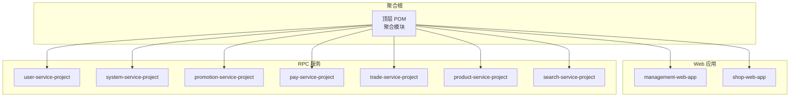

图表来源
- [pom.xml:16-27](file://pom.xml#L16-L27)

章节来源
- [pom.xml:16-27](file://pom.xml#L16-L27)
- [README.md:129-139](file://README.md#L129-L139)

## 核心组件
本节聚焦七大核心服务的职责边界与业务范围，结合其 RPC 接口与枚举定义，提炼出各服务的领域模型与边界。

- 用户服务（user-service-project）
  - 职责边界：用户生命周期管理、用户基础信息维护、用户与地址、短信等子域的协同。
  - 关键接口：用户查询、创建、更新、分页等。
  - 代表接口：UserRpc
  - 业务范围：用户域（身份、资料、行为）

- 系统服务（system-service-project）
  - 职责边界：后台管理员、权限、数据字典、错误码、日志等基础设施能力。
  - 关键接口：管理员认证、增删改查、分页查询等。
  - 代表接口：AdminRpc；代表枚举：AdminStatusEnum
  - 业务范围：系统域（组织、权限、配置）

- 支付服务（pay-service-project）
  - 职责边界：支付交易单的创建、提交、查询、成功标记与分页查询。
  - 关键接口：创建支付交易单、提交支付、查询、标记成功、分页。
  - 代表接口：PayTransactionRpc
  - 业务范围：支付域（交易、渠道、退款）

- 营销服务（promotion-service-project）
  - 职责边界：营销活动、优惠券、价格计算、推荐、横幅等促销能力。
  - 关键枚举：优惠类型（满减/折扣）等。
  - 代表枚举：PreferentialTypeEnum
  - 业务范围：营销域（活动、优惠、规则）

- 商品服务（product-service-project）
  - 职责边界：SPU/SKU、属性、品牌、分类等商品主数据管理。
  - 业务范围：商品域（SPU/SKU、属性、品牌、分类）

- 交易服务（trade-service-project）
  - 职责边界：订单、购物车、售后、物流等交易相关能力。
  - 业务范围：订单域（下单、支付、发货、售后、退货换货）

- 搜索服务（search-service-project）
  - 职责边界：商品检索、索引与查询能力。
  - 业务范围：搜索域（商品搜索、排序、过滤）

章节来源
- [UserRpc.java:12-54](file://user-service-project/user-service-api/src/main/java/cn/iocoder/mall/userservice/rpc/user/UserRpc.java#L12-L54)
- [PayTransactionRpc.java:10-52](file://pay-service-project/pay-service-api/src/main/java/cn/iocoder/mall/payservice/rpc/transaction/PayTransactionRpc.java#L10-L52)
- [AdminRpc.java:14-26](file://system-service-project/system-service-api/src/main/java/cn/iocoder/mall/systemservice/rpc/admin/AdminRpc.java#L14-L26)
- [PreferentialTypeEnum.java:10-46](file://promotion-service-project/promotion-service-api/src/main/java/cn/iocoder/mall/promotion/api/enums/PreferentialTypeEnum.java#L10-L46)
- [AdminStatusEnum.java:10-44](file://system-service-project/system-service-api/src/main/java/cn/iocoder/mall/systemservice/enums/admin/AdminStatusEnum.java#L10-L44)

## 架构总览
下图展示了 Web 应用通过 RPC 调用各服务的典型交互路径，体现“高内聚、低耦合”的拆分原则与业务能力边界。

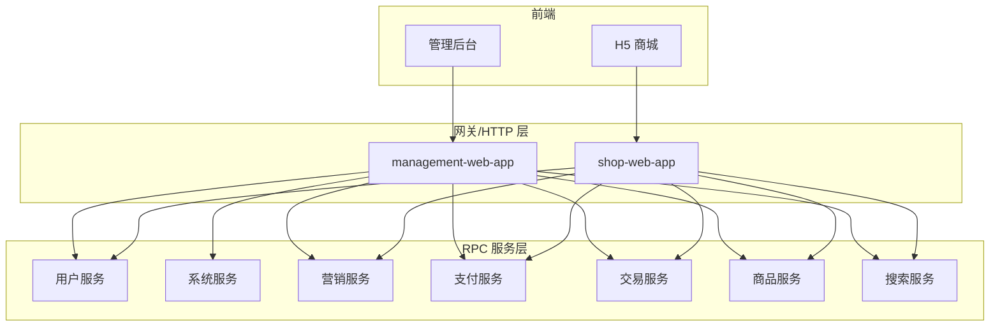

图表来源
- [README.md:119-125](file://README.md#L119-L125)
- [pom.xml:16-27](file://pom.xml#L16-L27)

## 详细组件分析

### 用户服务（UserRpc）
- 设计要点
  - 单一职责：围绕用户实体的 CRUD 与分页查询，职责清晰。
  - 高内聚：与用户相关的地址、短信等子域通过 RPC 聚合调用。
  - 低耦合：对外暴露稳定 DTO，避免上层直接依赖实现细节。
- 典型流程（创建用户）
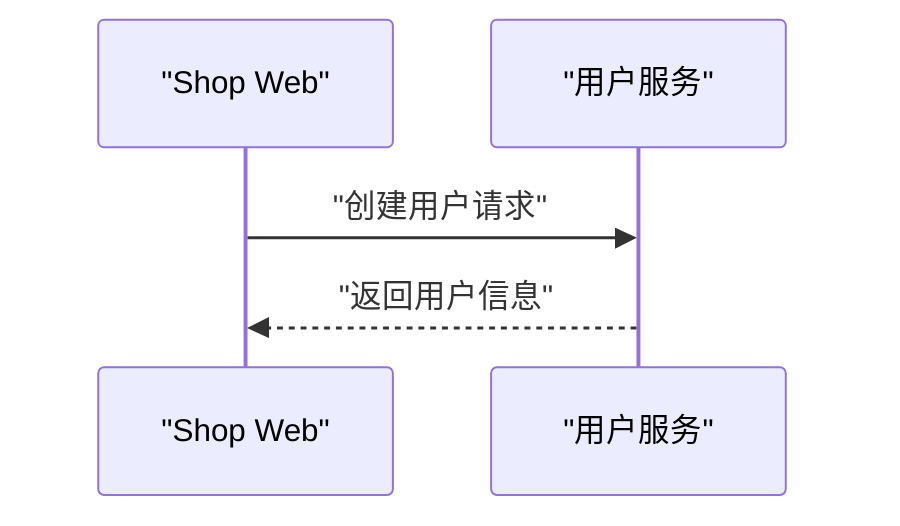

图表来源
- [UserRpc.java:29](file://user-service-project/user-service-api/src/main/java/cn/iocoder/mall/userservice/rpc/user/UserRpc.java#L29)

章节来源
- [UserRpc.java:12-54](file://user-service-project/user-service-api/src/main/java/cn/iocoder/mall/userservice/rpc/user/UserRpc.java#L12-L54)

### 支付服务（PayTransactionRpc）
- 设计要点
  - 交易单生命周期：创建 → 提交 → 查询 → 成功标记 → 分页。
  - 与外部渠道解耦：提交时返回第三方响应，便于扩展与对账。
- 典型流程（提交支付）
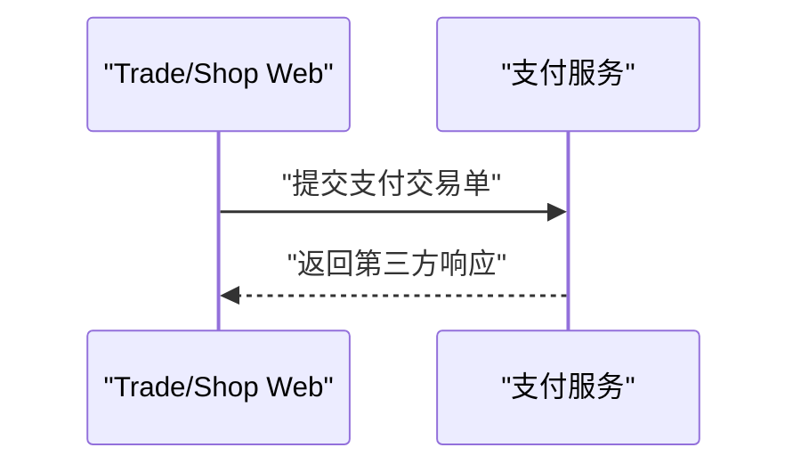

图表来源
- [PayTransactionRpc.java:26](file://pay-service-project/pay-service-api/src/main/java/cn/iocoder/mall/payservice/rpc/transaction/PayTransactionRpc.java#L26)

章节来源
- [PayTransactionRpc.java:10-52](file://pay-service-project/pay-service-api/src/main/java/cn/iocoder/mall/payservice/rpc/transaction/PayTransactionRpc.java#L10-L52)

### 系统服务（AdminRpc 与 AdminStatusEnum）
- 设计要点
  - 管理员域：认证、增删改查、分页、状态管理。
  - 枚举化治理：AdminStatusEnum 统一状态值域，保证一致性。
- 典型流程（管理员认证）
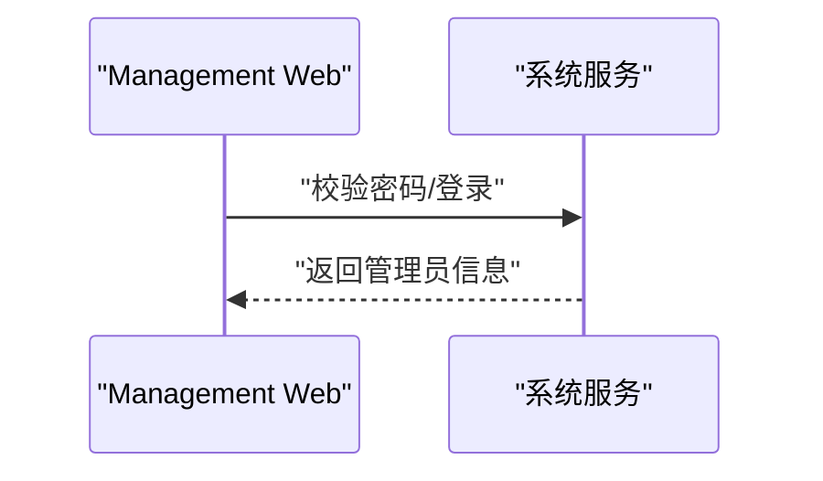

图表来源
- [AdminRpc.java:16](file://system-service-project/system-service-api/src/main/java/cn/iocoder/mall/systemservice/rpc/admin/AdminRpc.java#L16)
- [AdminStatusEnum.java:10-44](file://system-service-project/system-service-api/src/main/java/cn/iocoder/mall/systemservice/enums/admin/AdminStatusEnum.java#L10-L44)

章节来源
- [AdminRpc.java:14-26](file://system-service-project/system-service-api/src/main/java/cn/iocoder/mall/systemservice/rpc/admin/AdminRpc.java#L14-L26)
- [AdminStatusEnum.java:10-44](file://system-service-project/system-service-api/src/main/java/cn/iocoder/mall/systemservice/enums/admin/AdminStatusEnum.java#L10-L44)

### 营销服务（PreferentialTypeEnum）
- 设计要点
  - 优惠类型枚举：统一“减价/打折”等值域，支撑价格计算与活动规则。
  - 与交易/商品服务协作：在下单时参与价格计算与优惠生效。
- 流程示意（优惠类型决策）
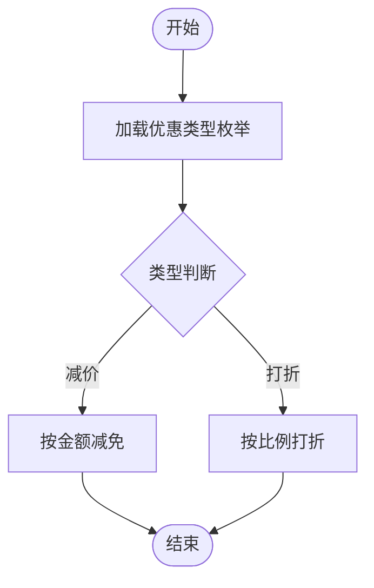

图表来源
- [PreferentialTypeEnum.java:10-46](file://promotion-service-project/promotion-service-api/src/main/java/cn/iocoder/mall/promotion/api/enums/PreferentialTypeEnum.java#L10-L46)

章节来源
- [PreferentialTypeEnum.java:10-46](file://promotion-service-project/promotion-service-api/src/main/java/cn/iocoder/mall/promotion/api/enums/PreferentialTypeEnum.java#L10-L46)

### 商品服务（概念性说明）
- 设计要点
  - 商品主数据：SPU/SKU、属性、品牌、分类。
  - 与搜索/交易/营销协作：提供商品详情、库存、价格、活动价等。
- 交互示意（商品检索）
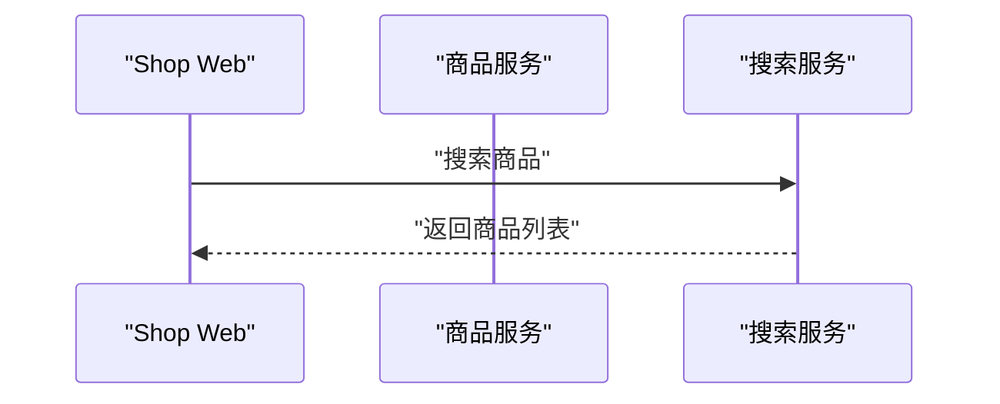

（本图为概念示意，不对应具体源码文件）

### 交易服务（概念性说明）
- 设计要点
  - 订单域：下单、支付、发货、售后、退货换货。
  - 与支付/商品/营销协作：串联支付、库存锁定、优惠计算。
- 交互示意（下单流程）
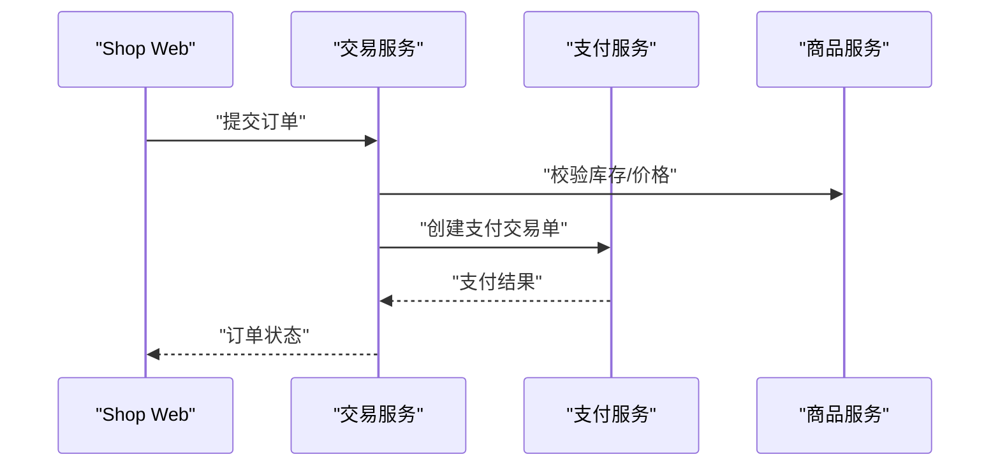

（本图为概念示意，不对应具体源码文件）

### 搜索服务（概念性说明）
- 设计要点
  - 商品检索：关键词、分类、品牌、价格区间等多维过滤。
  - 与商品服务协同：索引同步、实时更新。
- 交互示意（搜索请求）
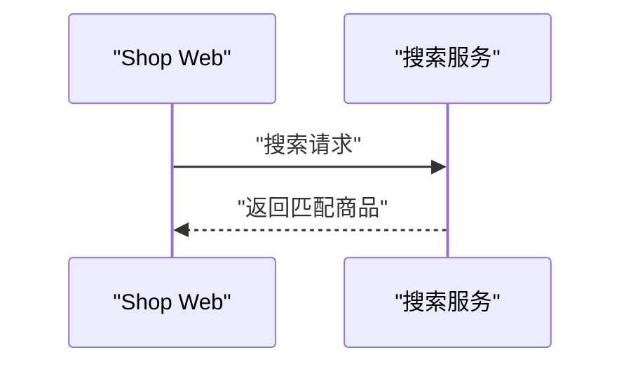

（本图为概念示意，不对应具体源码文件）

## 依赖分析
- 模块依赖
  - Web 应用仅依赖 RPC 接口，不直接依赖实现，降低耦合。
  - 服务间通过 RPC 接口通信，避免跨服务直接访问数据库。
- 枚举与常量
  - 通过枚举统一值域，减少魔法数与不一致风险。
- 外部依赖
  - 支付、消息队列、分布式事务等中间件在服务内部实现，对外保持透明。

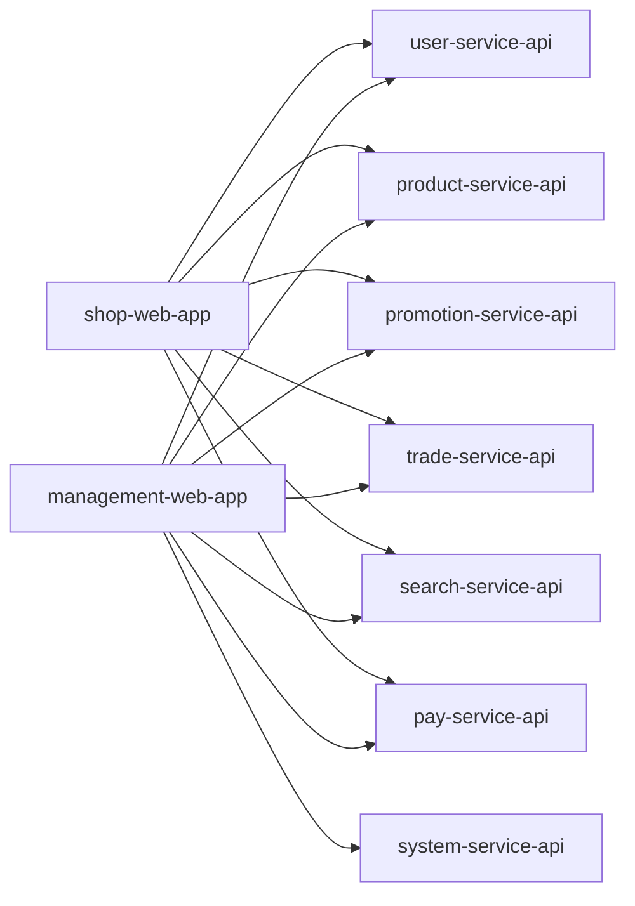

图表来源
- [pom.xml:16-27](file://pom.xml#L16-L27)

章节来源
- [pom.xml:16-27](file://pom.xml#L16-L27)

## 性能考量
- 服务粒度与热点隔离
  - 将用户、商品、交易、支付等拆分为独立服务，避免热点互相影响。
- RPC 调用与序列化
  - 使用稳定 DTO，减少序列化开销；批量接口（如批量查询用户）提升吞吐。
- 缓存与异步
  - 对高频读取的数据（如商品详情、营销规则）引入缓存；对非实时操作（如日志、通知）采用消息队列异步处理。
- 分布式事务
  - 跨服务一致性通过分布式事务中间件或最终一致性方案保障。

## 故障排查指南
- 常见问题定位
  - RPC 调用失败：检查服务是否启动、注册中心连通性、接口签名与版本。
  - 参数校验失败：核对 DTO 字段与枚举值域（如 AdminStatusEnum、PreferentialTypeEnum）。
  - 业务异常：查看服务侧日志与链路追踪，定位具体环节。
- 建议流程
  - 先验证上游服务可用性，再逐步回溯到具体服务。
  - 结合监控指标（延迟、错误率、线程池）定位瓶颈。

## 结论
Onemall 的微服务拆分遵循 DDD 的领域边界划分原则，围绕用户、商品、订单、支付、营销、系统、搜索等核心业务域建立独立服务，通过 RPC 接口实现高内聚、低耦合。配合枚举化治理与清晰的职责矩阵，有助于长期演进与团队协作。

## 附录

### 服务边界图（基于领域模型）
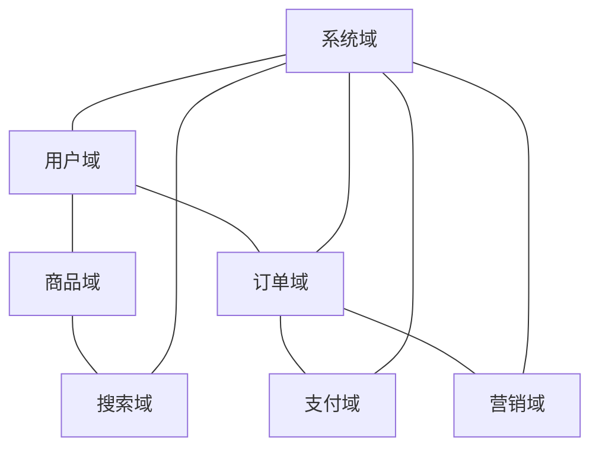

（本图为概念示意，不对应具体源码文件）

### 服务职责矩阵（示例）
- 用户服务：用户查询、创建、更新、分页
- 系统服务：管理员认证、增删改查、分页、状态管理
- 支付服务：创建交易单、提交、查询、成功标记、分页
- 营销服务：活动、优惠券、价格计算、推荐、横幅
- 商品服务：SPU/SKU、属性、品牌、分类
- 交易服务：订单、购物车、售后、物流
- 搜索服务：商品检索、索引

章节来源
- [UserRpc.java:12-54](file://user-service-project/user-service-api/src/main/java/cn/iocoder/mall/userservice/rpc/user/UserRpc.java#L12-L54)
- [PayTransactionRpc.java:10-52](file://pay-service-project/pay-service-api/src/main/java/cn/iocoder/mall/payservice/rpc/transaction/PayTransactionRpc.java#L10-L52)
- [AdminRpc.java:14-26](file://system-service-project/system-service-api/src/main/java/cn/iocoder/mall/systemservice/rpc/admin/AdminRpc.java#L14-L26)
- [PreferentialTypeEnum.java:10-46](file://promotion-service-project/promotion-service-api/src/main/java/cn/iocoder/mall/promotion/api/enums/PreferentialTypeEnum.java#L10-L46)
- [AdminStatusEnum.java:10-44](file://system-service-project/system-service-api/src/main/java/cn/iocoder/mall/systemservice/enums/admin/AdminStatusEnum.java#L10-L44)