# 服务拓扑与依赖关系

<cite>
**本文引用的文件**
- [README.md](file://README.md)
- [pom.xml](file://pom.xml)
- [ManagementWebApplication.java](file://management-web-app/src/main/java/cn/iocoder/mall/managementweb/ManagementWebApplication.java)
- [ShopWebApplication.java](file://shop-web-app/src/main/java/cn/iocoder/mall/shopweb/ShopWebApplication.java)
- [application.yml（管理后台）](file://management-web-app/src/main/resources/application.yml)
- [application.yml（商城前台）](file://shop-web-app/src/main/resources/application.yml)
- [UserServiceApplication.java](file://user-service-project/user-service-app/src/main/java/cn/iocoder/mall/userservice/UserServiceApplication.java)
- [SystemServiceApplication.java](file://system-service-project/system-service-app/src/main/java/cn/iocoder/mall/systemservice/SystemServiceApplication.java)
- [PayServiceApplication.java](file://pay-service-project/pay-service-app/src/main/java/cn/iocoder/mall/payservice/PayServiceApplication.java)
- [TradeServiceApplication.java](file://trade-service-project/trade-service-app/src/main/java/cn/iocoder/mall/tradeservice/TradeServiceApplication.java)
- [ProductServiceApplication.java](file://product-service-project/product-service-app/src/main/java/cn/iocoder/mall/productservice/ProductServiceApplication.java)
- [PromotionServiceApplication.java](file://promotion-service-project/promotion-service-app/src/main/java/cn/iocoder/mall/promotionservice/PromotionServiceApplication.java)
- [SearchServiceApplication.java](file://search-service-project/search-service-app/src/main/java/cn/iocoder/mall/searchservice/SearchServiceApplication.java)
- [application.yaml（用户服务）](file://user-service-project/user-service-app/src/main/resources/application.yaml)
- [application.yaml（系统服务）](file://system-service-project/system-service-app/src/main/resources/application.yaml)
- [application.yaml（支付服务）](file://pay-service-project/pay-service-app/src/main/resources/application.yaml)
- [application.yaml（交易服务）](file://trade-service-project/trade-service-app/src/main/resources/application.yaml)
- [application.yaml（商品服务）](file://product-service-project/product-service-app/src/main/resources/application.yaml)
- [application.yaml（营销服务）](file://promotion-service-project/promotion-service-app/src/main/resources/application.yaml)
- [application.yaml（搜索服务）](file://search-service-project/search-service-app/src/main/resources/application.yaml)
</cite>

## 目录
1. [引言](#引言)
2. [项目结构](#项目结构)
3. [核心组件](#核心组件)
4. [架构总览](#架构总览)
5. [详细组件分析](#详细组件分析)
6. [依赖分析](#依赖分析)
7. [性能考量](#性能考量)
8. [故障排查指南](#故障排查指南)
9. [结论](#结论)
10. [附录](#附录)

## 引言
本文件面向 Onemall 微服务架构，聚焦服务拓扑与依赖关系，绘制完整微服务架构图，明确用户服务、商品服务、交易服务、支付服务、营销服务、系统服务、搜索服务之间的依赖与数据流向；梳理服务启动顺序与依赖关系（含 Dubbo 注册发现、RocketMQ 消息、Elasticsearch 搜索等），并给出典型业务流程的调用链路与时序图。同时，提供横向扩展能力与运维监控要点，帮助开发者快速理解整体架构与职责分工。

## 项目结构
- 项目采用多模块聚合工程组织，包含前后端与多个后端微服务模块。
- 核心后端模块（RPC 服务）按“xxx-service-project”命名，每个模块包含“xxx-service-api”（RPC 接口）与“xxx-service-app”（RPC 实现）两部分。
- 前端模块分别为“management-web-app”（管理后台 HTTP 服务）与“shop-web-app”（商城前台 HTTP 服务）。

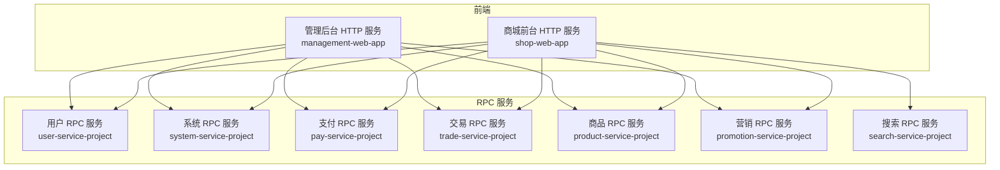

图表来源
- [pom.xml:16-27](file://pom.xml#L16-L27)
- [README.md:129-139](file://README.md#L129-L139)

章节来源
- [pom.xml:16-27](file://pom.xml#L16-L27)
- [README.md:109-126](file://README.md#L109-L126)
- [README.md:129-139](file://README.md#L129-L139)

## 核心组件
- 管理后台 HTTP 服务（management-web-app）
  - 对外提供管理端 API，订阅系统服务等 RPC。
- 商城前台 HTTP 服务（shop-web-app）
  - 对外提供用户购物流程 API，订阅用户、系统、商品、营销、交易、支付、搜索等 RPC。
- RPC 服务
  - 用户服务：用户、地址、短信等 RPC。
  - 系统服务：权限、字典、日志、错误码等 RPC。
  - 商品服务：SPU、SKU、属性等 RPC。
  - 营销服务：活动、优惠券、推荐等 RPC。
  - 交易服务：购物车、订单、售后、物流等 RPC。
  - 支付服务：交易、退款等 RPC。
  - 搜索服务：商品搜索 RPC。

章节来源
- [application.yml（管理后台）:19-71](file://management-web-app/src/main/resources/application.yml#L19-L71)
- [application.yml（商城前台）:19-59](file://shop-web-app/src/main/resources/application.yml#L19-L59)
- [application.yaml（用户服务）:21-47](file://user-service-project/user-service-app/src/main/resources/application.yaml#L21-L47)
- [application.yaml（系统服务）:22-61](file://system-service-project/system-service-app/src/main/resources/application.yaml#L22-L61)
- [application.yaml（商品服务）:21-46](file://product-service-project/product-service-app/src/main/resources/application.yaml#L21-L46)
- [application.yaml（营销服务）:21-46](file://promotion-service-project/promotion-service-app/src/main/resources/application.yaml#L21-L46)
- [application.yaml（交易服务）:21-52](file://trade-service-project/trade-service-app/src/main/resources/application.yaml#L21-L52)
- [application.yaml（支付服务）:21-42](file://pay-service-project/pay-service-app/src/main/resources/application.yaml#L21-L42)
- [application.yaml（搜索服务）:19-46](file://search-service-project/search-service-app/src/main/resources/application.yaml#L19-L46)

## 架构总览
- 服务间通信采用 Dubbo（Spring Cloud Alibaba）RPC，消费者通过“subscribed-services”订阅所需服务。
- 消息中间件采用 RocketMQ，服务通过生产者组发送异步消息。
- 搜索服务对接 Elasticsearch。
- 各服务独立暴露 Actuator 监控端口，便于集中治理与观测。

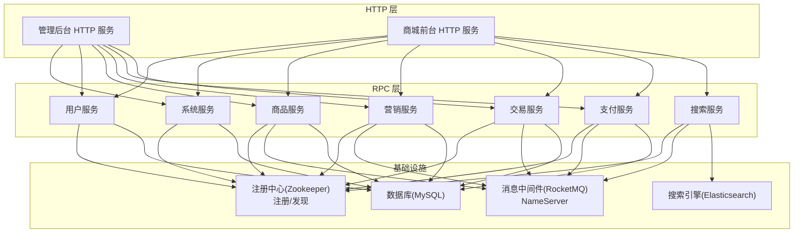

图表来源
- [application.yml（管理后台）:22-23](file://management-web-app/src/main/resources/application.yml#L22-L23)
- [application.yml（商城前台）:22-23](file://shop-web-app/src/main/resources/application.yml#L22-L23)
- [application.yaml（商品服务）:44-47](file://product-service-project/product-service-app/src/main/resources/application.yaml#L44-L47)
- [application.yaml（营销服务）:48-51](file://promotion-service-project/promotion-service-app/src/main/resources/application.yaml#L48-L51)
- [application.yaml（交易服务）:54-57](file://trade-service-project/trade-service-app/src/main/resources/application.yaml#L54-L57)
- [application.yaml（支付服务）:48-51](file://pay-service-project/pay-service-app/src/main/resources/application.yaml#L48-L51)
- [application.yaml（搜索服务）:48-49](file://search-service-project/search-service-app/src/main/resources/application.yaml#L48-L49)
- [application.yaml（用户服务）:25-26](file://user-service-project/user-service-app/src/main/resources/application.yaml#L25-L26)
- [application.yaml（系统服务）:25-26](file://system-service-project/system-service-app/src/main/resources/application.yaml#L25-L26)

## 详细组件分析

### 管理后台 HTTP 服务（management-web-app）
- 端口与上下文路径：18083 /management-api/
- 订阅服务：系统、用户、权限、字典、日志、错误码、商品、营销、支付、交易等 RPC。
- 监控：Actuator 独立端口 38087。

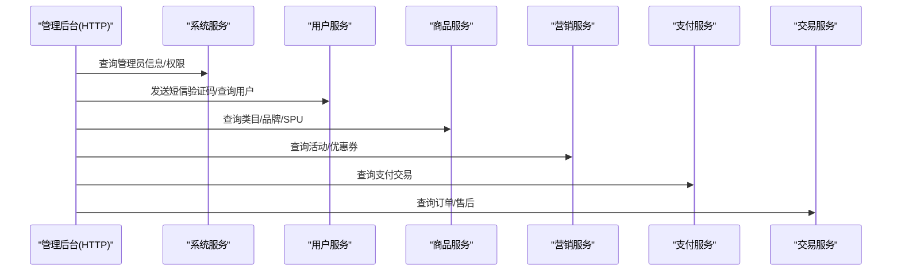

图表来源
- [application.yml（管理后台）:22-71](file://management-web-app/src/main/resources/application.yml#L22-L71)

章节来源
- [application.yml（管理后台）:1-83](file://management-web-app/src/main/resources/application.yml#L1-L83)
- [ManagementWebApplication.java:1-14](file://management-web-app/src/main/java/cn/iocoder/mall/managementweb/ManagementWebApplication.java#L1-L14)

### 商城前台 HTTP 服务（shop-web-app）
- 端口与上下文路径：18084 /shop-api/
- 订阅服务：用户、系统、商品、营销、交易、支付、搜索等 RPC。
- 监控：Actuator 独立端口 38088。

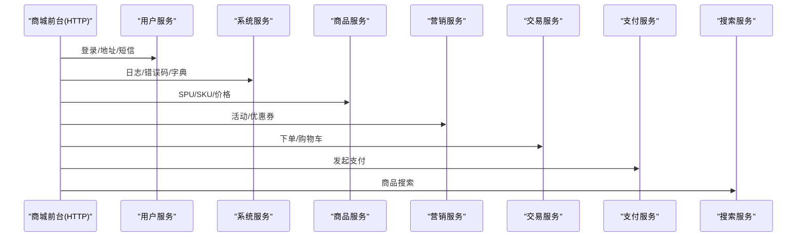

图表来源
- [application.yml（商城前台）:22-59](file://shop-web-app/src/main/resources/application.yml#L22-L59)

章节来源
- [application.yml（商城前台）:1-76](file://shop-web-app/src/main/resources/application.yml#L1-L76)
- [ShopWebApplication.java:1-14](file://shop-web-app/src/main/java/cn/iocoder/mall/shopweb/ShopWebApplication.java#L1-L14)

### 用户服务（user-service-project）
- RPC 提供者：UserRpc、UserSmsCodeRpc、UserAddressRpc。
- 订阅服务：OAuth2Rpc（消费者）。
- 监控：Actuator 独立端口 38081。

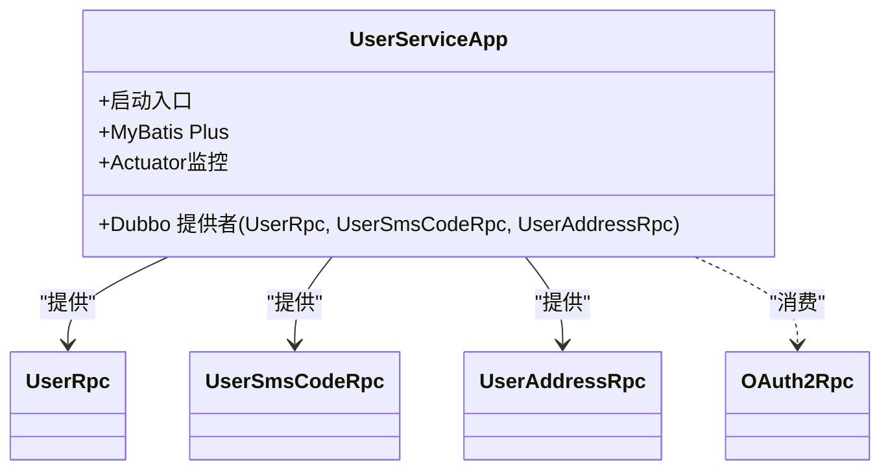

图表来源
- [UserServiceApplication.java:1-14](file://user-service-project/user-service-app/src/main/java/cn/iocoder/mall/userservice/UserServiceApplication.java#L1-L14)
- [application.yaml（用户服务）:21-47](file://user-service-project/user-service-app/src/main/resources/application.yaml#L21-L47)

章节来源
- [application.yaml（用户服务）:1-53](file://user-service-project/user-service-app/src/main/resources/application.yaml#L1-L53)
- [UserServiceApplication.java:1-14](file://user-service-project/user-service-app/src/main/java/cn/iocoder/mall/userservice/UserServiceApplication.java#L1-L14)

### 系统服务（system-service-project）
- RPC 提供者：AdminRpc、ResourceRpc、RoleRpc、PermissionRpc、DepartmentRpc、DataDictRpc、SystemAccessLogRpc、SystemExceptionLogRpc、ErrorCodeRpc。
- 监控：Actuator 独立端口 38080。

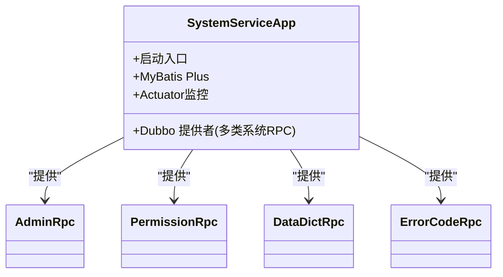

图表来源
- [SystemServiceApplication.java:1-14](file://system-service-project/system-service-app/src/main/java/cn/iocoder/mall/systemservice/SystemServiceApplication.java#L1-L14)
- [application.yaml（系统服务）:22-61](file://system-service-project/system-service-app/src/main/resources/application.yaml#L22-L61)

章节来源
- [application.yaml（系统服务）:1-79](file://system-service-project/system-service-app/src/main/resources/application.yaml#L1-L79)
- [SystemServiceApplication.java:1-14](file://system-service-project/system-service-app/src/main/java/cn/iocoder/mall/systemservice/SystemServiceApplication.java#L1-L14)

### 商品服务（product-service-project）
- RPC 提供者：ProductCategoryRpc、ProductBrandRpc、ProductSpuRpc、ProductSkuRpc、ProductAttrRpc。
- 消费者：ErrorCodeRpc。
- RocketMQ 生产者组：商品服务生产者组。
- 监控：Actuator 独立端口 38082。

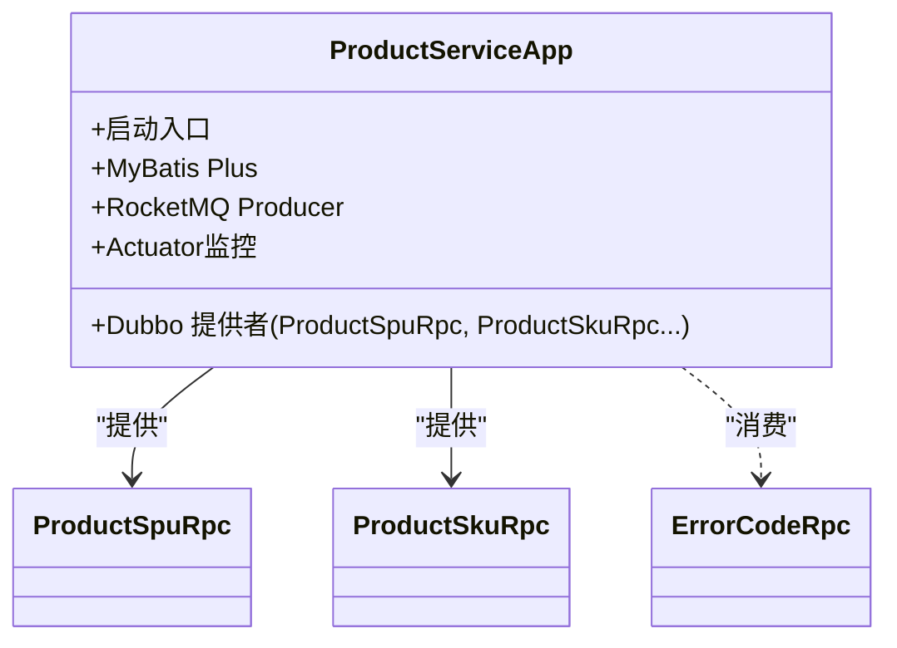

图表来源
- [ProductServiceApplication.java:1-14](file://product-service-project/product-service-app/src/main/java/cn/iocoder/mall/productservice/ProductServiceApplication.java#L1-L14)
- [application.yaml（商品服务）:21-46](file://product-service-project/product-service-app/src/main/resources/application.yaml#L21-L46)

章节来源
- [application.yaml（商品服务）:1-61](file://product-service-project/product-service-app/src/main/resources/application.yaml#L1-L61)
- [ProductServiceApplication.java:1-14](file://product-service-project/product-service-app/src/main/java/cn/iocoder/mall/productservice/ProductServiceApplication.java#L1-L14)

### 营销服务（promotion-service-project）
- RPC 提供者：PromotionActivityRpc、BannerRpc、CouponTemplateRpc、CouponCardRpc、PriceCalcRpc、RecommendRpc。
- 消费者：ProductSkuRpc、ProductSpuRpc、ErrorCodeRpc。
- RocketMQ 生产者组：营销服务生产者组。
- 监控：Actuator 独立端口 38085。

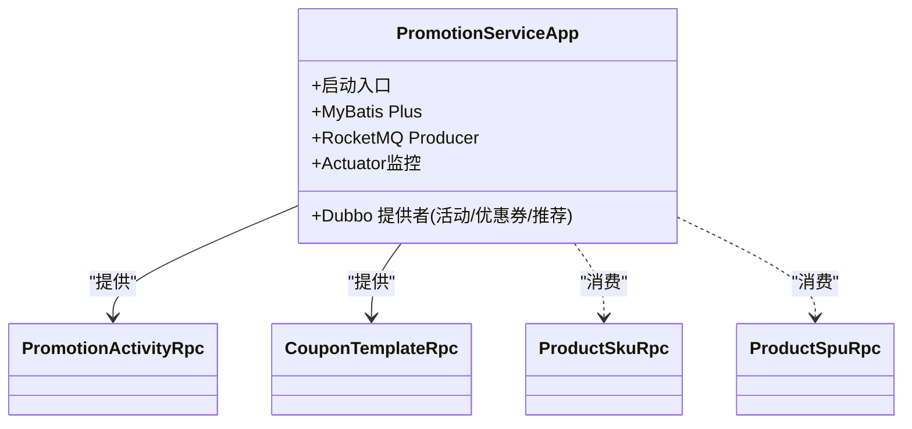

图表来源
- [PromotionServiceApplication.java:1-15](file://promotion-service-project/promotion-service-app/src/main/java/cn/iocoder/mall/promotionservice/PromotionServiceApplication.java#L1-L15)
- [application.yaml（营销服务）:21-46](file://promotion-service-project/promotion-service-app/src/main/resources/application.yaml#L21-L46)

章节来源
- [application.yaml（营销服务）:1-65](file://promotion-service-project/promotion-service-app/src/main/resources/application.yaml#L1-L65)
- [PromotionServiceApplication.java:1-15](file://promotion-service-project/promotion-service-app/src/main/java/cn/iocoder/mall/promotionservice/PromotionServiceApplication.java#L1-L15)

### 交易服务（trade-service-project）
- RPC 提供者：CartRpc、OrderRpc、AfterSaleRpc、LogisticsRpc。
- 消费者：ProductSkuRpc、UserAddressRpc、PriceRpc、CouponCardRpc、PayTransactionRpc、ErrorCodeRpc。
- RocketMQ 生产者组：交易服务生产者组。
- 监控：Actuator 独立端口 38084。

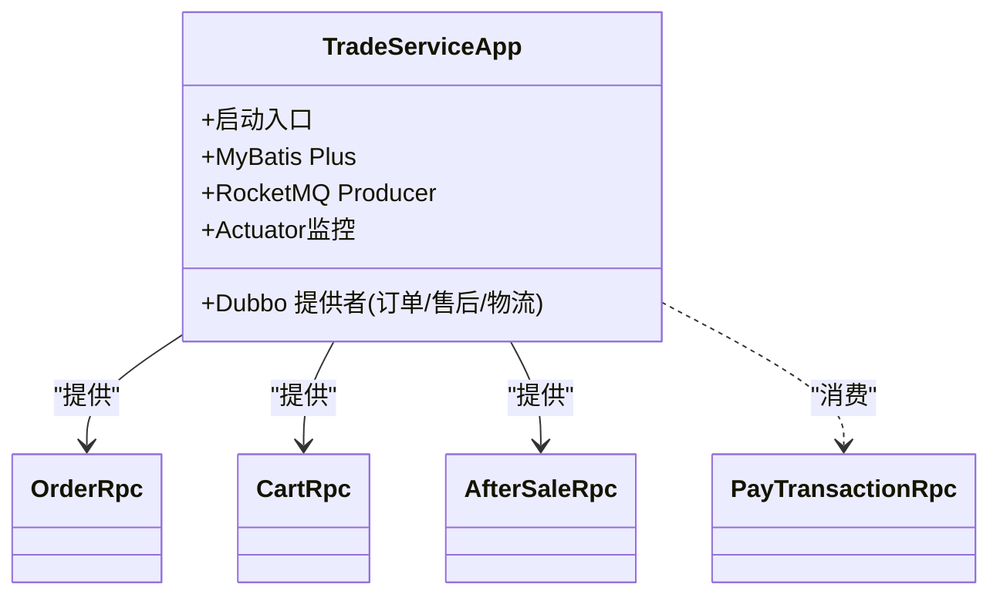

图表来源
- [TradeServiceApplication.java:1-14](file://trade-service-project/trade-service-app/src/main/java/cn/iocoder/mall/tradeservice/TradeServiceApplication.java#L1-L14)
- [application.yaml（交易服务）:21-52](file://trade-service-project/trade-service-app/src/main/resources/application.yaml#L21-L52)

章节来源
- [application.yaml（交易服务）:1-76](file://trade-service-project/trade-service-app/src/main/resources/application.yaml#L1-L76)
- [TradeServiceApplication.java:1-14](file://trade-service-project/trade-service-app/src/main/java/cn/iocoder/mall/tradeservice/TradeServiceApplication.java#L1-L14)

### 支付服务（pay-service-project）
- RPC 提供者：PayTransactionRpc、PayRefundRpc。
- 消费者：ErrorCodeRpc、ProductSkuRpc、ProductSpuRpc。
- RocketMQ 生产者组：支付服务生产者组。
- 监控：Actuator 独立端口 38089。

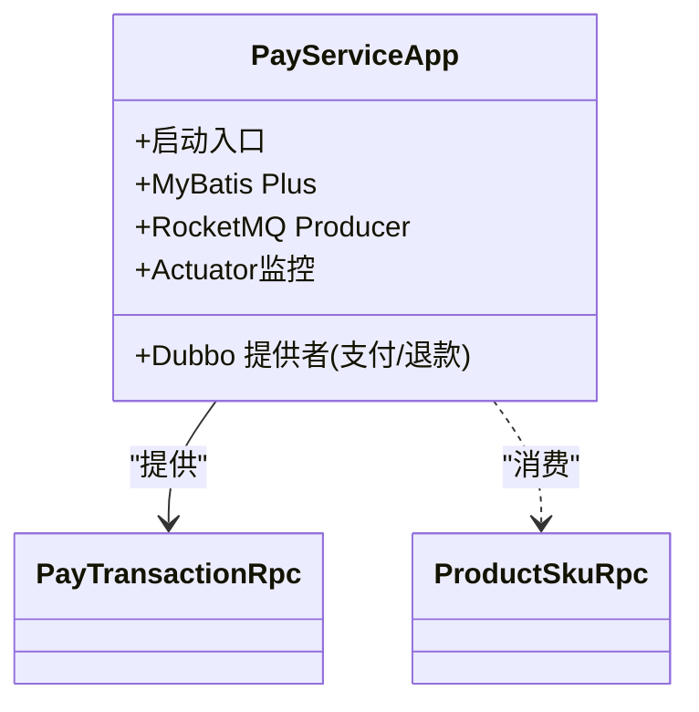

图表来源
- [PayServiceApplication.java:1-14](file://pay-service-project/pay-service-app/src/main/java/cn/iocoder/mall/payservice/PayServiceApplication.java#L1-L14)
- [application.yaml（支付服务）:21-42](file://pay-service-project/pay-service-app/src/main/resources/application.yaml#L21-L42)

章节来源
- [application.yaml（支付服务）:1-65](file://pay-service-project/pay-service-app/src/main/resources/application.yaml#L1-L65)
- [PayServiceApplication.java:1-14](file://pay-service-project/pay-service-app/src/main/java/cn/iocoder/mall/payservice/PayServiceApplication.java#L1-L14)

### 搜索服务（search-service-project）
- RPC 提供者：SearchProductRpc。
- 消费者：ProductCategoryRpc、ProductSpuRpc、ProductSkuRpc、ErrorCodeRpc。
- Elasticsearch 集群连接：REST URI 与集群节点。
- 监控：Actuator 独立端口 38083。

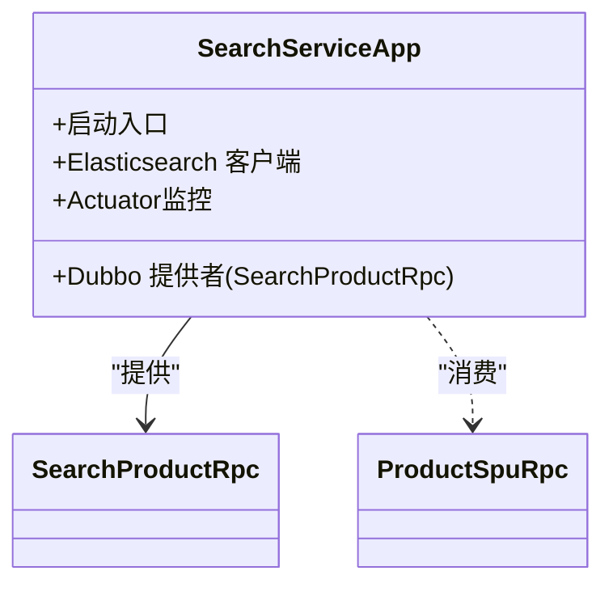

图表来源
- [SearchServiceApplication.java:1-16](file://search-service-project/search-service-app/src/main/java/cn/iocoder/mall/searchservice/SearchServiceApplication.java#L1-L16)
- [application.yaml（搜索服务）:19-46](file://search-service-project/search-service-app/src/main/resources/application.yaml#L19-L46)

章节来源
- [application.yaml（搜索服务）:1-63](file://search-service-project/search-service-app/src/main/resources/application.yaml#L1-L63)
- [SearchServiceApplication.java:1-16](file://search-service-project/search-service-app/src/main/java/cn/iocoder/mall/searchservice/SearchServiceApplication.java#L1-L16)

## 依赖分析
- 注册与发现
  - 所有 RPC 服务均通过 Dubbo 的注册中心进行服务注册与发现，消费者通过 subscribed-services 指定订阅范围。
- 消息中间件
  - 商品、营销、交易、支付服务分别配置 RocketMQ NameServer 与各自生产者组，实现异步解耦。
- 搜索
  - 搜索服务通过 Elasticsearch REST 接口与集群交互。
- 数据存储
  - 各服务使用 MyBatis Plus 访问 MySQL，配置了逻辑删除与驼峰映射等通用策略。
- 监控
  - 各服务独立暴露 Actuator 端口，便于集中监控与治理。

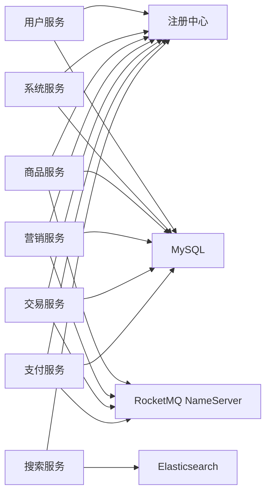

图表来源
- [application.yaml（用户服务）:25-26](file://user-service-project/user-service-app/src/main/resources/application.yaml#L25-L26)
- [application.yaml（系统服务）:25-26](file://system-service-project/system-service-app/src/main/resources/application.yaml#L25-L26)
- [application.yaml（商品服务）:44-47](file://product-service-project/product-service-app/src/main/resources/application.yaml#L44-L47)
- [application.yaml（营销服务）:48-51](file://promotion-service-project/promotion-service-app/src/main/resources/application.yaml#L48-L51)
- [application.yaml（交易服务）:54-57](file://trade-service-project/trade-service-app/src/main/resources/application.yaml#L54-L57)
- [application.yaml（支付服务）:48-51](file://pay-service-project/pay-service-app/src/main/resources/application.yaml#L48-L51)
- [application.yaml（搜索服务）:48-49](file://search-service-project/search-service-app/src/main/resources/application.yaml#L48-L49)

章节来源
- [application.yaml（用户服务）:1-53](file://user-service-project/user-service-app/src/main/resources/application.yaml#L1-L53)
- [application.yaml（系统服务）:1-79](file://system-service-project/system-service-app/src/main/resources/application.yaml#L1-L79)
- [application.yaml（商品服务）:1-61](file://product-service-project/product-service-app/src/main/resources/application.yaml#L1-L61)
- [application.yaml（营销服务）:1-65](file://promotion-service-project/promotion-service-app/src/main/resources/application.yaml#L1-L65)
- [application.yaml（交易服务）:1-76](file://trade-service-project/trade-service-app/src/main/resources/application.yaml#L1-L76)
- [application.yaml（支付服务）:1-65](file://pay-service-project/pay-service-app/src/main/resources/application.yaml#L1-L65)
- [application.yaml（搜索服务）:1-63](file://search-service-project/search-service-app/src/main/resources/application.yaml#L1-L63)

## 性能考量
- RPC 调用
  - 消费者统一设置超时与参数校验，避免慢调用拖垮网关或上游服务。
- 消息异步化
  - 商品、营销、交易、支付通过 RocketMQ 异步处理，降低同步链路延迟与耦合度。
- 搜索分离
  - 搜索服务独立部署，结合 Elasticsearch，提升检索性能与可用性。
- 缓存与限流
  - 项目中包含缓存与安全相关 Starter，可配合限流与熔断策略进一步优化。
- 监控与可观测性
  - Actuator 独立端口暴露，结合 Prometheus/Grafana/SkyWalking 实现指标采集与链路追踪。

## 故障排查指南
- 启动失败
  - 检查 Dubbo 注册中心连通性与 subscribed-services 配置是否正确。
  - 确认 RocketMQ NameServer 地址与生产者组配置。
  - 校验 Elasticsearch REST URI 与集群节点配置。
- RPC 调用异常
  - 查看 Actuator 端点暴露情况与服务健康状态。
  - 关注消费者超时与参数校验配置，必要时调整超时时间。
- 消息积压
  - 检查 RocketMQ 控制台与消费者消费速率，评估扩容与分区策略。
- 搜索不可用
  - 校验 Elasticsearch 集群状态与索引映射，确认 REST 连接正常。

章节来源
- [application.yml（管理后台）:79-83](file://management-web-app/src/main/resources/application.yml#L79-L83)
- [application.yml（商城前台）:72-76](file://shop-web-app/src/main/resources/application.yml#L72-L76)
- [application.yaml（用户服务）:48-53](file://user-service-project/user-service-app/src/main/resources/application.yaml#L48-L53)
- [application.yaml（系统服务）:62-67](file://system-service-project/system-service-app/src/main/resources/application.yaml#L62-L67)
- [application.yaml（商品服务）:49-54](file://product-service-project/product-service-app/src/main/resources/application.yaml#L49-L54)
- [application.yaml（营销服务）:53-58](file://promotion-service-project/promotion-service-app/src/main/resources/application.yaml#L53-L58)
- [application.yaml（交易服务）:59-64](file://trade-service-project/trade-service-app/src/main/resources/application.yaml#L59-L64)
- [application.yaml（支付服务）:53-58](file://pay-service-project/pay-service-app/src/main/resources/application.yaml#L53-L58)
- [application.yaml（搜索服务）:51-56](file://search-service-project/search-service-app/src/main/resources/application.yaml#L51-L56)

## 结论
Onemall 采用清晰的微服务分层与 RPC 通信模型，HTTP 层仅负责编排与转发，业务能力下沉至 RPC 服务，辅以消息中间件与搜索引擎实现高内聚低耦合。通过合理的启动顺序与依赖配置，可在本地与生产环境中稳定运行。建议在生产中结合限流、熔断、缓存与分布式事务组件，持续优化性能与可靠性。

## 附录
- 启动顺序建议（按依赖关系）
  1) 注册中心（Zookeeper）
  2) 消息中间件（RocketMQ NameServer）
  3) 搜索引擎（Elasticsearch）
  4) 数据库（MySQL）
  5) 系统服务（提供权限/字典/日志/错误码）
  6) 用户服务（提供用户/地址/短信）
  7) 商品服务（提供商品/库存）
  8) 营销服务（提供活动/优惠券）
  9) 交易服务（提供订单/售后/物流）
  10) 支付服务（提供支付/退款）
  11) 搜索服务（提供搜索）
  12) 管理后台 HTTP 服务
  13) 商城前台 HTTP 服务
- 横向扩展策略
  - 服务实例水平扩展：通过注册中心自动发现与负载均衡。
  - 消息分区：RocketMQ Topic 多队列，按业务拆分生产者/消费者组。
  - 搜索分片：Elasticsearch 索引分片与副本策略。
  - 缓存层：结合 Redis/Redisson 提升热点数据访问性能。
- 监控与治理
  - Actuator 独立端口暴露，结合 Prometheus/Grafana/SkyWalking 实现统一监控与链路追踪。