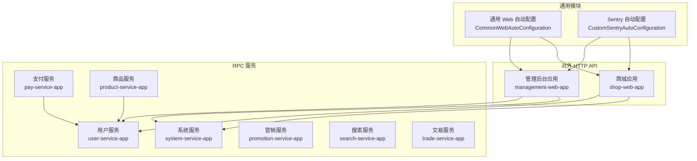
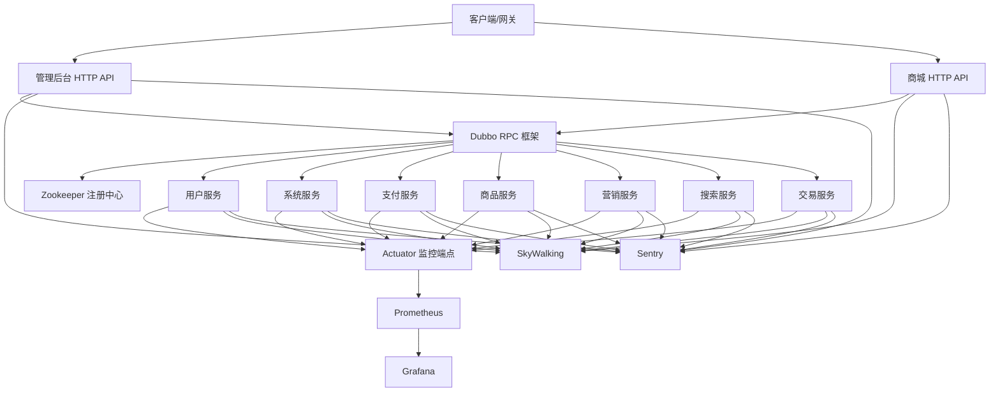
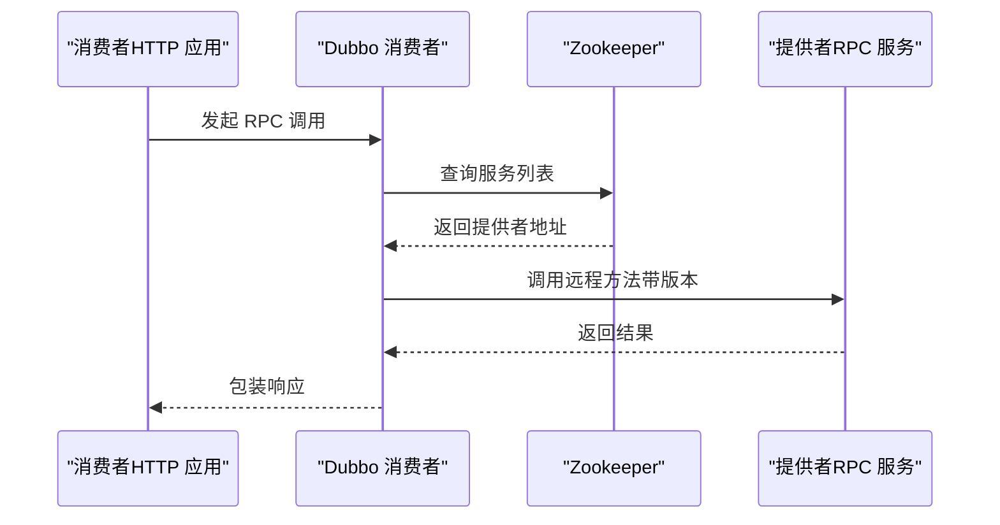
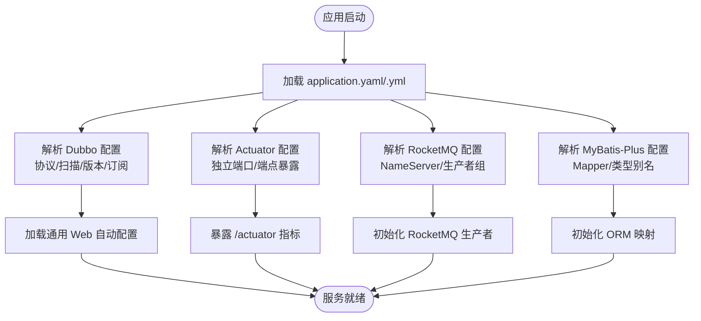
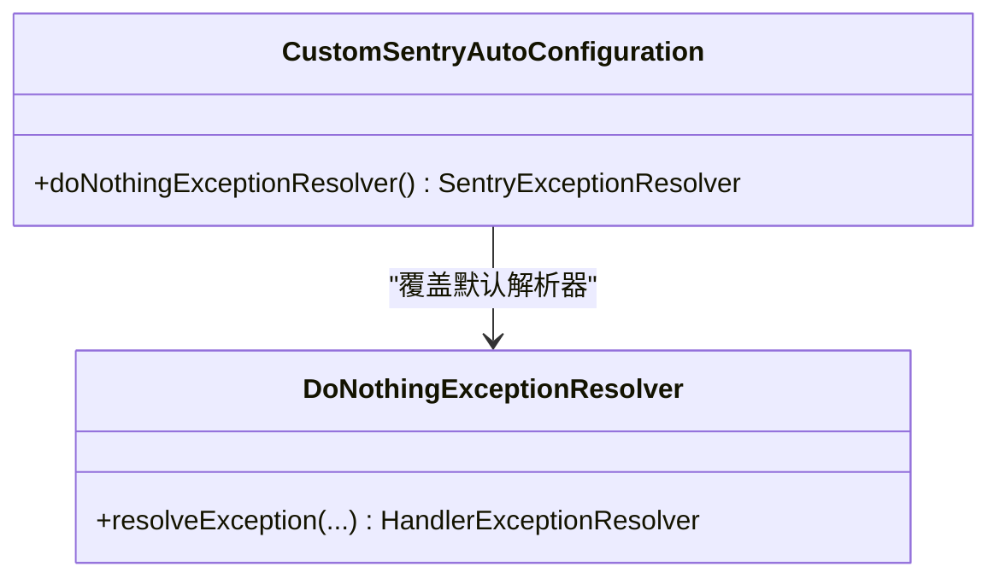
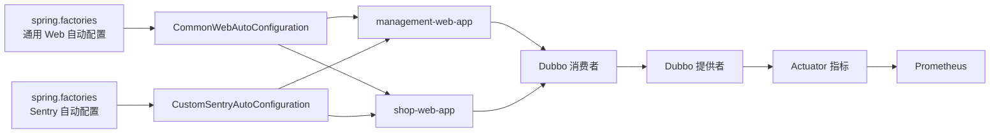

# 服务治理

<cite>
**本文引用的文件**
- [根 POM 文件](file://pom.xml)
- [项目总览与技术栈说明](file://README.md)
- [管理后台应用配置（application.yml）](file://management-web-app/src/main/resources/application.yml)
- [商城应用配置（application.yml）](file://shop-web-app/src/main/resources/application.yml)
- [支付服务应用配置（application.yaml）](file://pay-service-project/pay-service-app/src/main/resources/application.yaml)
- [商品服务应用配置（application.yaml）](file://product-service-project/product-service-app/src/main/resources/application.yaml)
- [用户服务应用配置（application.yaml）](file://user-service-project/user-service-app/src/main/resources/application.yaml)
- [通用 Web 自动配置（CommonWebAutoConfiguration.java）](file://common/mall-spring-boot-starter-web/src/main/java/cn/iocoder/mall/web/config/CommonWebAutoConfiguration.java)
- [Sentry 自动配置（CustomSentryAutoConfiguration.java）](file://common/mall-spring-boot-starter-sentry/src/main/java/cn/iocoder/mall/sentry/config/CustomSentryAutoConfiguration.java)
- [Sentry 自动配置注册（spring.factories）](file://common/mall-spring-boot-starter-sentry/src/main/resources/META-INF/spring.factories)
- [通用 Web 自动配置注册（spring.factories）](file://common/mall-spring-boot-starter-web/src/main/resources/META-INF/spring.factories)
</cite>

## 目录
1. [引言](#引言)
2. [项目结构](#项目结构)
3. [核心组件](#核心组件)
4. [架构总览](#架构总览)
5. [详细组件分析](#详细组件分析)
6. [依赖关系分析](#依赖关系分析)
7. [性能考量](#性能考量)
8. [故障排查指南](#故障排查指南)
9. [结论](#结论)
10. [附录](#附录)

## 引言
本文件面向 Onemall 微服务治理的运维与开发人员，系统化梳理服务注册与发现、配置管理、服务监控、链路追踪、熔断降级等治理能力。根据仓库现有实现，Onemall 以 Spring Boot 2.2.4 为基础，采用 Dubbo 2.7.1 作为 RPC 框架，并通过 Spring Cloud Alibaba Dubbo 的云特性实现服务注册与发现；同时结合 Actuator 暴露监控端点、Prometheus/Grafana 进行指标采集与可视化、SkyWalking 实现分布式链路追踪、Sentry 进行异常上报与去重处理。本文将结合源码配置与自动装配，给出可操作的治理实践与部署建议。

## 项目结构
- 顶层模块采用 Maven 多模块聚合，包含通用模块与各业务服务模块。
- 业务侧分为两类：
  - 对外 HTTP API 模块：management-web-app、shop-web-app
  - 内部 RPC 服务模块：user-service-project、system-service-project、pay-service-project、product-service-project、promotion-service-project、search-service-project、trade-service-project
- 通用治理能力由 common 子模块提供，如通用 Web 自动配置、Sentry 异常上报等。

图表来源
- [根 POM 文件](file://pom.xml)
- [管理后台应用配置（application.yml）](file://management-web-app/src/main/resources/application.yml)
- [商城应用配置（application.yml）](file://shop-web-app/src/main/resources/application.yml)
- [支付服务应用配置（application.yaml）](file://pay-service-project/pay-service-app/src/main/resources/application.yaml)
- [商品服务应用配置（application.yaml）](file://product-service-project/product-service-app/src/main/resources/application.yaml)
- [用户服务应用配置（application.yaml）](file://user-service-project/user-service-app/src/main/resources/application.yaml)
- [通用 Web 自动配置（CommonWebAutoConfiguration.java）](file://common/mall-spring-boot-starter-web/src/main/java/cn/iocoder/mall/web/config/CommonWebAutoConfiguration.java)
- [Sentry 自动配置（CustomSentryAutoConfiguration.java）](file://common/mall-spring-boot-starter-sentry/src/main/java/cn/iocoder/mall/sentry/config/CustomSentryAutoConfiguration.java)

章节来源
- [根 POM 文件](file://pom.xml)
- [项目总览与技术栈说明](file://README.md)

## 核心组件
- 服务注册与发现（Dubbo + Zookeeper）
  - 通过 Dubbo 的 cloud 配置实现服务订阅与发现，消费者侧显式声明订阅的服务列表，提供者侧通过扫描基础包暴露服务。
- 配置管理
  - 各服务通过 application.yml/.yaml 管理 Dubbo 协议、消费者/提供者版本、Actuator 监控端口、RocketMQ 生产者组等。
- 服务监控
  - Actuator 暴露 /actuator 端点，结合 Prometheus 抓取指标，Grafana 可视化。
- 链路追踪
  - README 明确采用 SkyWalking，结合各服务 Actuator 指标进行问题定位。
- 熔断降级
  - README 提及 Sentinel（服务保障），但当前仓库未见具体实现；建议后续引入并按需配置。
- 异常治理
  - 通过 Sentry 自动配置与 DoNothing 异常解析器，避免日志 appender 与全局异常捕获重复上报。

章节来源
- [管理后台应用配置（application.yml）](file://management-web-app/src/main/resources/application.yml)
- [商城应用配置（application.yml）](file://shop-web-app/src/main/resources/application.yml)
- [支付服务应用配置（application.yaml）](file://pay-service-project/pay-service-app/src/main/resources/application.yaml)
- [商品服务应用配置（application.yaml）](file://product-service-project/product-service-app/src/main/resources/application.yaml)
- [用户服务应用配置（application.yaml）](file://user-service-project/user-service-app/src/main/resources/application.yaml)
- [通用 Web 自动配置（CommonWebAutoConfiguration.java）](file://common/mall-spring-boot-starter-web/src/main/java/cn/iocoder/mall/web/config/CommonWebAutoConfiguration.java)
- [Sentry 自动配置（CustomSentryAutoConfiguration.java）](file://common/mall-spring-boot-starter-sentry/src/main/java/cn/iocoder/mall/sentry/config/CustomSentryAutoConfiguration.java)
- [项目总览与技术栈说明](file://README.md)

## 架构总览
下图展示了 Onemall 的服务治理架构：HTTP API 层通过 Dubbo 调用内部 RPC 服务；各服务通过 Actuator 暴露监控端点，Prometheus 抓取指标，Grafana 可视化；SkyWalking 提供链路追踪；Sentry 负责异常上报与去重。

图表来源
- [管理后台应用配置（application.yml）](file://management-web-app/src/main/resources/application.yml)
- [商城应用配置（application.yml）](file://shop-web-app/src/main/resources/application.yml)
- [支付服务应用配置（application.yaml）](file://pay-service-project/pay-service-app/src/main/resources/application.yaml)
- [商品服务应用配置（application.yaml）](file://product-service-project/product-service-app/src/main/resources/application.yaml)
- [用户服务应用配置（application.yaml）](file://user-service-project/user-service-app/src/main/resources/application.yaml)
- [项目总览与技术栈说明](file://README.md)

## 详细组件分析

### 服务注册与发现（Dubbo + Zookeeper）
- 消费者侧
  - 在 application.yml 中通过 dubbo.cloud.subscribed-services 指定订阅的服务列表，consumer 下为各 RPC 接口声明 version，确保跨版本兼容。
- 提供者侧
  - 在 application.yaml 中通过 dubbo.protocol.name/dubbo.protocol.port、dubbo.scan.base-packages 暴露服务；provider 下启用参数校验与异常过滤。
- 注册中心
  - README 明确使用 Zookeeper 作为注册中心，Dubbo 通过 cloud 配置与注册中心交互。

图表来源
- [管理后台应用配置（application.yml）](file://management-web-app/src/main/resources/application.yml)
- [商城应用配置（application.yml）](file://shop-web-app/src/main/resources/application.yml)
- [支付服务应用配置（application.yaml）](file://pay-service-project/pay-service-app/src/main/resources/application.yaml)
- [商品服务应用配置（application.yaml）](file://product-service-project/product-service-app/src/main/resources/application.yaml)
- [用户服务应用配置（application.yaml）](file://user-service-project/user-service-app/src/main/resources/application.yaml)

章节来源
- [管理后台应用配置（application.yml）](file://management-web-app/src/main/resources/application.yml)
- [商城应用配置（application.yml）](file://shop-web-app/src/main/resources/application.yml)
- [支付服务应用配置（application.yaml）](file://pay-service-project/pay-service-app/src/main/resources/application.yaml)
- [商品服务应用配置（application.yaml）](file://product-service-project/product-service-app/src/main/resources/application.yaml)
- [用户服务应用配置（application.yaml）](file://user-service-project/user-service-app/src/main/resources/application.yaml)
- [项目总览与技术栈说明](file://README.md)

### 配置管理
- 各服务通过 application.yaml/.yml 管理：
  - Dubbo 提供者协议与扫描包、消费者版本
  - Actuator 独立端口与端点暴露
  - RocketMQ NameServer 与生产者组
  - MyBatis-Plus Mapper 位置与类型别名包
- 通用 Web 自动配置注入全局响应包装、全局异常处理、跨域过滤器与 Fastjson 转换器。

图表来源
- [支付服务应用配置（application.yaml）](file://pay-service-project/pay-service-app/src/main/resources/application.yaml)
- [商品服务应用配置（application.yaml）](file://product-service-project/product-service-app/src/main/resources/application.yaml)
- [用户服务应用配置（application.yaml）](file://user-service-project/user-service-app/src/main/resources/application.yaml)
- [通用 Web 自动配置（CommonWebAutoConfiguration.java）](file://common/mall-spring-boot-starter-web/src/main/java/cn/iocoder/mall/web/config/CommonWebAutoConfiguration.java)

章节来源
- [支付服务应用配置（application.yaml）](file://pay-service-project/pay-service-app/src/main/resources/application.yaml)
- [商品服务应用配置（application.yaml）](file://product-service-project/product-service-app/src/main/resources/application.yaml)
- [用户服务应用配置（application.yaml）](file://user-service-project/user-service-app/src/main/resources/application.yaml)
- [通用 Web 自动配置（CommonWebAutoConfiguration.java）](file://common/mall-spring-boot-starter-web/src/main/java/cn/iocoder/mall/web/config/CommonWebAutoConfiguration.java)

### 服务监控体系（Actuator + Prometheus + Grafana）
- Actuator 独立端口暴露，统一暴露所有监控端点，便于 Prometheus 抓取。
- Prometheus 采集各服务 /actuator 指标，Grafana 可视化展示。
- 建议在生产环境限制 Actuator 端点暴露范围与访问权限。

章节来源
- [管理后台应用配置（application.yml）](file://management-web-app/src/main/resources/application.yml)
- [商城应用配置（application.yml）](file://shop-web-app/src/main/resources/application.yml)
- [支付服务应用配置（application.yaml）](file://pay-service-project/pay-service-app/src/main/resources/application.yaml)
- [商品服务应用配置（application.yaml）](file://product-service-project/product-service-app/src/main/resources/application.yaml)
- [用户服务应用配置（application.yaml）](file://user-service-project/user-service-app/src/main/resources/application.yaml)
- [项目总览与技术栈说明](file://README.md)

### 链路追踪（SkyWalking）
- README 明确采用 SkyWalking 进行分布式追踪，结合 Actuator 指标进行问题定位与性能分析。
- 建议在各服务中启用 SkyWalking Agent 并配置探针，确保跨服务调用链完整。

章节来源
- [项目总览与技术栈说明](file://README.md)

### 熔断降级（Sentinel）
- README 提及 Sentinel 作为服务保障组件，当前仓库未见具体实现。
- 建议后续引入 Sentinel 控制台与客户端，结合限流、熔断、降级策略提升系统韧性。

章节来源
- [项目总览与技术栈说明](file://README.md)

### 异常治理（Sentry）
- 通过自定义 Sentry 自动配置与 DoNothing 异常解析器，避免日志 appender 与全局异常捕获重复上报。
- Sentry 仅在 sentry.enabled=true 时生效，且仅在 Web 应用中启用。

图表来源
- [Sentry 自动配置（CustomSentryAutoConfiguration.java）](file://common/mall-spring-boot-starter-sentry/src/main/java/cn/iocoder/mall/sentry/config/CustomSentryAutoConfiguration.java)

章节来源
- [Sentry 自动配置（CustomSentryAutoConfiguration.java）](file://common/mall-spring-boot-starter-sentry/src/main/java/cn/iocoder/mall/sentry/config/CustomSentryAutoConfiguration.java)
- [Sentry 自动配置注册（spring.factories）](file://common/mall-spring-boot-starter-sentry/src/main/resources/META-INF/spring.factories)

## 依赖关系分析
- 通用 Web 自动配置与 Sentry 自动配置通过 spring.factories 注册，被各应用自动装配。
- HTTP 应用通过 Dubbo 消费 RPC 服务，RPC 服务通过 Dubbo 提供服务。
- Actuator 指标为 Prometheus 抓取提供统一入口。

图表来源
- [通用 Web 自动配置注册（spring.factories）](file://common/mall-spring-boot-starter-web/src/main/resources/META-INF/spring.factories)
- [Sentry 自动配置注册（spring.factories）](file://common/mall-spring-boot-starter-sentry/src/main/resources/META-INF/spring.factories)
- [管理后台应用配置（application.yml）](file://management-web-app/src/main/resources/application.yml)
- [商城应用配置（application.yml）](file://shop-web-app/src/main/resources/application.yml)
- [支付服务应用配置（application.yaml）](file://pay-service-project/pay-service-app/src/main/resources/application.yaml)
- [商品服务应用配置（application.yaml）](file://product-service-project/product-service-app/src/main/resources/application.yaml)
- [用户服务应用配置（application.yaml）](file://user-service-project/user-service-app/src/main/resources/application.yaml)

章节来源
- [通用 Web 自动配置注册（spring.factories）](file://common/mall-spring-boot-starter-web/src/main/resources/META-INF/spring.factories)
- [Sentry 自动配置注册（spring.factories）](file://common/mall-spring-boot-starter-sentry/src/main/resources/META-INF/spring.factories)
- [管理后台应用配置（application.yml）](file://management-web-app/src/main/resources/application.yml)
- [商城应用配置（application.yml）](file://shop-web-app/src/main/resources/application.yml)
- [支付服务应用配置（application.yaml）](file://pay-service-project/pay-service-app/src/main/resources/application.yaml)
- [商品服务应用配置（application.yaml）](file://product-service-project/product-service-app/src/main/resources/application.yaml)
- [用户服务应用配置（application.yaml）](file://user-service-project/user-service-app/src/main/resources/application.yaml)

## 性能考量
- 指标采集
  - 使用 Actuator 暴露 JVM、业务指标，结合 Prometheus 抓取，建议设置合理的抓取间隔与告警阈值。
- 网络与序列化
  - 采用 Fastjson 作为消息转换器，注意循环引用与键类型转换的性能影响。
- 日志与异常
  - Sentry 去重与 DoNothing 解析器减少重复上报，降低日志风暴风险。

## 故障排查指南
- Dubbo 服务不可用
  - 检查消费者 application.yml 中的 subscribed-services 与提供者 application.yaml 中的 dubbo.scan.base-packages 是否匹配。
  - 确认 Zookeeper 注册中心连通性与服务实例是否正确注册。
- Actuator 指标缺失
  - 确认 management.server.port 与 endpoints.web.exposure.include 配置是否正确。
- 异常重复上报
  - 检查 sentry.enabled 与 Sentry 自动配置是否生效，确认 DoNothing 解析器是否被加载。
- RocketMQ 生产者异常
  - 校验 rocketmq.name-server 与生产者组 group 配置，确认网络可达性。

章节来源
- [管理后台应用配置（application.yml）](file://management-web-app/src/main/resources/application.yml)
- [商城应用配置（application.yml）](file://shop-web-app/src/main/resources/application.yml)
- [支付服务应用配置（application.yaml）](file://pay-service-project/pay-service-app/src/main/resources/application.yaml)
- [商品服务应用配置（application.yaml）](file://product-service-project/product-service-app/src/main/resources/application.yaml)
- [用户服务应用配置（application.yaml）](file://user-service-project/user-service-app/src/main/resources/application.yaml)
- [通用 Web 自动配置（CommonWebAutoConfiguration.java）](file://common/mall-spring-boot-starter-web/src/main/java/cn/iocoder/mall/web/config/CommonWebAutoConfiguration.java)
- [Sentry 自动配置（CustomSentryAutoConfiguration.java）](file://common/mall-spring-boot-starter-sentry/src/main/java/cn/iocoder/mall/sentry/config/CustomSentryAutoConfiguration.java)

## 结论
Onemall 当前已具备完善的微服务治理基础：Dubbo + Zookeeper 实现服务注册与发现，Actuator + Prometheus + Grafana 提供监控，SkyWalking 支撑链路追踪，Sentry 实现异常治理。建议后续引入 Sentinel 以完善熔断降级能力，并持续优化指标体系与告警策略，提升系统的可观测性与韧性。

## 附录
- 部署建议
  - 注册中心：Zookeeper（已在 README 明确）
  - 配置中心：README 提及 Apollo，可按需引入
  - 网关：README 提及 Soul，可按需引入
  - 监控：Prometheus + Grafana（已在 README 明确）
  - 链路追踪：SkyWalking（已在 README 明确）
  - 熔断降级：Sentinel（已在 README 提及，待实现）

章节来源
- [项目总览与技术栈说明](file://README.md)