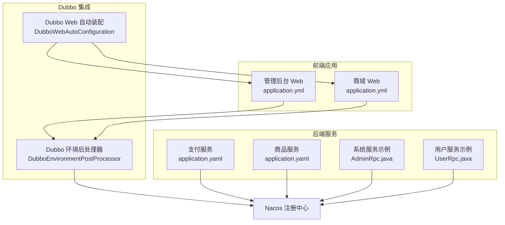
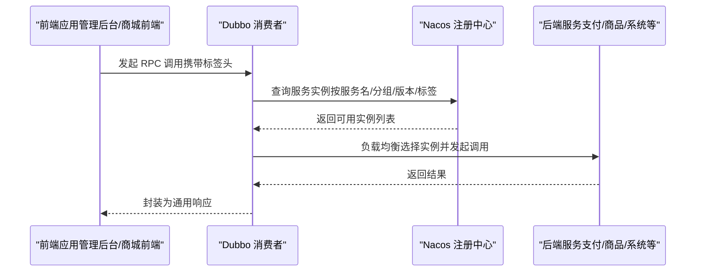
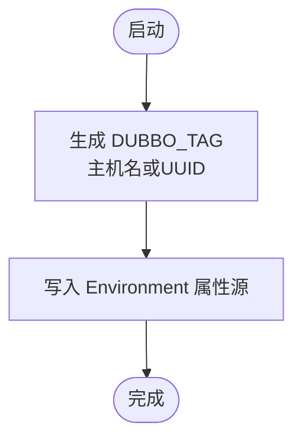
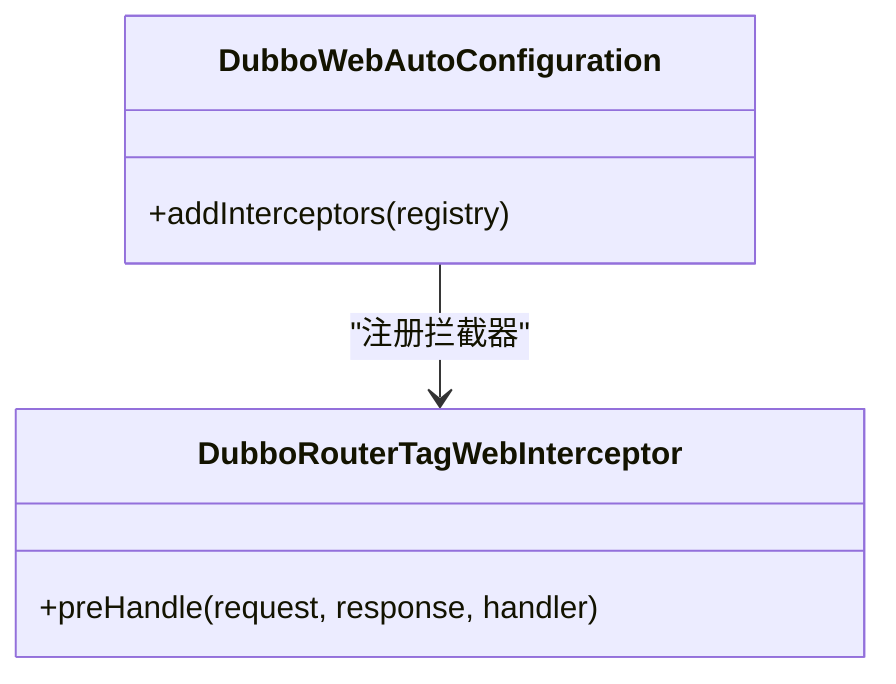
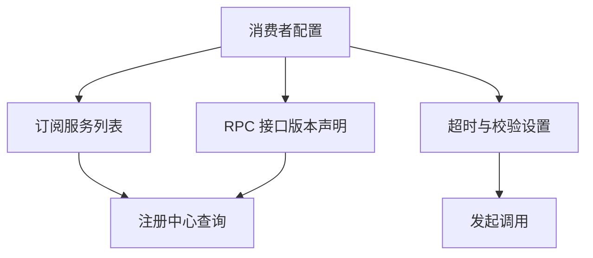
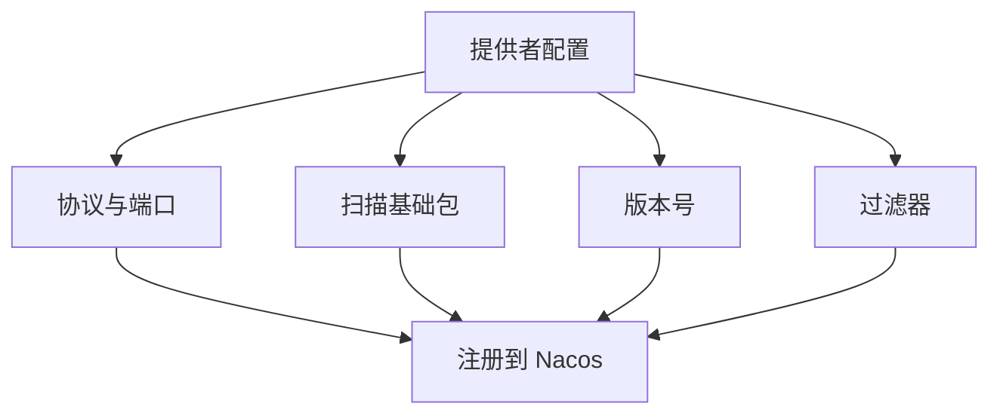
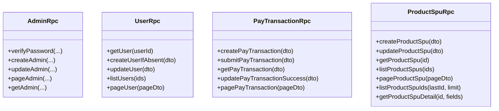
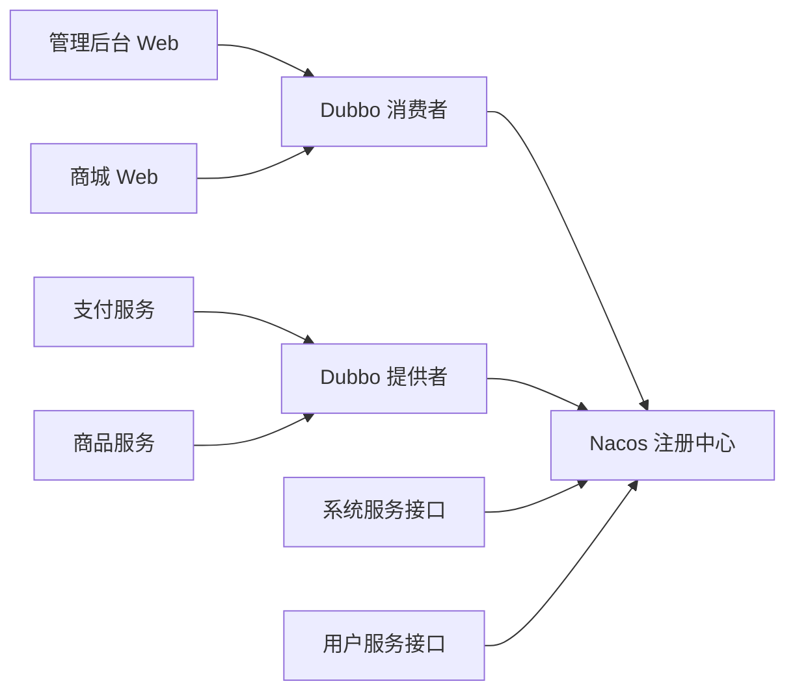

# 服务注册与发现

<cite>
**本文引用的文件**
- [DubboEnvironmentPostProcessor.java](file://common/mall-spring-boot-starter-dubbo/src/main/java/cn/iocoder/mall/dubbo/config/DubboEnvironmentPostProcessor.java)
- [DubboWebAutoConfiguration.java](file://common/mall-spring-boot-starter-dubbo/src/main/java/cn/iocoder/mall/dubbo/config/DubboWebAutoConfiguration.java)
- [application.yml（管理后台）](file://management-web-app/src/main/resources/application.yml)
- [application.yml（商城前端）](file://shop-web-app/src/main/resources/application.yml)
- [application.yaml（支付服务）](file://pay-service-project/pay-service-app/src/main/resources/application.yaml)
- [application.yaml（商品服务）](file://product-service-project/product-service-app/src/main/resources/application.yaml)
- [AdminRpc.java](file://system-service-project/system-service-api/src/main/java/cn/iocoder/mall/systemservice/rpc/admin/AdminRpc.java)
- [UserRpc.java](file://user-service-project/user-service-api/src/main/java/cn/iocoder/mall/userservice/rpc/user/UserRpc.java)
- [PayTransactionRpc.java](file://pay-service-project/pay-service-api/src/main/java/cn/iocoder/mall/payservice/rpc/transaction/PayTransactionRpc.java)
- [ProductSpuRpc.java](file://product-service-project/product-service-api/src/main/java/cn/iocoder/mall/productservice/rpc/spu/ProductSpuRpc.java)
</cite>

## 目录
1. [简介](#简介)
2. [项目结构](#项目结构)
3. [核心组件](#核心组件)
4. [架构总览](#架构总览)
5. [详细组件分析](#详细组件分析)
6. [依赖分析](#依赖分析)
7. [性能考虑](#性能考虑)
8. [故障排查指南](#故障排查指南)
9. [结论](#结论)
10. [附录](#附录)

## 简介
本文件围绕 Onemall 的服务注册与发现机制展开，重点说明以下内容：
- Nacos 作为服务注册中心的配置与使用，覆盖服务注册、服务发现与动态配置能力
- Dubbo 与 Nacos 的集成配置，包括服务暴露、服务引用、超时与参数校验等
- 服务元数据管理，包括服务版本、分组、标签等
- 通过架构图与配置示例帮助开发者理解服务间通信机制与部署策略

## 项目结构
Onemall 采用多模块微服务架构，前端 Web 应用通过 Dubbo 消费后端服务，后端服务通过 Dubbo 暴露 RPC 接口，并统一接入 Nacos 进行服务注册与发现。

图表来源
- [DubboEnvironmentPostProcessor.java:1-67](file://common/mall-spring-boot-starter-dubbo/src/main/java/cn/iocoder/mall/dubbo/config/DubboEnvironmentPostProcessor.java#L1-L67)
- [DubboWebAutoConfiguration.java:1-32](file://common/mall-spring-boot-starter-dubbo/src/main/java/cn/iocoder/mall/dubbo/config/DubboWebAutoConfiguration.java#L1-L32)
- [application.yml（管理后台）:19-71](file://management-web-app/src/main/resources/application.yml#L19-L71)
- [application.yml（商城前端）:19-64](file://shop-web-app/src/main/resources/application.yml#L19-L64)
- [application.yaml（支付服务）:21-46](file://pay-service-project/pay-service-app/src/main/resources/application.yaml#L21-L46)
- [application.yaml（商品服务）:21-42](file://product-service-project/product-service-app/src/main/resources/application.yaml#L21-L42)

章节来源
- [application.yml（管理后台）:1-83](file://management-web-app/src/main/resources/application.yml#L1-L83)
- [application.yml（商城前端）:1-76](file://shop-web-app/src/main/resources/application.yml#L1-L76)
- [application.yaml（支付服务）:1-65](file://pay-service-project/pay-service-app/src/main/resources/application.yaml#L1-L65)
- [application.yaml（商品服务）:1-61](file://product-service-project/product-service-app/src/main/resources/application.yaml#L1-L61)

## 核心组件
- Dubbo 环境后处理器：用于在启动阶段生成 Dubbo 路由标签（DUBBO_TAG），便于本地开发环境下的标签路由与灰度分流
- Dubbo Web 自动装配：在 Web 环境中注册拦截器，支持基于请求头的标签路由，提升服务调用的可追踪性与可控性
- 前端应用配置：通过 Dubbo 配置声明消费者侧的超时、参数校验、订阅服务列表以及各 RPC 接口的版本号
- 后端服务配置：通过 Dubbo 配置声明提供者侧的协议、扫描包、版本号与过滤器等，确保服务正确暴露并被注册到 Nacos

章节来源
- [DubboEnvironmentPostProcessor.java:16-45](file://common/mall-spring-boot-starter-dubbo/src/main/java/cn/iocoder/mall/dubbo/config/DubboEnvironmentPostProcessor.java#L16-L45)
- [DubboWebAutoConfiguration.java:12-31](file://common/mall-spring-boot-starter-dubbo/src/main/java/cn/iocoder/mall/dubbo/config/DubboWebAutoConfiguration.java#L12-L31)
- [application.yml（管理后台）:19-71](file://management-web-app/src/main/resources/application.yml#L19-L71)
- [application.yml（商城前端）:19-64](file://shop-web-app/src/main/resources/application.yml#L19-L64)
- [application.yaml（支付服务）:21-46](file://pay-service-project/pay-service-app/src/main/resources/application.yaml#L21-L46)
- [application.yaml（商品服务）:21-42](file://product-service-project/product-service-app/src/main/resources/application.yaml#L21-L42)

## 架构总览
下图展示了前端应用如何通过 Dubbo 消费后端服务，后端服务如何暴露 RPC 接口并注册到 Nacos，以及标签路由在 Web 层面的参与方式。

图表来源
- [application.yml（管理后台）:19-71](file://management-web-app/src/main/resources/application.yml#L19-L71)
- [application.yml（商城前端）:19-64](file://shop-web-app/src/main/resources/application.yml#L19-L64)
- [application.yaml（支付服务）:21-46](file://pay-service-project/pay-service-app/src/main/resources/application.yaml#L21-L46)
- [application.yaml（商品服务）:21-42](file://product-service-project/product-service-app/src/main/resources/application.yaml#L21-L42)
- [DubboWebAutoConfiguration.java:20-29](file://common/mall-spring-boot-starter-dubbo/src/main/java/cn/iocoder/mall/dubbo/config/DubboWebAutoConfiguration.java#L20-L29)

## 详细组件分析

### 组件一：Dubbo 环境后处理器（生成 DUBBO_TAG）
- 作用：在应用启动时生成 DUBBO_TAG 属性，用于本地开发环境下的标签路由
- 关键行为：
  - 使用主机名作为默认标签，若不可用则回退为 UUID
  - 将标签注入到 Environment 的属性源中，优先级较低，便于后续覆盖

图表来源
- [DubboEnvironmentPostProcessor.java:33-44](file://common/mall-spring-boot-starter-dubbo/src/main/java/cn/iocoder/mall/dubbo/config/DubboEnvironmentPostProcessor.java#L33-L44)

章节来源
- [DubboEnvironmentPostProcessor.java:16-67](file://common/mall-spring-boot-starter-dubbo/src/main/java/cn/iocoder/mall/dubbo/config/DubboEnvironmentPostProcessor.java#L16-L67)

### 组件二：Dubbo Web 自动装配（标签路由拦截器）
- 作用：在 Web 环境中注册拦截器，支持基于请求头的标签路由，确保消费者侧能根据标签选择实例
- 关键行为：
  - 在拦截器注册时设置较低 order，保证在认证等拦截器之前执行
  - 若无法获取拦截器 Bean，记录警告日志

图表来源
- [DubboWebAutoConfiguration.java:12-31](file://common/mall-spring-boot-starter-dubbo/src/main/java/cn/iocoder/mall/dubbo/config/DubboWebAutoConfiguration.java#L12-L31)

章节来源
- [DubboWebAutoConfiguration.java:12-32](file://common/mall-spring-boot-starter-dubbo/src/main/java/cn/iocoder/mall/dubbo/config/DubboWebAutoConfiguration.java#L12-L32)

### 组件三：前端应用（消费者）配置
- 作用：声明 Dubbo 消费者侧的超时、参数校验、订阅服务列表以及各 RPC 接口的版本号
- 关键点：
  - 订阅服务列表：仅订阅所需应用，减少不必要的服务拉取
  - 版本号：对每个 RPC 接口声明版本，便于灰度与兼容
  - 超时与校验：统一设置超时时间与开启参数校验，提升稳定性

图表来源
- [application.yml（管理后台）:19-71](file://management-web-app/src/main/resources/application.yml#L19-L71)
- [application.yml（商城前端）:19-64](file://shop-web-app/src/main/resources/application.yml#L19-L64)

章节来源
- [application.yml（管理后台）:19-71](file://management-web-app/src/main/resources/application.yml#L19-L71)
- [application.yml（商城前端）:19-64](file://shop-web-app/src/main/resources/application.yml#L19-L64)

### 组件四：后端服务（提供者）配置
- 作用：声明 Dubbo 提供者侧的协议、扫描包、版本号与过滤器，确保服务正确暴露并注册到 Nacos
- 关键点：
  - 协议与端口：使用 Dubbo 协议，端口可设为自动分配
  - 扫描包：声明 RPC 实现所在的基础包，自动暴露服务
  - 版本号与过滤器：统一版本与异常过滤器，提升一致性与可观测性

图表来源
- [application.yaml（支付服务）:21-46](file://pay-service-project/pay-service-app/src/main/resources/application.yaml#L21-L46)
- [application.yaml（商品服务）:21-42](file://product-service-project/product-service-app/src/main/resources/application.yaml#L21-L42)

章节来源
- [application.yaml（支付服务）:21-46](file://pay-service-project/pay-service-app/src/main/resources/application.yaml#L21-L46)
- [application.yaml（商品服务）:21-42](file://product-service-project/product-service-app/src/main/resources/application.yaml#L21-L42)

### 组件五：RPC 接口与实现（示例）
- 管理后台与商城前端通过 Dubbo 消费系统服务与用户服务等 RPC 接口
- RPC 接口定义清晰，返回统一的通用结果封装，便于前端消费

图表来源
- [AdminRpc.java:14-26](file://system-service-project/system-service-api/src/main/java/cn/iocoder/mall/systemservice/rpc/admin/AdminRpc.java#L14-L26)
- [UserRpc.java:12-54](file://user-service-project/user-service-api/src/main/java/cn/iocoder/mall/userservice/rpc/user/UserRpc.java#L12-L54)
- [PayTransactionRpc.java:10-52](file://pay-service-project/pay-service-api/src/main/java/cn/iocoder/mall/payservice/rpc/transaction/PayTransactionRpc.java#L10-L52)
- [ProductSpuRpc.java:13-65](file://product-service-project/product-service-api/src/main/java/cn/iocoder/mall/productservice/rpc/spu/ProductSpuRpc.java#L13-L65)

章节来源
- [AdminRpc.java:1-27](file://system-service-project/system-service-api/src/main/java/cn/iocoder/mall/systemservice/rpc/admin/AdminRpc.java#L1-L27)
- [UserRpc.java:1-55](file://user-service-project/user-service-api/src/main/java/cn/iocoder/mall/userservice/rpc/user/UserRpc.java#L1-L55)
- [PayTransactionRpc.java:1-53](file://pay-service-project/pay-service-api/src/main/java/cn/iocoder/mall/payservice/rpc/transaction/PayTransactionRpc.java#L1-L53)
- [ProductSpuRpc.java:1-66](file://product-service-project/product-service-api/src/main/java/cn/iocoder/mall/productservice/rpc/spu/ProductSpuRpc.java#L1-L66)

## 依赖分析
- 前端应用与后端服务均依赖 Dubbo 与 Nacos，消费者侧通过订阅服务列表与版本号进行服务发现，提供者侧通过协议与扫描包进行服务暴露
- Web 层通过拦截器参与标签路由，结合环境后处理器生成的标签，形成完整的路由闭环

图表来源
- [application.yml（管理后台）:19-71](file://management-web-app/src/main/resources/application.yml#L19-L71)
- [application.yml（商城前端）:19-64](file://shop-web-app/src/main/resources/application.yml#L19-L64)
- [application.yaml（支付服务）:21-46](file://pay-service-project/pay-service-app/src/main/resources/application.yaml#L21-L46)
- [application.yaml（商品服务）:21-42](file://product-service-project/product-service-app/src/main/resources/application.yaml#L21-L42)

章节来源
- [application.yml（管理后台）:19-71](file://management-web-app/src/main/resources/application.yml#L19-L71)
- [application.yml（商城前端）:19-64](file://shop-web-app/src/main/resources/application.yml#L19-L64)
- [application.yaml（支付服务）:21-46](file://pay-service-project/pay-service-app/src/main/resources/application.yaml#L21-L46)
- [application.yaml（商品服务）:21-42](file://product-service-project/product-service-app/src/main/resources/application.yaml#L21-L42)

## 性能考虑
- 服务发现与路由
  - 通过订阅服务列表减少不必要的服务拉取，降低网络与内存开销
  - 使用版本号与标签进行精准路由，避免跨版本或跨环境误调用
- 超时与重试
  - 统一设置合理的超时时间，避免长尾请求拖累整体性能
  - 对关键链路启用必要的重试策略，平衡可靠性与资源消耗
- 负载均衡
  - 结合 Nacos 的健康检查与权重配置，合理分配流量，提升整体吞吐

## 故障排查指南
- 无法连接 Nacos
  - 检查注册中心地址与命名空间配置是否正确
  - 确认网络连通性与防火墙策略
- 服务未注册或未发现
  - 核对提供者侧协议与扫描包配置，确保服务正确暴露
  - 核对消费者侧订阅服务列表与版本号，确认匹配关系
- 调用超时或失败
  - 检查消费者侧超时与校验配置
  - 查看提供者侧过滤器与异常处理是否影响调用链路
- 标签路由不生效
  - 确认环境后处理器是否生成 DUBBO_TAG
  - 确认 Web 层拦截器是否注册成功，请求头是否携带标签

章节来源
- [DubboEnvironmentPostProcessor.java:33-44](file://common/mall-spring-boot-starter-dubbo/src/main/java/cn/iocoder/mall/dubbo/config/DubboEnvironmentPostProcessor.java#L33-L44)
- [DubboWebAutoConfiguration.java:20-29](file://common/mall-spring-boot-starter-dubbo/src/main/java/cn/iocoder/mall/dubbo/config/DubboWebAutoConfiguration.java#L20-L29)
- [application.yml（管理后台）:19-71](file://management-web-app/src/main/resources/application.yml#L19-L71)
- [application.yml（商城前端）:19-64](file://shop-web-app/src/main/resources/application.yml#L19-L64)
- [application.yaml（支付服务）:21-46](file://pay-service-project/pay-service-app/src/main/resources/application.yaml#L21-L46)
- [application.yaml（商品服务）:21-42](file://product-service-project/product-service-app/src/main/resources/application.yaml#L21-L42)

## 结论
Onemall 通过 Dubbo 与 Nacos 的深度集成，实现了稳定的服务注册与发现机制。配合版本号、分组与标签等元数据管理，能够灵活支撑多环境、多版本的部署策略。前端应用通过统一的消费者配置与拦截器路由，后端服务通过简洁的提供者配置与自动暴露，共同构建了高内聚、低耦合的服务体系。

## 附录
- 配置要点速览
  - 消费者侧：订阅服务列表、版本号、超时与校验
  - 提供者侧：协议与端口、扫描包、版本号与过滤器
  - Web 层：拦截器参与标签路由，环境后处理器生成标签
- 推荐实践
  - 明确服务版本与分组，避免跨版本调用
  - 合理设置订阅范围，减少服务发现压力
  - 使用标签进行灰度发布与流量控制